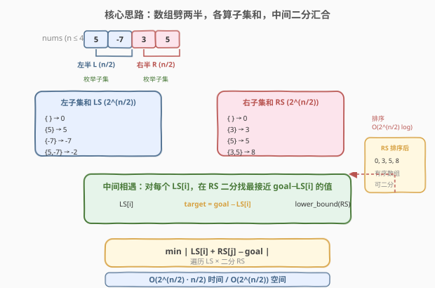
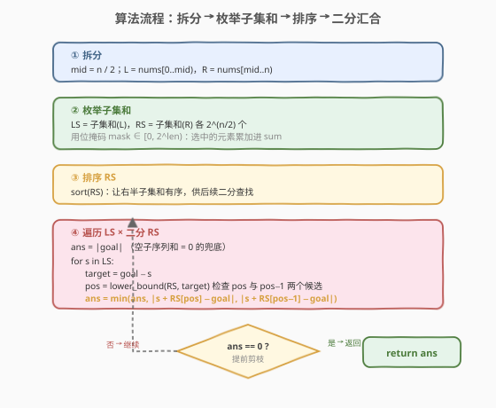

# LeetCode 最接近目标值的子序列和 题解

## 1. 题目概述

- **标题 / 题号**：最接近目标值的子序列和（#1755，hard）
- **链接**：https://leetcode.cn/problems/closest-subsequence-sum/
- **难度**：困难
- **标签**：数组、分治、Meet in the Middle、二分查找

**题意**：给你一个整数数组 `nums` 和一个目标值 `goal`。你需要从 `nums` 中选出一个**子序列**，使子序列元素总和最接近 `goal`。如果子序列和为 `sum`，需要最小化绝对差 `abs(sum - goal)`。返回 `abs(sum - goal)` 可能的最小值。

> 💡 **子序列 vs 子数组**：子序列可以**不连续**，通过移除某些元素得到；这与子数组（必须连续）不同。本题正是「不连续」这一特性，使得无法用滑动窗口/前缀和等连续区间手段，而需要从子集枚举切入。

**示例 1**：

```text
输入：nums = [5,-7,3,5], goal = 6
输出：0
解释：选择整个数组作为子序列，元素和为 6，与目标值相等，绝对差为 0。
```

**示例 2**：

```text
输入：nums = [7,-9,15,-2], goal = -5
输出：1
解释：选出子序列 [7,-9,-2]，元素和为 -4，绝对差为 abs(-4 - (-5)) = 1。
```

**示例 3**：

```text
输入：nums = [1,2,3], goal = -7
输出：7
解释：空子序列和为 0，绝对差为 abs(0 - (-7)) = 7，已是最小。
```

**约束**：

- `1 <= nums.length <= 40`
- $-10^7 \leq \text{nums}[i] \leq 10^7$
- $-10^9 \leq \text{goal} \leq 10^9$

> ⚠️ **关键约束是 n ≤ 40**：这个看似不大的上界正是本题的题眼——$2^{40} \approx 1.1 \times 10^{12}$ 直接枚举必超时，但 $2^{20} \approx 1.05 \times 10^6$ 完全可行。这暗示了**折半**的处理方向。

## 2. 解题思路

### 2.1 暴力思路：枚举所有子序列

子序列的每个元素「选/不选」二选一，共 $2^n$ 个子序列。对每个子序列求和 $S$，维护 $\min |S - \text{goal}|$。

```text
ans = |goal|              // 空子序列和 = 0 的兜底
for mask in 0 .. 2^n - 1:
    s = 按 mask 选中的元素求和
    ans = min(ans, abs(s - goal))
```

时间复杂度 $O(n \cdot 2^n)$。当 $n = 40$ 时约 $4.4 \times 10^{13}$ 次运算，**远超时限**。瓶颈在于 $2^n$ 这一指数维度无法用常规手段压缩——子序列问题没有排序/双指针那样的单调性可借。

### 2.2 核心观察：Meet in the Middle（折半枚举）



**关键转换**：把 `nums` 从中间劈成**两半**——左半 `L = nums[0..mid)`、右半 `R = nums[mid..n)`（`mid = n/2`）。任意子序列的和都可写成：

$$S = \underbrace{s_L}_{\text{左半某子集和}} + \underbrace{s_R}_{\text{右半某子集和}}$$

因为子序列的「选/不选」在两半上**完全独立**。于是：

1. **枚举左半所有子集和** `LS`：共 $2^{n/2}$ 个，存入列表。
2. **枚举右半所有子集和** `RS`：共 $2^{n/2}$ 个，存入列表后**排序**。
3. **汇合**：对每个 $s_L \in \text{LS}$，要在 `RS` 中找一个 $s_R$ 使 $s_L + s_R$ 最接近 `goal`，即 $s_R$ 最接近 $\text{target} = \text{goal} - s_L$。由于 `RS` 已排序，用**二分查找** `lower_bound` 定位，只需检查命中位置及其前一个元素两个候选。

> 💡 **为什么这比暴力快？** 暴力法把 $n$ 个维度同时枚举，$2^{40}$ 不可行。折半后，两侧各 $2^{20} \approx 10^6$，枚举 + 排序 + 二分都能在时限内完成。这正是「**Meet in the Middle**」（中间相遇）思想：把问题从中间劈开，两侧各做一半，在中间汇合。它与 [454. 四数相加 II](../0401-0500/454_四数相加%20II.md) 的分组 + 哈希同源，只是汇合手段从「哈希查补数」换成了「排序后二分找最近值」。

> ⚠️ **为什么用二分而不用哈希？** 454 题求「恰好相等」的计数，哈希 $O(1)$ 查补数即可。本题求「最接近」的值——哈希只能查精确命中，无法回答「目标值附近的最近元素」。排序 + 二分 `lower_bound` 恰好能在 $O(\log)$ 内定位目标值的插入位置，其两侧即最近候选。

### 2.3 算法流程图



核心步骤：

1. **拆分**：`mid = n / 2`，`L = nums[0..mid)`、`R = nums[mid..n)`。
2. **枚举子集和**：对每半用位掩码 `mask ∈ [0, 2^len)` 枚举所有子集，选中的元素累加成和，分别得到 `LS`、`RS` 两个列表。
3. **排序 RS**：`sort(RS)`，让右半子集和有序。
4. **遍历 LS × 二分 RS**：
   - `ans` 初始化为 `|goal|`（空子序列和为 0 的兜底）。
   - 对每个 $s_L$：`target = goal - s_L`，`pos = lower_bound(RS, target)`。
   - 检查 `RS[pos]`（若 `pos` 在范围内）与 `RS[pos-1]`（若 `pos > 0`）两个候选，更新 `ans`。
   - **剪枝**：若 `ans == 0` 已达理论下界，提前返回。

### 2.4 示例演算

![示例演算：nums=[5,−7,3,5], goal=6 → 答案 0](../images/csss_example_walkthrough.svg)

以 `nums = [5,-7,3,5]`，`goal = 6` 为例（示例 1）：

**第 1 步：拆分**（`mid = 2`）

- `L = [5, -7]`，`R = [3, 5]`

**第 2 步：枚举子集和**

| 左半 mask | 选 | $s_L$ | | 右半 mask | 选 | $s_R$ |
|-----------|-----|-------|---|-----------|-----|-------|
| 00 | `{}` | 0 | | 00 | `{}` | 0 |
| 01 | `{5}` | 5 | | 01 | `{3}` | 3 |
| 10 | `{-7}` | -7 | | 10 | `{5}` | 5 |
| 11 | `{5,-7}` | -2 | | 11 | `{3,5}` | 8 |

**第 3 步：排序 RS** → `RS = [0, 3, 5, 8]`

**第 4 步：遍历 LS × 二分 RS**（`target = goal - s_L = 6 - s_L`）

| $s_L$ | target = $6 - s_L$ | lower_bound(RS, target) | 候选 $s_R$ | $|s_L + s_R - 6|$ |
|-------|--------------------|--------------------------|-------------|-------------------|
| 0 | 6 | 指向末尾（无 ≥ 6） | RS[3] = 8 | $|0+8-6| = 2$ |
| 5 | 1 | 指向 RS[1] = 3 | RS[0] = 0 / RS[1] = 3 | $|5+0-6| = 1$ |
| -7 | 13 | 指向末尾（无 ≥ 13） | RS[3] = 8 | $|-7+8-6| = 5$ |
| **-2** | **8** | **指向 RS[3] = 8** | **RS[3] = 8（命中）** | $|-2+8-6| = \mathbf{0}$ ★ |

- `LS = {5,-7} → -2` 与 `RS = {3,5} → 8` 配对，$-2 + 8 = 6 = \text{goal}$，绝对差为 `0`。
- `ans = 0`，命中理论下界，提前返回。

> 💡 **lower_bound 检查两个候选的原理**：`lower_bound(RS, target)` 返回首个 $\geq \text{target}$ 的位置 `pos`。比 `target` 小的最大元素恰是 `RS[pos-1]`。最接近 `target` 的值必然落在 `RS[pos-1]` 与 `RS[pos]` 之间（若都存在），故两者都要比较。当 `pos` 指向末尾时，只看 `RS[pos-1]`（即最大元素）；当 `pos == 0` 时，只看 `RS[0]`（即最小元素）。

## 3. 参考代码

### C++

```cpp
class Solution {
  public:
    int minAbsDifference(vector<int>& nums, int goal) {
        int n = nums.size();
        int mid = n / 2;
        vector<int> L(nums.begin(), nums.begin() + mid);
        vector<int> R(nums.begin() + mid, nums.end());

        vector<int> LS = subsetSums(L);
        vector<int> RS = subsetSums(R);
        sort(RS.begin(), RS.end());

        int ans = abs(goal); // 空子序列和 = 0 的兜底
        for (int s : LS) {
            long long target = (long long)goal - s;
            auto it = lower_bound(RS.begin(), RS.end(), target);
            if (it != RS.end()) {
                long long sum = (long long)s + *it;
                ans = min(ans, (int)llabs(sum - goal));
            }
            if (it != RS.begin()) {
                auto pit = prev(it);
                long long sum = (long long)s + *pit;
                ans = min(ans, (int)llabs(sum - goal));
            }
            if (ans == 0) return 0; // 命中理论下界，提前剪枝
        }
        return ans;
    }

  private:
    vector<int> subsetSums(const vector<int>& arr) {
        int len = arr.size();
        vector<int> res;
        res.reserve(1 << len);
        for (int mask = 0; mask < (1 << len); ++mask) {
            long long s = 0;
            for (int i = 0; i < len; ++i) {
                if (mask & (1 << i)) s += arr[i];
            }
            res.push_back((int)s);
        }
        return res;
    }
};
```

### Python

```python
class Solution:
    def minAbsDifference(self, nums: List[int], goal: int) -> int:
        n = len(nums)
        mid = n // 2
        L, R = nums[:mid], nums[mid:]

        LS = self._subset_sums(L)
        RS = self._subset_sums(R)
        RS.sort()

        ans = abs(goal)  # 空子序列和 = 0 的兜底
        for s in LS:
            target = goal - s
            pos = bisect.bisect_left(RS, target)
            if pos < len(RS):
                ans = min(ans, abs(s + RS[pos] - goal))
            if pos > 0:
                ans = min(ans, abs(s + RS[pos - 1] - goal))
            if ans == 0:  # 命中理论下界，提前剪枝
                return 0
        return ans

    def _subset_sums(self, arr: List[int]) -> List[int]:
        res = [0]
        for x in arr:
            res += [s + x for s in res]
        return res
```

> 💡 **Python 子集和的增量生成**：`res` 初始为 `[0]`（空子集），每处理一个元素 `x`，就把现有所有和各加 `x` 追加进 `res`，相当于「不选 x」+「选 x」两分支并行。最终 `res` 恰含 $2^{\text{len}}$ 个子集和，无需位掩码，写法更 Pythonic。C++ 版则用位掩码显式枚举，便于迁移到其他语言。

> ⚠️ **溢出防护**：$s_L, s_R \in [-2 \times 10^7 \times 20, 2 \times 10^7 \times 20] = [\pm 4 \times 10^8]$，两者相加可达 $\pm 8 \times 10^8$，仍在 32 位 int 范围内（$\pm 2.1 \times 10^9$）。但 `goal - s` 的中间运算可能短暂溢出，故 C++ 中用 `long long` 承载 `target` 与求和结果再比较，更稳妥。Python 无此问题。

## 4. 复杂度分析

| 维度 | 复杂度 | 说明 |
|------|--------|------|
| 时间复杂度 | $O(n \cdot 2^{n/2})$ | 枚举两半子集和各 $O((n/2) \cdot 2^{n/2})$；排序 RS 为 $O(2^{n/2} \log 2^{n/2}) = O((n/2) \cdot 2^{n/2})$；遍历 LS × 二分 RS 为 $O(2^{n/2} \cdot \log 2^{n/2}) = O((n/2) \cdot 2^{n/2})$。三者同阶 |
| 空间复杂度 | $O(2^{n/2})$ | 存储 LS、RS 两个子集和列表，各 $2^{n/2}$ 个元素 |

> 💡 **n=40 时的量级**：$2^{20} = 1\,048\,576$，枚举约 $20 \times 10^6 \approx 2 \times 10^7$ 次基本运算，排序约 $20 \times 10^6$ 次比较，二分约 $20 \times 10^6$ 次——总量在 $10^7 \sim 10^8$ 之间， comfortably 在 1 秒时限内。若不折半，$2^{40} \approx 10^{12}$ 直接枚举需数小时，差距悬殊。

## 5. 扩展：Meet in the Middle 的适用边界与变体

### 5.1 何时该用折半？

折半枚举适用于**答案由两个独立部分组合**且**每部分规模可控**的问题。判别信号：

- 输入规模 $n$ 较小（通常 $\leq 40$），但 $2^n$ 仍过大。
- 答案可分解为「左半贡献 + 右半贡献」的二元组合。
- 汇合阶段能用哈希（求恰好相等）或排序 + 二分（求最近值/计数）。

> ⚠️ 若 $n \leq 20$，直接 $2^n$ 暴力即可，折半反而徒增常数。本题 $n \leq 40$ 正是折半的甜区（sweet spot）。

### 5.2 汇合手段：哈希 vs 排序二分

| 汇合手段 | 适用场景 | 复杂度 | 代表题 |
|----------|----------|--------|--------|
| 哈希查补数 | 求「恰好相等」的计数/判定 | $O(2^{n/2})$ | [454. 四数相加 II](https://leetcode.cn/problems/4sum-ii/) |
| 排序 + 二分 | 求「最接近」「第 K 小」「范围内计数」 | $O(2^{n/2} \cdot n/2)$ | 本题、[1755](https://leetcode.cn/problems/closest-subsequence-sum/) |
| 双指针归并 | 两半都已排序，求配对计数/最值 | $O(2^{n/2})$ | [719. 找出第 K 小的数对距离](https://leetcode.cn/problems/find-k-th-smallest-pair-distance/) 的二分答案变体 |

本题选「排序 + 二分」是因为目标是最接近值而非精确命中，`lower_bound` 能在有序数组上 $O(\log)$ 定位最近候选。

### 5.3 子集和生成的两种写法

- **位掩码法**（C++ 版）：`for mask in [0, 2^len)`，逐位判断选中并累加。直观、跨语言通用。
- **增量生成法**（Python 版）：`res = [0]`，每读入一个元素 `x`，`res += [s+x for s in res]`。等价于「不选 x」+「选 x」两分支并行，无需位运算，常数更小。

两者结果一致，选顺手的即可。

## 6. 面试要点

1. **为什么 n ≤ 40 暗示折半？**

   $2^{40} \approx 10^{12}$ 直接枚举超时，但 $2^{20} \approx 10^6$ 完全可行。当 $n$ 落在 $20 \sim 40$ 这个「暴力太大、折半正好」的区间时，Meet in the Middle 几乎是唯一出路。识别这一甜区是本题的第一步。

2. **为什么汇合用排序 + 二分，而不是哈希？**

   哈希只支持「精确查补数」（如 454 题求和为 0）。本题要求「最接近 goal」的值，需要找目标值附近的最近元素，这是有序结构 + `lower_bound` 的天然场景。排序后二分能在 $O(\log)$ 内定位插入位置，其前后两个元素即最近候选。

3. **lower_bound 之后为什么只检查 pos 和 pos-1 两个位置？**

   `lower_bound(RS, target)` 返回首个 $\geq \text{target}$ 的位置 `pos`。比 `target` 小的最大元素是 `RS[pos-1]`。由于 `RS` 单调递增，最接近 `target` 的值必然落在这两个相邻元素中（若存在），无需扫描更远。这是「有序数组上找最近值」的标准技巧。

4. **为什么要初始化 ans = abs(goal)？**

   空子序列（什么都不选）和为 0，其绝对差为 `abs(0 - goal) = abs(goal)`。这是一个合法的兜底答案——尤其当 `goal` 为负且所有元素为正时（如示例 3，`nums=[1,2,3], goal=-7`），空子序列的 `abs(goal)=7` 已是最优。不初始化它会漏掉这种情况。

5. **提前剪枝 `if ans == 0: return` 有必要吗？**

   理论上 `ans` 的下界是 0。一旦命中 0（即存在子序列和恰等于 `goal`），不可能更优，立即返回可省去后续遍历。最坏情况下不命中（如示例 2），剪枝不生效但开销可忽略。这是一种零成本的常见优化，面试中提到可加分。

6. **和 [454. 四数相加 II](../0401-0500/454_四数相加%20II.md) 的异同？**

   两者都用 Meet in the Middle——把问题从中间劈开，两侧各做一半。区别在于：454 是「四个独立数组求和为 0 的计数」，汇合用哈希 $O(1)$ 查补数；本题是「同一数组的子序列和最接近目标」，汇合用排序 + 二分找最近值。思想同源，汇合手段按需选择。

## 同类练习题

| # | 题目 | 与本题的关联 |
|---|------|-------------|
| 454 | [四数相加 II](https://leetcode.cn/problems/4sum-ii/)（[题解](../0401-0500/454_四数相加%20II.md)） | Meet in the Middle 的哈希版——分组 + 查补数，本题的「精确相等」前驱题 |
| 2035 | [将数组分成两个数组并最小化数组和的差](https://leetcode.cn/problems/partition-array-into-two-arrays-to-minimize-sum-difference/) | 同样 n ≤ 30 用折半枚举，汇合时双指针/二分找最接近半和的配对，本题的进阶变体 |
| 719 | [找出第 K 小的数对距离](https://leetcode.cn/problems/find-k-th-smallest-pair-distance/)（[题解](../0701-0800/719_找出第K小的数对距离.md)） | 排序 + 二分答案 + 双指针计数的汇合范式，与本题「排序 + 二分」同源 |
| 416 | [分割等和子集](https://leetcode.cn/problems/partition-equal-subset-sum/)（[题解](../0401-0500/416_分割等和子集.md)） | 子集和问题的 DP 版（n 大、值小），对照本题的折半版（n 小、值大），体会两种子集和求解视角的适用边界 |
| 1498 | [满足条件的子序列数目](https://leetcode.cn/problems/number-of-subsequences-that-satisfy-the-given-sum-condition/) | 排序 + 双指针处理子序列的最值组合，与本题「子序列 + 最接近」对照不同汇合手段 |
