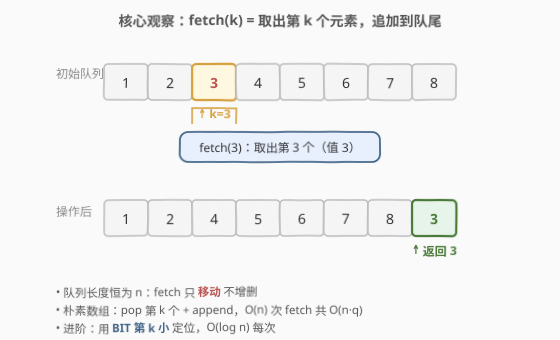
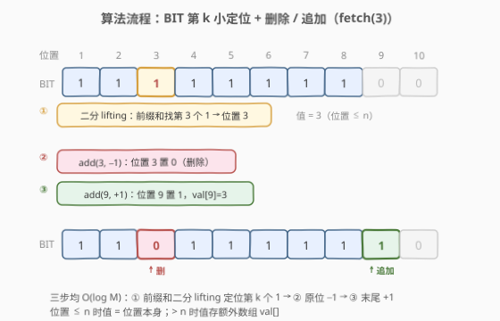
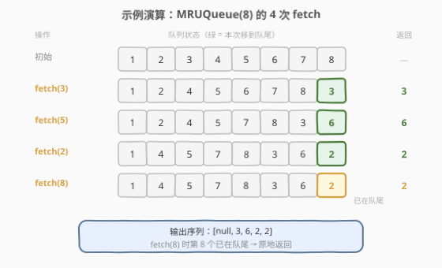

# LeetCode 设计最近使用的队列 题解

## 1. 题目概述

- **标题 / 题号**：设计最近使用的队列（#1756，medium）
- **链接**：https://leetcode.cn/problems/design-most-recently-used/
- **难度**：中等
- **标签**：设计、树状数组、二分查找

**题意**：设计一个类似队列的数据结构，每次 `fetch` 将**第 k 个元素**（1 下标）取出并移动到**队尾**，返回该元素。

实现 `MRUQueue` 类：

- `MRUQueue(int n)`：用 `n` 个元素 `[1, 2, 3, ..., n]` 初始化队列。
- `fetch(int k)`：将第 `k` 个元素（1 下标）移到队尾并返回它。

**示例 1**：

```text
输入：
["MRUQueue", "fetch", "fetch", "fetch", "fetch"]
[[8], [3], [5], [2], [8]]
输出：
[null, 3, 6, 2, 2]

解释：
MRUQueue q = new MRUQueue(8);        // [1, 2, 3, 4, 5, 6, 7, 8]
q.fetch(3);  // 第 3 个是 3 → [1,2,4,5,6,7,8,3]，返回 3
q.fetch(5);  // 第 5 个是 6 → [1,2,4,5,7,8,3,6]，返回 6
q.fetch(2);  // 第 2 个是 2 → [1,4,5,7,8,3,6,2]，返回 2
q.fetch(8);  // 第 8 个是 2，已在队尾 → 原地返回 2
```

**约束**：

- $1 \le n \le 2000$
- $1 \le k \le n$
- 最多调用 `fetch` **2000** 次

**进阶**：找到每次 `fetch` 优于 $O(n)$ 的算法。

> 💡 **关键直觉**：队列长度恒为 $n$（只移动不增删），朴素做法用数组 `pop + append` 即可 $O(n)$ 解决。进阶要求更快——核心瓶颈是"找第 k 个"，可用**树状数组前缀和 + 二分 lifting** 在 $O(\log n)$ 内定位第 k 个 1，再把该位清零、在末尾新位置置一。

## 2. 解题思路

### 2.1 暴力思路：数组模拟

最直接的做法是用一个数组（或 `list`）维护队列：

- 初始化：`q = [1, 2, ..., n]`。
- `fetch(k)`：`val = q.pop(k-1)`，`q.append(val)`，返回 `val`。

`pop` 引起的元素前移是 $O(n)$，$q$ 次 `fetch` 共 $O(n \cdot q)$。本题 $n, q \le 2000$，$O(4 \times 10^6)$ 完全可过。但进阶要求更好。

### 2.2 核心观察：BIT 第 k 小 + 动态扩位



把队列的**位置**而非**值**作为管理对象。想象一条无限长的位置带，每个位置要么"有元素"（1）要么"空"（0）：

- 初始：位置 $1 \ldots n$ 各放一个元素（值为位置号本身），位置 $> n$ 为空。
- `fetch(k)` 的本质：**找第 k 个"有元素"的位置** $p$，取出它的值，把位置 $p$ 清空，在**末尾下一个空位**新放一个元素。

这恰好是**树状数组（BIT）的动态第 k 小**问题：

- BIT 维护位置带的 0/1 前缀和：`query(p)` = 位置 $1 \ldots p$ 中有元素的个数。
- **找第 k 个 1**：二分 lifting，从最高位开始贪心跳，$O(\log M)$。
- **取出**：`add(p, -1)`。
- **追加**：`add(tail, +1)`，其中 `tail` 递增（每次 fetch 后 +1），值存额外数组 `val[tail]`。

> 💡 **值的读取规则**：位置 $p \le n$ 时，元素值 = $p$ 本身（初始就放在那）；位置 $p > n$ 时，元素值 = `val[p]`（被 fetch 移过来的）。

**空间预算**：总位置数 = $n + q \le 4000$，BIT 数组开 $n + q + 2$ 即可。

### 2.3 算法流程图



以 `n=8, fetch(3)` 为例：

1. **二分 lifting 找第 3 个 1** → 位置 3（BIT 前缀和 `query(3) = 3 ≥ 3` 且 `query(2) = 2 < 3`）。
2. **读值**：位置 3 ≤ n=8，故值 = 3。
3. **删除**：`add(3, -1)`，位置 3 的 BIT 值从 1 → 0。
4. **追加**：`tail` 从 8 → 9，`add(9, +1)`，`val[9] = 3`。
5. 返回 3。

三步各 $O(\log M)$，总计 $O(\log M)$。

### 2.4 示例演算

以示例 1（`n=8`，4 次 `fetch`）完整演算：



| 步骤 | 操作 | BIT 中有元素的位置 | 第 k 个位置 | 取出值 | 追加位置 | 返回 |
|------|------|--------------------|-------------|--------|----------|------|
| 初始 | — | $\{1,2,3,4,5,6,7,8\}$ | — | — | — | — |
| ① | `fetch(3)` | $\{1,2,4,5,6,7,8,9\}$ | 3 | 3 | 9（`val[9]=3`） | 3 |
| ② | `fetch(5)` | $\{1,2,4,5,7,8,9,10\}$ | 6 | 6 | 10（`val[10]=6`） | 6 |
| ③ | `fetch(2)` | $\{1,4,5,7,8,9,10,11\}$ | 2 | 2 | 11（`val[11]=2`） | 2 |
| ④ | `fetch(8)` | $\{1,4,5,7,8,9,10,12\}$ | 11 | 2（`val[11]`） | 12（`val[12]=2`） | 2 |

> ⚠️ **第 4 步注意**：`fetch(8)` 找到第 8 个 1 在位置 11（`val[11]=2`），它逻辑上已是队尾。BIT 仍会执行"删 11 → 加 12"，队尾元素从位置 11 换到 12，值不变——这是**统一处理**，无需特判"已在队尾"。

## 3. 参考代码

### Python（暴力 + BIT 两版）

```python
# ---------- 暴力版：O(n) per fetch ----------
class MRUQueue:
    def __init__(self, n: int):
        self.q = list(range(1, n + 1))

    def fetch(self, k: int) -> int:
        v = self.q.pop(k - 1)
        self.q.append(v)
        return v


# ---------- BIT 版：O(log M) per fetch ----------
class MRUQueue:
    def __init__(self, n: int):
        self.n = n
        self.sz = n + 2001              # n + 最多 fetch 次数 + 余量
        self.bit = [0] * (self.sz + 1)
        self.val = [0] * (self.sz + 1)
        for i in range(1, n + 1):
            self._add(i, 1)
        self.tail = n                   # 下一个追加位置

    def _add(self, i: int, delta: int) -> None:
        while i <= self.sz:
            self.bit[i] += delta
            i += i & (-i)

    def _kth(self, k: int) -> int:
        """前缀和二分 lifting：找第 k 个 1 的位置"""
        pos, r = 0, 1
        while (r << 1) <= self.sz:
            r <<= 1
        while r:
            nxt = pos + r
            if nxt <= self.sz and self.bit[nxt] < k:
                k -= self.bit[nxt]
                pos = nxt
            r >>= 1
        return pos + 1

    def fetch(self, k: int) -> int:
        p = self._kth(k)
        v = p if p <= self.n else self.val[p]
        self._add(p, -1)
        self.tail += 1
        self._add(self.tail, 1)
        self.val[self.tail] = v
        return v
```

### C++（BIT 版）

```cpp
class MRUQueue {
    int n, sz, tail;
    vector<int> bit, val;

    void add(int i, int delta) {
        for (; i <= sz; i += i & (-i))
            bit[i] += delta;
    }

    int kth(int k) {
        int pos = 0, r = 1;
        while (r * 2 <= sz) r *= 2;
        for (; r > 0; r >>= 1) {
            int nxt = pos + r;
            if (nxt <= sz && bit[nxt] < k) {
                k -= bit[nxt];
                pos = nxt;
            }
        }
        return pos + 1;
    }

public:
    MRUQueue(int n)
        : n(n), sz(n + 2001), tail(n), bit(sz + 1, 0), val(sz + 1, 0) {
        for (int i = 1; i <= n; ++i) add(i, 1);
    }

    int fetch(int k) {
        int p = kth(k);
        int v = (p <= n) ? p : val[p];
        add(p, -1);
        ++tail;
        add(tail, 1);
        val[tail] = v;
        return v;
    }
};
```

> 💡 **实现细节**：① BIT 数组大小 = `n + max_calls + 2`，给每次 fetch 的追加预留位置。② `_kth` 的二分 lifting 从"≤ sz 的最大 2 的幂"起跳，逐位减半，等价于在 BIT 的树形结构上自顶向下走，$O(\log M)$。③ `tail` 单调递增，保证追加位置不与已占用位置冲突。④ 无需特判"第 k 个已在队尾"——删旧追加新，值不变，逻辑统一。

## 4. 复杂度分析

| 维度 | 暴力数组 | BIT 版 |
|------|----------|--------|
| **单次 fetch** | $O(n)$（pop 引起前移） | $O(\log M)$，$M = n + q$ |
| **总时间** | $O(n \cdot q) \le 4 \times 10^6$ | $O(q \log M) \approx 2000 \times 12$ |
| **空间** | $O(n)$ | $O(n + q)$ |
| **适用场景** | $n, q$ 较小（本题可过） | $n, q$ 较大或要求进阶 |

> ⚠️ 暴力版 `vector::erase` 在中间删除后需要把后续元素逐个前移，这是 $O(n)$ 的根源。BIT 把"找位置"和"增删"都压到对数级，代价是多用 $O(q)$ 额外空间存储追加位置。

## 5. 扩展：分块（sqrt decomposition）

除 BIT 外，**分块**也是本题的经典进阶解法，每次 $O(\sqrt{n})$：

- 将队列分成若干块，每块大小 $B \approx \sqrt{n}$，用一个 `vector<vector<int>>` 管理。
- `fetch(k)`：逐块累加大小定位第 k 个元素所在块 $b$ 与块内下标 $j$，从块 $b$ 删除该元素，追加到**最后一块**。
- 若某块删空则移除；若最后一块过大（$> 2B$）则分裂。

| 维度 | 复杂度 | 说明 |
|------|--------|------|
| 单次 fetch | $O(\sqrt{n})$ | 扫块 $O(n/B)$ + 块内删 $O(B)$，取 $B = \sqrt{n}$ 最优 |
| 总时间 | $O(q\sqrt{n})$ | |
| 空间 | $O(n)$ | |

> 💡 **BIT vs 分块**：BIT 查改都是 $O(\log n)$，比分块的 $O(\sqrt{n})$ 更优；但分块思路直观、常数小、不依赖前缀和，在面试中作为"先给出再优化"的中间方案很实用。两者都能通过本题。

## 6. 面试要点

1. **朴素数组为什么是 $O(n)$？瓶颈在哪？**

   > `pop(k-1)` 需要把下标 $k$ 之后的元素逐个前移以填补空缺，这是 $O(n)$ 的线性扫描。`append` 到末尾是 $O(1)$ 摊还。因此瓶颈在"删除中间元素引起的前移"。

2. **BIT 如何实现"找第 k 个元素"？**

   > BIT 的 `tree[i]` 维护位置带上 0/1 的前缀和。找第 k 个 1 等价于找最小位置 $p$ 使前缀和 $\ge k$。用**二分 lifting**：从最高 2 的幂起跳，若 `tree[pos+r] < k` 说明第 k 个在更右侧，跳过去并减去已覆盖的 1 的个数。$O(\log M)$。

3. **追加到队尾如何处理？位置会冲突吗？**

   > 维护单调递增的 `tail` 指针，初始为 $n$，每次 fetch 后 `tail += 1`。新位置一定 $> n$ 且未被占用，不会冲突。位置 $> n$ 的元素值存在额外数组 `val[]` 中。

4. **第 k 个已在队尾时需要特判吗？**

   > 不需要。BIT 统一执行"删旧位置 → 加新位置（tail+1）"。队尾元素从位置 $p$ 换到 $p' = \text{tail}+1$，值不变，逻辑上仍排在最后。特判反而增加分支、易出错。

5. **如果 $n$ 高达 $10^9$ 但 fetch 次数很少（如 $\le 10^3$），怎么做？**

   > 不能开 $O(n)$ 数组。用**动态结构**（有序 map / 平衡树）只记录被改动过的位置，配合离散化；或用 sqrt-decomposition 只维护"被取出的元素"列表 + 数学推导还原未被触及的原始位置。核心思想：大部分元素仍在原位 $1 \ldots n$，只需特殊处理被 fetch 过的少数元素。

> 💡 **一句话总结**：BIT 维护位置带的 0/1 前缀和，二分 lifting 找第 k 个 1，删旧加新，每次 $O(\log n)$；暴力数组 $O(n)$ 先写出来再优化。

## 同类练习题

| # | 题目 | 与本题的关联 |
|---|------|-------------|
| 1409 | [查询带键的排列](https://leetcode.cn/problems/queries-on-a-permutation-with-key/) | 几乎同构——给定查询序列，每次把第 $q_i$ 个元素移到**最前**，经典 BIT 解法，对照本题移到队尾 |
| 315 | [计算右侧小于当前元素的个数](https://leetcode.cn/problems/count-of-smaller-numbers-after-self/)（[题解](../0301-0400/315_计算右侧小于当前元素的个数.md)） | BIT 维护值域前缀和求逆序对，本题的 BIT 基础母题 |
| 378 | [有序矩阵中第 K 小的元素](https://leetcode.cn/problems/kth-smallest-element-in-a-sorted-matrix/)（[题解](../0301-0400/378_有序矩阵中第K小的元素.md)） | 二分值域 + 计数找第 k 小，对照 BIT 二分 lifting 找第 k 个 1 |
| 146 | [LRU 缓存](https://leetcode.cn/problems/lru-cache/)（[题解](../0101-0200/146_LRU缓存.md)） | 设计类缓存题，哈希表 + 双向链表 $O(1)$，对照本题的"最近使用"语义但不同数据结构选型 |
| 460 | [LFU 缓存](https://leetcode.cn/problems/lfu-cache/)（[题解](../0401-0500/460_LFU缓存.md)） | 频率桶 + 双向链表的设计难题，扩展设计类题目的套路视野 |
