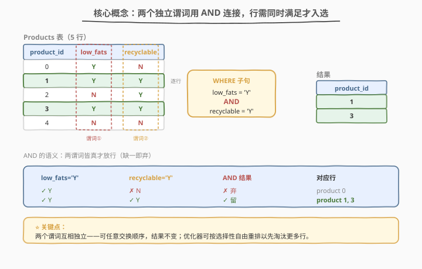
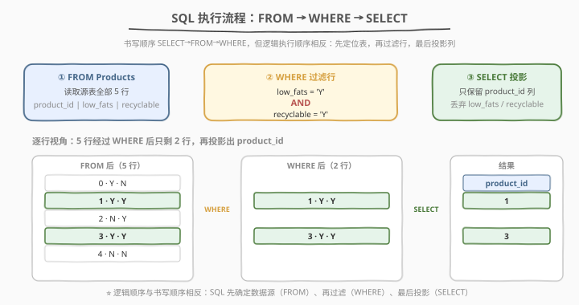
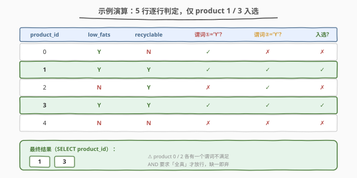

# 可回收且低脂的产品

- **题目名称**：可回收且低脂的产品
- **链接**：[1757. 可回收且低脂的产品](https://leetcode.cn/problems/recyclable-and-low-fat-products/)
- **难度**：简单
- **标签**：数据库、SQL、`WHERE`、`AND`、谓词过滤、投影

## 1. 题目概述

给定 `Products` 表，每行记录一个产品的 `product_id`、是否低脂（`low_fats`，枚举 `'Y'`/`'N'`）、是否可回收（`recyclable`，枚举 `'Y'`/`'N'`）。要求**找出既是低脂又是可回收的产品编号**，只返回 `product_id` 列，结果无顺序要求。

**表结构**：

```text
Table: Products
+-------------+---------+
| Column Name | Type    |
+-------------+---------+
| product_id  | int     |
| low_fats    | enum    |
| recyclable  | enum    |
+-------------+---------+
product_id 是该表的主键。
low_fats 取值 ('Y', 'N')：'Y' 低脂，'N' 非低脂。
recyclable 取值 ('Y', 'N')：'Y' 可回收，'N' 不可回收。
```

**示例 1**：

```text
输入：
Products 表：
+-------------+----------+------------+
| product_id  | low_fats | recyclable |
+-------------+----------+------------+
| 0           | Y        | N          |
| 1           | Y        | Y          |
| 2           | N        | Y          |
| 3           | Y        | Y          |
| 4           | N        | N          |
+-------------+----------+------------+

输出：
+-------------+
| product_id  |
+-------------+
| 1           |
| 3           |
+-------------+

解释：只有 product 1 与 3 同时满足低脂且可回收。
```

**约束条件**：

- `product_id` 为整数且为主键（无重复）
- `low_fats`、`recyclable` 为枚举，仅取 `'Y'` 或 `'N'`
- 结果无顺序要求

> 💡 本题是 LeetCode **最简单的 SQL 题**——一行 `WHERE ... AND ...` 即可解决。它常作为 SQL 入门第一题，用来建立「谓词过滤 + 投影」的基础心智模型：用 `WHERE` 按**行**过滤、用 `SELECT` 按**列**投影，二者职责分离。

---

## 2. 解题思路

### 2.1 暴力思路：取回全表后应用层过滤

最直觉的做法：`SELECT * FROM Products` 把整张表读进应用程序，再用 `if`/`for` 逐行判断 `low_fats == 'Y' and recyclable == 'Y'`，最后收集 `product_id`。

```text
for row in Products:
    if row.low_fats == 'Y' and row.recyclable == 'Y':
        collect row.product_id
```

这样做能得出正确答案，但把**过滤职责推给了应用层**：网络传输了全部列、全部行，数据库的计算能力（索引、谓词下推）完全浪费。正确做法是把过滤条件下推到 SQL 的 `WHERE` 子句，让数据库在存储层就淘汰不满足的行。

### 2.2 核心观察：两个独立谓词用 AND 连接



**关键洞察**：题目要求「低脂**且**可回收」，即两个条件**同时成立**。这天然对应 SQL 的 `AND` 连接符——每个条件是一个**谓词**（predicate），`AND` 要求两者皆真才放行该行。

- **谓词①**：`low_fats = 'Y'`
- **谓词②**：`recyclable = 'Y'`
- **组合**：`low_fats = 'Y' AND recyclable = 'Y'`

> 💡 **两个谓词互相独立**：它们分别考察不同列，互不影响。这意味着：① 顺序可交换（`A AND B` ≡ `B AND A`），结果不变；② 优化器可按**选择性**（selectivity）自由重排——把淘汰更多行的谓词先执行，尽早缩小中间结果。例如若 `'Y'` 在 `recyclable` 列更稀疏，优化器会先评估谓词②。

> ⚠️ **枚举值比较要用字符串字面量**：`'Y'` 必须加单引号，写成 `low_fats = Y` 会把 `Y` 当成列名而报错。枚举类型在比较时与字符串字面量等价。

### 2.3 算法流程图



SQL 的**逻辑执行顺序**与书写顺序相反：

| 步骤 | 子句 | 作用 |
|------|------|------|
| ① | `FROM Products` | 定位数据源，读取源表全部行 |
| ② | `WHERE low_fats = 'Y' AND recyclable = 'Y'` | 按谓词过滤行，只保留同时满足两条件的行 |
| ③ | `SELECT product_id` | 投影，只输出 `product_id` 列，丢弃 `low_fats`/`recyclable` |

> 💡 **书写顺序 vs 执行顺序**：SQL 要求先写 `SELECT` 再写 `FROM` 再写 `WHERE`，但引擎实际执行是 `FROM → WHERE → SELECT`。理解这一点能解释为什么 `WHERE` 里不能用 `SELECT` 中定义的别名——`WHERE` 执行时 `SELECT` 还没发生。

### 2.4 示例演算

以示例 1 的 5 行数据为例，逐行评估两个谓词：



| product_id | low_fats | recyclable | 谓词① `'Y'?` | 谓词② `'Y'?` | AND 入选? |
|------------|----------|------------|---------------|---------------|-----------|
| 0 | Y | N | ✓ | ✗ | ✗ |
| 1 | Y | Y | ✓ | ✓ | ✓ |
| 2 | N | Y | ✗ | ✓ | ✗ |
| 3 | Y | Y | ✓ | ✓ | ✓ |
| 4 | N | N | ✗ | ✗ | ✗ |

> 💡 **product 0 与 product 2 是「半通过」陷阱**：它们各满足一个谓词但不同时满足。`AND` 的语义是「全真才真」，缺一即弃——这与 `OR`（「至少一真」）恰好相反。若误用 `OR`，product 0、2 也会入选，答案错误。

---

## 3. 参考代码

### SQL（解法 A：`WHERE` + `AND`，推荐）

```sql
SELECT product_id
FROM Products
WHERE low_fats = 'Y' AND recyclable = 'Y';
```

> 💡 **写法要点**：
> - **`SELECT product_id`**：只投影需要的列，不返回 `low_fats`/`recyclable`，减少传输与 I/O。
> - **`FROM Products`**：定位源表。
> - **`WHERE low_fats = 'Y' AND recyclable = 'Y'`**：两个谓词用 `AND` 连接，行需同时满足。
> - **`'Y'` 加单引号**：枚举值按字符串字面量比较，不加引号会被当作列名。
> - ✓ **最推荐**：语义清晰、跨数据库通用，可被优化器走索引加速。

### SQL（解法 B：两个 `WHERE` 条件分行，等价写法）

```sql
SELECT product_id
FROM Products
WHERE low_fats = 'Y'
  AND recyclable = 'Y';
```

> 💡 **解法 B 与解法 A 完全等价**：只是把 `AND` 拆到新行，可读性更好（条件多时易维护）。SQL 解析器对换行不敏感，二者生成相同执行计划。

### Python（pandas）

```python
import pandas as pd

def find_products(products: pd.DataFrame) -> pd.DataFrame:
    mask = (products['low_fats'] == 'Y') & (products['recyclable'] == 'Y')
    return products.loc[mask, ['product_id']]
```

> 💡 **pandas 对照**：
> - `(products['low_fats'] == 'Y')` 产生布尔 Series，对应谓词①。
> - `&` 对应 SQL 的 `AND`（注意 pandas 用位运算符 `&` 而非 `and`，且必须用括号分组）。
> - `products.loc[mask, ['product_id']]` 对应 `WHERE` 过滤 + `SELECT` 投影，返回 `DataFrame`（双层 `[]` 保留列名为 DataFrame 而非 Series）。

---

## 4. 复杂度分析

| 维度 | 复杂度 | 说明 |
|------|--------|------|
| 时间 | $O(n)$ | 全表扫描逐行评估两个 $O(1)$ 谓词，$n$ 为表行数；有索引时可降至 $O(\log n + k)$ |
| 空间 | $O(k)$ | 仅输出 $k$ 个满足条件的 `product_id`，$k \le n$ |

> - **无索引**：数据库顺序扫描每行，对每行做两次字符串比较，总 $O(n)$。
> - **有索引**：若在 `(low_fats, recyclable)` 上建复合索引，且 `'Y'` 在两列都较稀疏，引擎可走索引范围扫描直接定位满足行，无需读全表。覆盖索引（含 `product_id`）甚至可只读索引不回表。
> - **选择性**：谓词的选择性（满足条件的行占比）决定先评估哪个更划算。`'Y'` 占比越低，该谓词越「强」，优化器倾向先评估它。

---

## 5. 扩展：AND / OR 语义、索引与谓词下推

### 5.1 AND 与 OR 的真值表对比

`AND`/`OR` 是 SQL 布尔逻辑的两大连接符，语义对偶：

| low_fats='Y' | recyclable='Y' | `AND` 结果 | `OR` 结果 |
|--------------|----------------|------------|-----------|
| ✓ | ✓ | ✓ | ✓ |
| ✓ | ✗ | ✗ | ✓ |
| ✗ | ✓ | ✗ | ✓ |
| ✗ | ✗ | ✗ | ✗ |

> ⚠️ 本题要求「**既是**低脂**又是**可回收」，是 `AND`；若题目改为「低脂**或**可回收」，则用 `OR`。误用 `OR` 会让 product 0、2 错误入选。

### 5.2 索引策略

| 索引方案 | 适用场景 | 效果 |
|----------|----------|------|
| 无索引 | 表小（如本题 5 行） | 全表扫描 $O(n)$，开销可忽略 |
| 单列索引 `(low_fats)` | `low_fats='Y'` 选择性高 | 先按 `low_fats` 定位子集，再过滤 `recyclable` |
| 复合索引 `(low_fats, recyclable)` | 两谓词联合选择性高 | 一次索引范围扫描定位同时满足行，最优 |
| 覆盖索引 `(low_fats, recyclable, product_id)` | 只需 `product_id` | 索引即含全部所需列，无需回表（仅 InnoDB 聚簇索引外） |

> 💡 **复合索引列序**：把**选择性高**（`'Y'` 占比低）的列放前面，让索引前缀尽早缩小范围。若 `recyclable='Y'` 比 `low_fats='Y'` 更稀疏，建 `(recyclable, low_fats)` 更优。但等值条件的复合索引在两列均为等值匹配时，列序对**能否命中**影响较小（均可命中），主要影响范围扫描的顺序。

### 5.3 谓词下推

把过滤条件尽量下推到**最靠近数据源**的位置（存储引擎层），是数据库与查询引擎（如 Spark/Presto）的通用优化思想。对比两种写法：

```sql
-- ✗ 推荐：谓词在 SQL 层，数据库可走索引、可下推到存储引擎
SELECT product_id FROM Products WHERE low_fats = 'Y' AND recyclable = 'Y';

-- ✗ 不推荐：全表读入应用层再过滤，浪费 I/O 与网络
SELECT * FROM Products;  -- 然后在代码里 if 过滤
```

> 💡 本题虽小，却体现了「**把计算推向数据、而非把数据拉向计算**」的数据库设计哲学——这正是 MapReduce/Spark 等分布式引擎「谓词下推」优化规则的微观缩影。

---

## 6. 面试要点

1. **`WHERE` 和 `SELECT` 的职责有何不同？为什么过滤要在 `WHERE` 而非 `SELECT`？**

   > `WHERE` 按**行**过滤（决定哪些行进入结果），`SELECT` 按**列**投影（决定输出哪些列）。过滤应在 `WHERE` 做，因为数据库可借索引在存储层淘汰行，减少 I/O；若先 `SELECT *` 取回全表再在应用层过滤，则浪费网络传输与数据库优化能力。本题只输出 `product_id`，但过滤靠 `low_fats`/`recyclable`，两者职责分离。

2. **`AND` 和 `OR` 的区别？本题为什么用 `AND`？**

   > `AND` 要求**所有**谓词皆真才放行；`OR` 要求**至少一个**为真。题目说「既是低脂又是可回收」，两条件需同时成立，故用 `AND`。若误用 `OR`，product 0（低脂不可回收）、product 2（可回收非低脂）会错误入选。

3. **SQL 的书写顺序和执行顺序有何不同？**

   > 书写顺序 `SELECT → FROM → WHERE`，逻辑执行顺序 `FROM → WHERE → SELECT`：先定位表、再过滤行、最后投影列。这解释了为何 `WHERE` 中不能用 `SELECT` 定义的别名（如 `SELECT product_id AS pid ... WHERE pid = 1` 会报错）——执行 `WHERE` 时 `SELECT` 尚未发生。

4. **`low_fats = 'Y'` 为什么 `'Y'` 要加引号？不加会怎样？**

   > `'Y'` 是字符串字面量，加单引号告诉数据库这是值而非列名。不加引号写成 `low_fats = Y`，数据库会把 `Y` 当作列名，报「未知列」错误。这是 SQL 与编程语言字面量规则的差异：字符串值必须用引号界定。

5. **如果表很大（千万行），如何优化这个查询？**

   > 在 `(low_fats, recyclable)` 上建复合索引，让引擎走索引范围扫描直接定位同时满足 `'Y'` 的行，避免全表扫描；若索引覆盖 `product_id`，可只读索引不回表。列序上把选择性高（`'Y'` 占比低）的列放前。若两列 `'Y'` 占比都高（如 90%），索引收益有限，全表扫描反而可能更优——需看实际数据分布。

> 💡 **一句话总结**：1757 是 SQL 「谓词过滤 + 投影」的入门母题——`SELECT product_id FROM Products WHERE low_fats='Y' AND recyclable='Y'`。三大要点：① `WHERE` 按**行**过滤、`SELECT` 按**列**投影，职责分离；② 两个独立谓词用 `AND` 连接，全真才放行；③ 枚举值比较要加单引号。

---

## 7. 同类练习题

- [584. 寻找用户推荐人](https://leetcode.cn/problems/find-customer-referee/)：单谓词 `WHERE referee_id <> 6`（含 `NULL` 处理），巩固 `WHERE` 行过滤基础
- [595. 大的国家](https://leetcode.cn/problems/big-countries/)：多谓词 `WHERE area>=3000000 OR (population>=25000000 AND gdp>=20000000)`，对照本题理解 `AND`/`OR` 组合
- [1148. 文章浏览 I](https://leetcode.cn/problems/article-views-i/)：`WHERE author_id = viewer_id` + `DISTINCT`，在过滤基础上引入去重投影
- [1683. 无效的推文](https://leetcode.cn/problems/invalid-tweets/)（[题解](../1601-1700/1683_无效的推文.md)）：`WHERE CHAR_LENGTH(content) > 140`，单谓词 + 函数过滤，同题号区间的 SQL 入门题
- [197. 上升的温度](https://leetcode.cn/problems/rising-temperature/)：`WHERE` + 自连接 + `DATEDIFF`，在谓词过滤基础上叠加跨行比较
