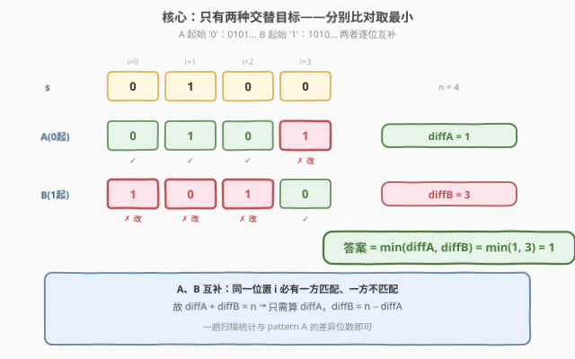
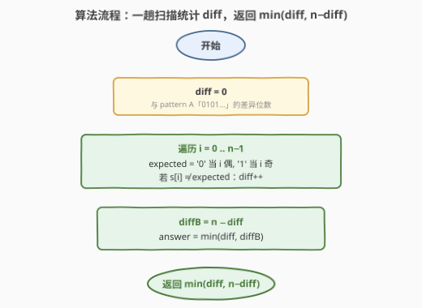
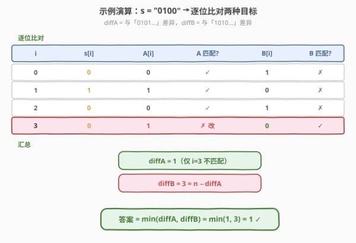

# LeetCode 生成交替二进制字符串的最少操作数 题解

## 1. 题目概述

- **标题 / 题号**：生成交替二进制字符串的最少操作数（#1758，easy）
- **链接**：https://leetcode.cn/problems/minimum-changes-to-make-alternating-binary-string/
- **难度**：简单
- **标签**：字符串、贪心

**题意**：给定一个仅由 `'0'` 和 `'1'` 组成的字符串 `s`。一次操作可以把任意一个字符翻转（`'0'` ↔ `'1'`）。**交替二进制字符串**定义为任意两个相邻字符都不相等的字符串（即形如 `"010101…"` 或 `"101010…"`）。返回使 `s` 成为交替字符串所需的最少操作数。

**示例 1**：

```text
输入：s = "0100"
输出：1
解释：把末尾的 '0' 翻成 '1'，得到 "0101"，即为交替串。
```

**示例 2**：

```text
输入：s = "10"
输出：0
解释："10" 已是交替串，无需操作。
```

**示例 3**：

```text
输入：s = "1111"
输出：2
解释：可改成 "1010" 或 "0101"，均需翻转 2 个字符。
```

**约束**：

- $1 \le \text{s.length} \le 10^4$
- `s[i]` 为 `'0'` 或 `'1'`

> 💡 **关键结构**：长度为 $n$ 的交替串**只有两种**——起始字符确定后整串就被锁定（`"0101…"` 或 `"1010…"`）。候选目标数恒为 2，与 $n$ 无关。这是「枚举所有目标再取最小」的强烈信号，且候选数极小可一并比较。

## 2. 解题思路

### 2.1 暴力思路：枚举两种目标分别统计差异

最直觉的做法：要使串交替，第 0 位可以是 `'0'` 或 `'1'`，定了第 0 位后续全确定。于是分别假设目标为 `"0101…"` 和 `"1010…"`，逐位统计与 `s` 的差异位数，取两者较小值。

```text
ans = ∞
for start in {0, 1}:                  # 目标起始字符
    diff = 0
    for i in 0 .. n-1:
        expected = start if i 偶 else 1-start
        if s[i] != expected: diff += 1
    ans = min(ans, diff)
return ans
```

时间 $O(n)$、空间 $O(1)$。其实这已经是最优复杂度！但还能再省一半常数。

> ⚠️ **症结（仅常数层面）**：两次外层循环分别独立统计差异，但两个目标是**逐位互补**的——同一位置若与 `"0101…"` 匹配，则必然与 `"1010…"` 不匹配。重复遍历两遍 `s` 浪费了这层结构。

### 2.2 核心观察：两目标互补，差异位数之和为 n



关键洞察：设

- $\text{diffA}$ = `s` 与 `"0101…"`（起始 `'0'`）的差异位数
- $\text{diffB}$ = `s` 与 `"1010…"`（起始 `'1'`）的差异位数

由于两个目标在**每一个位置**都取相反字符，对任意 $i$：`s[i]` 恰与其中一个匹配、与另一个不匹配。因此

$$
\text{diffA} + \text{diffB} = n \qquad \Longrightarrow \qquad \text{diffB} = n - \text{diffA}
$$

于是只需一趟扫描算出 $\text{diffA}$，答案即

$$
\text{answer} = \min(\text{diffA},\; n - \text{diffA})
$$

> 💡 **为什么只有两种目标？** 交替串的约束是 $s[i] \ne s[i+1]$，一旦 $s[0]$ 确定，$s[1]$ 必为 $1-s[0]$，$s[2]$ 又回到 $s[0]$……整串由首位唯一决定。$s[0] \in \{0,1\}$ 故只有 2 个候选。这是「约束传递」的典型——局部约束沿链路传播把自由度压到 1。
>
> 💡 **与 1748 的对照**：1748「唯一元素的和」第二趟遍历值域而非 `nums` 以天然去重；本题利用互补关系把两次遍历压成一次。两者都是「利用问题结构消除冗余遍历」的同一思路。

### 2.3 算法流程图



1. **初始化**：`diff = 0`（与 `"0101…"` 的差异位数）。
2. **一趟扫描**：遍历 $i = 0 \ldots n-1$，期望字符 `expected = '0'` 当 $i$ 偶、`'1'` 当 $i$ 奇；若 `s[i] != expected` 则 `diff++`。
3. **互补换算**：`diffB = n - diff`。
4. **终止**：返回 $\min(\text{diff}, \text{diffB})$。

单趟线性，每位 $O(1)$ 比较。

### 2.4 示例演算

以示例 1 `s = "0100"`（$n=4$）为例：



**逐位比对**（A = `"0101…"`，B = `"1010…"`）：

| $i$ | `s[i]` | `A[i]` | A 匹配? | `B[i]` | B 匹配? |
|-----|--------|--------|---------|--------|---------|
| $0$ | `0` | `0` | ✓ | `1` | ✗ |
| $1$ | `1` | `1` | ✓ | `0` | ✗ |
| $2$ | `0` | `0` | ✓ | `1` | ✗ |
| $3$ | `0` | `1` | ✗ | `0` | ✓ |

- $\text{diffA} = 1$（仅位置 3 不匹配）
- $\text{diffB} = 3$（位置 0、1、2 不匹配），亦等于 $n - \text{diffA} = 4 - 1 = 3$ ✓
- 答案 $= \min(1, 3) = 1$ ✓

> 💡 注意每一行的「A 匹配?」与「B 匹配?」必为一✓一✗，这正是互补关系的直观体现，也是 `diffA + diffB = n` 成立的微观基础。

## 3. 参考代码

### C++

```cpp
class Solution {
public:
    int minOperations(string s) {
        int diff = 0, n = s.size();
        for (int i = 0; i < n; ++i) {
            char expected = (i % 2 == 0) ? '0' : '1';
            if (s[i] != expected) ++diff;
        }
        return min(diff, n - diff);
    }
};
```

### Python

```python
class Solution:
    def minOperations(self, s: str) -> int:
        diff = sum(1 for i, c in enumerate(s)
                   if c != ('0' if i % 2 == 0 else '1'))
        return min(diff, len(s) - diff)
```

> 💡 **写法对照**：两版逻辑一致——`diff` 统计 `s` 与 `"0101…"` 的差异位数，答案取 `min(diff, n - diff)`。Python 用生成器 + `sum` 一行完成统计；C++ 用显式循环更直观。
>
> ⚠️ **不必两次遍历**：朴素写法会分别统计与两个目标的差异再取 `min`，虽仍是 $O(n)$ 但常数翻倍。利用互补关系 `diffB = n - diffA` 可省掉第二次遍历。

## 4. 复杂度分析

| 维度 | 复杂度 | 说明 |
|------|--------|------|
| 时间复杂度 | $O(n)$ | 一趟扫描 `s`，每位 $O(1)$ 比较 |
| 空间复杂度 | $O(1)$ | 仅 `diff` 与常数个变量 |

> 💡 对比朴素两趟 $O(2n)$：本题利用互补关系压成单趟 $O(n)$，常数减半。$n \le 10^4$ 时两者均可接受，但单趟写法更优且更体现对结构的理解。

## 5. 扩展：拓展到 k 元字母表

若把字母表从 $\{0,1\}$ 扩展到 $k$ 个字符（如小写字母，要求相邻字符不等），目标串不再只有 2 种——首位有 $k$ 种选择，之后每位有 $k-1$ 种，候选数爆炸。此时互补关系失效，需改用 **DP**：

$$
\text{dp}[i][c] = \min_{c' \ne c} \text{dp}[i-1][c'] + [s[i] \ne c]
$$

时间 $O(n \cdot k)$、空间 $O(k)$（滚动数组）。$k=2$ 时退化为本题的「枚举 2 目标」特例——这也是「有限候选枚举」与「通用 DP」在 $k$ 极小时的等价折返点。

## 6. 面试要点

**Q1：为什么交替串只有两种目标？**
> 交替约束 $s[i] \ne s[i+1]$ 一旦确定 $s[0]$，后续每位被前一位唯一锁定（必为 $1-s[i-1]$）。$s[0] \in \{0,1\}$ 故仅 2 个候选目标。整串自由度被局部约束沿链路压到 1。

**Q2：为什么只需一趟扫描？**
> 两个目标 `"0101…"` 与 `"1010…"` 逐位互补——同一位置 `s[i]` 恰与一方匹配、与另一方不匹配，故 $\text{diffA} + \text{diffB} = n$。算出 `diffA` 后 `diffB = n - diffA`，无需第二趟。这是把「枚举 2 目标」从 $O(2n)$ 压到 $O(n)$ 的关键。

**Q3：如果允许交换任意两个字符（而非翻转），思路还成立吗？**
> 不成立。交换不改字符频次，需先判定 `0`、`1` 的数量能否构成交替串（$|\text{cnt}_0 - \text{cnt}_1| \le 1$），再用最小交换次数（类环交换 / 置换环分解）。本题是「翻转」操作，每位独立可变，故可逐位统计差异。

**Q4：本题与 1750「删除字符串两端相同字符后的最短长度」有何关联？**
> 1758 与 1750 同属「字符串相邻关系」类问题。1758 追求相邻**不同**（交替），用枚举 2 目标 + 互补优化；1750 通过两端同字符删除间接处理相邻相等关系。两者都利用了字符串的局部相邻结构，但操作语义不同导致解法分叉。

**Q5：如果把字母表扩展到小写字母（相邻不等），怎么解？**
> 互补关系失效（候选目标爆炸）。改用 DP：$\text{dp}[i][c] = \min_{c' \ne c} \text{dp}[i-1][c'] + [s[i] \ne c]$，时间 $O(n \cdot 26)$，空间 $O(26)$ 滚动。$k=2$ 时即本题「枚举 2 目标」的特例。

## 同类练习题

| # | 题目 | 与本题的关联 |
|---|------|-------------|
| 1750 | [删除字符串两端相同字符后的最短长度](https://leetcode.cn/problems/minimum-length-of-string-after-deleting-similar-ends/)（[题解](../1701-1800/1750_删除字符串两端相同字符后的最短长度.md)） | 同属「字符串相邻关系」家族，通过两端同字符删除处理相邻相等结构 |
| 1704 | [判断字符串的两半是否相近](https://leetcode.cn/problems/determine-if-string-halves-are-alike/)（[题解](../1701-1800/1704_判断字符串的两半是否相近.md)） | 二进制/字符频次在两半上的对称判定，频次统计的简化对照 |
| 1523 | [在区间范围内统计奇数数目](https://leetcode.cn/problems/count-odd-numbers-in-an-interval-range/)（[题解](../1501-1600/1523_在区间范围内统计奇数数目.md)） | 奇偶交替的数学性质，利用奇偶结构 $O(1)$ 求解 |
| 1869 | [仅含 1 的子串的较长长度](https://leetcode.cn/problems/longer-contiguous-segments-of-ones-than-zeros/) | 二进制串的连续段长度比较，相邻字符同/异的统计对照 |
