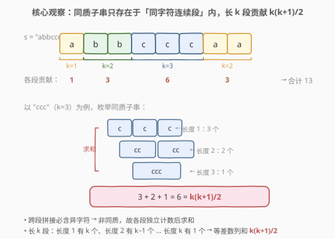
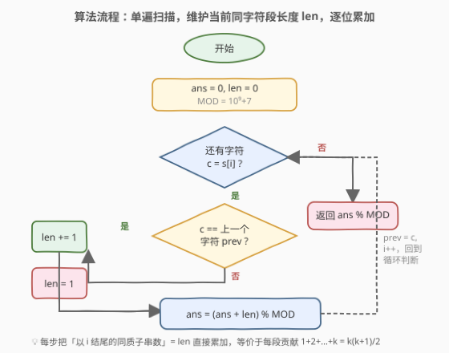
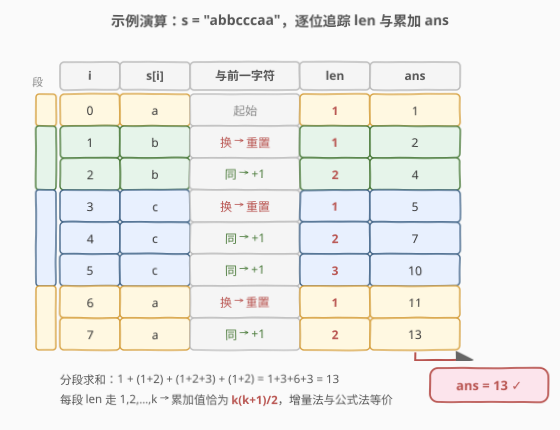

# 统计同质子字符串的数目

- **题目名称**：统计同质子字符串的数目
- **链接**：[1759. 统计同质子字符串的数目](https://leetcode.cn/problems/count-number-of-homogenous-substrings/)
- **难度**：中等
- **标签**：字符串、数学、遍历

## 1. 题目概述

给定一个字符串 `s`，返回 `s` 中**同质子字符串**的数目。由于答案可能很大，只需返回对 $10^9 + 7$ **取余**后的结果。

**同质字符串**：所有字符都相同的字符串。**子字符串**：字符串中的一个连续字符序列。

**示例 1**：

```text
输入：s = "abbcccaa"
输出：13
解释：同质子字符串如下所列：
"a"   出现 3 次    "b"   出现 2 次    "c"   出现 3 次
"aa"  出现 1 次    "bb"  出现 1 次    "cc"  出现 2 次
                                "ccc" 出现 1 次
合计 3+1 + 2+1 + 3+2+1 = 13
```

**示例 2**：

```text
输入：s = "xy"
输出：2
解释：两个同质子串 "x" 与 "y"。
```

**示例 3**：

```text
输入：s = "zzzzz"
输出：15
解释：5 个长度 1 + 4 个长度 2 + 3 个长度 3 + 2 个长度 4 + 1 个长度 5 = 15。
```

**约束条件**：

- $1 \le s.length \le 10^5$
- `s` 由小写英文字母组成

> 💡 **关键直觉**：同质子串里所有字符必须相同，因此它**绝不可能跨越字符变化的边界**——任何一个 "abb" 形的串都含两种字符，必非同质。于是问题天然被切分成一段段「同字符连续段」（下称**游程**），各段独立计数后求和即可。

---

## 2. 解题思路

### 2.1 暴力思路：枚举所有子串逐个判定

最直观的做法是两层循环枚举所有子串 $s[l..r]$（$0 \le l \le r < n$），再扫描该子串判断是否所有字符相同：

```text
for l in 0..n-1:
    for r in l..n-1:
        if s[l..r] 内所有字符相同:
            ans += 1
```

判定部分若朴素扫描是 $O(n)$，总体 $O(n^3)$；即便用「以 $l$ 为起点向右扩展，$s[r] == s[r-1]$ 才继续」的增量判定压到 $O(n^2)$，对 $n = 10^5$ 仍约 $5 \times 10^9$ 次操作，**超时**。问题在于：把每个子串当成独立个体去判定，完全没利用「同质子串成簇出现在同字符段内」的结构。

### 2.2 核心观察：游程分解 + 等差数列求和



**观察 1（不可跨越）**：若子串 $s[l..r]$ 是同质的，则 $s[l], s[l+1], \dots, s[r]$ 全相同。换言之，$[l, r]$ 必须整个落在某一段**连续同字符**中。一旦跨过字符变化的边界（如 `"ab"` 中的 `a` 与 `b`），子串就含两种字符，立刻非同质。

> 💡 因此可把 `s` 按「字符是否与前一字符相同」切成若干**游程**（run）：每段是极长的同字符连续块。同质子串只在游程**内部**产生，游程之间互不影响——**整体答案 = 各游程贡献之和**。

**观察 2（段内计数）**：考察一段长度为 $k$ 的同字符段（如 `"ccc"`，$k = 3$）。它的同质子串按长度分类：

- 长度 $1$：$k$ 个（每个位置各一个）；
- 长度 $2$：$k - 1$ 个（相邻两字符一组）；
- ……
- 长度 $k$：$1$ 个（整段本身）。

总数 $= k + (k-1) + \dots + 1 = \dfrac{k(k+1)}{2}$，正是**等差数列求和**。

**合并**：把 `s` 切成游程，设各游程长度为 $k_1, k_2, \dots, k_m$，则

$$\text{ans} = \sum_{j=1}^{m} \frac{k_j(k_j + 1)}{2} \pmod{10^9 + 7}$$

> ⚠️ **注意取模**：$k$ 最大可达 $n = 10^5$，单段贡献 $\frac{k(k+1)}{2} \approx 5 \times 10^9$ 已超 32 位整数范围；多段累加更甚。故每步累加后须对 $10^9 + 7$ 取模。用 `long long`（C++）或 Python 大整数运算后取模均可。

### 2.3 算法流程图



实现上无需先切游程再套公式，可用**更简洁的增量法**一遍扫完：维护 `len` = 「以当前位置结尾的同字符连续段长度」。

- 从左到右遍历每个字符 $c = s[i]$；
- 若 $c$ 与前一字符相同（$i > 0$ 且 $s[i] == s[i-1]$）：`len += 1`（接续上一段）；
- 否则（起始或换字符）：`len = 1`（开启新游程）；
- 把 `len` 累加进 `ans` 并取模。

> 💡 **增量法与公式法为何等价？** 在一段长度为 $k$ 的游程里，`len` 依次取 $1, 2, \dots, k$，每步累加。该段对 `ans` 的总贡献 $= 1 + 2 + \dots + k = \frac{k(k+1)}{2}$，与公式法完全一致。增量法把「整段求和」摊到「逐位加 `len`」，省去显式分段，代码更短、边界更少——这是「**把求和摊成增量**」的常见优化思路。

### 2.4 示例演算

以 `s = "abbcccaa"`（$n = 8$）为例，逐位追踪 `len` 与累加 `ans`：



| 位置 $i$ | $s[i]$ | 与前一字符 | `len` | `ans`（累加后） | 所属游程 |
|---------|--------|-----------|-------|----------------|---------|
| 0 | `a` | 起始 | 1 | 1 | `"a"` (k=1) |
| 1 | `b` | 换 → 重置 | 1 | 2 | `"bb"` (k=2) |
| 2 | `b` | 同 → +1 | 2 | 4 | |
| 3 | `c` | 换 → 重置 | 1 | 5 | `"ccc"` (k=3) |
| 4 | `c` | 同 → +1 | 2 | 7 | |
| 5 | `c` | 同 → +1 | 3 | 10 | |
| 6 | `a` | 换 → 重置 | 1 | 11 | `"aa"` (k=2) |
| 7 | `a` | 同 → +1 | 2 | 13 | |

最终 `ans = 13` ✓。分游程核对：$1 + (1+2) + (1+2+3) + (1+2) = 1 + 3 + 6 + 3 = 13$，与示例一致。

对照示例 3 `"zzzzz"`（$k = 5$）：`len` 走 $1,2,3,4,5$，累加 $1+2+3+4+5 = 15$ ✓。

> ⚠️ **边界**：$n = 1$ 时循环只跑一轮，`len = 1`，`ans = 1`，正确（单个字符即一个同质子串）。

---

## 3. 参考代码

### Python

```python
class Solution:
    def countHomogenous(self, s: str) -> int:
        MOD = 10 ** 9 + 7
        ans = 0
        length = 0
        for i, c in enumerate(s):
            if i > 0 and c == s[i - 1]:
                length += 1      # 接续同字符段
            else:
                length = 1       # 开启新游程
            ans = (ans + length) % MOD
        return ans
```

### C++

```cpp
class Solution {
public:
    int countHomogenous(string s) {
        const long long MOD = 1e9 + 7;
        long long ans = 0;
        int length = 0;
        for (int i = 0; i < (int)s.size(); i++) {
            if (i > 0 && s[i] == s[i - 1]) length++;   // 接续同字符段
            else length = 1;                           // 开启新游程
            ans = (ans + length) % MOD;
        }
        return (int)ans;
    }
};
```

> 💡 **实现细节**：① `i > 0` 守护首字符：第一个字符无前驱，直接置 `length = 1`。② 比较的是 `s[i] == s[i-1]`，无需额外存 `prev` 变量；若想避免反复访问 `s[i-1]`，可用 `char prev = 0;` 判 `c == prev` 并每轮更新 `prev = c`，等价。③ `ans` 用 `long long` 累加并每步取模，避免 $k = 10^5$ 时单段贡献约 $5 \times 10^9$ 溢出 `int`。④ 也可不每步取模，最后统一 `% MOD`——但中途 `ans` 可能累加到 $10^{10}$ 量级，C++ 须确保全程 `long long`。

---

## 4. 复杂度分析

| 维度 | 复杂度 | 说明 |
|------|--------|------|
| 时间 | $O(n)$ | 单遍扫描，每个字符做 $O(1)$ 比较、加法与取模 |
| 空间 | $O(1)$ | 仅 `ans`、`length` 两个变量，无额外数据结构 |

> ⚠️ 暴力枚举子串是 $O(n^2)$ 甚至 $O(n^3)$，在 $n = 10^5$ 下超时。关键优化在于识别「同质子串不跨边界」这一结构性质，把 $O(n^2)$ 的子串枚举**塌缩**成 $O(n)$ 的游程扫描——本质上是用「游程长度 $k$ 直接算出 $\frac{k(k+1)}{2}$」代替「逐个枚举 $k$ 长段内的子串」。

---

## 5. 扩展：增量 DP 视角与等价性

增量法可形式化为**一维 DP**：设 $f[i]$ 表示「以 $s[i]$ 结尾的同质子串数目」，则

$$
f[i] = \begin{cases} f[i-1] + 1, & s[i] == s[i-1] \\ 1, & s[i] \neq s[i-1] \text{ 或 } i = 0 \end{cases}
$$

答案 $= \sum_{i=0}^{n-1} f[i]$。理由：以 $s[i]$ 结尾的同质子串，要么是单字符 $s[i]$ 自身（长度 1），要么由「以 $s[i-1]$ 结尾的同质子串」末尾再补一个 $s[i]$ 得到（要求 $s[i] == s[i-1]$）。当字符相同时，前者有 $f[i-1]$ 个（每个延长一位），加单字符共 $f[i-1] + 1$ 个；不同时只能取单字符，$f[i] = 1$。

这其实正是增量法的 `length`——`length` 就是 $f[i]$。在一长度为 $k$ 的游程内，$f$ 递推为 $1, 2, \dots, k$，求和得 $\frac{k(k+1)}{2}$。三种视角对照：

| 视角 | 计算方式 | 一段长 $k$ 的贡献 |
|------|---------|------------------|
| 公式法 | 切游程，套 $\frac{k(k+1)}{2}$ | $\frac{k(k+1)}{2}$ |
| 增量法 | 逐位 `ans += len` | $1 + 2 + \dots + k$ |
| DP 法 | $f[i]$ 递推后求和 | $\sum_{i} f[i] = 1 + 2 + \dots + k$ |

三者数学等价，区别只在「先求和后累加」还是「边递推边累加」。**增量法 = DP 的滚动数组实现**——$f[i]$ 只依赖 $f[i-1]$，故无需数组，一个 `length` 变量滚动即可，空间从 $O(n)$ 降到 $O(1)$。

> 💡 这是「**按结尾位置分类计数子串**」的通用范式：定义「以 $i$ 结尾的合法子串数」$f[i]$，找递推关系，再求和。与 [828. 统计子串中的唯一字符](../0801-0900/828_统计子串中的唯一字符.md)（按位置算贡献）、[2262. 字符串的总引力](https://leetcode.cn/problems/total-appeal-of-a-string/)（按上次出现位置算贡献）同属「子串计数 → 按位置拆贡献」家族，只是本题的递推最简（同字符则 +1）。

---

## 6. 面试要点

1. **为什么同质子串不能跨越字符变化的边界？**

   > 同质子串要求所有字符相同。若子串覆盖了 $s[i] \neq s[i+1]$ 的位置，则它至少含这两种字符，必然非同质。故任一同质子串整段落在某个同字符连续块内，游程之间相互独立，可分别计数后求和。

2. **长 $k$ 的同字符段为什么贡献 $\frac{k(k+1)}{2}$？**

   > 按子串长度分类：长度 1 的有 $k$ 个（$k$ 个起点），长度 2 的有 $k-1$ 个，……，长度 $k$ 的有 1 个。总数 $k + (k-1) + \dots + 1 = \frac{k(k+1)}{2}$，即等差数列求和。

3. **增量法每步 `ans += len` 为什么等价于公式法？**

   > `len` 就是「以当前字符结尾的同质子串数」。在长 $k$ 的游程内，`len` 依次为 $1, 2, \dots, k$，累加得 $1 + 2 + \dots + k = \frac{k(k+1)}{2}$，与公式法逐段求和结果一致。增量法只是把「段内求和」摊到「逐位累加」，省去显式分段。

4. **为什么要对 $10^9 + 7$ 取模？哪里会溢出？**

   > 最坏情况 $s$ 全同字符（$n = 10^5$），单段 $k = 10^5$，贡献 $\frac{10^5 \times 10^5 + 1}{2} \approx 5 \times 10^9$，已超 32 位 `int` 上界 $\approx 2.1 \times 10^9$。C++ 须用 `long long` 累加并每步取模；Python 无溢出风险但仍需取模以满足题面要求。

5. **时间复杂度为什么是 $O(n)$？只有一个循环够吗？**

   > 单遍 `for` 扫描，每轮做一次字符比较、一次加法、一次取模，均为 $O(1)$。共 $n$ 轮，总 $O(n)$。没有嵌套循环——「段内子串计数」被 $\frac{k(k+1)}{2}$ 公式 $O(1)$ 化，无需逐个枚举子串。

6. **如果把题面改成「统计长度恰为 $L$ 的同质子串数」怎么做？**

   > 仍先游程分解。长 $k$ 的段中长度恰为 $L$ 的同质子串数为 $\max(0, k - L + 1)$（起点可取 $0 \dots k-L$）。对各游程求和即可，依旧 $O(n)$。这体现游程分解的可迁移性——换问法只改段内计数公式。

> 💡 **一句话总结**：同质子串不跨字符边界，按游程分解后每段长 $k$ 贡献 $\frac{k(k+1)}{2}$；用增量法逐位 `ans += len`（`len` 随同字符接续 +1、换字符重置 1）一遍扫完，$O(n)$ / $O(1)$。

---

## 7. 同类练习题

- [1358. 包含所有三种字符的子字符串数目](https://leetcode.cn/problems/number-of-substrings-containing-all-three-characters/)（[题解](../1301-1400/1358_包含所有三种字符的子字符串数目.md)）：子串计数 + 滑动窗口，对照「按约束计数子串」的不同切入点（本题按字符同质切游程，1358 按字符种类滑窗）
- [828. 统计子串中的唯一字符](https://leetcode.cn/problems/count-unique-characters-of-all-substrings-of-a-given-string/)（[题解](../0801-0900/828_统计子串中的唯一字符.md)）：按位置拆贡献统计子串，与本题「按结尾位置定义 $f[i]$」同属贡献计数家族，进阶在贡献函数更复杂
- [2262. 字符串的总引力](https://leetcode.cn/problems/total-appeal-of-a-string/)：所有子串的 distinct 字符总数，按「上次出现位置」拆贡献，体会贡献法在更一般子串计数中的迁移
- [2083. 求以相同字母开头和结尾的子串数量](https://leetcode.cn/problems/substrings-that-begin-and-end-with-same-letter/)：按字符分组统计首尾相同的子串，与本题「同字符成簇」结构同源，可作扩展练习
- [2063. 所有子字符串中的元音总数](https://leetcode.cn/problems/vowels-of-all-substrings/)：按每个元音位置算其被多少子串覆盖的贡献，贡献计数法的另一实例
