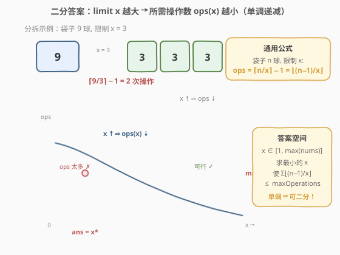
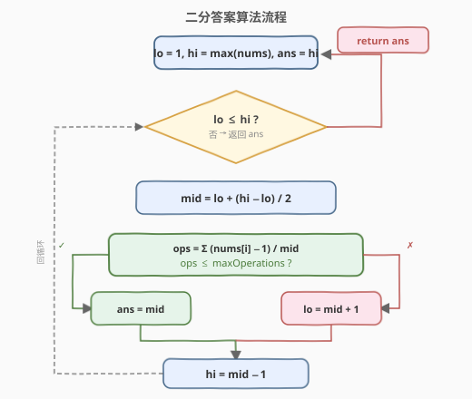

# 袋子里最少数目的球

- **题目名称**：袋子里最少数目的球
- **链接**：[1760. 袋子里最少数目的球](https://leetcode.cn/problems/minimum-limit-of-balls-in-a-bag/)
- **难度**：中等
- **标签**：数组、二分查找、二分答案

## 1. 题目概述

给你一个整数数组 `nums`，其中 `nums[i]` 表示第 `i` 个袋子里球的数目。同时给你一个整数 `maxOperations`。

你可以进行如下操作至多 `maxOperations` 次：

- 选择任意一个袋子，并将袋子里的球分到 2 个新的袋子中，每个袋子里都有**正整数**个球。
  - 比方说，一个袋子里有 5 个球，你可以把它们分到两个新袋子里，分别有 `1` 个和 `4` 个球，或者分别有 `2` 个和 `3` 个球。

你的开销是单个袋子里球数目的**最大值**，你想要**最小化**开销。返回进行上述操作后的最小开销。

**示例 1**：

```text
输入：nums = [9], maxOperations = 2
输出：3
解释：
- 将装有 9 个球的袋子分成装有 6 个和 3 个球的袋子。[9] -> [6,3]。
- 将装有 6 个球的袋子分成装有 3 个和 3 个球的袋子。[6,3] -> [3,3,3]。
装有最多球的袋子里装有 3 个球，所以开销为 3。
```

**示例 2**：

```text
输入：nums = [2,4,8,2], maxOperations = 4
输出：2
解释：
- 将装有 8 个球的袋子分成装有 4 个和 4 个球的袋子。[2,4,8,2] -> [2,4,4,4,2]。
- 将装有 4 个球的袋子分成装有 2 个和 2 个球的袋子。[2,4,4,4,2] -> [2,2,2,4,4,2]。
- 将装有 4 个球的袋子分成装有 2 个和 2 个球的袋子。[2,2,2,4,4,2] -> [2,2,2,2,2,4,2]。
- 将装有 4 个球的袋子分成装有 2 个和 2 个球的袋子。[2,2,2,2,2,4,2] -> [2,2,2,2,2,2,2,2]。
装有最多球的袋子里装有 2 个球，所以开销为 2。
```

**示例 3**：

```text
输入：nums = [7,17], maxOperations = 2
输出：7
```

**约束条件**：

- `1 <= nums.length <= 10^5`
- `1 <= maxOperations, nums[i] <= 10^9`

---

## 2. 解题思路

### 2.1 暴力思路

答案（最小开销）的取值范围是 $[1, \max(\text{nums})]$：

- 下界 $1$：每个袋子里至少 1 个球，开销最小为 1。
- 上界 $\max(\text{nums})$：不做任何操作，开销就是最大袋子的球数，必然可行。

从 $x = 1$ 开始逐个尝试，对每个 $x$ 检查"能否在 `maxOperations` 次操作内让所有袋子球数 $\leq x$"。验证单个 $x$ 是 $O(n)$，但 $\max(\text{nums})$ 可达 $10^9$，逐个尝试必然超时。

### 2.2 核心观察：二分答案



关键直觉是：**所需操作数 $\text{ops}(x)$ 关于限制 $x$ 单调递减**。

- $x$ 越大（允许每个袋子装更多球），需要的分拆操作越少。
- $x = 1$ 时需要最多操作（每个袋子都拆成 1 球一份）；$x = \max(\text{nums})$ 时需要 0 次操作。

**单袋分拆公式**：一个有 $n$ 个球的袋子，要让每个新袋子球数 $\leq x$，需要分成 $\lceil n/x \rceil$ 份，即 $\lceil n/x \rceil - 1$ 次操作。利用整数运算化简：

$$\lceil n/x \rceil - 1 = \lfloor (n-1) / x \rfloor$$

> 💡 **为什么？** $\lceil n/x \rceil = \lfloor (n-1)/x \rfloor + 1$ 是整数向上取整的经典恒等式。因此 $\lceil n/x \rceil - 1 = \lfloor (n-1)/x \rfloor$，在 C++/Python 中直接写 `(n - 1) / x`（整数除法）即可，无需浮点运算。

**总操作数**：对所有袋子求和：

$$\text{ops}(x) = \sum_{i} \left\lfloor \frac{\text{nums}[i] - 1}{x} \right\rfloor$$

若 $\text{ops}(x) \leq \text{maxOperations}$，则 $x$ 可行。

由于 $\text{ops}(x)$ 随 $x$ 单调递减，存在分界点 $x^*$：

$$x < x^* \Rightarrow \text{ops}(x) > \text{maxOperations} \quad (\text{操作不够，拆不完})$$
$$x \geq x^* \Rightarrow \text{ops}(x) \leq \text{maxOperations} \quad (\text{可行})$$

这正是二分查找所需的**二段性**。把「求最小可行 $x$」转化为：在有序区间 $[1, \max(\text{nums})]$ 上二分，每次 $O(n)$ 验证 `mid` 是否可行，可行则去左半找更小的，不可行则去右半加大限制。

> 💡 **识别信号**：题目求「最小化最大值」，且能 $O(n)$ 验证某个候选值是否合法 → 想「二分答案」。这是与「在有序数组里二分找下标」不同的另一类二分：**二分的是答案本身**。与 [1011. 在 D 天内送达包裹的能力](../1001-1100/1011_在D天内送达包裹的能力.md) 是同一套模板，只是 `check()` 从「贪心装船」换成了「逐袋求分拆次数之和」。

> ⚠️ **下界取 $1$ 而非 $0$**：每个袋子必须有正整数个球，限制 $x = 0$ 无意义。上界取 $\max(\text{nums})$ 而非更大的值，因为不做任何操作时开销已经是 $\max(\text{nums})$，必然可行，取更松的上界只增加几次无效二分。

### 2.3 算法流程图



注意判定为「可行」时**先记录 `ans = mid` 再收缩右界**（`hi = mid - 1`），保证最终保留的是「最小的可行值」。不可行时执行 `lo = mid + 1` 放宽限制。

### 2.4 示例演算

![示例演算：nums = [2,4,8,2], maxOps = 4](../images/1760_example_walkthrough.svg)

以 `nums = [2,4,8,2]`、`maxOperations = 4` 为例，$\max(\text{nums}) = 8$，答案区间 $[1, 8]$：

| 轮次 | [lo, hi] | mid | ops $= \sum(n-1)/\text{mid}$ | 判定 & 动作 |
|------|----------|-----|------------------------------|-------------|
| 1 | [1, 8] | 4 | $0+0+1+0 = 1 \leq 4$ | ✓ ans=4, hi=3 |
| 2 | [1, 3] | 2 | $0+1+3+0 = 4 \leq 4$ | ✓ ans=2, hi=1 |
| 3 | [1, 1] | 1 | $1+3+7+1 = 12 > 4$ | ✗ lo=2 |
| 结束 | lo > hi | — | — | 返回 ans=2 |

关键看第 2 轮 `mid=2`：袋子 `[2,4,8,2]` 分别需要 $0$、$1$、$3$、$0$ 次操作（8 个球拆成 `[2,2,2,2]` 需 3 次），总计 $0+1+3+0=4 \leq 4$，恰好可行。而 `mid=1` 时总计 $1+3+7+1=12 > 4$，操作不够。故最小开销为 2。

> 💡 **`mid=2` 时 8 个球的分拆**：$\lceil 8/2 \rceil - 1 = 4 - 1 = 3$ 次操作，分成 4 个袋子 `[2,2,2,2]`，每袋都不超过 2。这正是 $(8-1)/2 = 3$ 的由来。

---

## 3. 参考代码

### C++

```cpp
class Solution {
public:
    int minimumSize(vector<int>& nums, int maxOperations) {
        int lo = 1;
        int hi = *max_element(nums.begin(), nums.end());
        int ans = hi;

        while (lo <= hi) {
            int mid = lo + (hi - lo) / 2;
            if (canAchieve(nums, mid, maxOperations)) {
                ans = mid;       // 可行，尝试更小的限制
                hi = mid - 1;
            } else {
                lo = mid + 1;    // 操作不够，放宽限制
            }
        }
        return ans;
    }

private:
    // 验证：限制为 limit 时，所需操作数是否 <= maxOps
    bool canAchieve(const vector<int>& nums, int limit, int maxOps) {
        long long ops = 0;       // 注意：总和可能溢出 int
        for (int n : nums) {
            ops += (n - 1) / limit;  // ⌈n/limit⌉ - 1 = ⌊(n-1)/limit⌋
            if (ops > maxOps) return false;  // 提前剪枝
        }
        return ops <= maxOps;
    }
};
```

### Python

```python
class Solution:
    def minimumSize(self, nums: List[int], maxOperations: int) -> int:
        lo, hi = 1, max(nums)
        ans = hi

        while lo <= hi:
            mid = (lo + hi) // 2
            if self._can_achieve(nums, mid, maxOperations):
                ans = mid       # 可行，尝试更小的限制
                hi = mid - 1
            else:
                lo = mid + 1    # 操作不够，放宽限制
        return ans

    def _can_achieve(self, nums: List[int], limit: int, max_ops: int) -> bool:
        ops = 0
        for n in nums:
            ops += (n - 1) // limit  # ⌈n/limit⌉ - 1 = ⌊(n-1)/limit⌋
            if ops > max_ops:
                return False         # 提前剪枝
        return ops <= max_ops
```

> ⚠️ **两个易错点**：
> 1. **溢出**：$\text{nums}[i]$ 和 $\text{maxOperations}$ 都可达 $10^9$，$n$ 个袋子的操作总和可达 $10^{14}$，超出 `int` 范围（约 $2.1 \times 10^9$）。C++ 中 `ops` 必须用 `long long`；Python 无此问题。配合提前剪枝（`ops > maxOps` 即返回 `false`），可在溢出前退出。
> 2. **公式别写反**：是 $(n - 1) / \text{limit}$，不是 $n / \text{limit}$。后者当 $n$ 整除 $\text{limit}$ 时会多算一次操作。例如 $n = 9, x = 3$：正确 $\lceil 9/3 \rceil - 1 = 2$ 次，但 $9 / 3 = 3 \neq 2$；用 $(9-1)/3 = 8/3 = 2$ 才对。

---

## 4. 复杂度分析

| 维度 | 复杂度 | 说明 |
|------|--------|------|
| 时间复杂度 | $O(n \log M)$ | $M = \max(\text{nums})$；二分 $O(\log M)$ 次，每次验证 $O(n)$ |
| 空间复杂度 | $O(1)$ | 仅用常数额外变量 |

> 💡 由于 $\text{nums}[i] \leq 10^9$，$\log M \approx 30$，$n \leq 10^5$，总运算量约 $3 \times 10^6$，远低于时限。配合提前剪枝（`ops > maxOps` 即返回），实际运行更快。

---

## 5. 面试要点

1. **为什么能二分？二段性体现在哪？**

   $\text{ops}(x)$ 随 $x$ 单调递减。存在分界点 $x^*$，使 $x < x^*$ 时操作不够、$x \geq x^*$ 时可行。这种「左不合法 / 右合法」的结构就是二段性，可用二分定位 $x^*$。

2. **上下界为什么是 $1$ 和 $\max(\text{nums})$？**

   - 下界 $1$：每个袋子里至少 1 个球，开销不可能小于 1。
   - 上界 $\max(\text{nums})$：不做任何操作时开销就是最大袋子的球数，$0 \leq \text{maxOperations}$ 必然可行。

3. **为什么 $(n-1)/x$ 等于 $\lceil n/x \rceil - 1$？**

   整数向上取整恒等式：$\lceil n/x \rceil = \lfloor (n-1)/x \rfloor + 1$。因此 $\lceil n/x \rceil - 1 = \lfloor (n-1)/x \rfloor$，在整数除法中直接写 `(n - 1) / x` 即可，无需浮点运算或条件判断。

4. **为什么要用 `long long`？**

   单袋操作数 $(n-1)/x$ 可达 $10^9 - 1$，$10^5$ 个袋子求和可达 $10^{14}$，超出 `int` 范围。用 `long long` 或提前剪枝避免溢出。

5. **和 [1011. 在 D 天内送达包裹的能力](../1001-1100/1011_在D天内送达包裹的能力.md) 的区别？**

   骨架完全一致——都是「二分答案 + 单调性验证」。差别只在 `check()`：1011 是贪心模拟装船（状态机式累加，跨天重置 `cur`），1760 是数学求和（逐袋算分拆次数 $\lfloor (n-1)/x \rfloor$）。同一套框架，换个 `check` 就是新题。

---

## 6. 同类练习题

- [875. 爱吃香蕉的珂珂](https://leetcode.cn/problems/koko-eating-bananas/)（[题解](../0801-0900/875_爱吃香蕉的珂珂.md)）：同模板，二分吃香蕉速度 $k$，`check` 用 $\sum \lceil \text{piles}[i] / k \rceil$ 求和
- [1011. 在 D 天内送达包裹的能力](https://leetcode.cn/problems/capacity-to-ship-packages-within-d-days/)（[题解](../1001-1100/1011_在D天内送达包裹的能力.md)）：二分运载能力，`check` 贪心装船，几乎同构
- [410. 分割数组的最大值](https://leetcode.cn/problems/split-array-largest-sum/)（[题解](../0401-0500/410_分割数组的最大值.md)）：二分「最大子数组和」上限，`check` 贪心划分子数组
- [2064. 分配给商店的最小商品数量](https://leetcode.cn/problems/minimized-maximum-of-products-distributed-to-any-store/)：同模板，二分「每店最多商品数」，`check` 求和判所需商店数
- [719. 找出第 K 小的数对距离](https://leetcode.cn/problems/find-k-th-smallest-pair-distance/)：二分距离上限，`check` 用双指针计数
