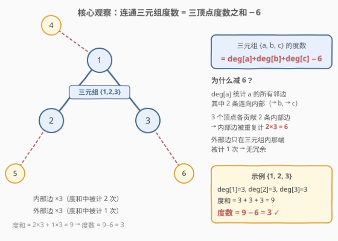
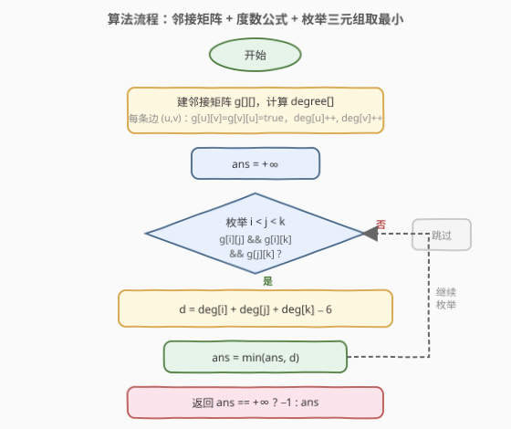
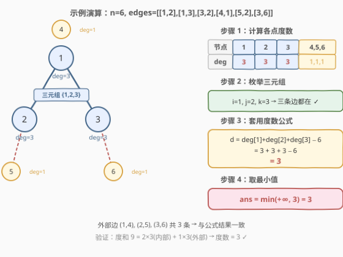

# LeetCode 一个图中连通三元组的最小度数 题解

## 1. 题目概述

- **标题 / 题号**：一个图中连通三元组的最小度数（#1761，hard）
- **链接**：https://leetcode.cn/problems/minimum-degree-of-a-connected-trio-in-a-graph/
- **难度**：困难
- **标签**：图、邻接矩阵、枚举、度数

**题意**：给定一个无向图，整数 `n` 表示图中节点的数目，`edges` 数组表示图中的边，其中 `edges[i] = [ui, vi]` 表示 `ui` 和 `vi` 之间有一条无向边。

**连通三元组**指的是三个节点组成的集合，且这三个点之间**两两**有边（即构成一个三角形）。

**连通三元组的度数**是所有满足此条件的边的数目：一个顶点在这个三元组内，而另一个顶点不在这个三元组内（即「跨三元组边界」的边数）。

返回所有连通三元组中度数的**最小值**；如果图中没有连通三元组，返回 `-1`。

**示例 1**：

```text
输入：n = 6, edges = [[1,2],[1,3],[3,2],[4,1],[5,2],[3,6]]
输出：3
解释：只有一个三元组 [1,2,3]。构成度数的边为 (1,4)、(2,5)、(3,6)，共 3 条。
```

**示例 2**：

```text
输入：n = 7, edges = [[1,3],[4,1],[4,3],[2,5],[5,6],[6,7],[7,5],[2,6]]
输出：0
解释：有 3 个三元组：
1) [1,4,3]，度数为 0
2) [2,5,6]，度数为 2
3) [5,6,7]，度数为 2
最小度数为 0。
```

**约束**：

- $2 \le n \le 400$
- `edges[i].length == 2`
- $1 \le \text{edges.length} \le n \times (n-1) / 2$
- $1 \le u_i, v_i \le n$
- $u_i \ne v_i$
- 图中没有重复的边

> 💡 **关键直觉**：三元组的度数本质是「与三元组外部相连的边数」。每个顶点的度数已经统计了所有邻边，把三个顶点的度数加起来，再减去三元组内部边被重复计算的部分，就能 $O(1)$ 算出度数——无需逐条边去判断是否跨越边界。

## 2. 解题思路

### 2.1 暴力思路：枚举三元组后逐边统计

最直观的做法：

1. 枚举所有 $C(n, 3)$ 个三元组 $\{a, b, c\}$；
2. 检查三条边 $(a,b), (a,c), (b,c)$ 是否都存在；
3. 若是，再遍历所有 $m$ 条边，统计「恰好一个端点在三元组内」的边数。

时间复杂度 $O(n^3 \cdot m)$。当 $n = 400$、$m \approx 8 \times 10^4$ 时，约 $2.6 \times 10^{13}$ 次操作，**远远超时**。瓶颈在第 3 步：每次找到三元组后都要遍历全部边来数外部边。

> 💡 优化方向：能否避免逐边统计？——可以！利用度数公式把第 3 步从 $O(m)$ 降到 $O(1)$。

### 2.2 核心观察：度数公式 deg = deg[a]+deg[b]+deg[c] − 6



**关键公式**：对于连通三元组 $\{a, b, c\}$，其度数为

$$\text{degree}(\{a,b,c\}) = \deg[a] + \deg[b] + \deg[c] - 6$$

**推导过程**：

- $\deg[a]$ 统计节点 $a$ 的**所有**邻边，其中 2 条连向三元组内部（$\to b$ 和 $\to c$），其余连向外部。
- 同理，$\deg[b]$ 和 $\deg[c]$ 各含 2 条内部边。
- 三条内部边 $(a,b), (a,c), (b,c)$，每条在度数和 $\deg[a]+\deg[b]+\deg[c]$ 中被**两个端点各计一次**，共重复计 $2 \times 3 = 6$。
- 外部边只在「三元组内那一端」被计 1 次，无冗余。

因此：度数和 $=$ 内部边贡献 $+$ 外部边贡献 $= 6 + \text{度数}$，即 $\text{度数} = \text{度和} - 6$。

> ⚠️ **注意**：公式中的 $\deg[\cdot]$ 是节点在**原图**中的度数（所有邻边数），不是三元组内部的度数。预处理时一次遍历所有边即可算出。

**实现要点**：用**邻接矩阵** $g[i][j]$ 存储「节点 $i$ 和 $j$ 之间是否有边」，使得「检查三点是否两两相连」只需 3 次 $O(1)$ 查表。$n \le 400$ 时邻接矩阵 $O(n^2) = 1.6 \times 10^5$ 空间完全可接受。

### 2.3 算法流程图



算法步骤：

1. **建图**：遍历 `edges`，填充邻接矩阵 $g[][]$ 并累加 $\text{degree}[]$。
2. **初始化** `ans = +∞`。
3. **枚举三元组**：三重循环 $i < j < k$（强制大小序避免重复），若 $g[i][j] \wedge g[i][k] \wedge g[j][k]$ 则找到三元组。
4. **算度数**：$d = \text{deg}[i] + \text{deg}[j] + \text{deg}[k] - 6$，更新 `ans = min(ans, d)`。
5. **返回** `ans == +∞ ? -1 : ans`。

> 💡 **剪枝**：中间层 `if (!g[i][j]) continue;` 跳过非边对，使内层循环只对真实边执行。总复杂度从 $O(n^3)$ 降为 $O(m \cdot n)$，对 $n = 400$ 约 $3.2 \times 10^7$，可轻松通过。

### 2.4 示例演算

以示例 1 `n = 6, edges = [[1,2],[1,3],[3,2],[4,1],[5,2],[3,6]]` 为例：



**步骤 1：计算各点度数**

| 节点 | 邻居 | deg |
|------|------|-----|
| 1 | 2, 3, 4 | 3 |
| 2 | 1, 3, 5 | 3 |
| 3 | 1, 2, 6 | 3 |
| 4 | 1 | 1 |
| 5 | 2 | 1 |
| 6 | 3 | 1 |

**步骤 2：枚举三元组**

$i=1, j=2, k=3$：$g[1][2] \wedge g[1][3] \wedge g[2][3]$ 均为 `true` → 找到三元组 $\{1, 2, 3\}$。

其余组合（如 $\{1, 2, 4\}$）至少缺一条边，不构成三元组。

**步骤 3：套用公式**

$$d = \deg[1] + \deg[2] + \deg[3] - 6 = 3 + 3 + 3 - 6 = 3$$

**步骤 4：取最小**

`ans = min(+∞, 3) = 3`，返回 `3`。

> ✅ **验证**：外部边为 $(1,4), (2,5), (3,6)$ 共 3 条，与公式结果一致。度和 $9 = 2 \times 3(\text{内部}) + 1 \times 3(\text{外部})$，度数 $= 9 - 6 = 3$。

再对照示例 2 `n = 7, edges = [[1,3],[4,1],[4,3],[2,5],[5,6],[6,7],[7,5],[2,6]]`：

| 三元组 | deg 和 | 度数 |
|--------|--------|------|
| $\{1, 3, 4\}$ | $2+2+2=6$ | $6-6=0$ |
| $\{2, 5, 6\}$ | $2+3+3=8$ | $8-6=2$ |
| $\{5, 6, 7\}$ | $3+3+2=8$ | $8-6=2$ |

最小度数 $= 0$ ✓。三元组 $\{1, 3, 4\}$ 的每个节点度数恰好为 2（全用于内部边），无任何外部边。

## 3. 参考代码

### Python

```python
class Solution:
    def minTrioDegree(self, n: int, edges: List[List[int]]) -> int:
        g = [[False] * (n + 1) for _ in range(n + 1)]
        deg = [0] * (n + 1)
        for u, v in edges:
            g[u][v] = g[v][u] = True
            deg[u] += 1
            deg[v] += 1

        ans = float('inf')
        for i in range(1, n + 1):
            for j in range(i + 1, n + 1):
                if not g[i][j]:
                    continue
                for k in range(j + 1, n + 1):
                    if g[i][k] and g[j][k]:
                        ans = min(ans, deg[i] + deg[j] + deg[k] - 6)

        return -1 if ans == float('inf') else ans
```

### C++

```cpp
class Solution {
public:
    int minTrioDegree(int n, vector<vector<int>>& edges) {
        vector<vector<char>> g(n + 1, vector<char>(n + 1, 0));
        vector<int> deg(n + 1, 0);
        for (auto& e : edges) {
            g[e[0]][e[1]] = g[e[1]][e[0]] = 1;
            deg[e[0]]++;
            deg[e[1]]++;
        }

        int ans = INT_MAX;
        for (int i = 1; i <= n; i++) {
            for (int j = i + 1; j <= n; j++) {
                if (!g[i][j]) continue;
                for (int k = j + 1; k <= n; k++) {
                    if (g[i][k] && g[j][k]) {
                        ans = min(ans, deg[i] + deg[j] + deg[k] - 6);
                    }
                }
            }
        }

        return ans == INT_MAX ? -1 : ans;
    }
};
```

> 💡 **实现细节**：① 邻接矩阵用 `vector<vector<char>>` 而非 `vector<vector<bool>>`——后者是位压缩特化，随机访问需位运算，常数更大；`char` 版直接按字节存取更高效。② 节点编号 1-indexed，数组开 `n+1` 避免越界。③ 强制 $i < j < k$ 确保每个三元组只被枚举一次，无需去重。④ `ans` 初始化为 `INT_MAX`，若未更新则返回 `-1`。

## 4. 复杂度分析

| 维度 | 复杂度 | 说明 |
|------|--------|------|
| 时间 | $O(m \cdot n)$ | 中间层只对真实边 $(i,j)$ 进入内层，内层遍历 $k$ 从 $j+1$ 到 $n$；最坏 $m = O(n^2)$ 时为 $O(n^3)$ |
| 空间 | $O(n^2)$ | 邻接矩阵 $g[][]$ 占 $n^2$，度数数组 $O(n)$ |

> ⚠️ $n = 400$ 时 $n^3 = 6.4 \times 10^7$，加上剪枝后实际只对每条边遍历 $k$（$O(m \cdot n)$），C++ 可在 100ms 内通过。Python 可能偏慢，若超时可改用下节邻接表优化。

## 5. 扩展：邻接表优化与 bitset 加速

### 5.1 邻接表 + 小度数优先（稀疏图更优）

核心思路：对每条边 $(a, b)$，只需找 $a$ 和 $b$ 的**公共邻居** $c$ 即可构成三元组。遍历度数较小的端点的邻居列表，检查是否也是另一端点的邻居：

```cpp
class Solution {
public:
    int minTrioDegree(int n, vector<vector<int>>& edges) {
        vector<int> deg(n + 1, 0);
        vector<unordered_set<int>> adj(n + 1);
        for (auto& e : edges) {
            adj[e[0]].insert(e[1]);
            adj[e[1]].insert(e[0]);
            deg[e[0]]++;
            deg[e[1]]++;
        }

        int ans = INT_MAX;
        for (auto& e : edges) {
            int a = e[0], b = e[1];
            // 遍历度数较小的端点的邻居
            if (adj[a].size() > adj[b].size()) swap(a, b);
            for (int c : adj[a]) {
                if (adj[b].count(c)) {
                    ans = min(ans, deg[e[0]] + deg[e[1]] + deg[c] - 6);
                }
            }
        }
        return ans == INT_MAX ? -1 : ans;
    }
};
```

复杂度 $O\!\left(\sum_{(a,b) \in E} \min(\deg[a], \deg[b])\right)$。每个三元组会被找到 3 次（每条边一次），但取 `min` 不受影响。对**稀疏图**（$m \ll n^2$）远优于 $O(n^3)$。

### 5.2 bitset 加速公共邻居查找

用 `bitset<401>` 存每个节点的邻居集合，公共邻居 = 两个 bitset 做 AND 运算后数 1 的个数。C++ `std::bitset` 的 AND 是 $O(n/64)$ 的字级并行：

```cpp
class Solution {
public:
    int minTrioDegree(int n, vector<vector<int>>& edges) {
        vector<bitset<401>> adj(n + 1);
        vector<int> deg(n + 1, 0);
        for (auto& e : edges) {
            adj[e[0]][e[1]] = 1;
            adj[e[1]][e[0]] = 1;
            deg[e[0]]++;
            deg[e[1]]++;
        }

        int ans = INT_MAX;
        for (auto& e : edges) {
            int a = e[0], b = e[1];
            auto common = adj[a] & adj[b];
            for (int c = 1; c <= n; c++) {
                if (common[c]) {
                    ans = min(ans, deg[a] + deg[b] + deg[c] - 6);
                }
            }
        }
        return ans == INT_MAX ? -1 : ans;
    }
};
```

bitset AND 后遍历置位，总复杂度 $O(m \cdot n / 64)$，对 $n = 400$ 约快 64 倍。

| 方法 | 时间 | 空间 | 适用场景 |
|------|------|------|---------|
| 邻接矩阵 + 三重循环 | $O(m \cdot n)$ | $O(n^2)$ | $n \le 400$，实现最简 |
| 邻接表 + 小度数优先 | $O(\sum \min(\deg_a, \deg_b))$ | $O(n + m)$ | 稀疏图 |
| bitset 加速 | $O(m \cdot n / 64)$ | $O(n^2 / 8)$ | 字级并行，常数最优 |

> 💡 **面试建议**：先写邻接矩阵版（最简洁、不易出错），再口头提优化方向。若面试官追问稀疏图场景，引出邻接表版。

## 6. 面试要点

1. **为什么度数公式是 $\deg[a]+\deg[b]+\deg[c]-6$？**

   > 三元组有 3 条内部边，每条在度和中被两端点各计一次，共 $2 \times 3 = 6$。减去 6 消除内部边的重复计数，剩下的恰好是外部边数（度数）。外部边只在三元组内那端被计 1 次，无冗余。

2. **为什么用邻接矩阵而不用邻接表？**

   > 需要频繁查询「两点之间是否有边」（$g[i][k]$ && $g[j][k]$），邻接矩阵 $O(1)$ 查表；邻接表需 $O(\deg)$ 线性查找或用 `set` $O(\log \deg)$。$n \le 400$ 时邻接矩阵 $O(n^2) = 1.6 \times 10^5$ 空间完全可接受，换取查询常数最优。

3. **三重循环不会超时吗？**

   > $n \le 400$，最坏 $O(n^3) = 6.4 \times 10^7$，C++ 可过。加上 `if (!g[i][j]) continue` 剪枝后，内层循环只对真实边执行，复杂度降为 $O(m \cdot n)$。$m$ 最大 $\approx 8 \times 10^4$，约 $3.2 \times 10^7$ 次操作。

4. **如何避免重复统计同一个三元组？**

   > 强制 $i < j < k$，每个三元组只被枚举一次。若不强制顺序，同一个三元组 $\{a, b, c\}$ 会被 $3! = 6$ 种排列各找到一次。由于只取 `min`，重复不影响正确性，但浪费 6 倍时间。

5. **如果没有连通三元组怎么办？**

   > `ans` 初始化为 `INT_MAX`，若三重循环结束仍未更新，说明图中不存在任何三元组，返回 $-1$。这对应图中没有三角形的情况——如树或二分图。

> 💡 **一句话总结**：建邻接矩阵预处理度数，三重循环枚举 $i < j < k$ 检查三角形，用公式 $\text{deg}[a]+\text{deg}[b]+\text{deg}[c]-6$ 在 $O(1)$ 算出度数，取最小值。$O(m \cdot n)$ 时间 / $O(n^2)$ 空间。

## 同类练习题

| # | 题目 | 与本题的关联 |
|---|------|-------------|
| 547 | [省份数量](https://leetcode.cn/problems/number-of-provinces/)（[题解](../0501-0600/547_省份数量.md)） | 图的连通分量计数，并查集模板，与本题同为「图上枚举/统计」的基础题型 |
| 785 | [判断二分图](https://leetcode.cn/problems/is-graph-bipartite/)（[题解](../0701-0800/785_判断二分图.md)） | 图上 BFS/DFS 染色，与本题同为「邻接矩阵 + 图遍历」范式，二分图中不存在三角形（三元组） |
| 684 | [冗余连接](https://leetcode.cn/problems/redundant-connection/)（[题解](../0601-0700/684_冗余连接.md)） | 并查集判环，与本题同属无向图基础操作题，对照「并查集 vs 邻接矩阵」的不同建图策略 |
| 1791 | [星形图的中心节点](https://leetcode.cn/problems/find-center-of-star-graph/) | 利用度数性质找星形图中心，与本题「度数公式」思路呼应——度数蕴含结构信息 |
| 2316 | [统计无向图中不可互相到达点对数](https://leetcode.cn/problems/count-unreachable-pairs-of-nodes-in-an-undirected-graph/) | 连通分量 + 组合计数，同为无向图上利用度数/连通性优化统计的问题 |
