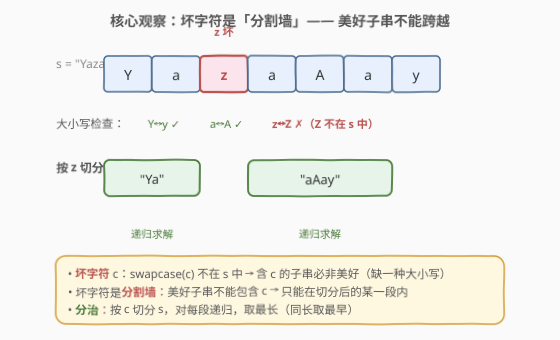
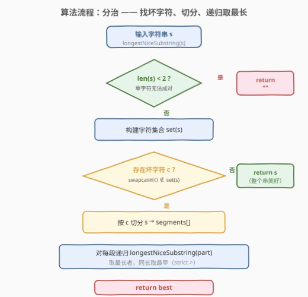
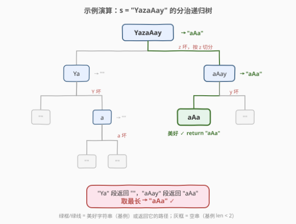

# 最长的美好子字符串

- **题目名称**：最长的美好子字符串
- **链接**：[1763. 最长的美好子字符串](https://leetcode.cn/problems/longest-nice-substring/)
- **难度**：简单
- **标签**：字符串、分治、递归

## 1. 题目概述

当一个字符串 `s` 包含的**每一种字母的大写和小写形式同时出现**在 `s` 中时，就称 `s` 是**美好**字符串。例如 `"abABB"` 是美好的（`'A'`/`'a'` 同时出现，`'B'`/`'b'` 同时出现），而 `"abA"` 不是（`'b'` 出现但 `'B'` 未出现）。

给定字符串 `s`，返回 `s` 中**最长的美好子字符串**。若有多个答案，返回**最早**出现的一个。若不存在，返回空字符串。

**示例 1**：

```text
输入：s = "YazaAay"
输出："aAa"
解释："aAa" 是美好字符串（仅含字母 a，其大小写形式 'a' 和 'A' 同时出现），且是最长的。
```

**示例 2**：

```text
输入：s = "Bb"
输出："Bb"
解释："Bb" 是美好字符串，'B' 和 'b' 都出现了。整个字符串即为答案。
```

**示例 3**：

```text
输入：s = "c"
输出：""
解释：单个字符无法成对出现，没有美好子字符串。
```

**示例 4**：

```text
输入：s = "dDzeE"
输出："dD"
解释："dD" 和 "eE" 都是最长美好子串，返回 "dD"（出现更早）。
```

**约束条件**：

- $1 \le s.length \le 100$
- `s` 只包含大写和小写英文字母

> 💡 **关键直觉**：美好字符串的判定条件是「每种出现的大小写字母必须成对」。如果某个字符 `c` 出现在 `s` 中，但它的对应大小写 `swapcase(c)` 不在 `s` 中，那么 `c` 就是「坏字符」——**任何包含 `c` 的子串都不可能是美好的**。这天然形成分治的切分点。

---

## 2. 解题思路

### 2.1 暴力思路：枚举所有子串逐个判定

最直观的做法是枚举所有子串 $s[l..r]$（$0 \le l \le r < n$，共 $O(n^2)$ 个），对每个子串检查是否美好：

```text
for l in 0..n-1:
    for r in l..n-1:
        if s[l..r] 美好:
            更新最长（同长保留更早的）
```

判定美好可用大小写位掩码：用 26 位 `lower` 记录出现的小写字母、26 位 `upper` 记录出现的大写字母，美好当且仅当 `lower == upper`。向右扩展 $r$ 时增量更新掩码，每次 $O(1)$，总体 $O(n^2)$。

对 $n = 100$，$n^2 = 10^4$，轻松通过。但暴力完全没利用美好字符串的**结构性质**——坏字符天然分割字符串。

### 2.2 核心观察：坏字符是「分割墙」——分治



**观察**：如果字符 $c$ 出现在 $s$ 中，但 `swapcase(c)` 不在 $s$ 中，则 $c$ 是**坏字符**。任何包含 $c$ 的子串至少有 $c$ 这一种字母缺少对应大小写，故**必非美好**。

> 💡 这意味着 $c$ 是一道**分割墙**：美好子串绝不能跨越 $c$。把 $s$ 按 $c$ 切分成若干段后，最长美好子串**必定完全落在某一段内**。于是问题天然分解为对每段递归求解，取最长（同长取最早）。

**关键性质**：每次找到坏字符 $c$ 并切分后，$c$ 及其 `swapcase(c)`（本来就不在 $s$ 中）从所有子段中彻底消失——即一个「基础字母对」被消除。英文字母只有 26 个基础字母对，故**递归深度不超过 26**。

### 2.3 算法流程图



算法步骤：

1. **基例**：若 $\text{len}(s) < 2$，单个字符无法成对，返回 `""`。
2. **扫描**：构建 $\text{set}(s)$，遍历查找坏字符 $c$（`swapcase(c)` $\notin$ $\text{set}(s)$）。
3. **分治**：若找到坏字符 $c$，按 $c$ 切分 $s$ 为若干段，对每段递归，取最长者（同长取最早）。
4. **终止**：若无坏字符，整个 $s$ 即为美好字符串，直接返回。

> 💡 **同长取最早**的实现：按从左到右顺序遍历切分后的各段，更新 `best` 时用**严格大于**（`len(res) > len(best)`），同长时保留先出现的（更靠左的）结果。

### 2.4 示例演算

以 `s = "YazaAay"` 为例，展示完整的分治递归树：



| 递归调用 | 坏字符 | 切分结果 | 返回值 |
|---------|--------|---------|--------|
| `"YazaAay"` | `z`（`Z` 不在） | `"Ya"`, `"aAay"` | `"aAa"` |
| `"Ya"` | `Y`（`y` 不在） | `""`, `"a"` | `""` |
| `"a"` | `a`（`A` 不在） | `""`, `""` | `""` |
| `"aAay"` | `y`（`Y` 不在） | `"aAa"`, `""` | `"aAa"` |
| `"aAa"` | 无（`a`/`A` 均在） | — | `"aAa"`（美好！） |

- `"Ya"` 段递归得 `""`（`Y` 坏，切分后 `"a"` 也坏，最终全空）
- `"aAay"` 段递归得 `"aAa"`（`y` 坏，切分出 `"aAa"` 本身美好）
- 根取最长：$\max(\text{len}(""), \text{len}(\text{"aAa"})) =$ `"aAa"` ✓

对照示例 4 `"dDzeE"`：`z` 坏（`Z` 不在），切分为 `"dD"` 和 `"eE"`，两者均美好且等长，取最早的 `"dD"` ✓。

---

## 3. 参考代码

### Python（分治）

```python
class Solution:
    def longestNiceSubstring(self, s: str) -> str:
        if len(s) < 2:
            return ""
        s_set = set(s)
        for i, c in enumerate(s):
            if c.swapcase() not in s_set:
                # c 是坏字符：按 c 切分，对每段递归
                best = ""
                for part in s.split(c):
                    res = self.longestNiceSubstring(part)
                    if len(res) > len(best):
                        best = res
                return best
        # 无坏字符 → 整个 s 美好
        return s
```

### C++（分治）

```cpp
class Solution {
public:
    string longestNiceSubstring(string s) {
        if (s.size() < 2) return "";
        unordered_set<char> st(s.begin(), s.end());
        for (int i = 0; i < (int)s.size(); i++) {
            char c = s[i];
            char sw = islower(c) ? toupper(c) : tolower(c);
            if (!st.count(sw)) {
                // c 是坏字符：按 c 切分，对每段递归
                string best;
                size_t prev = 0, pos;
                while ((pos = s.find(c, prev)) != string::npos) {
                    string res = longestNiceSubstring(s.substr(prev, pos - prev));
                    if (res.size() > best.size()) best = res;
                    prev = pos + 1;
                }
                string res = longestNiceSubstring(s.substr(prev));
                if (res.size() > best.size()) best = res;
                return best;
            }
        }
        return s;
    }
};
```

> 💡 **实现细节**：① `c.swapcase()` 是 Python 内置方法，`'a'` ↔ `'A'`，一行完成大小写翻转。② `s.split(c)` 按**所有** `c` 的出现位置切分，一次消除该坏字符的全部出现。③ 更新 `best` 用严格 `>`，同长时保留更早的段，满足「返回最早」要求。④ C++ 中 `islower` / `toupper` / `tolower` 来自 `<cctype>`，参数须转为 `int`。

---

## 4. 复杂度分析

| 维度 | 复杂度 | 说明 |
|------|--------|------|
| 时间 | $O(n \cdot \Sigma)$ | $\Sigma = 26$ 为字母表大小；每层递归处理总长 $\le n$ 的段，深度 $\le 26$ |
| 空间 | $O(n)$ | 递归深度 $\le 26$，每层持有当前段副本与字符集合；$n \le 100$ 时常数极小 |

> ⚠️ **深度上界 26 的证明**：每次递归找到一个坏字符 $c$ 并按 $c$ 切分后，$c$ 及 `swapcase(c)` 从所有子段中消失——一个「基础字母对」被消除。英文字母仅 26 个基础字母对，每层消除至少一个，故递归深度 $\le 26$。同一深度的各段互不相交（均为原串的子串），总长 $\le n$，故每层工作量 $O(n)$，总计 $O(26n) = O(n)$。

> 💡 暴力位掩码 $O(n^2)$ 对 $n \le 100$ 同样轻松通过，但分治揭示了「坏字符 = 分割墙」的结构性质，且在 $n$ 更大、字母表更小时优势明显。

---

## 5. 扩展：位掩码暴力 $O(n^2)$

不利用分治结构，直接枚举所有子串，用双位掩码增量判定：

```python
class Solution:
    def longestNiceSubstring(self, s: str) -> str:
        n = len(s)
        best = ""
        for i in range(n):
            lower = 0   # 26 位掩码：出现过的小写字母
            upper = 0   # 26 位掩码：出现过的大写字母
            for j in range(i, n):
                c = s[j]
                if c.islower():
                    lower |= 1 << (ord(c) - ord('a'))
                else:
                    upper |= 1 << (ord(c) - ord('A'))
                # 美好 ⇔ 每个出现过的字母大小写均在 ⇔ lower == upper
                if lower == upper and j - i + 1 > len(best):
                    best = s[i:j + 1]
        return best
```

**原理**：`lower` 的第 $k$ 位为 1 当且仅当小写字母 $k$ 出现在子串中，`upper` 同理。`lower == upper` 当且仅当每个出现过的字母同时有大写和小写形式——这正是美好的定义。扩展 $r$ 时只需 $O(1)$ 更新掩码，总 $O(n^2)$。

> 💡 **两种思路对照**：分治利用「坏字符不可跨越」的结构性质，把问题分解为子问题；位掩码暴力则「暴力但增量」地枚举所有子串。前者体现**分治思维**（识别分割点），后者体现**状态压缩思维**（用位图编码字符集合）。面试中先讲分治展示结构洞察，再提位掩码作为备选。

---

## 6. 面试要点

1. **为什么坏字符不能出现在任何美好子串中？**

   > 坏字符 $c$ 的定义是 `swapcase(c)` 不在 $s$ 中。若子串包含 $c$，则子串含 $c$ 这一种字母，但 `swapcase(c)` 不在 $s$ 中，自然也不在子串中，故该字母缺少对应大小写，子串非美好。

2. **分治的递归深度为什么不超过 26？**

   > 每次递归找到坏字符 $c$ 并按 $c$ 切分后，$c$ 从所有子段中消失，`swapcase(c)` 本来就不在 $s$ 中——一个基础字母对被消除。英文字母只有 26 个基础字母对，每层消除至少一个，故深度 $\le 26$。

3. **如何保证返回的是最早出现的美好子串？**

   > 切分后按从左到右顺序处理各段，更新 `best` 时用严格大于（`len(res) > len(best)`）。同长时保留先出现的（更靠左的）段的结果。由于美好子串不能跨越坏字符，各段内的结果天然按原串顺序排列。

4. **位掩码判定中 `lower == upper` 为什么等价于美好？**

   > `lower` 第 $k$ 位为 1 ⇔ 小写字母 $k$ 在子串中出现，`upper` 第 $k$ 位为 1 ⇔ 大写字母 $k$ 在子串中出现。两者相等 ⇔ 每个字母的小写和大写同时出现或同时不出现。子串非空时至少一个字母出现，故相等 ⇔ 所有出现字母均成对。

5. **分治和暴力分别适用于什么场景？**

   > 分治 $O(n\Sigma)$ 适用于字母表较小（如本题 $\Sigma = 26$）的场景；若字母表很大（如 Unicode 全集），递归深度可能过深，位掩码暴力 $O(n^2)$ 更稳定。本题 $n \le 100$，三种做法（$O(n^3)$ 朴素、$O(n^2)$ 位掩码、$O(n\Sigma)$ 分治）均可通过。

> 💡 **一句话总结**：坏字符（`swapcase(c)` 不在 `s` 中）是分割墙，美好子串不能跨越；按坏字符切分递归取最长，深度 $\le 26$，$O(n\Sigma)$ / $O(n)$。

---

## 7. 同类练习题

- [395. 至少有 K 个重复字符的最长子串](https://leetcode.cn/problems/longest-substring-with-at-least-k-repeating-characters/)（[题解](../0301-0400/395_至少有K个重复字符的最长子串.md)）：分治切分点的经典题——用频次 $< k$ 的字符当「墙」切分递归，与本题「缺失大小写对应」的坏字符同源
- [3. 无重复字符的最长子串](https://leetcode.cn/problems/longest-substring-without-repeating-characters/)（[题解](../0001-0100/3_无重复字符的最长子串.md)）：「最长合法子串」的另一范式——滑动窗口而非分治，对照两种切入
- [1832. 判断句子是否为全字母句](https://leetcode.cn/problems/check-if-the-sentence-is-pangram/)：字符集合完整性判定（26 字母全覆盖），与本题「大小写成对出现」的存在性判定对照
- [1704. 判断字符串的两半是否相近](https://leetcode.cn/problems/determine-if-string-halves-are-alike/)（[题解](../1701-1800/1704_判断字符串的两半是否相近.md)）：同目录的字符串字符集合比较题，对照「计数比较」与「成对存在性判定」的不同问法
