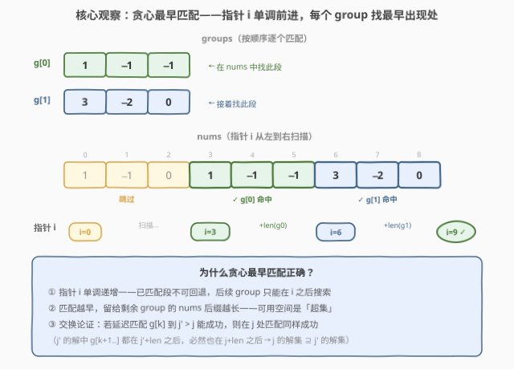
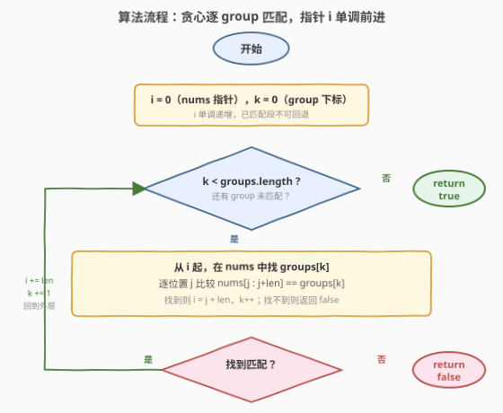
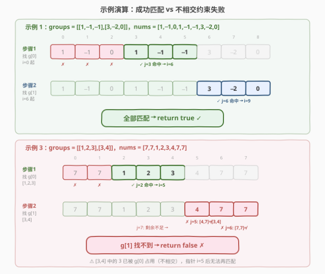

# 通过连接另一个数组的子数组得到一个数组

- **题目名称**：通过连接另一个数组的子数组得到一个数组
- **链接**：[1764. 通过连接另一个数组的子数组得到一个数组](https://leetcode.cn/problems/form-array-by-concatenating-subarrays-of-another-array/)
- **难度**：中等
- **标签**：数组、贪心、字符串匹配

## 1. 题目概述

给定一个二维整数数组 `groups`（共 $n$ 个子数组）和一个整数数组 `nums`。问能否从 `nums` 中选出 $n$ 个**不相交**的子数组，使得第 $i$ 个子数组与 `groups[i]` 完全相同，且它们在 `nums` 中出现的先后顺序与 `groups` 中的顺序一致。

> **不相交**：没有任何一个 `nums[k]` 同时属于多个被选子数组。子数组是连续元素组成的序列。

**示例 1**：

```text
输入：groups = [[1,-1,-1],[3,-2,0]], nums = [1,-1,0,1,-1,-1,3,-2,0]
输出：true
解释：在 nums 中选 [1,-1,0,|1,-1,-1|,3,-2,0] 作为 groups[0]，
     再选 [1,-1,0,1,-1,-1,|3,-2,0|] 作为 groups[1]，两者不相交。
```

**示例 2**：

```text
输入：groups = [[10,-2],[1,2,3,4]], nums = [1,2,3,4,10,-2]
输出：false
解释：[10,-2] 必须出现在 [1,2,3,4] 之前，但 nums 中 [10,-2] 在后面，顺序不符。
```

**示例 3**：

```text
输入：groups = [[1,2,3],[3,4]], nums = [7,7,1,2,3,4,7,7]
输出：false
解释：[1,2,3] 在 index 2 命中后，[3,4] 需从 index 5 起搜索，
     nums[5:]=[4,7,7] 中找不到 [3,4]，返回 false。
```

**约束条件**：

- $1 \le \text{groups.length} \le 10^3$
- $1 \le \text{groups[i].length},\; \sum \text{groups[i].length} \le 10^3$
- $1 \le \text{nums.length} \le 10^3$
- $-10^7 \le \text{groups[i][j]},\; \text{nums[k]} \le 10^7$

> 💡 **关键结构**：子数组必须**连续**且**不相交**、顺序与 `groups` 一致。这等价于在 `nums` 上维护一个单调右移的指针 `i`，依次为每个 `group` 在 `nums[i:]` 中找首个匹配——典型的**贪心序列匹配**。

---

## 2. 解题思路

### 2.1 暴力思路：枚举所有子数组起始位置组合

最直觉的做法：对 `groups` 中每个 `group`，枚举它在 `nums` 中的起始位置，保证后一个 `group` 的起始位置在前一个匹配段之后，且各段不相交。若所有 `group` 都能找到合法位置则返回 `true`。

```text
dfs(k, startPos):           # 第 k 个 group 从 startPos 起搜索
    if k == n: return true
    for j = startPos .. nums.length - len(groups[k]):
        if nums[j : j+len] == groups[k]:
            if dfs(k+1, j + len): return true   # 递归匹配下一个
    return false
```

最坏情况搜索空间巨大（每个 `group` 可选位置多达 $O(m)$，共 $n$ 层），虽可剪枝但复杂度上界 $O(m^n)$，不可接受。

> ⚠️ **症结**：暴力递归没有利用「**匹配越早越好**」这一单调结构——后续 `group` 只关心前一个 `group` 结束在哪里，不关心具体在哪匹配。这使得我们可以贪心地选最早匹配。

### 2.2 核心观察：贪心最早匹配



关键洞察：维护一个指针 `i`（初始为 0），表示 `nums` 中当前可用的起始位置。对每个 `group`，从 `i` 开始向右扫描，找到**第一个**与 `group` 完全相同的子数组起始位置 `j`，然后令 `i = j + \text{len}(group)`，继续匹配下一个 `group`。若某个 `group` 在 `nums[i:]` 中找不到，返回 `false`。

**为什么贪心最早匹配是正确的？** 用**交换论证**：

- 设贪心将 `group[k]` 匹配在位置 $j$，而某最优解匹配在 $j^* > j$。
- 匹配后，贪心剩余可用后缀为 $\text{nums}[j + L_k:]$，最优解剩余为 $\text{nums}[j^* + L_k:]$。
- 由于 $j < j^*$，有 $\text{nums}[j + L_k:] \supseteq \text{nums}[j^* + L_k:]$（前者是更长的后缀，包含后者）。
- 最优解中 `group[k+1..]` 的匹配全部落在 $\text{nums}[j^* + L_k:]$ 中，因此也必然落在 $\text{nums}[j + L_k:]$ 中。
- 即贪心选择不劣于任何其他选择。$\square$

> 💡 **本质**：指针 `i` **单调递增**——已匹配段不可回退。这使得问题从「$n$ 层组合搜索」降为「$n$ 次顺序子串搜索」，每次搜索只需在剩余后缀中找首个匹配。与 [28. strStr](https://leetcode.cn/problems/find-the-index-of-the-first-occurrence-in-a-string/) 的子串搜索是同一操作，只是要连续做 $n$ 次、起点受前一次约束。

### 2.3 算法流程图



1. **初始化**：`i = 0`（`nums` 指针），`k = 0`（`groups` 下标）。
2. **外层循环**：对每个 `groups[k]`，令 $L = \text{len}(\text{groups}[k])$。
3. **内层搜索**：从 `i` 起，逐位置 `j` 比较 $\text{nums}[j : j+L]$ 与 $\text{groups}[k]$：
   - **命中**：`i = j + L`，`k++`，回到外层。
   - **未命中**：`j++` 继续尝试。
4. **终止条件**：
   - 所有 `group` 匹配完毕（`k == n`）→ 返回 `true`。
   - 某 `group` 在剩余 `nums` 中找不到（`i + L > m` 且无匹配）→ 返回 `false`。

### 2.4 示例演算



**示例 1**（成功）：`groups = [[1,-1,-1],[3,-2,0]]`，`nums = [1,-1,0,1,-1,-1,3,-2,0]`

| 步骤 | 待匹配 `group` | 搜索起点 `i` | 尝试位置 | 命中位置 `j` | 新 `i` |
|------|----------------|-------------|---------|------------|--------|
| 1 | `[1,-1,-1]` | 0 | j=0,1,2 失败 | j=3 | 6 |
| 2 | `[3,-2,0]` | 6 | j=6 即命中 | j=6 | 9 |

两个 `group` 全部匹配，返回 `true`。

**示例 3**（失败）：`groups = [[1,2,3],[3,4]]`，`nums = [7,7,1,2,3,4,7,7]`

| 步骤 | 待匹配 `group` | 搜索起点 `i` | 尝试位置 | 结果 |
|------|----------------|-------------|---------|------|
| 1 | `[1,2,3]` | 0 | j=0,1 失败 | j=2 命中，i=5 |
| 2 | `[3,4]` | 5 | j=5: `[4,7]`≠；j=6: `[7,7]`≠；j=7: 剩余不足 | 未找到 |

> ⚠️ **为什么不能让 `[3,4]` 复用 index 4 的 `3`？** 因为 `[1,2,3]` 已占用 index 2–4，**不相交**约束禁止 `nums[4]` 同时属于两个子数组。贪心指针 `i=5` 已跳过已匹配段，天然保证了不相交。

---

## 3. 参考代码

### C++

```cpp
class Solution {
public:
    bool canChoose(vector<vector<int>>& groups, vector<int>& nums) {
        int i = 0, n = nums.size();
        for (const auto& g : groups) {
            int len = g.size();
            bool found = false;
            while (i + len <= n) {
                if (equal(g.begin(), g.end(), nums.begin() + i)) {
                    i += len;
                    found = true;
                    break;
                }
                ++i;
            }
            if (!found) return false;
        }
        return true;
    }
};
```

### Python

```python
class Solution:
    def canChoose(self, groups: List[List[int]], nums: List[int]) -> bool:
        i = 0
        n = len(nums)
        for g in groups:
            length = len(g)
            found = False
            while i + length <= n:
                if nums[i:i + length] == g:
                    i += length
                    found = True
                    break
                i += 1
            if not found:
                return False
        return True
```

> 💡 **写法对照**：两版逻辑完全一致——外层遍历 `groups`，内层从 `i` 起逐位置比较子数组。C++ 用 `std::equal` 避免构造临时 `vector`；Python 用切片 `nums[i:i+length] == g` 直接比较，切片在 CPython 层用 `memcmp` 加速，对小数组足够高效。
>
> ⚠️ **指针 `i` 的双重职责**：既是搜索起点，也是「已匹配段的右边界」。匹配成功后 `i += len` 直接跳过整段，天然保证不相交——无需额外的「占用标记」数组。

---

## 4. 复杂度分析

| 维度 | 复杂度 | 说明 |
|------|--------|------|
| 时间复杂度 | $O(n \cdot S)$ | $n = \text{nums.length}$，$S = \sum \text{groups[i].length}$。指针 `i` 单调递增至多前进 $n$ 次，每次比较最多 $O(L_k)$，总比较量 $\le O(n \cdot \max L_k) \le O(n \cdot S)$ |
| 空间复杂度 | $O(1)$ | 仅指针 `i` 与常数变量，无额外数据结构 |

> 💡 **实际远优于上界**：多数失配在首元素即 `break`（平均 $O(1)$/次），总比较量接近 $O(n + S)$。最坏情况（`groups` 与 `nums` 共享长公共前缀）才触及 $O(n \cdot S)$。约束 $n, S \le 10^3$ 下最坏 $10^6$ 次比较，完全可接受。

---

## 5. 扩展：KMP 优化与多模式匹配

当 $n$ 与 $S$ 增大（如 $10^5$ 级别）时，朴素逐位比较会超时。可做如下优化：

**单模式 KMP**：对每个 `group` 构建 `next` 失配表，在 `nums[i:]` 中 $O(\text{nums.length} + L_k)$ 完成搜索。总时间 $O(n \cdot \sum L_k + \text{nums.length} \cdot |\text{groups}|)$，比朴素更优当 `groups` 较少但各自较长时。

**多模式 Aho-Corasick**：若 `groups` 间无顺序约束（只需各自在 `nums` 中出现且不相交），可构建 AC 自动机一次扫描 `nums` 同时匹配所有 `group`。但本题**顺序约束**要求 `group[k]` 必须出现在 `group[k-1]` 之后，AC 自动机的并行匹配不直接适用，仍需按序处理。

> 💡 **本题朴素法已足够的根本原因**：约束 $\sum L_k \le 10^3$ 且 $\text{nums.length} \le 10^3$，数据规模小。KMP 的价值在于 $O(n + L)$ 的线性保证，在数据量大、公共前缀长时才拉开差距——这是「**子串搜索**」问题从 [28. strStr](https://leetcode.cn/problems/find-the-index-of-the-first-occurrence-in-a-string/) 朴素法到 KMP 的同一优化路径。

---

## 6. 面试要点

**Q1：为什么贪心最早匹配是正确的？能用交换论证说明吗？**
> 指针 `i` 单调递增，`group[k]` 匹配越早，剩余后缀 `nums[i:]` 越长。设贪心匹配在 $j$、某解在 $j^* > j$，则 $\text{nums}[j+L:] \supseteq \text{nums}[j^*+L:]$，后者中的合法匹配必在前者中成立。故贪心不劣于任何选择。

**Q2：如何保证选出的子数组不相交？**
> 指针 `i` 在匹配成功后直接 `i += len(group)`，跳过整段已匹配区域。后续 `group` 只从 `i` 起搜索，物理上不可能与已匹配段重叠。无需额外标记数组。

**Q3：本题与「子序列匹配」问题（如 1713）有何区别？**
> 本题要求子数组**连续**（`nums[j:j+L] == group`），而子序列允许跳过中间元素。连续约束使得匹配位置确定后整个段确定，贪心指针法 $O(n \cdot S)$ 即可；子序列匹配需 LCS/DP，复杂度更高。1713「得到子序列的最少操作次数」正是子序列版本，用 LIS 优化到 $O(n \log n)$。

**Q4：如果 `groups` 间无顺序约束（只需各自出现且不相交），做法会变吗？**
> 会。无序约束下需决定各 `group` 的匹配先后与位置分配，属于区间调度/匹配问题，贪心不再直接适用。可用 AC 自动机多模式匹配 + 区间贪心，复杂度与分析都更复杂。本题的顺序约束反而是简化条件。

**Q5：内层搜索为什么不用 KMP？什么时候该用？**
> 约束 $\sum L_k \le 10^3$、$\text{nums.length} \le 10^3$，朴素比较最坏 $10^6$ 完全可接受，KMP 的 `next` 表构建反而增加常数。当 `nums` 与 `groups` 规模达 $10^5$ 且共享长公共前缀时，朴素退化为 $O(n \cdot L)$ 超时，KMP 的 $O(n + L)$ 线性优势才显现。

---

## 7. 同类练习题

- [28. 找出字符串中第一个匹配项的下标](https://leetcode.cn/problems/find-the-index-of-the-first-occurrence-in-a-string/)（[题解](../0001-0100/28_找出字符串中第一个匹配项的下标.md)）：子串搜索母题，本题内层循环即一次朴素 `strStr`，KMP 是其线性优化
- [689. 三个无重叠子数组的最大和](https://leetcode.cn/problems/maximum-sum-of-3-non-overlapping-subarrays/)：同为「不相交子数组选择」，但求最大和需滑窗 + DP，对比本题贪心适用的条件（顺序固定 + 精确匹配）
- [686. 重复叠加字符串匹配](https://leetcode.cn/problems/repeated-string-match/)：字符串匹配变体，判断子串是否在重复叠加串中出现，与本题内层搜索同源
- [1713. 得到子序列的最少操作次数](https://leetcode.cn/problems/minimum-operations-to-make-a-subsequence/)（[题解](../1701-1800/1713_得到子序列的最少操作次数.md)）：子序列匹配（可不连续），对比本题子数组（必须连续）的约束差异与解法分叉
