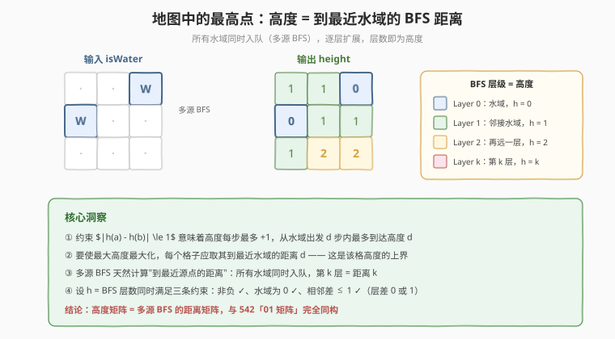
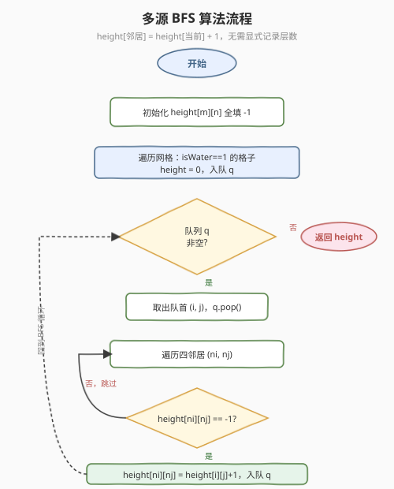

# 地图中的最高点

- **题目名称**：地图中的最高点
- **链接**：[1765. 地图中的最高点](https://leetcode.cn/problems/map-of-highest-peak/)
- **难度**：中等
- **标签**：广度优先搜索、矩阵、多源 BFS

## 1. 题目概述

给定 $m \times n$ 的整数矩阵 `isWater`，表示一张由水域和陆地组成的地图：

- `isWater[i][j] == 1`：该格为**水域**
- `isWater[i][j] == 0`：该格为**陆地**

需要为每个格子分配一个**非负整数高度**，满足以下规则：

1. 高度非负
2. 水域高度必须为 $0$
3. 任意两个**相邻**（上下左右）格子的高度差**绝对值不超过 1**

目标是使网格中**最大高度尽可能大**。返回任意一个满足条件的分配方案。

**示例 1**：

```text
输入：isWater = [[0,1],[0,0]]
输出：[[1,0],[2,1]]
解释：(0,1) 是水域，高度 0；(0,0) 邻接水域，高度 1；(1,0) 距水域 2 步，高度 2。
```

**示例 2**：

```text
输入：isWater = [[0,0,1],[1,0,0],[0,0,0]]
输出：[[1,1,0],[0,1,1],[1,2,2]]
解释：两处水域 (0,2) 和 (1,0) 高度为 0；逐层向外扩展，最远格 (2,1)/(2,2) 高度为 2。
```

**约束条件**：

- $m = \text{isWater.length}$
- $n = \text{isWater}[i].\text{length}$
- $1 \le m, n \le 1000$
- $\text{isWater}[i][j] \in \{0, 1\}$
- 至少有一个 `1`（水域）

> 💡 **关键结构**：规则 3 把相邻格子的高度「绑」成不等式 $|h(a) - h(b)| \le 1$，而规则 2 给定了高度为 $0$ 的「锚点」（水域）。这是典型的**多源约束传播**信号——从已知高度的源点出发，逐层向外确定未知格的高度，BFS 天然适配这种"逐层等距扩展"的结构。

---

## 2. 解题思路

### 2.1 暴力思路：逐格尝试所有高度

最直觉的做法是对每个陆地格尝试所有可能的高度值，再用回溯/约束求解器验证全局是否满足三条规则。但高度上限不明确（最大可能到 $m+n$），搜索空间极大，且约束传播关系复杂，实际不可行。

> ⚠️ **症结**：暴力把问题当成"自由赋值 + 事后校验"，没有利用约束的**方向性**——高度差 $\le 1$ 意味着高度沿任意路径每步最多变化 1，因此一个格子的最大高度被它到最近水域的**距离**严格约束。不利用这一上界，搜索空间无法收敛。

### 2.2 核心观察：高度 = 到最近水域的 BFS 距离（多源 BFS）



关键洞察分为两步——**上界**与**可达**：

**① 上界：每个格子的高度 $\le$ 它到最近水域的距离 $d$**

从任意格子到最近水域的路径长度为 $d$。沿这条路径，高度从 $0$（水域）出发，每步最多 $+1$，因此到达该格时高度最多为 $d$。这是规则 2 + 规则 3 推出的**硬上界**。

**② 可达：令高度恰好等于 $d$ 是可行的**

设每个格子的高度 $h(i,j) = d(i,j)$（到最近水域的 BFS 距离）。验证三条规则：

| 规则 | 验证 |
|------|------|
| 高度非负 | $d \ge 0$ ✓（距离非负） |
| 水域高度为 0 | $d(\text{水域}) = 0$ ✓（到自身的距离为 0） |
| 相邻差 $\le 1$ | 相邻格到同一水域的距离差 $\le 1$ ✓（三角不等式：走一步距离最多变化 1） |

因此 $h = d$ 同时满足所有约束，且每个格子都取到了上界——**整体最大高度被最大化**。

**③ 计算 $d$：多源 BFS**

$d(i,j)$ 是"到最近水域的距离"，这正是**多源 BFS** 的定义：所有水域同时入队（高度 0），逐层扩展，第 $k$ 层的格子高度为 $k$。

$$
\boxed{\;h(i,j) = \min_{\text{水域 } (r,c)} \big(|i-r| + |j-c|\big) = \text{多源 BFS 层数}\;}
$$

> 💡 **与 [542. 01 矩阵](https://leetcode.cn/problems/01-matrix/) 的同构**：542 求每个 0 到最近 1 的距离——把 0 当水域、1 当陆地，完全等价。两题共用同一套多源 BFS 模板，只是输入含义不同（`isWater` 的 1 = 水域 vs `mat` 的 0 = 源点）。掌握一题即掌握另一题。

### 2.3 算法流程图



1. **初始化**：`height` 矩阵全填 $-1$（标记未访问）。
2. **多源入队**：遍历网格，所有 `isWater[i][j] == 1` 的格子设 `height = 0`，入队。
3. **BFS 扩展**：队列非空时，取出队首 $(i, j)$，遍历四邻居 $(n_i, n_j)$：
   - 若 `height[ni][nj] == -1`（未访问）：`height[ni][nj] = height[i][j] + 1`，入队
   - 否则跳过
4. **终止**：队列空时返回 `height` 矩阵。

> 💡 **无需显式记录层数**：与 [994 腐烂的橘子](../0901-1000/994_腐烂的橘子.md) 不同，本题不需要 `size = q.size()` 按层处理——因为高度是**相对赋值**（`height[父] + 1`），而非**绝对计数**（层数）。每个格子被最近的源点首次到达时，父节点的高度已经编码了正确的距离信息。按层处理也正确（结果相同），但相对赋值更简洁。

### 2.4 示例演算

以示例 2 `isWater = [[0,0,1],[1,0,0],[0,0,0]]` 为例：

![示例演算：多源 BFS 逐层赋值，Layer 0→1→2，最终输出 [[1,1,0],[0,1,1],[1,2,2]]](../images/1765_example_walkthrough.svg)

| 层 | frontier（队首弹出） | 新赋值格子 | 队列变化 |
|----|---------------------|-----------|----------|
| 0 | — | $(0,2)$ h=0, $(1,0)$ h=0 | `q: [(0,2), (1,0)]` |
| 1 | $(0,2)$, $(1,0)$ | $(0,1)$ h=1, $(1,2)$ h=1, $(1,1)$ h=1, $(2,0)$ h=1 | `q: [(0,1),(1,2),(1,1),(2,0)]` |
| 2 | $(0,1)$, $(1,2)$, $(1,1)$, $(2,0)$ | $(2,1)$ h=2, $(2,2)$ h=2 | `q 空` |

最终 `height = [[1,1,0],[0,1,1],[1,2,2]]` ✓，最大高度 $= 2$。

> 💡 **为什么每个格子只被赋值一次？** BFS 保证一个格子首次被访问时，是从最近的源点到达的（最短路径性质）。之后即使其他源点的扩展波及该格，`height != -1` 会被跳过——这就是用 $-1$ 标记"未访问"的作用，等价于"已赋最优值，无需更新"。

---

## 3. 参考代码

### C++

```cpp
class Solution {
public:
    vector<vector<int>> highestPeak(vector<vector<int>>& isWater) {
        int m = isWater.size(), n = isWater[0].size();
        vector<vector<int>> height(m, vector<int>(n, -1));
        queue<pair<int, int>> q;
        for (int i = 0; i < m; i++)
            for (int j = 0; j < n; j++)
                if (isWater[i][j] == 1) {
                    height[i][j] = 0;
                    q.push({i, j});
                }
        int dirs[4][2] = {{0, 1}, {0, -1}, {1, 0}, {-1, 0}};
        while (!q.empty()) {
            auto [i, j] = q.front();
            q.pop();
            for (auto& d : dirs) {
                int ni = i + d[0], nj = j + d[1];
                if (ni >= 0 && ni < m && nj >= 0 && nj < n && height[ni][nj] == -1) {
                    height[ni][nj] = height[i][j] + 1;
                    q.push({ni, nj});
                }
            }
        }
        return height;
    }
};
```

### Python

```python
class Solution:
    def highestPeak(self, isWater: List[List[int]]) -> List[List[int]]:
        m, n = len(isWater), len(isWater[0])
        height = [[-1] * n for _ in range(m)]
        q = collections.deque()
        for i in range(m):
            for j in range(n):
                if isWater[i][j] == 1:
                    height[i][j] = 0
                    q.append((i, j))
        dirs = [(0, 1), (0, -1), (1, 0), (-1, 0)]
        while q:
            i, j = q.popleft()
            for di, dj in dirs:
                ni, nj = i + di, j + dj
                if 0 <= ni < m and 0 <= nj < n and height[ni][nj] == -1:
                    height[ni][nj] = height[i][j] + 1
                    q.append((ni, nj))
        return height
```

> 💡 **写法对照**：两版逻辑完全一致——`height` 初始化 $-1$ 标记未访问，水域入队后 BFS 逐层赋值 `height[父] + 1`。C++ 用 `queue<pair>`，Python 用 `collections.deque`，均 $O(1)$ 入队出队。
>
> ⚠️ **无溢出风险**：$m, n \le 1000$，最大高度 $\le m + n \le 2000$，`int` 完全足够。

---

## 4. 复杂度分析

| 维度 | 复杂度 | 说明 |
|------|--------|------|
| 时间复杂度 | $O(m \cdot n)$ | 每个格子最多入队一次、出队一次，每次检查 4 个邻居，总计 $O(4mn) = O(mn)$ |
| 空间复杂度 | $O(m \cdot n)$ | `height` 矩阵（返回值）+ 队列最坏存 $O(mn)$ 个格子；不计返回值则队列 $O(mn)$ |

> 💡 与暴力回溯的指数级搜索相比，多源 BFS 利用约束的**方向性**（从源点向外传播）将搜索空间压缩为 $O(mn)$——每个格子只被访问一次，首次访问即得最优解。

---

## 5. 扩展：多源 BFS 的等价视角——超级源点

多源 BFS 有一个优雅的等价转化：**虚拟一个"超级源点"**，连边到所有真实源点（水域），边权为 0。则"每个格子到最近水域的距离" = "每个格子到超级源点的最短距离"。

```
超级源点 S ──0──→ 水域 A (h=0)
           └──0──→ 水域 B (h=0)
                    │
              BFS 从 S 出发
              A、B 同属 Layer 0
              其余格子按距离赋高
```

这一视角揭示了多源 BFS 的本质：**它就是单源 BFS**，只是把多个源点"折叠"为一个。因此所有单源 BFS 的性质（最短路径、层级扩展、首次访问即最优）都直接继承。

| 视角 | 源点 | 适用场景 |
|------|------|----------|
| 多源 BFS | 所有水域同时入队 | 直接编码，简洁（本题、542、994） |
| 超级源点 | 虚拟节点 → 各水域（边权 0） | 理论分析，统一为单源最短路框架 |

> 💡 **加权扩展**：若相邻格的高度差约束变为 $|h(a) - h(b)| \le w$（而非 1），只需把 BFS 换成 **Dijkstra**（边权 $w$）。多源 Dijkstra 与多源 BFS 的关系，恰如单源 Dijkstra 与单源 BFS 的关系——只是把队列换成优先队列。

---

## 6. 面试要点

**Q1：为什么多源 BFS 能保证最大高度被最大化？**

> 每个格子的高度上界 = 它到最近水域的距离 $d$（因为每步高度差 $\le 1$，从高度 0 的水域出发 $d$ 步最多到 $d$）。多源 BFS 令 $h = d$ 恰好达到上界，且满足所有约束，因此是**逐格最优**的——每个格子都取到了它能取的最大值，整体最大值自然被最大化。

**Q2：本题和 542「01 矩阵」有什么关系？**

> 完全同构。542 求每个 0 到最近 1 的距离，本题求每个陆地到最近水域的距离——把 542 的 0 当陆地、1 当水域，两题等价。共用同一套多源 BFS 模板，只是输入语义和输出格式不同。面试中遇到一题，可以直接联想到另一题。

**Q3：为什么不需要像 994 腐烂的橘子那样按层处理（`size = q.size()`）？**

> 994 需要**计数层数**（分钟数）作为返回值，必须显式区分每层。本题的高度是**相对赋值**（`height[邻居] = height[当前] + 1`），父节点的高度已编码了距离信息——不按层处理，每个格子首次被赋的值也是正确的 BFS 距离。两种写法结果相同，但相对赋值更简洁。

**Q4：为什么用 $-1$ 标记未访问？能否用 `visited` 布尔数组？**

> 可以用额外布尔数组，但 $-1$ 更省空间——`height` 矩阵本身就是返回值，用 $-1$ 兼任"未访问"标记，无需额外 $O(mn)$ 空间。由于高度非负，$-1$ 不会与合法高度冲突。这是"返回值兼状态表"的常见技巧。

**Q5：如果网格中没有水域（全是陆地）怎么办？**

> 约束条件保证至少有一个水域。若去除该保证，则没有高度为 0 的锚点，约束 2 无法满足，问题无解。面试中可追问这一边界，说明题目保证的必要性。

---

## 7. 同类练习题

- [542. 01 矩阵](https://leetcode.cn/problems/01-matrix/)：多源 BFS 求每个 0 到最近 1 的距离，与本题完全同构（模板互换）
- [994. 腐烂的橘子](https://leetcode.cn/problems/rotting-oranges/)（[题解](../0901-1000/994_腐烂的橘子.md)）：多源 BFS 求所有橘子腐烂的最少分钟数，需显式按层计数
- [1926. 网格图中递增路径的数目](https://leetcode.cn/problems/number-of-increasing-paths-in-a-grid/)：网格 DFS + 记忆化，对照 BFS 的另一种网格搜索范式
- [1162. 地图分析](https://leetcode.cn/problems/as-far-from-land-as-possible/)：多源 BFS 求离陆地最远的水域格，本题的"反向"——返回最大距离而非距离矩阵
- [286. 墙与门](https://leetcode.cn/problems/walls-and-gates/)：多源 BFS 从所有门出发填充到最近门的距离，本题的变体（门 = 水域，房间 = 陆地）
