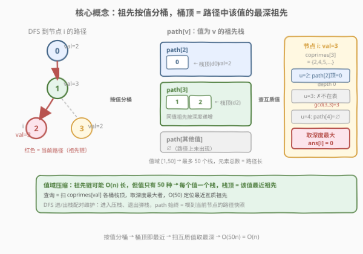
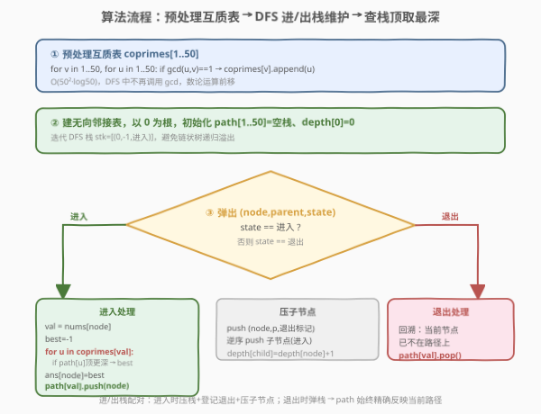
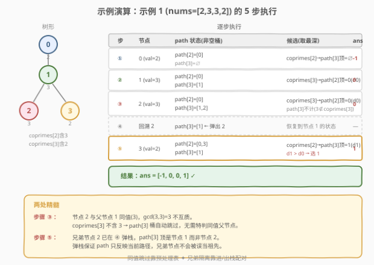

# 互质树

- **题目名称**：互质树
- **链接**：[1766. 互质树](https://leetcode.cn/problems/tree-of-coprimes/)
- **难度**：困难
- **标签**：树、深度优先搜索、数学、数论、状态维护

## 1. 题目概述

给定一棵 $n$ 个节点的**树**（无环连通无向图），节点编号 $0$ 到 $n-1$，**根节点为 0**。每个节点有一个值 `nums[i]`，`edges[j] = [uj, vj]` 表示一条边。

若 $\gcd(x, y) = 1$，称 $x$、$y$ **互质**。节点 $i$ 的**祖先**定义为从 $i$ 到根最短路径上的点（不含 $i$ 自身）。

对每个节点 $i$，求**离 $i$ 最近的祖先** $j$ 使得 `nums[i]` 与 `nums[j]` 互质；不存在则 `ans[i] = -1`。返回数组 `ans`。

**示例 1**：

```text
输入：nums = [2,3,3,2], edges = [[0,1],[1,2],[1,3]]
输出：[-1,0,0,1]
解释：树形 0(2) - 1(3) - {2(3), 3(2)}
- 节点 0：无祖先 → -1
- 节点 1：祖先 0，gcd(2,3)=1 → 0
- 节点 2：祖先 1、0；gcd(3,3)=3 不互质，gcd(2,3)=1 互质 → 0
- 节点 3：祖先 1、0；gcd(2,3)=1 互质（最近） → 1
```

**示例 2**：

```text
输入：nums = [5,6,10,2,3,6,15], edges = [[0,1],[0,2],[1,3],[1,4],[2,5],[2,6]]
输出：[-1,0,-1,0,0,0,-1]
```

**约束条件**：

- `nums.length == n`，$1 \le \text{nums[i]} \le 50$
- $1 \le n \le 10^5$
- `edges.length == n - 1`，构成一棵以 0 为根的树

> 💡 **决定性约束**：`nums[i]` 值域只有 $[1, 50]$——这是整道题的「钥匙」。值种类至多 50 种，可以按**值**而非按**节点**组织祖先信息，把 $O(n)$ 的祖先链压缩成 50 个小栈，每个节点只需扫 50 个值即可定位最近互质祖先。

---

## 2. 解题思路

### 2.1 暴力思路：每个节点回溯祖先链

最直觉的做法：以 0 为根 DFS 建树，对每个节点 $i$ 沿父指针一路向上枚举祖先 $j$，找到第一个满足 $\gcd(\text{nums}[i], \text{nums}[j]) = 1$ 的即停。

- 单节点最坏遍历 $O(n)$（链状树），$n$ 个节点合计 $O(n^2)$，$n = 10^5$ 时约 $10^{10}$ 次操作，**超时**。
- 每步还要算 $\gcd$，常数更大。

> ⚠️ **症结**：祖先链可能极长，逐个回溯无法利用「值域极小」这一结构。需要把祖先按**值**聚类，跳过不可能互质的祖先。

### 2.2 核心观察：按值分桶 + 桶顶即最近



#### 观察 1：互质只与「值」有关，与节点编号无关

$\gcd(\text{nums}[i], \text{nums}[j])$ 完全由两个**值**决定。若 `nums[j] = u`，则 $j$ 是否互质于 $i$ 只取决于 $\gcd(\text{nums}[i], u)$。因此候选祖先可以按 `nums[j]` 的值分类——同值的祖先「等效」（互质性相同），只需保留**最近**的那一个。

#### 观察 2：DFS 路径上的祖先 = 一个值域小栈集合

从根 DFS 到当前节点 $i$ 时，路径上的祖先序列是确定的。把这条路径上的祖先按值分桶：

$$\text{path}[v] = \text{路径上值为 } v \text{ 的祖先节点序列（按深度递增）}$$

由于 DFS 是「进入压栈、退出弹栈」，$\text{path}[v]$ 自然是一个**栈**：栈顶始终是当前路径中值为 $v$ 的**最深**祖先——也就是离 $i$ 最近的那个值为 $v$ 的祖先。

#### 观察 3：候选集 = 互质值的栈顶

对当前节点 $i$（值为 $val = \text{nums}[i]$），互质祖先的候选值集合为：

$$\text{coprimes}[val] = \{\, u \in [1,50] \mid \gcd(val, u) = 1 \,\}$$

只需扫描 $\text{coprimes}[val]$ 中每个 $u$，取 $\text{path}[u]$ 的栈顶（若非空），再在这些栈顶里挑**深度最大**的——即为最近互质祖先。

> 💡 **为何是「挑深度最大」而非「挑栈顶」？** 每个桶 $u$ 的栈顶已经是该值的最深祖先，但不同 $u$ 之间还要横向比深度——因为「最近」是跨所有互质值取的。例如值为 6 的节点，互质值 $\{1,5,7,\dots\}$ 各自栈顶深度不同，要选最深的那个。

#### 观察 4：预处理互质表，把 $\gcd$ 计算前移

值域 $[1,50]$ 只有 2500 对 $(u, v)$，可以**一次性预计算** `coprimes[v]`。DFS 中不再调用 $\gcd$，只做栈顶查询——把数论运算从 $O(n)$ 次降到 $O(50^2)$ 次。

### 2.3 算法流程图



**步骤**：

1. **预处理**：对 $v \in [1,50]$，枚举 $u \in [1,50]$，若 $\gcd(u, v) = 1$ 则把 $u$ 加入 `coprimes[v]`。
2. **建树**：由 `edges` 建无向邻接表，以 0 为根。
3. **DFS**（带 `path[1..50]` 栈集合与 `depth` 数组），对节点 $i$（值 $val$）：
   - **查答案**：遍历 $u \in \text{coprimes}[val]$，若 $\text{path}[u]$ 非空且其栈顶深度 $>$ 当前最佳，更新 `ans[i] = path[u] 栈顶`。
   - **入栈**：`path[val].append(i)`。
   - **递归**：对每个子节点（邻居中非父者）继续 DFS，`depth[child] = depth[i] + 1`。
   - **出栈**：`path[val].pop()`（回溯，保证 `path` 只反映当前路径）。
4. 返回 `ans`。

> ⚠️ **进/出栈必须配对**：`path` 反映的是「从根到当前节点」的路径。递归返回时必须弹栈，否则兄弟分支会看到不属于自己路径的「幽灵祖先」。这正是 2.4 示例中节点 4 不被节点 3 干扰的关键。

### 2.4 示例演算



以**示例 1** `nums = [2,3,3,2]`，树形 `0(2)─1(3)─{2(3), 3(2)}` 为例。`coprimes[3]` 含 $2$（$\gcd(3,2)=1$），`coprimes[2]` 含 $3$。

| 步骤 | 当前节点 | 入栈后各桶状态 | 候选（coprimes[val] 的栈顶） | ans |
|------|----------|----------------|------------------------------|-----|
| ① | 0 (val=2) | path[2]=[0] | coprimes[2]={3,…}，path[3]=∅ → 无 | -1 |
| ② | 1 (val=3) | path[3]=[1] | coprimes[3]={2,…}，path[2]顶=0(depth 0) → 0 | 0 |
| ③ | 2 (val=3) | path[3]=[1,2] | coprimes[3]={2,…}，path[2]顶=0；**path[3]不计**（3 不互质于 3）→ 0 | 0 |
| ④ 回溯2 | — | path[3]=[1] | （弹栈，恢复到节点 1 的状态） | — |
| ⑤ | 3 (val=2) | path[2]=[0,3] | coprimes[2]={3,…}，path[3]顶=1(depth 1) > path[2]…→ **1** | 1 |

> 💡 **步骤 ③ 的精髓**：节点 2 的值是 3，它的直接父节点 1 值也是 3，$\gcd(3,3)=3$ **不互质**。由于 `coprimes[3]` 根本不含 3 自身，`path[3]` 这个桶被自动跳过——算法天然忽略「同值不互质」的祖先，无需特判。这正是「按值分桶 + 预处理互质表」的优雅之处。

> 💡 **步骤 ⑤ 的精髓**：节点 3 的值是 2，互质值含 3。此时 `path[3]` 栈顶是节点 1（步骤 ④ 已把节点 2 弹出），深度 1，比 `path[5]`、`path[1]` 等空桶都深 → 选节点 1。注意节点 2 已在回溯时弹出，不会误当作节点 3 的祖先（它本是兄弟节点）。

**示例 2** 同理：节点 4 (val=3) 处理时，兄弟节点 3 (val=2) 已弹栈，`path[2]` 为空，故候选只剩 `path[5]` 顶 = 节点 0 → `ans[4]=0`；节点 6 (val=15) 的祖先 0(5)、2(10) 都不互质于 15（$\gcd(15,5)=5$、$\gcd(15,10)=5$），所有互质值桶皆空 → `ans[6]=-1`。

---

## 3. 参考代码

### Python

```python
from math import gcd

class Solution:
    def getCoprimes(self, nums: List[int], edges: List[List[int]]) -> List[int]:
        n = len(nums)
        # 预处理互质表：coprimes[v] = [u in 1..50 if gcd(u,v)==1]
        coprimes = [[] for _ in range(51)]
        for v in range(1, 51):
            for u in range(1, 51):
                if gcd(u, v) == 1:
                    coprimes[v].append(u)

        # 建无向邻接表
        adj = [[] for _ in range(n)]
        for u, v in edges:
            adj[u].append(v)
            adj[v].append(u)

        ans = [-1] * n
        depth = [0] * n
        # path[v] = 当前 DFS 路径上值为 v 的祖先节点栈（栈顶=最深）
        path = [[] for _ in range(51)]

        # 迭代 DFS（进/出栈配对），避免链状树递归栈溢出
        stack = [(0, -1, 0)]  # (node, parent, state)  state 0=进入 1=退出
        while stack:
            node, parent, state = stack.pop()
            if state == 0:
                val = nums[node]
                # 查答案：扫 coprimes[val] 各桶栈顶，取深度最大
                best, best_dep = -1, -1
                for u in coprimes[val]:
                    if path[u] and depth[path[u][-1]] > best_dep:
                        best = path[u][-1]
                        best_dep = depth[best]
                ans[node] = best
                # 入栈
                path[val].append(node)
                # 登记退出动作
                stack.append((node, parent, 1))
                # 子节点入栈（逆序保证处理顺序与邻接表顺序一致）
                for child in reversed(adj[node]):
                    if child != parent:
                        depth[child] = depth[node] + 1
                        stack.append((child, node, 0))
            else:
                # 退出：弹栈，恢复路径
                path[nums[node]].pop()

        return ans
```

### C++

```cpp
class Solution {
public:
    vector<int> getCoprimes(vector<int>& nums, vector<vector<int>>& edges) {
        int n = nums.size();
        // 预处理互质表
        vector<vector<int>> coprimes(51);
        for (int v = 1; v <= 50; ++v)
            for (int u = 1; u <= 50; ++u)
                if (gcd(u, v) == 1) coprimes[v].push_back(u);

        // 建无向邻接表
        vector<vector<int>> adj(n);
        for (auto& e : edges) {
            adj[e[0]].push_back(e[1]);
            adj[e[1]].push_back(e[0]);
        }

        vector<int> ans(n, -1), depth(n, 0);
        vector<vector<int>> path(51); // path[v] = 值为 v 的祖先节点栈

        // 迭代 DFS（进/出栈配对）
        // stack 元素：{node, parent, state}，state 0=进入 1=退出
        vector<array<int,3>> stk;
        stk.reserve(n * 2);
        stk.push_back({0, -1, 0});
        while (!stk.empty()) {
            auto [node, parent, state] = stk.back();
            stk.pop_back();
            if (state == 0) {
                int val = nums[node];
                int best = -1, best_dep = -1;
                for (int u : coprimes[val]) {
                    if (!path[u].empty() && depth[path[u].back()] > best_dep) {
                        best = path[u].back();
                        best_dep = depth[best];
                    }
                }
                ans[node] = best;
                path[val].push_back(node);
                stk.push_back({node, parent, 1}); // 退出标记
                for (int i = (int)adj[node].size() - 1; i >= 0; --i) {
                    int child = adj[node][i];
                    if (child != parent) {
                        depth[child] = depth[node] + 1;
                        stk.push_back({child, node, 0});
                    }
                }
            } else {
                path[nums[node]].pop_back();
            }
        }
        return ans;
    }
};
```

> ⚠️ **为何用迭代 DFS？** $n \le 10^5$，树可能退化为链，递归深度达 $10^5$，Python 默认递归上限 1000 必爆栈，C++ 也会栈溢出。迭代版用显式栈 + 进/出标记，彻底规避栈深度问题。若用递归，Python 须 `sys.setrecursionlimit(200000)` 且仍有 C 栈溢出风险。
>
> ⚠️ **`path` 用 `vector`/`list` 当栈**：每个值一个栈，所有栈的元素总数 = 当前路径长度 $\le n$，空间 $O(n)$。`push_back`/`pop_back` 均摊 $O(1)$。

---

## 4. 复杂度分析

| 维度 | 复杂度 | 说明 |
|------|--------|------|
| 时间复杂度 | $O(50n + 50^2\log 50)$ | 预处理互质表 $O(50^2 \log 50)$；DFS 访问 $n$ 个节点，每节点扫 $\|\text{coprimes}[val]\| \le 50$ 个桶、每桶栈顶查询 $O(1)$，合计 $O(50n)$。化简为 $O(n)$ |
| 空间复杂度 | $O(n)$ | 邻接表 $O(n)$；`path` 所有栈元素总数 = 当前路径长 $\le n$；`depth`、`ans` 各 $O(n)$；互质表 $O(50^2)$ 为常数 |

> 💡 **与暴力 $O(n^2)$ 的差距**：暴力每节点回溯整条祖先链 $O(n)$；本算法把祖先按值压缩到 50 个栈，每节点只扫 50 个值——把「按节点找」换成「按值找」，利用值域极小这一约束把 $O(n^2)$ 降到 $O(50n)$。这是典型的**值域压缩**思想：当数据值域远小于数据规模时，按值分桶往往能把线性因子替换成值域大小。

---

## 5. 扩展：递归版与「同值互质」的细节

### 5.1 递归版（供对照理解逻辑）

若树深度有保证（如题目额外保证平衡），递归写法更贴近思路描述：

```python
class Solution:
    def getCoprimes(self, nums, edges):
        from math import gcd
        coprimes = [[u for u in range(1, 51) if gcd(u, v) == 1] for v in range(51)]
        n = len(nums)
        adj = [[] for _ in range(n)]
        for u, v in edges:
            adj[u].append(v); adj[v].append(u)
        ans = [-1] * n
        path = [[] for _ in range(51)]

        def dfs(node, parent, dep):
            val = nums[node]
            best, best_dep = -1, -1
            for u in coprimes[val]:
                if path[u] and len(path[u]) and depth_of(path[u][-1]) > best_dep:
                    ...   # depth_of 需用单独数组，此处略
            path[val].append(node)
            for child in adj[node]:
                if child != parent:
                    dfs(child, node, dep + 1)
            path[val].pop()

        depth = [0] * n
        # dfs(0, -1, 0) ...
        return ans
```

> ⚠️ 上述仅为逻辑示意，工程实现仍推荐第 3 节的迭代版。递归版的优势是「进栈 → 递归 → 出栈」的配对一目了然，便于理解 `path` 的维护时机。

### 5.2 `gcd(x, x) = x`，同值必不互质（除 1 外）

对任意 $x > 1$，$\gcd(x, x) = x \ne 1$，故同值节点之间**必不互质**。这保证 `coprimes[v]` 中不含 $v$ 自身（除 $v=1$ 外：$\gcd(1,1)=1$，1 与自己互质）。算法无需特判「父节点同值」——`coprimes[val]` 天然不含 `val`（$val \ne 1$ 时），`path[val]` 这个桶被自动跳过。

> 💡 **$val = 1$ 的特殊性**：1 与所有数互质（$\gcd(1, u) = 1$ 对任意 $u$），故 `coprimes[1] = [1..50]`，包含 1 自身。值为 1 的节点会查 `path[1]` 栈顶——即最近的值为 1 的祖先，这也是正确的（1 与 1 互质）。

---

## 6. 面试要点

**Q1：为什么不能对每个节点直接回溯祖先链找互质祖先？**

> 单节点回溯最坏 $O(n)$（链状树），$n$ 个节点合计 $O(n^2) \approx 10^{10}$，超时。祖先链可能极长但「值的种类」只有 50 种——大量祖先是同值冗余。按值分桶后每桶只留最近一个，把 $O(n)$ 的祖先链压缩成 50 个栈顶，查询从 $O(n)$ 降到 $O(50)$。

**Q2：`path` 为什么必须是栈？栈顶代表什么？**

> `path[v]` 记录「当前 DFS 路径上值为 $v$ 的祖先」。DFS 的进入/退出天然对应压栈/弹栈，栈顶始终是**当前路径中值为 $v$ 的最深祖先**——也就是离当前节点最近的那个。若不用栈（比如用集合），就无法在 $O(1)$ 取「最近」，只能 $O(n)$ 遍历找最深，退回暴力。

**Q3：为什么要在递归返回时弹栈？不弹会怎样？**

> `path` 必须严格反映「从根到当前节点」的路径。递归返回时当前节点已不在路径上，必须弹掉，否则兄弟分支会看到不属于自己路径的「幽灵祖先」。例如示例 1 节点 4 处理时，若节点 3 没弹栈，`path[2]` 会误含兄弟节点 3，导致把兄弟当祖先。弹栈保证了 `path` 始终是当前路径的精确快照。

**Q4：为什么选「深度最大的栈顶」而不是「第一个非空桶」？**

> 每个桶 $u$ 的栈顶是该值的最深祖先，但「最近」是跨所有互质值取的——要找深度最大的那个。例如节点值为 6，互质值 $\{1, 5, 7\}$ 各自栈顶深度可能为 $3, 5, 2$，应选深度 5 的那个（值为 5 的祖先），而非第一个遇到的。遍历所有互质值取 `max depth` 才能保证「最近」。

**Q5：`nums[i] = 1` 时算法有何特殊表现？**

> 1 与所有数互质，`coprimes[1]` 包含全部 $1..50$。算法会扫描所有 50 个桶取栈顶最深者——等价于「找当前路径上最深的任意祖先」，即直接父节点（若存在）。这正是正确答案：1 与任何祖先都互质，最近的祖先就是父节点。

> 💡 **一句话总结**：值域 $[1,50]$ 是钥匙——按值分桶把祖先链压成 50 个栈，DFS 进/出栈维护各桶栈顶，查询时扫互质值取最深，$O(50n) = O(n)$ 搞定。

---

## 7. 同类练习题

- [236. 二叉树的最近公共祖先](https://leetcode.cn/problems/lowest-common-ancestor-of-a-binary-tree/)（[题解](../0201-0300/236_二叉树的最近公共祖先.md)）：树上祖先链问题的基石，对照理解「从根到节点的路径」如何被 DFS 自然维护
- [1740. 找到二叉树中的距离](../1701-1800/1740_找到二叉树中的距离.md)：同样需要 LCA / 祖先路径信息，对照「需要祖先链但不按值压缩」的常规做法
- [149. 直线上最多的点数](https://leetcode.cn/problems/max-points-on-a-line/)（[题解](../0101-0200/149_直线上最多的点数.md)）：另一道「值域极小（斜率分数化简后哈希）」的数论题，思路同源——把连续信息离散化到有限桶
- [1444. 切披萨的方案](https://leetcode.cn/problems/number-of-ways-of-cutting-a-pizza/)：DFS + 状态维护的另一个典型，对照理解「在 DFS 中维护前缀信息」的通用范式
- [1125. 最小的必要团队](https://leetcode.cn/problems/smallest-sufficient-team/)：值域压缩 + 状态压缩的代表作，进一步体会「值域小→按值/状态组织」的降维思想
