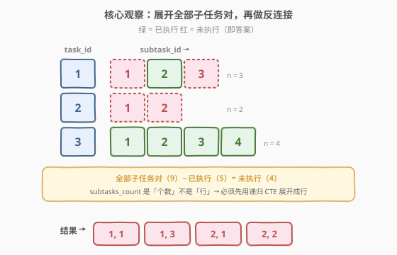
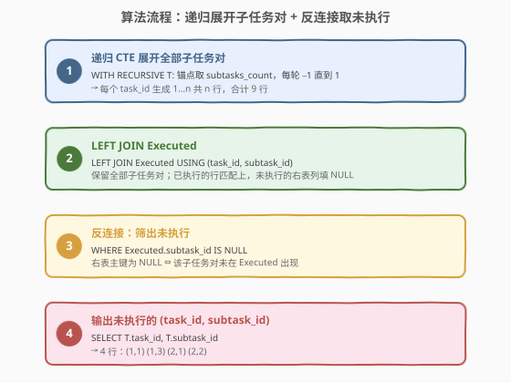
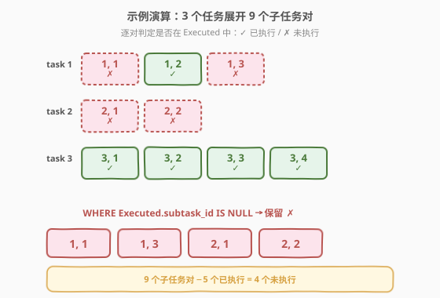

# 寻找没有被执行的任务对

- **题目名称**：寻找没有被执行的任务对
- **链接**：[1767. 寻找没有被执行的任务对](https://leetcode.cn/problems/find-the-subtasks-that-did-not-execute/)
- **难度**：困难
- **标签**：数据库、SQL、`WITH RECURSIVE`、递归 CTE、序列生成、反连接（`LEFT JOIN … IS NULL`）、`NOT EXISTS`、`NOT IN`、LeetCode 锁题

> ⚠️ **本题是 LeetCode Plus 会员专享题**，官方题面需登录会员查看。下方题面依据平台公开的建表语句与示例数据复原，描述与官方一致。

## 1. 题目概述

给定 `Tasks` 与 `Executed` 两张表。`Tasks` 中每行记录一个主任务 `task_id` 及其**子任务个数** `subtasks_count`（子任务编号从 `1` 到 `subtasks_count`）。`Executed` 中每行记录一个**已成功执行**的 `(task_id, subtask_id)` 对。要求编写 SQL 查询，返回**没有被执行**的 `(task_id, subtask_id)` 对，结果可按任意顺序返回。

**表结构**：

```text
Table: Tasks
+----------------+---------+
| Column Name    | Type    |
+----------------+---------+
| task_id        | int     |  ← 具有唯一值
| subtasks_count | int     |
+----------------+---------+
task_id 表示主任务 id，subtasks_count 表示子任务个数 n，
子任务编号从 1 到 n。保证 2 <= subtasks_count <= 20。

Table: Executed
+---------------+---------+
| Column Name   | Type    |
+---------------+---------+
| task_id       | int     |
| subtask_id    | int     |
+---------------+---------+
(task_id, subtask_id) 是该表具有唯一值的列的组合。
每行表示某主任务的某子任务被成功执行。
保证 subtask_id <= 对应任务的 subtasks_count。
```

**示例 1**：

```text
输入：
Tasks 表:
+---------+----------------+
| task_id | subtasks_count |
+---------+----------------+
| 1       | 3              |
| 2       | 2              |
| 3       | 4              |
+---------+----------------+

Executed 表:
+---------+------------+
| task_id | subtask_id |
+---------+------------+
| 1       | 2          |
| 3       | 1          |
| 3       | 2          |
| 3       | 3          |
| 3       | 4          |
+---------+------------+

输出：
+---------+------------+
| task_id | subtask_id |
+---------+------------+
| 1       | 1          |
| 1       | 3          |
| 2       | 1          |
| 2       | 2          |
+---------+------------+
```

**解释**：

| task_id | subtasks_count | 应有子任务 | 已执行 | 未执行 |
|---------|----------------|-----------|--------|--------|
| 1 | 3 | {1, 2, 3} | {2} | {1, 3} |
| 2 | 2 | {1, 2} | {} | {1, 2} |
| 3 | 4 | {1, 2, 3, 4} | {1, 2, 3, 4} | {} |

- Task 1 分成 3 个子任务，只有子任务 2 被执行，返回 `(1, 1)`、`(1, 3)`。
- Task 2 分成 2 个子任务，无任何子任务被执行，返回 `(2, 1)`、`(2, 2)`。
- Task 3 分成 4 个子任务，全部被执行，不返回任何行。

**约束条件**：

- `task_id` 是 `Tasks` 表具有唯一值的列。
- `2 <= subtasks_count <= 20`。
- `(task_id, subtask_id)` 是 `Executed` 表的唯一组合列，且 `subtask_id <= subtasks_count`。
- 结果可按任意顺序返回。

> 💡 本题是 SQL **"序列展开 + 反连接"招牌题**——核心难点不在反连接本身，而在 `subtasks_count` 是一个**计数**而非现成的行。要找"未执行的子任务"，必须先把每个 `task_id` 的 `1…subtasks_count` **展开成行**，再用反连接剔除已执行的。`WITH RECURSIVE` 是在纯 SQL 中完成"计数 → 行"展开的标准工具。

---

## 2. 解题思路

### 2.1 暴力思路：应用层循环

最直觉的过程式思路：取回所有任务，对每个任务在宿主语言里 `for sid in range(1, n+1)` 生成子任务编号，再去 `Executed` 表里查是否存在该 `(task_id, subtask_id)`，不存在则收入结果。伪代码：

```text
result = []
for t in Tasks:
    for sid in range(1, t.subtasks_count + 1):
        if not exists(Executed, task_id=t.task_id, subtask_id=sid):
            result.append((t.task_id, sid))
```

逻辑正确，但**把"集合差集"这层数据库天然擅长的工作甩给了应用层**——既要全量拉取数据，又放弃了 SQL 引擎的索引与谓词下推能力。更关键的是，它**回避了"如何在纯 SQL 中把计数展开成行"这一真正考点**。

> ⚠️ 暴力思路的根本问题：**没有正面解决"SQL 如何把 `subtasks_count` 展开成 `1…n` 的行"**。下文的核心解法用递归 CTE 在数据库内一次性展开全部子任务对，再用反连接完成差集——全程一条 SQL。

### 2.2 核心观察：递归 CTE 展开子任务对 + 反连接取未执行



解题分两个独立的子问题：

| 子问题 | 工具 | 产出 |
|--------|------|------|
| ① 把每个 `task_id` 的 `1…subtasks_count` 展开成行 | `WITH RECURSIVE` 递归 CTE | 全部 `(task_id, subtask_id)` 对 |
| ② 从全部对中剔除已执行的 | 反连接 `LEFT JOIN … IS NULL`（或 `NOT EXISTS` / `NOT IN`） | 未执行的对 |

**递归 CTE 的结构**（自顶向下递减版）：

- **锚点成员**（anchor）：`SELECT task_id, subtasks_count FROM Tasks` —— 每个 `task_id` 从其子任务**最大编号** `subtasks_count` 起步。
- **递归成员**（recursive）：`SELECT task_id, subtask_id - 1 FROM T WHERE subtask_id > 1` —— 每轮把 `subtask_id` 减 1，直到抵达 1 终止。
- `UNION ALL` 把锚点与每一轮递归结果拼接，最终每个 `task_id` 得到 `1…n` 共 `n` 行。

> 💡 **两种展开方向**：递归 CTE 既可以"从 `n` 递减到 1"（本题解法 A，锚点取 `subtasks_count`），也可以"从 1 递增到 `n`"（解法 B，需把 `subtasks_count` 作为上限带入行）。两者等价，递减版无需携带上限列、更简洁，故解法 A 优先。

> ⚠️ **反连接的判空列**：`Executed` 的主键组合 `(task_id, subtask_id)` 两列均非空。`LEFT JOIN` 无匹配时两列同时变 `NULL`，故 `WHERE Executed.subtask_id IS NULL` 等价于"该子任务对未执行"。**判反连接一律用右表主键或非空列**——若误用可为 `NULL` 的列，会把"有匹配但值为空"的行误判为"无匹配"。

### 2.3 算法流程图



四步流水线：递归展开全部子任务对 → `LEFT JOIN Executed` → `WHERE IS NULL` 取未执行 → 输出。

**逻辑执行步骤**：

| 步骤 | 子句 | 作用 |
|------|------|------|
| ① | `WITH RECURSIVE T AS (…)` | 每个 `task_id` 从 `subtasks_count` 递减到 1，生成全部 `(task_id, subtask_id)` 对 |
| ② | `LEFT JOIN Executed USING (task_id, subtask_id)` | 按主任务+子任务关联；无匹配时 `Executed.*` 填 `NULL` |
| ③ | `WHERE Executed.subtask_id IS NULL` | 筛出未执行的对（反连接） |
| ④ | `SELECT T.task_id, T.subtask_id` | 输出未执行的子任务对 |

> 💡 **`USING` vs `ON`**：`LEFT JOIN Executed USING (task_id, subtask_id)` 是两列同名时的简写，等价于 `ON T.task_id = Executed.task_id AND T.subtask_id = Executed.subtask_id`。`USING` 让连接条件更紧凑，且同名列在结果中只出现一次。

### 2.4 示例演算

以示例 1 的 3 个任务、5 条已执行记录为例，观察「递归展开 → 逐对判定 → 反连接筛选」的过程：



**步骤 ①：递归展开全部子任务对**

| task_id | subtasks_count | 递归生成的 subtask_id | 子任务对数 |
|---------|----------------|----------------------|-----------|
| 1 | 3 | 3 → 2 → 1 | 3 |
| 2 | 2 | 2 → 1 | 2 |
| 3 | 4 | 4 → 3 → 2 → 1 | 4 |

合计 $3 + 2 + 4 = 9$ 个 `(task_id, subtask_id)` 对。

**步骤 ②③：LEFT JOIN + WHERE IS NULL**

对每个生成的对，判定是否出现在 `Executed` 中：

| 子任务对 | 在 Executed 中? | 保留? |
|----------|----------------|-------|
| (1, 1) | ✗ | ✓ |
| (1, 2) | ✓ | ✗ |
| (1, 3) | ✗ | ✓ |
| (2, 1) | ✗ | ✓ |
| (2, 2) | ✗ | ✓ |
| (3, 1) | ✓ | ✗ |
| (3, 2) | ✓ | ✗ |
| (3, 3) | ✓ | ✗ |
| (3, 4) | ✓ | ✗ |

> 💡 **不变量校验**：全部子任务对数 $= \sum \text{subtasks\_count} = 9$；已执行数 $= 5$（`Executed` 表行数）；未执行数 $= 9 - 5 = 4$，与结果 `{(1,1), (1,3), (2,1), (2,2)}` 数量一致。这是手算验证的快速心法。

---

## 3. 参考代码

### SQL（解法 A：`WITH RECURSIVE` 递减展开 + `LEFT JOIN … IS NULL`，推荐）

```sql
# Write your MySQL query statement below
WITH RECURSIVE
    T(task_id, subtask_id) AS (
        SELECT
            task_id,
            subtasks_count
        FROM Tasks
        UNION ALL
        SELECT
            task_id,
            subtask_id - 1
        FROM T
        WHERE subtask_id > 1
    )
SELECT
    T.task_id,
    T.subtask_id
FROM
    T
    LEFT JOIN Executed USING (task_id, subtask_id)
WHERE Executed.subtask_id IS NULL;
```

> 💡 **写法要点**：
> - **`WITH RECURSIVE`**：MySQL 8.0+ / PostgreSQL / SQLite 均支持。关键字 `RECURSIVE` 紧跟 `WITH` 之后（MySQL 要求即使只有一个 CTE 也写 `RECURSIVE`）。
> - **锚点** `SELECT task_id, subtasks_count FROM Tasks`：每个 `task_id` 从最大子任务编号起步，无需携带上限列。
> - **递归成员** `SELECT task_id, subtask_id - 1 FROM T WHERE subtask_id > 1`：自引用 `T`，每次 `-1`，抵达 1 即停。
> - **`UNION ALL`**（非 `UNION`）：每个 `task_id` 的子任务编号本就无重复，用 `ALL` 省去去重开销。
> - **反连接** `LEFT JOIN … WHERE Executed.subtask_id IS NULL`：保留展开后未匹配到 `Executed` 的子任务对，即未执行的对。
> - ✓ **最推荐**：一次递归展开、通用抗 `NULL`、可读性最佳。

### SQL（解法 B：数字辅助表 + `NOT EXISTS`，解耦展开与过滤）

```sql
WITH RECURSIVE nums(n) AS (
    SELECT 1
    UNION ALL
    SELECT n + 1 FROM nums WHERE n < 20
)
SELECT t.task_id, n.n AS subtask_id
FROM Tasks t
JOIN nums n ON n.n <= t.subtasks_count
WHERE NOT EXISTS (
    SELECT 1
    FROM Executed e
    WHERE e.task_id = t.task_id AND e.subtask_id = n.n
);
```

> 💡 **解法 B 的思路**：先用递归 CTE 生成一张固定的"数字辅助表" `nums`（`1…20`，因 `subtasks_count <= 20`），再 `JOIN nums n ON n.n <= t.subtasks_count` 为每个任务选出 `1…n` 的子任务编号，最后用 `NOT EXISTS` 反连接剔除已执行的。
>
> **与解法 A 的区别**：
> - 解法 A 的递归 **直接绑在 `Tasks` 上**，每个 `task_id` 独立递减到 1，递归深度 $=$ 该任务的 `subtasks_count`。
> - 解法 B 把"生成 1…N 序列"与"按任务裁剪"**解耦**——`nums` 是通用数字表，`JOIN … ON n <= subtasks_count` 完成裁剪。`nums` 可被复用于任何"按计数展开"的题目，工程上常预建为永久辅助表（见第 5 节）。
> - `NOT EXISTS` 天然 `NULL` 安全（不依赖 `LEFT JOIN` 产生的 `NULL` 语义），优化器通常将其优化为与反连接等价的执行计划。

### SQL（解法 C：`NOT IN` 行构造器，主键非空时安全）

```sql
WITH RECURSIVE nums(n) AS (
    SELECT 1
    UNION ALL
    SELECT n + 1 FROM nums WHERE n < 20
)
SELECT t.task_id, n.n AS subtask_id
FROM Tasks t
JOIN nums n ON n.n <= t.subtasks_count
WHERE (t.task_id, n.n) NOT IN (
    SELECT task_id, subtask_id FROM Executed
);
```

> 💡 **解法 C 的思路**：子查询取出 `Executed` 全部 `(task_id, subtask_id)` 对，外层用 `NOT IN` 筛出不在其中的子任务对——即未执行。
>
> ⚠️ **`NOT IN` 的 NULL 陷阱**：若子查询结果含 `NULL`，`x NOT IN (1, NULL)` 恒为 UNKNOWN，会导致**整个查询返回空集**。本题 `Executed` 的 `(task_id, subtask_id)` 是唯一组合列且均为 `NOT NULL`，故 `NOT IN` 安全。若该组合可空，必须改用解法 B 的 `NOT EXISTS` 或解法 A 的 `LEFT JOIN … IS NULL`。
>
> **`(a, b) NOT IN (subquery)`** 是 MySQL 的**行构造器（row constructor）**语法，等价于逐列 `AND` 拼接，但更精确——避免"任务 A 的编号 + 任务 B 的执行对"的交叉错配。PostgreSQL/SQLite 同样支持该语法。

### Python（pandas）

```python
import pandas as pd

def find_the_subtasks_that_did_not_execute(
    tasks: pd.DataFrame, executed: pd.DataFrame
) -> pd.DataFrame:
    nums = pd.DataFrame({'subtask_id': range(1, 21)})
    full = tasks[['task_id', 'subtasks_count']].merge(nums, how='cross')
    full = full[full['subtask_id'] <= full['subtasks_count']][['task_id', 'subtask_id']]
    merged = full.merge(
        executed, on=['task_id', 'subtask_id'], how='left', indicator=True
    )
    result = merged[merged['_merge'] == 'left_only'][['task_id', 'subtask_id']]
    return result.reset_index(drop=True)
```

> 💡 **pandas 对照**：
> - `pd.DataFrame({'subtask_id': range(1, 21)})` 对应 `WITH RECURSIVE nums`——生成 1…20 数字辅助表，因 `subtasks_count <= 20`。
> - `tasks.merge(nums, how='cross')` 对应 `Tasks JOIN nums`（笛卡尔积），`how='cross'` 即 SQL 的 `CROSS JOIN`。
> - `full[full['subtask_id'] <= full['subtasks_count']]` 对应 `ON n.n <= t.subtasks_count`——裁剪出每个任务的 `1…n` 子任务编号。
> - `full.merge(executed, on=['task_id', 'subtask_id'], how='left', indicator=True)` 对应 `LEFT JOIN Executed`——`how='left'` 保留全部展开行，`indicator=True` 生成 `_merge` 列标记匹配来源。
> - `merged['_merge'] == 'left_only'` 对应 `WHERE Executed.subtask_id IS NULL`——只保留左表无匹配的行，即未执行的子任务对。`isin`/`indicator` 路径天然 `NaN` 安全，无 SQL 的 `NOT IN` 陷阱。

---

## 4. 复杂度分析

记 $T$ = `Tasks` 表行数，$S = \sum \text{subtasks\_count}$ = 全部子任务对数（展开后行数），$E$ = `Executed` 表行数，$N = \max(\text{subtasks\_count}) \le 20$。

| 维度 | 解法 A（`WITH RECURSIVE` 递减） | 解法 B（`nums` + `NOT EXISTS`） | 解法 C（`nums` + `NOT IN`） | pandas |
|------|--------------------------------|--------------------------------|----------------------------|--------|
| **时间** | $O(S \log E)$ | $O(S \log E)$ | $O(S + E)$（哈希半连接） | $O(S + E)$ |
| **空间** | $O(S)$ | $O(N + S)$ | $O(N + E)$ | $O(S + E)$ |
| **NULL 安全** | ✓ 天然 | ✓ 天然 | ✗ 需列非空 | ✓ `indicator` 安全 |
| **推荐度** | ✓ **首选** | ✓ 通用解耦 | ✓ 需谨慎 | ✓ 验证用 |

> - **时间**：解法 A/B 的反连接在 `Executed(task_id, subtask_id)` 复合索引上每行 $O(\log E)$，总计 $O(S \log E)$；解法 C 的 `NOT IN` 通常被优化为哈希半连接 $O(S + E)$，但需物化子查询结果。递归 CTE 本身生成 $S$ 行（解法 A）或 $N$ 行（解法 B 的 `nums`）开销 $O(S)$ / $O(N)$。
> - **空间**：解法 A 物化 $S$ 行展开结果；解法 B 额外物化 $N$ 行 `nums`；解法 C 物化 $E$ 行子查询结果；pandas 需 $O(S + E)$ 存 DataFrame。
> - **索引优化**：在 `Executed(task_id, subtask_id)` 上建复合索引可让反连接走索引查找，是本题性能关键。`Tasks.task_id` 已是唯一列，天然有索引。
> - ⚠️ **递归深度**：MySQL 对递归 CTE 默认有 `cte_max_recursion_depth = 1000` 的限制。本题 `subtasks_count <= 20`，远低于上限，无风险。若题目改为 `subtasks_count` 可达百万级，需改用预建数字辅助表（见第 5 节）。

---

## 5. 扩展：数字辅助表 vs 递归 CTE

"把计数展开成行"是 SQL 的常见需求。两类手法各有适用场景。

### 5.1 两种展开手法对照

| 手法 | 写法 | 适用场景 |
|------|------|----------|
| **递归 CTE 绑定任务**（解法 A） | `WITH RECURSIVE T: 每个 task 从 subtasks_count 递减到 1` | 上限小、按行不同上限展开 |
| **数字辅助表 + JOIN 裁剪**（解法 B） | `WITH RECURSIVE nums(1..N) → JOIN ON n <= count` | 上限固定或已知；`nums` 可复用 |

> 💡 **解耦的优势**：解法 B 把"生成序列"与"按任务裁剪"分成两步，`nums` 是通用的、与业务无关的数字表。一旦预建为永久表，所有"按计数展开"的题目都能直接 `JOIN` 复用，无需每题重写递归。

### 5.2 预建数字辅助表

当展开需求高频出现，工程上常一次性预建一张覆盖足够大范围的数字辅助表 `numbers(n)`：

```sql
-- 一次性建表：覆盖 1..100000（按需调整上限）
CREATE TABLE numbers (n INT PRIMARY KEY);
INSERT INTO numbers (n)
SELECT 1
UNION ALL
SELECT n + 1 FROM numbers WHERE n < 100000;
-- 或用存储过程批量填充
```

本题用预建辅助表的写法：

```sql
SELECT t.task_id, num.n AS subtask_id
FROM Tasks t
JOIN numbers num ON num.n <= t.subtasks_count
LEFT JOIN Executed e
    ON e.task_id = t.task_id AND e.subtask_id = num.n
WHERE e.subtask_id IS NULL;
```

> 💡 **辅助表 vs 递归 CTE**：辅助表是"空间换时间"——预存序列，查询时纯索引扫描，无递归开销，适合高频查询；递归 CTE 是"按需生成"——无需预建表、范围精确到所需上限，适合一次性查询或上限较小的场景。面试中先给递归 CTE（体现对 SQL 标准的掌握），再点出辅助表作为工程优化，是加分路径。

### 5.3 `NOT IN` / `LEFT JOIN … IS NULL` / `NOT EXISTS` 三者辨析

反连接三种写法在 `Executed` 主键非空时结果完全一致，区别在 `NULL` 语义与可读性：

| 写法 | 模板 | NULL 安全 | 语义 |
|------|------|-----------|------|
| **`LEFT JOIN … IS NULL`** | `L LEFT JOIN R USING(k) WHERE R.pk IS NULL` | ✓ | 连接后筛右表为空 |
| **`NOT EXISTS`** | `WHERE NOT EXISTS (SELECT 1 FROM R WHERE R.k=L.k)` | ✓ | 不存在匹配行 |
| **`NOT IN`** | `WHERE L.k NOT IN (SELECT k FROM R)` | ✗（需列非空） | 不在值集合中 |

> 💡 **`LEFT JOIN … IS NULL` 与 `NOT EXISTS` 永远等价**：前提是用右表非空主键列判空。现代优化器（MySQL 8.0+、PostgreSQL）会将两者优化为相同的反连接执行计划。**优先选 `LEFT JOIN … IS NULL`（更直观）或 `NOT EXISTS`（`NULL` 安全且语义自文档化）**；`NOT IN` 仅在确认列非空时可用，否则遇 `NULL` 整体返回空集。

---

## 6. 面试要点

1. **为什么不能直接用 `WHERE` 过滤出未执行的子任务？**

   > `WHERE` 只能在**已有行**上过滤。未执行的 `(task_id, subtask_id)` 对根本不在 `Executed` 表里，也没有现成的行可供过滤——必须先**造出**全部子任务对（`1…subtasks_count` 展开），再剔除已执行的。"把 `subtasks_count` 展开成行"是本题的核心考点，`WHERE` 无法替代。

2. **递归 CTE 的锚点和递归成员分别是什么？终止条件如何设置？**

   > 锚点 = `SELECT task_id, subtasks_count FROM Tasks`，每个 `task_id` 从最大子任务编号起步；递归成员 = `SELECT task_id, subtask_id - 1 FROM T WHERE subtask_id > 1`，自引用上一轮结果减 1。终止条件 `subtask_id > 1` 为假（即 `subtask_id = 1`）时不再生成新行，递归自然结束。`UNION ALL` 拼接所有轮次得到每个 `task_id` 的 `1…n` 完整序列。

3. **解法 A 的"递减"展开与解法 B 的"数字辅助表"展开有何区别？**

   > 解法 A 的递归直接绑在 `Tasks` 上，每个 `task_id` 独立从 `subtasks_count` 递减到 1，递归深度 $=$ 该任务的 `subtasks_count`，无需携带上限列。解法 B 先生成一张固定的 `nums(1…N)` 表，再 `JOIN ON n <= subtasks_count` 裁剪——把"生成序列"与"按任务裁剪"解耦，`nums` 可复用于任何"按计数展开"的题目。两者结果一致，解法 A 更简洁，解法 B 更通用。

4. **`NOT IN`、`LEFT JOIN … IS NULL`、`NOT EXISTS` 三者有何区别？**

   > - **`NOT IN (subquery)`**：子查询结果含 `NULL` 时整体返回空集（`x NOT IN (1, NULL)` 恒为 UNKNOWN）。仅当列非空时安全——本题 `Executed` 主键组合非空，可用。
   > - `LEFT JOIN … WHERE R.pk IS NULL`：反连接，不受 `NULL` 影响，最通用。
   > - `NOT EXISTS (SELECT 1 … WHERE …)`：半连接反连接，同样抗 `NULL`，优化器常编译为与反连接等价的计划。
   > 三者在主键非空时结果一致；区别在 `NULL` 语义与可读性。面试首选 `LEFT JOIN … IS NULL` 或 `NOT EXISTS`。

5. **`subtasks_count <= 20` 这一约束对解法有何影响？**

   > 它给了递归 CTE 一个**很小的深度上限**（最多 20 层），远低于 MySQL `cte_max_recursion_depth = 1000` 的默认限制，递归 CTE 无任何风险。同时也让解法 B 的 `nums` 表只需生成 1…20 共 20 行，开销极小。若约束改为 `subtasks_count` 可达百万级，递归 CTE 会撞上深度限制，需改用预建数字辅助表 `JOIN` 展开（见第 5.2 节）。

> 💡 **一句话总结**：1767 是 SQL **"计数展开 + 反连接"招牌题**——核心模板「`WITH RECURSIVE` 把 `subtasks_count` 展开成 `1…n` 行 → `LEFT JOIN Executed USING(task_id, subtask_id)` → `WHERE Executed.subtask_id IS NULL`」。最大要点：**`subtasks_count` 是计数不是行，必须先展开再过滤**；反连接判空用右表主键，`NOT IN` 有 `NULL` 陷阱优先 `LEFT JOIN`/`NOT EXISTS`。与 1613「找到遗失的 ID」同为"造序列 + 反连接"家族，但 1767 是按行不同上限展开（每任务 `1…n`），1613 是按全局 `[min,max]` 区间展开。

---

## 7. 同类练习题

- [1613. 找到遗失的 ID](https://leetcode.cn/problems/find-the-missing-ids/)（[题解](../1601-1700/1613_找到遗失的ID.md)）：`WITH RECURSIVE` 生成 `[min,max]` 连续区间 + 反连接取缺口，同为"造序列 + 反连接"招牌题，对照"全局区间展开"与本题"按行不同上限展开"
- [1581. 进店却未进行过交易的顾客](https://leetcode.cn/problems/customer-who-visited-but-did-not-make-any-transactions/)（[题解](../1501-1600/1581_进店却未进行过交易的顾客.md)）：反连接 `LEFT JOIN … IS NULL` 入门招牌题，巩固"保留无匹配行 + 判空用右表主键"的骨架，本题多了"先展开计数"的前置步骤
- [1336. 每次访问的交易次数](https://leetcode.cn/problems/number-of-transactions-per-visit/)（[题解](../1301-1400/1336_每次访问的交易次数.md)）：`WITH RECURSIVE` 生成 `0…max` 序列 + `LEFT JOIN` 补零，对照"序列展开填缺口"的另一类应用（补输出分桶 vs 本题反连接取差集）
- [1270. 向公司 CEO 汇报工作的所有人](https://leetcode.cn/problems/all-people-report-to-the-given-manager/)（[题解](../1201-1300/1270_向公司CEO汇报工作的所有人.md)）：`WITH RECURSIVE` 递归展开组织层级树，对照"递归 CTE 自引用迭代"的另一种展开场景（层级展开 vs 序列展开）
- [183. 从不订购的客户](https://leetcode.cn/problems/customers-who-never-order/)（[题解](../0101-0200/183_从不订购的客户.md)）：反连接 `LEFT JOIN … IS NULL` 最经典母题，找"从未订购"的客户，与本题共享反连接骨架，但无需展开计数
