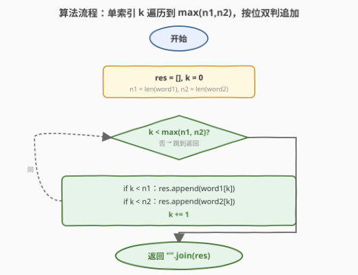
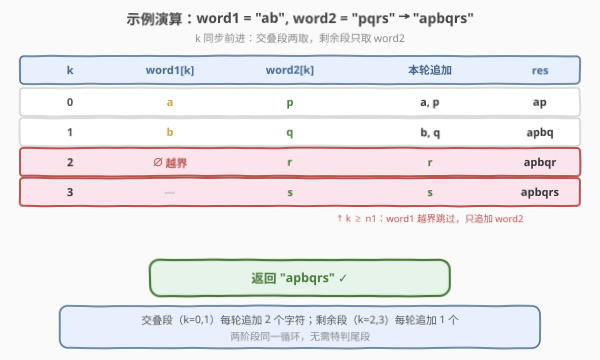

# LeetCode 交替合并字符串 题解

## 1. 题目概述

- **标题 / 题号**：交替合并字符串（#1768，easy）
- **链接**：https://leetcode.cn/problems/merge-strings-alternately/
- **难度**：简单
- **标签**：字符串、双指针

**题意**：给定两个字符串 `word1` 和 `word2`，从 `word1` 开始**交替**追加字符形成合并串：先取 `word1[0]`，再取 `word2[0]`，再取 `word1[1]`，再取 `word2[1]`……若某一字符串已取尽，则把另一字符串**剩余字符直接接到末尾**。返回合并后的字符串。

**示例 1**：

```text
输入：word1 = "abc", word2 = "pqr"
输出："apbqcr"
解释：a p b q c r，两串等长，严格交替。
```

**示例 2**：

```text
输入：word1 = "ab", word2 = "pqrs"
输出："apbqrs"
解释：交叠段 a p b q 后，word1 已尽，word2 剩 "rs" 直接追加。
```

**示例 3**：

```text
输入：word1 = "abcd", word2 = "pq"
输出："apbqcd"
解释：交叠段 a p b q 后，word2 已尽，word1 剩 "cd" 直接追加。
```

**约束**：

- $1 \le \text{word1.length}, \text{word2.length} \le 100$
- `word1` 和 `word2` 仅由小写英文字母组成

> 💡 **关键结构**：合并规则是「按位轮取」——第 $k$ 轮固定先取 `word1[k]` 再取 `word2[k]`，**无选择自由度**。这与 [1754. 构造字典序最大的合并字符串](https://leetcode.cn/problems/largest-merge-of-two-strings/) 形成鲜明对照：1754 每步可在两串间**贪心选择**（取较大前缀），而 1768 顺序完全固定，因此简单得多。

## 2. 解题思路

### 2.1 暴力思路：双指针 + 两阶段

最直觉的做法是用两个独立指针 $i, j$：第一阶段「两串都未取尽」时严格交替追加；第二阶段把未尽串的尾巴整体拼上。

```text
i, j = 0, 0
res = []
while i < n1 and j < n2:          # 交叠段
    res.append(word1[i]); i += 1
    res.append(word2[j]); j += 1
res.append(word1[i:])             # 尾段（其一为空）
res.append(word2[j:])
return "".join(res)
```

时间 $O(n_1 + n_2)$、空间 $O(1)$（不计输出）。复杂度已最优，但代码分了两阶段，且 $i, j$ 各自递增、相互独立。

> ⚠️ **症结（仅写法层面）**：$i, j$ 在交叠段始终**同步前进**——每轮各 +1，故 $i = j = k$ 恒成立。维护两个永远相等的指针是冗余；且「交叠段」与「尾段」本质都是「按位取字符」，被人为拆成两套逻辑。

### 2.2 核心观察：同步指针塌缩为单索引 k

![核心观察：单索引 k 同步推进，word1[k] → word2[k]，尾部自动落位](../images/1768_concept.svg)

关键洞察：在第 $k$ 轮，要追加的字符就是 `word1[k]`（若存在）和 `word2[k]`（若存在）。两个指针永远同步，因此**塌缩成一个索引 $k$**：遍历 $k = 0 \ldots \max(n_1, n_2) - 1$，每轮做两次条件追加：

$$
\text{if } k < n_1:\ \text{res.append}(\text{word1}[k]); \qquad \text{if } k < n_2:\ \text{res.append}(\text{word2}[k])
$$

- **交叠段**（$k < \min(n_1, n_2)$）：两个条件都成立，追加 2 个字符。
- **剩余段**（$\min(n_1, n_2) \le k < \max(n_1, n_2)$）：仅一方条件成立，追加 1 个字符。

两阶段被同一循环统一吸收，**无需特判尾段**。

> 💡 **深层原则**：当两个指针以相同速率推进时，它们必然相等，可以合并成一个。这是「同步归并」的通用判据——只要能确认「$i$ 与 $j$ 永远同速」，就可消掉一个。本题的「严格交替」正是同速的保证（每轮各取一次）。对比 [21. 合并两个有序链表](https://leetcode.cn/problems/merge-two-sorted-lists/)：那里两指针**不同速**（谁小谁先走），故无法塌缩，必须保留双指针。
>
> 💡 **与 1754 的对照**：同为「合并两字符串」骨架，1768 顺序固定（同速 → 单索引），1754 顺序可选（贪心比后缀 → 仍需双指针决策）。固定 vs 自由，决定了能否塌缩指针。

### 2.3 算法流程图



1. **初始化**：`res = []`，`k = 0`，记 $n_1, n_2$ 为两串长度。
2. **循环**：当 $k < \max(n_1, n_2)$：
   - 若 $k < n_1$，追加 `word1[k]`；
   - 若 $k < n_2$，追加 `word2[k]`；
   - `k += 1`。
3. **终止**：返回 `"".join(res)`。

每轮 $O(1)$，共 $\max(n_1, n_2)$ 轮。

### 2.4 示例演算

以示例 2 `word1 = "ab"`（$n_1 = 2$），`word2 = "pqrs"`（$n_2 = 4$）为例：



| $k$ | `word1[k]` | `word2[k]` | 本轮追加 | `res` |
|-----|------------|------------|----------|-------|
| $0$ | `a` | `p` | `a, p` | `ap` |
| $1$ | `b` | `q` | `b, q` | `apbq` |
| $2$ | ∅ 越界 | `r` | `r` | `apbqr` |
| $3$ | — | `s` | `s` | `apbqrs` |

- 交叠段 $k = 0, 1$：两条件均成立，每轮追加 2 个字符。
- 剩余段 $k = 2, 3$：$k \ge n_1$，`word1` 越界跳过，仅追加 `word2` 字符。
- 最终 `"apbqrs"` ✓

> 💡 注意 $k = 2$ 时 `word1[k]` 越界——这正是「$k < n_1$ 条件守卫」的职责：用下标判界代替独立尾段处理。剩余段与交叠段走**同一段代码**，只是其中一个 `if` 不触发。

## 3. 参考代码

### C++

```cpp
class Solution {
public:
    string mergeAlternately(string word1, string word2) {
        int n1 = word1.size(), n2 = word2.size();
        string res;
        res.reserve(n1 + n2);
        for (int k = 0; k < max(n1, n2); ++k) {
            if (k < n1) res.push_back(word1[k]);
            if (k < n2) res.push_back(word2[k]);
        }
        return res;
    }
};
```

### Python

```python
class Solution:
    def mergeAlternately(self, word1: str, word2: str) -> str:
        n1, n2 = len(word1), len(word2)
        res = []
        for k in range(max(n1, n2)):
            if k < n1:
                res.append(word1[k])
            if k < n2:
                res.append(word2[k])
        return "".join(res)
```

> 💡 **写法对照**：两版逻辑一致——单索引 `k` 遍历到 `max(n1, n2)`，两个独立 `if` 守卫各自的越界检查。C++ 用 `res.reserve(n1 + n2)` 预分配避免 `push_back` 扩容抖动；Python 用列表 `append` + 末尾 `"".join`（拼接字符串的惯用法，避免 `+=` 在循环中反复建串）。
>
> ⚠️ **别用 `zip`**：`zip(word1, word2)` 会在较短串处**截断**，丢失较长串的尾部，还需另写一段补尾代码，反而退化成 2.1 的两阶段写法。要单循环就得用 `range(max(n1, n2))` + 下标判界（等价于 `itertools.zip_longest` 的语义）。

## 4. 复杂度分析

| 维度 | 复杂度 | 说明 |
|------|--------|------|
| 时间复杂度 | $O(n_1 + n_2)$ | 循环 $\max(n_1, n_2)$ 轮，每轮至多追加 2 个字符，总追加数恰为 $n_1 + n_2$ |
| 空间复杂度 | $O(1)$ | 仅常数变量（不计输出串；若计入输出则为 $O(n_1 + n_2)$） |

> 💡 对比双指针两阶段写法：同为 $O(n_1 + n_2) / O(1)$，但单索引写法用一个循环 + 两个 `if` 统一了两阶段，代码更短、分支更少。$n \le 100$ 时实测差异可忽略，但单索引写法更体现「同步指针可塌缩」的结构洞察。

## 5. 扩展：zip_longest 的等价实现

Python 标准库 `itertools.zip_longest` 正是「按位合并、较短串填空」的语义，可直接表达本题：

```python
from itertools import zip_longest

class Solution:
    def mergeAlternately(self, word1: str, word2: str) -> str:
        return "".join(a + b for a, b in zip_longest(word1, word2, fillvalue=""))
```

`zip_longest` 用 `fillvalue=""` 填补较短串的「缺失位」，等价于 `if k < n1` / `if k < n2` 的守卫逻辑——越界位置被填成空串，拼接后自然消失。这与 2.2 的单索引循环**语义同构**：`zip_longest` 内部就是按 `max(n1, n2)` 推进单个游标、对两路分别判尽。

> ⚠️ 工程上 `zip_longest` 版因引入 `fillvalue=""` 字符串拼接，常数略大于下标版；面试中作为「知道有这招」的展示，理解其与下标判界的等价性即可。

## 6. 面试要点

**Q1：为什么用单索引 k 而不是双指针 i, j？**
> 因为合并规则严格交替——每轮 `word1` 和 `word2` 各取一次，两指针同速前进，故 $i = j = k$ 恒成立。维护两个永远相等的指针是冗余，塌缩成一个 `k` 即可。判据是「两指针是否同速」：同速可塌缩，不同速（如合并有序链表谁小谁走）则不能。

**Q2：如何用一个循环处理「交叠段 + 尾段」两阶段？**
> 用下标判界守卫：每轮 `if k < n1: 追加 word1[k]` 和 `if k < n2: 追加 word2[k]`。交叠段两条件都触发（追加 2 个），尾段只触发其一（追加 1 个）。阶段差异被 `if` 守卫吸收，循环体无需分支。

**Q3：为什么不能用 `zip(word1, word2)`？**
> `zip` 在较短串处截断，会丢掉较长串的尾部，需额外补尾代码，退化成两阶段写法。要单循环需用 `range(max(n1, n2))` + 下标判界，或 `itertools.zip_longest`（用 `fillvalue` 填空，语义等价）。

**Q4：本题与 1754「构造字典序最大的合并字符串」有何区别？**
> 同为「合并两字符串」骨架，但 1768 顺序**固定**（按位轮取，无选择），故指针同速可塌缩为单索引，是简单题；1754 每步可在两串间**贪心选择**（取较大后缀），指针不同速，需保留双指针并比较后缀，是中等题。固定 vs 自由决定了能否塌缩指针与问题难度。

**Q5：如果把规则改成「每次从两串各取 2 个字符交替」怎么改？**
> 指针不再同速（每轮各前进 2），但仍**同步**（速率相同），故仍可塌缩为单索引 $k$ 表示「第几块」，每块取 `word1[2k:2k+2]` 和 `word2[2k:2k+2]`。只要两路速率一致，单索引就成立；若速率不同（如一方取 1、一方取 2），则需回到双指针。

## 同类练习题

| # | 题目 | 与本题的关联 |
|---|------|-------------|
| 1754 | [构造字典序最大的合并字符串](https://leetcode.cn/problems/largest-merge-of-two-strings/)（[题解](../1701-1800/1754_构造字典序最大的合并字符串.md)） | 同骨架异决策——1768 顺序固定（单索引），1754 贪心选后缀（双指针），对照体会「能否塌缩指针」的分界 |
| 21 | [合并两个有序链表](https://leetcode.cn/problems/merge-two-sorted-lists/)（[题解](../0001-0100/21_合并两个有序链表.md)） | 双指针归并的母题，谁小谁先走 → 指针不同速 → 无法塌缩，与本题「同速可塌缩」形成反例对照 |
| 88 | [合并两个有序数组](https://leetcode.cn/problems/merge-sorted-array/) | 双指针从后往前归并，同样不同速（谁大谁先放），保留双指针的典型场景 |
| 1071 | [字符串的最大公因子](https://leetcode.cn/problems/greatest-common-divisor-of-strings/) | 字符串拼接与子串关系的判定，同属「字符串拼接类」基础题，对照「拼接合并」与「因子整除」两种串关系 |
