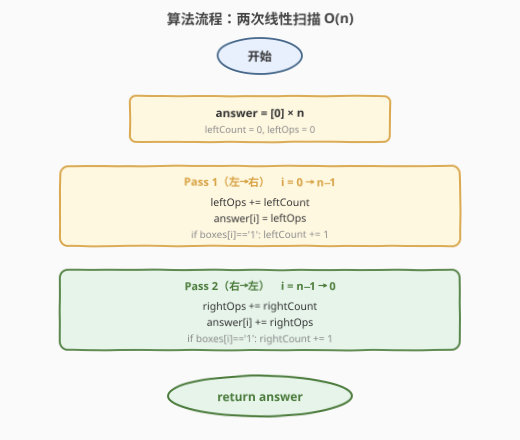
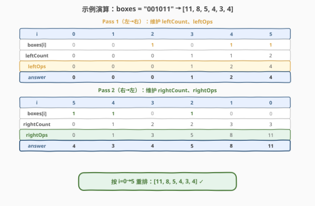

# 移动所有球到每个盒子所需的最小操作数

- **题目名称**：移动所有球到每个盒子所需的最小操作数
- **链接**：[1769. 移动所有球到每个盒子所需的最小操作数](https://leetcode.cn/problems/minimum-number-of-operations-to-move-all-balls-to-each-box/)
- **难度**：中等
- **标签**：数组、字符串、前缀和

## 1. 题目概述

给定一个长度为 $n$ 的二进制字符串 `boxes`，其中 `boxes[i]` 为 `'0'` 表示第 $i$ 个盒子为空，`'1'` 表示含有一个球。在**一次操作**中，你可以将一个球从某个盒子移动到**相邻**盒子。请返回一个长度为 $n$ 的数组 `answer`，其中 `answer[i]` 表示将**所有球**移动到第 $i$ 个盒子所需的最少操作数。

**示例 1**：

```text
输入：boxes = "110"
输出：[1,1,3]
解释：boxes[0]=1, boxes[1]=1, boxes[2]=0
answer[0] = |0-0| + |1-0| = 1（把盒子1的球移到盒子0）
answer[1] = |0-1| + |1-1| = 1（把盒子0的球移到盒子1）
answer[2] = |0-2| + |1-2| = 3（两球都移到盒子2）
```

**示例 2**：

```text
输入：boxes = "001011"
输出：[11,8,5,4,3,4]
解释：球在位置 2, 4, 5
answer[0] = 2+4+5 = 11
answer[1] = 1+3+4 = 8
answer[2] = 0+2+3 = 5
answer[3] = 1+1+2 = 4
answer[4] = 2+0+1 = 3
answer[5] = 3+1+0 = 4
```

**约束条件**：

- $1 \le n \le 2000$
- `boxes[i]` 为 `'0'` 或 `'1'`

> 💡 **关键结构**：`answer[i]` 本质是 $\sum_{j:\,\text{boxes}[j]=1} |i - j|$，即所有球到位置 $i$ 的距离之和。这正是 [1685. 有序数组中差绝对值之和](../1601-1700/1685_有序数组中差绝对值之和.md) 的 01 字符串版本——位置天然有序，可去掉绝对值分左右累加。

---

## 2. 解题思路

### 2.1 暴力思路

对每个目标位置 $i$，遍历所有盒子 $j$，若 `boxes[j] == '1'` 则累加 $|i - j|$。时间 $O(n^2)$，$n \le 2000$ 时约 $4 \times 10^6$ 次运算，**能过**但非最优。

> ⚠️ **症结**：每个 $i$ 独立从零计算，未利用相邻位置之间的递推关系。实际上 `answer[i]` 与 `answer[i-1]` 只差一个可 $O(1)$ 维护的增量。

### 2.2 核心观察：两次扫描分解 leftOps + rightOps

![核心观察：answer[i] = leftOps[i] + rightOps[i]，目标右移时左球各 +1 步](../images/minops_concept.svg)

将每个球到目标 $i$ 的距离按**方向**拆开：

- **左侧球**（位置 $< i$）：距离 $= i - j$，随 $i$ 右移而**增大**
- **右侧球**（位置 $> i$）：距离 $= j - i$，随 $i$ 右移而**减小**

因此 `answer[i]` 可分解为两部分独立累加：

$$\text{answer}[i] = \underbrace{\text{leftOps}[i]}_{\text{左侧球距离和}} + \underbrace{\text{rightOps}[i]}_{\text{右侧球距离和}}$$

**递推关键**：当目标从 $i-1$ 移到 $i$ 时，左侧每个球各多走 1 步，故：

$$\text{leftOps}[i] = \text{leftOps}[i-1] + \text{leftCount}[i]$$

其中 $\text{leftCount}[i]$ = 位置 $< i$ 的球数。同理从右往左：

$$\text{rightOps}[i] = \text{rightOps}[i+1] + \text{rightCount}[i]$$

> 💡 **直觉理解**：想象目标盒子是一个磁铁，每右移一格，左边的球都被拉远 1 步（代价 +leftCount），右边的球都被拉近 1 步（代价 −rightCount）。两次扫描分别在两个方向上累计这种「步数变化」。
>
> 💡 **与 1685 的对照**：1685 利用有序性去掉绝对值后，用前缀和公式 $O(1)$ 算每位；本题位置天然有序（下标递增），用两次扫描累加更直观，但核心思想一致——**分左右去绝对值**。

### 2.3 算法流程图



**Pass 1（左→右）**：维护 `leftCount`（已扫过的球数）和 `leftOps`（左侧球距离和）：

1. `leftOps += leftCount`（左侧每个球各多走 1 步）
2. `answer[i] = leftOps`
3. 若 `boxes[i] == '1'`，`leftCount += 1`

**Pass 2（右→左）**：维护 `rightCount` 和 `rightOps`，同理：

1. `rightOps += rightCount`
2. `answer[i] += rightOps`
3. 若 `boxes[i] == '1'`，`rightCount += 1`

> ⚠️ **顺序细节**：先 `+= count` 再判断当前位是否有球。这保证当前位置的球**不计入**自身距离（距离为 0），而是加入后续位置的 count。若颠倒顺序，当前位置的球会被多算 1 步。

### 2.4 示例演算

以 `boxes = "001011"`（球在位置 2, 4, 5）为例：



**Pass 1（左→右）**：

| $i$ | boxes[i] | leftCount | leftOps | answer[i] |
|-----|----------|-----------|---------|-----------|
| 0   | 0        | 0         | 0       | 0         |
| 1   | 0        | 0         | 0       | 0         |
| 2   | 1        | 0         | 0       | 0         |
| 3   | 0        | 1         | 1       | 1         |
| 4   | 1        | 1         | 2       | 2         |
| 5   | 1        | 2         | 4       | 4         |

> 💡 $i=2$ 时 leftCount=0（左侧无球），leftOps=0；扫过 $i=2$ 后 leftCount 变 1，该球在后续位置 $i=3,4,5$ 各贡献 1 步。

**Pass 2（右→左）**：

| $i$ | boxes[i] | rightCount | rightOps | answer[i]（最终） |
|-----|----------|------------|----------|-------------------|
| 5   | 1        | 0          | 0        | 4 + 0 = **4**     |
| 4   | 1        | 1          | 1        | 2 + 1 = **3**     |
| 3   | 0        | 2          | 3        | 1 + 3 = **4**     |
| 2   | 1        | 2          | 5        | 0 + 5 = **5**     |
| 1   | 0        | 3          | 8        | 0 + 8 = **8**     |
| 0   | 0        | 3          | 11       | 0 + 11 = **11**   |

按 $i = 0 \to 5$ 重排：`[11, 8, 5, 4, 3, 4]` ✓

---

## 3. 参考代码

### C++

```cpp
class Solution {
public:
    vector<int> minOperations(string boxes) {
        int n = boxes.size();
        vector<int> answer(n, 0);

        // Pass 1: left to right
        int leftCount = 0, leftOps = 0;
        for (int i = 0; i < n; i++) {
            leftOps += leftCount;
            answer[i] = leftOps;
            if (boxes[i] == '1') leftCount++;
        }

        // Pass 2: right to left
        int rightCount = 0, rightOps = 0;
        for (int i = n - 1; i >= 0; i--) {
            rightOps += rightCount;
            answer[i] += rightOps;
            if (boxes[i] == '1') rightCount++;
        }

        return answer;
    }
};
```

### Python

```python
class Solution:
    def minOperations(self, boxes: str) -> List[int]:
        n = len(boxes)
        answer = [0] * n

        # Pass 1: left to right
        left_count = left_ops = 0
        for i in range(n):
            left_ops += left_count
            answer[i] = left_ops
            if boxes[i] == '1':
                left_count += 1

        # Pass 2: right to left
        right_count = right_ops = 0
        for i in range(n - 1, -1, -1):
            right_ops += right_count
            answer[i] += right_ops
            if boxes[i] == '1':
                right_count += 1

        return answer
```

> 💡 **实现细节**：① `leftOps += leftCount` 在判断 `boxes[i]` **之前**执行——当前位置的球对自身的距离贡献为 0，只在后续位置才计入 count。② 两次扫描共用同一个 `answer` 数组：Pass 1 写入左贡献，Pass 2 累加右贡献，无需额外数组。③ 仅用 `leftCount`/`leftOps`/`rightCount`/`rightOps` 四个变量，空间 $O(1)$（不计输出）。

---

## 4. 复杂度分析

| 维度 | 复杂度 | 说明 |
|------|--------|------|
| 时间复杂度 | $O(n)$ | 两次线性扫描，各遍历 $n$ 个元素，每次 $O(1)$ |
| 空间复杂度 | $O(1)$ | 仅 4 个计数变量（输出数组不计额外空间） |

> 💡 暴力 $O(n^2)$ 在 $n = 2000$ 时约 $4 \times 10^6$ 次运算，能过但不够优雅。两次扫描法将每位 $O(n)$ 的计算降为 $O(1)$ 递推，是 follow-up 要求的 $O(n)$ 时间 $O(1)$ 空间解法。

---

## 5. 扩展：单次递推法

两次扫描分治左右贡献，也可以用**相邻递推**在一次扫描内完成（需先算 `answer[0]`）。

**递推推导**：当目标从 $i$ 移到 $i+1$ 时：

- 左侧球（位置 $\le i$）各多走 1 步：$+\text{count}(\le i)$
- 右侧球（位置 $> i$）各少走 1 步：$-(\text{total} - \text{count}(\le i))$

合并：

$$\text{answer}[i+1] = \text{answer}[i] + 2 \cdot \text{count}(\le i) - \text{total}$$

其中 $\text{total}$ = 球总数。先算 `answer[0]`（所有球到位置 0 的距离 $= \sum \text{球位置}$），再逐位递推：

```python
class Solution:
    def minOperations(self, boxes: str) -> List[int]:
        n = len(boxes)
        total = boxes.count('1')

        answer = [0] * n
        answer[0] = sum(i for i in range(n) if boxes[i] == '1')

        count = 1 if boxes[0] == '1' else 0
        for i in range(1, n):
            answer[i] = answer[i - 1] + 2 * count - total
            if boxes[i] == '1':
                count += 1

        return answer
```

时间 $O(n)$，空间 $O(1)$。与两次扫描法等价，但思路不同——两次扫描是「分方向独立累加」，递推法是「利用相邻差值传递」。

> 💡 **两种视角的等价性**：递推公式中的 $2 \cdot \text{count}(\le i) - \text{total}$ 恰好等于 $\text{leftCount} - \text{rightCount}$（左球各 +1、右球各 −1 的净效果），与两次扫描的增量完全一致。

---

## 6. 面试要点

**Q1：为什么能把总操作数拆成 leftOps + rightOps？**

> 球的移动距离可加。每个球到目标 $i$ 的距离 $= |j - i|$，按方向拆开后左侧 $= i - j$、右侧 $= j - i$，两部分独立累加，绝对值符号被方向消去。

**Q2：递推 leftOps[i] = leftOps[i−1] + leftCount 怎么理解？**

> 目标从 $i-1$ 移到 $i$ 时，所有位置 $< i$ 的球（共 leftCount 个）距离各增加 1，故 leftOps 增加 leftCount。rightCount 同理从右往左递推。

**Q3：为什么 `leftOps += leftCount` 要在判断 `boxes[i]` 之前？**

> 当前位置的球对自身距离为 0，不应计入 leftOps。先累加再判断，保证当前位置的球只加入后续位置的 count，不被多算 1 步。颠倒顺序会导致每个球在自身位置多算 1 步。

**Q4：暴力 O(n²) 能过吗？为什么还要用 O(n)？**

> $n \le 2000$，$O(n^2) = 4 \times 10^6$ 在 LeetCode 上能过。但题目 follow-up 明确要求 $O(n)$ 时间 $O(1)$ 空间（不计输出），两次扫描法满足该要求。

**Q5：本题与 1685（有序数组中差绝对值之和）的异同？**

> 同：都是求「每个位置到其他位置的距离之和」，核心都是分左右去绝对值后累加。异：1685 数组元素有具体数值，用前缀和公式 $O(1)$ 算每位；本题是 01 字符串（球位置即下标），用两次扫描递推更直观，但数学本质一致——有序性保证可去绝对值。

---

## 7. 同类练习题

- [1685. 有序数组中差绝对值之和](https://leetcode.cn/problems/sum-of-absolute-differences-in-a-sorted-array/)（[题解](../1601-1700/1685_有序数组中差绝对值之和.md)）：同「每个位置到其他位置距离之和」的母题，有序性去绝对值 + 前缀和公式，对照本题的两次扫描递推
- [238. 除自身以外数组的乘积](https://leetcode.cn/problems/product-of-array-except-self/)（[题解](../0201-0300/238_除自身以外数组的乘积.md)）：同「两次扫描分方向累加」的结构，前缀积 × 后缀积，对比前缀和的加法版本
- [462. 最小操作次数使数组元素相等 II](https://leetcode.cn/problems/minimum-moves-to-equal-array-elements-ii/)（[题解](../0401-0500/462_最小操作次数使数组元素相等II.md)）：所有元素移到中位数的距离之和，同样是「位置到其他位置距离之和」的变体
- [2602. 使数组元素全部相等的最少操作次数](https://leetcode.cn/problems/minimum-operations-to-make-all-array-elements-equal/)：排序 + 前缀和求每个目标值的距离之和，本题的「值域」版本
