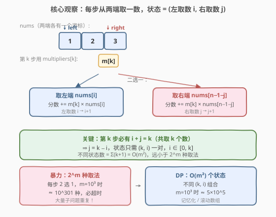
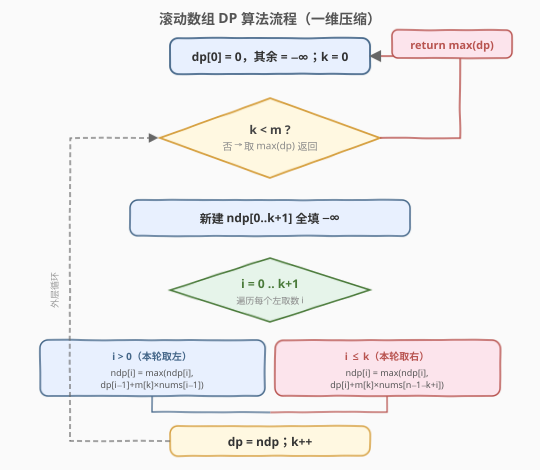

# LeetCode 执行乘法运算的最大分数 题解

## 1. 题目概述

- **标题 / 题号**：执行乘法运算的最大分数（#1770，hard）
- **链接**：https://leetcode.cn/problems/maximum-score-from-performing-multiplication-operations/
- **难度**：困难
- **标签**：数组、动态规划

**题意**：给定长度为 $n$ 的数组 `nums` 和长度为 $m$ 的数组 `multipliers`（$n \ge m$）。初始分数为 $0$，需执行**恰好** $m$ 步操作。第 $i$ 步（$i$ 从 $1$ 开始计数）操作为：

- 选择 `nums` **开头或末尾**处的整数 $x$；
- 获得 `multipliers[i] * x` 分并累加；
- 将 $x$ 从 `nums` 中移除。

返回执行 $m$ 步后的**最大**分数。

**示例 1**：

```text
输入：nums = [1,2,3], multipliers = [3,2,1]
输出：14
解释：三步都取末尾 → 3×3 + 2×2 + 1×1 = 9 + 4 + 1 = 14。
```

**示例 2**：

```text
输入：nums = [-5,-3,-3,-2,7,1], multipliers = [-10,-5,3,4,6]
输出：102
解释：取左、取左、取左、取右、取右
      -5×-10 + -3×-5 + -3×3 + 1×4 + 7×6 = 50 + 15 - 9 + 4 + 42 = 102。
```

**约束**：

- $m = \text{multipliers.length}$，$n = \text{nums.length}$
- $1 \le m \le 10^3$，$m \le n \le 10^5$
- $-1000 \le \text{nums}[i], \text{multipliers}[i] \le 1000$

> 💡 **关键约束**：$m$ 很小（$\le 10^3$）而 $n$ 可以很大（$\le 10^5$）。这意味着「操作步数」是状态空间的瓶颈，而 `nums` 中未被触及的中间部分**不影响状态**——只需记录两端各取了多少个。

## 2. 解题思路

### 2.1 暴力思路：枚举所有取法

每步操作有「取左」或「取右」两种选择，$m$ 步共 $2^m$ 种取法。逐一枚举每种取法、计算得分取最大值：

$$\text{ans} = \max_{\text{每种取法}} \sum_{k=0}^{m-1} \text{multipliers}[k] \times x_k$$

时间复杂度 $O(2^m \cdot m)$。$m = 10^3$ 时 $2^m \approx 10^{301}$，远超时限。

> ⚠️ **症结**：暴力把「取法序列」当作状态，但**不同的取法序列可能对应同一个剩余数组片段**。例如「左右」和「右左」前两步后，`nums` 都剩中间同一段——只是分别用掉了 `multipliers[0]`、`multipliers[1]`，顺序不同得分不同，但「剩下要处理的问题」结构相同。这正是**重叠子问题**的特征，可用 DP 记忆化。

### 2.2 核心观察：状态 = (左取数 i, 右取数 j)



**第一步：识别状态的「充分描述」**。设执行了若干步后，从左端取了 $i$ 个、从右端取了 $j$ 个。由于**总是从两端取**，剩余的 `nums` 片段必然是连续的中间段 `nums[i .. n-1-j]`——$i$ 和 $j$ 唯一确定了剩余片段，与具体取法顺序无关。因此状态可定义为 $(i, j)$。

**第二步：压缩状态维度**。第 $k$ 步（$k$ 从 $0$ 开始）操作开始时，已取 $k$ 个数，故 $i + j = k$。于是 $j = k - i$，状态只需 $(k, i)$ 一对：$i$ 表示当前已从左端取了多少个。$i \in [0, k]$，每个 $k$ 只有 $k+1$ 个状态，全程共 $\sum_{k=0}^{m}(k+1) = O(m^2)$ 个状态。

$$\boxed{\text{状态 } (k, i)：\text{已执行 } k \text{ 步、左端取了 } i \text{ 个时，能获得的最大累计分数}}$$

**状态转移**（第 $k$ 步用 `multipliers[k]`）：

- **取左端**：下一个左端元素是 `nums[i]`（0 下标），转移后左取数变 $i+1$：

$$\text{dp}[k+1][i+1] = \max\bigl(\text{dp}[k+1][i+1],\ \text{dp}[k][i] + \text{mult}[k] \times \text{nums}[i]\bigr)$$

- **取右端**：已从右端取了 $k - i$ 个，下一个右端元素是 `nums[n-1-(k-i)]`，左取数仍为 $i$：

$$\text{dp}[k+1][i] = \max\bigl(\text{dp}[k+1][i],\ \text{dp}[k][i] + \text{mult}[k] \times \text{nums}[n-1-k+i]\bigr)$$

**边界**：$\text{dp}[0][0] = 0$（0 步、0 分）。其余初始化为 $-\infty$ 表示不可达。

**答案**：执行完 $m$ 步后，$\max_{0 \le i \le m} \text{dp}[m][i]$。

> 💡 **为什么 `nums` 中间段不影响状态？** 因为操作总是从两端摘除，已取 $i$ 个左端 + $j$ 个右端后，剩下的恰好是 `nums[i .. n-1-j]`——这个区间由 $i, j$ 完全决定，与摘除顺序无关。若题目允许从**任意位置**取数，状态就必须记录整个剩余数组，DP 不可行——「只能从两端取」是本题能用 DP 的**关键前提**。

> ⚠️ **别用 $n$ 维状态**：有人会想「记录 `nums` 还剩哪些元素」，但 $n$ 可达 $10^5$，子集状态 $2^n$ 不可行。注意到 $m \ll n$，只需记录两端各取几个，状态数 $O(m^2)$ 才是正解。

### 2.3 算法流程图



由于 $\text{dp}[k]$ 只依赖 $\text{dp}[k-1]$，可用**滚动数组**把二维压成一维：`dp[i]` 表示「当前已处理若干步、左取数为 $i$」的最大分数。每轮用 `ndp` 记录新结果，结束后 `dp = ndp`。

**关键实现细节**：

- 每轮 $k$ 处理后，`dp` 的有效下标范围为 $[0, k+1]$（共 $k+2$ 个状态）。
- 内层遍历 $i \in [0, k+1]$，分别考察「从左转移」（要求 $i \ge 1$，读 `dp[i-1]`）和「从右转移」（要求 $i \le k$，读 `dp[i]`）。
- 右端元素下标公式：$\text{n-1-(k-i) = n-1-k+i}$。

### 2.4 示例演算

![示例演算：nums = [1,2,3], multipliers = [3,2,1]](../images/1770_example_walkthrough.svg)

以示例 1 `nums = [1,2,3]`、`multipliers = [3,2,1]`（$n=3, m=3$）为例，逐步展示一维 `dp` 数组的演化：

- **初始**（$k=0$，0 步）：`dp = [0]`（仅 $i=0$ 可达，分数 $0$）。
- **$k=0$，`mult[0]=3`**：
  - $i=0$ 取右端 `nums[2]=3`：$0 + 3 \times 3 = 9$ → `ndp[0]=9`
  - $i=1$ 取左端 `nums[0]=1`：$0 + 3 \times 1 = 3$ → `ndp[1]=3`
  - `dp = [9, 3]`
- **$k=1$，`mult[1]=2`**：
  - $i=0$ 取右端 `nums[1]=2`：$9 + 2 \times 2 = 13$ → `ndp[0]=13`
  - $i=1$：取左 `nums[0]=1` 得 $9+2=11$；取右 `nums[2]=3` 得 $3+6=9$ → 取最大 `ndp[1]=11`
  - $i=2$ 取左端 `nums[1]=2`：$3 + 2 \times 2 = 7$ → `ndp[2]=7`
  - `dp = [13, 11, 7]`
- **$k=2$，`mult[2]=1`**：
  - $i=0$ 取右端 `nums[0]=1`：$13 + 1 = 14$ → `ndp[0]=14` ★
  - $i=1$：取左 $13+1=14$；取右 $11+2=13$ → `ndp[1]=14`
  - $i=2$：取左 $11+2=13$；取右 $7+3=10$ → `ndp[2]=13`
  - $i=3$ 取左端 `nums[2]=3`：$7 + 3 = 10$ → `ndp[3]=10`
  - `dp = [14, 14, 13, 10]`
- **答案**：$\max(14, 14, 13, 10) = 14$ ✓

**最优路径回溯**：最终最大值在 $i=0$（`ndp[0]=14`），意味着第 3 步取了右端。回溯到 $k=1$ 的 `dp[0]=9`（也是取右端），再回溯到 $k=0$ 的 `dp[0]=0`（取右端）。即三步全取右端：$3 \times 3 + 2 \times 2 + 1 \times 1 = 14$。

> 💡 **负数场景更体现 DP 价值**：示例 2 中 `multipliers` 与 `nums` 都含负数，负负得正使「取左端」在前几步更优、后几步转取右端。贪心（每步取当前更大乘积）会失效——例如某步取一个正数小增益，可能换来后续大负数乘以正数的大损失。DP 同时考虑所有步数的全局最优，才能正确处理这种「眼前亏换长远赢」的权衡。

## 3. 参考代码

### C++

```cpp
class Solution {
public:
    int maximumScore(vector<int>& nums, vector<int>& multipliers) {
        int n = nums.size(), m = multipliers.size();
        // dp[i]：当前已处理若干步、左取数为 i 时的最大分数
        vector<int> dp(m + 1, INT_MIN);
        dp[0] = 0;

        for (int k = 0; k < m; k++) {
            vector<int> ndp(m + 1, INT_MIN);
            for (int i = 0; i <= k + 1; i++) {
                // 本轮取左端：由上一轮 i-1 转移而来
                if (i > 0) {
                    ndp[i] = max(ndp[i], dp[i - 1] + multipliers[k] * nums[i - 1]);
                }
                // 本轮取右端：由上一轮 i 转移而来，右端下标 = n-1-(k-i)
                if (i <= k) {
                    int rIdx = n - 1 - (k - i);
                    ndp[i] = max(ndp[i], dp[i] + multipliers[k] * nums[rIdx]);
                }
            }
            dp = move(ndp);
        }
        return *max_element(dp.begin(), dp.end());
    }
};
```

### Python

```python
class Solution:
    def maximumScore(self, nums: List[int], multipliers: List[int]) -> int:
        n, m = len(nums), len(multipliers)
        dp = [-10**9] * (m + 1)
        dp[0] = 0

        for k in range(m):
            ndp = [-10**9] * (m + 1)
            for i in range(k + 2):          # i ∈ [0, k+1]
                if i > 0:                   # 本轮取左端
                    ndp[i] = max(ndp[i], dp[i - 1] + multipliers[k] * nums[i - 1])
                if i <= k:                  # 本轮取右端
                    r_idx = n - 1 - (k - i)
                    ndp[i] = max(ndp[i], dp[i] + multipliers[k] * nums[r_idx])
            dp = ndp
        return max(dp)
```

> ⚠️ **两个易错点**：
> 1. **右端下标别算错**：第 $k$ 步开始时已取 $k$ 个，其中左取 $i$ 个 ⇒ 右取 $k-i$ 个 ⇒ 下一个右端元素在 `nums[n-1-(k-i)]`。常见错误是写成 `nums[n-1-i]`（漏了 $k$）或 `nums[n-1-k]`（漏了 $i$）。化简 $n-1-(k-i) = n-1-k+i$ 便于记忆：**左取越多，右端下标越靠右**。
> 2. **滚动方向**：内层若就地更新 `dp[i]` 会污染后续读取。必须用独立 `ndp` 数组，本轮全部算完再 `dp = ndp`。若想就地更新，需让 $i$ **从大到小**遍历（类似 0-1 背包），但这里「取左」读 `dp[i-1]`、「取右」读 `dp[i]` 方向不一致，就地更新易错，用 `ndp` 更清晰。

> 💡 **哨兵值选择**：C++ 用 `INT_MIN` 标记不可达状态。由于转移只在 $i \in [0, k+1]$ 范围内、且每个 $i$ 至少满足 $i>0$ 或 $i \le k$ 之一（边界 $i=0$ 必有 $i \le k$ 当 $k \ge 0$；$i=k+1$ 必有 $i>0$），故 `ndp[i]` 必被有效赋值，不会把 `INT_MIN` 留到下一轮参与运算导致溢出。Python 用 $-10^9$ 即可（最坏分数 $-10^3 \times 10^3 \times 10^3 = -10^9$）。

## 4. 复杂度分析

| 维度 | 复杂度 | 说明 |
|------|--------|------|
| 时间 | $O(m^2)$ | 外层 $m$ 轮，第 $k$ 轮内层 $k+2$ 次遍历，每次 $O(1)$ 转移；总计 $\sum_{k=0}^{m-1}(k+2) = O(m^2)$ |
| 空间 | $O(m)$ | 一维滚动数组 `dp`/`ndp`，长度 $m+1$ |

> 💡 **与暴力对比**：暴力 $O(2^m \cdot m)$，$m=10^3$ 时不可行；DP $O(m^2) \approx 10^6$，轻松通过。核心增益来自识别「状态只需 $(k, i)$」这一重叠子问题结构——把指数级取法序列压缩到平方级状态。注意 $n$ 虽可达 $10^5$，但**不出现在复杂度里**，因为 `nums` 仅按下标 $O(1)$ 读取，无需遍历。

## 5. 扩展：自顶向下记忆化与原地更新

### 5.1 自顶向下记忆化 DFS

自顶向下的递归 + 记忆化更贴近状态定义本身，便于面试时先讲清思路再优化：

```cpp
class Solution {
public:
    int maximumScore(vector<int>& nums, vector<int>& multipliers) {
        int m = multipliers.size();
        vector<vector<int>> memo(m, vector<int>(m, INT_MIN));
        return dfs(nums, multipliers, memo, 0, 0);
    }
private:
    // k：当前第几步；i：已从左端取多少个
    int dfs(const vector<int>& nums, const vector<int>& mult,
            vector<vector<int>>& memo, int k, int i) {
        if (k == (int)mult.size()) return 0;
        if (memo[k][i] != INT_MIN) return memo[k][i];
        int n = nums.size();
        int takeLeft  = mult[k] * nums[i]
                      + dfs(nums, mult, memo, k + 1, i + 1);
        int rIdx = n - 1 - (k - i);
        int takeRight = mult[k] * nums[rIdx]
                      + dfs(nums, mult, memo, k + 1, i);
        return memo[k][i] = max(takeLeft, takeRight);
    }
};
```

状态 $(k, i)$ 中 $k \in [0, m-1]$、$i \in [0, k]$，与自底向上一致。`memo` 用 `INT_MIN` 标记未计算，但需保证真实分数不会恰好等于 `INT_MIN`——最坏分数约 $-10^9$，远大于 `INT_MIN`（约 $-2.1 \times 10^9$），安全。

> 💡 **两种写法的选择**：自顶向下逻辑直观（直接翻译状态转移方程），但递归栈深度 $m=10^3$、函数调用开销略高；自底向上（滚动数组）无递归开销、空间更省。面试可先写自顶向下讲清思路，再口述「压成一维滚动数组」的优化。

### 5.2 为什么不能贪心？

直觉上「每步选 `mult[k] × nums[端]` 更大的那端」似乎合理，但会错。反例：`nums = [1, 2, 3]`、`mult = [3, 2, 1]`。

- 贪心第 1 步：取右端 $3 \times 3 = 9$（vs 取左 $3 \times 1 = 3$）。
- 第 2 步：取右端 $2 \times 2 = 4$。
- 第 3 步：取右端 $1 \times 1 = 1$。
- 总分 $14$——恰好最优。

但换 `nums = [-1, -2, -3]`、`mult = [1, 2, 3]`：

- 贪心第 1 步：取右端 $1 \times -3 = -3$（vs 取左 $1 \times -1 = -1$，选更大 $-3$？不，$-3 < -1$，应取左 $-1$）。
- 取左后第 2 步：取右端 $2 \times -3 = -6$（vs 取左 $2 \times -2 = -4$，取左 $-4$）。
- 取左后第 3 步：取右端 $3 \times -3 = -9$（vs 取左 $3 \times -3 = -9$，相同）。
- 总分 $-1 -4 -9 = -14$。

而最优是先取右端把大负数配小乘子：$1 \times -3 + 2 \times -2 + 3 \times -1 = -3 -4 -3 = -10 > -14$。贪心只看当前一步的局部最优，无法预知后续乘子变化——**当前让出一个端点元素，可能在后续步骤以更大乘子被消耗**。DP 通过同时枚举两端选择、跨步累计最优，才得到全局最优。

## 6. 面试要点

**Q1：为什么状态只需 $(k, i)$ 两个量？**

> 因为操作只从 `nums` 两端摘除。执行 $k$ 步、左取 $i$ 个后，右必取 $k-i$ 个，剩余片段确定为 `nums[i .. n-1-(k-i)]`——由 $k$ 和 $i$ 唯一决定，与摘除顺序无关。若允许从任意位置取，状态需记录整个剩余子数组，DP 不可行。「只能两端取」是本题可 DP 的关键前提。

**Q2：右端元素下标 $n-1-k+i$ 怎么推？**

> 第 $k$ 步开始时已取 $k$ 个：左 $i$、右 $k-i$。右端已取 $k-i$ 个意味着 `nums[n-1], nums[n-2], ..., nums[n-(k-i)]` 都没了，下一个右端是 `nums[n-1-(k-i)]`，展开即 $n-1-k+i$。验证：$i=0$（全取右）时下标 $n-1-k$，随 $k$ 增大从右往左收；$i=k$（全取左）时下标 $n-1$，始终是最右端未被触碰的元素。

**Q3：为什么用滚动数组而非完整二维 `dp[m+1][m+1]`？**

> $\text{dp}[k]$ 只依赖 $\text{dp}[k-1]$，前一轮之前的数据不再需要。二维表需 $O(m^2)$ 空间（$m=10^3$ 时约 $4\text{MB}$，尚可接受但浪费）；滚动数组压到 $O(m)$，且缓存友好。注意每轮需新建 `ndp` 而非就地更新，因为「取左」读 `dp[i-1]`、「取右」读 `dp[i]`，就地写会污染同轮后续读取。

**Q4：能否就地更新省掉 `ndp`？**

> 可以，但 $i$ 须**从大到小**遍历。因为「取左」转移 $\text{dp}_\text{new}[i]$ 依赖 $\text{dp}_\text{old}[i-1]$，若 $i$ 从小到大写，`dp[i-1]` 已被本轮覆盖。从大到小则保证读 `dp[i-1]` 时它仍是上一轮的旧值。不过本题还有「取右」读 `dp[i]`（旧值），就地更新时两项混合，逻辑易错。用 `ndp` 更清晰、面试更不容易写挂，性能差异可忽略。

**Q5：贪心为什么不行？**

> 每步的局部最优选择会改变后续可用的端点元素，而后续乘子 `mult[k]` 在变化。当前让出一个「差」元素，可能换得它在后续以更小乘子被消耗；反之当前抢一个「好」元素，可能让它在后续以更大乘子被错失。乘积 $\text{mult}[k] \times x$ 中两因子都随选择变化，局部贪心无法权衡跨步影响，必须用 DP 枚举所有 $(k, i)$ 组合求全局最优。

> 💡 **一句话总结**：两端取数 + $m \ll n$ ⇒ 状态只需 $(k, i)$ 共 $O(m^2)$ 个 ⇒ 滚动数组 DP 一维压缩，每轮两个转移（取左/取右）取最大，$O(m^2)$ 时间、$O(m)$ 空间。本质是利用「操作只触及两端」把指数级取法序列压成平方级重叠子问题。

## 同类练习题

| # | 题目 | 与本题的关联 |
|---|------|-------------|
| 486 | [预测赢家](https://leetcode.cn/problems/predict-the-winner/)（[题解](../0401-0500/486_预测赢家.md)） | 同为「两端取数」型，但关注先后手博弈胜负；区间 DP 视角 `dp[i][j]` 表示剩余区间 `nums[i..j]` 时当前玩家的净胜分，与本题「左取数+右取数」状态定义互为对照 |
| 877 | [石子游戏](https://leetcode.cn/problems/stone-game/)（[题解](../0801-0900/877_石子游戏.md)） | 486 的「偶数堆先手必胜」特例，区间 DP / 数学判断，承接两端取数家族 |
| 1563 | [石子游戏 V](https://leetcode.cn/problems/stone-game-v/)（[题解](../1501-1600/1563_石子游戏 V.md)） | 区间 DP 变体，状态 `dp[i][j]` 切分左右两段取较小者累加，与本题「两端取数」对照理解区间型 DP 的状态边界设计 |
| 174 | [地下城游戏](https://leetcode.cn/problems/dungeon-game/)（[题解](../0101-0200/174_地下城游戏.md)） | 反向网格 DP，强调「状态定义决定子结构合法性」——本题正向累计分数、174 反向要求最小初始血量，对比理解状态定义方向的选择 |
| 1143 | [最长公共子序列](https://leetcode.cn/problems/longest-common-subsequence/)（[题解](../1101-1200/1143_最长公共子序列.md)） | 二维 DP + 滚动数组压缩的经典母题，与本题「2D → 1D 滚动」同属空间压缩套路，对比学习滚动方向与依赖关系 |
