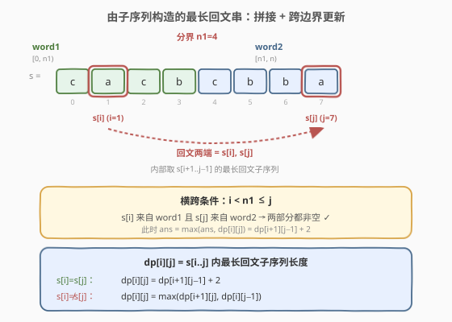
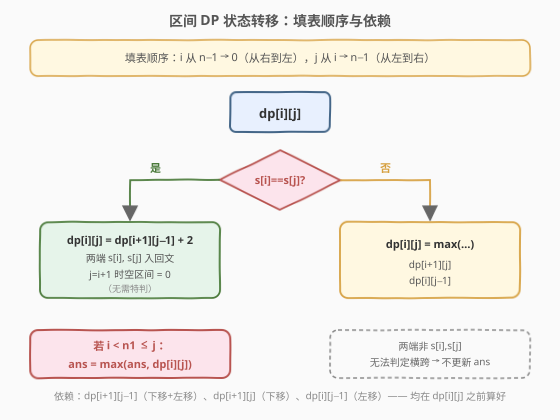
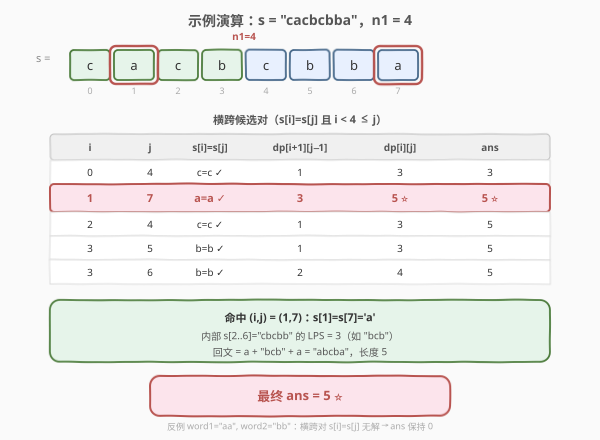

# 由子序列构造的最长回文串的长度

- **题目名称**：由子序列构造的最长回文串的长度
- **链接**：[1771. 由子序列构造的最长回文串的长度](https://leetcode.cn/problems/maximize-palindrome-length-from-subsequences/)
- **难度**：困难
- **标签**：字符串、动态规划、区间 DP

## 1. 题目概述

给你两个字符串 `word1` 和 `word2`，按下述方法构造一个字符串：

1. 从 `word1` 中选出某个**非空**子序列 `subsequence1`。
2. 从 `word2` 中选出某个**非空**子序列 `subsequence2`。
3. 连接两个子序列 `subsequence1 + subsequence2`，得到字符串。

返回可按上述方法构造的**最长回文串**的**长度**。如果无法构造回文串，返回 `0`。

**示例 1**：

```text
输入：word1 = "cacb", word2 = "cbba"
输出：5
解释：从 word1 中选出 "ab"，从 word2 中选出 "cba"，得到回文串 "abcba"。
```

**示例 2**：

```text
输入：word1 = "ab", word2 = "ab"
输出：3
解释：从 word1 中选出 "ab"，从 word2 中选出 "a"，得到回文串 "aba"。
```

**示例 3**：

```text
输入：word1 = "aa", word2 = "bb"
输出：0
解释：无法按题面所述方法构造回文串，所以返回 0。
```

**约束条件**：

- `1 <= word1.length, word2.length <= 1000`
- `word1` 和 `word2` 由小写英文字母组成

> ⚠️ 注意两个"非空"约束：`subsequence1` 和 `subsequence2` 都必须非空。因此最终回文串**必须横跨** `word1` 和 `word2`——既不能只取 `word1` 的字符，也不能只取 `word2` 的字符。这是本题与 [516. 最长回文子序列](https://leetcode.cn/problems/longest-palindromic-subsequence/) 的唯一区别。

---

## 2. 解题思路

### 2.1 暴力思路：枚举两个子序列

枚举 `word1` 的所有非空子序列（$2^{n_1}-1$ 种）与 `word2` 的所有非空子序列（$2^{n_2}-1$ 种），拼起来判定是否回文，取最长。复杂度 $O(2^{n_1+n_2} \cdot n)$，$n_1, n_2 \le 1000$ 时完全不可行。

> ⚠️ 暴力的浪费：完全无视"回文"的结构。回文串的本质是**两端对称**——若两端字符相同，问题可归约为"去掉两端后的内部最长回文子序列"。这正是区间 DP 的切入点。

### 2.2 核心观察：拼接 + LPS 区间 DP + 跨边界更新



**关键转化**：把 `word1 + word2` 拼成一个大字符串 $s$，记 $n_1 = |\text{word1}|$，$n = |s| = n_1 + n_2$。于是：

- `word1` 的字符对应 $s$ 中下标 $[0, n_1)$；
- `word2` 的字符对应 $s$ 中下标 $[n_1, n)$。

"两个子序列都非空"等价于：**最终回文子序列至少包含一个 $[0, n_1)$ 的字符和一个 $[n_1, n)$ 的字符**，即必须横跨下标 $n_1$ 这条分界线。

接下来套用 [516. 最长回文子序列](https://leetcode.cn/problems/longest-palindromic-subsequence/) 的区间 DP 模板。定义：

$$
dp[i][j] = s[i..j] \text{ 内能选出的最长回文子序列长度}
$$

递推式（与 516 完全一致）：

$$
dp[i][j] =
\begin{cases}
dp[i+1][j-1] + 2, & s[i] = s[j] \\
\max(dp[i+1][j],\; dp[i][j-1]), & s[i] \ne s[j]
\end{cases}
$$

> 💡 **理解递推**：当 $s[i] = s[j]$，把这两个字符分别放在回文串的**最外两端**，内部再取 $s[i+1..j-1]$ 的最长回文子序列，总长 $+2$；当 $s[i] \ne s[j]$，两端不可能同时出现在回文最外侧，丢弃其一，取两种收缩的较大值。base case：$dp[i][i] = 1$（单字符自身是回文）。

**本题的灵魂一步——何时更新全局答案？**

关键洞察：当 $s[i] = s[j]$ 且取 $dp[i+1][j-1] + 2$ 时，这条转移**明确地把 $s[i]$ 和 $s[j]$ 放在了回文的最外两端**。因此只要这对端点本身横跨分界线，即

$$
i < n_1 \le j
$$

这个回文子序列就**必然同时包含 `word1` 的字符 $s[i]$ 和 `word2` 的字符 $s[j]$**，满足"两部分都非空"。此时用 $dp[i][j]$ 更新答案：

$$
ans = \max(ans,\; dp[i][j])
$$

> ⚠️ 为什么只在 $s[i] = s[j]$ 分支更新？因为 $s[i] \ne s[j]$ 时取 $\max(dp[i+1][j], dp[i][j-1])$，此时 $dp[i][j]$ 对应的回文子序列的**两端并不是** $s[i]$ 和 $s[j]$（至少丢了一个），无法仅凭下标 $(i, j)$ 判断是否横跨边界。而 $s[i] = s[j]$ 分支下两端确定就是 $s[i], s[j]$，横跨性可由下标直接判定。

### 2.3 算法流程图



流程要点：

1. **拼接** $s = \text{word1} + \text{word2}$，记 $n_1, n$。
2. **填表顺序**：$i$ 从 $n-1$ 到 $0$（从右到左），$j$ 从 $i$ 到 $n-1$（从左到右）。这保证算 $dp[i][j]$ 时依赖的 $dp[i+1][j-1]$、$dp[i+1][j]$、$dp[i][j-1]$ 均已就绪。
3. **base case**：$dp[i][i] = 1$。
4. **转移**：
   - $s[i] = s[j]$：$dp[i][j] = dp[i+1][j-1] + 2$（$j = i+1$ 时 $dp[i+1][i]$ 是空区间，默认 $0$）；若 $i < n_1 \le j$，更新 $ans$。
   - 否则：$dp[i][j] = \max(dp[i+1][j], dp[i][j-1])$。
5. 返回 $ans$（初始为 $0$，对应"无法构造"）。

> 💡 **填表顺序的等价理解**：按子串长度 $L$ 从 $1$ 到 $n$ 枚举也可，本质都是"短的先算"。这里用 $i$ 倒序、$j$ 正序更紧凑，且天然让 $dp[i+1][i]$ 这种"空区间"格子保持初始 $0$，无需特判 $j = i+1$。

### 2.4 示例演算



以示例 1 为例：`word1 = "cacb"`, `word2 = "cbba"`，拼接 $s = {}$"cacbcbba"$，$n_1 = 4$，$n = 8$。

| 下标 $i$ | 0 | 1 | 2 | 3 | 4 | 5 | 6 | 7 |
|----------|---|---|---|---|---|---|---|---|
| $s[i]$   | c | a | c | b | c | b | b | a |
| 来源     | word1 | word1 | word1 | word1 | word2 | word2 | word2 | word2 |

分界线在 $n_1 = 4$（即下标 $3$ 与 $4$ 之间）。在 $s[i] = s[j]$ 且 $i < 4 \le j$ 时更新答案：

| $i$ | $j$ | $s[i]=s[j]$ | $dp[i+1][j-1]$ | $dp[i][j]$ | 横跨? | $ans$ 更新 |
|-----|-----|-------------|-----------------|------------|-------|------------|
| 0 | 4 | c = c ✓ | $dp[1][3]=1$ | 3 | $0<4\le4$ ✓ | 3 |
| 1 | 7 | a = a ✓ | $dp[2][6]=3$ | **5** | $1<4\le7$ ✓ | **5 ⭐** |
| 2 | 4 | c = c ✓ | $dp[3][3]=1$ | 3 | $2<4\le4$ ✓ | 5 |
| 3 | 5 | b = b ✓ | $dp[4][4]=1$ | 3 | $3<4\le5$ ✓ | 5 |
| 3 | 6 | b = b ✓ | $dp[4][5]=2$ | 4 | $3<4\le6$ ✓ | 5 |

- **$(i,j)=(1,7)$** 命中：$s[1]=s[7]=a$，内部 $s[2..6] = {}$"cbcbb"$ 的最长回文子序列长度为 $3$（如 "bcb" 或 "bbb"），总长 $3+2=5$。回文串可为 $a + \text{"bcb"} + a = {}$"abcba"，与示例一致。
- 其余横跨对长度均 $\le 5$，最终 $ans = 5$。

**反例验证**（示例 3）：`word1 = "aa"`, `word2 = "bb"`，$s = {}$"aabb"$，$n_1 = 2$。满足 $s[i]=s[j]$ 且 $i < 2 \le j$ 的对：$s[0]=s[1]=a$ 但 $j=1 < 2$ 不横跨；$s[2]=s[3]=b$ 但 $i=2$ 不满足 $<2$。$word1$ 内的字符与 $word2$ 内的字符无一相同，无法构造跨边界的回文，$ans$ 保持 $0$。

---

## 3. 参考代码

### C++

```cpp
class Solution {
public:
    int longestPalindrome(string word1, string word2) {
        string s = word1 + word2;
        int n = s.size(), n1 = word1.size();
        vector<vector<int>> dp(n, vector<int>(n, 0));
        int ans = 0;
        // i 从右到左，j 从左到右，保证 dp[i+1][j-1]/dp[i+1][j]/dp[i][j-1] 已就绪
        for (int i = n - 1; i >= 0; --i) {
            dp[i][i] = 1;                          // base case：单字符
            for (int j = i + 1; j < n; ++j) {
                if (s[i] == s[j]) {
                    // j == i+1 时 dp[i+1][i] 是空区间，默认 0，无需特判
                    dp[i][j] = dp[i + 1][j - 1] + 2;
                    if (i < n1 && j >= n1)         // 两端横跨 word1 / word2
                        ans = max(ans, dp[i][j]);
                } else {
                    dp[i][j] = max(dp[i + 1][j], dp[i][j - 1]);
                }
            }
        }
        return ans;
    }
};
```

### Python

```python
class Solution:
    def longestPalindrome(self, word1: str, word2: str) -> int:
        s = word1 + word2
        n, n1 = len(s), len(word1)
        dp = [[0] * n for _ in range(n)]
        ans = 0
        for i in range(n - 1, -1, -1):
            dp[i][i] = 1                       # base case：单字符
            for j in range(i + 1, n):
                if s[i] == s[j]:
                    # j == i+1 时 dp[i+1][i] 为 0（空区间），无需特判
                    dp[i][j] = dp[i + 1][j - 1] + 2
                    if i < n1 <= j:            # 两端横跨 word1 / word2
                        ans = max(ans, dp[i][j])
                else:
                    dp[i][j] = max(dp[i + 1][j], dp[i][j - 1])
        return ans
```

> 💡 **为什么不用特判 $j = i+1$？** 此时 $dp[i+1][j-1] = dp[i+1][i]$，而下标 $i+1 > i$ 的格子从未被显式赋值（对行 $i+1$，内层 $j$ 从 $i+2$ 起枚举），保持初始值 $0$。这正好对应"内部空区间，回文长度为 2"，语义正确。C++ 的 `vector` 零初始化与 Python 的 `[[0]*n...]` 都满足此条件。

---

## 4. 复杂度分析

| 维度 | 复杂度 | 说明 |
|------|--------|------|
| 时间复杂度 | $O(n^2)$ | 双重循环填表，$n = n_1 + n_2 \le 2000$，约 $4 \times 10^6$ 次转移，每次 $O(1)$ |
| 空间复杂度 | $O(n^2)$ | `dp` 二维表占 $O(n^2)$，$n=2000$ 时约 $16\text{MB}$（`int` 版），可接受 |

> 💡 与 [516. 最长回文子序列](https://leetcode.cn/problems/longest-palindromic-subsequence/) 同为 $O(n^2)$ 时间 / $O(n^2)$ 空间。516 可用滚动数组压到 $O(n)$ 空间，但本题需在转移时按 $i < n_1 \le j$ 更新答案，仍可用一维滚动（按 $i$ 倒序，`dp[j]` 表示当前行 $i$ 的 $dp[i][j]`），空间 $O(n)$。$n \le 2000$ 时 $O(n^2)$ 空间足够，**面试推荐写二维版**更直观不易错。

---

## 5. 扩展：滚动数组优化空间到 O(n)

观察转移：$dp[i][j]$ 只依赖 $dp[i+1][*]$（下一行）和 $dp[i][j-1]$（同行左列）。若按 $i$ 从 $n-1$ 到 $0$ 处理，用一维数组 `f[j]` 表示"当前 $i$ 行的 $dp[i][j]`，并额外保存"上一行 $i+1$ 的 $dp[i+1][j-1]`"即可。

```cpp
class Solution {
public:
    int longestPalindrome(string word1, string word2) {
        string s = word1 + word2;
        int n = s.size(), n1 = word1.size();
        vector<int> f(n, 0);          // f[j] = dp[i][j]
        int ans = 0;
        for (int i = n - 1; i >= 0; --i) {
            f[i] = 1;                 // base case
            int prev = 0;             // 保存 dp[i+1][j-1]（j 推进前的旧 f[j-1]，即上一行值）
            for (int j = i + 1; j < n; ++j) {
                int cur = f[j];       // 旧 f[j] = dp[i+1][j]，留作下一轮的 prev
                if (s[i] == s[j]) {
                    f[j] = prev + 2;
                    if (i < n1 && j >= n1) ans = max(ans, f[j]);
                } else {
                    f[j] = max(f[j], f[j - 1]);   // max(dp[i+1][j], dp[i][j-1])
                }
                prev = cur;
            }
        }
        return ans;
    }
};
```

> ⚠️ 此写法用 `prev` 暂存"上一行 $j-1$ 列"的值，因为内层 $j$ 正序推进时 `f[j-1]` 已被覆盖为当前行的值。空间降到 $O(n)$，但可读性下降，**面试中作为追问"能否优化空间"时的进阶回答**即可。

---

## 6. 面试要点

1. **本题与 516 最长回文子序列的核心区别是什么？**

   - 516 在单个字符串上求最长回文子序列，无来源约束；本题拼接两个字符串后，要求子序列**必须横跨** `word1` 和 `word2` 的分界（两部分都非空）。
   - 体现到代码：DP 递推完全一致，只在 $s[i] = s[j]$ 分支多一个"$i < n_1 \le j$ 时更新答案"的判断。

2. **为什么只在 $s[i] = s[j]$ 分支更新答案，而不是在所有状态更新答案？**

   - 只有 $s[i] = s[j]$ 取 $dp[i+1][j-1]+2$ 时，回文子序列的**最外两端确定是** $s[i]$ 和 $s[j]$，可用下标 $(i, j)$ 直接判定是否横跨边界。
   - $s[i] \ne s[j]$ 时取 $\max(dp[i+1][j], dp[i][j-1])$，回文两端不一定是 $s[i], s[j]$（丢了至少一端），无法仅凭下标判定横跨性。强行用 $dp[i][j]$ 更新会引入"未横跨"的非法解。

3. **为什么拼接成一个字符串是合法的？**

   - `subsequence1 + subsequence2` 中 `subsequence1` 必须整体在 `subsequence2` 前面（顺序固定）。拼接 $s = \text{word1} + \text{word2}$ 后，在 $s$ 上选子序列恰好保持这一前后顺序：来自 $[0, n_1)$ 的字符一定在来自 $[n_1, n)$ 的字符之前。所以 $s$ 上的回文子序列等价于"从 word1 选非空子序列 + 从 word2 选非空子序列拼接"的结果。

4. **填表顺序如何保证依赖就绪？**

   - $dp[i][j]$ 依赖 $dp[i+1][j-1]$、$dp[i+1][j]$、$dp[i][j-1]$，分别对应"下移一行、左移一列、左移一列"。
   - 用 $i$ 从 $n-1$ 到 $0$（保证 $i+1$ 行先算）、$j$ 从 $i$ 到 $n-1$（保证 $j-1$ 列先算）即可。等价于按子串长度递增枚举。

5. **$j = i+1$ 时 $dp[i+1][j-1]$ 越界吗？**

   - 不越界。$dp[i+1][i]$ 是合法的二维下标访问（行 $i+1$、列 $i$），只是 $i+1 > i$ 这个"空区间"格子从未被赋值，保持初始 $0$。语义上对应"内部无字符，两端相同即长度为 2 的回文"，正确。若用长度枚举法，$len=2$ 时同样依赖这个 $0$。

---

## 7. 同类练习题

- [516. 最长回文子序列](https://leetcode.cn/problems/longest-palindromic-subsequence/)：本题的母题，单字符串上的 LPS 区间 DP，递推式完全一致
- [5. 最长回文子串](https://leetcode.cn/problems/longest-palindromic-substring/)（[题解](../0001-0100/5_最长回文子串.md)）：回文问题的另一招牌题，注意"子串"（连续）与"子序列"（可不连续）的 DP 建模差异
- [1312. 让字符串成为回文串的最少插入次数](https://leetcode.cn/problems/minimum-insertion-steps-to-make-a-string-palindrome/)：LPS 区间 DP 的对偶题——最少插入 = $n - \text{LPS}$
- [1682. 最长回文子序列 II](https://leetcode.cn/problems/longest-palindromic-subsequence-ii/)：LPS 加"相邻字符不同"约束，状态需扩展为"两端字符"维度
- [1745. 分割回文串 IV](https://leetcode.cn/problems/palindrome-partitioning-iv/)（[题解](./1745_分割回文串IV.md)）：回文预处理表 + 双重枚举切点，回文 DP 家族的判定型变体
