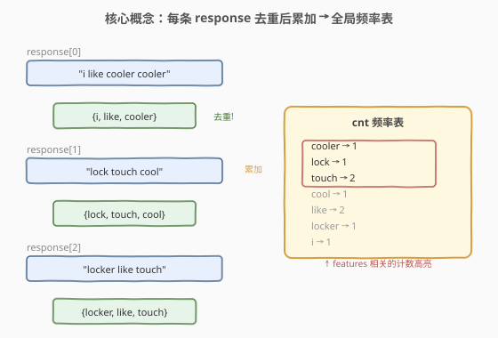
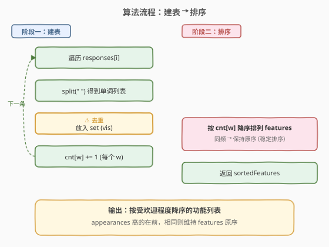
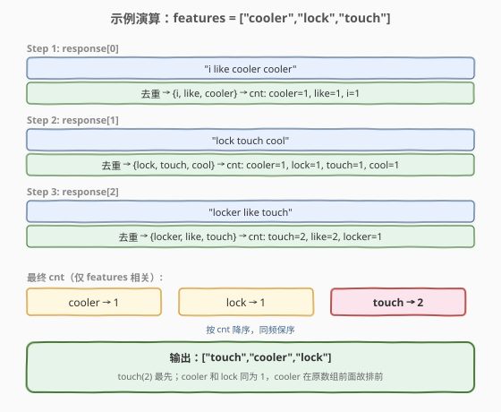

# LeetCode 按受欢迎程度排列功能 题解

## 1. 题目概述

- **标题 / 题号**：按受欢迎程度排列功能（#1772，medium）
- **链接**：https://leetcode.cn/problems/sort-features-by-popularity/
- **难度**：中等
- **标签**：数组、哈希表、字符串、排序

**题意**：给定一个字符串数组 `features`，其中 `features[i]` 是一个单词，描述一个功能的名称。另给定一个字符串数组 `responses`，其中 `responses[i]` 是一个以空格分隔的单词串，表示某位用户提及的功能。

定义 `appearances(word)` 为包含单词 `word` 的 `responses[i]` 的个数（同一条 response 中多次出现只算一次）。按受欢迎程度（即 `appearances` 值）**从高到低**排列功能；受欢迎程度相同时，保持它们在 `features` 中的原始相对顺序。返回排列后的数组。

**示例 1**：

```text
输入：features = ["cooler","lock","touch"], responses = ["i like cooler cooler","lock touch cool","locker like touch"]
输出：["touch","cooler","lock"]
解释：appearances("cooler") = 1，appearances("lock") = 1，appearances("touch") = 2。
      "cooler" 和 "lock" 都出现了 1 次，"cooler" 在原数组前面，所以排前面。
```

**示例 2**：

```text
输入：features = ["a","aa","b","c"], responses = ["a","a aa","a a a a a","b a"]
输出：["a","aa","b","c"]
解释：appearances("a") = 4，appearances("aa") = 1，appearances("b") = 1，appearances("c") = 0。
```

**约束**：

- $1 \le \text{features.length} \le 10^4$
- $1 \le \text{features[i].length} \le 10$
- `features` 不包含重复项，`features[i]` 由小写字母构成
- $1 \le \text{responses.length} \le 10^2$
- $1 \le \text{responses[i].length} \le 10^3$
- `responses[i]` 由小写字母和空格组成，无连续空格、无前后导空格

## 2. 解题思路

### 2.1 暴力思路

对每个 `features[x]`，遍历所有 `responses[i]`，检查该单词是否出现在 `responses[i]` 中。若一条 response 中出现多次仍只算一次，需要先对 response 内单词去重。时间复杂度 $O(F \times R \times L)$（$F$ = features 数，$R$ = responses 数，$L$ = 平均单词串长度），在 $F = 10^4$、$R = 10^2$、$L = 10^3$ 时约 $10^9$ 次操作，会超时。

> 核心瓶颈在于「为每个 feature 逐一扫描所有 responses」。可以反过来——先扫描 responses 建一张全局频率表，再查表排序，将 $O(F \times R \times L)$ 降为 $O(R \times L + F \log F)$。

### 2.2 核心观察：哈希计数 + 稳定排序



两个关键点：

1. **每条 response 内部去重**：一条 response 里同一个单词出现多次也只算 1 次。因此对每条 `responses[i]` 先 `split` 再放入 `set`，只对去重后的单词累加计数。这样 `cnt[word]` 就是 `appearances(word)`。
2. **稳定排序**：按 `cnt[word]` 降序排 `features`，同频率保持原序。Python `sorted` 天然稳定，只需以 `-cnt[w]` 为 key 即可；C++ 需要用索引数组 + 自定义比较器 `(cnt[i], i)` 降序、同值按 `i` 升序。

> ⚠️ **常见陷阱**：忘记对每条 response 去重，导致同一 response 中多次出现的单词被重复计数。例如示例 1 中 `"i like cooler cooler"` 里 `cooler` 出现两次，但 appearances 只算 1。

### 2.3 算法流程图



整体分两阶段：**建表**（遍历 responses，去重后累加）+ **排序**（按频率降序、同频保序排列 features）。

### 2.4 示例演算



以示例 1 为例，逐条处理 responses 并累加计数，最终排序得到 `["touch","cooler","lock"]`。

## 3. 参考代码

### C++

```cpp
class Solution {
  public:
    vector<string> sortFeatures(vector<string>& features, vector<string>& responses) {
        unordered_map<string, int> cnt;
        for (auto& s : responses) {
            istringstream iss(s);
            string w;
            unordered_set<string> vis;
            while (iss >> w) {
                vis.insert(w);
            }
            for (auto& w : vis) {
                ++cnt[w];
            }
        }
        int n = features.size();
        vector<int> idx(n);
        iota(idx.begin(), idx.end(), 0);
        sort(idx.begin(), idx.end(), [&](int i, int j) {
            int x = cnt[features[i]], y = cnt[features[j]];
            return x == y ? i < j : x > y;
        });
        vector<string> ans(n);
        for (int i = 0; i < n; ++i) {
            ans[i] = features[idx[i]];
        }
        return ans;
    }
};
```

### Python

```python
class Solution:
    def sortFeatures(self, features: List[str], responses: List[str]) -> List[str]:
        cnt = Counter()
        for s in responses:
            for w in set(s.split()):
                cnt[w] += 1
        return sorted(features, key=lambda w: -cnt[w])
```

> 💡 Python 版利用 `sorted` 的稳定性：同频率时 `key` 值相同，原序自动保留，无需显式传 index。C++ 的 `std::sort` 不保证稳定，所以用索引数组 + `i < j` 做同值 tie-breaker（等价于 `stable_sort` 但更直观）。

## 4. 复杂度分析

| 维度 | 复杂度 | 说明 |
|------|--------|------|
| 时间复杂度 | $O(R \cdot L + F \log F)$ | 建表：遍历所有 responses 的所有单词 $O(R \cdot L)$；排序：对 $F$ 个 feature 排序 $O(F \log F)$ |
| 空间复杂度 | $O(R \cdot L + F)$ | 哈希表 cnt 最多存所有不同单词；索引数组 $O(F)$ |

其中 $F$ = `features.length`，$R$ = `responses.length`，$L$ = response 平均单词数。由于 $R \le 10^2$、$L \le 10^3$，建表部分至多 $10^5$ 次操作，远优于暴力的 $10^9$。

## 5. 扩展：为何不用 `std::stable_sort`？

C++ 中也可以直接对 `features` 用 `stable_sort`：

```cpp
stable_sort(features.begin(), features.end(),
            [&](const string& a, const string& b) {
                return cnt[a] > cnt[b];
            });
```

但索引数组方案有两个优势：

1. **避免拷贝**：排序的是 `int` 索引而非 `string`，交换代价更低。
2. **显式 tie-breaker**：`i < j` 让「同频保序」规则一目了然，不依赖读者对 `stable_sort` 语义的熟悉度。

## 6. 面试要点

1. **为什么每条 response 要先去重？**

   - `appearances(word)` 的定义是「包含该单词的 response 条数」，而非「该单词在所有 response 中出现的总次数」。同一条 response 中多次出现只算 1 次，所以必须用 `set` 去重后再计数。

2. **Python 的 `sorted` 为什么天然满足稳定排序？**

   - Python 的 Timsort 是稳定排序，当两个元素的 key 相等时保持原始相对顺序。因此 `key=lambda w: -cnt[w]` 在同频时自动按 `features` 原序排列，无需额外传 index。

3. **如果 `features` 有重复项怎么办？**

   - 题目保证无重复。若有重复，索引数组方案中 `i < j` 的 tie-breaker 会让同名的两个 feature 按 index 排列，但它们在结果中都存在；若需合并则需额外去重逻辑。

4. **哈希表 vs 排序，哪个是瓶颈？**

   - 当 $F \gg R \cdot L$ 时（如 $F = 10^4$、$R \cdot L = 10^4$），排序 $O(F \log F) \approx 1.3 \times 10^5$ 与建表相当，两者都不是瓶颈。当 $R \cdot L$ 很大时建表主导。整体远优于暴力。

5. **能否用 Trie 代替哈希表？**

   - 可以。单词均为小写字母、长度 $\le 10$，Trie 的查找/插入也是 $O(\text{len})$，但常数大于哈希表且代码更复杂。本题数据规模下哈希表已足够，Trie 适合需要前缀匹配的场景。

## 同类练习题

| # | 题目 | 与本题的关联 |
|---|------|-------------|
| 692 | [前 K 个高频单词](https://leetcode.cn/problems/top-k-frequent-words/) | 频率统计 + 自定义排序（同频字典序升序），Top-K 可用堆优化 |
| 347 | [前 K 个高频元素](https://leetcode.cn/problems/top-k-frequent-elements/) | 频率统计 + 排序/堆/桶排，不要求稳定 |
| 451 | [根据字符出现频率排序](https://leetcode.cn/problems/sort-characters-by-frequency/) | 频率统计 + 降序排列，字符级而非单词级 |
| 1365 | [有多少小于当前数字的数字](https://leetcode.cn/problems/how-many-numbers-are-smaller-than-the-current-number/) | 计数后查表排序，结构类似（计数驱动排序） |
