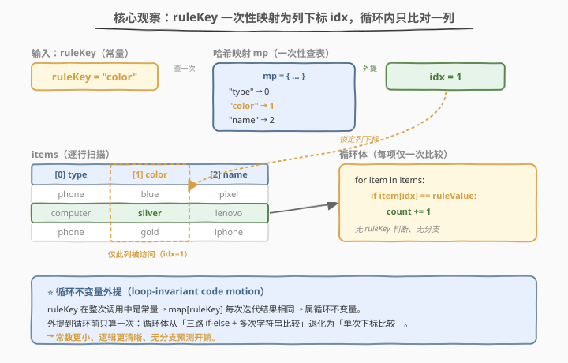
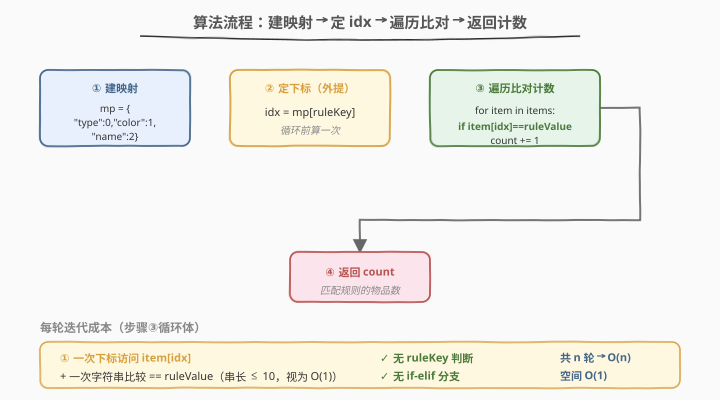
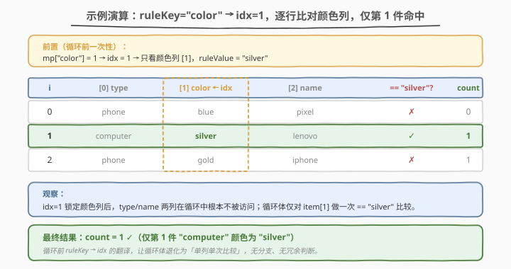

# LeetCode 统计匹配规则的物品数量 题解

## 1. 题目概述

- **标题 / 题号**：统计匹配规则的物品数量（#1773，easy）
- **链接**：https://leetcode.cn/problems/count-items-matching-a-rule/
- **难度**：简单
- **标签**：数组、字符串、哈希表、循环不变量外提

**题意**：给定一个二维数组 `items`，其中 `items[i] = [type_i, color_i, name_i]`，依次描述第 $i$ 件物品的**类型**、**颜色**、**名称**。再给定一条由两个字符串 `ruleKey` 与 `ruleValue` 表示的规则：

- `ruleKey == "type"` 且 `ruleValue == type_i`，或
- `ruleKey == "color"` 且 `ruleValue == color_i`，或
- `ruleKey == "name"` 且 `ruleValue == name_i`

满足任一即称该物品**匹配规则**。返回匹配规则的物品**数量**。

**示例 1**：

```text
输入：items = [["phone","blue","pixel"],["computer","silver","lenovo"],["phone","gold","iphone"]],
     ruleKey = "color", ruleValue = "silver"
输出：1
解释：ruleKey 为 "color"，需匹配颜色列。仅第 1 件 "computer" 的颜色为 "silver"。
```

**示例 2**：

```text
输入：items = [["phone","blue","pixel"],["computer","silver","phone"],["phone","gold","iphone"]],
     ruleKey = "type", ruleValue = "phone"
输出：2
解释：ruleKey 为 "type"，需匹配类型列。第 0、2 件的类型都是 "phone"。
```

**约束**：

- $1 \le \text{items.length} \le 10^4$
- $1 \le \text{type_i.length}, \text{color_i.length}, \text{name_i.length} \le 10$
- `ruleKey` 取值仅为 `"type"`、`"color"`、`"name"` 三者之一
- 所有字符串仅由小写英文字母组成

> 💡 **关键结构**：`ruleKey` 在整次查询中**恒定不变**，而每个物品固定是 3 元组 `[type, color, name]`。问题本质是「按指定列下标做相等过滤后计数」——把 `ruleKey` 这个字符串翻译成一个列下标 $j \in \{0,1,2\}$，剩下就是一遍线性扫描。与 [1757. 可回收且低脂的产品](https://leetcode.cn/problems/recyclable-and-low-fat-products/) 的 `WHERE` 谓词过滤同构，只是本题把「列名」也作为输入参数动态给定。

## 2. 解题思路

### 2.1 暴力思路：循环内三路分支

最直觉的写法是对每个物品做三路 `if-else`，逐项判断 `ruleKey` 是哪一种再比对对应字段：

```text
count = 0
for item in items:
    if ruleKey == "type"  and item[0] == ruleValue: count += 1
    elif ruleKey == "color" and item[1] == ruleValue: count += 1
    elif ruleKey == "name"  and item[2] == ruleValue: count += 1
return count
```

结果正确，时间 $O(n)$、空间 $O(1)$，复杂度看似已最优。

> ⚠️ **症结**：`ruleKey` 在整次调用中是**常量**，但上述写法让它在循环体里被反复比较——$n$ 个物品就要做 $n$ 次字符串相等判断（最坏还要走完三路分支），且每次都得到同一个结论。这是典型的「循环不变量未外提」：本可在循环前一次性确定的东西，被拖进了循环里反复计算。

### 2.2 核心观察：ruleKey → 列下标一次性映射



关键洞察：`ruleKey` 只有三种取值，分别对应物品三元组的第 $0, 1, 2$ 列。因此可以用一张**哈希映射**把字符串翻成列下标，**循环前算一次**，循环体内就只剩一次下标取值 + 一次字符串比较：

$$
\text{idx} = \text{map}[\text{ruleKey}], \qquad \text{map} = \{\text{"type"} \to 0,\ \text{"color"} \to 1,\ \text{"name"} \to 2\}
$$

循环体塌缩为：

$$
\text{for item in items: if item[idx] == ruleValue: count += 1}
$$

- **循环前**：$O(1)$ 一次哈希查表，定下 `idx`。
- **循环内**：每项仅一次下标访问 + 一次字符串比较，**无分支**。

> 💡 **深层原则——循环不变量外提**（loop-invariant code motion）：凡在循环中每次迭代结果都相同的计算，都应提到循环外做一次。本题 `ruleKey` 是常量、`map` 是常量，故 `map[ruleKey]` 是循环不变量。外提后，循环体从「三路 `if-else` + 三次字符串比较」退化为「单次下标比较」，常数大幅下降。这是编译器自动优化的经典种类，但写代码时主动识别并外提，能让逻辑更清晰、更难出错。
>
> 💡 **与 1757 的同构**：1757 的 `WHERE low_fats='Y' AND recyclable='Y'` 是**编译期固定**的双列谓词；本题的列名是**运行时参数** `ruleKey`，需先做一次「列名 → 列下标」的翻译才能套用同样的逐行过滤。可看作 1757 的「动态列名」泛化版。

### 2.3 算法流程图



1. **建映射**：`mp = {"type": 0, "color": 1, "name": 2}`。
2. **定下标**：`idx = mp[ruleKey]`（循环前一次性完成）。
3. **遍历计数**：`count = 0`；对每个 `item`，若 `item[idx] == ruleValue` 则 `count += 1`。
4. **返回**：`count`。

每轮 $O(1)$（一次下标访问 + 一次字符串比较），共 $n$ 轮。

### 2.4 示例演算

以示例 1 `items = [["phone","blue","pixel"], ["computer","silver","lenovo"], ["phone","gold","iphone"]]`，`ruleKey = "color"`，`ruleValue = "silver"` 为例：



前置步骤：`mp["color"] = 1`，故 `idx = 1`（只看颜色列）。

| $i$ | `item[i][0]` type | `item[i][1]` color | `item[i][2]` name | `item[1] == "silver"?` | 计数 |
|-----|-------------------|--------------------|-------------------|------------------------|------|
| $0$ | `phone` | `blue` | `pixel` | ✗ | $0$ |
| $1$ | `computer` | `silver` | `lenovo` | ✓ | $1$ |
| $2$ | `phone` | `gold` | `iphone` | ✗ | $1$ |

- `idx = 1` 锁定**颜色列**，其余两列在循环中根本不被访问。
- 仅第 1 件 `"silver"` 命中，最终 `count = 1` ✓。

> 💡 注意循环体只对 `item[1]` 做了一次比较——这正是 2.2「外提后无分支」的体现：决定看哪一列的工作在循环前就已完成，循环里不再有 `ruleKey` 的身影。

## 3. 参考代码

### C++

```cpp
class Solution {
public:
    int countMatches(vector<vector<string>>& items, string ruleKey, string ruleValue) {
        static const unordered_map<string, int> mp = {
            {"type", 0}, {"color", 1}, {"name", 2}
        };
        int idx = mp.at(ruleKey);
        int cnt = 0;
        for (const auto& item : items) {
            if (item[idx] == ruleValue) ++cnt;
        }
        return cnt;
    }
};
```

### Python

```python
class Solution:
    def countMatches(self, items: List[List[str]], ruleKey: str, ruleValue: str) -> int:
        idx = {"type": 0, "color": 1, "name": 2}[ruleKey]
        return sum(1 for item in items if item[idx] == ruleValue)
```

> 💡 **写法对照**：两版都遵循「先映射、后扫描」两段式。
> - **C++** 用 `static const unordered_map` 让映射表只构造一次（多次调用复用），`mp.at(ruleKey)` 带越界检查（题目保证 `ruleKey` 合法，亦可 `mp[ruleKey]`）。范围 `for` 取 `const auto&` 避免字符串拷贝。
> - **Python** 直接用字典字面量 `{"type":0,"color":1,"name":2}[ruleKey]` 一次性取下标，`sum` + 生成器表达式是「计数型过滤」的惯用法，避免显式 `count += 1` 累加。
>
> ⚠️ **别在循环里查 `mp`**：把 `idx = mp[ruleKey]` 写进循环体虽结果正确，但每次迭代多一次哈希查表，退化成 2.1 的低效版本。映射必须**外提到循环前**。

## 4. 复杂度分析

| 维度 | 复杂度 | 说明 |
|------|--------|------|
| 时间复杂度 | $O(n)$ | 循环前 $O(1)$ 建映射查表；循环 $n$ 轮，每轮一次下标访问 + 一次长度 $\le 10$ 的字符串比较（视为 $O(1)$） |
| 空间复杂度 | $O(1)$ | 仅常数变量 `idx`、`cnt`；哈希映射大小固定为 3，与 $n$ 无关 |

> 💡 对比 2.1 暴力三路分支：同为 $O(n) / O(1)$，但循环体内每项最多 3 次字符串比较（`ruleKey` 判断）+ 1 次字段比较；外提后每项仅 1 次字段比较。$n = 10^4$、串长 $\le 10$ 时实测差异微小，但外提写法**逻辑更清晰、无分支预测开销**，是工程与面试都更优的写法。

## 5. 扩展：列名索引化的几种实现

把 `ruleKey` 翻译成列下标有多种写法，各有取舍：

| 写法 | 实现 | 优劣 |
|------|------|------|
| **哈希映射**（推荐） | `mp = {"type":0,"color":1,"name":2}; idx = mp[ruleKey]` | $O(1)$ 查表，语义清晰，扩展到任意多列只需改表 |
| 三路 `if-else` | `if ruleKey=="type": idx=0; elif ...` | $O(1)$ 但啰嗦，列数多时退化成长 `if-elif` 链 |
| `find` + 偏移 | `idx = string("type color name").find(ruleKey) / 5` | 投机取巧，依赖列名等长，**不推荐** |
| 首字符哈希 | `idx = "tcn".find(ruleKey[0])` | 利用 `type/color/name` 首字母 `t/c/n` 互异，但**脆弱**——一旦列名首字母撞同即失效 |

> ⚠️ **首字符哈希的陷阱**：`type`/`color`/`name` 恰好首字母互异，于是有人用 `ruleKey[0]` 当键。这只是**巧合**，不是通用解。若题目后续加一列 `title`（首字母也是 `t`），该写法立刻崩溃。哈希映射用**完整字符串**作键，对任意列名集合都正确，是稳健的工程选择。

> 💡 **更通用的视角**：本题是「按列名做投影 + 行过滤」的数组版。在数据库里（如 1757）列名→列号由 schema 元数据维护；在数据分析库（pandas）里对应 `df[ruleKey] == ruleValue` 的列选取；本题把这一步显式地交给开发者用哈希表实现。理解「列名翻译」这一步，就理解了数据查询的底层骨架。

## 6. 面试要点

**Q1：为什么把 `ruleKey` 的判断放到循环外面？**
> 因为 `ruleKey` 在整次调用中是常量，`map[ruleKey]` 的结果每次迭代都相同，是**循环不变量**。外提到循环前只算一次，循环体从「三路 `if-else` + 多次字符串比较」退化为「单次下标比较」，常数更小、逻辑更清晰。这是「循环不变量外提」优化原则的应用。

**Q2：为什么用哈希映射而不是 `if-else` 链判断 `ruleKey`？**
> 哈希映射用完整字符串作键，$O(1)$ 查表且语义集中；`if-else` 链在列数增多时会变长难维护。本题仅 3 列差异不大，但哈希映射的扩展性更好——加列只需改表，无需改逻辑。这是一种「用数据驱动代替分支驱动」的工程习惯。

**Q3：本题与 1757「可回收且低脂的产品」有何异同？**
> 都是「按列做相等过滤后计数/返回」。1757 的列名（`low_fats`/`recyclable`）在 SQL 里编译期固定，直接写进 `WHERE`；本题列名是运行时参数 `ruleKey`，需先做一次「列名→列下标」翻译才能套用同样的逐行过滤。可看作 1757 的「动态列名」泛化版，骨架完全同构。

**Q4：能否用 `find` 或首字符技巧代替哈希映射？有什么风险？**
> 能，但脆弱。比如利用 `type/color/name` 首字母 `t/c/n` 互异用 `ruleKey[0]` 当键——这只是**巧合**，一旦新增列名首字母撞同（如 `title`）即失效。哈希映射用完整字符串作键，对任意列名集合都正确。工程上应选稳健解，不依赖题目数据的巧合。

**Q5：如果 `items` 行数极大（$10^9$）且要支持多次不同 `ruleKey`/`ruleValue` 查询，该如何优化？**
> 单次线性扫描已不够，需建**倒排索引**：对每列的每个值维护出现位置的列表（或位图），查询时按 `ruleKey` 选列、按 `ruleValue` 取索引列表，计数即列表长度，$O(1)$ 查询。这相当于把本题从「扫表」升级为「查索引」，是数据库索引、搜索引擎倒排表的核心思想。

## 同类练习题

| # | 题目 | 与本题的关联 |
|---|------|-------------|
| 1757 | [可回收且低脂的产品](https://leetcode.cn/problems/recyclable-and-low-fat-products/)（[题解](../1701-1800/1757_可回收且低脂的产品.md)） | 同骨架异实现——1757 列名编译期固定写进 `WHERE`，本题列名运行时给定需哈希翻译；对照体会「动态列名」泛化 |
| 1772 | [按标签显示相似度最高的技术](https://leetcode.cn/problems/similar-string-pairs/) | 同题号区间，按标签（字符串）做过滤的数组题，巩固「按字段值匹配」模式 |
| 1812 | [判断国际象棋棋盘某格颜色](https://leetcode.cn/problems/determine-color-of-a-chessboard-square/) | 把字符映射为数值索引（`'a'-'h'` → 0-7）再判定奇偶，同为「字符串→下标」映射思路的简单应用 |
| 1523 | [在区间范围内统计奇数个数](https://leetcode.cn/problems/count-odd-numbers-in-an-interval-range/) | 线性计数型简单题，对照「单遍扫描计数」与「公式直接求」两种思路的取舍 |
| 2114 | [句子中的最多单词数](https://leetcode.cn/problems/maximum-number-of-words-found-in-sentences/) | 数组 + 字符串的逐元素扫描计数，巩固「外层遍历 + 内层度量」的简单题骨架 |
