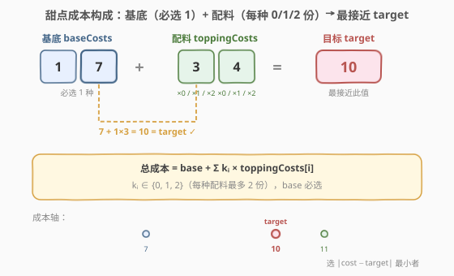
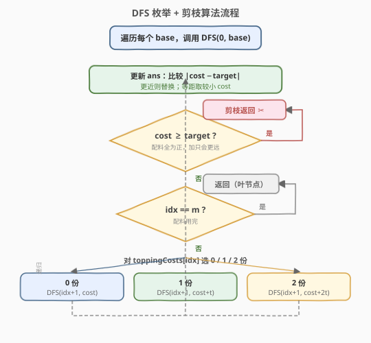

# LeetCode 最接近目标价格的甜点成本 题解

## 1. 题目概述

- **标题 / 题号**：最接近目标价格的甜点成本（#1774，medium）
- **链接**：https://leetcode.cn/problems/closest-dessert-cost/
- **难度**：中等
- **标签**：数组、回溯、DFS、剪枝

**题意**：你打算做一道甜点，需要选择**基底**和**配料**：

- 有 `n` 种基底，成本为 `baseCosts[i]`，**必须恰好选一种**。
- 有 `m` 种配料，成本为 `toppingCosts[i]`，每种配料可以选 **0 份、1 份或 2 份**（最多 2 份）。
- 给定目标价格 `target`，求所有可行甜点成本中**最接近 `target`** 的那个。若有两种成本与 `target` 距离相同，返回**较小**的那个。

**示例 1**：

```text
输入：baseCosts = [1,7], toppingCosts = [3,4], target = 10
输出：10
解释：选基底 7，加 1 份配料 3（7 + 3 = 10），恰好等于目标。
```

**示例 2**：

```text
输入：baseCosts = [3,10], toppingCosts = [2,5], target = 9
输出：8
解释：选基底 3，加 1 份配料 5（3 + 5 = 8，距离 1）。
      也可得 10（距离 1），但等距取较小者，故返回 8。
```

**示例 3**：

```text
输入：baseCosts = [10], toppingCosts = [1], target = 1
输出：10
解释：基底最小为 10 已远超 target，加配料只会更远，故答案为 10。
```

**约束**：

- `1 <= n, m <= 10`
- `1 <= baseCosts[i], toppingCosts[i] <= 10^4`
- `1 <= target <= 10^5`

## 2. 解题思路

### 2.1 暴力思路

最直觉的做法是**穷举所有可能的甜点成本**：

- 从 `n` 种基底中选 1 种（`n` 种选择）。
- 对 `m` 种配料，每种选 0/1/2 份（$3^m$ 种组合）。
- 总方案数 $n \times 3^m$，逐一计算成本并跟踪最接近 `target` 的。

由约束 $n, m \leq 10$，总方案数 $\leq 10 \times 3^{10} = 593490$，完全可以接受。但如果不加剪枝地完整展开，会有大量**无意义的搜索**：一旦成本已经 $\geq \text{target}$，继续加配料只会让成本更大、离目标更远。

### 2.2 核心观察：DFS 枚举 + 贪心剪枝



关键观察基于一个简单事实：**所有基底和配料成本均为正整数**。

> 💡 **剪枝依据**：如果当前累加成本 `cost` 已经 $\geq \text{target}$，那么再添加任何配料（正数）只会让 `cost` 更大，距离 `target` 更远。因此当前 `cost` 就是这条搜索分支上**最好的候选**——记录后直接剪枝返回，无需继续深入。

这使得 DFS 树在每个分支上一旦「越过」`target` 就停止展开，实际搜索量远小于 $3^m$。

**更新答案的规则**：

- 若 $|\text{cost} - \text{target}| < |\text{ans} - \text{target}|$：更新 `ans = cost`。
- 若 $|\text{cost} - \text{target}| = |\text{ans} - \text{target}|$ 且 $\text{cost} < \text{ans}$：更新 `ans = cost`（等距取较小）。

> ⚠️ **每个节点都要更新答案**：进入 DFS 函数的第一步就是用当前 `cost` 更新 `ans`，然后再判断是否剪枝。这样即使剪枝，当前 `cost` 也已被纳入比较——例如 `cost == target` 时恰好命中，`cost > target` 时作为「上界候选」参与比较。

### 2.3 算法流程图



整体流程：

1. **外层循环**：遍历每个 `base`，以 `base` 为初始成本调用 `DFS(0, base)`。
2. **DFS(idx, cost)**：
   - 用 `cost` 更新全局 `ans`。
   - **剪枝**：若 `cost >= target`，返回（加配料只会更远）。
   - **终止**：若 `idx == m`（配料用完），返回。
   - **三叉分支**：对第 `idx` 种配料，分别选 0 份、1 份、2 份，递归 `DFS(idx+1, ...)`。

### 2.4 示例演算

![示例演算：base=7, toppings=[3,4], target=10](../images/1774_example_walkthrough.svg)

以 `baseCosts = [1,7]`、`toppingCosts = [3,4]`、`target = 10` 为例，重点看 `base = 7` 的搜索树：

| 节点 | cost | 判定 | 动作 |
|------|------|------|------|
| (idx=0, 7) | 7 | 7 < 10 | 更新 ans=7，展开 3 个子节点 |
| (idx=1, 7) | 7 | 7 < 10 | 展开：0×4 / 1×4 / 2×4 |
| (idx=1, 10) | 10 | 10 ≥ 10 | **ans=10（命中！），剪枝 ✂** |
| (idx=1, 13) | 13 | 13 ≥ 10 | 不换 ans，剪枝 ✂ |
| (idx=2, 7) | 7 | 叶节点 | 不换 ans |
| (idx=2, 11) | 11 | 11 ≥ 10 | 不换 ans，剪枝 ✂ |
| (idx=2, 15) | 15 | 15 ≥ 10 | 不换 ans，剪枝 ✂ |

`base = 7` 分支找到 `cost = 10`（距离 0），即为最终答案。`base = 1` 分支最接近的是 `cost = 9`（距离 1），不如 10。

> 💡 **剪枝效果**：`base = 7` 的完整 $3^2 = 9$ 个叶节点中，实际展开到第 2 层的只有 `(idx=1, cost=7)` 的 3 个子节点。`(idx=1, 10)` 和 `(idx=1, 13)` 都被剪枝，各自省去了 3 个子节点的搜索。越早越过 `target`，剪枝越狠。

## 3. 参考代码

### C++

```cpp
class Solution {
public:
    int closestCost(vector<int>& baseCosts, vector<int>& toppingCosts, int target) {
        ans = 1e9;  // 哨兵：保证首个真实 cost 必然更优
        for (int b : baseCosts) {
            dfs(toppingCosts, 0, b, target);
        }
        return ans;
    }

private:
    int ans;

    void dfs(const vector<int>& tops, int idx, int cost, int target) {
        update(cost, target);
        if (cost >= target || idx == (int)tops.size()) return;  // 剪枝 / 终止
        dfs(tops, idx + 1, cost, target);                       // 0 份
        dfs(tops, idx + 1, cost + tops[idx], target);           // 1 份
        dfs(tops, idx + 1, cost + 2 * tops[idx], target);       // 2 份
    }

    void update(int cost, int target) {
        int da = abs(ans - target);
        int dc = abs(cost - target);
        if (dc < da || (dc == da && cost < ans)) {
            ans = cost;
        }
    }
};
```

### Python

```python
class Solution:
    def closestCost(self, baseCosts: List[int], toppingCosts: List[int], target: int) -> int:
        ans = float('inf')

        def update(cost: int):
            nonlocal ans
            da = abs(ans - target)
            dc = abs(cost - target)
            if dc < da or (dc == da and cost < ans):
                ans = cost

        def dfs(idx: int, cost: int):
            update(cost)
            if cost >= target or idx == len(toppingCosts):
                return  # 剪枝 / 终止
            dfs(idx + 1, cost)                           # 0 份
            dfs(idx + 1, cost + toppingCosts[idx])       # 1 份
            dfs(idx + 1, cost + 2 * toppingCosts[idx])   # 2 份

        for b in baseCosts:
            dfs(0, b)
        return int(ans)
```

> ⚠️ **两个易错点**：
> 1. **先更新 ans 再剪枝**：必须在判断 `cost >= target` 之前就调用 `update(cost)`。否则当 `cost == target` 时会错过命中。正确顺序是「记录 → 剪枝 → 分支」。
> 2. **等距取较小**：当 `dc == da` 时，只有 `cost < ans` 才更新。题目要求等距时取较小成本，不能写成 `dc <= da` 直接替换——那样会在等距时用大值覆盖小值。

## 4. 复杂度分析

| 维度 | 复杂度 | 说明 |
|------|--------|------|
| 时间复杂度 | $O(n \cdot 3^m)$ | 最坏情况每个 base 展开完整三叉树；剪枝后实际远小于此 |
| 空间复杂度 | $O(m)$ | DFS 递归深度等于配料数 $m$（最多 10 层） |

> 💡 由 $n, m \leq 10$，最坏 $10 \times 3^{10} \approx 5.9 \times 10^5$ 次调用。配合剪枝（一旦 `cost >= target` 即停止），实际运行量通常远小于上界。即便不剪枝也能在时限内通过。

## 5. 扩展：排序 + 二分查找

如果配料数 $m$ 更大（如 $m \leq 20$），$3^m$ 会爆炸。此时可用 **排序 + 二分** 优化：

1. **预处理**：用 DFS 枚举所有 $3^m$ 种配料组合的总成本，存入数组并排序去重（$O(3^m \log 3^m)$）。
2. **逐基底二分**：对每个 `base`，在排序数组中二分查找最接近 `target - base` 的值（`lower_bound` 后比较左右邻居），$O(\log 3^m)$ 每次。
3. 总复杂度 $O(3^m \log 3^m + n \log 3^m)$。

更极端时（$m \leq 40$）可用 **Meet-in-the-Middle**：将配料分两组各 $3^{m/2}$，一组枚举排序，另一组枚举后二分查找。

> 💡 本题 $m \leq 10$，$3^{10} \approx 6 \times 10^4$，DFS + 剪枝已足够高效，无需排序二分。但这一思路在 $m$ 更大时是关键优化方向。

## 6. 面试要点

1. **为什么 `cost >= target` 时可以剪枝？**

   所有基底和配料成本均为正整数。一旦 `cost >= target`，继续添加配料只会让 `cost` 更大，$|\text{cost} - \text{target}|$ 只增不减。当前 `cost` 已是这条分支上离 `target` 最近（或等于最近）的候选，记录后剪枝不影响正确性。

2. **为什么要先 `update` 再剪枝？**

   剪枝分支上的 `cost` 本身是一个合法成本，必须参与答案比较。例如 `cost == target` 时必须记录这个命中；`cost = target + 1` 时它可能是「上界最近」的候选。如果先剪枝再记录，会漏掉这些情况。

3. **等距时为什么要取较小值？**

   题目明确规定：若两种成本与 `target` 距离相同，返回较小者。因此 `dc == da` 时只有 `cost < ans` 才更新。若误写成 `dc <= da`，等距时会把较大的 `cost` 也存入 `ans`，违反题意。

4. **为什么不用背包 DP？**

   本题不是「能否凑出某个精确成本」的判定问题，而是「找最接近 target 的成本」。成本取值范围大（最高约 $10^4 + 2 \times 10 \times 10^4 = 2.1 \times 10^5$），用布尔 DP 标记所有可达成本再扫描找最近也可以，但 $O(n \cdot m \cdot \text{maxCost})$ 的空间和时间都不如 DFS 直接。

5. **如果 $m$ 更大怎么做？**

   $m \leq 20$ 时用排序 + 二分（预处理 $3^m$ 配料组合，逐基底二分）；$m \leq 40$ 时用 Meet-in-the-Middle（拆半枚举 + 二分匹配）。

## 同类练习题

| # | 题目 | 与本题的关联 |
|---|------|-------------|
| 39 | [组合总和](https://leetcode.cn/problems/combination-sum/)（[题解](../0001-0100/39_组合总和.md)） | 同属 DFS 枚举 + 剪枝，候选元素可重复选，但无上限次数限制 |
| 40 | [组合总和 II](https://leetcode.cn/problems/combination-sum-ii/) | DFS 枚举 + 排序去重剪枝，每个元素最多用一次，对比 1774 的「每种最多 2 份」 |
| 1755 | [最接近目标值的子序列和](https://leetcode.cn/problems/closest-subsequence-sum/)（[题解](../1701-1800/1755_最接近目标值的子序列和.md)） | 同样求「最接近 target 的和」，但元素不可重复选，$n$ 较大时用 Meet-in-the-Middle |
| 16 | [最接近的三数之和](https://leetcode.cn/problems/3sum-closest/)（[题解](../0001-0100/16_最接近的三数之和.md)） | 排序 + 双指针维护最近和，另一种「找最接近」的经典套路 |
| 2035 | [将数组分成两个数组并最小化数组和的差](https://leetcode.cn/problems/partition-array-into-two-arrays-to-minimize-sum-difference/) | Meet-in-the-Middle 经典题，$n \leq 30$ 时拆半枚举 + 二分 |
