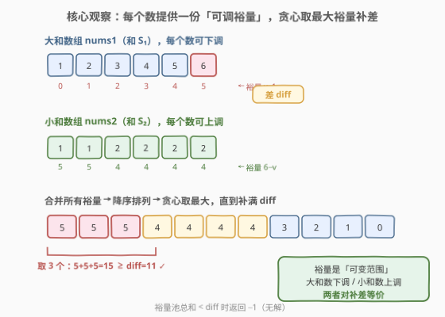
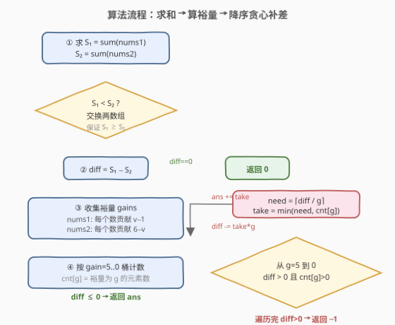
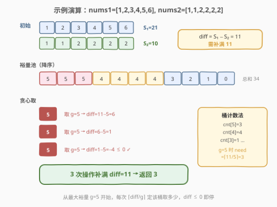

# LeetCode 通过最少操作次数使数组的和相等 题解

## 1. 题目概述

- **标题 / 题号**：通过最少操作次数使数组的和相等（#1775，medium）
- **链接**：https://leetcode.cn/problems/equal-sum-arrays-with-minimum-number-of-operations/
- **难度**：中等
- **标签**：贪心、数组、计数排序

**题意**：给你两个长度可能不等的整数数组 `nums1` 和 `nums2`，所有值都在 **1 到 6** 之间。每次操作可以选择**任意**数组中的任意一个整数，把它变成 1 到 6 之间的任意值。返回使 `nums1` 的和与 `nums2` 的和相等的**最少操作次数**；若无法相等返回 `-1`。

**示例 1**：

```text
输入：nums1 = [1,2,3,4,5,6], nums2 = [1,1,2,2,2,2]
输出：3
解释：S₁=21, S₂=10, diff=11。把 nums2 中一个 1→6（+5）、nums1 中 6→1（−5）、
      nums1 中 3→2（−1），三步后两和均 = 15。
```

**示例 2**：

```text
输入：nums1 = [1,1,1,1,1,1,1], nums2 = [6]
输出：-1
解释：nums1 全为 1 无法再下调，nums2 的 6 无法再上调，差值 1 永远无法补平。
```

**示例 3**：

```text
输入：nums1 = [6,6], nums2 = [1]
输出：3
解释：S₁=12, S₂=1, diff=11。两步把 6→2（各 −4）、一步把 1→4（+3），补满 11。
```

**约束**：

- $1 \le \text{nums1.length}, \text{nums2.length} \le 10^5$
- $1 \le \text{nums1}[i], \text{nums2}[i] \le 6$

> 💡 **关键直觉**：值域只有 1–6，每个数能贡献的「调整裕量」是有限的——大和数组里的数 $v$ 可下调到 1，贡献 $v-1$；小和数组里的数 $v$ 可上调到 6，贡献 $6-v$。把所有裕量收集起来**从大到小**贪心地补差值，就是最少操作次数。

## 2. 解题思路

### 2.1 暴力思路：枚举目标和

最直白的做法是枚举最终相等的和 $T$，对每个 $T$ 计算把 `nums1` 调到 $T$、`nums2` 调到 $T$ 各需多少次操作。但单个数组调到固定和本身就是一道难题（需 DP），且 $T$ 的范围达 $6 \times 10^5$，整体复杂度过高。

换个角度：**不需要关心最终和是多少**，只需关注**差值** `diff = |S₁ − S₂|`。每次操作的本质是「把差值缩小某个量」——要么把大和数组的某个数调小（减少 $S_1$），要么把小和数组的某个数调大（增加 $S_2$），两者对缩小 `diff` 完全等价。

### 2.2 核心观察：裕量池 + 贪心取最大



不妨设 $S_1 \ge S_2$（若不然交换两数组），差值 $\text{diff} = S_1 - S_2 \ge 0$。

**每个元素的裕量**：

- `nums1`（大和数组）里的数 $v$：可下调到 1，最多让 $S_1$ 减少 $v - 1$，即**裕量 $v - 1$**。
- `nums2`（小和数组）里的数 $v$：可上调到 6，最多让 $S_2$ 增加 $6 - v$，即**裕量 $6 - v$**。

把两个数组所有元素的裕量收集到一个**裕量池**，问题变成：**从池中选最少的数，使其总和 $\ge \text{diff}$**。

> ⚠️ 注意裕量取值只有 $0,1,2,3,4,5$（因为 $v \in [1,6]$），这是值域 $1\sim6$ 带来的关键结构。

**贪心策略**：裕量从大到小排序，依次取用。直观上——**一次操作能补的越多越好**，所以优先拿裕量大的元素。这是经典的「用最少个数填满容量」问题，贪心取最大即最优。

**正确性**：设最优解用了 $k$ 次操作，裕量分别为 $g_1 \ge g_2 \ge \dots \ge g_k$。若贪心解前 $k$ 个裕量 $g'_1 \ge \dots \ge g'_k$ 逐一不小于 $g_i$（因为贪心总是取当前最大），则 $\sum g'_i \ge \sum g_i \ge \text{diff}$，即贪心用 $k$ 次也能补满。故贪心次数 $\le$ 最优次数。又贪心本身是可行解，故相等。

### 2.3 算法流程图



流程如下：

1. 求 $S_1 = \sum \text{nums1}$，$S_2 = \sum \text{nums2}$。
2. 若 $S_1 < S_2$，交换两数组，保证 $S_1 \ge S_2$。
3. $\text{diff} = S_1 - S_2$。若 $\text{diff} = 0$，返回 0。
4. **桶计数**：`cnt[g]` 记录裕量为 $g$ 的元素个数（$g \in [0,5]$）。遍历 `nums1`，`cnt[v-1] += 1`；遍历 `nums2`，`cnt[6-v] += 1`。
5. 从 $g = 5$ 到 $g = 0$：若 $\text{diff} \le 0$ 停止；否则本次最多取 $\min(\lceil \text{diff}/g \rceil,\ \text{cnt}[g])$ 个（$g=0$ 时跳过，因为取了也没用），`ans += take`，`diff -= take * g`。
6. 遍历完若 $\text{diff} > 0$ 返回 $-1$（裕量总和不够），否则返回 `ans`。

> 💡 **为什么用桶计数而非排序？** 裕量只有 6 种取值（0–5），用大小为 6 的桶数组统计比 $O(n \log n)$ 排序更高效，是 $O(n)$。这是值域受限带来的优化——本质是**计数排序**思想。遍历时按 $g$ 从 5 降到 0，自然得到降序。

### 2.4 示例演算

以示例 1 `nums1=[1,2,3,4,5,6]`, `nums2=[1,1,2,2,2,2]` 为例：



| 步骤 | 取裕量 | diff 变化 | 说明 |
|------|--------|-----------|------|
| 初始 | — | 11 | $S_1=21, S_2=10$ |
| 1 | $g=5$ | $11-5=6$ | 取 `nums1` 的 6→1（或 `nums2` 的 1→6） |
| 2 | $g=5$ | $6-5=1$ | 再取一个裕量 5 |
| 3 | $g=5$ | $1-5=-4 \le 0$ ✓ | 第三个裕量 5，diff 已补满 |

裕量池总和 $= 0+1+2+3+4+5 + 5+5+4+4+4+4 = 34 \ge 11$，有解。从 $g=5$ 起，`cnt[5]=3`，`need = ⌈11/5⌉ = 3`，故一次取 3 个即补满，**返回 3**。

对照示例 2 `nums1=[1,1,1,1,1,1,1], nums2=[6]`：$S_1=7, S_2=6, \text{diff}=1$。`nums1` 裕量全为 0，`nums2` 裕量也为 0，裕量池总和 $= 0 < 1$，**返回 $-1$**。

> ⚠️ **无解判定**：裕量池总和 $< \text{diff}$ 即无解。等价地，`nums1` 全为 1 且 `nums2` 全为 6 时，两边都到极限无法再调。更精确地：$\text{nums1}$ 长度 $n_1$、$\text{nums2}$ 长度 $n_2$，两数组和能相等的充要条件是区间 $[n_1, 6n_1]$ 与 $[n_2, 6n_2]$ 有交集，即 $6n_1 \ge n_2$ 且 $6n_2 \ge n_1$。

## 3. 参考代码

### Python

```python
class Solution:
    def minOperations(self, nums1: list[int], nums2: list[int]) -> int:
        s1, s2 = sum(nums1), sum(nums2)
        if s1 < s2:
            nums1, nums2 = nums2, nums1
            s1, s2 = s2, s1
        diff = s1 - s2
        if diff == 0:
            return 0

        cnt = [0] * 6  # cnt[g] = 裕量为 g 的元素个数, g ∈ [0,5]
        for v in nums1:
            cnt[v - 1] += 1
        for v in nums2:
            cnt[6 - v] += 1

        ans = 0
        for g in range(5, 0, -1):
            if diff <= 0:
                break
            need = (diff + g - 1) // g
            take = min(need, cnt[g])
            ans += take
            diff -= take * g

        return ans if diff <= 0 else -1
```

### C++

```cpp
class Solution {
public:
    int minOperations(vector<int>& nums1, vector<int>& nums2) {
        int s1 = accumulate(nums1.begin(), nums1.end(), 0);
        int s2 = accumulate(nums2.begin(), nums2.end(), 0);
        if (s1 < s2) {
            swap(nums1, nums2);
            swap(s1, s2);
        }
        int diff = s1 - s2;
        if (diff == 0) return 0;

        int cnt[6] = {0};
        for (int v : nums1) cnt[v - 1]++;
        for (int v : nums2) cnt[6 - v]++;

        int ans = 0;
        for (int g = 5; g >= 1 && diff > 0; --g) {
            int need = (diff + g - 1) / g;
            int take = min(need, cnt[g]);
            ans += take;
            diff -= take * g;
        }
        return diff > 0 ? -1 : ans;
    }
};
```

> 💡 **实现细节**：① `g` 从 5 降到 1（不到 0），因为 $g=0$ 取了也不缩小 diff，跳过即可。② `need = ⌈diff/g⌉` 用整数上取整公式 `(diff + g - 1) / g`，避免浮点。③ 桶计数把 $O(n \log n)$ 排序压缩为 $O(n)$，是值域 $1\sim6$ 的关键红利。

## 4. 复杂度分析

| 维度 | 复杂度 | 说明 |
|------|--------|------|
| 时间 | $O(n_1 + n_2)$ | 两次求和 + 两次遍历统计桶 + 6 次循环贪心，线性 |
| 空间 | $O(1)$ | 桶数组大小恒为 6，与输入规模无关 |

> ⚠️ 若不利用值域受限、直接排序裕量池，复杂度为 $O((n_1+n_2)\log(n_1+n_2))$，$n \le 2\times10^5$ 时能过但不优雅。桶计数把排序省掉，体现「值域小 → 计数排序」的经典优化。

## 5. 扩展：无解的判定与区间交集

裕量池总和 $< \text{diff}$ 是无解的充要条件，但也可以**提前判定**避免无效计算：

- `nums1`（长 $n_1$）的和 $S_1 \in [n_1, 6n_1]$，`nums2`（长 $n_2$）的和 $S_2 \in [n_2, 6n_2]$。
- 能相等 $\iff$ 两个区间有交集 $\iff 6n_1 \ge n_2$ 且 $6n_2 \ge n_1$。
- 若 $6n_1 < n_2$：`nums1` 拉满到 6 也追不上 `nums2` 拉低到 1；若 $6n_2 < n_1$ 对称。

示例 2 中 $n_1=7, n_2=1$：$6n_2 = 6 < 7 = n_1$，区间 $[7,42]$ 与 $[1,6]$ 不相交，直接返回 $-1$。

> 💡 不过代码里用「裕量池总和 $<$ diff」判定更统一，无需额外分支——遍历完 `diff > 0` 即返回 $-1$，逻辑自然闭合。

## 6. 面试要点

1. **为什么贪心取最大裕量是最优的？**

   > 每次操作补的裕量越大，需要的次数越少。形式化：贪心前 $k$ 次取的裕量逐一不小于任意其他方案的前 $k$ 次（因为总是取当前最大），故用 $k$ 次能补的总量不小于任何方案，即贪心次数 $\le$ 最优次数。

2. **为什么用桶计数而不是排序？**

   > 值域只有 1–6，裕量取值只有 0–5，用大小为 6 的桶数组统计各裕量的个数，是 $O(n)$ 的计数排序。比 $O(n\log n)$ 通用排序更快，且常数极小。

3. **如何判断无解？**

   > 两种等价方式：① 裕量池总和 $< \text{diff}$（代码中遍历完 `diff > 0` 即返回 $-1$）；② 提前判定 $6n_1 < n_2$ 或 $6n_2 < n_1$（两数组和区间无交集）。

4. **大和数组下调和小和数组上调，为什么对补差等价？**

   > 缩小 $S_1 - S_2$ 既可以把 $S_1$ 减小，也可以把 $S_2$ 增大，效果都是让差值变小同一个量。所以两边裕量可以混在一个池里统一贪心，不必区分来源。

5. **如果把值域从 1–6 改成 1–$k$，算法还成立吗？**

   > 完全成立。裕量取值变为 $0 \sim k-1$，桶大小改为 $k$，其余逻辑不变。时间仍为 $O(n + k)$。只有当 $k$ 很大（如 $10^9$）时才需改用排序，退化为 $O(n\log n)$。

> 💡 **一句话总结**：值域 1–6 → 裕量 0–5 → 桶计数 → 降序贪心补差；裕量总和不够则 $-1$。

## 同类练习题

| # | 题目 | 与本题的关联 |
|---|------|-------------|
| 1753 | [移除石子的最大得分](https://leetcode.cn/problems/maximum-score-from-removing-stones/)（[题解](../1701-1800/1753_移除石子的最大得分.md)） | 同为「每次操作消去一定量，求最值」，本题是求**最少**操作补平差值，1753 是求**最多**配对得分，对照贪心方向 |
| 453 | [最小操作次数使数组元素相等](https://leetcode.cn/problems/minimum-moves-to-equal-array-elements/)（[题解](../0401-0500/453_最小操作次数使数组元素相等.md)） | 同为「最小操作使数组相等」，但 453 是让 $n-1$ 个元素 +1（等价于让 1 个 −1），数学转化后 $O(1)$，对照本题的裕量贪心 |
| 1049 | [最后一块石头的重量 II](https://leetcode.cn/problems/last-stone-weight-ii/)（[题解](../1001-1100/1049_最后一块石头的重量II.md)） | 最小化两堆石子差值，0-1 背包求最值，与本题「补平差值」目标一致但用 DP 求解，对照贪心 vs 背包的分野 |
| 2335 | [装满杯子需要的最短时间](https://leetcode.cn/problems/minimum-amount-of-time-to-fill-cups/) | 每次可同时装两杯，求最短时间，与本题同为「值域受限 + 贪心取最大」家族 |
| 2141 | [同时运行 N 台电脑的最长时间](https://leetcode.cn/problems/maximum-running-time-of-n-computers/) | $n$ 台电脑 + 若干电池，二分答案 + 贪心验证，对照本题「直接贪心」与「二分答案 + 贪心」的适用边界 |
