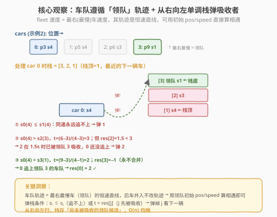
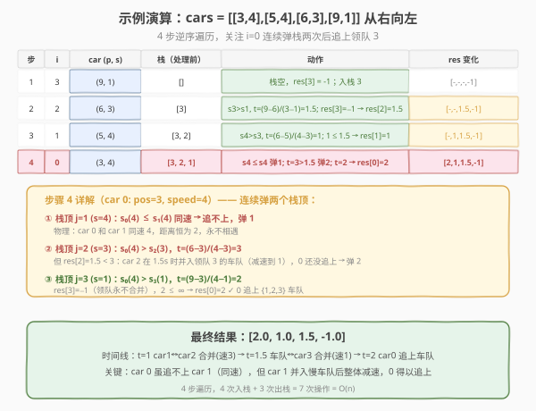

# LeetCode 车队 II 题解

## 1. 题目概述

- **标题 / 题号**：车队 II（#1776，hard）
- **链接**：https://leetcode.cn/problems/car-fleet-ii/
- **难度**：困难
- **标签**：数组、单调栈、数学

**题意**：一条**单车道**上有 `n` 辆车同向行驶，给定 `cars[i] = [position_i, speed_i]`，其中 `position_i` 严格递增（`position_i < position_{i+1}`），`speed_i` 为初始速度。当后车追上前车时，两车**合并成一个车队**，车队速度等于其中**最慢**一辆车的速度。返回 `answer[i]`：第 `i` 辆车与**下一辆车**相遇的时间（秒）；若永不相遇则为 `-1`。误差需在 `10^{-5}` 以内。

**示例 1**：

```text
输入：cars = [[1,2],[2,1],[4,3],[7,2]]
输出：[1.00000,-1.00000,3.00000,-1.00000]
解释：
  t=1：car0(p1,s2) 追上 car1(p2,s1) → 车队速度 1
  t=3：car2(p4,s3) 追上 car3(p7,s2) → 车队速度 2
  car1、car3 后无更慢车，各自 -1
```

**示例 2**：

```text
输入：cars = [[3,4],[5,4],[6,3],[9,1]]
输出：[2.00000,1.00000,1.50000,-1.00000]
解释：
  t=1：  car1(p5,s4) 追上 car2(p6,s3) → 车队速度 3
  t=1.5：车队{1,2} 追上 car3(p9,s1) → 车队速度 1
  t=2：  car0(p3,s4) 追上车队{1,2,3}（已减速到 1）
```

**约束**：

- $1 \le \text{cars.length} \le 10^5$
- $1 \le \text{position}_i, \text{speed}_i \le 10^6$
- $\text{position}_i < \text{position}_{i+1}$

> 💡 **与 853 车队的区别**：[853. 车队](https://leetcode.cn/problems/car-fleet/) 只问「到达终点的车队**数量**」，按到达时间排序贪心即可；本题要算**每辆车**的相遇时间，且车队的形成会**逐级连环**（A 追上 B 后减速，可能被更慢的 C 拖住，进而影响后方 D），必须用**单调栈**精确模拟每辆车的「有效被追上时间」。

## 2. 解题思路

### 2.1 暴力思路：逐车模拟

对每辆车 `i`，向后找第一辆能追上的车 `j`：若 $s_i > s_j$，相遇时间 $t = (p_j - p_i) / (s_i - s_j)$。但 `j` 可能在此之前已并入更慢的车队 `k`，导致 `j` 的有效速度变化。暴力做法需**逐时刻模拟**或**递归追踪** `j` 的最终归属，最坏 $O(n^2)$，$n = 10^5$ 时**超时**。

> ⚠️ **症结**：车队的形成是**链式**的——`j` 并入 `k` 后减速，`i` 追上 `j` 的时间也随之改变。每辆车只关心「它最终追上的那个车队领队是谁」，而这个信息可以从**右侧已经处理完的车**中继承。

### 2.2 核心观察：领队轨迹 + 从右向左单调栈



**洞察一：车队遵循「领队」的恒速轨迹。**

当多辆车依次追上、合并后，车队的速度等于**最右（最慢）**那辆车——即**领队**——的速度。关键在于：领队从 $t=0$ 起就以恒速 $s_{\text{leader}}$ 行驶，后续并入的车只是**贴上去**，不改变车队的轨迹。因此，无论某辆车何时并入，车队的位置始终是：

$$
\text{pos}_{\text{fleet}}(t) = p_{\text{leader}} + s_{\text{leader}} \cdot t
$$

这意味着：要算后车 `i` 追上某个车队，**直接用领队的初始 $p$ 和 $s$** 即可，无需追踪中间合并过程。

**洞察二：从右向左处理，栈存「尚未被吸收的领队候选」。**

从最右车（`n-1`）向左遍历。栈中保存右侧**仍然独立存在**的车（下标），栈顶是距 `i` 最近的下一辆车 `j`。对当前车 `i`：

- **若 $s_i \le s_j$**：`i` 追不上 `j`（`j` 同速或更快，距离不缩）。但 `j` 可能稍后并入更慢的前方车队而**减速**——所以 `j` 对 `i` 不再是有效障碍，**弹掉 `j`**，看栈中下一辆（更远但可能更慢的领队）。
- **若 $s_i > s_j$**：算 $t = (p_j - p_i)/(s_i - s_j)$。
  - 若 `j` 尚未被吸收（`res[j] == -1`）或 `j` 被吸收的时间 `res[j] >= t`（`i` 先追上 `j`，在 `j` 并入前）：`res[i] = t`，**停下**。
  - 若 `t > res[j]`（`j` 先并入前方车队，`i` 还没追上）：`j` 已不存在，**弹掉 `j`**，用前方领队重算。

> 💡 **为什么弹掉 $j$ 后直接用领队 $k$ 的 $p_k, s_k$ 算是对的？** 因为 $j$ 并入 $k$ 的车队后，车队轨迹就是 $k$ 的恒速直线（洞察一）。`i` 追上这个车队的时间 = 追上 $k$ 轨迹的时间 = $(p_k - p_i)/(s_i - s_k)$，前提是 $k$ 在此之前未被更前方吸收（由 `res[k]` 守卫）。中间车 $j$ 的并入**不改变车队轨迹**，所以无需知道 $j$ 的信息。

### 2.3 算法流程图


**完整步骤**：

1. **初始化**：`res = [-1.0] * n`，`stack = []`。
2. **逆序遍历** `i` **从** $n-1$ **到** $0$：取 $p, s = \text{cars}[i]$。
3. **while 栈非空**，令 $j = \text{stack}[-1]$，$p_j, s_j = \text{cars}[j]$：
   - **if** $s \le s_j$：`stack.pop()`，`continue`（追不上，$j$ 可能并入前方慢车队，弹掉看下一辆）。
   - **else** 算 $t = (p_j - p) / (s - s_j)$：
     - **if** $\text{res}[j] \ne -1$ **and** $t > \text{res}[j]$：`stack.pop()`，`continue`（$j$ 先被吸收）。
     - **else**：`res[i] = t`，`break`（$i$ 追上 $j$）。
4. **入栈** `stack.append(i)`。
5. 栈中剩余 `res` 已是 $-1$，**返回** `res`。

> ⚠️ **浮点除法**：$s - s_j > 0$ 已由 `if s <= s_j` 守卫排除，不会除零。Python 用 `/` 得 float；C++ 中 `pj - p` 与 `s - sj` 均为 int，需转 `double` 避免整数除法截断。

### 2.4 示例演算

以示例 2 `cars = [[3,4],[5,4],[6,3],[9,1]]` 为例：



| 步 | $i$ | car $(p, s)$ | 栈（处理前） | 动作 | res 变化 |
|----|-----|-------------|-------------|------|---------|
| 1 | 3 | (9, 1) | `[]` | 栈空，`res[3]=-1`；入栈 3 | `[-,-,-,-1]` |
| 2 | 2 | (6, 3) | `[3]` | $s_2(3) > s_3(1)$，$t=(9-6)/(3-1)=1.5$；`res[3]=-1` → `res[2]=1.5` | `[-,-,1.5,-1]` |
| 3 | 1 | (5, 4) | `[3, 2]` | $s_1(4) > s_2(3)$，$t=(6-5)/(4-3)=1$；$1 \le 1.5$ → `res[1]=1` | `[-,1,1.5,-1]` |
| 4 | 0 | (3, 4) | `[3, 2, 1]` | $s_0(4) \le s_1(4)$ 弹 1；$t=3 > 1.5$ 弹 2；$t=2$ → `res[0]=2` | `[2,1,1.5,-1]` |

**步骤 4 是关键**——`car 0` 连续弹掉两个栈顶：

- **弹 1**：`car 0` 与 `car 1` 同速 4，距离恒为 2，永追不上。但 `car 1` 稍后会并入慢车队而减速，所以 `car 1` 不再是有效障碍。
- **弹 2**：`car 0` 追上 `car 2` 需 $t=3$，但 `car 2` 在 $t=1.5$ 时已并入领队 `car 3`（速度降至 1），`car 0` 还没追上 → `car 2` 已不存在，弹掉。
- **追 3**：`car 0` 追上领队 `car 3` 的车队（速度 1），$t=(9-3)/(4-1)=2$，`res[3]=-1` → `res[0]=2`。

> 💡 **物理时间线**：$t=1$ `car1` 追上 `car2`（车队速 3）→ $t=1.5$ 车队追上 `car3`（车队速 1）→ $t=2$ `car0` 追上整个车队。`car 0` 虽追不上 `car 1`（同速），但 `car 1` 并入慢车队后整体减速，`car 0` 才得以追上——这正是「弹掉同速车」的物理依据。

## 3. 参考代码

### C++

```cpp
#include <vector>
using namespace std;

class Solution {
public:
    vector<double> getCollisionTimes(vector<vector<int>>& cars) {
        int n = cars.size();
        vector<double> res(n, -1.0);
        vector<int> stk;                 // 存下标，从右向左的候选领队
        for (int i = n - 1; i >= 0; --i) {
            int p = cars[i][0], s = cars[i][1];
            while (!stk.empty()) {
                int j = stk.back();
                int pj = cars[j][0], sj = cars[j][1];
                if (s <= sj) {
                    stk.pop_back();      // 追不上 j，j 可能并入前方慢车队
                } else {
                    double t = (double)(pj - p) / (s - sj);
                    if (res[j] != -1.0 && t > res[j]) {
                        stk.pop_back();  // j 先被前方吸收，弹掉看下一辆
                    } else {
                        res[i] = t;      // i 追上 j
                        break;
                    }
                }
            }
            stk.push_back(i);
        }
        return res;
    }
};
```

### Python

```python
class Solution:
    def getCollisionTimes(self, cars: list[list[int]]) -> list[float]:
        n = len(cars)
        res: list[float] = [-1.0] * n
        stack: list[int] = []          # 存下标，从右向左的候选领队
        for i in range(n - 1, -1, -1):
            p, s = cars[i]
            while stack:
                j = stack[-1]
                pj, sj = cars[j]
                if s <= sj:
                    stack.pop()         # 追不上 j
                else:
                    t = (pj - p) / (s - sj)
                    if res[j] != -1.0 and t > res[j]:
                        stack.pop()     # j 先被前方吸收
                    else:
                        res[i] = t      # i 追上 j
                        break
            stack.append(i)
        return res
```

> 💡 **写法对照**：两版逻辑一致。C++ 用 `vector` 当栈（`back`/`push_back`/`pop_back`），除法显式转 `(double)` 避免整数截断；Python `/` 天然返回 float。栈存**下标**而非值，因为要读 `res[j]` 和 `cars[j]` 的位置/速度。
>
> ⚠️ **别用 `stack<int>` 存值**：本题每辆车有 `(position, speed, res)` 三元信息，存下标可一次性索引全部，存值则需额外结构体，徒增复杂度。

## 4. 复杂度分析

| 维度 | 复杂度 | 说明 |
|------|--------|------|
| **时间复杂度** | $O(n)$ | 每个下标恰好入栈 1 次、出栈 1 次，`while` 总弹出 $\le n$ 次，均摊 $O(1)$ |
| **空间复杂度** | $O(n)$ | 栈最多存 $n$ 个下标（速度严格递增时） |

> ⚠️ 虽有 `while` 嵌套 `for`，看似 $O(n^2)$，但**均摊分析**：每个元素至多入栈 1 次出栈 1 次，`while` 总操作 $\le 2n$，故总时间 $O(n)$。这与 [739. 每日温度](../0701-0800/739_每日温度.md) 的单调栈均摊论证完全一致。

## 5. 扩展：弹栈条件的两种情形与等价性

本题弹栈有两个触发条件，理解它们的物理含义有助于面试时讲清：

| 条件 | 物理含义 | 弹掉 $j$ 是否安全 |
|------|---------|------------------|
| $s_i \le s_j$ | $i$ 追不上 $j$（同速或 $j$ 更快） | ✓ $j$ 若并入前方慢车队会减速，$i$ 可能追上减速后的车队；$j$ 若永不并入（`res[j]==-1`），栈不变量保证前方都 $\ge s_j \ge s_i$，会连续弹空 → `res[i]=-1` |
| $t > \text{res}[j]$ | $i$ 能追上 $j$，但 $j$ 先被前方吸收 | ✓ $j$ 并入领队 $k$ 后车队走 $k$ 的轨迹（洞察一），直接用 $k$ 重算等价 |

**栈不变量**：处理完 `i` 后，栈中任意 `res[j] == -1` 的车 `j`，其速度 $\le$ 前方所有栈内车的速度（否则 `j` 当初就会追上前方某车，`res[j] != -1`）。这保证了「$s_i \le s_j$ 且 `res[j] == -1`」时连续弹栈不会误判——前方只会更快或等速，$i$ 追不上任何人。

> 💡 **与 853 的对照**：853 只需按到达终点时间排序、贪心数车队数量（$O(n \log n)$ 排序）；1776 要精确算每辆车的相遇时间，必须用单调栈维护「有效领队链」。853 是「计数」问题，1776 是「逐元素求解」问题，后者信息量更大，需要更细的结构。

## 6. 面试要点

**Q1：为什么从右向左处理，而不是从左向右？**
> 从右向左时，右侧车队的归属已全部确定（`res[j]` 已知），当前车 `i` 可以直接查询「下一辆车何时被吸收」来决定是否弹栈。从左向右则无法预知右方车队的形成顺序，会陷入「`i` 追上 `j` 前 `j` 是否已并入别人」的循环依赖。这是单调栈「从无依赖侧出发」的通用原则。

**Q2：弹掉 $j$ 后为什么能直接用领队 $k$ 的 $p_k, s_k$ 算相遇时间？**
> 因为 $j$ 并入 $k$ 的车队后，车队走 $k$ 的恒速轨迹（领队速度 = 最慢车速度，后续并入不改轨迹）。$i$ 追上车队 = 追上 $k$ 的轨迹 = $(p_k - p_i)/(s_i - s_k)$，只要 $k$ 在此之前未被更前方吸收（由 `res[k]` 守卫）。中间车 $j$ 的信息完全不需要。

**Q3：$s_i \le s_j$ 时为什么要弹 $j$？$i$ 明明追不上 $j$。**
> $j$ 可能稍后并入更慢的前方车队而减速，减速后 $i$（若 $s_i > s_{\text{leader}}$）就能追上。所以 $j$ 不是有效障碍，弹掉看领队 $k$。若 $j$ 永不并入（`res[j]==-1`），栈不变量保证前方都 $\ge s_j \ge s_i$，会连续弹空，`res[i]` 保持 $-1$。

**Q4：时间复杂度为什么是 $O(n)$？**
> 均摊分析：每个下标入栈 1 次、出栈 1 次，`while` 总弹出 $\le n$。`for` 跑 $n$ 轮，每轮 `while` 均摊 $O(1)$，总计 $O(n)$。与每日温度、柱状图最大矩形等单调栈题的论证一致。

**Q5：栈里存下标还是存值？为什么？**
> 存**下标**。每辆车需索引三样信息：`cars[j]` 的位置和速度（算 $t$）、`res[j]`（判断是否先被吸收）。存下标一次索引全部；存值需额外结构体存 `res`，且失去与 `res` 数组的对应关系。通用原则：需关联多个数组信息时存下标。

> 💡 **一句话总结**：1776 是单调栈的高阶应用——核心是「**车队遵循领队恒速轨迹**」这一洞察，使得弹掉被吸收的车后能直接用领队重算相遇时间。从右向左扫，栈存候选领队，弹栈条件覆盖「追不上」和「先被吸收」两情形，$O(n)$ 均摊。它是 [739 每日温度](../0701-0800/739_每日温度.md) 单调栈模板在「带预吸收的连环合并」场景下的升级。

## 同类练习题

| # | 题目 | 与本题的关联 |
|---|------|-------------|
| 853 | [车队](https://leetcode.cn/problems/car-fleet/)（[题解](../0801-0900/853_车队.md)） | 同骨架异问题——853 只数到达终点的车队数量（排序贪心），1776 逐车算相遇时间（单调栈），对照体会「计数」与「逐元素求解」的难度差 |
| 739 | [每日温度](https://leetcode.cn/problems/daily-temperatures/)（[题解](../0701-0800/739_每日温度.md)） | 单调栈招牌题，从右向左 + 弹栈结算的母模板，1776 在其上增加「弹栈后用领队重算」的连环合并机制 |
| 1944 | [队列中可以看到的人数](https://leetcode.cn/problems/number-of-visible-people-in-a-queue/) | 单调栈从右向左 + 弹栈计数，与 1776 同为「右侧信息驱动」的单调栈高阶题 |
| 84 | [柱状图中最大的矩形](https://leetcode.cn/problems/largest-rectangle-in-histogram/)（[题解](../0001-0100/84_柱状图中最大的矩形.md)） | 单调栈经典，两侧扫描找边界，对照「单侧从右向左」与「双侧」的差异 |
