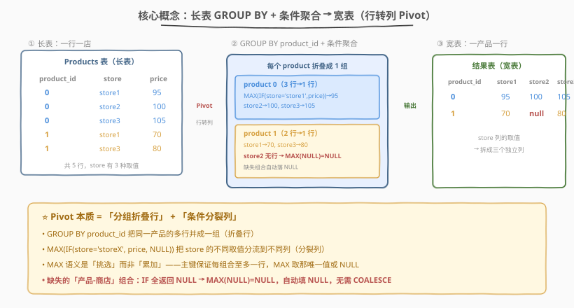
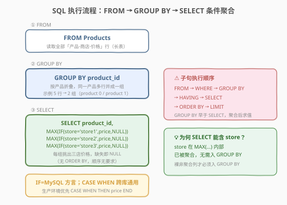
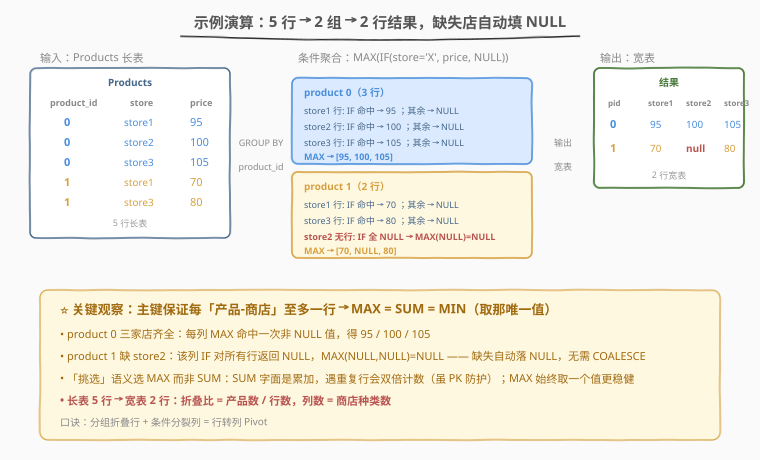

# 每家商店的产品价格

- **题目名称**：每家商店的产品价格
- **链接**：[1777. 每家商店的产品价格](https://leetcode.cn/problems/products-price-for-each-store/)
- **难度**：简单
- **标签**：数据库、SQL、`GROUP BY`、条件聚合、`CASE WHEN`/`IF`、行转列、`MAX`、Pivot

## 1. 题目概述

给定 `Products` 表，每行记录某产品在某商店的价格。表中 `store` 是枚举列，固定取值 `'store1'`、`'store2'`、`'store3'`（共三家商店）。要求**查出每个产品在每家商店的价格**，输出列为 `product_id, store1, store2, store3`；若某产品在某商店没有对应行（未上架），该列价格填 `NULL`。返回顺序无要求。

**表结构**：

```text
Table: Products
+-------------+---------+
| Column Name | Type    |
+-------------+---------+
| product_id  | int     |
| store       | enum    |
| price       | int     |
+-------------+---------+
(product_id, store) 是该表的主键。
store 是枚举类型，取值为 ('store1', 'store2', 'store3')。
每行表示该 product_id 在该 store 的价格。
```

**示例 1**：

```text
输入：
Products 表：
+-------------+--------+-------+
| product_id  | store  | price |
+-------------+--------+-------+
| 0           | store1 | 95    |
| 0           | store2 | 100   |
| 0           | store3 | 105   |
| 1           | store1 | 70    |
| 1           | store3 | 80    |
+-------------+--------+-------+

输出：
+-------------+--------+--------+--------+
| product_id  | store1 | store2 | store3 |
+-------------+--------+--------+--------+
| 0           | 95     | 100    | 105    |
| 1           | 70     | null   | 80     |
+-------------+--------+--------+--------+

解释：
产品 0 在三店均有售，价格 95 / 100 / 105。
产品 1 只在 store1（70）和 store3（80）有售，store2 无对应行 → 价格为 null。
```

**约束条件**：

- `(product_id, store)` 为主键，同一「产品-商店」组合至多一行
- `store` 仅取 `'store1'` / `'store2'` / `'store3'`
- `price` 为整数
- 返回结果顺序无要求

> 💡 本题是 SQL **「行转列（Pivot）招牌题」**——把「长表」（一行一个产品-商店价格对）**转置**成「宽表」（一行一个产品，每店一列）。核心套路是**条件聚合**：`GROUP BY product_id` 把同一产品的多行折叠成一行，再用 `MAX(IF(store='storeX', price, NULL))` 对每家店分别「挑出」价格。相比 [1741](../1701-1800/1741_查找每个员工花费的总时间.md) 的「分组 + `SUM` 求和」，本题聚合的目的不是「汇总」而是「挑选」——故用 `MAX` 而非 `SUM` 更贴切。

---

## 2. 解题思路

### 2.1 暴力思路：取回全表后应用层拼装

最直觉的过程式做法：`SELECT * FROM Products` 把整张长表读进应用层，按 `product_id` 分桶，再对每个产品的每行查 `store` 字段，把 `price` 填进对应列 `store1`/`store2`/`store3`，未出现的店留空。伪代码：

```text
result = {}
for row in Products:
    pid = row.product_id
    result.setdefault(pid, {s: None for s in ['store1','store2','store3']})
    result[pid][row.store] = row.price
return [[pid, d['store1'], d['store2'], d['store3']] for pid, d in result.items()]
```

这样能得出正确答案，但**把转置逻辑推给了应用层**：网络传输全部行、数据库的分组与聚合能力被闲置。正确做法是用 SQL 原生的「分组 + 条件聚合」在引擎层一次完成行转列。

### 2.2 核心观察：条件聚合实现行转列



**问题拆解为两个子问题**：

1. **折叠行**：同一产品可能有多行（每家店一行）。`GROUP BY product_id` 把同一产品的所有行合并成一行——这是任何 pivot 的第一步。

2. **列分裂**：要在结果里造出 `store1` / `store2` / `store3` 三个独立列，需用**条件表达式**把 `store` 列的不同取值「分流」到不同列：
   - 对每一行，判断 `store = 'store1'` 是否成立：
     - 成立 → 取 `price`；
     - 不成立 → 给 `NULL`。
   - 再用聚合函数 `MAX` 在组内「挑出」那个非 `NULL` 的 `price`（若有）或保持 `NULL`（若无）。

对 `store1` 列写出来就是：

```sql
MAX(IF(store = 'store1', price, NULL)) AS store1
```

> 💡 **为什么用 `MAX` 而不是 `SUM`？** 本题主键 `(product_id, store)` 保证了同一「产品-商店」组合至多一行，所以组内每个 `storeX` 条件下非 `NULL` 的 `price` 至多一个。此时 `MAX`、`MIN`、`SUM`、`AVG` 结果都相同——都是「那个唯一值或 `NULL`」。但 `MAX` 语义最贴切：我们是在**挑选**一个值而非**累加**，`MAX(price)` 表达的就是「取这组里的价格值」。`SUM` 会让人误以为在求和，遇到重复行时还可能双倍计数（虽有 PK 防护，但语义不如 `MAX` 清晰）。

> ⚠️ **`IF` 是 MySQL 方言，`CASE WHEN` 是标准 SQL**：`IF(cond, a, b)` 等价于 `CASE WHEN cond THEN a ELSE b END`。跨数据库（PostgreSQL/SQL Server/Oracle）请用 `CASE WHEN`。LeetCode 默认 MySQL，两种写法都通过。

> 💡 **`MAX` 遇到「全 `NULL`」返回 `NULL`**：若某产品在 `store2` 没有行，则 `IF(store='store2', price, NULL)` 对该产品所有行都返回 `NULL`，`MAX(NULL, NULL, ...)` = `NULL`——这恰好满足题目「未上架填 `NULL`」的要求，无需额外处理。

### 2.3 算法流程图



**逻辑执行步骤**：

| 步骤 | 子句 | 作用 |
|------|------|------|
| ① | `FROM Products` | 读取全部「产品-商店-价格」行 |
| ② | `GROUP BY product_id` | 按产品折叠，同一产品的多行并成一组 |
| ③ | `SELECT product_id, MAX(IF(store='store1',price,NULL)) AS store1, ...` | 每组输出产品 ID 与三家店各自挑出的价格 |

> 💡 **子句执行顺序**：`FROM` → `WHERE` → `GROUP BY` → `HAVING` → `SELECT` → `ORDER BY` → `LIMIT`。`GROUP BY` 早于 `SELECT`，故条件聚合 `MAX(IF(...))` 在分组完成后才对每组求值。本题无 `WHERE`（无需行级过滤）、无 `HAVING`、无 `ORDER BY`（顺序无要求）。

> ⚠️ **为何 `SELECT` 里能出现 `store` 列？** `store` 是**聚合函数 `MAX` 的参数表达式内部**的列，而非 `SELECT` 的裸非聚合列。标准 SQL 要求 `SELECT` 中的**裸非聚合列**必须出现在 `GROUP BY` 中；但被包在 `MAX(...)` 里的 `store` 已经被聚合，不需要进入 `GROUP BY`——这正是条件聚合能「行转列」的根本原因。

### 2.4 示例演算

以示例 1 的 5 行数据为例，观察「`GROUP BY product_id` → `MAX(IF(...))`」如何把长表转成宽表：



**步骤 ①：FROM Products（长表）**

| product_id | store  | price |
|------------|--------|-------|
| 0 | store1 | 95 |
| 0 | store2 | 100 |
| 0 | store3 | 105 |
| 1 | store1 | 70 |
| 1 | store3 | 80 |

**步骤 ②③：GROUP BY product_id + 条件聚合**

对 `store1` 列，`IF(store='store1', price, NULL)` 在组内逐行求值：

| 分组 | 行 | store1 表达式 | store2 表达式 | store3 表达式 |
|------|----|---------------|---------------|---------------|
| product 0 | store1/95 | 95 | NULL | NULL |
| product 0 | store2/100 | NULL | 100 | NULL |
| product 0 | store3/105 | NULL | NULL | 105 |
| **product 0 → MAX** | — | **95** | **100** | **105** |
| product 1 | store1/70 | 70 | NULL | NULL |
| product 1 | store3/80 | NULL | NULL | 80 |
| **product 1 → MAX** | — | **70** | **NULL** | **80** |

**输出（顺序无要求）**：

| product_id | store1 | store2 | store3 |
|------------|--------|--------|--------|
| 0 | 95 | 100 | 105 |
| 1 | 70 | null | 80 |

> 💡 **看 product 1 的 `store2` 列**：该产品没有 `store='store2'` 的行，故 `IF(store='store2', price, NULL)` 对它所有行都返回 `NULL`，`MAX(NULL, NULL)` = `NULL`——这正是「未上架填 `NULL`」的自动实现，无需 `COALESCE` 或外连接补齐。这是条件聚合 pivot 的天然优势：**缺失组合自动落为 `NULL`**。

---

## 3. 参考代码

### SQL（解法 A：`IF` + `MAX`，MySQL 推荐）

```sql
SELECT
    product_id,
    MAX(IF(store = 'store1', price, NULL)) AS store1,
    MAX(IF(store = 'store2', price, NULL)) AS store2,
    MAX(IF(store = 'store3', price, NULL)) AS store3
FROM Products
GROUP BY product_id;
```

> 💡 **写法要点**：
> - **`GROUP BY product_id`**：按产品折叠，每组对应输出一行。
> - **`IF(store = 'storeX', price, NULL)`**：条件表达式，命中本店取 `price`，否则给 `NULL`。
> - **`MAX(...)`**：在组内挑出唯一非 `NULL` 值；若全 `NULL` 则返回 `NULL`，天然处理「未上架」。
> - **三家店各写一个聚合列**：列名用 `AS storeX` 与商店枚举值对齐。**有几家店就写几列**——若商店是动态的，需改用动态 SQL（见第 5 节）。
> - ✓ **最推荐**（MySQL 环境）：语义清晰、一行搞定。

### SQL（解法 B：`CASE WHEN` + `MAX`，标准 SQL 跨库通用）

```sql
SELECT
    product_id,
    MAX(CASE WHEN store = 'store1' THEN price END) AS store1,
    MAX(CASE WHEN store = 'store2' THEN price END) AS store2,
    MAX(CASE WHEN store = 'store3' THEN price END) AS store3
FROM Products
GROUP BY product_id;
```

> 💡 **解法 B 与解法 A 等价**：`CASE WHEN cond THEN price END` 省略 `ELSE` 时默认 `ELSE NULL`，与 `IF(cond, price, NULL)` 完全一致。`CASE WHEN` 是 SQL 标准，**PostgreSQL / SQL Server / Oracle / SQLite** 均支持，跨库移植首选。`IF` 仅 MySQL 系（MySQL/MariaDB）识别。

### SQL（解法 C：`SUM` 等价写法，不推荐作首选）

```sql
SELECT
    product_id,
    SUM(IF(store = 'store1', price, NULL)) AS store1,
    SUM(IF(store = 'store2', price, NULL)) AS store2,
    SUM(IF(store = 'store3', price, NULL)) AS store3
FROM Products
GROUP BY product_id;
```

> ⚠️ **解法 C 在本题结果正确但语义偏差**：因主键保证每「产品-商店」至多一行，`SUM(单值或NULL)` = `MAX(单值或NULL)`。但 `SUM` 字面意思是「求和」，若数据有重复行（无 PK 时）会**累加**导致错误，而 `MAX` 仍取一个值更稳健。**面试中优先 `MAX`/`MIN`，把 `SUM` 作为「为什么也能用」的讨论点**。

### Python（pandas）

```python
import pandas as pd

def products_price_each_store(products: pd.DataFrame) -> pd.DataFrame:
    result = products.pivot(index='product_id', columns='store', values='price').reset_index()
    result.columns.name = None
    for s in ['store1', 'store2', 'store3']:
        if s not in result.columns:
            result[s] = None
    return result[['product_id', 'store1', 'store2', 'store3']]
```

> 💡 **pandas 对照**：
> - `products.pivot(index='product_id', columns='store', values='price')` 对应 SQL 的「`GROUP BY product_id` + 条件聚合」——`pivot` 是 pandas 原生的行转列操作，把 `store` 的取值展开为新列、`price` 填入对应单元格、缺失组合自动填 `NaN`（对应 SQL 的 `NULL`）。
> - `.reset_index()` 把 `product_id` 从索引还原为普通列，对应 SQL 的 `SELECT product_id`。
> - `result.columns.name = None` 去掉 `pivot` 给列名设的 `store` 名，避免输出列名带层级。
> - 手动补齐 `store1`/`store2`/`store3` 三列：若某店在数据中完全不存在（如所有产品都没在 `store2` 上架），`pivot` 不会生成该列，需显式补 `None`，保证输出 schema 稳定。
> - `NaN` 在 LeetCode pandas 判题中等价于 `NULL`，无需 `fillna`。

---

## 4. 复杂度分析

| 维度 | 解法 A/B（`MAX` + 条件聚合） | 解法 C（`SUM`） | pandas |
|------|------------------------------|-----------------|--------|
| **时间** | $O(n)$ | $O(n)$ | $O(n)$ |
| **空间** | $O(m \cdot k)$ | $O(m \cdot k)$ | $O(n)$ |
| **跨数据库** | A=MySQL；B=通用 | 通用 | — |
| **推荐度** | ✓ **首选** | ✗ 语义偏差 | ✓ 验证用 |

> - $n$ = `Products` 表行数，$m$ = 不同产品数，$k$ = 商店数（本题 $k=3$）
> - **时间**：一次 `GROUP BY` 哈希聚合 $O(n)$——每行做 $k$ 次条件判断（$O(1)$）+ 哈希查找/更新（均摊 $O(1)$）。无 `ORDER BY` 故无排序开销。
> - **空间**：聚合结果 $m$ 行 $\times$ $k$ 列 = $O(mk)$；pandas 需 $O(n)$ 存中间 DataFrame。
> - **索引优化**：在 `Products(product_id)` 上建索引可让 `GROUP BY` 走索引顺序扫描，相邻同产品行聚簇读取，减少随机 I/O；但本题无 `ORDER BY`，收益有限。覆盖索引 `(product_id, store, price)` 可不回表。

---

## 5. 扩展：静态 Pivot vs 动态 Pivot

### 5.1 静态 Pivot（本题做法）

「静态」指**商店列在写 SQL 时就写死**——有几家店就手写几个 `MAX(IF(store='storeX', ...))`。本题 `store` 枚举固定 3 值，静态写法完全够用：

```sql
SELECT product_id,
    MAX(IF(store='store1', price, NULL)) AS store1,
    MAX(IF(store='store2', price, NULL)) AS store2,
    MAX(IF(store='store3', price, NULL)) AS store3
FROM Products GROUP BY product_id;
```

> 💡 静态 pivot 的**优势**是简单、可读、可被优化器静态分析；**劣势**是商店数变化时要改 SQL。

### 5.2 动态 Pivot（商店数未知 / 可变）

若 `store` 取值不固定（如随时新增门店），需用**动态 SQL**：先查出所有不同 `store` 值，再拼出对应的 `MAX(IF(store='X', price, NULL)) AS X` 片段，最后 `EXECUTE` 整条 SQL。MySQL 示意：

```sql
SET @sql = NULL;
SELECT
  GROUP_CONCAT(DISTINCT
    CONCAT('MAX(IF(store=''', store, ''', price, NULL)) AS `', store, '`')
  ) INTO @sql
FROM Products;

SET @sql = CONCAT('SELECT product_id, ', @sql, ' FROM Products GROUP BY product_id');
PREPARE stmt FROM @sql;
EXECUTE stmt;
DEALLOCATE PREPARE stmt;
```

> ⚠️ 动态 pivot 把列名「数据化」，灵活但牺牲了静态可分析性，且无法直接被 LeetCode 这类判题器接受（需返回固定 schema）。**面试中先讲清静态 pivot 原理，再提动态 pivot 作为「列数可变」场景的延伸**即可。

### 5.3 其他行转列手法对比

| 手法 | 写法 | 适用 | 备注 |
|------|------|------|------|
| **条件聚合** | `MAX(IF(...))` + `GROUP BY` | 通用、最常用 | 本题做法，跨库（用 `CASE WHEN`） |
| **`PIVOT` 关系运算符** | `SELECT ... PIVOT (MAX(price) FOR store IN (...))` | SQL Server / Oracle | 语法糖，本质同条件聚合 |
| **自连接** | 多个 `LEFT JOIN` 子查询 | 列数极少 | 每店一个子查询 `LEFT JOIN`，写法繁琐 |
| **`FILTER` 子句** | `MAX(price) FILTER (WHERE store='store1')` | PostgreSQL / SQL 标准草案 | 比 `CASE WHEN` 更简洁 |

> 💡 **`FILTER` 子句**是 SQL:2003 引入的聚合过滤语法，PostgreSQL 原生支持：`MAX(price) FILTER (WHERE store = 'store1') AS store1`，比 `MAX(CASE WHEN ... THEN price END)` 更直观——把「过滤条件」与「聚合值」分离，可读性最佳。

### 5.4 列转行（Unpivot）——反向操作

若反过来要把宽表（`product_id, store1, store2, store3`）转回长表（`product_id, store, price`），用 `UNION ALL` 把每店一行拼起来：

```sql
SELECT product_id, 'store1' AS store, store1 AS price FROM Products_wide WHERE store1 IS NOT NULL
UNION ALL
SELECT product_id, 'store2', store2 FROM Products_wide WHERE store2 IS NOT NULL
UNION ALL
SELECT product_id, 'store3', store3 FROM Products_wide WHERE store3 IS NOT NULL;
```

> 💡 这是 1777 的**镜像题**：pivot（行转列）与 unpivot（列转行）是一对可逆的数据重塑操作，分别对应 pandas 的 `pivot` / `melt`。理解了条件聚合，反向的 `UNION ALL` 也就水到渠成。

---

## 6. 面试要点

1. **为什么 `GROUP BY product_id` 之后还要用条件聚合，不能直接 `SELECT product_id, store, price`？**

   > 直接 `SELECT` 会输出**长表**——每个产品-商店对一行，而题目要求**宽表**——每产品一行、每店一列。`GROUP BY product_id` 只把同一产品的多行折叠成一组，但「`store` 这一列有三个取值」无法直接塞进一行的三列里——必须用条件表达式 `IF(store='storeX', price, NULL)` 把 `store` 的不同取值**分流**到不同列，再用 `MAX` 在组内挑出唯一值。这是 pivot 的本质：「分组折叠行」+「条件分裂列」。

2. **`MAX` / `SUM` / `MIN` 在本题都能用，选哪个？为什么？**

   > 因主键 `(product_id, store)` 保证每「产品-商店」至多一行，组内每个 `storeX` 条件下非 `NULL` 的 `price` 至多一个，故 `MAX`/`MIN`/`SUM`/`AVG` 结果相同。**首选 `MAX`**——语义是「挑选一个值」最贴切；`SUM` 字面意为「求和」，会让人误以为在累加，遇到重复行（无 PK 时）还可能双倍计数。面试中讲清「都能用、但 `MAX` 语义最优」即可展示对聚合语义的理解。

3. **缺失的「产品-商店」组合为什么会自动变成 `NULL`？需要 `COALESCE` 吗？**

   > 不需要。`IF(store='store2', price, NULL)` 对没有 `store='store2'` 行的产品，其所有行都返回 `NULL`，`MAX(NULL, NULL, ...)` 恒等于 `NULL`。条件聚合的这种「缺失即 `NULL`」特性是 pivot 天然处理稀疏组合的方式，无需 `LEFT JOIN` 补齐或 `COALESCE` 兜底。若题目要求缺失填 0，才需 `COALESCE(MAX(...), 0)`。

4. **`IF` 和 `CASE WHEN` 有何区别？生产环境用哪个？**

   > `IF(cond, a, b)` 是 MySQL 方言，等价于标准 SQL 的 `CASE WHEN cond THEN a ELSE b END`。LeetCode 默认 MySQL，两者都过；但**生产/跨库环境用 `CASE WHEN`**，因为 PostgreSQL / SQL Server / Oracle / SQLite 都支持，`IF` 只有 MySQL 系认。本题 `CASE WHEN store='store1' THEN price END` 省略 `ELSE` 时默认 `ELSE NULL`，与 `IF` 写法完全等价。

5. **如果商店数量不固定（随时新增门店），怎么 pivot？**

   > 静态写法（手写每店一列）无法适应列数变化，需用**动态 SQL**：先 `SELECT DISTINCT store FROM Products` 取所有店名，拼出 `MAX(IF(store='X', price, NULL)) AS X` 片段，再 `PREPARE` + `EXECUTE` 整条语句。这把列名「数据化」，灵活但牺牲静态可分析性，且无法被需要固定 schema 的判题器接受。面试中先讲静态 pivot，再提动态 pivot 作为延伸，体现对「列数可变」场景的考虑。

> 💡 **一句话总结**：1777 是 SQL **行转列（Pivot）招牌题**——核心模板「`GROUP BY product_id` + `MAX(IF(store='storeX', price, NULL)) AS storeX`」。三大要点：① pivot 本质是「分组折叠行 + 条件分裂列」；② `MAX` 语义最贴切（挑选而非累加），缺失组合自动落 `NULL`；③ `IF` 是 MySQL 方言、`CASE WHEN` 跨库通用，生产首选后者。

---

## 7. 同类练习题

- [1741. 查找每个员工花费的总时间](https://leetcode.cn/problems/find-total-time-spent-by-each-employee/)（[题解](../1701-1800/1741_查找每个员工花费的总时间.md)）：**分组聚合入门**——`GROUP BY` 双列 + `SUM` 求和，对照本题「分组 + `MAX` 挑选」，体会聚合目的从「汇总」到「挑选」的切换
- [1179. 重新格式化部门表](https://leetcode.cn/problems/reformat-department-table/)：**经典行转列**——`dept_id` 按月分组 + `SUM(IF(month='Jan', revenue, NULL))`，与本题完全同模板的 pivot 母题，可对照练习
- [1795. 每个产品在不同商店的价格 🔒](https://leetcode.cn/problems/reshape-data-pivot-table/)：**pandas pivot 题**——用 `DataFrame.pivot()` 把长表转宽表，正是本题 pandas 解法的专项练习
- [608. 树节点](https://leetcode.cn/problems/tree-node/)：`CASE WHEN` 多分支条件表达式入门，巩固条件分支语法，为条件聚合打基础
- [618. 学生地理信息报告 🔒](https://leetcode.cn/problems/student-report-by-geography-realm/)：`CASE WHEN` + `ROW_NUMBER` 窗口函数行转列，pivot 进阶——加入行号对齐解决「列长度不等」问题
