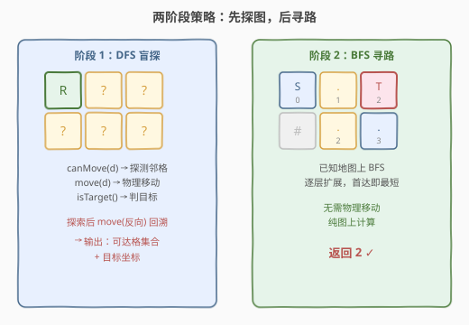
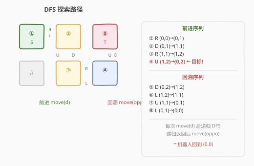
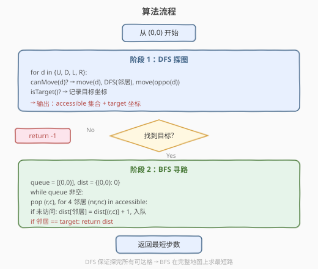
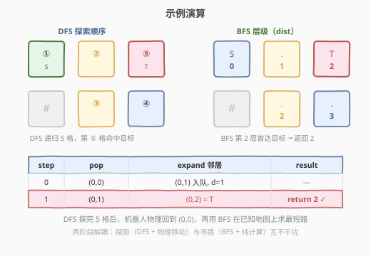

# 未知网格中的最短路径

- **题目名称**：未知网格中的最短路径
- **链接**：[1778. 未知网格中的最短路径](https://leetcode.cn/problems/shortest-path-in-a-hidden-grid/)
- **难度**：中等
- **标签**：深度优先搜索、广度优先搜索、交互

## 1. 题目概述

这是一道**交互题**。在一个未知的网格中，机器人从 $(0, 0)$ 出发，目标是到达网格中的**目标格**。你无法直接看到网格——只能通过 `GridMaster` 接口与机器人交互来逐步探索。

**GridMaster 接口**：

| 方法 | 说明 |
|------|------|
| `canMove(direction)` | 返回该方向上的相邻格子**是否可通行**（空地 `'.'` 或目标 `'!'` 返回 `True`；墙壁 `'#'` 或越界返回 `False`）。**不移动机器人** |
| `move(direction)` | 将机器人向该方向**实际移动一格**。保证该方向 `canMove` 为 `True` |
| `isTarget()` | 返回机器人**当前所在格**是否为目标格 `'!'` |

`direction` 取值为 `'U'`（上）、`'D'`（下）、`'L'`（左）、`'R'`（右），对应行列增量 $(-1,0), (1,0), (0,-1), (0,1)$。

**目标**：返回从 $(0, 0)$ 到目标格的**最短路径步数**；若目标格不可达，返回 $-1$。

**网格类型**：

- `'.'`：空地，机器人可通行
- `'#'`：墙壁，机器人不可通行
- `'!'`：目标格，机器人可通行（`canMove` 对其返回 `True`）

**约束条件**：

- $1 \le m, n \le 500$（网格行列数，但对解题者不可见）
- 网格中至多一个目标格 `'!'`
- 起始格 $(0, 0)$ 始终是空地 `'.'`，不是目标格
- `canMove`、`move`、`isTarget` 的调用总次数有上限

**示例**（隐藏网格，解题者不可见）：

```text
网格：
. . !       ← (0,0)=起点  (0,1)=空地  (0,2)=目标
# . .       ← (1,0)=墙    (1,1)=空地  (1,2)=空地

输出：2
解释：从 (0,0) 向右到 (0,1)，再向右到 (0,2)=目标，最短 2 步。
```

> 💡 **关键特征**：网格对解题者**完全不可见**——唯一的信息来源是 `canMove`/`move`/`isTarget` 三个接口。这与 [1730. 获取食物的最短路径](../1701-1800/1730_获取食物的最短路径.md) 形成鲜明对照：1730 的网格直接给定，可以立即 BFS；本题必须先**物理探索**才能获得地图信息。

---

## 2. 解题思路

### 2.1 暴力思路：直接在未知网格上 BFS

最直觉的做法是模仿 [1730](../1701-1800/1730_获取食物的最短路径.md) 的单源 BFS——从 $(0,0)$ 出发逐层扩展。但在未知网格中，BFS 面临一个根本困难：

```text
BFS 出队 (r,c) 后，需要检查 4 个邻居是否可通行。
但 canMove 只能在「机器人当前位于 (r,c)」时检测 (r,c) 的邻居。
当 BFS 出队第二个节点 (r',c') 时，机器人还在 (r,c)！
```

问题在于 **BFS 的出队顺序与机器人物理位置脱节**。BFS 队列中的节点是「逻辑上已发现但物理上未到达」的——要检查某个节点的邻居，必须先把机器人移过去。但 BFS 不保证队首节点与机器人当前位置相邻，移动过去本身又需要一条路径（而且这条路径可能很长）。

> ⚠️ **症结**：BFS 要求「随机访问」任意节点来扩展其邻居，但机器人只能**从当前位置出发逐步移动**。BFS 的 FIFO 顺序与机器人的物理移动约束**根本不兼容**——你不能把机器人「瞬移」到队首节点。

### 2.2 核心观察：两阶段——DFS 探图 + BFS 寻路



破解之道是**将探索与寻路解耦**为两个独立阶段：

**阶段 1：DFS 盲探（物理移动）**

DFS 的核心优势在于**自然回溯**——递归调用 `dfs(邻居)` 结束后，只需 `move(反向)` 即可回到当前格。这保证了：

1. **探索完所有可达格**：DFS 从 $(0,0)$ 出发，对每个方向调用 `canMove` 检测，若可通行则 `move` 过去递归探索，探索完 `move(反向)` 回来。
2. **机器人回到起点**：所有递归返回后，机器人恰好回到 $(0,0)$——每一步 `move(d)` 都有对应的 `move(oppo(d))`。
3. **记录地图**：用一个 `accessible` 集合记录所有可达格子坐标，用 `isTarget()` 标记目标位置。



> 💡 **为何 DFS 而非 BFS 做探索？** DFS 的递归结构天然编码了「前进→探索→后退」的回溯模式——每次递归返回时机器人自动回到上一层位置。BFS 没有这种自回溯特性：出队一个节点后，机器人需要额外找路径走过去，走完还得找路径走回来，代价极高。DFS 的「深入一条路到底，再逐层退回」恰好与机器人物理移动的约束完美匹配。

**阶段 2：BFS 寻路（纯计算）**

有了 `accessible` 集合和目标坐标后，网格地图就完全已知了。此时直接在**已知地图**上跑标准 BFS：从 $(0,0)$ 出发，逐层扩展 `accessible` 中的邻居，首次到达目标格时的层数即为最短步数。

这一阶段**不需要任何 `move` 调用**——纯内存计算，与 [1730](../1701-1800/1730_获取食物的最短路径.md) 的网格 BFS 完全一致。

> 💡 **两阶段解耦的本质**：阶段 1 解决「信息收集」（网格长什么样），阶段 2 解决「路径优化」（最短路径多长）。两个子问题的难度结构不同——探索需要适应物理移动约束（DFS 适配），寻路需要全局最优（BFS 适配）。把它们拆开后，各自用最合适的算法，互不干扰。

### 2.3 算法流程图



**阶段 1 详细流程**：

1. 初始化 `accessible = {(0,0)}`，`target = None`。
2. 调用 `dfs(0, 0)`：
   - 若 `isTarget()` 为 `True`，记录 `target = (r, c)`。
   - 对每个方向 $d \in \{U, D, L, R\}$：
     - 计算邻居 $(n_r, n_c)$。
     - 若 $(n_r, n_c) \notin \text{accessible}$ 且 `canMove(d)` 为 `True`：
       - 将 $(n_r, n_c)$ 加入 `accessible`。
       - `move(d)` → 机器人移到邻居。
       - 递归 `dfs(n_r, n_c)`。
       - `move(oppo[d])` → 机器人回退到当前格。
3. DFS 结束后，机器人回到 $(0,0)$，`accessible` 包含所有可达格。

**阶段 2 详细流程**：

4. 若 `target is None`，返回 $-1$。
5. BFS：`queue = [(0,0)]`，`dist = {(0,0): 0}`。
6. 出队 $(r, c)$，若 $(r, c) == \text{target}$，返回 `dist[(r,c)]`。
7. 对 4 方向邻居 $(n_r, n_c)$：若在 `accessible` 且未访问，`dist[邻居] = dist[(r,c)] + 1`，入队。
8. 队列空仍未到达 → 返回 $-1$。

### 2.4 示例演算

以隐藏网格 $\begin{bmatrix} . & . & ! \\ \# & . & . \end{bmatrix}$ 为例，起点 $(0,0)$，目标 $(0,2)$。



**阶段 1：DFS 探索**

| 步骤 | 动作 | 机器人位置 | 说明 |
|------|------|-----------|------|
| ① | `canMove('R')` → True | $(0,0)$ | 检测到右侧可达 |
| | `move('R')` | $(0,1)$ | 物理移动 |
| ② | `canMove('D')` → True | $(0,1)$ | 检测到下方可达 |
| | `move('D')` | $(1,1)$ | 物理移动 |
| ③ | `canMove('R')` → True | $(1,1)$ | 检测到右侧可达 |
| | `move('R')` | $(1,2)$ | 物理移动 |
| ④ | `canMove('U')` → True | $(1,2)$ | 检测到上方可达 |
| | `move('U')` | $(0,2)$ | 物理移动 |
| ⑤ | `isTarget()` → **True** | $(0,2)$ | **目标发现！** 记录 `target = (0,2)` |
| | `move('D')` | $(1,2)$ | 回溯 |
| | `move('L')` | $(1,1)$ | 回溯 |
| | `move('U')` | $(0,1)$ | 回溯 |
| | `move('L')` | $(0,0)$ | 回溯到起点 ✓ |

DFS 结束后：`accessible = {(0,0), (0,1), (1,1), (1,2), (0,2)}`，`target = (0,2)`，机器人回到 $(0,0)$。

> ⚠️ **注意**：`canMove('D')` 从 $(0,0)$ 返回 `False`（$(1,0)$ 是墙），因此 $(1,0)$ 不在 `accessible` 中。BFS 阶段也不会尝试访问它。

**阶段 2：BFS 寻路**

| step | pop | expand 邻居 | result |
|------|-----|------------|--------|
| 0 | $(0,0)$ | $(0,1)$ 入队，$d=1$ | — |
| 1 | $(0,1)$ | $(0,2) = \text{T}$ | **return 2 ✓** |

BFS 第 2 层首达目标 $(0,2)$，返回步数 $2$。

---

## 3. 参考代码

### C++

```cpp
class Solution {
public:
    int findShortestPath(GridMaster &master) {
        unordered_set<int> accessible;
        accessible.insert(encode(0, 0));
        int targetKey = -1;

        const char dChar[4] = {'U', 'D', 'L', 'R'};
        const int  dRow[4]  = {-1, 1, 0, 0};
        const int  dCol[4]  = {0, 0, -1, 1};
        const char oppo[4]  = {'D', 'U', 'R', 'L'};

        function<void(int, int)> dfs = [&](int r, int c) {
            if (master.isTarget()) targetKey = encode(r, c);
            for (int i = 0; i < 4; ++i) {
                int nr = r + dRow[i], nc = c + dCol[i];
                int key = encode(nr, nc);
                if (accessible.find(key) == accessible.end()) {
                    if (master.canMove(dChar[i])) {
                        accessible.insert(key);
                        master.move(dChar[i]);
                        dfs(nr, nc);
                        master.move(oppo[i]);
                    }
                }
            }
        };

        dfs(0, 0);
        if (targetKey == -1) return -1;

        queue<pair<int,int>> q;
        q.push({0, 0});
        unordered_map<int,int> dist;
        dist[encode(0, 0)] = 0;

        while (!q.empty()) {
            auto [r, c] = q.front(); q.pop();
            int key = encode(r, c);
            if (key == targetKey) return dist[key];
            for (int i = 0; i < 4; ++i) {
                int nr = r + dRow[i], nc = c + dCol[i];
                int nkey = encode(nr, nc);
                if (accessible.count(nkey) && !dist.count(nkey)) {
                    dist[nkey] = dist[key] + 1;
                    q.push({nr, nc});
                }
            }
        }
        return -1;
    }

private:
    int encode(int r, int c) const {
        return (r + 501) * 1003 + (c + 501);
    }
};
```

### Python

```python
class Solution:
    def findShortestPath(self, master: 'GridMaster') -> int:
        dirs = {'U': (-1, 0), 'D': (1, 0), 'L': (0, -1), 'R': (0, 1)}
        oppo = {'U': 'D', 'D': 'U', 'L': 'R', 'R': 'L'}

        accessible = {(0, 0)}
        target_pos = None

        def dfs(r: int, c: int) -> None:
            nonlocal target_pos
            if master.isTarget():
                target_pos = (r, c)
            for d in ('U', 'D', 'L', 'R'):
                nr, nc = r + dirs[d][0], c + dirs[d][1]
                if (nr, nc) not in accessible:
                    if master.canMove(d):
                        accessible.add((nr, nc))
                        master.move(d)
                        dfs(nr, nc)
                        master.move(oppo[d])

        dfs(0, 0)

        if target_pos is None:
            return -1

        from collections import deque
        q = deque([(0, 0)])
        dist = {(0, 0): 0}
        while q:
            r, c = q.popleft()
            if (r, c) == target_pos:
                return dist[(r, c)]
            for dr, dc in ((-1, 0), (1, 0), (0, -1), (0, 1)):
                nr, nc = r + dr, c + dc
                if (nr, nc) in accessible and (nr, nc) not in dist:
                    dist[(nr, nc)] = dist[(r, c)] + 1
                    q.append((nr, nc))
        return -1
```

> 💡 **坐标编码**：C++ 中用 `encode(r, c) = (r + 501) * 1003 + (c + 501)` 将二维坐标压缩为单个 `int`，便于 `unordered_set` / `unordered_map` 存储。偏移 501 保证负坐标（机器人向左/上走时出现负数）映射到正整数域。Python 直接用 `(r, c)` 元组作哈希键，无需手动编码。
>
> ⚠️ **回溯的对称性**：`move(d)` 之后必须 `move(oppo[d])`——方向相反、顺序相反。`oppo` 映射为 `U↔D, L↔R`，保证每对 `move` 操作**互相抵消**，机器人最终回到 $(0,0)$。漏掉回溯的 `move` 会导致机器人位置与代码逻辑位置不一致，后续所有 `canMove` / `isTarget` 调用全部错位。
>
> 💡 **`canMove` 不移动**：`canMove` 只检测不移动，因此调用它不需要配对回溯。只有 `move` 才改变机器人位置，需要配对 `move(oppo)`。

---

## 4. 复杂度分析

| 维度 | 复杂度 | 说明 |
|------|--------|------|
| 时间 | $O(m \times n)$ | DFS 访问每个可达格一次，每格检测 4 方向 → $O(mn)$；BFS 同样访问每个可达格一次 → $O(mn)$；总计 $O(mn)$ |
| 空间 | $O(m \times n)$ | `accessible` 集合存储所有可达格坐标 $O(mn)$；DFS 递归栈最坏 $O(mn)$（蛇形网格）；BFS 队列 + `dist` 表 $O(mn)$ |
| 接口调用 | $O(m \times n)$ | `canMove` 调用 $\le 4mn$ 次（每格 4 方向）；`move` 调用 $\le 2mn$ 次（前进 + 回溯各一次）；`isTarget` 调用 $\le mn$ 次 |

> 💡 **接口调用次数**是交互题的关键约束。本题 DFS 的 `canMove` 调用次数为 $4 \times |\text{accessible}|$（每格 4 方向），`move` 为 $2 \times |\text{accessible}|$（前进 + 回溯），均为线性，在 $m, n \le 500$ 时约 $10^6$ 级，远在调用上限之内。

---

## 5. 扩展：交互题的通用范式——先探图后计算

### 5.1 「探索 + 计算」两阶段模式

本题代表了一类交互题的通用范式：**环境部分未知，需要通过有限接口收集信息后再求解**。解题模板为：

1. **探索阶段**：用 DFS/BFS 遍历所有可达状态，记录到内存数据结构中。
2. **计算阶段**：在已知数据上跑标准算法（最短路、连通性等）。

两阶段解耦的好处是：探索阶段只需考虑「如何高效收集信息」（适配接口约束），计算阶段只需考虑「如何最优求解」（适配问题目标），各司其职。

### 5.2 为何 DFS 适合探索阶段

DFS 的递归结构天然实现了**回溯**：每层递归结束时，执行 `move(反向)` 即可回到上一层位置。这保证了：

- 探索完所有可达状态后，机器人自动回到起点。
- 每条边（`move` 操作）恰好走两次（前进 + 回溯），接口调用次数线性。

BFS 做探索则需额外维护「从当前物理位置到队首节点的路径」，复杂度大幅增加。

### 5.3 与 1730 的对比

| 维度 | 1730 获取食物的最短路径 | 1778 未知网格中的最短路径 |
|------|----------------------|--------------------------|
| 网格可见性 | **完全可见**（直接给定 `grid`） | **完全不可见**（仅接口探测） |
| 探索阶段 | 不需要 | **必须**（DFS + `canMove`/`move`） |
| 寻路阶段 | 单源 BFS | 单源 BFS（完全一致） |
| 复杂度瓶颈 | BFS 的 $O(mn)$ | DFS 探索 + BFS 寻路 = $O(mn)$ |

两者寻路阶段完全相同——差异仅在探索阶段。1778 多出的 DFS 探索正是「信息收集」的代价。

---

## 6. 面试要点

**Q1：为什么不能直接在未知网格上 BFS？**
> BFS 出队一个节点后需要检查其 4 个邻居，但 `canMove` 只能在机器人位于该节点时调用。BFS 队列中排在前面的节点与机器人当前位置通常不相邻，要把机器人移过去需要额外路径——而且这条路径本身也是未知的。BFS 的随机访问特性与机器人的顺序移动约束根本不兼容。

**Q2：为什么用 DFS 做探索而不是 BFS？**
> DFS 的递归结构天然编码了回溯：`move(d)` 进入邻居，递归探索完 `move(oppo[d))` 退回。每对 `move` 互相抵消，探索完所有可达格后机器人自动回到起点。BFS 没有这种自回溯特性——出队节点后要额外规划「如何从当前位置走到队首」，代价极高。

**Q3：回溯时为什么是 `move(oppo[d])` 而不是 `move(d)`？**
> `move(d)` 把机器人从当前格移到了邻居格。要回到原格，必须走**反方向** `oppo[d]`。`oppo` 映射为 `U↔D, L↔R`——上和下互反，左和右互反。用 `move(d)` 回溯会继续往同一方向走，越走越远。

**Q4：如果目标格不可达怎么办？**
> DFS 只能探索从 $(0,0)$ 出发**可达**的格子。若目标格被墙壁完全包围，DFS 无法到达它，`isTarget()` 永远不会在其位置被调用，`target_pos` 保持 `None`。阶段 2 检查 `target_pos is None` 时直接返回 $-1$。

**Q5：`canMove` 和 `move` 的调用次数分别是多少？**
> 每个可达格检查 4 个方向，`canMove` 调用 $\le 4 \times |\text{accessible}|$ 次。每个可达格至多被 `move` 进入一次（首次探索时）和退出一次（回溯时），`move` 调用 $\le 2 \times |\text{accessible}|$ 次。两者均为线性，$m, n \le 500$ 时约 $10^6$ 级。

> 💡 **一句话总结**：未知网格最短路径 = DFS 盲探（`canMove` 检测 + `move` 前进 + `move(反向)` 回溯，记录可达格与目标）+ BFS 寻路（已知地图上标准单源 BFS），$O(mn)$ 时间与空间。

---

## 7. 同类练习题

- [1730. 获取食物的最短路径](https://leetcode.cn/problems/shortest-path-to-get-food/)（[题解](../1701-1800/1730_获取食物的最短路径.md)）：**最同构的姊妹题**——同为网格 BFS 求最短路径，但网格直接给定无需探索。对照体会「已知地图直接 BFS」与「未知地图先 DFS 探图再 BFS」的差异
- [994. 腐烂的橘子](https://leetcode.cn/problems/rotting-oranges/)（[题解](../0901-1000/994_腐烂的橘子.md)）：多源 BFS 求最短感染时间，与本题 BFS 阶段共享「逐层扩展 + 入队即标记」的核心骨架
- [1091. 二进制矩阵中的最短路径](https://leetcode.cn/problems/shortest-path-in-binary-matrix/)：8 方向网格 BFS 求左上到右下最短路径，同为无权图最短路但方向扩展到 8 邻居，对照理解方向数组的通用性
- [200. 岛屿数量](https://leetcode.cn/problems/number-of-islands/)（[题解](../0101-0200/200_岛屿数量.md)）：网格 DFS/BFS 连通分量计数，与本题 DFS 阶段共享「四方向扩展 + 标记已访问」的探索骨架，但目标从「最短路径」换成「连通块计数」
