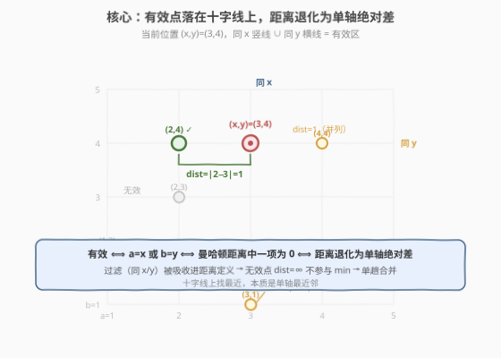
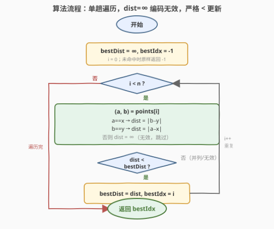

# 找到最近的有相同 X 或 Y 坐标的点

- **题目名称**：找到最近的有相同 X 或 Y 坐标的点
- **链接**：[1779. 找到最近的有相同 X 或 Y 坐标的点](https://leetcode.cn/problems/find-nearest-point-that-has-the-same-x-or-y-coordinate/)
- **难度**：简单
- **标签**：数组、一次遍历、曼哈顿距离

## 1. 题目概述

给定当前位置 $(x, y)$ 与一组点 `points`，其中 `points[i] = [a_i, b_i]`。一个点是**有效点**当且仅当它与当前位置**共享 x 坐标或 y 坐标**（即 $a_i = x$ 或 $b_i = y$）。在所有有效点中，找出**曼哈顿距离最小**的那个，返回其**下标**（0-indexed）；若并列则返回**下标最小**的；若无有效点返回 $-1$。

曼哈顿距离定义为 $|a_i - x| + |b_i - y|$。

**示例 1**：

```text
输入：x = 3, y = 4, points = [[1,2],[3,1],[2,4],[2,3],[4,4]]
输出：2
解释：有效点为 [3,1]（同 x）、[2,4]（同 y）、[4,4]（同 y）。
      距离分别为 3、1、1，最小距离 1 对应下标 2 和 4，取较小下标 2。
```

**示例 2**：

```text
输入：x = 3, y = 4, points = [[3,4]]
输出：0
解释：[3,4] 同 x 且同 y，距离 0，本身就是当前位置。
```

**示例 3**：

```text
输入：x = 3, y = 4, points = [[2,3]]
输出：-1
解释：[2,3] 既不同 x 也不同 y，无有效点。
```

**约束条件**：

- $1 \le \text{points.length} \le 10^4$
- $\text{points}[i].\text{length} = 2$
- $1 \le x, y, a_i, b_i \le 10^4$

> 💡 **关键结构**：有效性条件「$a_i = x$ 或 $b_i = y$」恰好让曼哈顿距离的两项之一归零。即有效点必落在以 $(x, y)$ 为中心的**十字线**（过 $(x,y)$ 的水平线 ∪ 竖直线）上，此时距离退化为**单轴绝对差**。这是把「过滤」与「度量」合并的信号。

---

## 2. 解题思路

### 2.1 暴力思路：先过滤再求最小（两趟）

最直觉的做法分两趟：第一趟遍历所有点，把满足 $a_i = x$ 或 $b_i = y$ 的点连同下标收集到一个新列表；第二趟在该列表里找曼哈顿距离最小（并列取小下标）的点。

```text
valid = []
for i, (a, b) in enumerate(points):
    if a == x or b == y:                   # 第一趟：过滤
        valid.append((i, a, b))
if not valid: return -1
bestIdx, bestDist = -1, +∞
for i, a, b in valid:                      # 第二趟：求最小
    d = abs(a - x) + abs(b - y)
    if d < bestDist:
        bestDist, bestIdx = d, i
return bestIdx
```

时间 $O(n)$、空间 $O(n)$（需存过滤后的列表）。$n \le 10^4$ 时毫无压力，但**存下中间列表是多余的**——我们只要最终下标，根本用不到被过滤出的整批点。

> ⚠️ **症结**：暴力把「过滤」和「归约」当成两件独立的事，先物化过滤结果再扫一遍。但有效点的判定与距离计算**共享同一条信息**（$a=x$ 或 $b=y$ 让一项归零），二者本可在同一次访问中一并完成。把「可单趟合并」的操作拆成两趟 + 中间存储，是空间与常数双双浪费的根源。

### 2.2 核心观察：有效性即距离的一项归零，过滤与归约一趟合并



关键洞察在于**有效性与距离的同构**：点 $(a, b)$ 有效 $\Leftrightarrow$ 它落在以 $(x, y)$ 为中心的十字线（$a = x$ 的竖线 ∪ $b = y$ 的横线）上 $\Leftrightarrow$ 曼哈顿距离 $|a - x| + |b - y|$ 中**至少一项为 0**。于是距离可按有效性直接化简：

$$
\text{dist}(a, b) =
\begin{cases}
|b - y|, & a = x \text{（同 x，横轴项归零）} \\[4pt]
|a - x|, & b = y \text{（同 y，纵轴项归零）} \\[4pt]
\infty, & \text{否则（无效点，不参与比较）}
\end{cases}
$$

把无效点的距离视作 $+\infty$，它就**天然不参与最小值比较**——过滤被吸收进距离定义。于是单趟遍历即可：访问每个点时一次性完成「判定有效性 + 计算距离 + 更新最优」，无需中间存储。

**并列下标最小**的处理靠**遍历顺序 + 严格小于**：按下标从小到大访问，仅当 $\text{dist} < \text{bestDist}$（严格 `<`）才更新。这样相同距离的后续点不会覆盖先到的较小下标，并列规则被遍历顺序自动满足，无需显式比较下标。

> 💡 **无效即 $\infty$ 的编码技巧**：把「不满足谓词」映射为 $+\infty$ 距离，是「过滤 + 归约」合并的通用范式——只要归约运算是 $\min$（对 $+\infty$ 单调，$\infty$ 永不当选），任何「先过滤再取最小」都可塌缩成单趟。本题把 `if invalid: skip` 退化为 `dist = ∞` 后并入同一比较，正是此范式的体现。
>
> 💡 **与 53 最大子数组的对照**：53 题「子数组」约束也可看作一种过滤（只允许连续段），但那里约束作用于**下标组合**而非单点属性，无法逐点判定为 $\infty$，需 DP 维护。本题约束是**逐点**的（每点独立判定同 x 或同 y），故能逐点编码进距离。过滤能否逐点独立判定，决定了能否塌缩成单趟。

### 2.3 算法流程图



1. **初始化**：`bestDist = +∞`，`bestIdx = -1`（无有效点时的兜底返回值）。
2. **遍历**：对每个下标 $i$ 及点 $(a, b)$：
   - 若 $a = x$：$\text{dist} = |b - y|$；
   - 否则若 $b = y$：$\text{dist} = |a - x|$；
   - 否则：跳过（无效点）。
   - 若 $\text{dist} < \text{bestDist}$：`bestDist = dist`，`bestIdx = i`。
3. **终止**：返回 `bestIdx`（未更新则为 $-1$）。

每轮 $O(1)$，共 $n$ 轮。

### 2.4 示例演算

以示例 1 `x = 3, y = 4`，`points = [[1,2],[3,1],[2,4],[2,3],[4,4]]` 为例：


| 下标 $i$ | 点 $(a,b)$ | 有效性 | 距离 $\text{dist}$ | `bestDist` | `bestIdx` | 说明 |
|----------|-----------|--------|-------------------|------------|-----------|------|
| $0$ | $(1,2)$ | $a\neq x,\ b\neq y$ | $\infty$ | $\infty$ | $-1$ | 无效，跳过 |
| $1$ | $(3,1)$ | $a = x$ ✓ | $|1-4| = 3$ | $3$ | $1$ | 首个有效，更新 |
| $2$ | $(2,4)$ | $b = y$ ✓ | $|2-3| = 1$ | $\mathbf{1}$ | $\mathbf{2}$ | 更近，更新 |
| $3$ | $(2,3)$ | $a\neq x,\ b\neq y$ | $\infty$ | $1$ | $2$ | 无效，跳过 |
| $4$ | $(4,4)$ | $b = y$ ✓ | $|4-3| = 1$ | $1$ | $2$ | 距离并列，`1 < 1` 为假，**不更新** |

最终 `bestIdx = 2` ✓。

> 💡 **下标 4 的关键作用**：它距离同为 $1$，但因严格 `<` 判定不覆盖下标 $2$——这正是「并列取小下标」由遍历顺序自动实现的体现。若误用 `<=`，下标 $4$ 会错误覆盖下标 $2$，返回 $4$。**最小化归约中用 `<` 还是 `<=`，取决于是否需要保留首个（最小下标）**：保留首选用 `<`，保留末选用 `<=`。

---

## 3. 参考代码

### C++

```cpp
class Solution {
public:
    int nearestValidPoint(int x, int y, vector<vector<int>>& points) {
        int bestDist = INT_MAX, bestIdx = -1;
        for (int i = 0; i < (int)points.size(); ++i) {
            int a = points[i][0], b = points[i][1];
            int dist;
            if (a == x) {
                dist = abs(b - y);
            } else if (b == y) {
                dist = abs(a - x);
            } else {
                continue;
            }
            if (dist < bestDist) {
                bestDist = dist;
                bestIdx = i;
            }
        }
        return bestIdx;
    }
};
```

### Python

```python
class Solution:
    def nearestValidPoint(self, x: int, y: int, points: List[List[int]]) -> int:
        best_dist, best_idx = float("inf"), -1
        for i, (a, b) in enumerate(points):
            if a == x:
                dist = abs(b - y)
            elif b == y:
                dist = abs(a - x)
            else:
                continue
            if dist < best_dist:
                best_dist, best_idx = dist, i
        return best_idx
```

> 💡 **写法对照**：两版逻辑完全一致——`a == x` / `b == y` 两分支各自只算**单轴绝对差**（另一轴已归零，无需再算），无效点 `continue` 直接跳过（等价于 $\infty$ 不参与比较）。`bestDist` 初始化为 `INT_MAX` / `float("inf")`，`bestIdx` 初始化为 $-1$，无有效点时原样返回 $-1$。
>
> ⚠️ **别对每个点都算 $|a-x|+|b-y|$ 再判有效性**：那样有效点会多算一个恒为 0 的项（无害但冗余），无效点则白算两项再丢弃。按有效性分支只算需要的那一项，既省运算又把过滤融进距离——正是 2.2 的洞察落到代码。
>
> ⚠️ **`dist < bestDist` 必须严格 `<`**：用 `<=` 会让同距离的更大下标覆盖更小下标，违反并列规则。最小化归约保留首个候选一律用严格 `<`。

---

## 4. 复杂度分析

| 维度 | 复杂度 | 说明 |
|------|--------|------|
| 时间复杂度 | $O(n)$ | 单趟遍历 `points`，每轮常数次比较与至多一次 `abs`，均为 $O(1)$ |
| 空间复杂度 | $O(1)$ | 仅 `bestDist`、`bestIdx` 两个标量，不依赖输入规模 |

> 💡 对比暴力两趟法的 $O(n)$ 时间 / $O(n)$ 空间：时间不变，空间从 $O(n)$ 降到 $O(1)$——把「先物化过滤结果再扫」改为「过滤与归约同趟合并」是唯一改动。$n = 10^4$ 时两趟也完全可过，但单趟写法更体现「有效性即距离一项归零」的结构洞察，常数更小。

---

## 5. 扩展：过滤 + 最小归约的合并判据

「先过滤再取最小」能否塌缩成单趟，取决于**过滤谓词是否可逐点独立判定**：

| 谓词类型 | 能否逐点判定 | 合并方式 | 典型 |
|----------|-------------|----------|------|
| **逐点属性** | ✅ 能 | 无效映射为 $\infty$，并入 $\min$ | **本题 1779**：每点独立判 $a=x$ 或 $b=y$ |
| **逐点属性** | ✅ 能 | 同上 | [739. 每日温度](https://leetcode.cn/problems/daily-temperatures/)：每个位置独立找右侧首个更高温 |
| **下标组合约束** | ❌ 不能 | 需 DP / 滑窗维护 | [53. 最大子数组和](https://leetcode.cn/problems/maximum-subarray/)：「连续」约束作用于下标区间，非逐点 |
| **全局约束** | ❌ 不能 | 需排序 / 预处理 | [56. 合并区间](https://leetcode.cn/problems/merge-intervals/)：合并依赖区间间相对顺序 |

> 💡 **判据一句话**：谓词能写成「$\text{pred}(\text{points}[i])$ 不依赖其它点」就可逐点编码为 $\infty$ 并入 $\min$，过滤与归约合并成单趟；否则约束跨点，需更重的数据结构。本题的 $a=x$ 或 $b=y$ 是最纯粹的逐点谓词，故单趟 $O(1)$ 空间。

---

## 6. 面试要点

**Q1：为什么用严格 `<` 而不是 `<=` 比较距离？**
> 题目要求并列时取**下标最小**。按下标从小到大遍历，仅当严格 `<` 更新，则相同距离的后续点不会覆盖先到的较小下标。用 `<=` 会让大下标覆盖小下标，违反并列规则。最小化归约保留首个候选一律用严格 `<`。

**Q2：为什么 `bestIdx` 初始化为 $-1$ 而不是 $0$？**
> $-1$ 同时充当「无有效点」的哨兵返回值。若初始化为 $0$，则当第 $0$ 个点无效时无法区分「答案就是 $0$」与「尚未找到有效点」。$-1$ 表示「未找到任何有效点」，只有真正命中有效点且距离 $< \infty$ 时才被覆盖，天然区分两种情形。

**Q3：为什么按有效性分支只算单轴绝对差，而不是统一算 $|a-x|+|b-y|$？**
> 有效点必有一轴差为 $0$（$a=x$ 时 $|a-x|=0$，$b=y$ 时 $|b-y|=0$），那项 `abs` 是冗余。分支写法既省一次 `abs`，又把「过滤」融进「距离计算」——无效点走 `else` 分支跳过，无需先算距离再丢弃。这是「有效性即距离一项归零」洞察落到代码的体现。

**Q4：如果 $n$ 很大（如 $10^7$），算法还适用吗？**
> 完全适用。时间仍 $O(n)$ 单趟，空间仍 $O(1)$——只两个标量。瓶颈转移到内存带宽，但顺序访问 `points` 是缓存友好的。坐标值 $\le 10^4$，距离 $\le 2\times10^4$，`int` 远不溢出。即便坐标放大到 $10^9$，距离 $\le 2\times10^9$ 仍在 `int`（$2^{31}-1 \approx 2.1\times10^9$）边缘，稳妥可用 `long long`。

**Q5：如果要返回**所有**最小距离点的下标，怎么改？**
> 第一趟求出 `bestDist`，第二趟收集所有距离等于 `bestDist` 的有效点下标。仍 $O(n)$，但空间 $O(k)$（$k$ 为并列点数，不计输出则 $O(1)$ 两趟）。或单趟维护一个动态数组：发现更小距离时清空重收，相等时追加——单趟 $O(n)$ 时间 / $O(k)$ 输出空间。这是「argmin 配套 min」的标准扩展。

---

## 7. 同类练习题

- [973. 最接近原点的 K 个点](https://leetcode.cn/problems/k-closest-points-to-origin/)：同为「点集 + 曼哈顿/欧氏距离 + 选最值」，但求 Top-K 而非单点最优，需堆或排序，是本题「最小归约」升级为「部分排序」的进阶
- [53. 最大子数组和](https://leetcode.cn/problems/maximum-subarray/)（[题解](../0001-0100/53_最大子数组和.md)）：对照「过滤能否逐点判定」——53 的连续性约束跨下标无法逐点编码为 $\infty$，需 DP；本题同 x/y 纯逐点，可单趟合并
- [739. 每日温度](https://leetcode.cn/problems/daily-temperatures/)：逐点找右侧首个更高温，谓词逐点但需向后扫描，用单调栈把「过滤 + 最近」塌缩成 $O(n)$，与本题「逐点谓词 + 单趟归约」思路同源
- [56. 合并区间](https://leetcode.cn/problems/merge-intervals/)（[题解](../0001-0100/56_合并区间.md)）：区间合并依赖区间间相对顺序（跨点全局约束），无法逐点编码，需排序预处理，与本题形成「谓词能否逐点」的反例对照
