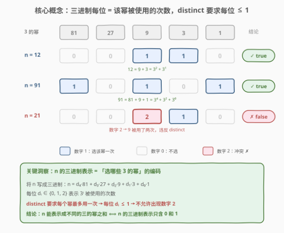
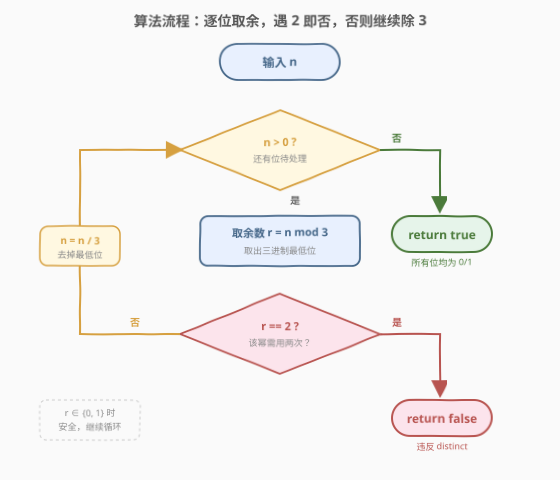
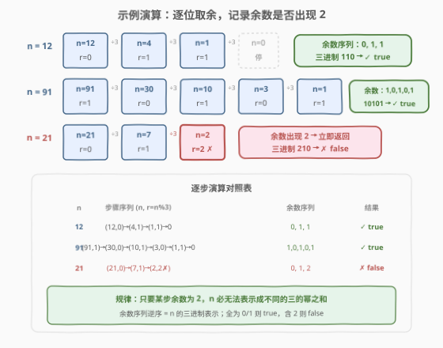

# 判断一个数字是否可以表示成三的幂的和

- **题目名称**：判断一个数字是否可以表示成三的幂的和
- **链接**：[1780. 判断一个数字是否可以表示成三的幂的和](https://leetcode.cn/problems/check-if-number-is-a-sum-of-powers-of-three/)
- **难度**：中等
- **标签**：数学

## 1. 题目概述

给你一个整数 $n$，如果可以将 $n$ 表示成**若干个不同的三的幂之和**，返回 `true`，否则返回 `false`。

对于整数 $y$，如果存在整数 $x$ 满足 $y = 3^x$，则称 $y$ 是三的幂。可用的三的幂为 $1, 3, 9, 27, 81, 729, \dots$（即 $3^0, 3^1, 3^2, 3^3, 3^4, \dots$），每个幂**最多使用一次**。

**示例 1**：

```text
输入：n = 12
输出：true
解释：12 = 3¹ + 3² = 3 + 9
```

**示例 2**：

```text
输入：n = 91
输出：true
解释：91 = 3⁰ + 3² + 3⁴ = 1 + 9 + 81
```

**示例 3**：

```text
输入：n = 21
输出：false
解释：21 无法表示成不同的三的幂之和。
      21 = 9 + 9 + 3 = 3 + 9×2，但 9 用了两次，不满足 distinct。
```

**约束条件**：

- $1 \le n \le 10^7$

> 💡 **关键观察**：问题本质是「从 $3^0, 3^1, 3^2, \dots$ 中选一个子集求和等于 $n$，每个元素最多选一次」。这恰好是**三进制表示**的编码问题——三进制的每一位天然告诉你「该幂用了几次」，而 distinct 约束等价于「每位只能是 0 或 1」。

---

## 2. 解题思路

### 2.1 暴力思路：枚举子集

最直觉的做法是把不超过 $n$ 的所有三的幂列出来（$3^0, 3^1, \dots, 3^{\lfloor \log_3 n \rfloor}$，共约 $\lfloor \log_3 10^7 \rfloor + 1 = 15$ 个），然后枚举每个幂「选 / 不选」的 $2^{15} = 32768$ 种组合，检查是否存在一种组合之和恰好为 $n$。

```text
powers = [1, 3, 9, 27, 81, ...]  # 不超过 n 的所有 3 的幂
for mask in 0 .. 2^len(powers) - 1:
    s = sum(powers[i] for i if mask 的第 i 位为 1)
    if s == n: return true
return false
```

时间复杂度 $O(2^{\log_3 n} \cdot \log_3 n) = O(n \cdot \log n)$，当 $n = 10^7$ 时约 $10^8$ 级，**勉强能过但毫无必要**。这完全忽略了三的幂之间的**进制结构**。

### 2.2 核心观察：三进制表示



将 $n$ 写成**三进制**形式：

$$
n = d_k \cdot 3^k + d_{k-1} \cdot 3^{k-1} + \dots + d_1 \cdot 3^1 + d_0 \cdot 3^0
$$

其中每位 $d_i \in \{0, 1, 2\}$。这个展开的物理含义极其自然：

| 三进制数字 $d_i$ | 含义 | 是否满足 distinct |
|------------------|------|-------------------|
| $0$ | 不选 $3^i$ | ✅ |
| $1$ | 选 $3^i$ 一次 | ✅ |
| $2$ | 选 $3^i$ **两次** | ❌ 违反 |

> 💡 **核心洞察**：三进制表示天然就是「每个 $3^i$ 被使用几次」的编码。distinct 要求每个幂最多用一次，等价于**每位 $d_i \le 1$**，即三进制表示中**不出现数字 2**。

于是问题转化为：**检查 $n$ 的三进制表示是否只含 0 和 1**。

验证三个示例：

- $n = 12$：三进制 $110$（$1 \times 9 + 1 \times 3 + 0 \times 1$）→ 只含 0/1 → `true` ✅
- $n = 91$：三进制 $10101$（$1 \times 81 + 0 \times 27 + 1 \times 9 + 0 \times 3 + 1 \times 1$）→ 只含 0/1 → `true` ✅
- $n = 21$：三进制 $210$（$2 \times 9 + 1 \times 3 + 0 \times 1$）→ 含数字 2 → `false` ✅

### 2.3 算法流程图



**步骤**：

1. **循环取余**：当 $n > 0$ 时，计算 $r = n \bmod 3$（取出三进制最低位）。
2. **检查数字 2**：若 $r == 2$，说明某个 $3^i$ 需要用两次，违反 distinct，立即返回 `false`。
3. **去掉最低位**：$n = n / 3$（整数除法，右移一位三进制），回到步骤 1。
4. **循环结束**：所有位处理完毕均未遇到 2，返回 `true`。

> 💡 **为何不用先求出完整三进制再检查？** 因为一旦某位为 2 就可以立即返回 `false`，无需处理更高位。这种**提前终止**使最好情况（最低位就是 2）只需一次取余。

### 2.4 示例演算

以 $n = 12$、$n = 91$、$n = 21$ 为例，逐步展示取余过程：



**$n = 12$ 的演算**：

| 步骤 | $n$ | $r = n \bmod 3$ | $n / 3$ | 累积余数（低→高） |
|------|-----|-----------------|---------|-------------------|
| 1 | 12 | 0 | 4 | 0 |
| 2 | 4 | 1 | 1 | 10 |
| 3 | 1 | 1 | 0 | 110 |

$n = 0$ 循环结束，余数序列 $0, 1, 1$（逆序即三进制 $110$），无数字 2 → `true`。

**$n = 91$ 的演算**：

| 步骤 | $n$ | $r = n \bmod 3$ | $n / 3$ | 累积余数（低→高） |
|------|-----|-----------------|---------|-------------------|
| 1 | 91 | 1 | 30 | 1 |
| 2 | 30 | 0 | 10 | 01 |
| 3 | 10 | 1 | 3 | 101 |
| 4 | 3 | 0 | 1 | 0101 |
| 5 | 1 | 1 | 0 | 10101 |

$n = 0$ 循环结束，余数序列 $1, 0, 1, 0, 1$（逆序即三进制 $10101$），无数字 2 → `true`。

**$n = 21$ 的演算**：

| 步骤 | $n$ | $r = n \bmod 3$ | $n / 3$ | 说明 |
|------|-----|-----------------|---------|------|
| 1 | 21 | 0 | 7 | 安全 |
| 2 | 7 | 1 | 2 | 安全 |
| 3 | 2 | **2** | — | ❌ 遇到 2，立即返回 `false` |

第三步余数为 2，说明 $3^1 = 9$ 需要用两次，**提前终止**无需继续。

> ⚠️ **注意**：余数序列从低到高记录，逆序后才是三进制表示。例如 $n=12$ 的余数序列 $0,1,1$ 逆序为 $110$，即 $12_{10} = 110_3$。但本题不需要真的构造三进制串——只需检查**是否出现 2**，顺序无关。

---

## 3. 参考代码

### Python

```python
class Solution:
    def checkPowersOfThree(self, n: int) -> bool:
        while n > 0:
            if n % 3 == 2:      # 某位为 2 → 该幂需用两次
                return False
            n //= 3              # 去掉三进制最低位
        return True              # 所有位均为 0/1
```

### C++

```cpp
class Solution {
public:
    bool checkPowersOfThree(int n) {
        while (n > 0) {
            if (n % 3 == 2)      // 某位为 2 → 该幂需用两次
                return false;
            n /= 3;              // 去掉三进制最低位
        }
        return true;             // 所有位均为 0/1
    }
};
```

> 💡 **实现要点**：① `n % 3` 取三进制最低位，`n /= 3` 去掉最低位——与十进制转二进制/任意进制的「除 k 取余法」完全一致。② 遇到余数 2 **立即返回**，无需处理更高位，提前终止。③ 循环条件 `n > 0`：$n$ 最终会变为 0（所有位处理完毕），此时退出循环返回 `true`。④ $n \le 10^7 < 3^{15}$，循环最多 15 次，常数级。

---

## 4. 复杂度分析

| 维度 | 复杂度 | 说明 |
|------|--------|------|
| 时间复杂度 | $O(\log_3 n)$ | 每次循环 $n$ 缩小为 $n/3$，循环次数 = 三进制位数 = $\lfloor \log_3 n \rfloor + 1$；$n \le 10^7$ 时最多 15 次 |
| 空间复杂度 | $O(1)$ | 只用常数个变量 `n` 和余数 `r`，无需存储三进制串 |

> 💡 **与暴力枚举的对比**：暴力枚举 $O(2^{\log_3 n}) = O(n)$，而进制判定 $O(\log n)$，**降了一个数量级维度**。根源在于进制表示已经给出了「最优编码」，无需搜索。

---

## 5. 扩展：平衡三进制与「进位」思想

### 5.1 如果允许「用负号」——平衡三进制

如果题目改为「可以用 $\pm 3^i$ 的组合」（即每个幂可以取 $+1, 0, -1$ 倍），则对应**平衡三进制**（balanced ternary），每位取 $\{-1, 0, 1\}$。此时**任何整数**都能表示，因为数字 2 可以通过进位转化为 $-1$（高位借 1）：$2 \times 3^i = 3^{i+1} - 3^i$。

例如 $n = 21 = 2 \times 9 + 1 \times 3 = 27 - 9 + 3 = 3^3 - 3^2 + 3^1$，在平衡三进制下表示为 $+1, -1, +1, 0$。

> 💡 **本题为何不能进位？** 因为题目只允许**加法**（选或不选），不允许减法。数字 2 无法通过向高位借 1 来消解——借位本质上引入了负系数，而题目禁止负号。这就是 distinct 约束下「数字 2 = 不可表示」的根本原因。

### 5.2 推广到任意基

本题的思路可推广到一般问题：「$n$ 能否表示成不同的 $b$ 的幂之和」$\iff$「$n$ 的 $b$ 进制表示只含 0 和 1」。

| 基 $b$ | 可用幂 | distinct 条件 | 判定方法 |
|--------|--------|---------------|----------|
| $2$ | $1, 2, 4, 8, \dots$ | 每位 $\le 1$ | 二进制天然只含 0/1，**恒为 true** |
| $3$ | $1, 3, 9, 27, \dots$ | 每位 $\le 1$ | 三进制不含 2（**本题**） |
| $b$ | $1, b, b^2, \dots$ | 每位 $\le 1$ | $b$ 进制不含 $2, 3, \dots, b-1$ |

> 💡 当 $b = 2$ 时，二进制每位天然为 0 或 1，所以**任何正整数都能表示成不同的 2 的幂之和**——这正是二进制表示的存在性保证。本题 $b = 3$ 时则不恒成立，因为三进制可能出现 2。

---

## 6. 面试要点

**Q1：为什么三进制表示能解决这个问题？**

> 三进制展开 $n = \sum d_i \cdot 3^i$ 中，$d_i$ 恰好表示 $3^i$ 被使用的次数。题目要求每个幂最多用一次（distinct），等价于 $d_i \le 1$，即三进制表示中不出现数字 2。所以只需检查 $n$ 的三进制各位是否全为 0 或 1。

**Q2：为什么数字 2 就一定不行？不能通过其他幂的组合补偿吗？**

> 三进制表示是**唯一**的——每个整数有且仅有一种三进制展开。如果某位为 2，意味着 $3^i$ 在唯一展开中贡献了 $2 \times 3^i$。由于 $3^i > 3^0 + 3^1 + \dots + 3^{i-1} = \frac{3^i - 1}{2}$（所有更小的幂之和都不够一个 $3^i$），低位无法「凑出」一个 $3^i$ 来替代。所以数字 2 无法通过调整低位选择来消解。

**Q3：不用三进制转换，直接贪心选最大的幂行不行？**

> 可以，且等价。贪心策略：每次选不超过 $n$ 的最大 $3^i$，从 $n$ 中减去，直到 $n = 0$（成功）或找不到合适的幂（失败）。这与三进制判定等价：如果三进制某位为 2，贪心会在该位「选了一次 $3^i$」后剩余仍 $\ge 3^i$，再选一次就违反 distinct，不选又凑不够——陷入死局。三进制判定比贪心更直接，一步取余即可定位问题位。

**Q4：时间复杂度是多少？为什么是 $O(\log n)$ 而非 $O(n)$？**

> 每次循环 $n$ 除以 3，循环次数 = 三进制位数 = $\lfloor \log_3 n \rfloor + 1$。$n \le 10^7 < 3^{15}$，最多 15 次循环，常数级。对比暴力枚举子集 $O(2^{\log_3 n}) = O(n)$，进制判定把指数级降为对数级，关键在于利用了进制表示的唯一性与编码性质。

**Q5：如果题目允许每个幂用最多两次（而非一次），怎么判？**

> 那就是标准三进制表示——每位 $d_i \in \{0, 1, 2\}$ 都合法，**任何 $n$ 都能表示**（三进制表示的存在性保证），恒返回 `true`。约束变为「最多 $k$ 次」时，判定条件变为「三进制每位 $\le k$」。

> 💡 **一句话总结**：$n$ 能表示成不同的三的幂之和 $\iff$ $n$ 的三进制表示只含 0 和 1 $\iff$ 逐位取余 $n \bmod 3$ 不出现 2。$O(\log_3 n)$ 时间，$O(1)$ 空间。

---

## 7. 同类练习题

- [326. 3 的幂](https://leetcode.cn/problems/power-of-three/)：判断 $n$ 是否恰好是单个 $3$ 的幂，与本题「多个不同的 $3$ 的幂之和」对照，体会「单个幂」与「幂的子集和」的关系
- [231. 2 的幂](https://leetcode.cn/problems/power-of-two/)（[题解](../0201-0300/231_2的幂.md)）：$n \mathbin{\&} (n-1) == 0$ 判单 1，与本题三进制不含 2 同为「进制表示判定幂」的范式
- [191. 位 1 的个数](https://leetcode.cn/problems/number-of-1-bits/)（[题解](../0101-0200/191_位1的个数.md)）：$n \mathbin{\&} (n-1)$ 消最低位 1，与本题 $n / 3$ 去掉三进制最低位同为「逐位处理」的进制操作
- [168. Excel 表列名称](https://leetcode.cn/problems/excel-sheet-column-title/)（[题解](../0101-0200/168_Excel表列名称.md)）：1-indexed 进制转换，与本题「除 3 取余」同为进制转换的数学型题，对照十进制转任意进制的通用模板
- [50. Pow(x, n)](https://leetcode.cn/problems/powx-n/)：快速幂计算 $3^k$，与本题枚举 $3$ 的幂对照，可作「生成 $3$ 的幂列表」的工具题
