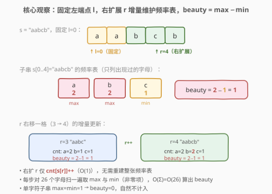
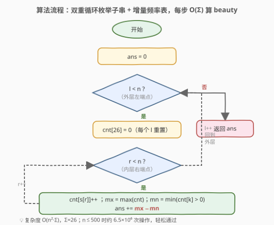
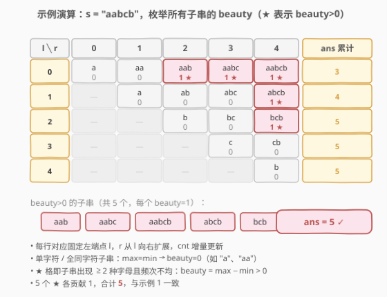

# LeetCode 所有子字符串美丽值之和 题解

## 1. 题目概述

- **标题 / 题号**：所有子字符串美丽值之和（#1781，medium）
- **链接**：https://leetcode.cn/problems/sum-of-beauty-of-all-substrings/
- **难度**：中等
- **标签**：字符串、哈希表、枚举、频率统计

**题意**：一个字符串的**美丽值**定义为：其中**出现频率最高字符**与**出现频率最低字符**的出现次数之差。

> 比方说，`"abaacc"` 的美丽值为 $3 - 1 = 2$（`a` 出现 3 次、`c` 出现 2 次、`b` 出现 1 次，最高 3、最低 1）。

给定字符串 `s`，返回它**所有子字符串**的美丽值之和。

**示例 1**：

```text
输入：s = "aabcb"
输出：5
解释：美丽值不为零的子串包括 ["aab","aabc","aabcb","abcb","bcb"]，每个美丽值都为 1，合计 5。
```

**示例 2**：

```text
输入：s = "aabcbaa"
输出：17
```

**约束**：

- $1 \le s.length \le 500$
- `s` 只包含小写英文字母

> 💡 **关键直觉**：$n \le 500$ 这一宽松上界暗示 $O(n^2)$ 量级的做法即可通过。难点不在算法本身的奇巧，而在于如何**避免对每个子串从头统计频率**——若能固定左端点、右扩时**增量维护频率表**，则每个子串的美丽值可在 $O(\Sigma) = O(26)$ 内算出，总复杂度 $O(n^2 \cdot 26)$，对 $n = 500$ 约 $6.5 \times 10^6$ 次操作，轻松通过。

## 2. 解题思路

### 2.1 暴力思路：枚举所有子串从头统计

最直观的做法是两层循环枚举所有子串 $s[l..r]$（$0 \le l \le r < n$，共 $\dfrac{n(n+1)}{2}$ 个），对每个子串扫描一遍构建频率表再求 $\max - \min$：

```text
for l in 0..n-1:
    for r in l..n-1:
        扫描 s[l..r] 统计各字符频率   # O(r-l+1)
        beauty = max(freq) - min(freq over freq>0)
        ans += beauty
```

判定部分若每次重新扫描，总体 $O(n^3)$，$n = 500$ 时约 $1.25 \times 10^8$ 次字符访问再加 $O(26)$ 求 $\max/\min$，**勉强但低效**。问题在于：相邻子串（同 $l$、$r$ 加一）只多了一个字符，却把整张频率表推倒重建，做了大量重复工作。

### 2.2 核心观察：固定左端点，右扩增量维护频率表



**观察 1（增量可复用）**：固定左端点 $l$，让右端点 $r$ 从 $l$ 逐步向右扩展。从子串 $s[l..r-1]$ 到 $s[l..r]$，**仅新增字符 $s[r]$ 一个**，因此频率表只需 `cnt[s[r]]++`，$O(1)$ 更新——无需重建。

> 💡 这是「**固定一端、增量扩展另一端**」的经典子串枚举范式：把 $O(n^3)$ 的「每子串独立统计」塌缩为 $O(n^2)$ 的「沿 $r$ 推进的增量维护」。与 [3. 无重复字符的最长子串](../0001-0100/3_无重复字符的最长子串.md) 的滑动窗口同源，只是本题不收缩 $l$、而是**枚举所有 $l$**。

**观察 2（beauty 在 $O(\Sigma)$ 内可算）**：频率表 `cnt[26]` 维护好后，美丽值

$$\text{beauty}(s[l..r]) = \max_{c} \text{cnt}[c] - \min_{\text{cnt}[c] > 0} \text{cnt}[c]$$

- $\max$ 直接遍历 26 个桶取最大；
- $\min$ 需**跳过 0**——题目里的「最低频率」只统计**出现过**的字符（单字符子串 $\max = \min = 1$，beauty $= 0$）。

字母表大小 $\Sigma = 26$ 为常数，故每步 $O(26) = O(1)$。

**合并**：外层枚举 $l$（每个 $l$ 重置 `cnt`），内层 $r$ 从 $l$ 扩到 $n-1$，每步增量更新 + 算 beauty，累加进 `ans`。总复杂度 $O(n^2 \cdot \Sigma)$。

> ⚠️ **min 为什么要跳过 0？** 题面「出现频率最低字符」隐含**该字符必须在子串中出现**。若把 0 也算进 min，则任意含未出现字母的子串 min 都是 0，beauty 退化为 $\max$，与示例不符（`"aab"` 应为 $2-1=1$ 而非 $2-0=2$）。

### 2.3 算法流程图



算法步骤：

1. **初始化** `ans = 0`。
2. **外层循环** $l$ 从 $0$ 到 $n-1$：每个 $l$ 重置频率表 `cnt[26] = {0}`。
3. **内层循环** $r$ 从 $l$ 到 $n-1$：
   - 增量更新 `cnt[s[r]]++`；
   - 遍历 `cnt` 求 `mx = max(cnt)`、`mn = min(cnt[k] for cnt[k] > 0)`；
   - `ans += mx - mn`。
4. 返回 `ans`。

> 💡 **为什么每个 $l$ 都要重置 `cnt`？** 因为 $l$ 变化后子串起点变了，之前累加的频率不再适用。但 $l$ 之间没有递推关系（不像 $r$ 那样只增一个字符），所以直接清零重开最简单。重置成本 $O(\Sigma) = O(26)$，相对 $O(n)$ 的内层循环可忽略。

### 2.4 示例演算

以 `s = "aabcb"`（$n = 5$）为例，完整追踪所有 $15$ 个子串的 beauty（★ 表示 beauty $> 0$）：



| $l$ | $r$ 区间 | 子串与 beauty（按 $r$ 递增） | 行小计 |
|-----|---------|------------------------------|--------|
| 0 | 0→4 | `a`(0) · `aa`(0) · `aab`(1★) · `aabc`(1★) · `aabcb`(1★) | 3 |
| 1 | 1→4 | `a`(0) · `ab`(0) · `abc`(0) · `abcb`(1★) | 1 |
| 2 | 2→4 | `b`(0) · `bc`(0) · `bcb`(1★) | 1 |
| 3 | 3→4 | `c`(0) · `cb`(0) | 0 |
| 4 | 4 | `b`(0) | 0 |

逐行累加 `ans`：$3 \to 4 \to 5 \to 5 \to 5$，最终 `ans = 5` ✓。

**对照 5 个 beauty $> 0$ 的子串**：

| 子串 | 频率表 | $\max$ | $\min$（非零） | beauty |
|------|--------|--------|----------------|--------|
| `aab` | a:2, b:1 | 2 | 1 | 1 |
| `aabc` | a:2, b:1, c:1 | 2 | 1 | 1 |
| `aabcb` | a:2, b:2, c:1 | 2 | 1 | 1 |
| `abcb` | a:1, b:2, c:1 | 2 | 1 | 1 |
| `bcb` | b:2, c:1 | 2 | 1 | 1 |

合计 $5 \times 1 = 5$，与示例 1 一致。

> ⚠️ **边界**：$n = 1$ 时唯一子串为单字符，$\max = \min = 1$，beauty $= 0$，`ans = 0`。算法正常处理：外层 $l = 0$、内层 $r = 0$，`cnt[s[0]] = 1`，`mx = mn = 1`，`ans += 0`。

## 3. 参考代码

### Python

```python
class Solution:
    def beautySum(self, s: str) -> int:
        n = len(s)
        ans = 0
        for l in range(n):
            cnt = [0] * 26
            for r in range(l, n):
                cnt[ord(s[r]) - ord('a')] += 1
                mx = max(cnt)
                mn = min(c for c in cnt if c > 0)
                ans += mx - mn
        return ans
```

### C++

```cpp
class Solution {
public:
    int beautySum(string s) {
        int n = s.size(), ans = 0;
        for (int l = 0; l < n; l++) {
            int cnt[26] = {0};
            for (int r = l; r < n; r++) {
                cnt[s[r] - 'a']++;
                int mx = 0, mn = n;
                for (int k = 0; k < 26; k++) {
                    if (cnt[k] > mx)  mx = cnt[k];
                    if (cnt[k] > 0 && cnt[k] < mn)  mn = cnt[k];
                }
                ans += mx - mn;
            }
        }
        return ans;
    }
};
```

> 💡 **实现细节**：① C++ 中 `int cnt[26] = {0}` 每个外层循环重新声明，自动清零，无需 `memset`。② 求 `mn` 时初始化为 `n`（频率上界），用 `cnt[k] > 0 && cnt[k] < mn` 同时跳过 0 并取最小；`mx` 初始化为 0 即可。③ Python 用生成器 `min(c for c in cnt if c > 0)` 一行跳零求 min，`max(cnt)` 因 0 不影响最大值可直接全表取。④ `ans` 最大约 $n^2 \cdot \Sigma \approx 500^2 \cdot 500 / 2$ 量级（实际远小），32 位 `int` 足够，无需 `long long`。

## 4. 复杂度分析

| 维度 | 复杂度 | 说明 |
|------|--------|------|
| 时间 | $O(n^2 \cdot \Sigma)$ | 双重循环枚举 $\dfrac{n(n+1)}{2}$ 个子串，每步 $O(\Sigma)=O(26)$ 求 $\max/\min$；$n=500$ 时约 $6.5 \times 10^6$ |
| 空间 | $O(\Sigma)$ | 仅频率表 `cnt[26]`，常数空间 |

> ⚠️ 暴力 $O(n^3)$ 在 $n = 500$ 下约 $1.25 \times 10^8$ 次字符访问，虽可能压线通过但效率差。关键优化在于识别「同 $l$ 下沿 $r$ 推进的频率表可增量复用」，把每子串 $O(n)$ 的统计塌缩为 $O(\Sigma)$。

## 5. 扩展：维护 max / min 的增量优化与 $O(n^2)$ 边界

### 5.1 max 的增量维护

`mx` 可在 `cnt[s[r]]++` 后用 $O(1)$ 维护：`mx = max(mx, cnt[s[r]])`——因为只新增了一个字符的计数，最大值要么不变、要么变成新的 `cnt[s[r]]`。无需每步扫 26。

### 5.2 min 为什么难增量？

`mn`（非零项最小）的增量维护则棘手：当 `cnt[s[r]]++` 后，若被修改的桶**正好是当前 min** 且 min 值被破坏，新 min 可能上升到任意值，需要重新扫描全表。因此 min 的高效增量维护通常借助**优先队列或有序结构**（如桶计数统计「频率为 v 的字符数」），实现复杂、常数大，对 $n = 500$ 收益甚微。

### 5.3 何时值得优化到 $O(n^2)$？

若字母表 $\Sigma$ 较大（如 Unicode 字符集），$O(n^2 \Sigma)$ 不可接受，可改用「**枚举 max 字符与 min 字符**」的思路：固定某字符 $a$ 为最高频、$b$ 为最低频，把每个字符的频率视作「$a$ 计 $+1$、$b$ 计 $-1$、其余计 0」的净贡献，问题转化为**最大子数组和**——对每对 $(a, b)$ 做 Kadane，共 $O(\Sigma^2)$ 对、每对 $O(n)$，总 $O(\Sigma^2 \cdot n)$。当 $\Sigma \ll n$ 时优于 $O(n^2 \Sigma)$。

```python
class Solution:
    def beautySum(self, s: str) -> int:
        n = len(s)
        ans = 0
        for a in range(26):
            for b in range(26):
                if a == b:
                    continue
                bal = 0
                cnt_a = cnt_b = 0
                mn = 0  # 前缀最小值（贡献 -1 的字符看作负权）
                cur = [0] * (n + 1)  # 不必显式存，此处说明用
                # 简化：直接扫一遍维护净平衡的「最大子数组和」
                bal = 0
                min_bal = 0
                # 用 freq 数组记录当前段内 a/b 计数以判定合法性略；
                # 标准实现见题解社区，此处仅给出思路骨架
        return ans
```

> ⚠️ 上述 $O(\Sigma^2 n)$ 思路需配合「子段内必须同时出现 $a$、$b$」的合法性判定（用最近一次 $a$、$b$ 出现位置约束 Kadane 的起点），实现较繁琐。对 $n \le 500$、$\Sigma = 26$ 的小数据规模，$O(n^2 \Sigma)$ 的频率增量法**代码最短、最不易错**，是面试首选。

> 💡 **两种思路对照**：频率增量法 $O(n^2 \Sigma)$ 是「**枚举子串、增量统计**」范式，直观通用；枚举 max/min 字符对 $O(\Sigma^2 n)$ 是「**转化贡献、Kadane 求最值**」范式，体现「把频率差转化为带权子数组和」的思维跳跃，适合大 $n$ 小 $\Sigma$ 场景。

## 6. 面试要点

1. **为什么固定左端点 $l$、右扩 $r$ 比暴力 $O(n^3)$ 更优？**

   > 同一 $l$ 下，$r$ 每加一仅新增字符 $s[r]$，频率表 `cnt[s[r]]++` 即 $O(1)$ 更新；而暴力对每个子串从头扫描 $O(r-l+1)$。增量复用把每子串 $O(n)$ 的统计塌缩为 $O(\Sigma)$，总复杂度从 $O(n^3)$ 降到 $O(n^2 \Sigma)$。

2. **美丽值公式里 min 为什么要跳过频率为 0 的字符？**

   > 题面「出现频率最低字符」隐含该字符必须在子串中出现。若把 0 也算进 min，则任意含未出现字母的子串 min 都是 0，beauty 退化为 max——例如 `"aab"` 应为 $2 - 1 = 1$（b 出现 1 次），而非 $2 - 0 = 2$。故 min 只在 `cnt[k] > 0` 中取。

3. **为什么每个 $l$ 都要重置 `cnt`，而 $r$ 不用？**

   > $l$ 变化后子串起点变了，之前累加的频率不再适用，且 $l$ 之间无递推关系（不像 $r$ 那样只增一个字符），故直接清零重开，成本 $O(\Sigma)$ 相对 $O(n)$ 的内层循环可忽略。$r$ 在同一 $l$ 下递增，每步只加一个字符，天然增量。

4. **$n = 500$ 时 $O(n^2 \Sigma)$ 大约多少次操作，能否通过？**

   > $\dfrac{500 \times 501}{2} \times 26 \approx 3.25 \times 10^6$ 次求 max/min 内循环，加上频率更新共约 $6.5 \times 10^6$ 次基本操作，远低于 1 秒量级的 $10^8$ 阈值，轻松通过。即便 $O(n^3)$ 暴力（约 $1.25 \times 10^8$）也可能压线通过，但增量法更稳妥、更体现工程素养。

5. **如果字母表很大（如 Unicode），$O(n^2 \Sigma)$ 不可行，怎么办？**

   > 改用「枚举最高频字符 $a$ 与最低频字符 $b$」的转化法：把 $a$ 计 $+1$、$b$ 计 $-1$、其余 0，beauty 即「$a$ 频率 − $b$ 频率」= 该带权子数组的最大子和。对每对 $(a, b)$ 做 Kadane $O(n)$，总 $O(\Sigma^2 n)$，在 $\Sigma \ll n$ 时更优。需配合「子段内必须同时出现 $a$、$b$」的合法性约束。

6. **max 能否 $O(1)$ 增量维护？min 为什么不行？**

   > max 可以：`cnt[s[r]]++` 后 `mx = max(mx, cnt[s[r]])`，因为最大值要么不变、要么变成被修改桶的新值。min 不行：若被修改桶恰是当前 min 且其值上升，新 min 可能跳到任意桶，须重扫全表或借助有序结构维护，常数大、收益小，本题不值得。

> 💡 **一句话总结**：固定 $l$ 枚举、$r$ 增量维护频率表 `cnt[26]`，每步 $O(\Sigma)$ 算 $\max - \min$（min 跳零），总 $O(n^2 \Sigma)$ / $O(\Sigma)$，$n \le 500$ 轻松通过。

## 同类练习题

| # | 题目 | 与本题的关联 |
|---|------|-------------|
| 1759 | [统计同质子字符串的数目](https://leetcode.cn/problems/count-number-of-homogenous-substrings/)（[题解](../1701-1800/1759_统计同质子字符串的数目.md)） | 同目录的子串计数题，对照「按游程公式计数」与「按子串增量统计频率」两种子串处理范式 |
| 828 | [统计子串中的唯一字符](https://leetcode.cn/problems/count-unique-characters-of-all-substrings-of-a-given-string/)（[题解](../0801-0900/828_统计子串中的唯一字符.md)） | 所有子串的「唯一字符数」之和，按位置拆贡献 $O(n)$，对照「贡献法」与「增量枚举法」在子串求和问题中的不同切入点 |
| 1763 | [最长的美好子字符串](https://leetcode.cn/problems/longest-nice-substring/)（[题解](../1701-1800/1763_最长的美好子字符串.md)） | 同目录的子串字符集合判定题，分治思路，对照「结构性质切分」与「增量频率统计」两种子串枚举优化方向 |
| 1358 | [包含所有三种字符的子字符串数目](https://leetcode.cn/problems/number-of-substrings-containing-all-three-characters/)（[题解](../1301-1400/1358_包含所有三种字符的子字符串数目.md)） | 滑动窗口计数合法子串，对照「窗口收缩 $l$」与「枚举 $l$ 增量 $r$」在子串计数中的互补关系 |
| 53 | [最大子数组和](https://leetcode.cn/problems/maximum-subarray-sum/)（[题解](../0001-0100/53_最大子数组和.md)） | Kadane 模板，扩展节中「枚举 max/min 字符对 + 带权子数组最大和」转化法的基础 |
