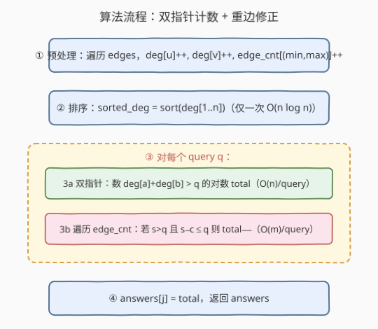
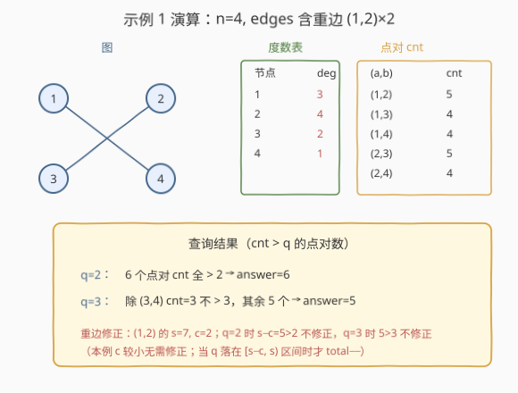

# LeetCode 统计点对的数目 题解

## 1. 题目概述

- **标题 / 题号**：统计点对的数目（#1782，hard）
- **链接**：https://leetcode.cn/problems/count-pairs-of-nodes/
- **难度**：困难
- **标签**：图、排序、双指针、哈希表

**题意**：给定一个无向图，由整数 `n`（节点数目）和 `edges` 组成，`edges[i] = [ui, vi]` 表示 `ui` 和 `vi` 之间有一条无向边，**图中可能存在多重边**。再给定查询数组 `queries`。

对第 `j` 个查询，求满足如下条件的点对 `(a, b)` 的数目：

- `a < b`
- `cnt` 严格大于 `queries[j]`，其中 `cnt` 是**与 `a` 或者 `b` 相连的边的数目**（即端点至少有一个是 `a` 或 `b` 的边数）。

返回数组 `answers`，`answers[j]` 为第 `j` 个查询的答案。

**示例 1**：

```text
输入：n = 4, edges = [[1,2],[2,4],[1,3],[2,3],[2,1]], queries = [2,3]
输出：[6,5]
解释：(1,2) 之间有重边。各点对 cnt 依次为 5,4,4,5,4,3。
q=2 时 6 个点对 cnt 均 > 2 → 6；
q=3 时除 (3,4) 的 cnt=3 不 > 3 外，其余 5 个 → 5。
```

**示例 2**：

```text
输入：n = 5, edges = [[1,5],[1,5],[3,4],[2,5],[1,3],[5,1],[2,3],[2,5]], queries = [1,2,3,4,5]
输出：[10,10,9,8,6]
```

**约束**：

- $2 \le n \le 2 \times 10^4$
- $1 \le \text{edges.length} \le 10^5$
- $1 \le u_i, v_i \le n$，$u_i \ne v_i$
- $1 \le \text{queries.length} \le 20$
- $0 \le \text{queries}[j] < \text{edges.length}$

> 💡 **关键直觉**：「与 $a$ 或 $b$ 相连的边数」$=$ $\deg[a] + \deg[b] -$ $a,b$ 之间的重边数。重边在两个度数里各被计了一次，需扣除一次。于是把「数点对」转化成「在度数数组上数 $\deg[a]+\deg[b] > q$ 的对数」，再用一张重边表做局部修正。

## 2. 解题思路

### 2.1 暴力思路：枚举点对逐个统计

最直观的做法：对每个查询 `q`，枚举所有 $C(n,2)$ 个点对 $(a, b)$，再遍历 `edges` 统计与 $a$ 或 $b$ 相连的边数 `cnt`，判断 `cnt > q`。

时间复杂度 $O(|\text{queries}| \cdot n^2 \cdot m)$。当 $n = 2 \times 10^4$、$m = 10^5$、查询数 $20$ 时，约 $20 \times 4 \times 10^8 \times 10^5 = 8 \times 10^{14}$，**完全不可行**。瓶颈有二：① 点对枚举 $O(n^2)$ 本身就大；② 每个点对还要 $O(m)$ 数边。

> 💡 优化方向：把每个点对的 `cnt` 写成 $\deg[a]+\deg[b]-c(a,b)$，其中 $\deg$ 可一次性预处理、$c$ 只对有直接边的点对非零。于是「数点对」变成「在度数数组上数和超过阈值的对数」——这是经典双指针问题，再对少量有重边的点对做修正即可。

### 2.2 核心观察：cnt(a,b) = deg[a] + deg[b] − c(a,b)

![核心观察：cnt(a,b) = deg[a] + deg[b] − c(a,b)](../images/1782_degree_sum_concept.svg)

**关键公式**：对点对 $(a, b)$，设 $c(a,b)$ 为 $a,b$ 之间**重边的条数**（无直接边则为 0），则

$$\text{cnt}(a,b) = \deg[a] + \deg[b] - c(a,b)$$

**推导过程**：

- $\deg[a]$ 统计所有以 $a$ 为端点的边；$\deg[b]$ 同理。
- 一条边「与 $a$ 或 $b$ 相连」当且仅当它至少以 $a$、$b$ 之一为端点。
- 端点恰好是 $\{a, x\}$（$x \ne b$）或 $\{b, x\}$（$x \ne a$）的边，只被某一方的度数计 1 次，无冗余。
- 端点是 $\{a, b\}$ 的边（即重边）同时计入 $\deg[a]$ 和 $\deg[b]$，但在「与 $a$ 或 $b$ 相连」中只应算 1 次，故需扣除 $c(a,b)$。

因此把判定条件 $\text{cnt}(a,b) > q$ 改写为：

$$\deg[a] + \deg[b] - c(a,b) > q$$

**两步分解**：

1. **先不计重边**：数满足 $\deg[a] + \deg[b] > q$ 的点对数 `total`。这与具体边无关，只依赖度数数组，排序后双指针 $O(n)$ 可解。
2. **再修正重边**：对每个有直接边的点对 $(u,v)$（重边数 $c$），它在第 1 步被计入 `total` 当且仅当 $\deg[u]+\deg[v] > q$；而它真正应被计入当且仅当 $\deg[u]+\deg[v]-c > q$。
   - **过计**（计了却不应计）：$\deg[u]+\deg[v] > q$ 且 $\deg[u]+\deg[v]-c \le q$ → `total--`。
   - **漏计**（没计却应计）：$\deg[u]+\deg[v] \le q$ 且 $\deg[u]+\deg[v]-c > q$。因 $c \ge 1$，$\deg[u]+\deg[v]-c < \deg[u]+\deg[v] \le q$，**不可能**，无需处理。

> ⚠️ **注意**：第 2 步只需遍历「有直接边的点对」（即 `edges` 去重后的键），数量 $\le m$；不需要遍历全部 $C(n,2)$ 个点对。这是把 $O(n^2)$ 降到 $O(m)$ 的关键。

### 2.3 算法流程图



算法步骤：

1. **预处理**：遍历 `edges`，累加 $\deg[u], \deg[v]$，并用哈希表 `edge_cnt` 记录每个无序对 $\{\min(u,v), \max(u,v)\}$ 的重边数。$O(m)$。
2. **排序**：`sorted_deg = sort(deg[1..n])`，全局只排一次。$O(n \log n)$。
3. **逐查询**：对每个 `q`：
   - **双指针数 `total`**：`left=0, right=n-1`。若 `sorted_deg[left] + sorted_deg[right] > q`，则对当前 `right`，所有 `i ∈ [left, right-1]` 都满足（因 `sorted_deg` 升序，更大的 `i` 给出更大的和），`total += right - left`，`right--`；否则 `left++`。$O(n)$。
   - **重边修正**：遍历 `edge_cnt`，对每个 $(u,v,c)$ 令 $s = \deg[u]+\deg[v]$，若 $s > q$ 且 $s - c \le q$ 则 `total--`。$O(m)$。
   - `answers[j] = total`。
4. **返回** `answers`。

> 💡 **双指针正确性**：`sorted_deg` 升序。固定 `right` 时，`sorted_deg[left] + sorted_deg[right]` 是所有 `i ≥ left` 中最小的和；若它已 `> q`，则 `[left, right-1]` 内所有 `i` 都合法，一次性计入 `right - left` 个，然后 `right` 左移。若不 `> q`，则当前 `left` 与任何 `j ≤ right` 的和都 `≤ sorted_deg[left]+sorted_deg[right] ≤ q`，`left` 永远无法配对，直接 `left++`。每个指针单调移动，总计 $O(n)$，每个点对恰好被计入一次。

### 2.4 示例演算

以示例 1 `n = 4, edges = [[1,2],[2,4],[1,3],[2,3],[2,1]], queries = [2,3]` 为例（注意 `[1,2]` 与 `[2,1]` 是重边）：



**步骤 1：算度数与重边表**

| 节点 | deg | | 无序对 | 重边数 c |
|------|-----|---|--------|---------|
| 1 | 3 | | (1,2) | 2 |
| 2 | 4 | | (1,3) | 1 |
| 3 | 2 | | (2,3) | 1 |
| 4 | 1 | | (2,4) | 1 |

**步骤 2：排序** `sorted_deg = [1, 2, 3, 4]`（节点 4,3,1,2）。

**步骤 3：查询 q=2**

- 双指针数 `deg[a]+deg[b] > 2`：
  - `left=0, right=3`：`1+4=5>2` → `total += 3`，`right=2`。
  - `left=0, right=2`：`1+3=4>2` → `total += 2`，`right=1`。
  - `left=0, right=1`：`1+2=3>2` → `total += 1`，`right=0`，结束。
  - `total = 6`。
- 重边修正：`s>2` 且 `s-c≤2`？
  - (1,2)：`s=7, s-c=5>2`，不修正。
  - (1,3)：`s=5, s-c=4>2`，不修正。
  - (2,3)：`s=6, s-c=5>2`，不修正。
  - (2,4)：`s=5, s-c=4>2`，不修正。
- `answers[0] = 6` ✓

**步骤 4：查询 q=3**

- 双指针数 `deg[a]+deg[b] > 3`：
  - `left=0, right=3`：`1+4=5>3` → `total += 3`，`right=2`。
  - `left=0, right=2`：`1+3=4>3` → `total += 2`，`right=1`。
  - `left=0, right=1`：`1+2=3` 不 `>3` → `left=1`，与 `right` 相遇结束。
  - `total = 5`。
- 重边修正：`s>3` 且 `s-c≤3`？逐项检查 `s-c` 均为 5/4/5/4，都 `>3`，不修正。
- `answers[1] = 5` ✓

> ✅ **验证**：6 个点对真实 cnt 为 (1,2)=5, (1,3)=4, (1,4)=4, (2,3)=5, (2,4)=4, (3,4)=3。`q=2` 全部 `>2` 得 6；`q=3` 除 (3,4)=3 不 `>3` 得 5。与算法结果一致。

## 3. 参考代码

### Python

```python
class Solution:
    def countPairs(self, n: int, edges: List[List[int]], queries: List[int]) -> List[int]:
        deg = [0] * (n + 1)
        edge_cnt = {}
        for u, v in edges:
            deg[u] += 1
            deg[v] += 1
            if u > v:
                u, v = v, u
            key = (u, v)
            edge_cnt[key] = edge_cnt.get(key, 0) + 1

        sorted_deg = sorted(deg[1:])  # 节点 1..n 的度数，升序

        ans = []
        for q in queries:
            # 3a. 双指针数 deg[a]+deg[b] > q 的对数
            total = 0
            left, right = 0, n - 1
            while left < right:
                if sorted_deg[left] + sorted_deg[right] > q:
                    total += right - left
                    right -= 1
                else:
                    left += 1
            # 3b. 重边修正：s>q 但 s-c<=q 的点对被多算了 1
            for (u, v), c in edge_cnt.items():
                s = deg[u] + deg[v]
                if s > q and s - c <= q:
                    total -= 1
            ans.append(total)
        return ans
```

### C++

```cpp
class Solution {
public:
    vector<int> countPairs(int n, vector<vector<int>>& edges, vector<int>& queries) {
        vector<int> deg(n + 1, 0);
        map<pair<int,int>, int> edge_cnt;
        for (auto& e : edges) {
            int u = e[0], v = e[1];
            deg[u]++; deg[v]++;
            if (u > v) swap(u, v);
            edge_cnt[{u, v}]++;
        }

        vector<int> sorted_deg(deg.begin() + 1, deg.end());
        sort(sorted_deg.begin(), sorted_deg.end());

        vector<int> ans;
        ans.reserve(queries.size());
        for (int q : queries) {
            int total = 0;
            int left = 0, right = n - 1;
            while (left < right) {
                if (sorted_deg[left] + sorted_deg[right] > q) {
                    total += right - left;
                    right--;
                } else {
                    left++;
                }
            }
            for (auto& [pr, c] : edge_cnt) {
                int s = deg[pr.first] + deg[pr.second];
                if (s > q && s - c <= q) total--;
            }
            ans.push_back(total);
        }
        return ans;
    }
};
```

> 💡 **实现细节**：① `edge_cnt` 的键用无序对（小端在前），保证 `(1,2)` 与 `(2,1)` 合并到同一重边计数。② C++ 用 `std::map<pair<int,int>,int>`，键有序便于去重；m ≤ 10⁵ 时 `map` 的 $O(\log m)$ 常数可接受，若追求极致可用 `unordered_map` + 自定义哈希。③ `sorted_deg` 全局只排一次，20 个查询复用，是复杂度从 $O(Q \cdot n \log n)$ 降到 $O(n \log n + Q \cdot n)$ 的关键。④ 度数数组 1-indexed，`sorted_deg` 取 `deg[1:]` 共 $n$ 个元素。

## 4. 复杂度分析

| 维度 | 复杂度 | 说明 |
|------|--------|------|
| 时间 | $O(n \log n + m + Q \cdot (n + m))$ | 排序 $O(n \log n)$ + 建重边表 $O(m)$ + 每查询双指针 $O(n)$ 与修正 $O(m)$；$Q \le 20$ |
| 空间 | $O(n + m)$ | 度数数组 $O(n)$ + 重边哈希表 $O(m)$（去重后键数 $\le m$） |

> ⚠️ 本题数据范围甜区：$n \le 2 \times 10^4$、$m \le 10^5$、$Q \le 20$。每查询 $O(n+m) \approx 1.2 \times 10^5$，20 查询约 $2.4 \times 10^6$ 次操作，C++/Python 均可轻松通过。瓶颈在 $m$ 的修正步——若改用 $O(n^2)$ 枚举点对会到 $4 \times 10^8 \times 20 = 8 \times 10^9$，必超时。

## 5. 扩展：哈希表优化与离线查询

### 5.1 unordered_map 加速重边表

`std::map` 每次插入/查找 $O(\log m)$，对 $m = 10^5$ 总开销约 $1.7 \times 10^6$ 次比较。改用 `unordered_map` + 自定义 `pair` 哈希可降到均摊 $O(1)$：

```cpp
struct PairHash {
    size_t operator()(const pair<int,int>& p) const noexcept {
        return (size_t)p.first * 100003u + (size_t)p.second;
    }
};
unordered_map<pair<int,int>, int, PairHash> edge_cnt;
```

对本题规模提升不明显，但在 $m$ 更大时（如 $5 \times 10^5$）值得采用。

### 5.2 为何不能只用双指针、不做重边修正？

设想忽略重边，直接返回 `deg[a]+deg[b] > q` 的对数。反例：示例 1 中 (1,2) 之间有 2 条重边，`deg[1]+deg[2]=7` 但真实 `cnt=5`。若查询 `q=5`，按度和判断 `7>5` 计入，但真实 `cnt=5` 不 `>5`，应排除——不修正就会多算 1。

修正的本质：重边把「度和」虚高抬了 $c$，只有当阈值 $q$ 恰好落在 $[s-c, s)$ 这个长度为 $c$ 的窗口内时才需要扣回。由于 $c$ 通常远小于 $s$，需要修正的点对很少，但绝不能省。

| 方法 | 时间 | 适用场景 |
|------|------|---------|
| 排序 + 双指针 + 重边修正（本题） | $O(n \log n + Q(n+m))$ | $Q$ 小、$n,m$ 大 |
| 离线排序 queries + 双指针复用 | $O(n \log n + m + Q \log Q + n + m)$ 推进式 | $Q$ 极大时（本题 $Q \le 20$ 无需） |
| 桶排序度数（值域 $[0,m]$） | $O(n + m + Q \cdot \text{值域})$ | 度数分布集中时 |

> 💡 **面试建议**：先讲清「度和公式 + 双指针 + 修正」三段式，再口头提哈希优化。重点强调为何修正只对有重边的点对做（$O(m)$ 而非 $O(n^2)$）——这是把困难题降到可接受复杂度的关键观察。

## 6. 面试要点

1. **为什么 cnt = deg[a] + deg[b] − c(a,b)？**

   > 「与 $a$ 或 $b$ 相连的边」= 端点至少含 $a$ 或 $b$ 的边。$\deg[a]+\deg[b]$ 把端点为 $\{a,b\}$ 的重边计了两次（$a$ 一次、$b$ 一次），但它们只应算 1 次，故扣除重边数 $c(a,b)$。其余边（只含 $a$ 或只含 $b$）只被一方度数计 1 次，无冗余。

2. **为什么修正只需考虑有直接边的点对？**

   > 漏计情形要求 $\deg[a]+\deg[b] \le q$ 且 $\deg[a]+\deg[b]-c > q$，即 $c > \deg[a]+\deg[b]-q \ge 0$，故 $c \ge 1$，说明 $(a,b)$ 之间必须有重边。没有直接边的点对 $c=0$，度和与 cnt 相等，双指针结果直接正确，无需遍历。这让修正步从 $O(n^2)$ 降到 $O(m)$。

3. **双指针数「和超过阈值」的对数为什么是 O(n)？**

   > 排序后 `left`、`right` 两个指针都单调移动，合计最多 $n$ 步。固定 `right` 时，因数组升序，`sorted_deg[left]+sorted_deg[right]` 是 `i ≥ left` 中最小和，一旦 `>q` 就一次性计入 `right-left` 个，`right--`；否则当前 `left` 无法与任何 `j ≤ right` 配对，`left++`。每个点对恰好被计入一次。

4. **queries 数组很短（≤20）如何利用？**

   > 排序度数只做一次 $O(n \log n)$，20 个查询各跑一次 $O(n)$ 双指针 + $O(m)$ 修正，总 $O(n \log n + 20(n+m))$。若 $Q$ 也很大，可对 queries 排序后让双指针复用相邻阈值的指针位置，摊还优化——但本题 $Q \le 20$ 无此必要。

5. **多重边为何不能在预处理时合并成单边？**

   > 重边数 $c$ 直接参与 `cnt` 计算，合并会丢失 $c$ 信息导致修正步无法进行。必须保留重边计数：`deg` 累加所有边（含重边），`edge_cnt` 记录每个无序对的重边数，二者配合才能在 $O(1)$ 算出任意点对的 `cnt`。

> 💡 **一句话总结**：预处理度数与重边表，排序度数后双指针 $O(n)$ 数「度和超阈值」的对数，再 $O(m)$ 遍历重边表扣回过计——三段式把 $O(Qn^2m)$ 的暴力降到 $O(n \log n + Q(n+m))$。

## 同类练习题

| # | 题目 | 与本题的关联 |
|---|------|-------------|
| 1761 | [一个图中连通三元组的最小度数](https://leetcode.cn/problems/minimum-degree-of-a-connected-trio-in-a-graph/)（[题解](../1701-1800/1761_一个图中连通三元组的最小度数.md)） | 同为「图上度数公式优化统计」，用 $\deg[a]+\deg[b]+\deg[c]-6$ 把逐边统计降到 $O(1)$，思路与本题的度和公式一脉相承 |
| 2316 | [统计无向图中不可互相到达点对数](https://leetcode.cn/problems/count-unreachable-pairs-of-nodes-in-an-undirected-graph/) | 无向图上数点对，用并查集求连通分量后组合计数，对照本题「数点对」的不同切入点（连通性 vs 度数） |
| 15 | [三数之和](https://leetcode.cn/problems/3sum/)（[题解](../0001-0100/15_三数之和.md)） | 排序 + 双指针数和的母题，本题双指针计数部分直接复用其「排序后双端收缩」范式 |
| 719 | [找出第 K 小的数对距离](https://leetcode.cn/problems/find-k-th-smallest-pair-distance/)（[题解](../0701-0800/719_找出第K小的数对距离.md)） | 排序 + 双指针统计数对距离不超过阈值的个数，与本题「统计度和超过阈值的对数」互为镜像（一个数 `≤` 一个数 `>`） |
| 1791 | [星形图的中心节点](https://leetcode.cn/problems/find-center-of-star-graph/) | 利用度数性质秒杀，与本题「度数蕴含结构信息」呼应，作为度数应用的热身题 |
