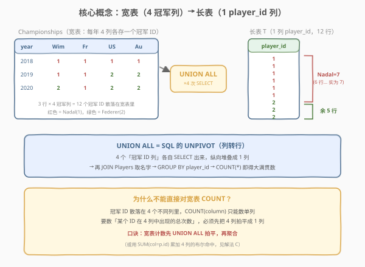
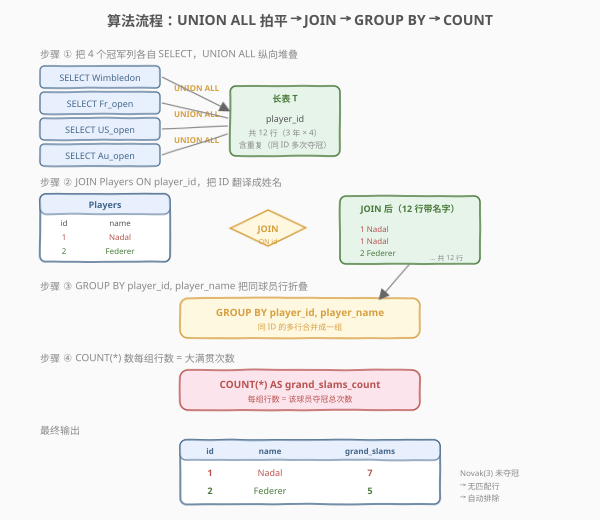
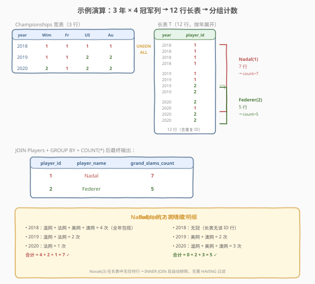

# 大满贯数量

- **题目名称**：大满贯数量
- **链接**：[1783. 大满贯数量](https://leetcode.cn/problems/grand-slam-titles/)
- **难度**：中等
- **标签**：数据库、SQL、`UNION ALL`、UNPIVOT（列转行）、`JOIN`、`GROUP BY`、`COUNT`、条件聚合、`SUM` 布尔累加
- **备注**：本题为 LeetCode **Plus 会员专享题**（Database 分类）。题面与样例依据官方 schema 与样例测试用例整理。

## 1. 题目概述

给定 `Players`（球员）与 `Championships`（大满贯赛事）两张表，编写 SQL 查询，找出**每个球员赢得大满贯比赛的总次数**。结果**不包含没有赢得任何比赛的球员**，顺序任意。

**表结构**：

```text
Table: Players
+----------------+---------+
| Column Name    | Type    |
+----------------+---------+
| player_id      | int     |
| player_name    | varchar |
+----------------+---------+
player_id 是该表主键。
每行给出一名网球运动员的 ID 与姓名。

Table: Championships
+---------------+---------+
| Column Name   | Type    |
+---------------+---------+
| year          | int     |
| Wimbledon     | int     |
| Fr_open       | int     |
| US_open       | int     |
| Au_open       | int     |
+---------------+---------+
year 是该表主键。
每行记录一年的四项大满贯赛事冠军的 player_id。
```

> 💡 **关键结构**：`Championships` 是一张**宽表**——每行把一年里 4 项赛事（温网 / 法网 / 美网 / 澳网）的冠军 `player_id` 各放一列。同一个 `player_id` 可能出现在不同行（不同年份）、同一行的不同列（同年包揽多项）。要数「某球员共夺冠几次」，必须把散落在 4 列里的 `player_id` **拍平成 1 列**再计数。

**示例 1**：

```text
输入：
Players 表：
+-----------+-------------+
| player_id | player_name |
+-----------+-------------+
| 1         | Nadal       |
| 2         | Federer     |
| 3         | Novak       |
+-----------+-------------+
Championships 表：
+------+-----------+---------+---------+---------+
| year | Wimbledon | Fr_open | US_open | Au_open |
+------+-----------+---------+---------+---------+
| 2018 | 1         | 1       | 1       | 1       |
| 2019 | 1         | 1       | 2       | 2       |
| 2020 | 2         | 1       | 2       | 2       |
+------+-----------+---------+---------+---------+

输出：
+-----------+-------------+-------------------+
| player_id | player_name | grand_slams_count |
+-----------+-------------+-------------------+
| 2         | Federer     | 5                 |
| 1         | Nadal       | 7                 |
+-----------+-------------+-------------------+
```

**解释**：

| player_id | 2018 | 2019 | 2020 | 合计 |
|-----------|------|------|------|------|
| 1 (Nadal) | 温网+法网+美网+澳网 = 4 | 温网+法网 = 2 | 法网 = 1 | **7** |
| 2 (Federer) | 无冠 = 0 | 美网+澳网 = 2 | 温网+美网+澳网 = 3 | **5** |
| 3 (Novak) | 0 | 0 | 0 | **0（排除）** |

> ⚠️ **Novak 被排除的原因**：他在 4 列中从未出现，无论 `UNION ALL` 还是 `INNER JOIN` 都不会产生与他相关的行——「不输出未夺冠球员」这条要求由**集合运算天然保证**，无需额外 `HAVING` 过滤。

---

## 2. 解题思路

### 2.1 暴力思路：逐列扫描累加

最直觉的过程式思路：对每个球员 `p`，遍历 `Championships` 的每一行，分别检查 4 个冠军列是否等于 `p.player_id`，命中则计数器 +1。

```text
for each player p in Players:
    count = 0
    for each row c in Championships:
        if c.Wimbledon == p.player_id: count += 1
        if c.Fr_open    == p.player_id: count += 1
        if c.US_open    == p.player_id: count += 1
        if c.Au_open    == p.player_id: count += 1
    if count > 0: emit (p.player_id, p.player_name, count)
```

但**纯 SQL 没有「逐列扫描」的循环语句**——要数「某 ID 在 4 列中出现的总次数」，`COUNT(col)` 只能数单列，无法跨列。核心矛盾是：**冠军 ID 散落在 4 个列里，而聚合函数只能作用于「行」不能横扫「列」**。解决之道有两条：①把 4 列拍平成 1 列（`UNION ALL`，解法 A/B）；②对每列单独累加再求和（`SUM` 布尔累加，解法 C）。

### 2.2 核心观察：UNION ALL 把宽表拍平为长表



**问题拆解为三个子问题**：

1. **拍平 4 列为 1 列**：用 4 个 `SELECT <列名> FROM Championships` 各取一列的 `player_id`，再用 `UNION ALL` 纵向堆叠。3 行 × 4 列 = 12 行，每行一个 `player_id`（含重复——同一球员多次夺冠会出现多行）。这正是 SQL 里 **UNPIVOT（列转行）** 的标准写法。

2. **JOIN 取姓名**：把拍平后的长表 `T` 与 `Players` 按 `player_id` 做 `INNER JOIN`——既翻译出 `player_name`，又**天然过滤掉未夺冠的球员**（未夺冠的 ID 不在 `T` 中，`INNER JOIN` 不保留）。

3. **分组计数**：`GROUP BY player_id, player_name` + `COUNT(*)`——同一 `player_id` 的多行折叠成一组，行数即为夺冠总次数。

> ⚠️ **`UNION ALL` 而非 `UNION`**：`UNION` 会去重，把同年包揽 4 冠的 Nadal(2018) 的 4 个 `1` 去成 1 个，计数全错。必须用 `UNION ALL` 保留每一次夺冠作为独立一行。**「要计数就保留重复，要去重才用 UNION」**——这是 `UNION ALL` vs `UNION` 的核心判据。

> 💡 **UNPIVOT 的本质**：关系理论里每行应是一个独立事实，而 `Championships` 把「4 个独立事实（4 项冠军）」挤进一行，违反了**第一范式**的精神。`UNION ALL` 就是把它「归一化」回每行一个事实的形态——拍平后 `GROUP BY` 聚合才顺理成章。pandas 里等价操作是 `melt`（`pd.melt`），概念完全对应。

### 2.3 算法流程图



**逻辑执行步骤**：

| 步骤 | 子句 / 函数 | 作用 |
|------|-------------|------|
| ① | 4× `SELECT 列 FROM Championships UNION ALL` | 4 个冠军列各取一列，纵向堆叠成 12 行长表 `T` |
| ② | `JOIN Players ON T.player_id = Players.player_id` | 翻译姓名；`INNER JOIN` 天然排除未夺冠球员 |
| ③ | `GROUP BY player_id, player_name` | 同一球员的多行折叠成一组 |
| ④ | `COUNT(*) AS grand_slams_count` | 每组行数 = 夺冠总次数 |
| ⑤ | （可选）`ORDER BY` | 题目无顺序要求，可省略 |

> 💡 **为什么 `INNER JOIN` 自动排除 Novak**：Novak 的 `player_id=3` 从未出现在 `Championships` 的任何列里，故长表 `T` 中没有 `player_id=3` 的行。`INNER JOIN` 只保留两表都有的键，Novak 自然被过滤。若改用 `LEFT JOIN`，Novak 会保留但 `grand_slams_count=0`，需额外 `HAVING > 0`——故此处 `INNER JOIN` 比 `LEFT JOIN` 更省事。

### 2.4 示例演算

以示例 1 的 3 名球员、3 年 12 个冠军归属为例，观察「宽表 → `UNION ALL` 拍平 → 分组计数」的逐步过程：



**拍平后的 12 行长表 `T`**（按年份展开）：

| year | player_id | 说明 |
|------|-----------|------|
| 2018 | 1 | 温网（Nadal） |
| 2018 | 1 | 法网（Nadal） |
| 2018 | 1 | 美网（Nadal） |
| 2018 | 1 | 澳网（Nadal） |
| 2019 | 1 | 温网（Nadal） |
| 2019 | 1 | 法网（Nadal） |
| 2019 | 2 | 美网（Federer） |
| 2019 | 2 | 澳网（Federer） |
| 2020 | 2 | 温网（Federer） |
| 2020 | 1 | 法网（Nadal） |
| 2020 | 2 | 美网（Federer） |
| 2020 | 2 | 澳网（Federer） |

**分组计数**：

- `player_id = 1`（Nadal）：7 行 → `COUNT(*) = 7` ✓
- `player_id = 2`（Federer）：5 行 → `COUNT(*) = 5` ✓
- `player_id = 3`（Novak）：0 行（不在 `T` 中）→ `INNER JOIN` 排除 ✓

> 💡 **同年包揽的体现**：Nadal 在 2018 年包揽 4 冠，长表 `T` 中 2018 年对应 4 行 `player_id=1`——这正是 `UNION ALL`（非 `UNION`）保留重复的价值。若误用 `UNION` 去重，2018 年的 4 行会被压成 1 行，Nadal 的计数从 7 变成 4（每年至多算 1 次），完全错误。

---

## 3. 参考代码

### SQL（解法 A：`UNION ALL` + `JOIN` + `COUNT`，推荐）

```sql
SELECT p.player_id,
       p.player_name,
       COUNT(*) AS grand_slams_count
FROM Players p
JOIN (
    SELECT Wimbledon AS player_id FROM Championships
    UNION ALL
    SELECT Fr_open    FROM Championships
    UNION ALL
    SELECT US_open    FROM Championships
    UNION ALL
    SELECT Au_open    FROM Championships
) t ON p.player_id = t.player_id
GROUP BY p.player_id, p.player_name;
```

> 💡 **写法要点**：
> - **4 个 `SELECT` + 3 个 `UNION ALL`**：每个 `SELECT` 取一列冠军 ID 并统一别名为 `player_id`，纵向堆叠成 12 行长表 `t`。列的别名只在第一个 `SELECT` 生效，后续可省略。
> - **`UNION ALL` 不可写成 `UNION`**：`UNION` 会跨结果集去重，同年包揽 4 冠的 4 个相同 ID 会被压成 1 个，计数错误。要计数就必须保留每次夺冠为独立行。
> - **`INNER JOIN`（`JOIN`）天然排除未夺冠球员**：Novak 的 ID 不在 `t` 中，`JOIN` 不保留；无需 `HAVING` 或 `WHERE` 额外过滤。
> - **`GROUP BY player_id, player_name`**：MySQL 的 `ONLY_FULL_GROUP_BY` 模式下，`SELECT` 中的非聚合列必须全部出现在 `GROUP BY` 中。虽然 `player_name` 函数依赖于 `player_id`（主键），但显式写出最稳妥。
> - ✓ **最推荐**：语义清晰、`UNION ALL` 拍平后就是标准「分组计数」三段式，MySQL 5.7+/8.0+ 通用。

### SQL（解法 B：`UNION ALL` 带赛事名列，支持明细下钻）

```sql
SELECT p.player_id,
       p.player_name,
       COUNT(*) AS grand_slams_count
FROM Players p
JOIN (
    SELECT year, 'Wimbledon' AS tournament, Wimbledon AS player_id FROM Championships
    UNION ALL
    SELECT year, 'Fr_open',    Fr_open    FROM Championships
    UNION ALL
    SELECT year, 'US_open',    US_open    FROM Championships
    UNION ALL
    SELECT year, 'Au_open',    Au_open    FROM Championships
) t ON p.player_id = t.player_id
GROUP BY p.player_id, p.player_name;
```

> 💡 **解法 B 的思路**：在 `UNION ALL` 时**额外保留 `year` 与 `tournament` 两列**，使长表 `t` 成为完整的「事实表」（每行 = 某年某赛事某冠军）。最终 `GROUP BY player_id` 计数时这两列不参与分组（被聚合掉），结果与解法 A 完全相同。
>
> **与解法 A 的区别**：A 只取 `player_id` 一列，最精简；B 保留明细维度，便于**扩展查询**——例如「每球员每项赛事夺冠几次」只需把 `tournament` 加进 `GROUP BY`，「每球员每年夺冠几次」只需把 `year` 加进 `GROUP BY`。**生产环境优先 B**（事实表建模，可复用）；**做题优先 A**（最简）。两者性能等同。

### SQL（解法 C：`JOIN` + `SUM` 布尔累加，无 `UNION`）

```sql
SELECT p.player_id,
       p.player_name,
       SUM(c.Wimbledon = p.player_id) +
       SUM(c.Fr_open    = p.player_id) +
       SUM(c.US_open    = p.player_id) +
       SUM(c.Au_open    = p.player_id) AS grand_slams_count
FROM Players p
JOIN Championships c
  ON p.player_id IN (c.Wimbledon, c.Fr_open, c.US_open, c.Au_open)
GROUP BY p.player_id, p.player_name;
```

> 💡 **解法 C 的思路**：不拍平列，而是**直接对宽表逐行累加**。MySQL 中 `c.Wimbledon = p.player_id` 返回 `1`/`0`（布尔值作为整数），`SUM` 跨年累加即得该列的夺冠次数，4 列相加得总数。
>
> **`JOIN ... ON p.player_id IN (c.Wimbledon, c.Fr_open, c.US_open, c.Au_open)`**：只保留「该球员在当年至少夺过 1 冠」的 `(player, year)` 组合。Nadal 匹配 3 年（2018/2019/2020 都有冠）→ 3 行参与 `SUM`；Federer 匹配 2 年（2019/2020）→ 2 行；Novak 无匹配 → 排除。
>
> **正确性验证**（Nadal）：
> - 2018 行：`1=1`+`1=1`+`1=1`+`1=1` = 4
> - 2019 行：`1=1`+`1=1`+`2=1`+`2=1` = 1+1+0+0 = 2
> - 2020 行：`2=1`+`1=1`+`2=1`+`2=1` = 0+1+0+0 = 1
> - `SUM` 跨行 = 4+2+1 = **7** ✓
>
> **与解法 A 的对比**：A 把「列」拍平成「行」再用 `COUNT`（一次聚合）；C 保留「列」用 4 个 `SUM` 分别累加再相加（四次聚合 + 求和）。两者逻辑等价，但 C 的 `JOIN ... ON IN(...)` **不可走索引**（`IN` 跨多列匹配，非 sargable），数据量大时性能不如 A。**优先 A，C 作为「不依赖 UNION」的对照写法**。
>
> ⚠️ **`JOIN` 方向**：此处 `JOIN Championships c` 会对每位球员扫描全部年份数据。若 `Championships` 行数（年数）远大于球员数，可考虑调换驱动表或用子查询预过滤。数据量小时无影响。

### Python（pandas）

```python
import pandas as pd

def grand_slam_titles(players: pd.DataFrame, championships: pd.DataFrame) -> pd.DataFrame:
    long_df = championships.melt(
        id_vars=['year'],
        value_vars=['Wimbledon', 'Fr_open', 'US_open', 'Au_open'],
        var_name='tournament',
        value_name='player_id'
    )
    merged = long_df.merge(players, on='player_id', how='inner')
    result = (
        merged.groupby(['player_id', 'player_name'], as_index=False)
        .size()
        .rename(columns={'size': 'grand_slams_count'})
    )
    return result
```

> 💡 **pandas 对照**：
> - `championships.melt(id_vars=['year'], value_vars=[4 列], ...)` 对应 SQL 的 4× `SELECT ... UNION ALL`——`melt` 就是 pandas 的 UNPIVOT，把 4 个冠军列拍平成 `tournament`（变量名）+ `player_id`（值）两列，每行一个事实。
> - `.merge(players, on='player_id', how='inner')` 对应 `INNER JOIN`——翻译姓名并排除未夺冠球员。
> - `.groupby(['player_id', 'player_name']).size()` 对应 `GROUP BY` + `COUNT(*)`——`size` 返回每组行数。
> - **pandas 等价于解法 A**：`melt` = `UNION ALL` 拍平，`merge` = `JOIN`，`groupby.size` = `GROUP BY COUNT`，一一对应。

---

## 4. 复杂度分析

| 维度 | 解法 A（`UNION ALL` + `COUNT`） | 解法 B（带明细列） | 解法 C（`SUM` 布尔累加） | pandas |
|------|--------------------------------|-------------------|--------------------------|--------|
| **时间** | $O(m + 4m + k) = O(m)$ | $O(m)$ | $O(n \cdot m)$（最坏） | $O(m)$ |
| **空间** | $O(4m) = O(m)$ | $O(4m) = O(m)$ | $O(1)$（无中间表） | $O(4m)$ |
| **MySQL 版本** | ≥ 5.7 | ≥ 5.7 | ≥ 5.7 | — |
| **推荐度** | ✓ **首选** | ✓ 生产复用 | ✓ 对照写法 | ✓ 验证用 |

> - $m$ = `Championships` 行数（年数），$n$ = `Players` 行数，$k$ = 拍平后匹配行数。
> - **解法 A/B**：`UNION ALL` 把 $m$ 行 × 4 列物化为 $4m$ 行长表 $O(m)$，`JOIN` + `GROUP BY COUNT` 线性扫描 $O(4m)$，总计 $O(m)$。空间需存 $4m$ 行中间表。
> - **解法 C**：`JOIN ON IN(...)` 不可走索引（非 sargable），最坏对每位球员扫描全部 $m$ 行 → $O(n \cdot m)$；若 `Championships` 行数少（年数通常很少）则接近 $O(n)$。无中间表，空间 $O(1)$。
> - **数据规模**：大满贯每年 4 项，`Championships` 行数 = 历史年数（通常 < 200），`Players` 行数 = 球员数（通常 < 1000）。本题数据量极小，三种解法性能差异可忽略，**优先选可读性最好的 A**。

---

## 5. 扩展：UNPIVOT 的三种实现与宽表设计反思

本题的核心是「宽表转长表」——这是 SQL 数据重塑的经典操作，与 [1777. 每家商店的产品价格](./1777_每家商店的产品价格.md) 的 pivot（行转列）互为镜像。辨析如下。

### 5.1 `UNION ALL`：标准 SQL 的 UNPIVOT

MySQL 不支持 `UNPIVOT` 关键字（SQL Server / Oracle 有），但 `UNION ALL` 是跨所有方言通用的等价写法：

```sql
-- 通用 UNPIVOT 模板：N 列 → 1 列
SELECT col1 AS val, 'col1' AS src FROM T
UNION ALL
SELECT col2 AS val, 'col2' AS src FROM T
UNION ALL
SELECT col3 AS val, 'col3' AS src FROM T;
-- 结果：每行一个 val + 来源列名 src
```

| 方言 | UNPIVOT 写法 | 备注 |
|------|-------------|------|
| **标准 / MySQL** | `UNION ALL` 多个 `SELECT` | 通用，需手写每列 |
| **SQL Server** | `UNPIVOT(val FOR src IN (col1, col2, col3))` | 语法糖，一行搞定 |
| **Oracle** | `UNPIVOT INCLUDE NULLS` | 可选是否含 NULL 行 |
| **PostgreSQL** | `UNNEST(ARRAY[col1, col2, col3])` 或 `UNION ALL` | 数组展开 |

> 💡 **`UNION ALL` 的扩展性**：若赛事从 4 项扩到 $N$ 项，`UNION ALL` 需手写 $N$ 个 `SELECT`——列数多时冗长。SQL Server 的 `UNPIVOT` 与 pandas 的 `melt` 都是「列名列表参数化」，更优雅。MySQL 中可用**动态 SQL**（`PREPARE` + 字符串拼接 `INFORMATION_SCHEMA.COLUMNS`）生成 `UNION ALL`，但本题 4 列固定，手写最直接。

### 5.2 `SUM` 布尔累加：不拍平的替代方案

解法 C 展示了另一条路——**不重塑数据，直接对宽表逐列累加**：

```sql
SUM(col = p.id) + SUM(col2 = p.id) + ... AS cnt
```

**适用场景**：

| 场景 | 推荐方案 |
|------|---------|
| 列数固定且少（≤ 5） | A（`UNION ALL`）或 C（`SUM`）均可 |
| 列数多或动态 | A（`UNION ALL`，或动态 SQL 生成） |
| 需要明细下钻（按赛事/年份分组） | B（带明细列的 `UNION ALL`） |
| 不能建中间表（内存受限） | C（`SUM`，无中间表） |

> 💡 **布尔累加的坑**：`col = p.id` 在 `col` 为 `NULL` 时返回 `NULL`（非 `0`），`SUM(NULL)` 被忽略——若某列允许 `NULL` 且需计为 0，要用 `IFNULL(col = p.id, 0)` 或 `COALESCE`。本题冠军 ID 非 `NULL`（每项必有冠军），无此问题。

### 5.3 宽表设计反思：为什么 Championships 违反范式

`Championships` 把 4 项赛事的冠军挤进一行的 4 列，是典型的**宽表设计**——利于「按年查 4 冠军」这种点查询，但不利于「按球员统计」。关系理论里更规范的设计是**长表（事实表）**：

```text
规范设计：Championships_Long
+------+------------+-----------+
| year | tournament | player_id |
+------+------------+-----------+
| 2018 | Wimbledon  | 1         |
| 2018 | Fr_open    | 1         |
| ...  | ...        | ...       |
+------+------------+-----------+
(year, tournament) 为主键
```

这样本题直接 `GROUP BY player_id COUNT(*)` 即可，无需 `UNION ALL` 拍平。但 LeetCode 给定 schema 无法更改，`UNION ALL` 就是「临时把宽表归一化」的手段——**理解了范式，就理解了为什么 `UNION ALL` 是本题的正解**。

### 5.4 与 1777（pivot）的镜像关系

[1777. 每家商店的产品价格](./1777_每家商店的产品价格.md) 是**行转列**（pivot）：长表 `(product_id, store, price)` → 宽表 `(product_id, store1, store2, store3)`，用 `GROUP BY + CASE WHEN`（条件聚合）实现。本题 1783 是**列转行**（unpivot）：宽表 → 长表，用 `UNION ALL` 实现。两者互为逆操作：

| 方向 | 操作 | SQL 手段 | pandas |
|------|------|---------|--------|
| 行转列 | pivot | `GROUP BY` + `MAX(CASE WHEN)` | `df.pivot_table` |
| 列转行 | unpivot | `UNION ALL` | `df.melt` |

> 💡 **一句话归类**：1777 与 1783 是 SQL 数据重塑的「镜像双子题」——一个把行拍扁成列，一个把列拍平成行。掌握了 `CASE WHEN` 条件聚合与 `UNION ALL` 拍平，所有「宽表 ↔ 长表」互转的 SQL 题都能套用。

---

## 6. 面试要点

**Q1：为什么用 `UNION ALL` 而非 `UNION`？**
> `UNION` 会对结果集去重——同年包揽 4 冠的 Nadal(2018) 的 4 个相同 `player_id=1` 会被压成 1 个，导致计数从 7 变成 4（每年至多算 1 次）。`UNION ALL` 保留所有行，每次夺冠作为独立一行参与 `COUNT`，计数才正确。**口诀：「要计数保留重复用 UNION ALL，要去重才用 UNION」**。

**Q2：为什么不需要 `HAVING` 过滤未夺冠球员？**
> `INNER JOIN` 只保留两表都有的键。Novak 的 `player_id=3` 从未出现在 `Championships` 的 4 列里，故 `UNION ALL` 后的长表 `T` 中没有 `player_id=3`，`JOIN` 后 Novak 自然被排除。`INNER JOIN` = 天然过滤。若误用 `LEFT JOIN`，Novak 会以 `grand_slams_count=0` 保留，此时才需 `HAVING grand_slams_count > 0`。

**Q3：解法 C 的 `SUM(col = p.id)` 在 MySQL 中如何工作？**
> MySQL 中布尔表达式 `a = b` 返回 `1`（真）或 `0`（假），作为整数参与 `SUM` 聚合。`SUM(c.Wimbledon = p.player_id)` 跨年累加该球员在温网夺冠的次数。4 列各 `SUM` 一次再相加得总数。**注意**：若某列可能为 `NULL`，`NULL = p.id` 返回 `NULL` 而非 `0`，`SUM` 忽略 `NULL`——需 `IFNULL` 兜底。本题冠军 ID 非空，无此坑。

**Q4：`GROUP BY` 里为什么要写 `player_name`？**
> MySQL 的 `ONLY_FULL_GROUP_BY` 模式（8.0 默认开启）要求 `SELECT` 中的非聚合列必须出现在 `GROUP BY` 中。虽然 `player_name` 函数依赖于 `player_id`（主键唯一决定姓名），部分 MySQL 版本能识别这种依赖并允许省略，但显式写出最稳妥，也兼容 PostgreSQL 等更严格的数据库。

**Q5：若赛事从 4 项扩到 $N$ 项，`UNION ALL` 写法如何扩展？**
> 需手写 $N$ 个 `SELECT ... UNION ALL`——列数多时冗长。替代方案：①SQL Server 用 `UNPIVOT(val FOR src IN (col1, ..., colN))` 一行搞定；②MySQL 用动态 SQL（`PREPARE` + 拼接 `INFORMATION_SCHEMA.COLUMNS` 查询结果生成 `UNION ALL` 字符串）；③退回解法 C 的 `SUM` 累加（但同样需手写 $N$ 个 `SUM`）。列名动态变化时，动态 SQL 是唯一通用方案。

> 💡 **一句话总结**：1783 是 SQL **「宽表计数」招牌题**——核心模板「4× `SELECT 列 UNION ALL` 拍平长表 → `JOIN Players` → `GROUP BY player_id, player_name` → `COUNT(*)`」。最大要点：**`UNION ALL`（非 `UNION`）保留重复夺冠、`INNER JOIN` 天然排除未夺冠球员**；`SUM` 布尔累加是免 `UNION` 的等价替代。与 1777 pivot 互为镜像，共构 SQL 数据重塑双子题。

---

## 7. 同类练习题

- [1777. 每家商店的产品价格](https://leetcode.cn/problems/products-price-for-each-store/)（[题解](./1777_每家商店的产品价格.md)）：`GROUP BY` + `CASE WHEN` 条件聚合做**行转列**（pivot）——与 1783 的列转行（unpivot）互为镜像，共构 SQL 数据重塑双子题
- [1795. 每种商品在每家店的价格](https://leetcode.cn/problems/price-for-each-store-for-each-product/)：`UNION ALL` 把多列价格拍平成长表——与 1783 同属 unpivot 套路，对照体会「宽表计数先拍平再聚合」的通用骨架
- [1767. 寻找没有被执行的任务对](https://leetcode.cn/problems/find-the-sub-tasks-that-did-not-execute/)（[题解](./1767_寻找没有被执行的任务对.md)）：递归 `UNION ALL` 生成序列——同样是 `UNION ALL` 纵向堆叠，但用于「展开序列」而非「拍平列」，对比两种 `UNION ALL` 用途
- [1173. 即时食物配送 I](https://leetcode.cn/problems/immediate-food-delivery-i/)：`AVG(CASE WHEN ...)` 条件聚合——另一种「不拍平、直接对列做条件统计」的思路，与 1783 解法 C 的 `SUM(col = p.id)` 同源
- [1709. 访问日期之间最大的空档期](https://leetcode.cn/problems/biggest-window-between-visits/)（[题解](./1709_访问日期之间最大的空档期.md)）：同区间 SQL Plus 题，窗口函数 `LEAD` + `GROUP BY` 聚合——对照体会「窗口函数逐行」与「`UNION ALL` 拍平」两种 SQL 数据重塑思路
