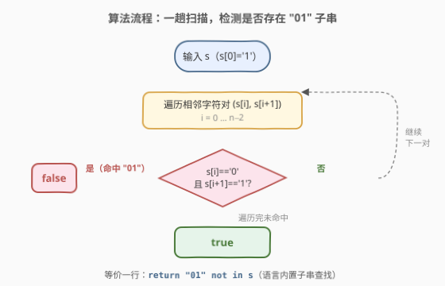
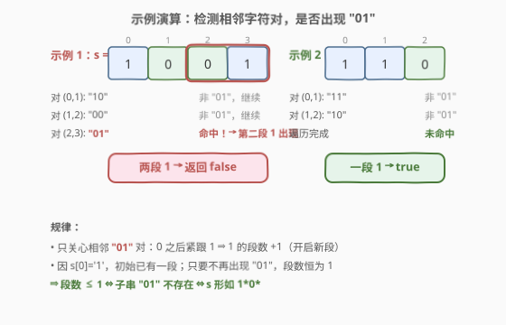

# 检查二进制字符串字段

- **题目名称**：检查二进制字符串字段
- **链接**：[1784. 检查二进制字符串字段](https://leetcode.cn/problems/check-if-binary-string-has-at-most-one-segment-of-ones/)
- **难度**：简单
- **标签**：字符串、脑筋急转弯

## 1. 题目概述

给定一个二进制字符串 `s`，该字符串**不含前导零**（即 `s[0] == '1'`）。如果 `s` 中由连续 `'1'` 组成的字段数量**为零个或一个**，返回 `true`；否则返回 `false`。

**示例 1**：

```text
输入：s = "1001"
输出：false
解释：由连续若干个 '1' 组成的字段数量为 2（"1" 和 "1"），返回 false。
```

**示例 2**：

```text
输入：s = "110"
输出：true
解释：只有一个连续 '1' 字段 "11"，返回 true。
```

**约束条件**：

- $1 \le \text{s.length} \le 100$
- `s[i]` 为 `'0'` 或 `'1'`
- `s[0]` 为 `'1'`

> 💡 **关键结构**：`s[0] == '1'` 是题眼的钥匙——它保证了串**已经存在至少一段 1**。于是「至多一段」退化为「恰好一段」，进而等价于「1 全部连续堆在前缀，后面只能跟 0」。这把"数段数"的问题压缩成了"找一个 2 字符禁式"。

---

## 2. 解题思路

### 2.1 暴力思路：扫描统计 1 的连续段数

最直觉的做法是线性扫描，统计 `'1'` 的连续段数：维护前一个字符 `prev`，每当遇到 `prev == '0'` 且当前字符为 `'1'`，就说明开启了一段新的 1，段数 `+1`。最后判断段数是否 $\le 1$。

```text
segments = 0
prev = '0'                      # 哨兵：开头不算"从 0 转入 1"
for c in s:
    if c == '1' and prev == '0':
        segments += 1
    prev = c
return segments <= 1
```

时间 $O(n)$、空间 $O(1)$。复杂度已最优，但**逻辑可以更简**——题目结构允许我们把"计数"压成"判定存在性"。

> ⚠️ **症结**：暴力法维护了「段数」这个累加量，但实际上我们只关心它「是否 $\le 1$」。又因 `s[0]='1'` 保证段数 $\ge 1$，故真正要判定的只是「有没有第二段」。"第二段"出现的充要条件正是某个 `0` 之后又出现了 `1`。

### 2.2 核心观察：禁止 "01" 子串

![核心观察：s[0]='1'，合法串必为 1*0*，禁止出现 "01" 子串](../images/1784_concept.svg)

关键洞察：因为 `s[0] == '1'`，串**已经拥有一段 1**（位于前缀）。要使 1 的段数恰好为 1，必须保证**一旦出现 `0`，其后绝不再出现 `1`**。换句话说，串只能形如

$$
\underbrace{1\cdots1}_{\text{一段 1}}\;\underbrace{0\cdots0}_{\text{可选的尾随 0}}
\quad=\quad 1^{*}0^{*}
$$

而"0 之后又出现 1"这一禁式的**最小局部表现**，正是相邻字符对 `"01"`。于是：

$$
\text{段数} \le 1 \quad\Longleftrightarrow\quad \text{子串 "01" 不存在} \quad\Longleftrightarrow\quad s \in 1^{*}0^{*}
$$

> 💡 **为什么是相邻对而非任意顺序的 0…1？** 段数的增减只发生在**相邻字符的边界**上：`0→1` 开新段、`1→0` 关段。非相邻的 `0…1` 必然夹着一段 `0→1` 的相邻转换。故只需查相邻对 `"01"`，等价但更局部、更廉价。
>
> 💡 **与 1869 的对照**：[1869. 仅含 1 的子串的较长长度](https://leetcode.cn/problems/longer-contiguous-segments-of-ones-than-zeros/) 同样处理二进制串的连续段，但它要比较 `1` 段与 `0` 段的最长长度，需完整统计；本题借助 `s[0]='1'` 把"数段数"降维成"查禁式"，是更纯粹的脑筋急转弯。

### 2.3 算法流程图



1. **输入**：`s`（保证 `s[0]='1'`）。
2. **扫描相邻对**：遍历 $i = 0 \ldots n-2$，检查 $(s[i], s[i+1])$。
3. **判定**：若存在某对等于 `"01"`（即 `s[i]=='0'` 且 `s[i+1]=='1'`），立即返回 `false`。
4. **终止**：扫描完毕未命中，返回 `true`。

每个相邻对 $O(1)$ 比较，整体单趟线性。实际实现可直接用语言内置的子串查找 `"01" in s` 一步到位。

### 2.4 示例演算

以示例 1 `s = "1001"` 与示例 2 `s = "110"` 为例：



**示例 1** `s = "1001"`（逐对扫描）：

| 相邻对 | 字符 | 是否 "01" | 动作 |
|--------|------|-----------|------|
| $(0,1)$ | `"10"` | ✗ | 继续 |
| $(1,2)$ | `"00"` | ✗ | 继续 |
| $(2,3)$ | `"01"` | ✓ | 命中 → 返回 `false` |

下标 2→3 处 `0` 后紧跟 `1`，开启了第二段 1，故 `false` ✓。

**示例 2** `s = "110"`（逐对扫描）：

| 相邻对 | 字符 | 是否 "01" | 动作 |
|--------|------|-----------|------|
| $(0,1)$ | `"11"` | ✗ | 继续 |
| $(1,2)$ | `"10"` | ✗ | 继续 |

遍历完成未命中 `"01"`，1 的段数恰为 1，返回 `true` ✓。

> 💡 注意 `"10"` 不是禁式——它是 `1→0`，关闭当前段但**不开启新段**；只有 `"01"`（`0→1`）才开新段。

---

## 3. 参考代码

### C++

```cpp
class Solution {
public:
    bool checkOnesSegment(string s) {
        return s.find("01") == string::npos;
    }
};
```

### Python

```python
class Solution:
    def checkOnesSegment(self, s: str) -> bool:
        return "01" not in s
```

> 💡 **写法对照**：两版均利用「`s[0]='1'` ⇒ 至多一段 1 ⇔ 无 `"01"` 子串」这一等价，把计数问题压成一次子串查找。C++ 用 `string::find` 返回 `string::npos` 表示未找到；Python 用 `in` 运算符的布尔语义直接判存在性。
>
> ⚠️ **不必真去数段数**：朴素写法（扫描统计 `0→1` 转换次数再判断 `≤1`）虽也是 $O(n)/O(1)$ 且正确，但忽略了 `s[0]='1'` 带来的结构简化。子串查找写法更短、更体现对题眼的洞察，且多数语言实现为优化过的内置函数。

---

## 4. 复杂度分析

| 维度 | 复杂度 | 说明 |
|------|--------|------|
| 时间复杂度 | $O(n)$ | 子串查找 / 一趟扫描相邻对，每个位置 $O(1)$ |
| 空间复杂度 | $O(1)$ | 仅常数个变量，不随输入规模增长 |

> 💡 对比暴力计数法：两者同为 $O(n)/O(1)$，但子串查找写法借助内置实现（常含 SIMD/向量化优化）常数更小，代码也最简。$n \le 100$ 时差异可忽略，重点是思维上的降维。

---

## 5. 扩展：去掉 `s[0]='1'` 约束后如何处理

本题能简化为「查 `"01"` 子串」**完全依赖** `s[0]=='1'` 这一前提——它保证了初始已有一段 1，使「至多一段」等价于「无第二段」。若放宽为任意二进制串（允许前导零），则需分类：

- 全 `0` 串：段数为 0，合法；
- 含至少一个 `1`：段数 $=$ `"01"` 子串的出现次数 $+\ 1$（每个 `"01"` 开启一段新 1，初始段由首个 `1` 贡献）。

此时不能再单查 `"01"` 是否存在，而要数其出现次数，或直接扫描统计 `0→1` 转换数。可见 `s[0]='1'` 把「计数」问题降级为「存在性」问题，是本题简化的根因。

> 💡 这也是「脑筋急转弯」类题目的共性：约束条件里常藏着把通用问题特例化的钥匙。识别出「`s[0]='1'` ⇒ 段数下界为 1」这步推理，是本题的全部难点。

---

## 6. 面试要点

**Q1：为什么 `s[0]=='1'` 这么关键？**
> 它保证了串**至少有一段 1**，于是「至多一段」退化为「恰好一段」。若没有此约束（允许前导零），全 0 串段数为 0 也合法，就不能仅靠查 `"01"` 判定，需额外处理全 0 情况或数段数。

**Q2：为什么查 `"01"` 而不是查 `"10"`？**
> `"01"`（`0→1`）**开启**一段新的 1，是段数增加的唯一来源；`"10"`（`1→0`）只是关闭当前段，不改变段数。由于初始已有一段，只需阻止任何"第二段"出现，即查 `"01"` 是否存在。

**Q3：`"01" not in s` 与扫描统计段数，哪个更优？**
> 两者渐近复杂度相同（$O(n)/O(1)$）。子串查找写法更短、更体现题眼洞察，且内置实现常数更小；扫描计数法更通用（去掉 `s[0]='1'` 约束后仍正确）。面试中先讲计数法建立正确性，再用 `s[0]='1'` 推出等价简化，能展示思维层次。

**Q4：如果把问题改为「恰好一段 1」呢？**
> 在 `s[0]=='1'` 前提下，「恰好一段」与「至多一段」**完全等价**（因为下界已为 1）。若无此前提，则需排除全 0 串，即 `'1' in s and "01" not in s`。

**Q5：能否用正则表达式一步判定？**
> 可以。合法串形如 `1*0*`，正则 `^1*0*$` 即可匹配。`s[0]='1'` 时退化为等价于无 `"01"` 子串。正则写法直观但常数大于直接子串查找，适合作为思路验证而非最优实现。

---

## 7. 同类练习题

- [1869. 仅含 1 的子串的较长长度](https://leetcode.cn/problems/longer-contiguous-segments-of-ones-than-zeros/)：同属二进制串连续段问题，但需比较 1 段与 0 段的最长长度，对照"数段长"与"查禁式"的不同问法
- [1758. 生成交替二进制字符串的最少操作数](https://leetcode.cn/problems/minimum-changes-to-make-alternating-binary-string/)（[题解](../1701-1800/1758_生成交替二进制字符串的最少操作数.md)）：二进制串相邻字符关系，利用"候选目标仅 2 种"的结构把枚举压到一次扫描，同属"利用结构降维"的字符串题
- [1785. 构成特定和需要的最少元素](https://leetcode.cn/problems/minimum-elements-to-add-to-form-a-given-sum/)：同题号区间的签到脑筋急转弯，把"构造"压成"贪心取整除"，对照简洁数学推导的快感
- [345. 反转字符串中的元音字母](https://leetcode.cn/problems/reverse-vowels-of-a-string/)（[题解](../0301-0400/345_反转字符串中的元音字母.md)）：字符串上基于字符属性的判定 + 双指针操作，体会"局部判定"在字符串题中的复用
