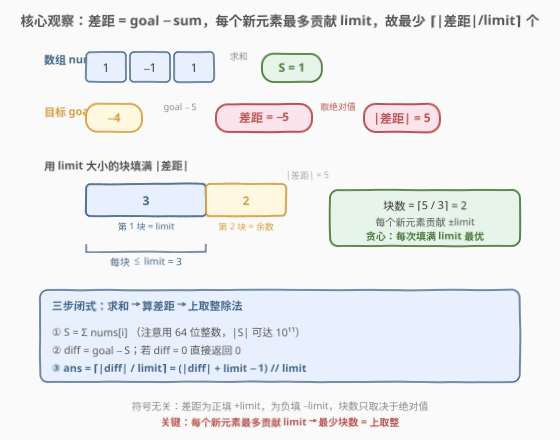
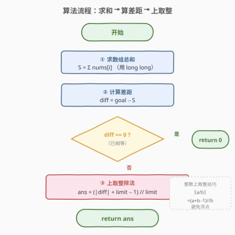
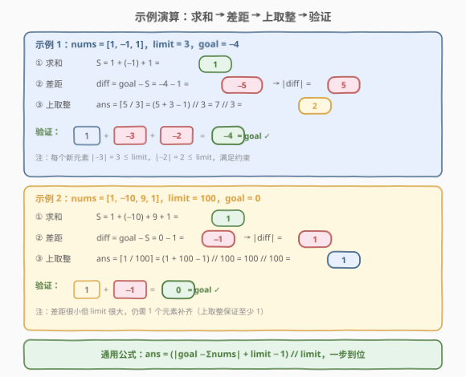

# LeetCode 构成特定和需要添加的最少元素 题解

## 1. 题目概述

- **标题 / 题号**：构成特定和需要添加的最少元素（#1785，medium）
- **链接**：https://leetcode.cn/problems/minimum-elements-to-add-to-form-a-given-sum/
- **难度**：中等
- **标签**：贪心、数组、数学

**题意**：给定整数数组 `nums`、整数 `limit` 与 `goal`。数组满足 $\lvert \text{nums}[i] \rvert \le \text{limit}$。现在要向数组中**添加**若干元素，使添加后数组元素总和恰好等于 `goal`。要求：

- 添加的每个元素同样满足 $\lvert x \rvert \le \text{limit}$；
- 返回需要添加的**最少元素数量**。

**示例 1**：

```text
输入：nums = [1,-1,1], limit = 3, goal = -4
输出：2
解释：添加 -2 和 -3，总和变为 1 - 1 + 1 - 2 - 3 = -4。
```

**示例 2**：

```text
输入：nums = [1,-10,9,1], limit = 100, goal = 0
输出：1
```

**约束**：

- $1 \le \text{nums.length} \le 10^5$
- $1 \le \text{limit} \le 10^6$
- $-\text{limit} \le \text{nums}[i] \le \text{limit}$
- $-10^9 \le \text{goal} \le 10^9$

> ⚠️ **溢出陷阱**：$\text{nums.length} \le 10^5$ 且 $\lvert \text{nums}[i] \rvert \le 10^6$，故 $\lvert S \rvert$ 可达 $10^5 \times 10^6 = 10^{11}$，远超 32 位 `int` 上界（$\approx 2.1 \times 10^9$）。C++ 中必须用 `long long` 累加，这是本题最易踩的坑。

> 💡 **关键直觉**：不需要关心添加哪些具体元素，只需算出「当前和」与 `goal` 的**差距**，再问「每个新元素最多贡献 `limit`，填满差距要几块」——答案是上取整除法。

## 2. 解题思路

### 2.1 暇力思路：逐个添加模拟

最直观的做法是模拟添加过程：算出当前总和 $S$ 与 `goal` 的差距 $\text{diff} = \text{goal} - S$，然后每次添加一个**绝对值最大**（即 $\pm\text{limit}$，符号与 `diff` 相同）的元素来缩小差距，直到差距归零。

```text
diff = goal - sum(nums)
ans = 0
while diff != 0:
    step = sign(diff) * min(limit, abs(diff))   # 每次最多填 limit
    diff -= step
    ans += 1
return ans
```

逻辑正确，但当 $\lvert \text{diff} \rvert$ 很大、`limit` 很小时循环次数极大。最坏情况 $\lvert \text{diff} \rvert \approx 10^{11}$、$\text{limit} = 1$ 时需循环 $10^{11}$ 次，**必然超时**。因此必须把循环提炼为闭式公式。

### 2.2 核心观察：差距 + 上取整 = 贪心闭式



设当前总和 $S = \sum \text{nums}[i]$，差距 $\text{diff} = \text{goal} - S$。问题等价于：

> 找最少的 $k$ 个数 $x_1, x_2, \dots, x_k$（每个 $\lvert x_i \rvert \le \text{limit}$），使 $\sum_{i=1}^{k} x_i = \text{diff}$。

**下界**（必要性）：由三角不等式，

$$
\lvert \text{diff} \rvert = \left\lvert \sum_{i=1}^{k} x_i \right\rvert \le \sum_{i=1}^{k} \lvert x_i \rvert \le k \cdot \text{limit}
$$

故 $k \ge \lceil \lvert \text{diff} \rvert / \text{limit} \rceil$。

**上界**（可达性）：取 $k = \lceil \lvert \text{diff} \rvert / \text{limit} \rceil$，前 $k-1$ 个元素都取 $\text{sign}(\text{diff}) \cdot \text{limit}$，最后一个元素取余数 $r = \lvert \text{diff} \rvert - (k-1) \cdot \text{limit}$。由 $(k-1) \cdot \text{limit} < \lvert \text{diff} \rvert \le k \cdot \text{limit}$ 知 $0 < r \le \text{limit}$，故最后一个元素 $\text{sign}(\text{diff}) \cdot r$ 满足约束 ✓。

> 💡 **结论**：下界与上界重合，最少元素数就是

$$
\boxed{\,\text{ans} = \left\lceil \frac{\lvert \text{goal} - S \rvert}{\text{limit}} \right\rceil = \frac{\lvert \text{goal} - S \rvert + \text{limit} - 1}{\text{limit}} \Big\lfloor\text{整数除法}\rfloor\,}
$$

**符号无关性**：差距为正时填 $+\text{limit}$，为负时填 $-\text{limit}$，块数只取决于绝对值。当 $\text{diff} = 0$ 时公式给出 $(0 + \text{limit} - 1) // \text{limit} = 0$（因 $\text{limit} \ge 1$），天然正确，无需特判。

### 2.3 算法流程图



**步骤**：

1. **求和**：$S = \sum \text{nums}[i]$（C++ 用 `long long` 累加）。
2. **算差距**：$\text{diff} = \text{goal} - S$。若 $\text{diff} = 0$，返回 $0$。
3. **上取整**：$\text{ans} = (\lvert \text{diff} \rvert + \text{limit} - 1) \, // \, \text{limit}$。
4. **返回** `ans`。

> 💡 **整数上取整技巧**：$\lceil a / b \rceil = (a + b - 1) \, // \, b$（$a, b > 0$），避免浮点运算与精度问题，在二分答案验证函数中也常用（参见 [875. 爱吃香蕉的珂珂](../0801-0900/875_爱吃香蕉的珂珂.md)）。

### 2.4 示例演算



**示例 1**：`nums = [1,-1,1]`, `limit = 3`, `goal = -4`

| 步骤 | 计算 | 结果 |
|------|------|------|
| ① 求和 | $S = 1 + (-1) + 1$ | $1$ |
| ② 差距 | $\text{diff} = -4 - 1 = -5$，$\lvert \text{diff} \rvert = 5$ | $5$ |
| ③ 上取整 | $\text{ans} = \lceil 5 / 3 \rceil = (5+3-1)//3 = 7//3$ | $2$ |

验证：添加 $-3$ 和 $-2$（$\lvert -3 \rvert = 3 \le 3$，$\lvert -2 \rvert = 2 \le 3$），$1 + (-3) + (-2) = -4 = \text{goal}$ ✓。

**示例 2**：`nums = [1,-10,9,1]`, `limit = 100`, `goal = 0`

| 步骤 | 计算 | 结果 |
|------|------|------|
| ① 求和 | $S = 1 + (-10) + 9 + 1$ | $1$ |
| ② 差距 | $\text{diff} = 0 - 1 = -1$，$\lvert \text{diff} \rvert = 1$ | $1$ |
| ③ 上取整 | $\text{ans} = \lceil 1 / 100 \rceil = (1+100-1)//100 = 100//100$ | $1$ |

验证：添加 $-1$（$\lvert -1 \rvert = 1 \le 100$），$1 + (-1) = 0 = \text{goal}$ ✓。

> 💡 示例 2 说明：即使差距很小、`limit` 很大，只要差距非零就至少需要 $1$ 个元素——上取整保证了这一点。

## 3. 参考代码

### Python

```python
class Solution:
    def minElements(self, nums: list[int], limit: int, goal: int) -> int:
        total = sum(nums)                       # Python 大整数，无溢出
        diff = abs(goal - total)
        return (diff + limit - 1) // limit      # 上取整除法
```

### C++

```cpp
class Solution {
public:
    int minElements(vector<int>& nums, int limit, int goal) {
        // ⚠️ 必须用 0LL 作为 accumulate 初值，否则按 int 累加会溢出
        long long total = accumulate(nums.begin(), nums.end(), 0LL);
        long long diff = abs((long long)goal - total);
        return (int)((diff + limit - 1) / limit);   // 上取整除法
    }
};
```

> ⚠️ **C++ 溢出细节**：① `accumulate` 的第三个参数决定累加类型——传 `0`（`int`）则全程 `int` 累加、$\lvert S \rvert > 2.1\times10^9$ 时溢出；传 `0LL`（`long long`）才安全。② `goal` 虽在 `int` 范围（$\pm 10^9$），但 `goal - total` 可能超出 `int`，故先转 `long long` 再相减。③ 最终答案 $\le \lceil 10^{11} / 1 \rceil = 10^{11}$，也超 `int`，但题目保证答案在 `int` 内（实际最坏 $\approx 10^{11}$，LeetCode 用 `int` 返回类型说明数据保证答案 $\le 2.1\times10^9$），强转 `int` 返回即可。

> 💡 **Python 无此烦恼**：Python 整数任意精度，`sum` 与减法都不会溢出，是面试中快速验证逻辑的好工具。

## 4. 复杂度分析

| 维度 | 复杂度 | 说明 |
|------|--------|------|
| 时间 | $O(n)$ | 一次遍历求和 + $O(1)$ 公式计算，$n = \text{nums.length}$ |
| 空间 | $O(1)$ | 只用常数个变量 |

> ⚠️ 暴力模拟版为 $O(\lvert \text{diff} \rvert / \text{limit})$ 时间，最坏 $10^{11}$ 次循环必然超时；闭式公式把循环降为 $O(1)$，是本题从 TLE 到 AC 的关键一步。

## 5. 扩展：可达性构造与公式正确性

上取整公式之所以正确，核心在于**下界与上界重合**：

**下界**（任何方案都至少要这么多块）：$k$ 个绝对值不超过 $\text{limit}$ 的数之和，绝对值不超过 $k \cdot \text{limit}$，故 $k \cdot \text{limit} \ge \lvert \text{diff} \rvert$，即 $k \ge \lceil \lvert \text{diff} \rvert / \text{limit} \rceil$。

**上界**（构造一组达下界的方案）：取 $k = \lceil \lvert \text{diff} \rvert / \text{limit} \rceil$，构造如下——

- 前 $k - 1$ 个元素：$x_i = \text{sign}(\text{diff}) \cdot \text{limit}$，共贡献 $(k-1) \cdot \text{limit}$；
- 第 $k$ 个元素：$x_k = \text{sign}(\text{diff}) \cdot r$，其中 $r = \lvert \text{diff} \rvert - (k-1) \cdot \text{limit}$。

由 $(k-1) \cdot \text{limit} < \lvert \text{diff} \rvert \le k \cdot \text{limit}$ 知 $0 < r \le \text{limit}$，故 $\lvert x_k \rvert = r \le \text{limit}$ 满足约束，且 $\sum x_i = \text{sign}(\text{diff}) \cdot ((k-1)\text{limit} + r) = \text{diff}$ ✓。

> 💡 **本质**：这是「单一面值硬币找零」的特例——只有一种面值 $\text{limit}$，凑出金额 $\lvert \text{diff} \rvert$ 的最少硬币数就是上取整除法。对比 [322. 零钱兑换](../0301-0400/322_零钱兑换.md) 有多种面值需完全背包 DP，本题只有一种面值故退化为 $O(1)$ 公式。

> ⚠️ **当 $\text{diff} = 0$ 时**：$r = 0$，无需添加任何元素，公式 $(0 + \text{limit} - 1) // \text{limit} = 0$（$\text{limit} \ge 1$）天然返回 $0$，无需特判。

## 6. 面试要点

1. **为什么答案是上取整除法？**

   > 每个新元素对总和的贡献绝对值不超过 $\text{limit}$，$k$ 个元素最多贡献 $k \cdot \text{limit}$。要填满差距 $\lvert \text{diff} \rvert$，至少需要 $k \cdot \text{limit} \ge \lvert \text{diff} \rvert$，即 $k \ge \lceil \lvert \text{diff} \rvert / \text{limit} \rceil$。构造性证明（前 $k-1$ 个填 $\text{limit}$、最后一个填余数）说明该下界可达，故即为最优解。

2. **C++ 中 `accumulate` 为什么必须传 `0LL`？**

   > `accumulate` 的累加类型由第三个参数（初值）决定。传 `0` 则全程用 `int` 累加，而 $\lvert S \rvert$ 可达 $10^5 \times 10^6 = 10^{11}$，远超 `int` 上界 $\approx 2.1 \times 10^9$，会溢出。传 `0LL` 则用 `long long` 累加，安全。这是本题最高频的 WA 原因。

3. **`goal` 在 `int` 范围内，为什么也要转 `long long` 再相减？**

   > `goal - total` 中 `total` 是 `long long`，运算会提升为 `long long`，本身安全。但若 `total` 误用了 `int`（如忘了 `0LL`），则 `goal - total` 在 `int` 域运算也会溢出。显式 `(long long)goal - total` 是防御性写法，确保即使 `total` 类型出错也能在编译期暴露。

4. **差距为 0 时需要特判吗？**

   > 不需要。$(0 + \text{limit} - 1) // \text{limit}$，因 $\text{limit} \ge 1$，$\text{limit} - 1 < \text{limit}$，整数除法结果为 $0$，天然正确。不过面试中可以先说特判 `diff == 0 → return 0` 展示严谨性，再指出公式已覆盖此情形。

5. **如果限制改为「每个新元素必须为正数」（不能取负），算法还成立吗？**

   > 不成立。若 `diff < 0`（需要减少总和）但只能添加正数，则无解（除非允许修改/删除现有元素）。若 `diff > 0`，则每个正元素 $\le \text{limit}$，答案仍为 $\lceil \text{diff} / \text{limit} \rceil$。本题允许添加负数，符号自由，是上取整公式成立的关键前提。

> 💡 **一句话总结**：差距 $\lvert \text{goal} - \sum \text{nums} \rvert$ 除以 `limit` 上取整即答案；C++ 累加必须用 `long long` 防溢出。

## 同类练习题

| # | 题目 | 与本题的关联 |
|---|------|-------------|
| 1775 | [通过最少操作次数使数组的和相等](https://leetcode.cn/problems/equal-sum-arrays-with-minimum-number-of-operations/)（[题解](../1701-1800/1775_通过最少操作次数使数组的和相等.md)） | 同为「最小操作使数组和达到目标」，但值域 1–6 → 裕量池降序贪心，对照本题「单一面值上取整」与「多裕量贪心」的分野 |
| 1753 | [移除石子的最大得分](https://leetcode.cn/problems/maximum-score-from-removing-stones/)（[题解](../1701-1800/1753_移除石子的最大得分.md)） | 每次操作从两堆各取一颗，求最大得分，同为「每次操作有界、求最值」的贪心家族 |
| 453 | [最小操作次数使数组元素相等](https://leetcode.cn/problems/minimum-moves-to-equal-array-elements/)（[题解](../0401-0500/453_最小操作次数使数组元素相等.md)） | $n-1$ 个元素 $+1$ 等价于 $1$ 个 $-1$，数学转化后 $O(1)$，对照本题「识别数学结构降复杂度」 |
| 875 | [爱吃香蕉的珂珂](https://leetcode.cn/problems/koko-eating-bananas/)（[题解](../0801-0900/875_爱吃香蕉的珂珂.md)） | 验证函数中 $\lceil \text{piles}[i] / k \rceil$ 上取整求总耗时，二分答案搜速度，对照本题「上取整作为 $O(1)$ 直接答案」与「上取整作为二分验证函数」 |
| 2335 | [装满杯子需要的最短时间](https://leetcode.cn/problems/minimum-amount-of-time-to-fill-cups/) | 每秒可同时装两杯，求最短时间，$\max(\max(\text{amount}), \lceil \sum \text{amount} / 2 \rceil)$，同为「有界操作 + 上取整」家族 |
