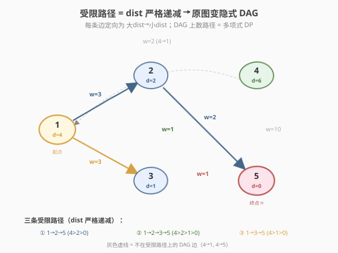
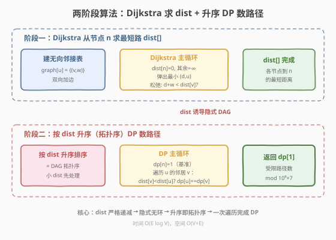
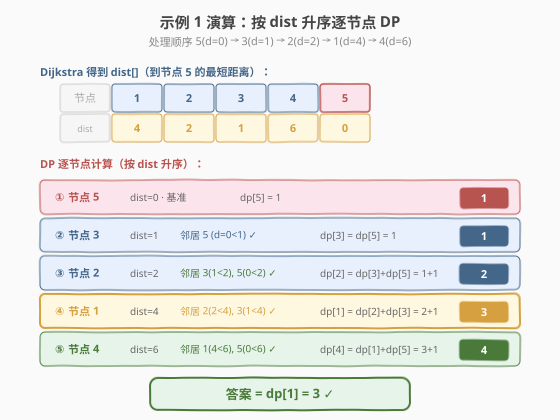

# 从第一个节点出发到最后一个节点的受限路径数

- **题目名称**：从第一个节点出发到最后一个节点的受限路径数
- **链接**：[1786. 从第一个节点出发到最后一个节点的受限路径数](https://leetcode.cn/problems/number-of-restricted-paths-from-first-to-last-node/)
- **难度**：中等
- **标签**：图、最短路径、Dijkstra、动态规划、拓扑排序

## 1. 题目概述

给定一个 $n$ 个节点的**加权无向连通图**，节点编号 $1$ 到 $n$。边列表 `edges` 中每条 `[u, v, weight]` 表示节点 $u$、$v$ 间一条权重为 `weight` 的边。

定义 `distanceToLastNode(x)` 为节点 $x$ 到节点 $n$ 的**最短距离**。一条从节点 $1$ 到节点 $n$ 的路径 $[z_0, z_1, \dots, z_k]$（$z_0 = 1$, $z_k = n$）称为**受限路径**，当且仅当路径上每一步的 dist 严格递减：

$$\text{distanceToLastNode}(z_i) > \text{distanceToLastNode}(z_{i+1}), \quad 0 \le i < k$$

返回从节点 $1$ 到节点 $n$ 的受限路径数，对 $10^9 + 7$ 取余。

**示例 1**：

```text
输入：n = 5, edges = [[1,2,3],[1,3,3],[2,3,1],[1,4,2],[5,2,2],[3,5,1],[5,4,10]]
输出：3
解释：dist = [_, 4, 2, 1, 6, 0]，三条受限路径：
  1) 1 → 2 → 5        (dist: 4 > 2 > 0)
  2) 1 → 2 → 3 → 5    (dist: 4 > 2 > 1 > 0)
  3) 1 → 3 → 5        (dist: 4 > 1 > 0)
```

**示例 2**：

```text
输入：n = 7, edges = [[1,3,1],[4,1,2],[7,3,4],[2,5,3],[5,6,1],[6,7,2],[7,5,3],[2,6,4]]
输出：1
解释：dist = [_, 5, 6, 4, 7, 3, 2, 0]，唯一受限路径：1 → 3 → 7 (dist: 5 > 4 > 0)
```

**约束条件**：

- $1 \le n \le 2 \times 10^4$
- $n - 1 \le \text{edges.length} \le 4 \times 10^4$
- $1 \le u_i, v_i \le n$，$u_i \ne v_i$
- $1 \le \text{weight}_i \le 10^5$
- 任意两节点间至多一条边，至少存在一条路径

> 💡 **关键拆解**：问题分两步——先求每个节点到 $n$ 的最短距离 `dist[]`，再在 dist 严格递减的约束下数路径。前者是经典 Dijkstra，后者是在隐式 DAG 上做路径计数 DP。

---

## 2. 解题思路

### 2.1 暴力思路：枚举所有路径

最直觉的做法：穷举节点 $1$ 到 $n$ 的所有路径，逐条检查 dist 是否严格递减。

问题显而易见：

1. **路径数指数级**：无向图中两节点间的路径数随节点数指数增长，$n \le 2 \times 10^4$ 时完全不可行；
2. **重复子问题**：从某节点 $u$ 到 $n$ 的受限路径数会被多条上游路径反复查询，每次重新计算纯属浪费。

> ⚠️ **症结**：「枚举所有路径」与「只需计数」目标错配。正确的做法是识别出**最优子结构**：从 $u$ 到 $n$ 的受限路径数 = 所有用一步降到更小 dist 的邻居 $v$ 到 $n$ 的受限路径数之和。这是典型的 DAG 路径计数 DP。

### 2.2 核心观察：Dijkstra + 隐式 DAG 上的路径计数 DP



**三个关键洞察**：

1. **dist 的计算 = 单源最短路**：`distanceToLastNode(x)` 就是节点 $x$ 到 $n$ 的最短距离。由于图是无向的，$x$ 到 $n$ 的最短距离 = $n$ 到 $x$ 的最短距离，故只需从 $n$ 跑一次 **Dijkstra** 即可得到所有节点的 `dist[]`。

2. **受限条件构造隐式 DAG**：原无向图可能有环，直接数路径会陷入循环。但受限条件「dist 严格递减」将每条边定向为「大 dist → 小 dist」，原图被转化为一个**有向无环图（DAG）**——因为 dist 严格递减的路径不可能回到已访问的节点。在 DAG 上数路径是经典的多项式 DP。

3. **dist 升序 = 拓扑序**：将节点按 `dist` **从小到大**排序，恰好给出该隐式 DAG 的一个拓扑序。处理节点 $u$ 时，所有 `dist[v] < dist[u]` 的邻居 $v$ 都已计算完毕，`dp[v]` 已是最终值，直接累加即可。

> 💡 **DAG 路径计数的转移方程**：
> $$\text{dp}[n] = 1, \qquad \text{dp}[u] = \sum_{\substack{v \in \text{neighbors}(u) \\ \text{dist}[v] < \text{dist}[u]}} \text{dp}[v] \pmod{10^9+7}$$
> 答案为 $\text{dp}[1]$。

> ⚠️ **dist 相等的节点之间无边**：受限条件要求**严格**递减，`dist[u] == dist[v]` 的邻居对不贡献路径。故拓扑序中相等 dist 的节点相对顺序无关紧要——它们之间没有 DAG 边。

### 2.3 算法流程图



**两阶段流程**：

**阶段一：Dijkstra 从节点 $n$ 求最短路**

1. 建无向邻接表；
2. 初始化 `dist[n] = 0`，其余为 $\infty$，最小堆入 `(0, n)`；
3. 每次弹出 dist 最小的节点 $u$，松弛其所有邻居：若 `dist[u] + w < dist[v]`，更新并入堆；
4. 堆空后得到所有节点的 `dist[]`。

**阶段二：按 dist 升序 DP 数路径**

1. 将节点 $1 \dots n$ 按 `dist` 升序排序；
2. `dp[n] = 1`（终点到自身有一条空路径）；
3. 依序处理每个节点 $u$（跳过 $n$）：遍历 $u$ 的邻居 $v$，若 `dist[v] < dist[u]`，则 `dp[u] = (dp[u] + dp[v]) % MOD`；
4. 返回 `dp[1]`。

### 2.4 示例演算

以示例 1 为例，$n = 5$，Dijkstra 从节点 5 出发得到：

| 节点 | 1 | 2 | 3 | 4 | 5 |
|------|---|---|---|---|---|
| dist | 4 | 2 | 1 | 6 | 0 |

按 dist 升序处理：$5(0) \to 3(1) \to 2(2) \to 1(4) \to 4(6)$。



| 处理节点 | dist | 有效邻居（dist 更小） | dp 计算 | dp 值 |
|---------|------|---------------------|---------|-------|
| 5 | 0 | — | 基准：dp[5]=1 | 1 |
| 3 | 1 | 5 (dist 0 < 1) | dp[3] = dp[5] = 1 | 1 |
| 2 | 2 | 3 (1<2), 5 (0<2) | dp[2] = dp[3]+dp[5] = 1+1 = 2 | 2 |
| 1 | 4 | 2 (2<4), 3 (1<4) | dp[1] = dp[2]+dp[3] = 2+1 = 3 | **3** |
| 4 | 6 | 1 (4<6), 5 (0<6) | dp[4] = dp[1]+dp[5] = 3+1 = 4 | 4（非所求）|

最终答案 `dp[1] = 3` ✓。

> 💡 **关键转折**：处理节点 1 时，它的邻居 2 和 3 都有更小的 dist，且 dp[2]、dp[3] 均已在前面步骤算好。这正是「dist 升序 = 拓扑序」的威力——**无需显式建 DAG、无需拓扑排序算法**，排序天然给出处理顺序。

---

## 3. 参考代码

### C++

```cpp
class Solution {
public:
    int countRestrictedPaths(int n, vector<vector<int>>& edges) {
        vector<vector<pair<int,int>>> graph(n + 1);
        for (auto& e : edges) {
            graph[e[0]].push_back({e[1], e[2]});
            graph[e[1]].push_back({e[0], e[2]});
        }

        const int INF = INT_MAX / 2;
        vector<int> dist(n + 1, INF);
        dist[n] = 0;
        priority_queue<pair<int,int>, vector<pair<int,int>>, greater<>> pq;
        pq.push({0, n});
        while (!pq.empty()) {
            auto [d, u] = pq.top(); pq.pop();
            if (d > dist[u]) continue;
            for (auto& [v, w] : graph[u]) {
                int nd = d + w;
                if (nd < dist[v]) {
                    dist[v] = nd;
                    pq.push({nd, v});
                }
            }
        }

        vector<int> nodes(n);
        iota(nodes.begin(), nodes.end(), 1);
        sort(nodes.begin(), nodes.end(), [&](int a, int b) {
            return dist[a] < dist[b];
        });

        const int MOD = 1e9 + 7;
        vector<int> dp(n + 1, 0);
        dp[n] = 1;
        for (int u : nodes) {
            if (u == n) continue;
            for (auto& [v, w] : graph[u]) {
                if (dist[v] < dist[u]) {
                    dp[u] = (dp[u] + dp[v]) % MOD;
                }
            }
        }
        return dp[1];
    }
};
```

### Python

```python
class Solution:
    def countRestrictedPaths(self, n: int, edges: List[List[int]]) -> int:
        graph = [[] for _ in range(n + 1)]
        for u, v, w in edges:
            graph[u].append((v, w))
            graph[v].append((u, w))

        dist = [float('inf')] * (n + 1)
        dist[n] = 0
        pq = [(0, n)]
        while pq:
            d, u = heapq.heappop(pq)
            if d > dist[u]:
                continue
            for v, w in graph[u]:
                nd = d + w
                if nd < dist[v]:
                    dist[v] = nd
                    heapq.heappush(pq, (nd, v))

        nodes = sorted(range(1, n + 1), key=lambda x: dist[x])
        MOD = 10**9 + 7
        dp = [0] * (n + 1)
        dp[n] = 1
        for u in nodes:
            if u == n:
                continue
            for v, w in graph[u]:
                if dist[v] < dist[u]:
                    dp[u] = (dp[u] + dp[v]) % MOD
        return dp[1]
```

> 💡 **两阶段复用同一邻接表**：Dijkstra 阶段用邻接表松弛出边，DP 阶段用同一邻接表枚举邻居检查 `dist[v] < dist[u]`。无需为隐式 DAG 额外建图——原图的边 + dist 比较即隐式 DAG 的边。

> ⚠️ **取模时机**：每次累加后立即 `% MOD`，避免连续累加导致 `int` 溢出。C++ 中两个 $< 10^9+7$ 的数相加不超过 $2 \times 10^9$，仍在 `int` 范围内（$\approx 2.1 \times 10^9$），但多次累加前必须先取模。

---

## 4. 复杂度分析

| 维度 | 复杂度 | 说明 |
|------|--------|------|
| 时间 | $O(E \log V + V \log V)$ | Dijkstra $O(E \log V)$；排序 $O(V \log V)$；DP 遍历每条边一次 $O(E)$。总计以 Dijkstra 为主 |
| 空间 | $O(V + E)$ | 邻接表 $O(E)$、dist 与 dp 数组 $O(V)$、堆最坏 $O(E)$ |

> 💡 **$n \le 2 \times 10^4$，$E \le 4 \times 10^4$**：Dijkstra 约 $4 \times 10^4 \times 15 \approx 6 \times 10^5$ 次操作，DP 约 $4 \times 10^4$ 次，远在时限内。

---

## 5. 扩展：为何不能用 DFS + 记忆化直接做？

有人可能想：既然最终是 DP，能否直接 DFS + memo，不先排序？

**可以，但需要先有 dist**。DFS 的递归顺序是「从 1 向下探索」，依赖 `dp[v]` 时若 $v$ 尚未计算则递归计算 $v$。由于 dist 严格递减保证无环，递归必然终止。这等价于「记忆化 DFS = 后序 DP」，排序只是把递归改成了迭代。

两种写法等价，区别仅在：

- **排序 + 迭代 DP**（本文）：显式拓扑序，无递归栈溢出风险，$n = 2 \times 10^4$ 时安全。
- **DFS + memo**：代码更短，但递归深度可达 $O(V)$，Python 需提高递归上限（`sys.setrecursionlimit`）。

> 💡 **通用模式**：「最短路 + 路径计数」是一类经典题型。先 Dijkstra 求最短距离，再在最短距离诱导的 DAG 上做 DP。转移方程统一为 `dp[u] = Σ dp[v]`，其中 $v$ 满足某种基于 dist 的约束。

---

## 6. 面试要点

**Q1：为什么从节点 $n$ 而不是节点 $1$ 跑 Dijkstra？**
> 因为 `distanceToLastNode(x)` 是 $x$ 到 $n$ 的最短距离。由于图是无向的，$x$ 到 $n$ 的最短距离 = $n$ 到 $x$ 的最短距离。从 $n$ 跑一次 Dijkstra 即可得到所有节点的 dist，无需对每个节点各跑一次。

**Q2：为什么按 dist 升序处理就能保证 DP 正确？**
> 受限条件要求 dist 严格递减，等价于在隐式 DAG 上从大 dist 指向小 dist。按 dist 升序处理，处理节点 $u$ 时所有 `dist[v] < dist[u]` 的邻居 $v$ 都已算完，`dp[v]` 是最终值。dist 升序天然就是该 DAG 的拓扑序。

**Q3：dist 相等的两个节点之间能走吗？**
> 不能。受限条件要求**严格**递减（$>$），`dist[u] == dist[v]` 不满足。因此隐式 DAG 中相等 dist 的节点间无边，排序时它们的相对顺序不影响结果。

**Q4：为什么原无向图可能有环，但 DP 不会死循环？**
> 隐式 DAG 的每条边都从大 dist 指向小 dist，dist 严格递减意味着路径上不可能出现重复节点（同一节点的 dist 值唯一），故无环。DAG 上的 DP 天然终止。

**Q5：如果图中有负权边怎么办？**
> Dijkstra 要求非负权。本题保证 $1 \le \text{weight} \le 10^5$，全正权。若有负权，需换 Bellman-Ford 求 dist；DP 部分的逻辑不变（严格递减仍保证 DAG 性质），但需确认 dist 的正确性。

> 💡 **一句话总结**：Dijkstra 从 $n$ 求 dist → 按 dist 升序（拓扑序）→ `dp[u] = Σ dp[v]`（dist 更小的邻居）→ 返回 `dp[1]`，$O(E \log V)$ 时间。

---

## 7. 同类练习题

- [1976. 到达目的地的方案数](https://leetcode.cn/problems/number-of-ways-to-arrive-at-destination/)：**最同构的姊妹题**——Dijkstra 求最短路后，在最短路径 DAG 上数路径条数。与本题「dist 递减约束数路径」结构完全一致，只是约束从「严格递减」换成「在最短路径上」
- [743. 网络延迟时间](https://leetcode.cn/problems/network-delay-time/)（[题解](../0701-0800/743_网络延迟时间.md)）：堆优化 Dijkstra 单源最短路的母题，本题阶段一直接复用其模板
- [1514. 概率最大的路径](https://leetcode.cn/problems/path-with-maximum-probability/)：Dijkstra 变体（最长路 + 取大堆），体会 Dijkstra 框架对「最大/最小」目标的通用性
- [787. K 站中转内最便宜的航班](https://leetcode.cn/problems/cheapest-flights-within-k-stops/)（[题解](../0701-0800/787_K站中转内最便宜的航班.md)）：限制松弛 Bellman-Ford，对照理解「带约束的最短路」与「带约束的路径计数」的差异
- [1631. 最小体力消耗路径](https://leetcode.cn/problems/path-with-minimum-effort/)：Dijkstra 变体，路径代价定义为边上最大权差，拓展对「路径代价定义」的理解
