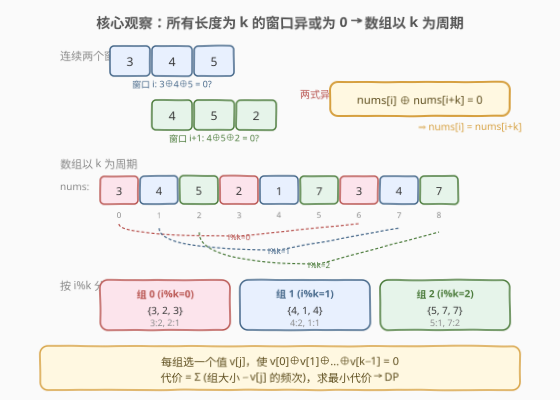
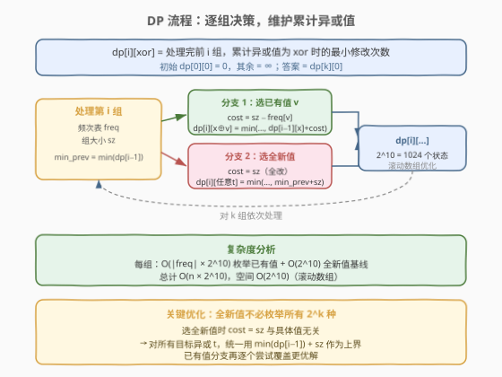
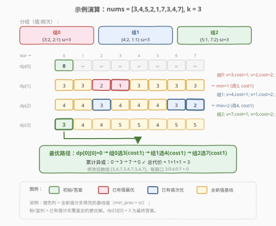

# 使所有区间的异或结果为零

- **题目名称**：使所有区间的异或结果为零
- **链接**：[1787. 使所有区间的异或结果为零](https://leetcode.cn/problems/make-the-xor-of-all-segments-equal-to-zero/)
- **难度**：困难
- **标签**：动态规划、位运算、数组

## 1. 题目概述

给定一个整数数组 `nums` 和一个整数 `k`。区间 `[left, right]`（$left \le right$）的**异或结果**是对该区间内所有元素做 XOR 运算的结果。要求修改**最少的元素个数**，使得数组中**所有长度为 $k$ 的区间**的异或结果都等于零。每个元素可修改为 $[0, 2^{10} - 1]$ 范围内的任意整数。

> 💡 注意：不是让整个数组的异或为零，而是让**每个长度为 $k$ 的滑动窗口**的异或都为零。这比单一异或约束强得多。

**示例 1**：

```text
输入：nums = [1,2,0,3,0], k = 1
输出：3
解释：k=1 时每个窗口就是单个元素，所有元素都必须为 0。
      将 [1,2,0,3,0] 改为 [0,0,0,0,0]，改 3 个。
```

**示例 2**：

```text
输入：nums = [3,4,5,2,1,7,3,4,7], k = 3
输出：3
解释：将数组改为 [3,4,7,3,4,7,3,4,7]，
      每个长度 3 的窗口：3⊕4⊕7 = 0。
```

**示例 3**：

```text
输入：nums = [1,2,4,1,2,5,1,2,6], k = 3
输出：3
解释：将数组改为 [1,2,3,1,2,3,1,2,3]，
      前两组已满足（1,2 各出现 3 次），第三组全改为 3。
```

**约束条件**：

- $1 \le k \le \text{nums.length} \le 2000$
- $0 \le \text{nums}[i] \lt 2^{10}$

---

## 2. 解题思路

### 2.1 暴力思路：枚举每个位置的值

直接枚举数组每个位置的新值（$2^{10}$ 种），验证所有 $k$-窗口异或是否为零。组合数高达 $2^{10n}$，完全不可行。

> ⚠️ **症结**：窗口之间有大量重叠，独立枚举每个位置忽略了窗口间的约束关系。突破口在于挖掘「所有 $k$-窗口异或为零」这一条件的**结构性结论**。

### 2.2 核心观察：数组以 $k$ 为周期



**关键推导**：

设所有长度为 $k$ 的窗口异或为零。对**相邻两个窗口** $i$ 和 $i+1$：

$$\text{nums}[i] \oplus \text{nums}[i+1] \oplus \cdots \oplus \text{nums}[i+k-1] = 0$$

$$\text{nums}[i+1] \oplus \text{nums}[i+2] \oplus \cdots \oplus \text{nums}[i+k] = 0$$

两式异或，消去重叠部分，得：

$$\text{nums}[i] \oplus \text{nums}[i+k] = 0 \quad \Longrightarrow \quad \text{nums}[i] = \text{nums}[i+k]$$

> 💡 **结论**：数组必须以 $k$ 为周期——$\text{nums}[i] = \text{nums}[i \bmod k]$。只要确定前 $k$ 个位置的值，整个数组就被确定。

**问题归约**：

1. **分组**：按 $i \bmod k$ 将数组分为 $k$ 组，同组元素最终取**相同值**。
2. **约束**：$k$ 组的取值 $v_0, v_1, \ldots, v_{k-1}$ 满足 $v_0 \oplus v_1 \oplus \cdots \oplus v_{k-1} = 0$（即一个 $k$-窗口的异或）。
3. **代价**：组 $j$ 取值 $v$ 时，需修改该组中所有 $\ne v$ 的元素，代价 = $\text{sz}_j - \text{freq}_j[v]$。
4. **目标**：最小化总代价。

### 2.3 算法流程图：动态规划



**状态定义**：

$$\text{dp}[i][\text{xor}] = \text{处理完前 } i \text{ 组，累计异或值为 xor 时的最小修改次数}$$

**状态转移**（处理第 $i$ 组）：

| 分支 | 操作 | 代价 | 目标状态 |
|------|------|------|----------|
| **选已有值 $v$** | 组内保留值为 $v$ 的元素，其余修改 | $\text{sz}_i - \text{freq}_i[v]$ | $\text{dp}[i][\text{xor} \oplus v] = \min(\ldots, \text{dp}[i-1][\text{xor}] + \text{cost})$ |
| **选全新值** | 组内全部修改为同一个新值 | $\text{sz}_i$ | 对任意目标 $t$：$\text{dp}[i][t] = \min(\ldots, \min(\text{dp}[i-1][]) + \text{sz}_i)$ |

> 💡 **关键优化**：「选全新值」分支中，代价恒为 $\text{sz}_i$，与具体选哪个值无关。因此无需枚举 $2^{10}$ 种新值——只需用 $\min(\text{dp}[i-1][]) + \text{sz}_i$ 作为所有目标异或值的**统一上界**，再由「已有值」分支逐个覆盖更优解。

**边界与答案**：

- 初始：$\text{dp}[0][0] = 0$，其余 $= \infty$。
- 答案：$\text{dp}[k][0]$（$k$ 组累计异或为零）。

### 2.4 示例演算

以示例 2 `nums = [3,4,5,2,1,7,3,4,7], k = 3` 为例：



分组结果：

| 组 | 元素 | 频次表 | 大小 |
|----|------|--------|------|
| 0 | {3, 2, 3} | 3:2, 2:1 | 3 |
| 1 | {4, 1, 4} | 4:2, 1:1 | 3 |
| 2 | {5, 7, 7} | 5:1, 7:2 | 3 |

异或值域 $[0, 2^3) = [0, 7]$，共 8 个状态。

**dp[0]**：`[0, ∞, ∞, ∞, ∞, ∞, ∞, ∞]`

**处理组 0**（已有值 3→cost1, 2→cost2；全新值→cost3）：
- `dp[1][3] = dp[0][0]+1 = 1`（选 3）
- `dp[1][2] = dp[0][0]+2 = 2`（选 2）
- 其余 `dp[1][t] = 0+3 = 3`（全新值基线）

`dp[1]` = `[3, 3, 2, 1, 3, 3, 3, 3]`，min=1（xor=3，选 3）

**处理组 1**（已有值 4→cost1, 1→cost2；全新值→cost 1+3=4）：
- 选 4：`dp[2][3^4=7] = 1+1 = 2`（从 dp[1][3] 出发）
- 选 1：`dp[2][3^1=2] = 1+2 = 3`（从 dp[1][3] 出发）
- 其余由基线 4 覆盖

`dp[2]` = `[4, 4, 3, 4, 4, 4, 3, 2]`，min=2（xor=7，累计 3⊕4=7）

**处理组 2**（已有值 7→cost1, 5→cost2；全新值→cost 2+3=5）：
- 选 7：`dp[3][7^7=0] = 2+1 = 3`（从 dp[2][7] 出发）← **答案！**
- 选 5：`dp[3][7^5=2] = 2+2 = 4`
- 其余由基线 5 覆盖

`dp[3]` = `[3, 4, 4, 5, 5, 4, 5, 5]`

> 💡 **最优路径**：组0选3(cost1) → 组1选4(cost1) → 组2选7(cost1)，累计异或 0→3→7→0，总代价 **3**。修改后数组 `[3,4,7,3,4,7,3,4,7]`，验证：$3 \oplus 4 \oplus 7 = 0$ ✓

---

## 3. 参考代码

### C++

```cpp
class Solution {
  public:
    int minChanges(vector<int>& nums, int k) {
        int n = nums.size();
        int m = 1 << 10;  // 值域 [0, 2^10)，异或状态空间 2^10 = 1024

        // dp[xor] = 当前累计异或为 xor 时的最小修改次数（滚动数组）
        vector<int> dp(m, 1e9);
        dp[0] = 0;

        for (int i = 0; i < k; i++) {
            // 统计第 i 组的频次与大小
            unordered_map<int, int> freq;
            int sz = 0;
            for (int j = i; j < n; j += k) {
                freq[nums[j]]++;
                sz++;
            }

            // 全新值基线：min(dp) + sz
            int min_prev = *min_element(dp.begin(), dp.end());
            vector<int> ndp(m, min_prev + sz);

            // 已有值分支：逐个尝试覆盖更优解
            for (auto& [v, cnt] : freq) {
                int cost = sz - cnt;
                for (int x = 0; x < m; x++) {
                    ndp[x ^ v] = min(ndp[x ^ v], dp[x] + cost);
                }
            }

            dp = move(ndp);
        }

        return dp[0];
    }
};
```

### Python

```python
class Solution:
    def minChanges(self, nums: List[int], k: int) -> int:
        n = len(nums)
        m = 1 << 10  # 值域 [0, 2^10)，异或状态空间 2^10 = 1024

        dp = [float('inf')] * m
        dp[0] = 0

        for i in range(k):
            # 统计第 i 组的频次与大小
            freq = {}
            sz = 0
            for j in range(i, n, k):
                freq[nums[j]] = freq.get(nums[j], 0) + 1
                sz += 1

            # 全新值基线
            min_prev = min(dp)
            ndp = [min_prev + sz] * m

            # 已有值分支
            for v, cnt in freq.items():
                cost = sz - cnt
                for x in range(m):
                    val = dp[x] + cost
                    if val < ndp[x ^ v]:
                        ndp[x ^ v] = val

            dp = ndp

        return dp[0]
```

> 💡 **实现要点**：先用「全新值基线」`min_prev + sz` 填满 `ndp`，再用已有值分支逐个覆盖。这样无需判断「目标值是否在组内」，逻辑统一且高效。

---

## 4. 复杂度分析

| 维度 | 复杂度 | 说明 |
|------|--------|------|
| 时间复杂度 | $O(n \cdot 2^{10})$ | 每组枚举已有值 $O(\frac{n}{k} \cdot 2^{10})$，$k$ 组合计 $O(n \cdot 2^{10})$；全新值基线 $O(k \cdot 2^{10})$ |
| 空间复杂度 | $O(2^{10})$ | 滚动数组，仅保留当前与上一行，共 $2 \times 2^{10}$ |

> ⚠️ 本题 $n \le 2000$，值域 $2^{10} = 1024$，总运算量约 $2 \times 10^6$，在时间限制内轻松通过。异或状态空间由**值域** $2^{10}$ 决定，与 $k$ 无关。

---

## 5. 扩展：为什么不能贪心？

直觉上可能想贪心——每组选频次最高的值，再调整最后一组使异或为零。但这样做**无法保证全局最优**：

- 前面 $k-1$ 组贪心选了最高频值，累计异或可能使得最后一组必须选一个不存在于该组的值（代价 = 组大小），总代价未必更优。
- 反之，某组放弃最高频值（多改 1 个），可能让后面某组少改很多个。

**举例**：若前 $k-1$ 组各自最高频值的异或恰好等于最后一组中频次最高的值，贪心恰好最优；但若异或结果落在最后一组中频次最低的值上，贪心就会差于 DP 的全局最优。

> 💡 本题是典型的「**局部贪心不成立 → 需全局 DP**」案例：每组的选择通过异或耦合在一起，必须联合决策。

---

## 6. 面试要点

1. **如何发现「数组以 $k$ 为周期」这一结论？**

   从相邻窗口入手。窗口 $i$ 和 $i+1$ 各自异或为零，两式异或消去重叠的 $k-1$ 个元素，只剩 $\text{nums}[i] \oplus \text{nums}[i+k] = 0$，即 $\text{nums}[i] = \text{nums}[i+k]$。这是「窗口异或为零」的**充要条件**，直接将问题从 $n$ 维降为 $k$ 维。

2. **DP 的状态为什么是异或值而非具体取值？**

   我们关心的是「前 $i$ 组取值的异或」是否能为某个目标值，而非具体取了什么值——因为后续组的约束只通过异或传递。异或值域 $2^{10} = 1024$（由题设值域决定，与 $k$ 无关）远小于具体取值组合数，状态空间可控。

3. **「全新值」分支为什么不需要枚举？**

   选一个不在组内的值时，代价恒为组大小 $\text{sz}$，且可以通过适当选取该值使异或贡献为任意目标。因此对所有目标异或 $t$，统一用 $\min(\text{dp}[i-1][]) + \text{sz}$ 作上界即可，$O(2^{10})$ 一次填完。

4. **如果 $k$ 很大（如 $k = n$）怎么办？**

   此时只有一组，所有元素必须相同且该值异或自身为零（任意值都满足），代价 = $n - \max(\text{freq})$。DP 依然正确：一组处理后 $\text{dp}[1][0] = n - \max(\text{freq})$。异或状态空间恒为 $2^{10} = 1024$（由值域决定），与 $k$ 大小无关，故 $k = n$ 时 DP 仍然高效。

5. **滚动数组为什么可行？**

   $\text{dp}[i]$ 只依赖 $\text{dp}[i-1]$，无回溯需求。用两个数组 `dp`/`ndp` 交替即可，空间从 $O(k \cdot 2^{10})$ 降为 $O(2^{10})$。

---

## 7. 同类练习题

- [1720. 解码异或后的数组](https://leetcode.cn/problems/decode-xored-array/)：异或基础题，已知前缀异或反推原数组，帮助熟悉异或的可逆性
- [1734. 解码异或后的排列](https://leetcode.cn/problems/decode-xored-permutation/)：异或推导进阶，利用「全排列异或」性质反推，与本题的「相邻窗口异或消元」同属异或消去思想
- [1707. 与数组中元素的最大异或值](https://leetcode.cn/problems/maximum-xor-with-an-element-from-array/)：异或 + 字典树，从另一个角度考察异或的位运算性质
- [421. 数组中两个数的最大异或值](https://leetcode.cn/problems/maximum-xor-of-two-numbers-in-an-array/)：异或字典树入门，与 1707 对照阅读
- [1442. 形成两个异或相等数组的三元组数目](https://leetcode.cn/problems/count-triplets-that-can-form-two-arrays-with-equal-xor/)：利用异或前缀和性质 $a = b \Leftrightarrow S[r+1] = S[l]$，与本题的相邻窗口异或消元异曲同工
