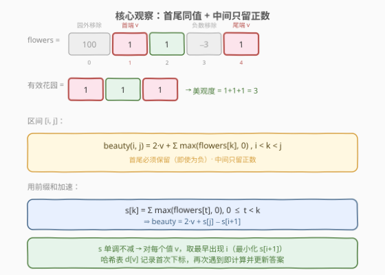
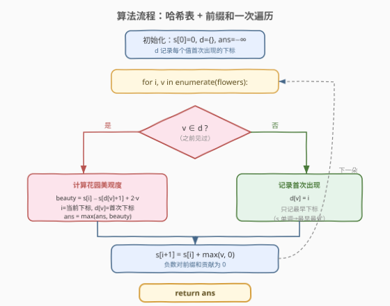
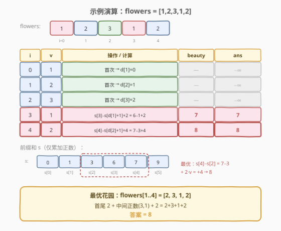

# 最大化花园的美观度

- **题目名称**：最大化花园的美观度
- **链接**：[1788. 最大化花园的美观度](https://leetcode.cn/problems/maximize-the-beauty-of-the-garden/)
- **难度**：困难
- **标签**：贪心、数组、哈希表、前缀和

## 1. 题目概述

有 `n` 朵花排成一行，每朵花有一个整数美观度 `flowers[i]`。你可以**移除**任意朵花（也可以不移除），使得剩下的花构成一个**有效花园**：

- 至少包含两朵花；
- 第一朵花与最后一朵花的美观度**相同**。

花园的美观度 = 剩余所有花的美观度之和。求能得到的**最大**美观度。

> 💡 关键在于「首尾同值」这一约束——它把问题转化为：在所有同值位置对 $(i, j)$ 中，选一对使区间贡献最大。

**示例 1**：

```text
输入：flowers = [1,2,3,1,2]
输出：8
解释：保留 [2,3,1,2]（即下标 1~4），首尾均为 2，美观度 2+3+1+2 = 8。
```

**示例 2**：

```text
输入：flowers = [100,1,1,-3,1]
输出：3
解释：保留 [1,1,1]（下标 1,2,4），首尾均为 1，丢弃 100 和 −3，美观度 1+1+1 = 3。
```

**示例 3**：

```text
输入：flowers = [-1,-2,0,-1]
输出：-2
解释：保留 [-1,-1]（下标 0,3），中间 −2、0 全为非正数丢弃，美观度 -1+(-1) = -2。
```

**约束条件**：

- $2 \le \text{flowers.length} \le 10^5$
- $-10^4 \le \text{flowers}[i] \le 10^4$
- 一定存在某种移除方案使花园有效。

---

## 2. 解题思路

### 2.1 暴力思路：枚举所有同值位置对

对每对满足 $\text{flowers}[i] = \text{flowers}[j]$（$i < j$）的位置，把 $[i, j]$ 区间内的所有正数留下、负数丢弃，计算美观度 $2v + \sum_{i<k<j} \max(\text{flowers}[k], 0)$，取最大值。

> ⚠️ **症结**：同值位置对可达 $O(n^2)$ 对（如全数组同值），$O(n^2)$ 在 $n = 10^5$ 下不可行。需要挖掘「区间贡献」的**单调性**，把两维枚举降为一维扫描。

### 2.2 核心观察：首尾同值 + 中间只留正数



**关键推导**：

有效花园的首尾下标 $i < j$ 满足 $\text{flowers}[i] = \text{flowers}[j] = v$。区间 $(i, j)$ 内的花可以自由取舍——为最大化总和，**只保留正数**、丢弃所有负数。而首尾两朵**必须保留**（否则它们就不是首尾了），即使美观度为负。

因此固定一对 $(i, j)$ 时的最大美观度为：

$$\text{beauty}(i, j) = 2v + \sum_{i < k < j} \max(\text{flowers}[k], 0)$$

**用前缀和加速**：定义 $s[k] = \sum_{0 \le t < k} \max(\text{flowers}[t], 0)$（只累加正数），则：

$$\text{beauty}(i, j) = 2v + s[j] - s[i+1]$$

> 💡 **单调性**：$s$ 是非减的（每步加 $\max(v, 0) \ge 0$）。对固定值 $v$，要让 $s[j] - s[i+1]$ 最大，应取 $j$ 尽量大（最晚出现）、$i+1$ 尽量小（最早出现）。所以**只需记录每个值的首次出现下标**，再次遇到时直接计算并更新答案——后续遇到只会让 $s[j]$ 更大，结果更优。

### 2.3 算法流程图



**一次遍历**完成所有计算：

1. 哈希表 `d` 记录每个美观度的**首次**出现下标。
2. 前缀和 `s` 仅累加正数（负数贡献为 0）。
3. 对位置 $i$ 的花 $v$：
   - 若 $v$ 曾出现（$d[v]$ 存在），计算 $\text{beauty} = s[i] - s[d[v]+1] + 2v$，更新 `ans`；
   - 否则记下首次下标 $d[v] = i$。
4. 无论哪种情况都更新 $s[i+1] = s[i] + \max(v, 0)$。

### 2.4 示例演算

以示例 1 `flowers = [1,2,3,1,2]` 为例：



逐步执行（前缀和只累加正数，故 $s = [0,1,3,6,7,9]$）：

| 步骤 $i$ | $v$ | 操作 | beauty | ans |
|----------|-----|------|--------|-----|
| 0 | 1 | 首次 → $d[1]=0$ | — | $-\infty$ |
| 1 | 2 | 首次 → $d[2]=1$ | — | $-\infty$ |
| 2 | 3 | 首次 → $d[3]=2$ | — | $-\infty$ |
| 3 | 1 | $s[3]-s[1]+2 = 6-1+2$ | 7 | 7 |
| 4 | 2 | $s[4]-s[2]+4 = 7-3+4$ | 8 | **8** |

> 💡 **最优解**：选下标对 $(1, 4)$、值 $v=2$，区间内正数 $3, 1$ 全留，美观度 $2+3+1+2 = 8$。注意下标对 $(0,3)$、值 $1$ 也合法，但美观度仅 $1+2+3+1=7$，被淘汰。

---

## 3. 参考代码

### C++

```cpp
class Solution {
  public:
    int maximumBeauty(vector<int>& flowers) {
        int n = flowers.size();
        vector<int> s(n + 1, 0);
        unordered_map<int, int> d;
        int ans = INT_MIN;
        for (int i = 0; i < n; ++i) {
            int v = flowers[i];
            if (d.count(v)) {
                ans = max(ans, s[i] - s[d[v] + 1] + v * 2);
            } else {
                d[v] = i;
            }
            s[i + 1] = s[i] + max(v, 0);
        }
        return ans;
    }
};
```

### Python

```python
class Solution:
    def maximumBeauty(self, flowers: List[int]) -> int:
        n = len(flowers)
        s = [0] * (n + 1)
        d = {}
        ans = -inf
        for i, v in enumerate(flowers):
            if v in d:
                ans = max(ans, s[i] - s[d[v] + 1] + v * 2)
            else:
                d[v] = i
            s[i + 1] = s[i] + max(v, 0)
        return ans
```

> 💡 **实现要点**：前缀和只累加 $\max(v, 0)$，把负数对区间的贡献「归零」——这正是「中间负花可丢弃」的直接体现。首尾的 $2v$ 即使为负也要加上，因为它们不可丢弃。

---

## 4. 复杂度分析

| 维度 | 复杂度 | 说明 |
|------|--------|------|
| 时间复杂度 | $O(n)$ | 一次遍历，每个元素哈希查/插 $O(1)$，前缀和更新 $O(1)$ |
| 空间复杂度 | $O(n)$ | 前缀和数组 $O(n)$ + 哈希表最坏 $O(n)$（每个值只记首次） |

> ⚠️ 本题 $n \le 10^5$，$O(n)$ 在时间限制内轻松通过。注意 `ans` 初值取 $-\infty$（如 `INT_MIN` / `-inf`），因为答案可能为负（示例 3 输出 $-2$）。

---

## 5. 扩展：为什么只记「首次出现」就够？

直觉上可能担心：对同一个值 $v$ 出现在 $p_1 < p_2 < p_3$ 三处，也许 $(p_2, p_3)$ 比 $(p_1, p_3)$ 更优？实则不然：

- 贡献公式 $\text{beauty} = 2v + s[j] - s[i+1]$ 中，$2v$ 固定。
- $s$ 非减 $\Rightarrow s[p_1+1] \le s[p_2+1]$，故取 $i = p_1$（首次）时 $s[i+1]$ **最小**，使 $s[j] - s[i+1]$ **最大**。
- 而对右端点 $j$，每次遇到 $v$ 都尝试更新 `ans`，最后的（最晚的）$j$ 给出该值的最大 $s[j]$。

因此「首次左端点 + 最晚右端点」天然最优，二者在一次遍历中分别由「只记首次」和「每次都更新」覆盖，无需显式配对。

> 💡 这是典型的「**单调性消去一维枚举**」范式：利用 $s$ 的单调性把 $O(n^2)$ 配对降为 $O(n)$ 扫描，与 [53. 最大子数组和](https://leetcode.cn/problems/maximum-subarray/) 的 Kadane 思想异曲同工。

---

## 6. 面试要点

1. **如何想到「中间只留正数」？**

   首尾必须保留（约束使然），但中间花可自由取舍。要最大化总和，自然保留正数、丢弃负数——把负数对前缀和的贡献置零（$\max(v, 0)$）即编码了这一贪心选择。

2. **答案可能为负，初始值怎么设？**

   示例 3 的最优解是 $-2$（首尾均为 $-1$，中间无正数）。`ans` 必须初始化为 $-\infty$（`INT_MIN` / `float('-inf')`），不能用 $0$，否则会漏掉全负的最优解。

3. **为什么前缀和用 $\max(v, 0)$ 而不是 $v$？**

   若用 $v$，前缀和会包含负数，与「负数可丢弃」的贪心矛盾。用 $\max(v, 0)$ 等价于「在预处理阶段就丢弃所有负花」，区间查询时直接得到「只保留正数」的和。

4. **首尾的两朵花能否也用 $\max(v, 0)$？**

   不能。首尾是有效花园的必要条件，必须保留。公式中 $2v$ 是首尾两朵的原始值，即使 $v < 0$ 也要如实累加——这正是与中间花处理方式的区别。

5. **如果题目改为「首尾可以不同值」会怎样？**

   约束失效，直接保留所有正数即可（若至少两朵正数存在）。本题的难点恰恰来自「首尾同值」这一耦合约束，前缀和 + 哈希表正是为解耦它而生。

---

## 7. 同类练习题

- [53. 最大子数组和](https://leetcode.cn/problems/maximum-subarray/)：前缀和 + 单调性求最大区间和，与本题「$s[j]-s[i+1]$ 最大化」同源，Kadane 入门
- [560. 和为 K 的子数组](https://leetcode.cn/problems/subarray-sum-equals-k/)：前缀和 + 哈希表统计满足约束的区间，哈希表存首次/累计下标的范式对照
- [1524. 和为奇数的子数组数目](https://leetcode.cn/problems/number-of-sub-arrays-with-odd-sum/)：前缀和奇偶性 + 哈希表计数，前缀和思想的不同应用
- [974. 和可被 K 整除的子数组](https://leetcode.cn/problems/subarray-sums-divisible-by-k/)：前缀和同余 + 哈希表，与本题同为「前缀和配对 + 哈希一次扫描」套路
- [325. 和等于 k 的最长子数组](https://leetcode.cn/problems/maximum-size-subarray-sum-equals-k/)：前缀和 + 哈希表只记首次出现以最大化区间长度，与本题「只记首次下标」思路完全一致
