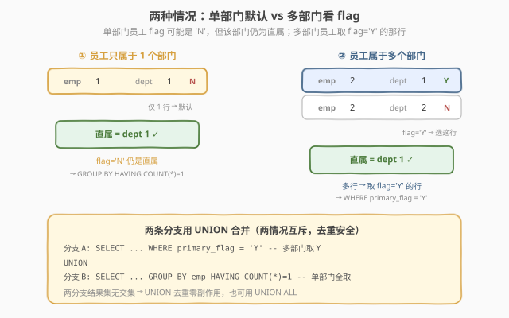
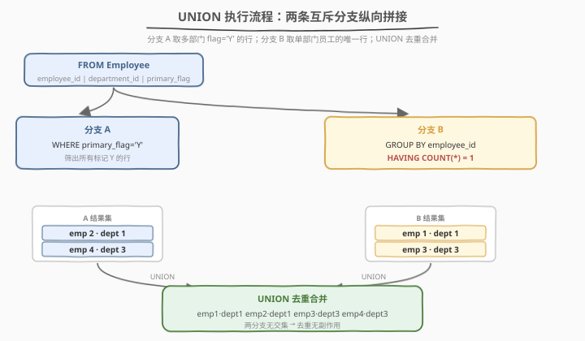
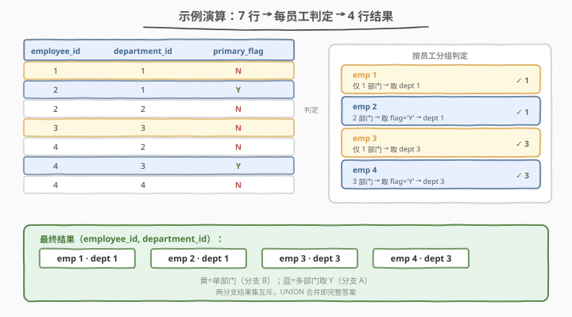

# LeetCode 员工的直属部门 题解

## 1. 题目概述

- **标题 / 题号**：员工的直属部门（#1789，easy）
- **链接**：https://leetcode.cn/problems/primary-department-for-each-employee/
- **难度**：简单
- **标签**：数据库、SQL、`UNION`、`GROUP BY`、`HAVING`、`WHERE`、窗口函数、`COUNT() OVER`

**题意**：给定 `Employee` 表，每行记录一名员工与一个部门的关联关系，以及该部门是否为该员工的直属部门（`primary_flag`，枚举 `'Y'`/`'N'`）。一个员工可以属于多个部门。规则如下：

- 当员工加入**超过一个部门**时，需指定一个直属部门（`primary_flag = 'Y'`）。
- 当员工**只加入一个部门**时，该部门**默认为直属**，即使表中 `primary_flag` 的值为 `'N'`。

要求查出**每位员工的直属部门**，返回 `employee_id` 与 `department_id` 两列，结果无顺序要求。

**表结构**：

```text
Table: Employee
+---------------+---------+
| Column Name   | Type    |
+---------------+---------+
| employee_id   | int     |
| department_id | int     |
| primary_flag  | varchar |
+---------------+---------+
(employee_id, department_id) 是该表的主键。
primary_flag 是枚举类型，取值 ('Y', 'N')。
'Y' 表示该部门是员工的直属部门，'N' 表示否。
```

**示例 1**：

```text
输入：
Employee 表：
+-------------+---------------+--------------+
| employee_id | department_id | primary_flag |
+-------------+---------------+--------------+
| 1           | 1             | N            |
| 2           | 1             | Y            |
| 2           | 2             | N            |
| 3           | 3             | N            |
| 4           | 2             | N            |
| 4           | 3             | Y            |
| 4           | 4             | N            |
+-------------+---------------+--------------+

输出：
+-------------+---------------+
| employee_id | department_id |
+-------------+---------------+
| 1           | 1             |
| 2           | 1             |
| 3           | 3             |
| 4           | 3             |
+-------------+---------------+
```

**解释**：
- 员工 1 只属于部门 1 → 直属 = 1（虽然 flag 为 `N`）
- 员工 2 属于部门 1、2 → 直属 = 1（flag 为 `Y` 的那行）
- 员工 3 只属于部门 3 → 直属 = 3（虽然 flag 为 `N`）
- 员工 4 属于部门 2、3、4 → 直属 = 3（flag 为 `Y` 的那行）

**约束**：

- `(employee_id, department_id)` 为主键，同一「员工-部门」组合至多一行
- `primary_flag` 仅取 `'Y'` 或 `'N'`
- 返回结果顺序无要求

> 💡 本题的陷阱在于「**单部门员工的 `primary_flag` 可能为 `N`**」——不能简单地 `WHERE primary_flag = 'Y'`，否则会漏掉单部门员工。正确思路是把问题拆成**两条互斥分支**：多部门取 `flag='Y'`，单部门全取，再用 `UNION` 合并。

## 2. 解题思路

### 2.1 暴力思路：取回全表后应用层判定

最直觉的过程式做法：`SELECT * FROM Employee` 把整张表读进应用层，按 `employee_id` 分桶，对每个员工数部门个数——若只有 1 个，直接取该部门；若有多个，取 `flag='Y'` 的那行。伪代码：

```text
groups = defaultdict(list)
for row in Employee:
    groups[row.employee_id].append(row)

result = []
for emp, rows in groups.items():
    if len(rows) == 1:
        result.append((emp, rows[0].department_id))
    else:
        for r in rows:
            if r.primary_flag == 'Y':
                result.append((emp, r.department_id))
                break
```

这样做能得出正确答案，但**把判定逻辑推给了应用层**：网络传输全部行、数据库的分组与过滤能力被闲置。正确做法是用 SQL 原生的 `WHERE` + `GROUP BY HAVING` 在引擎层一次完成。

### 2.2 核心观察：两种互斥情况，UNION 拼接



**关键洞察**：题目的判定规则天然分为**两条互斥分支**——

1. **多部门员工**：`COUNT(*) > 1`，直属部门由 `primary_flag = 'Y'` 标记。用 `WHERE primary_flag = 'Y'` 即可筛出。
2. **单部门员工**：`COUNT(*) = 1`，该唯一部门即直属，无视 `primary_flag`。用 `GROUP BY employee_id HAVING COUNT(*) = 1` 筛出。

两分支的**结果集无交集**——一个员工要么属于单部门（分支 B），要么属于多部门（分支 A），不可能同时出现在两个分支中。因此 `UNION` 合并时**去重零副作用**，逻辑清晰。

> 💡 **为什么是 `UNION` 而非 `UNION ALL`？** 两分支互斥，理论上 `UNION` 与 `UNION ALL` 结果相同。但用 `UNION` 更安全——万一数据存在异常（如单部门员工的 `flag='Y'`，两个分支都会返回该行），`UNION` 自动去重保证正确。代价是一次排序去重 $O(n \log n)$，本题数据量小可忽略。

> ⚠️ **陷阱：不能只写 `WHERE primary_flag = 'Y'`**：单部门员工的 `flag` 常为 `N`（题目明说「虽然值为 `N`」），只按 `flag` 筛会漏掉员工 1、3。同理也不能只取每组第一行——多部门时第一行未必是 `Y`。必须把「单部门」作为独立分支处理。

### 2.3 算法流程图



**逻辑执行步骤**：

| 步骤 | 子句 | 作用 |
|------|------|------|
| ① | `FROM Employee`（分支 A） | 读取全部行 |
| ② | `WHERE primary_flag = 'Y'` | 筛出所有标记为直属的行（多部门员工） |
| ③ | `FROM Employee`（分支 B） | 再次读取全部行 |
| ④ | `GROUP BY employee_id HAVING COUNT(*) = 1` | 按员工分组，只保留恰好 1 行的组（单部门员工） |
| ⑤ | `UNION` | 纵向拼接两分支结果并去重 |

> 💡 **分支 B 的 `GROUP BY` 细节**：`HAVING COUNT(*) = 1` 的组内只有一行，`SELECT employee_id, department_id` 直接取该行字段即可——无需聚合函数包裹 `department_id`，因为组内仅一行，MySQL 允许在 `ONLY_FULL_GROUP_BY` 模式下从单行组中直接选取非分组列。

> ⚠️ **`HAVING` vs `WHERE`**：`COUNT(*)` 是聚合函数，必须用 `HAVING` 而非 `WHERE` 过滤——`WHERE` 在分组前过滤行，`HAVING` 在分组后过滤组。本题要按「组内行数」过滤组，只能用 `HAVING`。

### 2.4 示例演算

以示例 1 的 7 行数据为例，观察两条分支如何各取所需：



**分支 A：`WHERE primary_flag = 'Y'`**

| employee_id | department_id | primary_flag | 入选? |
|-------------|---------------|--------------|-------|
| 1 | 1 | N | ✗ |
| 2 | 1 | **Y** | ✓ |
| 2 | 2 | N | ✗ |
| 3 | 3 | N | ✗ |
| 4 | 2 | N | ✗ |
| 4 | 3 | **Y** | ✓ |
| 4 | 4 | N | ✗ |

→ 分支 A 结果：`(2, 1)`、`(4, 3)`

**分支 B：`GROUP BY employee_id HAVING COUNT(*) = 1`**

| employee_id | 行数 | HAVING 入选? | department_id |
|-------------|------|--------------|---------------|
| 1 | 1 | ✓ | 1 |
| 2 | 2 | ✗ | — |
| 3 | 1 | ✓ | 3 |
| 4 | 3 | ✗ | — |

→ 分支 B 结果：`(1, 1)`、`(3, 3)`

**UNION 合并**：`(1,1)`、`(2,1)`、`(3,3)`、`(4,3)` —— 恰好 4 行，无重复。

> 💡 **看员工 1 与员工 3**：他们的 `primary_flag` 都是 `N`，分支 A（按 `flag='Y'` 筛）完全漏掉他们。正是分支 B 的「`HAVING COUNT(*)=1`」兜住了这两行——单部门员工无论 `flag` 是什么，唯一部门即直属。这就是「两分支互补」的核心价值。

## 3. 参考代码

### SQL（解法 A：`UNION` 两分支，推荐）

```sql
SELECT employee_id, department_id
FROM Employee
WHERE primary_flag = 'Y'
UNION
SELECT employee_id, department_id
FROM Employee
GROUP BY employee_id
HAVING COUNT(department_id) = 1;
```

> 💡 **写法要点**：
> - **分支 A `WHERE primary_flag = 'Y'`**：筛出多部门员工中标记为直属的行。
> - **分支 B `GROUP BY employee_id HAVING COUNT(department_id) = 1`**：筛出单部门员工，直接取该唯一部门。
> - **`UNION`**：纵向拼接两分支并去重。两分支互斥，去重无副作用。
> - **`COUNT(department_id)` vs `COUNT(*)`**：因主键保证非空，两者等价；用 `COUNT(department_id)` 语义更明确（数部门数）。
> - ✓ **最推荐**：语义清晰、逻辑分支与题目规则一一对应，MySQL 5.7+/8.0+ 通用。

### SQL（解法 B：`COUNT() OVER` 窗口函数，单次扫描）

```sql
SELECT employee_id, department_id
FROM (
    SELECT employee_id,
           department_id,
           primary_flag,
           COUNT(*) OVER (PARTITION BY employee_id) AS dept_cnt
    FROM Employee
) t
WHERE dept_cnt = 1 OR primary_flag = 'Y';
```

> 💡 **解法 B 的思路**：用 `COUNT(*) OVER (PARTITION BY employee_id)` 为每一行附加「该员工的部门总数」，再在外层用 `WHERE dept_cnt = 1 OR primary_flag = 'Y'` 一次性筛选——单部门取全部、多部门取 `Y`，两种条件用 `OR` 合并。
>
> **与解法 A 的对比**：A 把两种情况写成两个子查询再 `UNION`；B 用窗口函数把「部门数」附加到每行后，用单条 `WHERE` 统一过滤。B 只需**一次扫描**（窗口函数在分组内计算），逻辑更紧凑；A 两次扫描但无需窗口函数支持（MySQL 5.7 也能跑）。
>
> ⚠️ **`OR` 的正确性**：`dept_cnt = 1 OR primary_flag = 'Y'`——单部门行 `dept_cnt=1` 为真，整行入选（无论 `flag`）；多部门行 `dept_cnt>1`，只有 `flag='Y'` 的行入选。两种情况互补，不会多选也不会漏选。

### SQL（解法 C：`NOT EXISTS`，单部门即「无其他部门」）

```sql
SELECT employee_id, department_id
FROM Employee e
WHERE primary_flag = 'Y'
   OR NOT EXISTS (
        SELECT 1 FROM Employee e2
        WHERE e2.employee_id = e.employee_id
          AND e2.department_id <> e.department_id
   );
```

> 💡 **解法 C 的思路**：把「单部门」等价转换为「**不存在另一个不同部门**」——`NOT EXISTS` 子查询找不到同行员工的其他部门，说明该员工只有一个部门，该行即直属。多部门行则靠 `primary_flag = 'Y'` 入选。
>
> **与解法 B 的对比**：两者都用 `OR` 合并两条件，但 C 用**相关子查询**判断「是否单部门」，B 用**窗口函数**预计算部门数。C 无需窗口函数支持（MySQL 5.7 可用），但相关子查询可能多次扫描（取决于优化器是否转化为半连接）；B 一次扫描但需 8.0+ 窗口函数。**小数据量下两者性能接近，优先选可读性最好的 A**。

### Python（pandas）

```python
import pandas as pd

def find_primary_department(employee: pd.DataFrame) -> pd.DataFrame:
    cnt = employee.groupby('employee_id')['department_id'].transform('count')
    mask = (cnt == 1) | (employee['primary_flag'] == 'Y')
    return employee.loc[mask, ['employee_id', 'department_id']]
```

> 💡 **pandas 对照**：
> - `groupby('employee_id')['department_id'].transform('count')` 对应 SQL 的 `COUNT(*) OVER (PARTITION BY employee_id)`——`transform` 把分组聚合结果广播回每行，长度与原 DataFrame 对齐。
> - `(cnt == 1) | (employee['primary_flag'] == 'Y')` 对应 `WHERE dept_cnt = 1 OR primary_flag = 'Y'`——单部门全取，多部门取 `Y`。
> - `&`/`|` 必须用位运算符并加括号分组，这是 pandas 布尔索引的固定写法。

## 4. 复杂度分析

| 维度 | 解法 A（`UNION`） | 解法 B（窗口函数） | 解法 C（`NOT EXISTS`） |
|------|-------------------|---------------------|------------------------|
| **时间** | $O(n)$（两次扫描） | $O(n)$（一次扫描） | $O(n)$（优化器半连接） |
| **空间** | $O(n)$（中间结果） | $O(n)$（窗口中间态） | $O(1)$（无中间表） |
| **MySQL 版本** | ≥ 5.7 | ≥ 8.0 | ≥ 5.7 |
| **推荐度** | ✓ **首选** | ✓ 单次扫描 | ✓ 对照写法 |

> - $n$ = `Employee` 表行数
> - **解法 A**：分支 A 全表扫描 $O(n)$ + 分支 B 分组扫描 $O(n)$，`UNION` 去重排序 $O(n \log n)$（小数据量可忽略）。两次扫描但无窗口函数依赖。
> - **解法 B**：窗口函数 `COUNT(*) OVER` 在分组内线性计算，整体一次扫描 $O(n)$。需 MySQL 8.0+ 支持窗口函数。
> - **解法 C**：相关子查询最坏对每行扫描一次，但优化器通常将其转化为**半连接（semi-join）**，等价为一次扫描 $O(n)$。无中间表物化，空间最优。
> - **数据规模**：本题数据量小（示例 7 行），三种解法性能差异可忽略，**优先选可读性最好的 A**。

## 5. 扩展：UNION vs UNION ALL vs OR

本题两分支互斥，`UNION`、`UNION ALL`、`OR` 三种合并方式都能得到正确结果，但语义和性能有细微差异。

### 5.1 三种合并方式对比

| 方式 | 写法 | 去重 | 性能 | 适用场景 |
|------|------|------|------|----------|
| `UNION` | `A UNION B` | ✓ 排序去重 | $O(n \log n)$ | 两分支**可能有交集**时 |
| `UNION ALL` | `A UNION ALL B` | ✗ 不去重 | $O(n)$ | 两分支**确定无交集**时 |
| `OR`（窗口函数法） | `WHERE cond1 OR cond2` | 天然无重复 | $O(n)$ | 同一查询内合并条件 |

> 💡 **本题用 `UNION` 最稳妥**：虽然两分支逻辑互斥，但若数据异常（单部门员工的 `flag='Y'`），`UNION` 自动去重保证正确。`UNION ALL` 省一次排序但依赖数据完整性假设。解法 B 的 `OR` 写法天然无重复（每行只被判定一次），是性能最优解。

### 5.2 `ONLY_FULL_GROUP_BY` 与分支 B

分支 B 的 `SELECT employee_id, department_id ... GROUP BY employee_id` 在 MySQL 的 `ONLY_FULL_GROUP_BY` 模式下，`department_id` 未出现在 `GROUP BY` 中也未被聚合函数包裹——这是否违规？

**不违规**。因为 `HAVING COUNT(*) = 1` 保证了每组只有一行，`department_id` 在组内**函数依赖于** `employee_id`（单值无歧义）。MySQL 5.7+ 的 `ONLY_FULL_GROUP_BY` 检测器能识别这种「分组后单行」的情况并放行。但若不确定目标数据库的行为，可改用解法 B 的窗口函数写法规避此问题。

### 5.3 数据一致性假设

本题隐含以下数据一致性假设：

| 假设 | 说明 | 若违反 |
|------|------|--------|
| 多部门员工**恰好**有一个 `flag='Y'` | 题目说「需要决定哪个是直属」 | 若有多个 `Y`，分支 A 会返回多行 → 一员工多直属 |
| 单部门员工 `flag` 可为 `Y` 或 `N` | 题目明说「虽然值为 `N`」 | 不影响正确性——分支 B 取唯一行，分支 A 若也命中则 `UNION` 去重 |
| 每位员工至少有一个部门 | 主键 `(emp, dept)` 保证非空 | 无空员工 |

> ⚠️ **生产环境中**，若多部门员工可能**没有** `flag='Y'`（数据缺失），分支 A 会漏掉该员工。此时需加防御性查询：用 `ROW_NUMBER() OVER (PARTITION BY employee_id ORDER BY primary_flag='Y' DESC)` 取每员工首行——有 `Y` 取 `Y`，无 `Y` 取任一行兜底。

## 6. 面试要点

1. **为什么不能只写 `WHERE primary_flag = 'Y'`？**

   > 题目明确说「当员工只加入一个部门时，该部门默认为直属，虽然值为 `N`」。单部门员工的 `flag` 常为 `N`，只按 `flag='Y'` 筛会漏掉他们（如示例的员工 1、3）。必须把「单部门」作为独立分支，用 `GROUP BY HAVING COUNT(*)=1` 兜底。

2. **`UNION` 和 `UNION ALL` 在本题有何区别？用哪个？**

   > `UNION` 去重，`UNION ALL` 不去重。本题两分支逻辑互斥（单部门 vs 多部门），结果集无交集，两者结果相同。但 `UNION` 更安全——若数据异常（单部门员工 `flag='Y'`，两分支都返回该行），`UNION` 自动去重保证正确。性能差异（一次排序去重）在小数据量下可忽略，**优先选 `UNION`**。

3. **`HAVING COUNT(*) = 1` 为什么不能用 `WHERE COUNT(*) = 1`？**

   > `COUNT(*)` 是聚合函数，只在分组后才有意义；`WHERE` 在分组**前**过滤行，此时还没有组、无法计数。`HAVING` 在分组**后**过滤组，才能按「组内行数」筛选。这是 SQL 子句执行顺序的体现：`FROM → WHERE → GROUP BY → HAVING → SELECT`。

4. **窗口函数解法（解法 B）相比 UNION 解法有何优势？**

   > 优势有二：① **单次扫描**——`COUNT(*) OVER` 在分组内计算，无需两次读表；② **逻辑更紧凑**——把「单部门」和「多部门取 Y」统一为一条 `WHERE dept_cnt=1 OR flag='Y'`，无需 `UNION` 拼接。代价是需 MySQL 8.0+ 支持窗口函数。生产环境优先 B，做题/低版本环境用 A。

5. **如果多部门员工可能没有 `flag='Y'`（数据缺失），如何兜底？**

   > 用 `ROW_NUMBER() OVER (PARTITION BY employee_id ORDER BY primary_flag='Y' DESC)` 为每员工的行编号——有 `Y` 时 `Y` 排前（`'Y'<'N'` 字母序相反，用 `DESC` 让 `Y` 的 `rn=1`），无 `Y` 时任一行 `rn=1`。外层 `WHERE rn = 1` 取每员工首行，有 `Y` 取 `Y`、无 `Y` 取任一行兜底。这是「Top-1 per group」的通用模板，比本题的 `UNION` 更健壮。

> 💡 **一句话总结**：1789 的核心是「**两分支互补**」——多部门取 `flag='Y'`、单部门全取，`UNION` 合并。陷阱在于单部门员工的 `flag` 可能为 `N`，不能只靠 `WHERE primary_flag='Y'`。窗口函数解法用 `COUNT() OVER` + `OR` 把两条件统一为单条 `WHERE`，是更紧凑的进阶写法。

## 同类练习题

| # | 题目 | 与本题的关联 |
|---|------|-------------|
| 1777 | [每家商店的产品价格](https://leetcode.cn/problems/products-price-for-each-store/)（[题解](../1701-1800/1777_每家商店的产品价格.md)） | **分组聚合招牌题**——`GROUP BY` + 条件聚合，对照本题的 `GROUP BY HAVING` 按组过滤，体会「分组后筛选组」与「分组后挑值」的差异 |
| 1757 | [可回收且低脂的产品](https://leetcode.cn/problems/recyclable-and-low-fat-products/)（[题解](../1701-1800/1757_可回收且低脂的产品.md)） | **谓词过滤入门**——`WHERE` + `AND`，对照本题的 `WHERE primary_flag='Y'` 分支，巩固行级过滤基础 |
| 1783 | [大满贯数量](https://leetcode.cn/problems/grand-slam-titles/)（[题解](../1701-1800/1783_大满贯数量.md)） | **`UNION ALL` 拍平列**——把宽表多列纵向堆叠成长表再计数，对照本题的 `UNION` 合并两条互斥分支，辨析 `UNION`（去重）与 `UNION ALL`（不去重）的选取时机 |
| 184 | [部门工资最高的员工](https://leetcode.cn/problems/department-highest-salary/) | **Top-1 per group 母题**——`RANK() OVER` 或 `GROUP BY + MAX` 取每组最高薪，是本题「兜底取首行」思想的进阶（第 5 节扩展中的 `ROW_NUMBER` 通用版） |
| 578 | [查询回答率最高的问题 🔒](https://leetcode.cn/problems/get-highest-answer-rate-question/) | `GROUP BY` + `COUNT` 聚合 + 取 Top-1，综合分组聚合与最值选取，巩固「分组后取代表行」的范式 |
