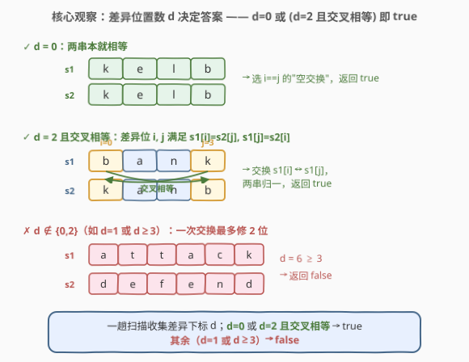
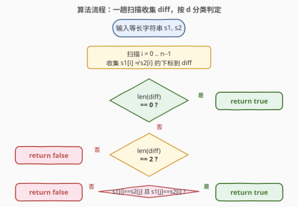
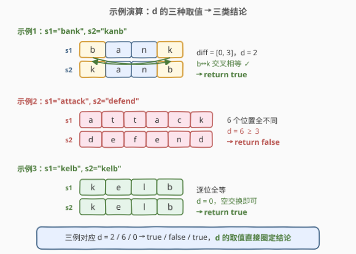

# LeetCode 仅执行一次字符串交换能否使两字符串相等 题解

## 1. 题目概述

- **标题 / 题号**：仅执行一次字符串交换能否使两字符串相等（#1790，easy）
- **链接**：https://leetcode.cn/problems/check-if-one-string-swap-can-make-strings-equal/
- **难度**：简单
- **标签**：字符串、模拟

**题意**：给定两个长度相等的字符串 `s1` 与 `s2`。一次「字符串交换」操作定义为：在**其中一个**字符串里任选两个下标 `i`、`j`（允许 `i == j`，此时相当于不交换），交换这两个位置上的字符。问：是否可以通过在 `s1` 或 `s2` 上**至多执行一次**字符串交换，使两字符串相等？

**示例 1**：

```text
输入：s1 = "bank", s2 = "kanb"
输出：true
解释：在 s1 中交换下标 0 和 3：'b' <-> 'k'，s1 变为 "kanb"，与 s2 相等。
```

**示例 2**：

```text
输入：s1 = "attack", s2 = "defend"
输出：false
解释：差异位置过多，一次交换无法让两串相等。
```

**示例 3**：

```text
输入：s1 = "kelb", s2 = "kelb"
输出：true
解释：两串已相等，0 次交换即可（选 i == j 的"空交换"）。
```

**约束**：

- $1 \le \text{s1.length}, \text{s2.length} \le 100$
- `s1.length == s2.length`
- `s1`、`s2` 仅由小写英文字母组成

> 💡 **关键结构**：题目允许 `i == j`，即"空交换"是合法操作。这把「至多一次」统一成「恰好一次」——0 次差异时，选任意 `i` 做 `i==j` 的空交换即可。于是判定逻辑只关心「差异位置有几个、能否被一次两两交换修复」。

## 2. 解题思路

### 2.1 暴力思路：枚举所有交换对

最直觉的做法：若两串已相等返回 `true`；否则枚举 `s1` 中所有下标对 $(i, j)$（$0 \le i \le j < n$），模拟交换后比较 `s1' == s2`。命中即 `true`，全部枚举完未命中则 `false`。

```text
if s1 == s2: return true
n = len(s1)
for i in range(n):
    for j in range(i+1, n):
        swap s1[i], s1[j]
        if s1 == s2: return true
        swap s1[i], s1[j]   # 恢复
return false
```

时间 $O(n^3)$（$O(n^2)$ 个对，每次比较 $O(n)$）、空间 $O(n)$（构造交换后的串）。$n \le 100$ 时 $10^6$ 级勉强可过，但**完全没必要枚举**——题目结构允许我们把"试所有交换"压成"数差异"。

> ⚠️ **症结**：暴力枚举把"一次交换能修复"理解成「试每一种交换」，但一次交换最多影响两个位置。真正决定能否修复的，是**两串在多少个位置上不同**——差异位置数 $d$ 几乎决定了一切。

### 2.2 核心观察：差异位置数 $d$ 决定答案



把两串逐位比对，收集所有 `s1[i] != s2[i]` 的下标，记其数量为 $d$。一次交换**至多改变两个位置**的取值，故 $d$ 直接圈定可行域：

| $d$ | 可行性 | 说明 |
|-----|--------|------|
| $0$ | ✅ `true` | 两串本就相等，做一次 `i == j` 的空交换即可 |
| $2$ | ⚠️ 待定 | 设差异位为 $i, j$，需 **交叉相等**：$s_1[i] = s_2[j]$ 且 $s_1[j] = s_2[i]$ |
| 其它（$1$ 或 $\ge 3$） | ❌ `false` | 一次交换只能动两个位置，无法修复奇数个或 $\ge 3$ 个差异 |

> 💡 **为什么 $d = 1$ 一定不行？** 设唯一差异位为 $i$：$s_1[i] \ne s_2[i]$，其余位置都相等。要修复 $i$，必须在 $s_1$ 中把 $s_1[i]$ 换成 $s_2[i]$，这意味着要从某个 $s_1[j] = s_2[i]$ 的位置 $j$ 拿字符过来。但 $j \ne i$ 时 $s_1[j] = s_2[j]$（原本相等），换走 $s_1[j]$ 后位置 $j$ 反而变成新的差异位——按下葫芦浮起瓢，差异位数 $d$ 的**奇偶性**在一次交换下不变，故 $d=1$ 永远修不好。
>
> 💡 **对称性**：题目允许在 `s1` 或 `s2` 任一上操作，但 $d$ 与交叉条件关于两串对称（$s_1[i] = s_2[j]$ 与 $s_2[i] = s_1[j]$ 是同一条件的两种表述），故只需在 `s1` 上分析，结论对 `s2` 同样成立。

### 2.3 算法流程图



1. **输入**：等长字符串 `s1`、`s2`。
2. **扫描收集**：遍历 $i = 0 \ldots n-1$，将 `s1[i] != s2[i]` 的下标加入列表 `diff`。
3. **分类判定**：
   - $\text{len(diff)} = 0$ → 返回 `true`；
   - $\text{len(diff)} = 2$，设为 $i, j$：若 $s_1[i] = s_2[j]$ 且 $s_1[j] = s_2[i]$ → `true`，否则 `false`；
   - 其它 → `false`。

单趟扫描 $O(n)$，收集后判定 $O(1)$，整体线性。

### 2.4 示例演算

以三个示例为对照，体会 $d$ 的三种取值如何直接落到三类结论：



**示例 1** `s1 = "bank"`、`s2 = "kanb"`（逐位比对）：

| 位置 $i$ | 0 | 1 | 2 | 3 |
|----------|---|---|---|---|
| `s1[i]` | b | a | n | k |
| `s2[i]` | k | a | n | b |
| 不同？ | ✓ | ✗ | ✗ | ✓ |

`diff = [0, 3]`，$d = 2$。交叉检查：$s_1[0] = \text{b} = s_2[3]$ ✓，$s_1[3] = \text{k} = s_2[0]$ ✓。交换 `s1[0]` 与 `s1[3]` 后 `s1` 变 `"kanb"` = `s2`，返回 `true` ✓。

**示例 2** `s1 = "attack"`、`s2 = "defend"`：逐位 `a≠d, t≠e, t≠f, a≠e, c≠n, k≠d`，`diff` 长度 $d = 6 \ge 3$，一次交换最多修 2 位，返回 `false` ✗。

**示例 3** `s1 = "kelb"`、`s2 = "kelb"`：逐位全等，`diff = []`，$d = 0$，做一次 `i == j` 空交换即可，返回 `true` ✓。

> 💡 **示例 1 的几何直观**：把 `s1` 和 `s2` 的差异位画成两条交叉箭头——$s_1[0] \to s_2[3]$（b 跨到对侧）、$s_1[3] \to s_2[0]$（k 跨到对侧），两条线在中间打了个"结"，解开这个结恰好需要交换 `s1` 的 0、3 两位。这正是「交叉相等」条件的图像化：两个差异位像一对交叉的鞋带，一次交换就是把它们解开。

## 3. 参考代码

### C++

```cpp
class Solution {
public:
    bool areAlmostEqual(string s1, string s2) {
        int n = s1.size();
        vector<int> diff;
        for (int i = 0; i < n; ++i) {
            if (s1[i] != s2[i]) {
                diff.push_back(i);
            }
        }
        if (diff.empty()) return true;
        if (diff.size() != 2) return false;
        int i = diff[0], j = diff[1];
        return s1[i] == s2[j] && s1[j] == s2[i];
    }
};
```

### Python

```python
class Solution:
    def areAlmostEqual(self, s1: str, s2: str) -> bool:
        diff = [i for i in range(len(s1)) if s1[i] != s2[i]]
        if not diff:
            return True
        if len(diff) != 2:
            return False
        i, j = diff
        return s1[i] == s2[j] and s1[j] == s2[i]
```

> 💡 **写法对照**：两版都先一趟扫描收集差异下标，再用 $d$ 的取值分流。C++ 用 `vector<int>` 显式存下标；Python 用列表推导一行收集。核心判定 `s1[i] == s2[j] && s1[j] == s2[i]` 两版完全一致，是本题的"一行真经"。
>
> ⚠️ **别漏 `d == 0` 分支**：题目允许 `i == j` 的空交换，故 `d == 0`（两串本就相等）必须返回 `true`。若误把"恰好一次"理解成"必须交换两个不同位置"，会漏掉示例 3 这类已相等的情况。

## 4. 复杂度分析

| 维度 | 复杂度 | 说明 |
|------|--------|------|
| 时间复杂度 | $O(n)$ | 一趟扫描收集差异下标，每个位置 $O(1)$ 比较；后续判定 $O(1)$ |
| 空间复杂度 | $O(1)$ | `diff` 至多存 2 个下标即会提前终止判定，渐近常数；若不计输出可视为 $O(1)$ |

> 💡 对比暴力枚举 $O(n^3)$：本题把"试每一种交换"降维成"数差异位数"，是典型的「**把组合操作问题转化为不变量分析**」——交换作为操作，其影响范围（2 个位置）决定了不变量 $d$ 的奇偶性与上界，从而把 $O(n^2)$ 级搜索压成 $O(n)$ 级扫描。

## 5. 扩展：允许至多 $k$ 次交换如何推广？

本题是 $k = 1$ 的特例。若放宽为「至多 $k$ 次字符串交换」使两串相等，思路可顺势推广：

- 仍先收集差异下标，得 $d$。
- 一次交换至多修复 2 个差异位，故必要条件为 $d \le 2k$ 且 $d$ 为偶数（奇偶性不变）。
- $d$ 为偶数且 $\le 2k$ 时，还需校验「字符多重集合相同」——即 `s1` 与 `s2` 的字符频率表必须一致（否则无交换方案能配平）。

$k = 1$ 时「字符频率一致」被「交叉相等」这一更强条件天然包含：两个差异位交叉相等意味着 $s_1[i], s_1[j]$ 与 $s_2[i], s_2[j]$ 是同一对字符。推广到 $k > 1$ 时，交叉配对不再唯一，频率一致才是充要的辅助条件。

> 💡 这是「不变量 + 充要条件」组合的典型推广路径：先找操作的不变量（奇偶性、上界），再补上配平条件（频率一致），从特例自然滑向一般。

## 6. 面试要点

**Q1：为什么 $d = 1$ 一定返回 `false`？**
> 一次交换改变两个位置的字符。若只有 1 个差异位，修复它必然要引入第二个被改动的位置，而那个位置原本是相等的，改后反而不等——差异位数 $d$ 在一次交换下奇偶性不变，故 $d = 1$ 无法归零。

**Q2：`d == 0` 为什么返回 `true`？题目不是要求"恰好一次"交换吗？**
> 题目定义的交换允许 `i == j`（选同一个下标交换，等于不交换），即"空交换"是合法操作。故 $d = 0$ 时做一次空交换即可满足"至多一次"。若题面改为"必须交换两个不同下标"，则 $d = 0$ 应返回 `false`——这是面试官常追问的边界。

**Q3：交叉相等条件 `s1[i] == s2[j] && s1[j] == s2[i]` 的直观含义？**
> 两个差异位 $i, j$ 像一对交叉的鞋带：`s1` 在 $i$ 处的字符恰好是 `s2` 在 $j$ 处需要的，`s1` 在 $j$ 处的恰好是 `s2` 在 $i$ 处需要的。交换 `s1` 的 $i, j$ 两位，两条鞋带解开，两串归一。

**Q4：在 `s1` 上做交换和在 `s2` 上做交换，结论会不同吗？**
> 不会。差异下标集合 `diff` 关于两串对称，交叉条件 `s1[i]==s2[j] && s1[j]==s2[i]` 也是对称的（交换 `s1`、`s2` 后条件不变）。故只需分析一边。

**Q5：能否不显式存 `diff`，只用常数空间？**
> 可以。维护两个变量 `first = -1, second = -1` 与一个计数器 `cnt`：扫到差异位时若 `first == -1` 记入 `first`，否则若 `second == -1` 记入 `second`，否则 `cnt` 超过 2 直接返回 `false`。扫完后按 `cnt` 分流判定。空间严格 $O(1)$，但可读性略降。

## 同类练习题

| # | 题目 | 与本题的关联 |
|---|------|-------------|
| 859 | [亲密字符串](https://leetcode.cn/problems/buddy-strings/) | 同为"一次交换使两串相等"的变体，但允许两串相等时需检查是否有重复字符（才能做一次有效交换），是 1790 加上"重复字符"分支的进阶版 |
| 1722 | [执行交换操作后的最小汉明距离](https://leetcode.cn/problems/minimize-hamming-distance-after-swap-operations/)（[题解](../1701-1800/1722_执行交换操作后的最小汉明距离.md)） | 交换可借助并查集连通分量任意多次，求最小汉明距离，是 1790「限定一次交换」推广到「可交换图上任意交换」的版本 |
| 2531 | [使字符串中各字符恰好出现一次的最少交换次数](https://leetcode.cn/problems/make-number-of-distinct-characters-equal/) | 字符串交换 + 字符频率配平的综合题，对照"交换修复差异"与"频率集合相等"两条线索的协作 |
| 1247 | [交换字符使得字符串相等](https://leetcode.cn/problems/minimum-swaps-to-make-strings-equal/) | 在仅含 'x'/'y' 的两串上求使相等的最小交换次数，同属"差异位分析 + 交换配对"，但目标改为最小次数且差异位只有两类字符 |
