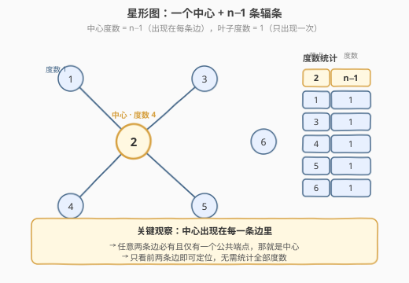
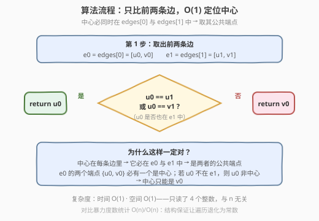
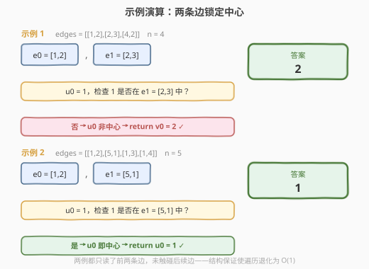

# 找到星形图的中心节点

- **题目名称**：找到星形图的中心节点
- **链接**：[1791. 找到星形图的中心节点](https://leetcode.cn/problems/find-center-of-star-graph/)
- **难度**：简单
- **标签**：图、度数、哈希表

## 1. 题目概述

有一个无向的**星形图**（star graph），由 $n$ 个编号从 $1$ 到 $n$ 的节点组成。星形图的结构是：存在一个**中心节点**，它与其余 $n-1$ 个节点各连一条边，共 $n-1$ 条边，且除中心外任意两节点之间没有边。

给定二维整数数组 `edges`，其中 `edges[i] = [u_i, v_i]` 表示节点 $u_i$ 与 $v_i$ 之间有一条边。请返回该星形图的**中心节点**。

**示例 1**：

```text
输入：n = 4, edges = [[1,2],[2,3],[4,2]]
输出：2
解释：节点 2 与 1、3、4 各连一条边，如上图所示，中心为 2。
```

**示例 2**：

```text
输入：n = 5, edges = [[1,2],[5,1],[1,3],[1,4]]
输出：1
解释：节点 1 与 2、5、3、4 各连一条边，中心为 1。
```

**约束条件**：

- $3 \le n \le 10^5$
- $\text{edges.length} = n - 1$
- $\text{edges}[i].\text{length} = 2$
- $1 \le u_i, v_i \le n$
- $u_i \ne v_i$
- 给定的 `edges` 表示一个合法的星形图

> 💡 **关键结构**：星形图的拓扑是高度受限的——$n-1$ 条边全部**汇于一个中心节点**。这意味着中心节点的**度数**（出现次数）恰为 $n-1$，而每个非中心节点的度数恰为 $1$。更本质地：**中心出现在每一条边里**。这是把「找中心」从「全局统计」降为「局部比较」的信号。

---

## 2. 解题思路

### 2.1 暴力思路：统计每个节点的度数

最直觉的做法是遍历所有边，用哈希表（或数组）累计每个节点出现的次数，再找出度数为 $n-1$ 的那个节点。

```text
deg = defaultdict(int)
for u, v in edges:
    deg[u] += 1
    deg[v] += 1
for node, d in deg.items():
    if d == n - 1:          # 度数为 n-1 的即中心
        return node
```

时间 $O(n)$、空间 $O(n)$（需存 $n$ 个节点的度数）。$n \le 10^5$ 时毫无压力，但**遍历全部边是多余的**——我们只需要找出那个「出现在每条边里」的节点，根本不需要把所有边都数一遍。

> ⚠️ **症结**：暴力把「找中心」当成「先统计全部度数再筛选」。但星形图的结构**保证了中心出现在每一条边里**——这意味着任意两条边都共享中心这一个端点。我们只需取**前两条边**求它们的公共端点，就能锁定中心，无需触碰其余 $n-3$ 条边。把「可由局部确定的量」当作「需全局统计的量」，是遍历浪费的根源。

### 2.2 核心观察：中心出现在每条边里，前两条边的公共端点即中心



关键洞察在于星形图的**结构约束**：中心节点与所有其他节点相连，因此**每条边都包含中心**。反过来，非中心节点只与中心相连，故**只出现在唯一一条边里**。

于是度数分布是极端的二分：

$$
\text{deg}(\text{中心}) = n - 1, \qquad \text{deg}(\text{非中心}) = 1
$$

这个「出现在每条边里」的性质带来一个强结论：**任意两条边的公共端点有且仅有一个，那就是中心**。因为两条边各含一个非中心端点（互不相同），而中心是它们共享的——公共端点只能是中心。

于是只需取前两条边 `e0 = edges[0]`、`e1 = edges[1]`，找它们的公共端点即可。设 `e0 = [u0, v0]`，中心必在 `{u0, v0}` 中（因为中心在 `e0` 里）。只需判断 `u0` 是否也在 `e1` 中：

- 若 $u_0 = u_1$ 或 $u_0 = v_1$：`u0` 在 `e1` 中 → `u0` 是中心；
- 否则：`u0` 不在 `e1` 中 → `u0` 不是中心 → 中心只能是 `v0`。

$$
\text{center} =
\begin{cases}
u_0, & u_0 \in \text{e1} = \{u_1, v_1\} \\[4pt]
v_0, & \text{否则}
\end{cases}
$$

> 💡 **为什么只需前两条边就够？** 中心在每条边里 ⟹ 中心在 `e0` 里且在 `e1` 里 ⟹ 中心是 `e0` 与 `e1` 的公共端点。而星形图中两条边的公共端点**唯一**（就是中心），所以这一步的判定是确定性的，没有歧义。后续 $n-3$ 条边都只是「中心又出现了一次」，对定位中心毫无新增信息。
>
> 💡 **与 684 冗余连接的对照**：684 题在一棵树（$n-1$ 条边、无环）上多加一条边形成唯一环，需用并查集逐条尝试合并，找出「合并失败」的那条冗余边——它遍历全部边，因为冗余边可能出现在任意位置。本题相反，结构保证中心在**每条**边里，所以「特殊的那条信息」在前两条边就已暴露，无需遍历到底。两题都是「图结构 + 边集」找特殊元素，但结构约束的强度决定了能否提前终止。

### 2.3 算法流程图



1. **取前两条边**：`e0 = edges[0] = [u0, v0]`，`e1 = edges[1] = [u1, v1]`。
2. **判定**：若 $u_0 = u_1$ 或 $u_0 = v_1$，返回 $u_0$；否则返回 $v_0$。
3. **终止**：上述判定一步完成，无需遍历。

整算法只读 4 个整数、做至多 2 次比较，与 $n$ 无关。

### 2.4 示例演算

以两个示例对照「是 / 否」两个分支：



| 示例 | `e0` | `e1` | $u_0$ | $u_0 \in \text{e1}$? | 分支 | 返回 |
|------|------|------|-------|----------------------|------|------|
| 1 | $[1,2]$ | $[2,3]$ | $1$ | $1 \notin \{2,3\}$ → 否 | 返回 $v_0$ | $\mathbf{2}$ |
| 2 | $[1,2]$ | $[5,1]$ | $1$ | $1 \in \{5,1\}$ → 是 | 返回 $u_0$ | $\mathbf{1}$ |

示例 1 走「否」分支：$u_0=1$ 不在 `e1=[2,3]` 中，说明 $1$ 不是中心（它只出现在 `e0` 一条边里），故中心是 `e0` 的另一端 $v_0=2$。示例 2 走「是」分支：$u_0=1$ 出现在 `e1=[5,1]` 中，说明 $1$ 同时在两条边里，它就是中心。

两例都**只读了前两条边**，未触碰后续边——这正是结构约束把遍历退化为 $O(1)$ 的体现。

---

## 3. 参考代码

### C++

```cpp
class Solution {
public:
    int findCenter(vector<vector<int>>& edges) {
        int u0 = edges[0][0], v0 = edges[0][1];
        int u1 = edges[1][0], v1 = edges[1][1];
        return (u0 == u1 || u0 == v1) ? u0 : v0;
    }
};
```

### Python

```python
class Solution:
    def findCenter(self, edges: List[List[int]]) -> int:
        u0, v0 = edges[0]
        u1, v1 = edges[1]
        return u0 if u0 in (u1, v1) else v0
```

> 💡 **写法对照**：两版逻辑完全一致——解包前两条边的四个端点，判断 `u0` 是否出现在 `e1` 中。C++ 用显式 `||` 比较；Python 用 `u0 in (u1, v1)` 更简洁，语义同为「$u_0$ 等于 $u_1$ 或 $v_1$」。均无循环、无额外数据结构。
>
> ⚠️ **别真去统计全部度数**：虽然 $O(n)$ 的度数统计也能 AC，但它把「结构保证可提前确定」的量当成了「需全局扫描」的量，既浪费了 $n-3$ 次访问，又多了 $O(n)$ 空间。面试中若给出 $O(1)$ 解法并讲清「中心出现在每条边」的结构洞察，远胜于照搬暴力度数统计。

---

## 4. 复杂度分析

| 维度 | 复杂度 | 说明 |
|------|--------|------|
| 时间复杂度 | $O(1)$ | 只读取 `edges[0]` 与 `edges[1]` 共 4 个整数，做至多 2 次比较，与 $n$ 无关 |
| 空间复杂度 | $O(1)$ | 仅 4 个整型变量，不依赖输入规模 |

> 💡 对比暴力度数统计的 $O(n)$ 时间 / $O(n)$ 空间：时间和空间均从 $O(n)$ 降到 $O(1)$——唯一改动是「不再遍历全部边，改用前两条边的公共端点」。这正是「结构约束把全局统计退化为局部判定」带来的红利。$n = 10^5$ 时暴力也远在时限内，但 $O(1)$ 解法更体现了对星形图拓扑的洞察。

---

## 5. 扩展：图结构约束强度决定算法下界

「给定边集找一个特殊节点」这类问题，能多快定位，取决于**图结构对特殊节点位置的约束有多强**：

| 结构 | 约束强度 | 特殊节点定位方式 | 复杂度 | 典型 |
|------|----------|------------------|--------|------|
| **星形图** | 极强：特殊点在**每条**边里 | 任取两边的公共端点 | $O(1)$ | **本题 1791** |
| **树 + 一条冗余边** | 中：特殊边位置未知 | 并查集逐条尝试，失败即目标 | $O(n\alpha)$ | [684. 冗余连接](https://leetcode.cn/problems/redundant-connection/)（[题解](../0601-0700/684_冗余连接.md)） |
| **一般图找度数最大点** | 弱：无结构保证 | 必须遍历全部边统计 | $O(n)$ | 度数统计通用版 |

> 💡 **判据一句话**：特殊元素是否**必然出现在某个已知局部**（如前 $k$ 条边），决定了能否跳过全局扫描。本题中心「出现在每条边」是最强的约束——任意两条边都含它，故 $k=2$ 即可。约束越弱，需要扫描的范围越大。掌握这个谱系，遇到任何「图 + 找特殊元素」题都能先评估结构约束强度，再决定算法下界。

---

## 6. 面试要点

**Q1：为什么只看前两条边就能确定中心？**
> 星形图的结构保证**中心出现在每一条边里**。因此中心既在 `edges[0]` 里又在 `edges[1]` 里，是两者的公共端点。而星形图中两条边的公共端点唯一（就是中心），所以前两条边的公共端点必为中心，后续边只是重复确认，不提供新增信息。

**Q2：为什么判定 `u0` 是否在 `e1` 中就够了，不需要也检查 `v0`？**
> 中心必在 `e0 = [u0, v0]` 中（因为中心在每条边里），所以中心要么是 `u0` 要么是 `v0`。若 `u0` 也在 `e1` 中，则 `u0` 是两条边的公共端点，即中心；若 `u0` 不在 `e1` 中，则 `u0` 只出现在 `e0` 一条边里，不是中心，故中心只能是 `v0`。二选一，一次判定即可分流。

**Q3：暴力度数统计也能 AC，为什么要用 O(1) 解法？**
> $n \le 10^5$ 时 $O(n)$ 暴力确实能过。但 $O(1)$ 解法体现了对星形图拓扑的洞察——「中心出现在每条边」这一结构性质让全局统计退化为局部判定。面试中给出 $O(1)$ 解法并讲清结构约束，能展示「先理解图结构再设计算法」的思维，而非照搬通用模板。

**Q4：如果输入不保证是合法星形图（可能有多个中心或环），这个 O(1) 解法还成立吗？**
> 不成立。此时「前两条边的公共端点」未必是全局中心——可能存在多个高度数节点或环。需退回暴力度数统计，找出度数为 $n-1$ 的节点，甚至判定是否存在唯一中心。本题的 $O(1)$ 解法**完全依赖输入合法性保证**，这是约束带来的「免费」优化。

**Q5：能否用并查集解这道题？**
> 可以但不必要。并查集逐条合并边，由于星形图无环，每条边都能成功合并；当合并某条边时发现两端已属同一连通分量，那说明出现了环（非星形）。但本题已保证合法星形，无需判环。更直接的用法是：中心节点在合并过程中会被反复 `find` 到——但这也需遍历全部边，是 $O(n\alpha)$，不如 $O(1)$ 解法。并查集适合 684 冗余连接那种「找破坏结构的那条边」，本题结构已确定，无需此工具。

---

## 7. 同类练习题

- [684. 冗余连接](https://leetcode.cn/problems/redundant-connection/)（[题解](../0601-0700/684_冗余连接.md)）：树 + 一条冗余边找冗余边，结构约束较弱需并查集遍历全部边，对照本题「约束极强 → O(1)」与「约束中等 → O(nα)」的对比
- [547. 省份数量](https://leetcode.cn/problems/number-of-provinces/)（[题解](../0501-0600/547_省份数量.md)）：一般图找连通分量，无特殊结构约束必须遍历全部边，是本题「结构约束强度谱系」的弱约束端
- [997. 找到小镇的法官](https://leetcode.cn/problems/find-the-town-judge/)：与本题高度同构——法官「信任他人为 0、被所有人信任」，等价于星形图中心「出度 0、入度 n−1」，同样可用度数统计，也可利用结构简化
- [682. 棒球比赛](https://leetcode.cn/problems/baseball-game/)：非图题但同属「结构受限 → 局部即可定」的范式，操作规则固定使得只需顺序模拟，对照「结构约束简化算法」的普适思路
