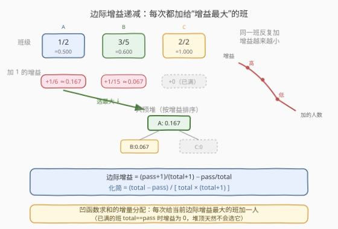
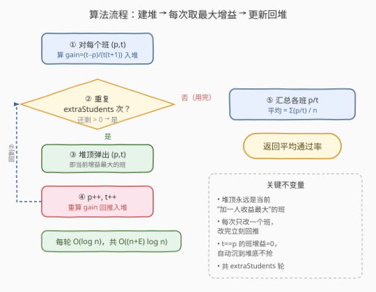
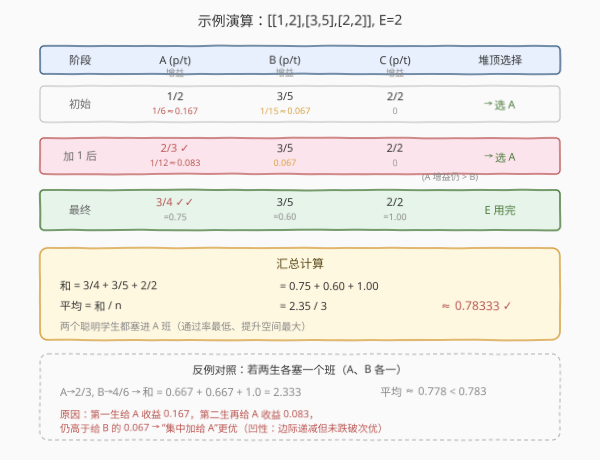

# 最大平均通过率

- **题目名称**：最大平均通过率
- **链接**：[1792. 最大平均通过率](https://leetcode.cn/problems/maximum-average-pass-ratio/)
- **难度**：中等
- **标签**：贪心、堆、优先队列

## 1. 题目概述

一所学校有若干班级，每个班 `i` 共 `total_i` 名学生，其中 `pass_i` 人能通过期末考试。另有 `extraStudents` 名「聪明学生」，他们**一定**能通过任何班的考试。你需要把这 `extraStudents` 个学生**每人分到一个班**（可多人同班），使**所有班级的平均通过率最大**。

- **班级通过率** = `pass / total`
- **平均通过率** = 所有班级通过率之和 ÷ 班级数 $n$

**示例 1**：

```text
输入：classes = [[1,2],[3,5],[2,2]], extraStudents = 2
输出：0.78333
解释：把两名学生都塞进第 0 个班 → [3,4]
      平均 = (3/4 + 3/5 + 2/2) / 3 = 2.35 / 3 ≈ 0.78333
```

**示例 2**：

```text
输入：classes = [[2,4],[3,9],[4,5],[2,10]], extraStudents = 4
输出：0.53485
```

**约束条件**：

- $1 \le n = \text{classes.length} \le 10^5$
- $\text{classes}[i] = [\text{pass}_i, \text{total}_i]$，且 $1 \le \text{pass}_i \le \text{total}_i \le 10^5$
- $1 \le \text{extraStudents} \le 10^5$

> 💡 **核心矛盾**：班级数 $n$ 固定，平均通过率最大化等价于**最大化各班通过率之和**。每名聪明学生是一次「增量资源」——加给哪个班收益最大？由于「加一人」带来的通过率提升**因班而异且会递减**，这是经典的**凹函数求和下的增量分配**问题，标准解法是**贪心 + 大顶堆**：每次把资源给当前边际收益最大的班。

---

## 2. 解题思路

### 2.1 暴力思路：枚举分配方案 / 每轮线性找最大

最直觉的两种暴力：

1. **枚举所有分配方案**：把 `extraStudents` 个学生分到 $n$ 个班，是「可重复组合」$C(n+E-1, E)$，规模天文数字，不可行。
2. **每轮线性扫描**：每加一名学生前，遍历所有班算出「加一人后的增益」，选最大的。每轮 $O(n)$，共 $E$ 轮，总 $O(n \cdot E)$，当 $n, E$ 都到 $10^5$ 时达 $10^{10}$，必超时。

> ⚠️ 暴力的瓶颈在于「每轮重新扫描所有班找最大增益」。但其实每轮只改了一个班——其余班的增益没变，没必要重算。这正是堆能大显身手的地方。

### 2.2 核心观察：边际增益 + 大顶堆



关键洞察分三步：

1. **量化「加一人的收益」**。给班 $(p, t)$ 加一名必过学生后，通过率从 $p/t$ 变为 $(p+1)/(t+1)$，**边际增益**为：

   $$
   \text{gain}(p, t) = \frac{p+1}{t+1} - \frac{p}{t} = \frac{t - p}{t(t+1)}
   $$

   化简后形式极简：分子是「未通过人数」$t-p$，分母是 $t(t+1)$。当 $t=p$（全员已过）时增益为 $0$，堆顶天然不会选它。

2. **增益随加的人数递减（凹性）**。对同一个班反复加人，$p$ 与 $t$ 同步 $+1$，但 $\text{gain}(p+1, t+1) < \text{gain}(p, t)$（分子 $t-p$ 减小、分母 $t(t+1)$ 增大，双重下降）。这意味着「收益递减」——把所有学生塞进一个班并不一定最优，要在「收益最高」与「递减后仍高于其他班」之间权衡。

3. **大顶堆维护当前最大增益**。每轮从堆顶弹出增益最大的班，加一人后重算增益回推入堆。堆保证每次选的是当前最优，且只对被改动的那个班重算，其余班增益不变无需动。

> 💡 **为什么贪心正确？** 这是「**可分离凹函数求和的增量分配**」标准模型：目标 $\sum_i f_i(x_i)$（$f_i$ 凹、$x_i$ 为分给班 $i$ 的人数、$\sum x_i = E$），贪心「每次给当前 $\Delta f_i$ 最大的 $i$ 加一」得到全局最优。直观理解：若最优解在某一步没选增益最大的班 $A$ 而选了 $B$（增益更小），把这一个名额从 $B$ 挪到 $A$，总增益上升（$A$ 此处的边际 ≥ $B$ 此处的边际），与最优矛盾。凹性保证「挪一个」不破坏后续单调性，可逐个交换归约到贪心解。

### 2.3 算法流程图



```text
1. 对每个班 (p, t) 计算 gain = (t-p)/(t*(t+1))，连同 (p,t) 入大顶堆
2. 重复 extraStudents 次：
   a. 堆顶弹出 (gain, p, t)          ← 当前增益最大的班
   b. p++, t++                        ← 加一名必过学生
   c. 重算 gain，回推入堆
3. 弹空堆，累加各班 p/t，返回 sum / n
```

> 💡 **关键不变量**：每轮结束后，堆顶永远是「当前加一人收益最大」的班。只对一个班做「弹出—修改—回推」，其余 $n-1$ 个班的增益保持不变，这正是堆把「找最大」从 $O(n)$ 降到 $O(\log n)$ 的来源。

### 2.4 示例演算

以示例 1 `classes = [[1,2],[3,5],[2,2]], extraStudents = 2` 为例。三个班记为 A、B、C，初始增益：

- A $(1,2)$：$(2-1)/(2\cdot3) = 1/6 \approx 0.167$
- B $(3,5)$：$(5-3)/(5\cdot6) = 1/15 \approx 0.067$
- C $(2,2)$：$(2-2)/(2\cdot3) = 0$（已满，无人可补）



| 阶段 | A (p/t) / 增益 | B (p/t) / 增益 | C (p/t) / 增益 | 堆顶选择 |
|------|---------------|---------------|---------------|---------|
| 初始 | 1/2 / **0.167** | 3/5 / 0.067 | 2/2 / 0 | → 选 A |
| 加 1 后 | 2/3 / **0.083** | 3/5 / 0.067 | 2/2 / 0 | → 选 A |
| 最终 | 3/4 = **0.75** | 3/5 = 0.60 | 2/2 = 1.00 | E 用完 |

- **第 1 步**：A 增益 $0.167$ 最大，加一人 → A 变 $(2,3)$，新增益 $1/12 \approx 0.083$（递减了，但仍高于 B 的 $0.067$）。
- **第 2 步**：A 增益 $0.083$ 仍最大，再加一人 → A 变 $(3,4)$。
- 汇总：$3/4 + 3/5 + 2/2 = 0.75 + 0.6 + 1.0 = 2.35$，平均 $2.35/3 \approx 0.78333$ ✓。

> 💡 **反例对照**：若两名学生「平均分」给 A、B 各一（A→2/3, B→4/6），和 = $0.667+0.667+1.0 = 2.333$，平均 $\approx 0.778 < 0.783$。原因正是凹性：第二生给 A 的收益 $0.083$ 虽比第一生的 $0.167$ 递减，但**仍未跌破**给 B 的 $0.067$，所以「集中给 A」更优。贪心每步比较的正是这个「当前边际」。

---

## 3. 参考代码

### C++

```cpp
class Solution {
  public:
    double maxAverageRatio(vector<vector<int>>& classes, int extraStudents) {
        auto cmp = [](const tuple<double, int, int>& a,
                      const tuple<double, int, int>& b) {
            return get<0>(a) < get<0>(b); // 小的排前 → 大顶堆
        };
        priority_queue<tuple<double, int, int>,
                       vector<tuple<double, int, int>>, decltype(cmp)>
            pq(cmp);

        for (const auto& c : classes) {
            int p = c[0], t = c[1];
            double g = (double)(t - p) / ((double)t * (t + 1));
            pq.push({g, p, t});
        }

        for (int i = 0; i < extraStudents; i++) {
            auto [g, p, t] = pq.top();
            pq.pop();
            p++;
            t++;
            double ng = (double)(t - p) / ((double)t * (t + 1));
            pq.push({ng, p, t});
        }

        double sum = 0;
        int n = classes.size();
        while (!pq.empty()) {
            auto [g, p, t] = pq.top();
            pq.pop();
            sum += (double)p / t;
        }
        return sum / n;
    }
};
```

### Python

```python
class Solution:
    def maxAverageRatio(self, classes: List[List[int]],
                        extraStudents: int) -> float:
        def gain(p: int, t: int) -> float:
            return (t - p) / (t * (t + 1))

        heap = []
        for p, t in classes:
            heapq.heappush(heap, (-gain(p, t), p, t))  # 负数模拟大顶堆

        for _ in range(extraStudents):
            _, p, t = heapq.heappop(heap)
            p += 1
            t += 1
            heapq.heappush(heap, (-gain(p, t), p, t))

        return sum(p / t for _, p, t in heap) / len(heap)
```

> ⚠️ **Python 用负数模拟大顶堆**：`heapq` 是小顶堆，存 `-gain` 后堆顶即「`-gain` 最小」=「`gain` 最大」。C++ 的 `priority_queue` 配自定义 `cmp` 时，`return get<0>(a) < get<0>(b)` 表示「a 的增益小则 a 排前」，于是堆顶是增益最大的。

> 💡 **避免整数除陷阱（C++）**：增益与最终通过率都是浮点，必须先把分子转 `double` 再除，如 `(double)(t - p) / ((double)t * (t + 1))`。若写成 `(t - p) / (t * (t + 1))` 会触发整除截断（如 $1/(2\cdot3)$ 得 $0$），完全失真。Python 的 `/` 天然浮点除，无此问题。

---

## 4. 复杂度分析

| 维度 | 复杂度 | 说明 |
|------|--------|------|
| 时间复杂度 | $O((n + E) \log n)$ | 建堆 $n$ 次 push 共 $O(n \log n)$；$E$ 轮各一次 pop+push 共 $O(E \log n)$；最后弹空汇总 $O(n \log n)$ |
| 空间复杂度 | $O(n)$ | 堆始终存 $n$ 个班的 $(\text{gain}, p, t)$ 元组 |

> 💡 本题 $n, E \le 10^5$，$O((n+E)\log n) \approx 2\times10^5 \times 17 \approx 3.4\times10^6$ 次堆操作，远在时限内。关键在于用堆把「每轮找最大增益」从 $O(n)$ 降到 $O(\log n)$，避免暴力的 $O(nE) = 10^{10}$。

---

## 5. 扩展：贪心正确性的形式化论证

### 5.1 交换论证

设最优解分给各班的人数为 $x_1^*, x_2^*, \dots, x_n^*$（$\sum x_i^* = E$），贪心解为 $x_1^g, \dots, x_n^g$。我们要证 $\sum_i f_i(x_i^g) \geq \sum_i f_i(x_i^*)$，其中 $f_i(x) = (p_i + x)/(t_i + x)$ 是凹函数（二阶导 $< 0$）。

**关键引理**：凹函数的差分 $\Delta f_i(x) = f_i(x+1) - f_i(x)$ 关于 $x$ 单调递减。贪心每一步选择当前 $\Delta f_i(x_i)$ 最大的 $i$ 加一，等价于在「所有差分序列」里取当前最大值——这正是 **KKT 条件下的最优资源分配**：最优解满足所有 $x_i > 0$ 的班的边际收益相等（否则把一名额从边际小的挪到边际大的可提升总和）。

**反证**：若某一步贪心选了 $A$（边际 $\Delta f_A$）而最优解该步选了 $B$（边际 $\Delta f_B < \Delta f_A$），把最优解中这一个名额从 $B$ 挪到 $A$，总增益增加 $\Delta f_A - \Delta f_B > 0$，与最优矛盾。凹性保证「挪一个」后 $A$ 的边际只降不升，可逐个归约。

### 5.2 为什么不是「按通过率最低的班优先」？

直觉上「补短板」似乎合理——通过率最低的班最该补。但**边际增益**才是真正的目标量，而非通过率本身。反例：班 A $(1, 2)$ 通过率 $0.5$，班 B $(99, 100)$ 通过率 $0.99$。

- A 的增益：$(2-1)/(2\cdot3) = 1/6 \approx 0.167$
- B 的增益：$(100-99)/(100\cdot101) = 1/10100 \approx 0.0001$

A 通过率低**且**增益高，此时「补短板」与「贪心」一致。但换一组：班 A $(8, 10)$ 通过率 $0.8$，班 B $(1, 2)$ 通过率 $0.5$。

- A 的增益：$(10-8)/(10\cdot11) = 2/110 \approx 0.018$
- B 的增益：$(2-1)/(2\cdot3) = 1/6 \approx 0.167$

B 通过率低增益也高，仍一致。再换：班 A $(1, 100)$ 通过率 $0.01$（极低），班 B $(9, 10)$ 通过率 $0.9$。

- A 的增益：$(100-1)/(100\cdot101) = 99/10100 \approx 0.0098$
- B 的增益：$(10-9)/(10\cdot11) = 1/110 \approx 0.0091$

A 增益略高，贪心选 A——此时「补短板」也选 A，仍一致。但关键反例：班 A $(1, 100)$（通过率 $0.01$）vs 班 B $(1, 2)$（通过率 $0.5$）。

- A 的增益：$99/10100 \approx 0.0098$
- B 的增益：$1/6 \approx 0.167$

B 通过率**更高**但增益**远更大**——贪心选 B，而「补短板」会错选 A。**根本原因**：增益的分母 $t(t+1)$ 对大班严重惩罚，给 100 人的班加一个几乎不动通过率；给 2 人的班加一个能从 $0.5$ 跳到 $0.667$。所以**必须用边际增益而非通过率**作为优先级。

> ⚠️ 这也解释了为什么公式化简成 $(t-p)/[t(t+1)]$ 后如此直观：分子是「可提升空间」（未过人数），分母是「班级体量平方级」——小班 + 未过人数多 = 增益最大，正是堆顶首选。

---

## 6. 面试要点

**Q1：为什么用大顶堆而不是每次线性找最大增益？**

> 每轮线性扫描 $O(n)$，$E$ 轮共 $O(nE) = 10^{10}$ 超时。堆把「找最大」降到 $O(\log n)$，且每轮只改一个班——只需对该班「弹出—修改—回推」，其余 $n-1$ 个班增益不变无需动。总时间 $O((n+E)\log n)$。

**Q2：堆里存的是什么？为什么存增益而不存通过率？**

> 存 `(gain, pass, total)` 三元组，按 `gain` 降序。因为目标量是「加一人带来的通过率提升」，即边际增益，而非通过率本身。通过率低的班未必增益高（如 100 人的班通过率 0.01 但加一人几乎无提升）。增益公式化简为 $(t-p)/[t(t+1)]$，分子是未过人数、分母是体量平方级，直观反映「小班 + 未过人数多」最该补。

**Q3：贪心为什么正确？关键性质是什么？**

> 关键是**通过率函数 $f(x) = (p+x)/(t+x)$ 的凹性**——二阶导 $< 0$，边际增益 $\Delta f$ 单调递减。凹函数求和的增量分配问题，贪心「每次给当前边际最大的加一」满足 KKT 条件，可用交换论证证明最优：若最优解某步没选边际最大的，把名额挪过去总增益上升，与最优矛盾。

**Q4：为什么不能简单地「按通过率从低到高分配」？**

> 因为通过率不是目标量，**边际增益**才是。反例：班 A $(1,100)$ 通过率 $0.01$ 增益 $\approx 0.0098$，班 B $(1,2)$ 通过率 $0.5$ 增益 $\approx 0.167$——B 通过率更高但增益远更大，应优先给 B。根本原因：增益分母 $t(t+1)$ 对大班严重惩罚，给大班加一人对通过率几乎无影响。

**Q5：C++ 自定义比较器写 `priority_queue` 有什么坑？**

> `priority_queue` 的比较器语义与 `sort` 相反：`cmp(a,b)` 返回 `true` 表示 **a 排在 b 前面**（即 a 优先级更低、更靠底），所以 `return get<0>(a) < get<0>(b)` 让小增益沉底、大增益浮顶，得到大顶堆。另外 `decltype(cmp)` 必须作为模板参数，且构造时传入 `cmp` 实例（lambda 无默认构造）。C++17 后可用 `auto [g, p, t] = pq.top()` 解构元组，但 `top()` 返回 `const` 引用，结构化绑定会拷贝，记得随后 `pop()`。

---

## 7. 同类练习题

- [502. IPO](https://leetcode.cn/problems/ipo/)（[题解](../0501-0600/502_IPO.md)）：同为「贪心 + 大顶堆」资源分配——排序解锁候选 + 堆选最大利润，与本题「堆选最大增益」同构，对照体会「堆维护当前最优候选」的通用骨架
- [253. 会议室 II](https://leetcode.cn/problems/meeting-rooms-ii/)（[题解](../0201-0300/253_会议室II.md)）：小顶堆维护「最早结束的会议」，与本题大顶堆维护「最大增益」形成「堆方向」对照——同是增量事件驱动的贪心
- [871. 最低加油次数](https://leetcode.cn/problems/minimum-number-of-refueling-stops/)：贪心 + 大顶堆，与本题几乎同构——「行驶距离」对应「分配名额」，「油量」对应「边际增益」，每到一站把可用油量入堆、不够时取最大油量补
- [630. 课程表 III](https://leetcode.cn/problems/course-schedule-iii/)：贪心 + 堆的「反悔」机制——按截止时间排序，每加入一门课若超时则踢掉耗时最长的，与本题「每轮取最优」对照理解堆在调度贪心中的两种用法
- [1163. 按字典序最大的子字符串](https://leetcode.cn/problems/last-substring-in-lexicographical-order/)：另一种「增量比较」的贪心——双指针维护当前最大后缀，与本题「堆维护当前最大增益」对照体会贪心问题中「最优候选」的不同数据结构选择
