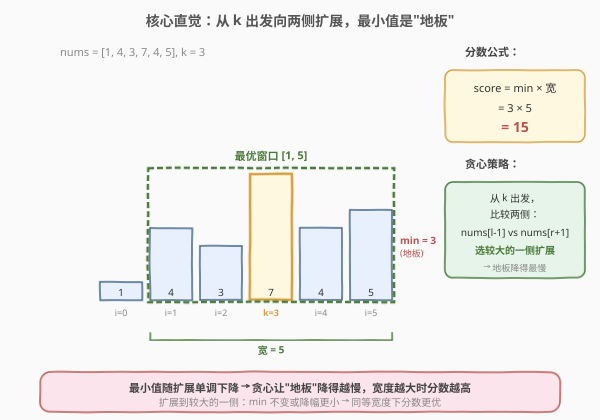
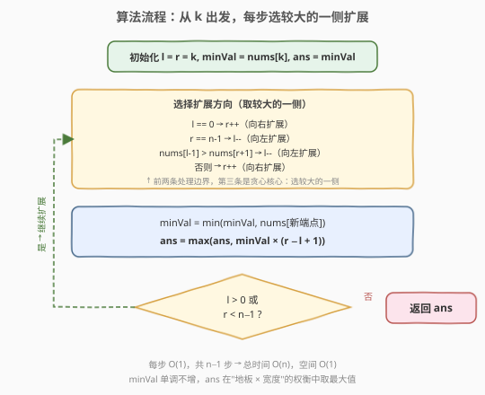

# LeetCode 好子数组的最大分数 题解

## 1. 题目概述

- **标题 / 题号**：好子数组的最大分数（#1793，hard）
- **链接**：https://leetcode.cn/problems/maximum-score-of-a-good-subarray/
- **难度**：困难
- **标签**：栈、贪心、数组、双指针、单调栈

**题意**：给定一个整数数组 `nums`（下标从 0 开始）和一个整数 `k`。子数组 `(i, j)` 的**分数**定义为：

$$\text{score} = \min(\text{nums}[i], \text{nums}[i+1], \ldots, \text{nums}[j]) \times (j - i + 1)$$

一个**好**子数组要求两端点满足 $i \le k \le j$（即子数组必须包含下标 `k`）。返回好子数组的最大可能分数。

**示例 1**：

```text
输入：nums = [1,4,3,7,4,5], k = 3
输出：15
解释：最优子数组端点 (1, 5)，min(4,3,7,4,5) × 5 = 3 × 5 = 15。
```

**示例 2**：

```text
输入：nums = [5,5,4,5,4,1,1,1], k = 0
输出：20
解释：最优子数组端点 (0, 4)，min(5,5,4,5,4) × 5 = 4 × 5 = 20。
```

**约束**：

- $1 \le \text{nums.length} \le 10^5$
- $1 \le \text{nums}[i] \le 2 \times 10^4$
- $0 \le k < \text{nums.length}$

> 💡 **关键约束**：子数组必须包含 `k`。正是这个约束让"从 `k` 出发双向扩展"的贪心成为可能——如果没有这个约束，问题就退化为 [84. 柱状图中最大的矩形](../0001-0100/84_柱状图中最大的矩形.md)，需要单调栈全局求解。

## 2. 解题思路

### 2.1 暴力思路：枚举所有包含 k 的子数组

最直观的做法是枚举所有满足 $i \le k \le j$ 的子数组 $(i, j)$，对每个子数组求最小值并计算分数，取最大值。

```text
ans = 0
for i in range(0, k+1):          # 左端点 0..k
    for j in range(k, n):        # 右端点 k..n-1
        score = min(nums[i..j]) * (j - i + 1)
        ans = max(ans, score)
```

时间复杂度 $O(n^2)$（枚举 $O(n^2)$ 个子数组，每个求最小值 $O(n)$，总计 $O(n^3)$；用预处理可降到 $O(n^2)$），对 $n = 10^5$ 严重超时。

> ⚠️ **暴力法的瓶颈**：盲目枚举所有子数组，没有利用"分数 = min × 宽度"中 min 和宽度的此消彼长关系。实际上，最优子数组的最小值一定落在某个确定位置，我们可以围绕这个位置高效扩展。

### 2.2 核心观察：从 k 出发贪心扩展，最小值是"地板"



关键观察分两步：

**观察一：最小值是"地板"，分数 = 地板高度 × 宽度。** 子数组的分数由两个量决定——最小值（地板）和宽度。扩展子数组时，宽度总是增加，但最小值可能下降（遇到更小的元素）。因此分数的变化取决于"宽度增长"能否弥补"地板下降"。

**观察二：从 `k` 出发，贪心选较大的一侧扩展，让地板降得最慢。** 由于子数组必须包含 `k`，我们从 `[k, k]` 开始，逐步向左或向右扩展。每步在 `nums[l-1]` 和 `nums[r+1]` 中选**较大**的一侧扩展：

- 如果扩展到较大的一侧，新元素 $\ge$ 当前 minVal，则 minVal **不变**，白赚一个宽度 → 分数只增不减。
- 如果两侧都比 minVal 小，选较大的一侧能让 minVal **降幅最小**，为后续扩展保留更高的地板。

> 💡 **贪心正确性的交换论证**：假设 $\text{nums}[l-1] \ge \text{nums}[r+1]$ 但我们选了向右扩展。那么向左扩展的 minVal $\ge$ 向右扩展的 minVal（因为 $\min(m, \text{nums}[l-1]) \ge \min(m, \text{nums}[r+1])$），且两者宽度相同。从向左扩展的状态出发，下一步仍可以再向右扩展，到达与"先右后左"相同的窗口 $[l-1, r+1]$，但中间状态的分数更高。因此"先向较大的一侧扩展"**支配**（dominate）另一选择，贪心是最优的。

### 2.3 算法流程图



**步骤**：

1. **初始化** `l = r = k`，`minVal = nums[k]`，`ans = nums[k]`（初始窗口就是 `[k, k]]`）。
2. **循环**（当 `l > 0` 或 `r < n-1` 时）：
   - 若 `l == 0`：只能向右，`r++`。
   - 否则若 `r == n-1`：只能向左，`l--`。
   - 否则若 `nums[l-1] > nums[r+1]`：向左扩展（左侧更大），`l--`。
   - 否则：向右扩展，`r++`。
   - 更新 `minVal = min(minVal, nums[新端点])`。
   - 更新 `ans = max(ans, minVal × (r - l + 1))`。
3. **返回** `ans`。

> ⚠️ **边界处理**：当一侧已到达数组边界（`l == 0` 或 `r == n-1`）时，没有选择余地，只能向另一侧扩展。这四条判断的顺序很重要：先处理边界（前两条），再处理贪心选择（后两条）。

### 2.4 示例演算

![示例演算：nums = [1,4,3,7,4,5], k = 3](../images/good_subarray_score_walkthrough.svg)

以示例 1 `nums = [1,4,3,7,4,5]`, `k = 3` 为例，追踪逐步扩展过程：

| 步骤 | $l \sim r$ | 决策 | minVal | 宽度 | 得分 | ans |
|------|-----------|------|--------|------|------|-----|
| 初始 | 3~3 | — | 7 | 1 | 7 | 7 |
| ① | 3~4 | $\text{nums}[2]=3 < \text{nums}[4]=4$ → 向右 | 4 | 2 | 8 | 8 |
| ② | 3~5 | $\text{nums}[2]=3 < \text{nums}[5]=5$ → 向右 | 4 | 3 | 12 | 12 |
| ③ | 2~5 | 右侧到头 → 向左 | 3 | 4 | 12 | 12 |
| ④ | 1~5 | → 向左 | 3 | 5 | **15** ⭐ | **15** |
| ⑤ | 0~5 | → 向左 | 1 | 6 | 6 | 15 |

**关键在步骤 ①②**：右侧的 `nums[4]=4` 和 `nums[5]=5` 都大于左侧的 `nums[2]=3`，所以贪心选择向右扩展。此时 minVal 保持 4 不降，宽度从 1 涨到 3，分数从 7 涨到 12。

**步骤 ③④**：右侧到头后被迫向左扩展。虽然 minVal 降到 3（遇到 `nums[2]=3`），但宽度涨到 5，$3 \times 5 = 15$ 成为最优。步骤 ⑤ 继续向左遇到 `nums[0]=1`，minVal 暴跌到 1，分数反而下降。最终答案 **15**。

> 💡 **对比示例 2**：`nums = [5,5,4,5,4,1,1,1]`, `k = 0`。由于 `k=0` 在最左端，全程只能向右扩展。minVal 从 5 逐步降到 4（到 `i=2`），宽度涨到 5 时得分 $4 \times 5 = 20$ 为最优；继续向右遇到 1 后 minVal 暴跌，分数不再增长。这说明**贪心在单侧扩展时同样有效**——它退化为"一直向右"，但 minVal 的下降轨迹自然在最优宽度处取得最大分数。

## 3. 参考代码

### C++（贪心双指针，O(1) 空间）

```cpp
class Solution {
  public:
    int maximumScore(vector<int>& nums, int k) {
        int n = nums.size();
        int l = k, r = k;
        int minVal = nums[k];
        int ans = nums[k];

        while (l > 0 || r < n - 1) {
            if (l == 0) {
                r++;
                minVal = min(minVal, nums[r]);
            } else if (r == n - 1) {
                l--;
                minVal = min(minVal, nums[l]);
            } else if (nums[l - 1] > nums[r + 1]) {
                l--;
                minVal = min(minVal, nums[l]);
            } else {
                r++;
                minVal = min(minVal, nums[r]);
            }
            ans = max(ans, minVal * (r - l + 1));
        }
        return ans;
    }
};
```

> 💡 **四个分支各对应一种扩展方向**：前两条处理边界（一侧到头，只能向另一侧扩展），后两条是贪心核心（比较两侧邻居，选较大的一侧）。每个分支内 `l`/`r` 先更新，再取新端点更新 `minVal`，逻辑清晰且无歧义。

### Python

```python
class Solution:
    def maximumScore(self, nums: List[int], k: int) -> int:
        n = len(nums)
        l = r = k
        min_val = nums[k]
        ans = nums[k]

        while l > 0 or r < n - 1:
            if l == 0:
                r += 1
                min_val = min(min_val, nums[r])
            elif r == n - 1:
                l -= 1
                min_val = min(min_val, nums[l])
            elif nums[l - 1] > nums[r + 1]:
                l -= 1
                min_val = min(min_val, nums[l])
            else:
                r += 1
                min_val = min(min_val, nums[r])
            ans = max(ans, min_val * (r - l + 1))

        return ans
```

## 4. 复杂度分析

| 维度 | 复杂度 | 说明 |
|------|--------|------|
| 时间复杂度 | $O(n)$ | 每步扩展一个端点，共 $n - 1$ 步（从宽度 1 扩到 $n$） |
| 空间复杂度 | $O(1)$ | 仅用 `l`、`r`、`minVal`、`ans` 四个变量 |

> 💡 **与暴力 $O(n^2)$ 的本质区别**：暴力枚举所有子数组；贪心利用"必须包含 `k`"的约束，从 `k` 出发只需一条路径（每步二选一），用 $O(1)$ 的决策替代了 $O(n)$ 的重复枚举。

## 5. 扩展：单调栈解法（通向 84 题的桥梁）

本题去掉"必须包含 `k`"的约束后，就是经典的 [84. 柱状图中最大的矩形](../0001-0100/84_柱状图中最大的矩形.md)——求所有子数组的 $\min \times \text{width}$ 最大值。那道题用单调栈 $O(n)$ 求解，本题也可沿用，只需加一个"范围包含 `k`"的过滤。

**思路**：对每个位置 $i$，用单调栈求出它作为最小值能管辖的最大范围 $[L_i, R_i]$（即左边第一个更矮和右边第一个更矮夹出的区间）。若 $L_i \le k \le R_i$，则 $\text{nums}[i] \times (R_i - L_i + 1)$ 是一个合法候选分数。

```cpp
class Solution {
  public:
    int maximumScore(vector<int>& nums, int k) {
        int n = nums.size();
        vector<int> left(n, -1), right(n, n);
        stack<int> st;

        // 左边第一个严格更小的下标
        for (int i = 0; i < n; i++) {
            while (!st.empty() && nums[st.top()] >= nums[i])
                st.pop();
            left[i] = st.empty() ? -1 : st.top();
            st.push(i);
        }
        while (!st.empty()) st.pop();

        // 右边第一个严格更小的下标
        for (int i = n - 1; i >= 0; i--) {
            while (!st.empty() && nums[st.top()] >= nums[i])
                st.pop();
            right[i] = st.empty() ? n : st.top();
            st.push(i);
        }

        int ans = 0;
        for (int i = 0; i < n; i++) {
            int L = left[i] + 1, R = right[i] - 1;  // i 管辖的范围 [L, R]
            if (L <= k && k <= R) {
                ans = max(ans, nums[i] * (R - L + 1));
            }
        }
        return ans;
    }
};
```

> ⚠️ **等高元素处理**：两侧都用 `>=` 弹栈（严格更小才保留），这样等高元素不会互为边界，每个元素的管辖范围会延伸穿过等高邻居。虽然多个等高元素会重复声明同一范围，但取 `max` 不受影响。

**两种解法对比**：

| 维度 | 贪心双指针 | 单调栈 |
|------|-----------|--------|
| 时间 | $O(n)$ | $O(n)$ |
| 空间 | $O(1)$ | $O(n)$ |
| 通用性 | 依赖"包含 `k`"约束 | 去掉 `k` 约束即退化为 84 题 |
| 面试亮点 | 贪心交换论证，$O(1)$ 空间 | 与 84 题无缝衔接，套路可复用 |

> 💡 **为什么贪心能做到 $O(1)$ 空间而单调栈不行？** 贪心利用了"必须包含 `k`"的约束——从 `k` 出发只有一条路径，无需预处理所有元素的范围。单调栈则是"全局视角"：先算出每个元素的范围，再筛选包含 `k` 的。约束越强，解法越精简。

## 6. 面试要点

**Q1：为什么从 `k` 出发扩展是正确的？不能从其他位置出发吗？**

> 因为好子数组必须包含 `k`（$i \le k \le j$），所以任何合法子数组都可以看作"以 `k` 为起点向两侧扩展得到"。从 `k` 出发，每步扩展一个端点，能遍历到所有包含 `k` 的子数组（确切地说是 $O(n)$ 个"关键"子数组——每步对应一个窗口）。从其他位置出发无法保证子数组包含 `k`。

**Q2：贪心"选较大的一侧"为什么是最优的？请给出交换论证。**

> 假设 $\text{nums}[l-1] \ge \text{nums}[r+1]$。向左扩展的 minVal $= \min(m, \text{nums}[l-1])$，向右扩展的 minVal $= \min(m, \text{nums}[r+1])$。由于 $\text{nums}[l-1] \ge \text{nums}[r+1]$，向左的 minVal $\ge$ 向右的 minVal，且宽度相同。从向左状态出发，下一步仍可向右扩展到达 $[l-1, r+1]$，与"先右后左"的终点相同，但中间状态分数更高。因此"先向较大侧扩展"支配另一选择。

**Q3：minVal 是单调不增的吗？为什么？**

> 是的。minVal 只在扩展时通过 $\min(\text{minVal}, \text{nums}[\text{新端点}])$ 更新，$\min$ 运算不会让值变大。扩展到 $\ge$ minVal 的元素时 minVal 不变，扩展到 $<$ minVal 的元素时 minVal 下降。所以 minVal 随扩展单调不增，这保证了算法在 $n-1$ 步内必然考察到所有"关键 minVal 水平"。

**Q4：本题与 84 题（柱状图中最大的矩形）的关系是什么？**

> 84 题是本题去掉"包含 `k`"约束的版本：求所有子数组的 $\min \times \text{width}$ 最大值。84 题必须用单调栈（或类似 $O(n)$ 预处理），因为没有锚点 `k` 可以出发。本题的"包含 `k`"约束是双刃剑——它限制了解空间（必须包含 `k`），但也提供了锚点使得贪心双指针 $O(1)$ 空间成为可能。单调栈解法是两题的公共解法。

**Q5：如果数组中有负数，贪心还成立吗？**

> 不成立。本题约束 $\text{nums}[i] \ge 1$，保证 minVal 恒正，分数 $= \text{minVal} \times \text{width}$ 中宽度越大分数越大（在 minVal 不变时）。若有负数，minVal 可能为负，此时"扩展增大宽度"反而让分数更小，贪心"选较大的一侧扩展"不再保证最优。单调栈解法同样依赖 minVal 为正（否则最大分数可能来自空子数组，但题目要求非空）。本题的约束设计是有意为之。

> 💡 **一句话总结**：好子数组必须包含 `k` → 从 `k` 出发双向扩展 → 每步贪心选较大的一侧让 minVal 降得最慢 → $O(n)$ 时间、$O(1)$ 空间。去掉 `k` 约束即为 84 题，改用单调栈。

## 同类练习题

| # | 题目 | 与本题的关联 |
|---|------|-------------|
| 84 | [柱状图中最大的矩形](https://leetcode.cn/problems/largest-rectangle-in-histogram/)（[题解](../0001-0100/84_柱状图中最大的矩形.md)） | **去掉 `k` 约束的母题**——全局求 $\min \times \text{width}$ 最大值，单调栈 $O(n)$，理解它再看本题就是"加了锚点 `k` 的特化版" |
| 42 | [接雨水](https://leetcode.cn/problems/trapping-rain-water/)（[题解](../0001-0100/42_接雨水.md)） | 同样涉及"左右扩展找边界"的单调栈思想，但目标不同（求容积而非 $\min \times \text{width}$），对照理解单调栈的两种结算方式 |
| 85 | [最大矩形](https://leetcode.cn/problems/maximal-rectangle/) | 84 题的二维版本，逐行转化为柱状图后套用单调栈，进一步理解"固定最小值求最大宽度"的范式 |
| 907 | [子数组的最小值之和](https://leetcode.cn/problems/sum-of-subarray-minimums/) | 对每个元素求其作为最小值的管辖范围（单调栈），思路与本题扩展解法相同，但目标是求和而非取最大 |
