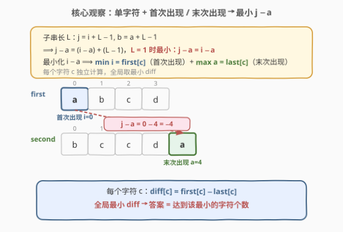
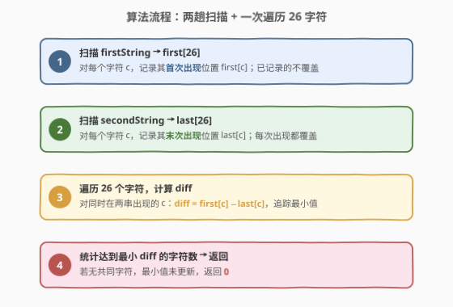
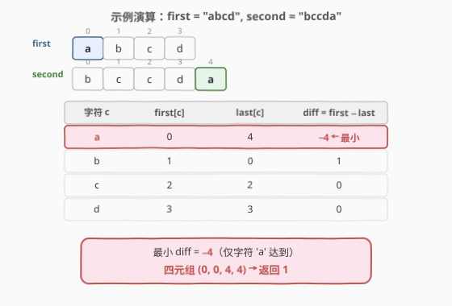

# 统计距离最小的子串对个数

- **题目名称**：统计距离最小的子串对个数
- **链接**：[1794. Count Pairs of Equal Substrings With Minimum Difference](https://leetcode.cn/problems/count-pairs-of-equal-substrings-with-minimum-difference/)
- **难度**：中等
- **标签**：贪心、哈希表、字符串

## 1. 题目概述

给定两个 **0-indexed** 字符串 `firstString` 和 `secondString`（仅含小写字母）。统计满足以下条件的四元组 $(i, j, a, b)$ 的个数：

1. $0 \le i \le j < \text{firstString.length}$
2. $0 \le a \le b < \text{secondString.length}$
3. `firstString` 中从第 $i$ 个字符到第 $j$ 个字符（含）的子串，等于 `secondString` 中从第 $a$ 个字符到第 $b$ 个字符（含）的子串。
4. $j - a$ 在所有满足前三个条件的四元组中取**最小值**。

返回达到该最小 $j - a$ 的四元组个数。

**示例 1**：

```text
输入：firstString = "abcd", secondString = "bccda"
输出：1
解释：四元组 (0, 0, 4, 4) 是唯一满足所有条件且最小化 j - a 的四元组。
子串 "a" 在 first 中起于 i=0、止于 j=0；在 second 中起于 a=4、止于 b=4。
j - a = 0 - 4 = -4，为所有合法四元组中的最小值。
```

**示例 2**：

```text
输入：firstString = "ab", secondString = "cd"
输出：0
解释：两串无共同字符，不存在合法四元组。
```

**约束条件**：

- $1 \le \text{firstString.length}, \text{secondString.length} \le 2 \times 10^5$
- 两串仅含小写英文字母

> 💡 **关键结构**：目标量是 $j - a$（first 中的**结束下标**减去 second 中的**起始下标**），而非 $|i - a|$ 或 $|i - j|$。这一非对称定义是题眼——它使得 $j$ 越小（子串越短、起始越早）且 $a$ 越大（second 中越靠后）时 $j - a$ 越小，直接指向「**单字符 + 首次出现 vs 末次出现**」的贪心策略。

---

## 2. 解题思路

### 2.1 暴力思路：枚举所有四元组

最直觉的做法：四重循环枚举 $(i, j, a, b)$，对子串长度相同的组合逐字符比较，维护 $j - a$ 的最小值与计数。

```text
minDiff = +∞, count = 0
for i in 0 .. n-1:
    for j in i .. n-1:              # first 子串 [i, j]
        for a in 0 .. m-1:
            for b in a .. m-1:      # second 子串 [a, b]
                if (j-i) == (b-a) and first[i..j] == second[a..b]:
                    diff = j - a
                    if diff < minDiff: minDiff = diff; count = 1
                    elif diff == minDiff: count += 1
return count
```

时间 $O(n^2 m^2 L)$（$L$ 为子串比较长度），$n, m$ 达 $2 \times 10^5$ 时完全不可行。

> ⚠️ **症结**：暴力把「子串相等」当作需要完整枚举两端 $(i,j)$ 和 $(a,b)$ 的问题，但目标量 $j - a = (i - a) + (L - 1)$ 的结构表明：**子串长度 $L$ 越大，$j - a$ 只会越大**。真正最小化 $j - a$ 的四元组必然取 $L = 1$（单字符），这使得四重循环中 $j = i$、$b = a$ 的维度完全冗余。

### 2.2 核心观察：单字符 + 首次出现 / 末次出现



关键洞察分两层：

**第一层：子串长度 $L = 1$ 时 $j - a$ 最小。**

设子串长度为 $L$，则 $j = i + L - 1$，$b = a + L - 1$，于是：

$$
j - a = (i + L - 1) - a = (i - a) + (L - 1)
$$

$L \ge 1$ 故 $L - 1 \ge 0$。对固定的起始位置 $(i, a)$，$L = 1$ 给出最小的 $j - a = i - a$。更长的子串只会增加 $j - a$，不可能更优。

**第二层：对每个字符 $c$，用首次出现和末次出现最小化 $i - a$。**

$L = 1$ 时 $j - a = i - a$，其中 $i$ 是字符 $c$ 在 `firstString` 中的位置、$a$ 是 $c$ 在 `secondString` 中的位置。要最小化 $i - a$：

- **最小化 $i$**：取 $c$ 在 `firstString` 中的**首次出现**位置 `first[c]`
- **最大化 $a$**：取 $c$ 在 `secondString` 中的**末次出现**位置 `last[c]$

$$
\text{diff}[c] = \text{first}[c] - \text{last}[c]
$$

全局最小 $j - a = \min_c \text{diff}[c]$，答案为达到该最小值的字符个数。

> 💡 **为什么每个字符只贡献一个四元组？** `first[c]` 是 $c$ 在 first 中的最小下标（唯一），`last[c]` 是 $c$ 在 second 中的最大下标（唯一）。若用其他位置 $i' > \text{first}[c]$ 或 $a' < \text{last}[c]$，则 $i' - a' > \text{first}[c] - \text{last}[c]$，不可能达到同样的最小值。因此每个达到全局最小的字符恰好贡献一个四元组 $(\text{first}[c], \text{first}[c], \text{last}[c], \text{last}[c])$。
>
> 💡 **为什么更长的子串无法追平？** 长度 $L > 1$ 的子串起始字符为 $c$ 时，$j - a = (i - a) + (L - 1) \ge \text{diff}[c] + (L - 1) > \text{diff}[c] \ge \min_{c'} \text{diff}[c']$。故全局最小严格由单字符四元组独占。

### 2.3 算法流程图



1. **初始化**：`first[26] = {-1}`（首次出现位置，`-1` 表示未出现），`last[26] = {-1}`（末次出现位置）。
2. **扫描 `firstString`**：对每个位置 $i$，若 `first[c]` 仍为 $-1$ 则记录 `first[c] = i`（只记首次，不覆盖）。
3. **扫描 `secondString`**：对每个位置 $i$，执行 `last[c] = i`（每次覆盖，保留末次）。
4. **遍历 26 个字符**：对同时在两串出现的 $c$（`first[c] != -1 && last[c] != -1`），计算 `diff = first[c] - last[c]`，追踪最小值与计数。
5. **终止**：返回计数。若无共同字符则最小值未更新，返回 $0$。

### 2.4 示例演算

以示例 1 `firstString = "abcd"`、`secondString = "bccda"` 为例：



**第一步：扫描 firstString，记录首次出现**

| 字符 | 位置 | first[c] |
|------|------|----------|
| `a` | $0$ | $0$ |
| `b` | $1$ | $1$ |
| `c` | $2$ | $2$ |
| `d` | $3$ | $3$ |

**第二步：扫描 secondString，记录末次出现**

| 字符 | 位置序列 | last[c] |
|------|----------|---------|
| `b` | $0$ | $0$ |
| `c` | $1, 2$ | $2$ |
| `d` | $3$ | $3$ |
| `a` | $4$ | $4$ |

**第三步：遍历 26 字符，计算 diff**

| 字符 $c$ | first[c] | last[c] | diff = first − last | 是否最小 |
|----------|----------|---------|---------------------|----------|
| `a` | $0$ | $4$ | $-4$ | ✅ 最小 |
| `b` | $1$ | $0$ | $1$ | ✗ |
| `c` | $2$ | $2$ | $0$ | ✗ |
| `d` | $3$ | $3$ | $0$ | ✗ |

最小 diff $= -4$，仅字符 `a` 达到，对应四元组 $(0, 0, 4, 4)$，返回 $1$ ✓。

---

## 3. 参考代码

### C++

```cpp
class Solution {
public:
    int countQuadruples(string firstString, string secondString) {
        int first[26], last[26];
        memset(first, -1, sizeof(first));
        memset(last, -1, sizeof(last));

        for (int i = 0; i < (int)firstString.size(); ++i) {
            int c = firstString[i] - 'a';
            if (first[c] == -1) first[c] = i;
        }
        for (int i = 0; i < (int)secondString.size(); ++i) {
            last[secondString[i] - 'a'] = i;
        }

        int minDiff = INT_MAX, count = 0;
        for (int c = 0; c < 26; ++c) {
            if (first[c] != -1 && last[c] != -1) {
                int diff = first[c] - last[c];
                if (diff < minDiff) {
                    minDiff = diff;
                    count = 1;
                } else if (diff == minDiff) {
                    ++count;
                }
            }
        }
        return count;
    }
};
```

### Python

```python
class Solution:
    def countQuadruples(self, firstString: str, secondString: str) -> int:
        first = [-1] * 26
        last = [-1] * 26
        for i, ch in enumerate(firstString):
            idx = ord(ch) - ord('a')
            if first[idx] == -1:
                first[idx] = i
        for i, ch in enumerate(secondString):
            last[ord(ch) - ord('a')] = i

        min_diff = float('inf')
        ans = 0
        for c in range(26):
            if first[c] != -1 and last[c] != -1:
                diff = first[c] - last[c]
                if diff < min_diff:
                    min_diff = diff
                    ans = 1
                elif diff == min_diff:
                    ans += 1
        return ans
```

> 💡 **写法对照**：两版逻辑完全一致——`first` / `last` 为长度 26 的数组（`-1` 哨兵表示未出现），扫描 first 时「只记首次」（`if first[c] == -1`），扫描 second 时「每次覆盖」（`last[c] = i`），最后遍历 26 字符追踪最小 diff 与计数。C++ 用 `memset` 初始化哨兵；Python 用列表乘法 `[-1] * 26`。
>
> ⚠️ **首次 vs 末次的扫描方向**：`first` 数组在扫描时用 `if first[c] == -1` 守卫，保证只记录最小下标；`last` 数组无守卫，每次赋值覆盖，自然保留最大下标。两趟扫描的「守卫 vs 无守卫」是实现上的关键差异。

---

## 4. 复杂度分析

| 维度 | 复杂度 | 说明 |
|------|--------|------|
| 时间复杂度 | $O(n + m + |\Sigma|)$ | 扫描 first 为 $O(n)$，扫描 second 为 $O(m)$，遍历字符表为 $O(|\Sigma|) = O(26)$ |
| 空间复杂度 | $O(|\Sigma|)$ | `first` / `last` 各 26 个整数，与 $n, m$ 无关 |

其中 $n = \text{firstString.length}$，$m = \text{secondString.length}$，$|\Sigma| = 26$（小写字母）。当 $|\Sigma|$ 视作常数时，时间 $O(n + m)$、空间 $O(1)$。

> 💡 对比暴力 $O(n^2 m^2 L)$：本题 $n, m$ 达 $2 \times 10^5$，暴力需 $\sim 10^{21}$ 次操作完全不可行；而贪心解法仅 $\sim 4 \times 10^5$ 次线性扫描，毫秒级完成。性能差距源于两层降维：$L = 1$ 消去子串长度维度（$O(n^2 m^2 L) \to O(nm)$），首次/末次出现消去位置枚举维度（$O(nm) \to O(n + m)$）。

---

## 5. 扩展：变体讨论

### 5.1 改求最大 $j - a$

若目标改为**最大化** $j - a$，对称地取 $c$ 在 first 中的**末次出现**和 second 中的**首次出现**：

$$
\text{diff}_{\max}[c] = \text{lastInFirst}[c] - \text{firstInSecond}[c]
$$

只需把扫描 first 改为「每次覆盖」、扫描 second 改为「只记首次」，其余逻辑不变。

### 5.2 改求 $|j - a|$ 的最小值

若目标量改为绝对值 $|j - a|$，则不能仅看单方向——需同时考虑 $i - a$ 的正负两种情况。对每个字符 $c$，分别计算 `first[c] - last[c]`（可能为负）和 `lastInFirst[c] - firstInSecond[c]`（可能为正），取绝对值更小者。复杂度仍为 $O(n + m)$，但每个字符需检查两个候选。

> 💡 **本题 $j - a$ 不取绝对值的设计意图**：非对称的 $j - a$ 使得「first 中尽量靠前 + second 中尽量靠后」成为唯一优化方向，无需分情况讨论，直接指向首次/末次出现的贪心策略。这是题目设计的精妙之处。

---

## 6. 面试要点

**Q1：为什么单字符子串就足够最小化 $j - a$？**
> $j - a = (i - a) + (L - 1)$，其中 $L \ge 1$。$L = 1$ 时 $j - a = i - a$ 为最小值；$L > 1$ 时多出的 $L - 1 > 0$ 只会增大 $j - a$。故全局最小严格由单字符四元组取得，无需考虑更长子串。

**Q2：为什么用首次出现和末次出现？**
> 最小化 $i - a$ 需要最小化 $i$（first 中的起始位置）和最大化 $a$（second 中的起始位置）。首次出现给出最小 $i$，末次出现给出最大 $a$，两者组合给出每个字符的最优 $j - a$。

**Q3：每个字符为什么只贡献一个四元组？**
> 首次出现位置和末次出现位置都是唯一的。若用其他位置 $i' > \text{first}[c]$ 或 $a' < \text{last}[c]$，则 $i' - a' > \text{first}[c] - \text{last}[c]$，无法达到同样的最小值。因此每个达到全局最小的字符恰好贡献一个四元组。

**Q4：如果没有共同字符怎么办？**
> `first[c]` 或 `last[c]` 为 $-1$ 的字符被跳过。若所有字符都不在两串同时出现，`minDiff` 保持 `INT_MAX` / `inf`，`count` 保持 $0$，返回 $0$。

**Q5：如果把目标改为最大化 $j - a$ 怎么办？**
> 对称反转：扫描 first 时每次覆盖（取末次出现），扫描 second 时只记首次。`diff = lastInFirst[c] - firstInSecond[c]`，追踪最大值并计数。算法骨架完全不变，仅扫描策略反转。

---

## 7. 同类练习题

- [205. 同构字符串](https://leetcode.cn/problems/isomorphic-strings/)（[题解](../0101-0200/205_同构字符串.md)）：两字符串间建立字符位置映射，同样依赖哈希表记录字符出现信息，对照「位置映射」与「位置极值」的不同用法
- [389. 找不同](https://leetcode.cn/problems/find-the-difference/)（[题解](../0301-0400/389_找不同.md)）：两字符串字符计数差集，同为「两串字符级对比」但关注频次差而非位置差
- [28. 找出字符串中第一个匹配项的下标](https://leetcode.cn/problems/find-the-index-of-the-first-occurrence-in-a-string/)：字符串匹配中「首次出现」位置的查找，对照子串级匹配与字符级匹配的复杂度差异
- [76. 最小覆盖子串](https://leetcode.cn/problems/minimum-window-substring/)（[题解](../0001-0100/76_最小覆盖子串.md)）：子串优化问题中利用字符频次信息缩小搜索空间，同属「利用字符属性优化子串搜索」的范式
