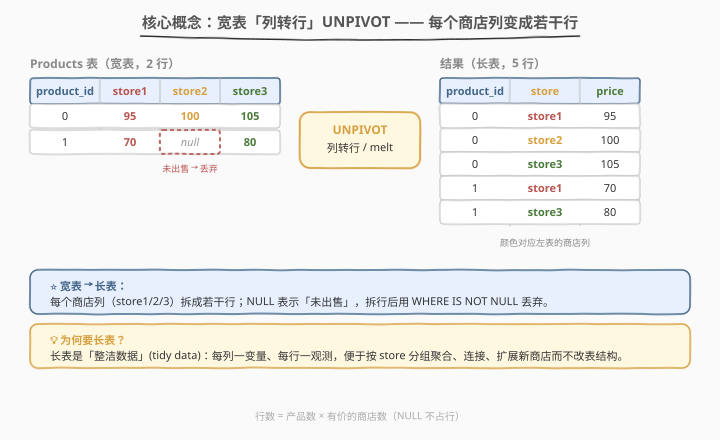
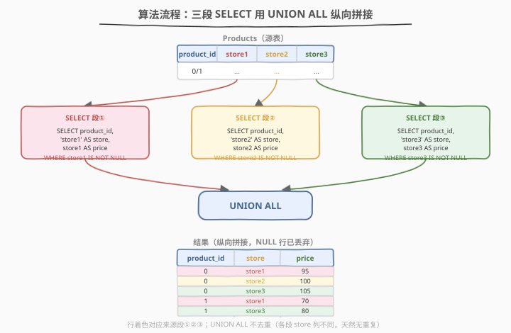
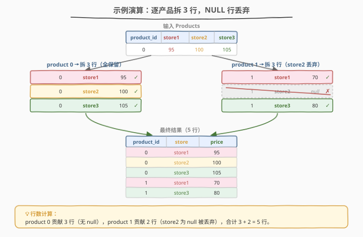

# 每个产品在不同商店的价格

- **题目名称**：每个产品在不同商店的价格
- **链接**：[1795. 每个产品在不同商店的价格](https://leetcode.cn/problems/rearrange-products-table/)
- **难度**：简单
- **标签**：数据库、SQL、`UNION ALL`、UNPIVOT、列转行、`IS NOT NULL`、NULL 处理

## 1. 题目概述

给定 `Products` 表，每行存储一个产品在三个商店 `store1`、`store2`、`store3` 的价格；若某产品在某商店未出售，则对应值为 `null`。要求**重构表结构**，把输出格式变为 `(product_id, store, price)` 的「长表」——每个产品在每个有价的商店各占一行，未出售（`null`）的商店**不输出该行**。结果顺序不限。

**表结构**：

```text
Table: Products
+-------------+---------+
| Column Name | Type    |
+-------------+---------+
| product_id  | int     |
| store1      | int     |
| store2      | int     |
| store3      | int     |
+-------------+---------+
product_id 是该表的主键。
每行存储了这一产品在不同商店 store1, store2, store3 的价格。
如果这一产品在商店里没有出售，则值将为 null。
```

**示例 1**：

```text
输入：
Products 表：
+------------+--------+--------+--------+
| product_id | store1 | store2 | store3 |
+------------+--------+--------+--------+
| 0          | 95     | 100    | 105    |
| 1          | 70     | null   | 80     |
+------------+--------+--------+--------+

输出：
+------------+--------+-------+
| product_id | store  | price |
+------------+--------+-------+
| 0          | store1 | 95    |
| 0          | store2 | 100   |
| 0          | store3 | 105   |
| 1          | store1 | 70    |
| 1          | store3 | 80    |
+------------+--------+-------+

解释：产品 0 在 store1、store2、store3 的价格分别为 95、100、105。
      产品 1 在 store1、store3 的价格分别为 70、80，在 store2 无法买到（值为 null，不输出）。
```

**约束条件**：

- `product_id` 为整数且为主键（无重复）
- `store1`/`store2`/`store3` 为整数价格或 `null`（未出售）
- 结果中每一行的 `store` 列是商店**名字字符串**（`'store1'`/`'store2'`/`'store3'`），不是列引用
- 结果顺序不限

> 💡 本题是 SQL **「列转行」(UNPIVOT)** 的入门母题。它和 1757 的「行过滤 + 列投影」恰恰相反：1757 是**在行方向上筛选、列方向上保留**；1795 则要把**宽表的多列**纵向「融化」成长表的多行。核心动作是把每个商店列单独 `SELECT` 出来，再用 `UNION ALL` 纵向拼接，过程中用 `WHERE ... IS NOT NULL` 丢弃未出售的商店。

---

## 2. 解题思路

### 2.1 暴力思路：取回全表后应用层循环

最直觉的做法：`SELECT * FROM Products` 把整张宽表读进应用程序，再用嵌套循环对每个产品的每个商店列判断 `if price is not None`，手工拼成 `(product_id, store, price)` 三元组。

```text
for row in Products:
    for store_name in ['store1', 'store2', 'store3']:
        price = row[store_name]
        if price is not None:
            emit (row.product_id, store_name, price)
```

这样能得出正确答案，但把**表结构重塑的职责推给了应用层**：网络传输了全部列（包括 `null`），数据库的集合运算能力完全浪费。正确做法是用 SQL 的 `UNION ALL` 在数据库内完成纵向拼接，让结果集以最终形态传出。

> ⚠️ **症结**：宽表 → 长表的本质是「一个产品的 $k$ 个商店列，变成 $k$ 行」。突破口是把每个商店列各自 `SELECT` 成一个统一的三列结果集，再纵向合并——这正是 `UNION ALL` 的用武之地。

### 2.2 核心观察：UNPIVOT 列转行 + NULL 丢弃



**关键洞察**：宽表的每个商店列（`store1`/`store2`/`store3`）在长表里都对应一个**固定的 `store` 名字**和一个**来自该列的 `price` 值**。因此可以针对每个商店列写一段 `SELECT`，把列名作为字符串字面量放进 `store` 列、把该列的值放进 `price` 列：

- **段①**：`SELECT product_id, 'store1' AS store, store1 AS price ...`
- **段②**：`SELECT product_id, 'store2' AS store, store2 AS price ...`
- **段③**：`SELECT product_id, 'store3' AS store, store3 AS price ...`

三段的列数、列名、类型完全一致，可用 `UNION ALL` 纵向拼接成一个结果集。

**NULL 处理**：题目要求「未出售则不输出该行」。`null` 在 SQL 中不能用 `= null` 比较（结果是 `UNKNOWN`，会被过滤逻辑误判），必须用 `IS NOT NULL` 谓词。每段各自加 `WHERE storeX IS NOT NULL` 即可在拼接前丢弃空行。

> 💡 **`store` 列是字符串字面量**：`'store1'` 必须加单引号——它是一个常量字符串，不是列名。若写成 `store1 AS store` 而无引号，数据库会把 `store1` 当作列引用，语义完全不同。单引号界定「值」、无引号界定「列名」是 SQL 的基本规则。

> ⚠️ **为什么不能用 `storeX <> null`**：SQL 中 `null` 表示「未知值」，任何与 `null` 的比较（`=`、`<>`、`<` 等）结果都是 `UNKNOWN`，而 `WHERE` 只保留 `TRUE` 的行。因此 `WHERE store1 <> null` 会过滤掉**所有**行。判空只能用 `IS NULL` / `IS NOT NULL` 这两个专用谓词。

### 2.3 算法流程图



**整体流程**：

| 步骤 | 操作 | 作用 |
|------|------|------|
| ① | `SELECT product_id, 'store1' AS store, store1 AS price FROM Products WHERE store1 IS NOT NULL` | 抽出 store1 列，构造 `(id, 'store1', price)` 行，丢弃 null |
| ② | 同理对 `store2`、`store3` 各写一段 | 抽出另两列 |
| ③ | 三段之间用 `UNION ALL` 连接 | 纵向拼接成一个长表 |

> 💡 **为什么用 `UNION ALL` 而非 `UNION`**：`UNION` 会对结果去重（额外的排序/哈希开销），`UNION ALL` 保留所有行不去重。本题中每段的 `store` 列是不同的字面量（`'store1'`/`'store2'`/`'store3'`），跨段不可能出现完全相同的行；段内 `product_id` 是主键也不会重复。因此**不可能有重复行**，用 `UNION ALL` 既能得到正确结果，又省去了去重开销，是最优选择。

### 2.4 示例演算

以示例 1 的 2 行输入为例，逐产品拆解：



| 产品 | store1 | store2 | store3 | 拆出候选行 | 保留行 |
|------|--------|--------|--------|------------|--------|
| 0 | 95 | 100 | 105 | (0,store1,95)、(0,store2,100)、(0,store3,105) | 3 行（无 null，全保留） |
| 1 | 70 | null | 80 | (1,store1,70)、(1,store2,null)、(1,store3,80) | 2 行（store2 为 null 丢弃） |

> 💡 **行数公式**：最终行数 $=\sum_{\text{产品 }p}(\text{该产品非空商店数})$。本题 $3 + 2 = 5$ 行。若某产品在所有商店都未出售（三列全 `null`），它对结果贡献 0 行——这与题目「未出售则不输出该行」的语义一致。

---

## 3. 参考代码

### SQL（解法 A：`UNION ALL`，推荐）

```sql
SELECT product_id, 'store1' AS store, store1 AS price FROM Products WHERE store1 IS NOT NULL
UNION ALL
SELECT product_id, 'store2' AS store, store2 AS price FROM Products WHERE store2 IS NOT NULL
UNION ALL
SELECT product_id, 'store3' AS store, store3 AS price FROM Products WHERE store3 IS NOT NULL;
```

> 💡 **写法要点**：
> - **`'store1' AS store`**：单引号字符串字面量作为 `store` 列的值，`AS store` 给该列命名。
> - **`store1 AS price`**：无引号的 `store1` 是列引用，把该列的值取到 `price` 列。
> - **`WHERE storeX IS NOT NULL`**：每段独立判空，在拼接前就丢弃未出售的行。
> - **`UNION ALL`**：纵向拼接三段，不去重（本题无重复行，省去去重开销）。
> - ✓ **最推荐**：语法跨 MySQL / PostgreSQL / SQL Server / Oracle 通用，语义清晰，是 LeetCode 预期解法。

### SQL（解法 B：原生 `UNPIVOT`，SQL Server / Oracle）

```sql
-- SQL Server / Oracle 语法（LeetCode 本题主用 MySQL，此为对照）
SELECT product_id, store, price
FROM Products
UNPIVOT (
    price FOR store IN (store1, store2, store3)
) u;
```

> 💡 **原生 `UNPIVOT`**：把 `store1`/`store2`/`store3` 三列的列名变成 `store` 列的值、对应单元格的值变成 `price` 列。**`UNPIVOT` 默认丢弃 `null`**，无需手写 `WHERE IS NOT NULL`。但它是 SQL Server / Oracle 的扩展语法，MySQL 不支持，LeetCode 本题环境通常用 MySQL，故解法 A 更通用。

### Python（pandas）

```python
import pandas as pd

def rearrange_products_table(products: pd.DataFrame) -> pd.DataFrame:
    return (products.melt(id_vars='product_id',
                          value_vars=['store1', 'store2', 'store3'],
                          var_name='store', value_name='price')
                  .dropna(subset=['price']))
```

> 💡 **pandas 对照**：
> - `melt` 即「融化」宽表为长表，对应 SQL 的 UNPIVOT：`id_vars` 保留为标识列，`value_vars` 的列名进入 `store` 列、单元格值进入 `price` 列。
> - `dropna(subset=['price'])` 对应 `WHERE price IS NOT NULL`，丢弃未出售行。
> - `melt` 默认会保留 `null` 行（不像 SQL `UNPIVOT` 自动丢弃），故需显式 `dropna`。

---

## 4. 复杂度分析

| 维度 | 复杂度 | 说明 |
|------|--------|------|
| 时间 | $O(n \cdot k)$ | $n$ 为产品数、$k$ 为商店列数（本题 $k=3$）；每段对全表扫描一次并判空，共 $k$ 段 |
| 空间 | $O(n \cdot k)$ | 输出长表最多 $n \cdot k$ 行（全非空时），每行 3 列 |

> - **段数 = 商店列数 $k$**：每段独立扫描源表一次。本题 $k=3$ 固定，故 $O(n)$。
> - **输出规模**：行数 $=\sum$ 非空单元格数 $\le n \cdot k$。若产品多在某店未售，行数更少。
> - **优化器行为**：多数引擎会把 `UNION ALL` 的各段并行扫描，再合并；若在 `product_id` 上有索引且只需投影，可走覆盖扫描。本题数据量小，开销可忽略。
> - **`UNION ALL` vs `UNION`**：后者需对结果排序/哈希去重，$O(m \log m)$（$m$ 为结果行数）。本题无重复行，用 `UNION ALL` 避免此开销。

---

## 5. 扩展：UNION vs UNION ALL、长表 vs 宽表

### 5.1 UNION 与 UNION ALL 的对比

`UNION` 和 `UNION ALL` 都把多个结果集纵向拼接，区别在于**是否去重**：

| 运算 | 去重 | 开销 | 适用场景 |
|------|------|------|----------|
| `UNION` | 是（额外排序/哈希） | $O(m \log m)$ | 需要「合并并去重」时 |
| `UNION ALL` | 否（保留所有行） | $O(m)$ | 已知无重复、或允许重复时 |

> ⚠️ **本题为何必用 `UNION ALL`**：每段的 `store` 列是不同字面量（`'store1'`/`'store2'`/`'store3'`），跨段行必不同；段内 `product_id` 为主键也不重复。因此不可能有重复行，`UNION` 的去重是纯浪费。误用 `UNION` 虽结果正确，但多一次无意义的去重排序。

> 💡 **判断口诀**：若各段已含一个「跨段取值互斥」的列（如本题的 `store` 字面量），用 `UNION ALL`；若不确定是否有重复且需要去重，用 `UNION`。

### 5.2 列转行的三种写法

| 写法 | 语法 | 通用性 | 自动丢弃 NULL |
|------|------|--------|---------------|
| `UNION ALL` 多段 | 标准 SQL | ✓ 全平台 | ✗ 需手写 `WHERE IS NOT NULL` |
| 原生 `UNPIVOT` | `UNPIVOT (val FOR name IN (c1,c2,...))` | SQL Server / Oracle | ✓ 自动丢弃 |
| `CROSS JOIN` + `CASE`/`VALUES` | 标准 SQL | ✓ 全平台 | ✗ 需手写判空 |

`CROSS JOIN` 写法（当商店列很多时比 `UNION ALL` 更紧凑）：

```sql
SELECT p.product_id, t.store,
       CASE t.store
           WHEN 'store1' THEN p.store1
           WHEN 'store2' THEN p.store2
           WHEN 'store3' THEN p.store3
       END AS price
FROM Products p
CROSS JOIN (VALUES ('store1'), ('store2'), ('store3')) AS t(store)
WHERE CASE t.store WHEN 'store1' THEN p.store1
                   WHEN 'store2' THEN p.store2
                   WHEN 'store3' THEN p.store3 END IS NOT NULL;
```

> 💡 商店列从 3 个扩展到几十个时，`UNION ALL` 要写几十段，`CROSS JOIN` + `VALUES` 只需扩展一个列表，更易维护。

### 5.3 长表 vs 宽表（整洁数据）

| 形态 | 结构 | 增加新商店 | 按商店聚合 | 适用 |
|------|------|-----------|-----------|------|
| 宽表 | 每商店一列 | **改表结构**（加列） | 需逐列 `CASE WHEN` | 展示给人看、列数固定 |
| 长表 | `(id, store, price)` | **加几行**即可 | `GROUP BY store` 直接聚合 | 存储、分析、扩展 |

> 💡 **为何要长表**：长表是「整洁数据」(tidy data)——每列一个变量、每行一次观测。它让「按商店分组求均价」「连接商店维度表」「新增商店不改结构」都变得自然。宽表适合给人看（如报表），长表适合给机器算。1795 的本质就是把**展示友好的宽表**转成**计算友好的长表**。

---

## 6. 面试要点

1. **`UNION` 和 `UNION ALL` 的区别？本题为什么用 `UNION ALL`？**

   > `UNION` 合并并去重（额外排序/哈希，$O(m\log m)$），`UNION ALL` 仅合并不去重（$O(m)$）。本题每段的 `store` 列是不同字面量，跨段行必不同；段内 `product_id` 为主键也不重复，故不可能有重复行。用 `UNION ALL` 省去无意义的去重开销。若误用 `UNION` 结果虽对但更慢。

2. **为什么 `'store1'` 要加单引号？`store1 AS price` 为什么不加引号？**

   > 单引号界定**字符串字面量**（值），`'store1'` 是要放进 `store` 列的常量字符串；无引号界定**列名**，`store1`（在 `store1 AS price` 中）是引用源表的列、把该列的值取到 `price`。混用会语义错误：`store1 AS store`（无引号）会被当成列引用而非字符串常量。

3. **为什么判空必须用 `IS NOT NULL`，不能用 `<> null` 或 `!= null`？**

   > SQL 中 `null` 表示「未知」，与 `null` 的任何比较（`=`、`<>`、`<` 等）结果都是 `UNKNOWN`，而 `WHERE` 只保留 `TRUE` 的行。因此 `WHERE store1 <> null` 会过滤掉所有行。`IS NULL` / `IS NOT NULL` 是专门判空的谓词，把 `null` 当作「存在性」而非「值比较」处理。

4. **如果要扩展到几十个商店列，怎么写更优雅？**

   > 用 `CROSS JOIN (VALUES ...) ` 生成商店名列表，再用 `CASE` 把对应列的值取到 `price`。这样只需扩展一个 `VALUES` 列表，而非写几十段 `UNION ALL`。若用 SQL Server / Oracle，原生 `UNPIVOT (price FOR store IN (...))` 更简洁且自动丢弃 `null`。pandas 则用 `melt`，列再多也只改 `value_vars` 列表。

5. **长表和宽表各有什么优劣？什么时候选哪种？**

   > 宽表（每商店一列）适合展示给人看、列数固定且少；但增加商店要改表结构，按商店聚合要逐列 `CASE`。长表 `(id, store, price)` 是「整洁数据」——加商店只加行不改结构、`GROUP BY store` 直接聚合、易连接维度表。存储与分析优先长表，展示优先宽表。本题正是宽→长的转换。

> 💡 **一句话总结**：1795 是 SQL 「列转行」UNPIVOT 的入门母题——`SELECT product_id, 'storeX' AS store, storeX AS price FROM Products WHERE storeX IS NOT NULL` 三段用 `UNION ALL` 拼接。四大要点：① 商店名是字符串字面量要加单引号；② 判空用 `IS NOT NULL` 而非 `<> null`；③ 无重复行用 `UNION ALL` 省去重；④ 长表是整洁数据，利于聚合与扩展。

---

## 7. 同类练习题

- [1179. 重新格式化部门表](https://leetcode.cn/problems/reformat-department-table/)：与本题互为镜像——1179 是「行转列」(PIVOT)，把 `(id, revenue, month)` 长表转成每月一列的宽表；1795 是「列转行」(UNPIVOT)，方向相反，对照阅读可建立双向转换的心智模型
- [1435. 创建会话柱状图](https://leetcode.cn/problems/create-a-session-bar-chart/)：用多段 `UNION ALL` 把不同区间的计数拼成行，巩固「分段 SELECT + UNION ALL 纵向拼结果」的套路
- [608. 树节点](https://leetcode.cn/problems/tree-node/)：用 `UNION`（非 `UNION ALL`）合并三种条件的查询结果并去重，对照本题理解何时该去重、何时该用 `UNION ALL`
- [1308. 不同性别每日分数总计](https://leetcode.cn/problems/running-totals-for-different-genders/)：先用 UNPIVOT 把男女两列融化为长表、再用窗口函数求 running total，是 UNPIVOT 与分析函数结合的进阶题
