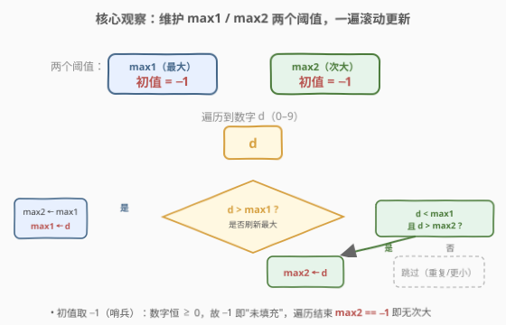
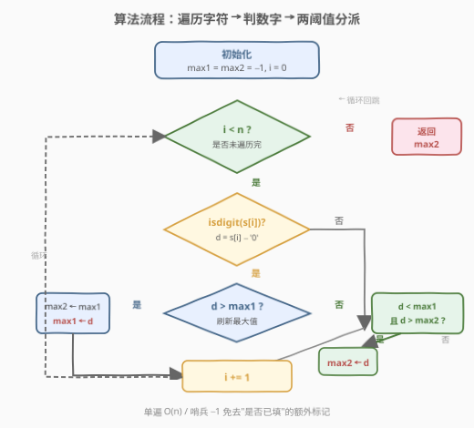
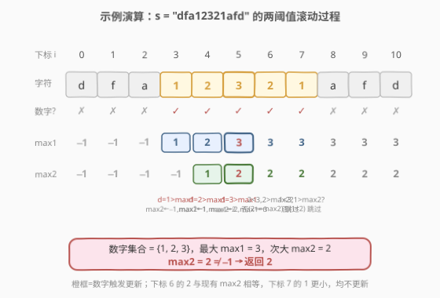

# LeetCode 字符串中第二大的数字 题解

## 1. 题目概述

- **标题 / 题号**：字符串中第二大的数字（#1796，easy）
- **链接**：https://leetcode.cn/problems/second-largest-digit-in-a-string/
- **难度**：简单
- **标签**：字符串、数学、一次遍历

**题意**：给定一个**混合字符串** `s`（由小写英文字母和数字组成），请你返回 `s` 中**第二大**的数字；如果不存在第二大的数字，返回 `-1`。这里的"第二大"指**去重后**的次大值（出现多次的同一数字只算一个）。

**示例 1**：

```text
输入：s = "dfa12321afd"
输出：2
解释：出现在 s 中的数字为 {1, 2, 3}。第二大的数字是 2。
```

**示例 2**：

```text
输入：s = "abc1111"
输出：-1
解释：出现在 s 中的数字只有 {1}，不存在第二大的数字。
```

**约束**：

- $1 \le s.length \le 500$
- `s` 只包含小写英文字母和（或）数字

> 💡 **关键直觉**：数字只有 $0$–$9$ 共 10 种取值，"找第二大"本质是在一个**值域只有 10 个元素**的集合里求次大。两种主流思路：① 用 `visited[10]` 布尔数组标记出现过的数字，再从 $9$ 倒序找第二个 `true`；② 一遍遍历维护 `max1`/`max2` 两个阈值，**滚动更新**。后者无需第二趟扫描，且把"去重"自然融入比较条件（`d < max1` 自动剔除与最大相等的重复值）。

## 2. 解题思路

### 2.1 暴力思路：收集 + 排序

朴素做法是先遍历一遍，把所有数字字符转成整数收集到一个集合里（天然去重），再排序或求次大。时间 $O(n)$、空间 $O(1)$（集合最多 10 个元素）。复杂度已达标，但需要额外容器与第二趟处理。能否**一遍、两变量**搞定？

### 2.2 核心观察：两阈值滚动更新



把"求去重后的次大"转化为**在线维护两个阈值**：`max1` 记录当前见过的最大数字，`max2` 记录严格小于 `max1` 的次大数字。遍历每个字符，若是数字 $d$，按三种情况分派：

- **$d > max1$**：$d$ 成为新最大，原 `max1` **降级**为次大 → `max2 = max1; max1 = d`
- **$max1 > d > max2$**：$d$ 夹在两者之间，刷新次大 → `max2 = d`
- **$d = max1$ 或 $d \le max2$**：重复值或更小值，**跳过**

> 💡 **为什么这等价于"去重后次大"？** 关键在第二条用**严格不等号** `d < max1`。当 $d = max1$（与最大重复）时既不进第一条也不进第二条，被自动忽略——这正是"去重"的体现。同理 `d > max2` 保证 `max2` 始终严格小于 `max1`。

> ⚠️ **初值取 $-1$ 作为哨兵**：数字恒 $\ge 0$，故 $-1$ 表示"未填充"。遍历结束若 `max2` 仍为 $-1$，说明有效数字不足两个，返回 $-1$。这一哨兵免去了"是否已见过数字"的额外布尔标记。

> 💡 **同源范式**：这是经典的"**一次遍历维护 top-k**"模式（此处 $k=2$）。[334. 递增的三元子序列](https://leetcode.cn/problems/increasing-triplet-subsequence/)（[题解](../0301-0400/334_递增的三元子序列.md)）维护 `first`/`second` 两阈值判定 LIS≥3，[414. 第三大的数](https://leetcode.cn/problems/third-maximum-number/)（[题解](../0401-0500/414_第三大的数.md)）维护三个阈值求第三大，均同此理。推广到 top-k 可用大小为 $k$ 的最小堆，但 $k=2$ 时两变量足够，常数更小。

### 2.3 算法流程图



一次遍历，每个字符做一次 `isdigit` 判定（$O(1)$）和至多两次比较，总 $O(n)$。

### 2.4 示例演算

以 `s = "dfa12321afd"`（$n = 11$）为例：



| 下标 $i$ | 字符 | 数字? | 动作 | max1 | max2 |
|----------|------|-------|------|------|------|
| 0 | `d` | ✗ | 跳过 | $-1$ | $-1$ |
| 1 | `f` | ✗ | 跳过 | $-1$ | $-1$ |
| 2 | `a` | ✗ | 跳过 | $-1$ | $-1$ |
| 3 | `1` | ✓ | $1 > max1$ → 降级 | $1$ | $-1$ |
| 4 | `2` | ✓ | $2 > max1$ → 降级 | $2$ | $1$ |
| 5 | `3` | ✓ | $3 > max1$ → 降级 | $3$ | $2$ |
| 6 | `2` | ✓ | $2 < max1$ 但 $2 = max2$ → 跳过 | $3$ | $2$ |
| 7 | `1` | ✓ | $1 < max1$ 且 $1 < max2$ → 跳过 | $3$ | $2$ |
| 8–10 | `afd` | ✗ | 跳过 | $3$ | $2$ |

终值 $\text{max2} = 2 \ne -1$ → **返回 2** ✓

对照示例 2 `"abc1111"`：所有数字均为 $1$，遍历后 $max1 = 1$、$max2 = -1$（首次 $1 > -1$ 触发降级，后续 $1 = max1$ 全部跳过）→ 返回 $-1$ ✓

## 3. 参考代码

### Python（两阈值滚动）

```python
class Solution:
    def secondHighest(self, s: str) -> int:
        max1 = max2 = -1
        for ch in s:
            if ch.isdigit():
                d = int(ch)
                if d > max1:
                    max2 = max1
                    max1 = d
                elif d < max1 and d > max2:
                    max2 = d
        return max2
```

### C++（两阈值滚动）

```cpp
class Solution {
public:
    int secondHighest(string s) {
        int max1 = -1, max2 = -1;
        for (char ch : s) {
            if (isdigit(ch)) {
                int d = ch - '0';
                if (d > max1) {
                    max2 = max1;
                    max1 = d;
                } else if (d < max1 && d > max2) {
                    max2 = d;
                }
            }
        }
        return max2;
    }
};
```

> 💡 **实现细节**：① `isdigit(ch)` 直接判定数字字符，无需先过滤字母。② `d < max1 && d > max2` 两个严格不等号缺一不可：前者排除与 `max1` 相等的重复值，后者保证 `max2` 严格次大。③ 哨兵 $-1$ 利用"数字恒 $\ge 0$"这一约束，把"无次大"与"次大值为 $0$"区分开——若题目数字可能为负，需改用 `optional` 或单独的 `filled` 标记。

## 4. 复杂度分析

| 维度 | 复杂度 | 说明 |
|------|--------|------|
| 时间 | $O(n)$ | 单遍遍历，每个字符 $O(1)$ 判数字 + $O(1)$ 比较 |
| 空间 | $O(1)$ | 仅两个整型变量 `max1`/`max2`，与输入规模无关 |

> ⚠️ 暴力"收集+排序"同样 $O(n)/O(1)$（集合最多 10 个元素，排序为 $O(10 \log 10) = O(1)$）。两阈值法的优势在于**一遍、两变量、无容器**，常数更小，且展示了 top-k 在线维护的通用思维。

## 5. 扩展：布尔数组标记法

数字值域仅 $0$–$9$，可用定长布尔数组记录出现过的数字，再从 $9$ 倒序找第二个 `true`：

```cpp
class Solution {
public:
    int secondHighest(string s) {
        bool seen[10] = {};
        for (char ch : s)
            if (isdigit(ch)) seen[ch - '0'] = true;
        int cnt = 0;
        for (int d = 9; d >= 0; d--) {
            if (seen[d] && ++cnt == 2) return d;
        }
        return -1;
    }
};
```

> 💡 **两法对比**：布尔数组法**两趟**（标记 + 倒序扫描），但逻辑直白、不易写错边界；两阈值法**一趟**，更省一次扫描，但需小心 `d < max1` 的严格性。面试中两法均可，先讲布尔数组法建立直觉，再优化到两阈值法展示思维层次。

> 💡 **推广到 top-k**：当 $k$ 较大（如求第 $10$ 大）时，两变量法不再适用，应改用**大小为 $k$ 的最小堆**：堆满后新元素大于堆顶则替换。本题 $k=2$，两变量即退化版的"最小堆"——`max2` 相当于堆顶，`max1` 是堆中唯一更大的元素。

## 6. 面试要点

1. **为什么用 `d < max1` 而不是 `d <= max1`？**

   > 用严格小于。若用 `<=`，当 $d = max1$（与最大重复）时会进入第二条分支并执行 `max2 = d`，使 `max2` 等于 `max1`，破坏"严格次大"的语义，最终可能返回错误的最大值本身。严格 `<` 让重复值被自动忽略，等价于"去重"。

2. **哨兵 $-1$ 为什么安全？什么时候会失效？**

   > 题目保证数字为 $0$–$9$，恒 $\ge 0$，故 $-1$ 不会与任何真实数字混淆，可作"未填充"标记。若数字值域包含负数（如数组求次大允许负值），$-1$ 可能撞上真实值，需改用 `optional<int>` 或单独的布尔 `has_max2` 标记。

3. **如果要求"第 $k$ 大的数字"呢？**

   > $k$ 较小时仍用多变量维护（如 $k=3$ 求第三大见 [414. 第三大的数](https://leetcode.cn/problems/third-maximum-number/)）；$k$ 较大时用大小为 $k$ 的最小堆，遍历一遍后堆顶即第 $k$ 大。值域小（如本题 0–9）时布尔数组 + 倒序计数最稳。

4. **`isdigit` 和 `'0' <= ch && ch <= '9'` 有区别吗？**

   > 本题约束只含小写字母和数字，两者等价。但标准库 `isdigit` 会受 locale 影响（可能把某些本地化数字字符判为数字），在严格约束下手写 `'0' <= ch && ch <= '9'` 更可控、更安全。C++ 中 `isdigit` 参数若为负 `char` 还是 UB，需先转 `unsigned char`，故手写区间判定反而更省心。

5. **遍历顺序对结果有影响吗？**

   > 没有。两阈值法是**结合律**的在线归约：无论以何种顺序见到这些数字，最终 `max1` 恒为全局最大、`max2` 恒为全局严格次大。这是因为更新规则只取决于当前 $d$ 与已有两阈值的大小关系，与到达顺序无关——这是所有"在线 top-k"算法共有的性质。

> 💡 **一句话总结**：一遍遍历，`d > max1` 则降级（`max2=max1; max1=d`），`max1 > d > max2` 则刷新次大（`max2=d`），其余跳过；哨兵 $-1$ 兼作"无次大"标记。

## 同类练习题

| # | 题目 | 与本题的关联 |
|---|------|-------------|
| 414 | [第三大的数](https://leetcode.cn/problems/third-maximum-number/)（[题解](../0401-0500/414_第三大的数.md)） | 本题的"三阈值"升级版——维护三个变量求严格第三大，哨兵同样取 $-\infty$，严格不等号去重的同源套路 |
| 334 | [递增的三元子序列](https://leetcode.cn/problems/increasing-triplet-subsequence/)（[题解](../0301-0400/334_递增的三元子序列.md)） | 维护 `first`/`second` 两阈值判定是否存在长度 ≥ 3 的递增子序列，同属"一次遍历维护 top-k"范式 |
| 747 | [至少是其他数字两倍的最大数](https://leetcode.cn/problems/largest-number-at-least-twice-of-others/)（[题解](../0701-0800/747_至少是其他数字两倍的最大数.md)） | $k=1$ 的退化版——一遍求最大，再验证"最大 ≥ 2 × 次大"，正好用到本题的 `max1`/`max2` 两阈值 |
| 628 | [三个数的最大乘积](https://leetcode.cn/problems/maximum-product-of-three-numbers/)（[题解](../0601-0700/628_三个数的最大乘积.md)） | 一遍维护 `max1/max2/max3` 与 `min1/min2` 两套阈值，负数情形需同时跟踪最小值，两阈值思维的双向扩展 |
| 400 | [第 N 位数字](https://leetcode.cn/problems/nth-digit/)（[题解](../0301-0400/400_第N位数字.md)） | 同样"数字值域有限"的字符串/数字定位题，按位数分层定位而非维护阈值，对照"值域小"问题的另一种解题路径 |
