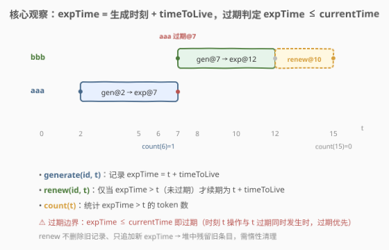
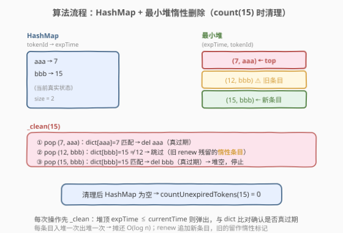
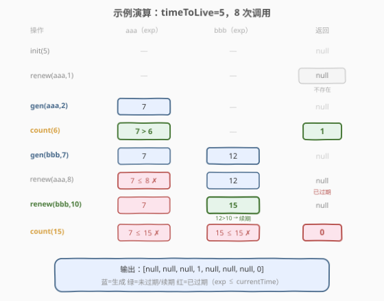

# LeetCode 设计一个验证系统 题解

## 1. 题目概述

- **标题 / 题号**：设计一个验证系统（#1797，medium）
- **链接**：https://leetcode.cn/problems/design-authentication-manager/
- **难度**：中等
- **标签**：设计、哈希表、堆、惰性删除

**题意**：设计一个验证码验证系统。每个验证码在生成时刻 `currentTime` 之后 `timeToLive` 秒过期。验证码可被续期（延长 `timeToLive` 秒）。

实现 `AuthenticationManager` 类：

- `AuthenticationManager(int timeToLive)`：构造并设置 `timeToLive`。
- `generate(string tokenId, int currentTime)`：在 `currentTime` 时刻生成新验证码。
- `renew(string tokenId, int currentTime)`：将**未过期**的验证码在 `currentTime` 续期；若不存在或已过期则忽略。
- `countUnexpiredTokens(int currentTime)`：返回 `currentTime` 时刻未过期的验证码数目。

> ⚠️ **过期优先规则**：若验证码在时刻 $t$ 过期，且另一操作恰在时刻 $t$ 发生，则**过期事件优先**。

**示例 1**：

```text
输入：
["AuthenticationManager", "renew", "generate", "countUnexpiredTokens", "generate", "renew", "renew", "countUnexpiredTokens"]
[[5], ["aaa", 1], ["aaa", 2], [6], ["bbb", 7], ["aaa", 8], ["bbb", 10], [15]]
输出：
[null, null, null, 1, null, null, null, 0]
```

**约束**：

- $1 \le \text{timeToLive} \le 10^8$
- $1 \le \text{currentTime} \le 10^8$
- $1 \le \text{tokenId.length} \le 5$，仅含小写字母
- 所有 `generate` 的 `tokenId` 互不相同
- 所有调用中 `currentTime` **严格递增**
- 总调用次数不超过 $2000$

> 💡 **关键直觉**：每个 token 的核心属性只有一个——**过期时刻** $\text{expTime} = \text{生成/续期时刻} + \text{timeToLive}$。判定过期只需比较 $\text{expTime}$ 与 $\text{currentTime}$。暴力用哈希表 $O(1)$ 增改、$O(n)$ 计数即可过；进阶用**最小堆 + 惰性删除**把计数也压到摊还 $O(\log n)$。

## 2. 解题思路

### 2.1 暴力思路：哈希表 + 线性扫描

最直接的做法是用一个哈希表 `token_exp` 记录 `tokenId → expTime`：

- `generate`：`token_exp[id] = currentTime + ttl`，$O(1)$。
- `renew`：若 `id` 在表中且 `token_exp[id] > currentTime`（未过期），则 `token_exp[id] = currentTime + ttl`，$O(1)$。
- `countUnexpiredTokens`：遍历所有 `expTime`，统计 `> currentTime` 的个数，$O(n)$。

总调用 $\le 2000$，$O(n \cdot Q) \le 4 \times 10^6$，完全可过。

### 2.2 核心观察：过期边界 + 最小堆惰性删除



**过期边界的精确语义**是本题最易踩坑的点：

- token 在时刻 $g$ 生成，则 $\text{expTime} = g + \text{timeToLive}$。
- 在时刻 $t$ 判定是否过期：$\text{expTime} \le t$ 即过期（含等号！）。因为"过期优先"规则意味着 $t = \text{expTime}$ 时 token 已过期。
- 因此**未过期** $\iff \text{expTime} > \text{currentTime}$。

> ⚠️ **常见错误**：把条件写成 `expTime >= currentTime`（漏掉等号），会在 $t = \text{expTime}$ 时把已过期 token 误判为未过期，导致 `renew` 错误续期或 `count` 多算。

**暴力方案的瓶颈**在 `countUnexpiredTokens` 的 $O(n)$ 线性扫描。优化思路：用一个**按 expTime 排序的最小堆**维护所有 token 的过期时刻，配合哈希表做**惰性删除**（lazy deletion）：

- **哈希表** `token_exp`：`tokenId → 当前真实 expTime`（唯一权威来源）。
- **最小堆** `heap`：存放 `(expTime, tokenId)`，**可能含过期残留条目**（renew 追加新条目后，旧条目仍留在堆中）。
- **清理 `_clean(currentTime)`**：只要堆顶 `expTime ≤ currentTime`，就弹出并与哈希表比对：
  - 若 `token_exp[tid] == expTime`：这是**真实过期**，从哈希表删除。
  - 若不等：这是 renew 留下的**惰性残留**（已被新 expTime 覆盖），直接丢弃。

清理后，哈希表中只剩未过期 token，`count` 直接返回 `len(token_exp)`。

### 2.3 算法流程图



以示例中 `countUnexpiredTokens(15)` 为例，此时：

- 哈希表：`{aaa → 7, bbb → 15}`
- 堆：`[(7, aaa), (12, bbb), (15, bbb)]`（`(12, bbb)` 是 `renew(bbb, 10)` 前的旧条目）

`_clean(15)` 执行三步：

1. pop `(7, aaa)`：`token_exp[aaa] == 7` 匹配 → 真过期，删除 `aaa`。
2. pop `(12, bbb)`：`token_exp[bbb] == 15 ≠ 12` → 惰性残留，跳过。
3. pop `(15, bbb)`：`token_exp[bbb] == 15` 匹配 → 真过期，删除 `bbb`。

堆空 → 返回 `len(token_exp) = 0`。

### 2.4 示例演算



| 步骤 | 操作 | aaa (exp) | bbb (exp) | 说明 | 返回 |
|------|------|-----------|-----------|------|------|
| ① | `init(5)` | — | — | ttl = 5 | null |
| ② | `renew(aaa, 1)` | — | — | aaa 不存在，忽略 | null |
| ③ | `generate(aaa, 2)` | 7 | — | exp = 2 + 5 | null |
| ④ | `count(6)` | 7 | — | 7 > 6 → 未过期 | **1** |
| ⑤ | `generate(bbb, 7)` | 7 | 12 | exp = 7 + 5 | null |
| ⑥ | `renew(aaa, 8)` | 7 | 12 | 7 ≤ 8 → 已过期，忽略 | null |
| ⑦ | `renew(bbb, 10)` | 7 | **15** | 12 > 10 → 续期，exp = 10 + 5 | null |
| ⑧ | `count(15)` | 7 | 15 | 7 ≤ 15, 15 ≤ 15 → 均过期 | **0** |

> 💡 **第 ⑥ 步关键**：aaa 在 $t=7$ 过期，`renew` 在 $t=8$ 调用，$7 \le 8$ 判定已过期，正确忽略。第 ⑧ 步中 bbb 的 expTime 恰为 15，$15 \le 15$ 判定已过期（过期优先），返回 0。

## 3. 参考代码

### Python（暴力 + 堆优化两版）

```python
# ---------- 暴力版：O(n) per count ----------
class AuthenticationManager:
    def __init__(self, timeToLive: int):
        self.ttl = timeToLive
        self.token_exp = {}  # tokenId -> expiration time

    def generate(self, tokenId: str, currentTime: int) -> None:
        self.token_exp[tokenId] = currentTime + self.ttl

    def renew(self, tokenId: str, currentTime: int) -> None:
        if tokenId in self.token_exp and self.token_exp[tokenId] > currentTime:
            self.token_exp[tokenId] = currentTime + self.ttl

    def countUnexpiredTokens(self, currentTime: int) -> int:
        return sum(1 for exp in self.token_exp.values() if exp > currentTime)


# ---------- 堆优化版：摊还 O(log n) per op ----------
import heapq

class AuthenticationManager:
    def __init__(self, timeToLive: int):
        self.ttl = timeToLive
        self.token_exp = {}  # tokenId -> 当前真实 expTime
        self.heap = []       # 最小堆 (expTime, tokenId)，含惰性残留

    def _clean(self, currentTime: int) -> None:
        """弹出所有 expTime <= currentTime 的堆顶，与 dict 比对确认是否真过期。"""
        while self.heap and self.heap[0][0] <= currentTime:
            exp, tid = heapq.heappop(self.heap)
            if tid in self.token_exp and self.token_exp[tid] == exp:
                del self.token_exp[tid]

    def generate(self, tokenId: str, currentTime: int) -> None:
        exp = currentTime + self.ttl
        self.token_exp[tokenId] = exp
        heapq.heappush(self.heap, (exp, tokenId))

    def renew(self, tokenId: str, currentTime: int) -> None:
        self._clean(currentTime)
        if tokenId in self.token_exp:  # 清理后仍存在 = 未过期
            exp = currentTime + self.ttl
            self.token_exp[tokenId] = exp
            heapq.heappush(self.heap, (exp, tokenId))

    def countUnexpiredTokens(self, currentTime: int) -> int:
        self._clean(currentTime)
        return len(self.token_exp)
```

### C++（堆优化版）

```cpp
class AuthenticationManager {
    int ttl;
    unordered_map<string, int> token_exp;  // tokenId -> expTime
    // 最小堆：(expTime, tokenId)，greater 使 pair 按第一字段升序
    priority_queue<pair<int, string>, vector<pair<int, string>>,
                   greater<pair<int, string>>> heap;

    void clean(int currentTime) {
        while (!heap.empty() && heap.top().first <= currentTime) {
            auto [exp, tid] = heap.top();
            heap.pop();
            auto it = token_exp.find(tid);
            if (it != token_exp.end() && it->second == exp)
                token_exp.erase(it);
        }
    }

public:
    AuthenticationManager(int timeToLive) : ttl(timeToLive) {}

    void generate(string tokenId, int currentTime) {
        int exp = currentTime + ttl;
        token_exp[tokenId] = exp;
        heap.push({exp, tokenId});
    }

    void renew(string tokenId, int currentTime) {
        clean(currentTime);
        auto it = token_exp.find(tokenId);
        if (it != token_exp.end()) {
            int exp = currentTime + ttl;
            it->second = exp;
            heap.push({exp, tokenId});
        }
    }

    int countUnexpiredTokens(int currentTime) {
        clean(currentTime);
        return (int)token_exp.size();
    }
};
```

> 💡 **实现细节**：① `renew` 中**先 `_clean` 再查 dict**——清理掉过期 token 后，dict 中若仍有该 id 才说明真未过期。② renew 不删除堆中旧条目，只追加新 `(exp, id)`，旧的留作惰性标记，由后续 `_clean` 自然清理。③ 比对 `token_exp[tid] == exp` 是区分"真过期"与"惰性残留"的关键——只有 expTime 完全匹配才说明该条目未被 renew 覆盖。

## 4. 复杂度分析

| 维度 | 暴力哈希表 | 堆优化版 |
|------|-----------|----------|
| **generate** | $O(1)$ | $O(\log n)$（push） |
| **renew** | $O(1)$ | 摊还 $O(\log n)$（clean + push） |
| **countUnexpiredTokens** | $O(n)$ | 摊还 $O(\log n)$（clean 后 size 为 $O(1)$） |
| **总时间** | $O(n \cdot Q) \le 4 \times 10^6$ | $O(Q \log n)$ |
| **空间** | $O(n)$ | $O(n + Q)$（堆含惰性条目） |

> ⚠️ **摊还分析**：堆中每个条目最多入堆一次、出堆一次。$Q$ 次操作共 push 最多 $Q$ 个条目，故 `_clean` 的总 pop 次数 $\le Q$，分摊到每次操作为 $O(\log n)$。暴力版在 $Q \le 2000$ 时完全够用；堆优化版在 $Q$ 更大时优势显著。

## 5. 扩展：有序 map 维护过期桶

除最小堆外，也可用**有序 map**（C++ `map<int, int>` / Python `sortedcontainers`）按 expTime 分桶维护计数：

- `token_exp`：`tokenId → expTime`（同前）。
- `exp_count`：`map<expTime, count>`，记录每个 expTime 对应的 token 数。
- `generate`：`token_exp[id] = exp`，`exp_count[exp] += 1`。
- `renew`：若未过期，`exp_count[old_exp] -= 1`（为 0 则删 key），`exp_count[new_exp] += 1`，更新 `token_exp[id]`。
- `count(t)`：删除 `exp_count` 中所有 key $\le t$ 的桶（累减计数），返回剩余 token 总数。

| 维度 | 复杂度 | 说明 |
|------|--------|------|
| generate | $O(\log n)$ | map 插入 |
| renew | $O(\log n)$ | 改两个桶 |
| count | $O(k \log n)$ | $k$ = 过期桶数，摊还 $O(\log n)$ |
| 空间 | $O(n)$ | 无惰性残留 |

> 💡 **堆 vs 有序 map**：有序 map 无惰性残留、空间更省，但 Python 标准库无 `sortedcontainers`，需第三方库或手写平衡树；堆方案仅依赖标准库，面试中更易实现。C++ 中 `map` 方案更自然。

## 6. 面试要点

1. **过期边界为什么是 `expTime ≤ currentTime` 而非 `<`？**

   > 题目明确"过期事件优先于同时刻的其他操作"。token 在 $\text{expTime}$ 时刻过期，若 `count` 或 `renew` 也在 $\text{expTime}$ 时刻调用，则 token 已被判定过期。因此未过期 $\iff \text{expTime} > \text{currentTime}$，过期 $\iff \text{expTime} \le \text{currentTime}$。

2. **惰性删除如何保证正确性？堆中残留旧条目不会误删吗？**

   > `_clean` 弹出堆顶后，**比对 `token_exp[tid] == exp`**：只有 expTime 完全匹配才说明该条目未被 renew 覆盖，执行删除；不匹配则是旧残留，直接丢弃。哈希表始终是唯一权威来源，堆只是"按 expTime 排序的候选清理队列"。

3. **`renew` 为什么要先 `_clean` 再查 dict？**

   > 先清理过期 token，确保 dict 中只剩未过期的。此时若 `tokenId` 仍在 dict 中，则它一定未过期（`expTime > currentTime`），可以安全续期。若不先清理，可能把已过期但尚未被清的 token 误判为存在而续期。

4. **暴力方案能过吗？何时需要堆优化？**

   > $Q \le 2000$ 时暴力 $O(n \cdot Q) \le 4 \times 10^6$ 完全可过。若 $Q$ 升至 $10^5$ 级别，暴力的 $O(n \cdot Q)$ 会超时，需堆优化将每次操作压到 $O(\log n)$。面试中先写暴力说清思路，再提出优化方向。

5. **`currentTime` 严格递增这一条件有何作用？**

   > 保证堆顶的 expTime 不会"回退"——已弹出的过期时刻不会在后续操作中再次变为未过期。这使得 `_clean` 的单调推进是安全的：每次清理到堆顶 `> currentTime` 即可停止，无需回头扫描。若时间非单调递增，惰性删除策略需更谨慎处理。

> 💡 **一句话总结**：哈希表记 `tokenId → expTime`，最小堆按 expTime 排序做惰性清理，`_clean` 比对 dict 区分真过期与残留，每次操作摊还 $O(\log n)$；过期边界是 `expTime ≤ currentTime`（含等号）。

## 同类练习题

| # | 题目 | 与本题的关联 |
|---|------|-------------|
| 146 | [LRU 缓存](https://leetcode.cn/problems/lru-cache/)（[题解](../0101-0200/146_LRU缓存.md)） | 设计类缓存题，哈希表 + 双向链表 $O(1)$，对照本题的"过期淘汰"语义 |
| 460 | [LFU 缓存](https://leetcode.cn/problems/lfu-cache/)（[题解](../0401-0500/460_LFU缓存.md)） | 频率桶 + 双向链表的设计难题，扩展设计类题目的套路视野 |
| 981 | [基于时间的键值存储](https://leetcode.cn/problems/time-based-key-value-store/)（[题解](../0901-1000/981_基于时间的键值存储.md)） | HashMap + 有序数组二分找时间戳，对照本题按时间判定过期的思路 |
| 239 | [滑动窗口最大值](https://leetcode.cn/problems/sliding-window-maximum/)（[题解](../0201-0300/239_滑动窗口最大值.md)） | 单调队列的惰性删除范式，与本题堆的惰性清理思想一脉相承 |
| 355 | [设计推特](https://leetcode.cn/problems/design-twitter/) | 哈希表 + 堆归并的设计题，练习"多路有序数据合并 + 惰性"的套路 |
