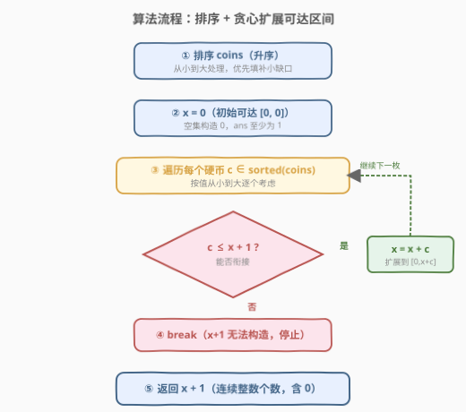

# 你能构造出连续值的最大数目

- **题目名称**：你能构造出连续值的最大数目
- **链接**：[1798. 你能构造出连续值的最大数目](https://leetcode.cn/problems/maximum-number-of-consecutive-values-you-can-make/)
- **难度**：中等
- **标签**：贪心、排序、数组

## 1. 题目概述

给定长度为 $n$ 的整数数组 `coins`，代表你拥有的 $n$ 个硬币，第 $i$ 个硬币的值为 `coins[i]`。从中选出若干硬币，若其和为 $x$，则称你可以**构造**出 $x$。请求出从 $0$ 开始（**包括** $0$），最多能构造出多少个**连续**整数。

> 💡 **关键直觉**：空集构造 $0$，所以答案至少为 $1$。问题等价于：维护一个"已可达区间" $[0, x]$，依次考虑每个硬币，看它能否把区间无缝延长。

**示例 1**：

```text
输入：coins = [1,3]
输出：2
解释：
  0 = []      （空集）
  1 = [1]
  3 无法与 0、1 衔接（3 > 0+1=1，中间断在 2）
```

**示例 2**：

```text
输入：coins = [1,1,1,4]
输出：8
解释：可构造 0,1,2,3,4,5,6,7 共 8 个连续整数
  0=[]  1=[1]  2=[1,1]  3=[1,1,1]
  4=[4]  5=[4,1]  6=[4,1,1]  7=[4,1,1,1]
```

**示例 3**：

```text
输入：coins = [1,4,10,3,1]
输出：20
```

**约束条件**：

- $\text{coins.length} = n$
- $1 \le n \le 4 \times 10^4$
- $1 \le \text{coins}[i] \le 4 \times 10^4$

---

## 2. 解题思路

### 2.1 暴力思路：子集和 DP

最直觉的暴力是子集和问题：用布尔 DP 统计所有可达的和值，再从 $0$ 起数连续段长度。

- `dp[s] = True` 表示和 $s$ 可达。
- 对每个硬币 $c$，倒序更新：`dp[s] |= dp[s - c]`。
- 和值上界为 $\sum \text{coins}[i]$，最坏 $4 \times 10^4 \times 4 \times 10^4 = 1.6 \times 10^9$。

> ⚠️ **致命瓶颈**：和值上界高达 $1.6 \times 10^9$，DP 数组空间与时间都爆炸。子集和 DP 在此完全不可行，必须利用"**连续性**"这一结构寻找贪心解法。

### 2.2 核心观察：排序 + 贪心扩展可达区间

![核心观察：可达区间 [0, x] 的扩展条件 c ≤ x+1](../images/consecutive_values_concept.svg)

突破口在于维护一个**可达区间**而非逐个和值枚举。定义不变式：

> **不变式**：用已处理硬币的某个子集，能构造出 $[0, x]$ 中的**每一个**整数。

初始时空集构造 $0$，即 $x = 0$。现在考察一枚新硬币 $c$ 能否扩展区间：

- **可达区间内的每个值 $v \in [0, x]$**，都能由某子集构造。
- 加入硬币 $c$ 后，原来能构造 $v$ 的子集再添上 $c$，就能构造 $v + c$。因此新硬币把可达值扩展到 $[c, x + c]$。
- 两段 $[0, x]$ 与 $[c, x+c]$ 能否**无缝合并**为 $[0, x+c]$？只需 $c \le x + 1$：此时 $c$ 恰好落在 $x + 1$ 或更左，两段重叠或相邻，合并后覆盖 $[0, x + c]$，更新 $x \mathrel{{+}{=}} c$。
- 若 $c > x + 1$：$x + 1$ 这个值无法被任何硬币组合填补（已处理的硬币凑不出 $x+1$，当前硬币 $c$ 太大跳过了它，后续更大的硬币更不可能），出现**断点**，立即停止。

**为什么要排序？** 从小到大处理保证每一枚硬币都优先尝试填补最小的缺口 $x+1$。若跳过小硬币先处理大硬币，可能误判断点；排序后贪心是**最优的**——每一步都在最大化区间的连续覆盖。

> 💡 **一句话**：`c ≤ x + 1` 则 `x += c`（扩展区间），否则 `break`（断点）。最终答案 $= x + 1$（从 $0$ 到 $x$ 共 $x + 1$ 个整数）。

### 2.3 算法流程图



### 2.4 示例演算

![示例演算：coins = [1,1,1,4]，排序后逐枚扩展](../images/consecutive_values_example.svg)

以示例 2 `coins = [1,1,1,4]` 为例（已排序）：

| 步骤 | 硬币 $c$ | 判定 $c \le x+1$ | 更新 $x$ | 可达区间 | 说明 |
|------|----------|-------------------|----------|----------|------|
| 初始 | — | — | $x = 0$ | $[0, 0]$ | 空集构造 0 |
| ① | 1 | $1 \le 1$ ✓ | $x = 1$ | $[0, 1]$ | $\{1\}$ 补上 1 |
| ② | 1 | $1 \le 2$ ✓ | $x = 2$ | $[0, 2]$ | 再加一个 1 补上 2 |
| ③ | 1 | $1 \le 3$ ✓ | $x = 3$ | $[0, 3]$ | 三个 1 覆盖 0~3 |
| ④ | 4 | $4 \le 4$ ✓ | $x = 7$ | $[0, 7]$ | 4 恰好接上 4，扩展到 7 |

遍历结束，答案 $= x + 1 = 7 + 1 = \mathbf{8}$。

> 💡 **第 ④ 步关键**：4 个硬币值 $1$ 覆盖了 $[0,3]$，$x+1=4$ 恰好等于硬币 $4$，无缝衔接后 $[0,3] \cup [4,7] = [0,7]$。若硬币是 $5$ 而非 $4$，则 $5 > 3+1=4$，$4$ 无法构造，断点出现，答案为 $4$。

---

## 3. 参考代码

### Python

```python
class Solution:
    def getMaximumConsecutive(self, coins: list[int]) -> int:
        coins.sort()
        x = 0  # 可达区间 [0, x]
        for c in coins:
            if c <= x + 1:
                x += c
            else:
                break
        return x + 1  # 从 0 到 x 共 x+1 个
```

### C++

```cpp
class Solution {
public:
    int getMaximumConsecutive(vector<int>& coins) {
        sort(coins.begin(), coins.end());
        long long x = 0;  // 可达区间 [0, x]，用 long long 防溢出
        for (int c : coins) {
            if (c <= x + 1) {
                x += c;
            } else {
                break;
            }
        }
        return (int)(x + 1);
    }
};
```

> 💡 **实现细节**：① `x` 用 `long long`——最坏情况 $\sum \text{coins}[i]$ 可达 $1.6 \times 10^9$，接近 `int` 上界，累加过程中 `x + 1` 可能溢出。② 排序是 $O(n \log n)$，单次遍历 $O(n)$，总体高效。③ `break` 可省略（后续更大的硬币必然也 $> x+1$，不会更新），但写出 `break` 更清晰。

---

## 4. 复杂度分析

| 维度 | 复杂度 | 说明 |
|------|--------|------|
| **时间** | $O(n \log n)$ | 排序主导；遍历 $O(n)$ |
| **空间** | $O(\log n)$ | 排序的栈空间（原地排序） |

> ⚠️ **为什么不需要 DP？** 暴力子集和 DP 的时间和空间都正比于 $\sum \text{coins}[i]$，最坏 $1.6 \times 10^9$，完全不可行。贪心方案利用"连续区间"这一结构，把指数级的子集枚举压缩为线性扫描，关键在于**不需要记录每个和值是否可达，只需维护区间右端点 $x$**。

---

## 5. 扩展：为什么贪心是最优的？（交换论证）

直觉上可能有疑问：跳过某些硬币、留到后面用，会不会得到更大的连续区间？**不会**。可以用交换论证说明：

- 设最优解中某一步跳过了硬币 $c_j$（未使用），而后续用了更大的硬币 $c_k > c_j$。
- 在跳过 $c_j$ 时，区间右端点为 $x$，有 $c_j \le x + 1$（否则最优解也会断点）。
- 若改为先用 $c_j$：$x' = x + c_j \ge x + 1$，区间只增不减。后续 $c_k \le x' + 1$ 仍可能成立（因为 $x' \ge x$），即使 $c_k$ 不再满足也至多和原解持平。
- 因此"不跳过任何可用硬币"不会使结果变差，贪心得到的就是最优解。

更本质的理解：**每一枚满足 $c \le x+1$ 的硬币都是"免费的区间扩展"**——用它只会让区间更长、后续硬币更容易衔接，没有任何理由跳过。

---

## 6. 面试要点

1. **为什么条件是 `c ≤ x + 1` 而非 `c ≤ x`？**

   > 区间 $[0, x]$ 已覆盖 $0$ 到 $x$。要扩展到 $x+1$，需要某个硬币 $c$ 使得 $c$ 本身可达且 $c \le x + 1$（这样 $x + 1 - c \in [0, x]$ 可由已有子集构造，加上 $c$ 即得 $x+1$）。等价于新段 $[c, x+c]$ 与旧段 $[0, x]$ 重叠或相邻。若 $c = x + 1$，两段恰好相邻（$x$ 和 $x+1$ 相接），合并为 $[0, 2x+1]$。

2. **为什么排序后贪心一定最优？能否不排序？**

   > 排序保证从小到大处理，每一步优先填补最小缺口 $x+1$。若不排序，可能先遇到大硬币 $c > x+1$ 而误判断点，但后续的小硬币本可以填补。排序后，任何被跳过的硬币必然真的无法衔接（因为更小的都处理过了），断点是真实的。交换论证（见第 5 节）证明贪心最优。

3. **`x` 会溢出吗？数据范围如何影响实现？**

   > $n \le 4 \times 10^4$，$\text{coins}[i] \le 4 \times 10^4$，最坏 $\sum = 1.6 \times 10^9$。`x + 1` 最大约 $1.6 \times 10^9$，虽小于 `INT_MAX`（$\approx 2.1 \times 10^9$），但累加过程中 `x + c` 可能临时接近上界，C++ 中用 `long long` 更安全。Python 无溢出问题。

4. **这题和子集和 DP 的关系？为什么 DP 不行？**

   > 本题本质是"可达和值的连续段长度"。子集和 DP 能求出所有可达和值，但和值上界 $\sum \text{coins}[i]$ 高达 $1.6 \times 10^9$，DP 数组空间和时间都爆炸。贪心方案的关键洞察是：**不需要知道每个和值是否可达，只需维护连续区间的右端点**，把 $O(\sum)$ 压缩到 $O(n)$。

5. **如果题目改成"求无法构造的最小正整数"怎么做？**

   > 就是找第一个断点 $x + 1$。用同样的贪心：遍历完后若未断点，答案是 $x + 1$（$\sum + 1$）；若中途断点，答案就是断点处的 $x + 1$。这正是 [330. 按要求补齐数组] 的核心子问题。

> 💡 **一句话总结**：排序后贪心维护可达区间右端点 $x$，`c ≤ x+1` 则 `x += c` 否则 `break`，答案 $x+1$；本质是用"连续区间"结构把子集和的指数复杂度压缩为线性。

---

## 7. 同类练习题

- [330. 按要求补齐数组](https://leetcode.cn/problems/patching-array/)：本题的**对偶问题**——给定 `nums` 和 `n`，求最少补几个数使 $[0, n]$ 全部可达，核心仍是 `c ≤ x+1` 的贪心不变式
- [2952. 需要添加的硬币的最小数量](https://leetcode.cn/problems/minimum-number-of-coins-to-be-added/)：330 的硬币版变体，同样的可达区间贪心，对照本题"查询最大连续值"与"补齐到指定值"
- [416. 分割等和子集](https://leetcode.cn/problems/partition-equal-subset-sum/)（[题解](../0401-0500/416_分割等和子集.md)）：0-1 背包判定子集和可达性，对照本题利用连续结构规避 DP 的思路
- [322. 零钱兑换](https://leetcode.cn/problems/coin-change/)（[题解](../0301-0400/322_零钱兑换.md)）：完全背包求最少硬币数，同样是"硬币构造目标值"族题，对比贪心与 DP 的适用边界
- [279. 完全平方数](https://leetcode.cn/problems/perfect-squares/)（[题解](../0201-0300/279_完全平方数.md)）：用平方数凑目标值的最少个数，硬币族题的平方数变体，对照本题的"连续覆盖"语义
