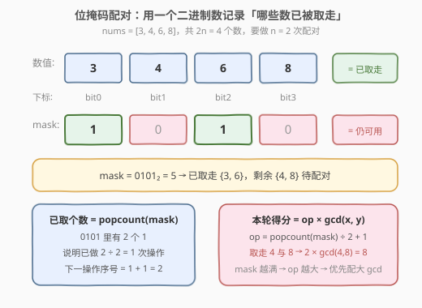
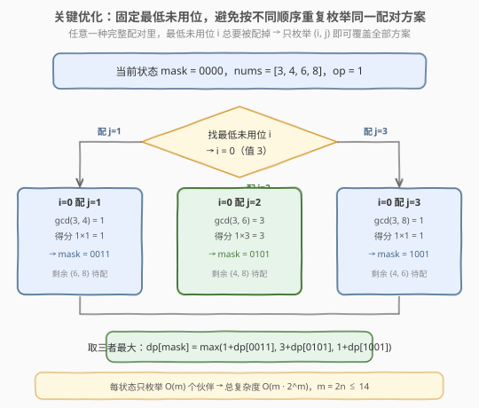

# LeetCode N 次操作后的最大分数和 题解

## 1. 题目概述

- **标题 / 题号**：N 次操作后的最大分数和（#1799，hard）
- **链接**：https://leetcode.cn/problems/maximize-score-after-n-operations/
- **难度**：困难
- **标签**：位运算、动态规划、状态压缩、贪心

**题意**：给定大小为 `2 * n` 的正整数数组 `nums`，需要执行恰好 `n` 次操作。第 `i` 次操作（`i` 从 **1** 开始）：

- 选择两个元素 `x` 和 `y`；
- 获得分数 $i \times \gcd(x, y)$；
- 将 `x` 和 `y` 从 `nums` 中删除。

返回 `n` 次操作后能获得的**分数和最大值**。

**示例 1**：

```text
输入：nums = [1,2]
输出：1
解释：(1 * gcd(1, 2)) = 1
```

**示例 2**：

```text
输入：nums = [3,4,6,8]
输出：11
解释：(1 * gcd(3, 6)) + (2 * gcd(4, 8)) = 3 + 8 = 11
```

**示例 3**：

```text
输入：nums = [1,2,3,4,5,6]
输出：14
解释：(1 * gcd(1, 5)) + (2 * gcd(2, 4)) + (3 * gcd(3, 6)) = 1 + 4 + 9 = 14
```

**约束**：

- `1 <= n <= 7`
- `nums.length == 2 * n`
- `1 <= nums[i] <= 10^6`

> ⚠️ **关键信号**：`n ≤ 7` ⇒ 数组长度 `m = 2n ≤ 14`，而 $2^{14} = 16384$，正好落在**状压 DP** 的甜区。题目本质是「把 `m` 个元素两两配对、配对顺序决定权重 `i`、求最大加权 gcd 和」——经典的**子集配对最值型状压 DP**。

## 2. 解题思路

### 2.1 暴力思路

枚举所有配对方案：第 1 次从 `m` 个数里选 2 个，第 2 次从剩 `m-2` 个里选 2 个……配对方案数为

$$(m-1)!! = (m-1)(m-3)\cdots 3 \cdot 1$$

`m = 14` 时 $(13)!! = 135135$，看似不大，但若用朴素 DFS 不加记忆化，会因「同一组剩余元素被不同删除顺序重复到达」而反复计算。需要把「剩余可用集合」作为状态做记忆化。

### 2.2 核心观察：用位掩码记录「已取走的元素」

设 `m = len(nums) = 2n`。用一个 `m` 位的二进制整数 `mask` 刻画状态：

- `mask` 的第 `k` 位为 `1` ⇒ `nums[k]` **已被取走**；
- `mask` 的第 `k` 位为 `0` ⇒ `nums[k]` **仍可用**。

关键在于：**操作序号 `i` 由已取走元素个数唯一确定**，无需额外维度。已取走 $c$ 个 ⇒ 已做 $c / 2$ 次操作 ⇒ 下一次是第 $c/2 + 1$ 次操作：

$$\text{op} = \lfloor \text{popcount}(\text{mask}) / 2 \rfloor + 1$$



例如 `nums = [3,4,6,8]`，`mask = 0101₂ = 5`：已取走 `{3, 6}`（下标 0、2），`popcount = 2`，下一操作序号 `op = 2/2 + 1 = 2`，剩余 `{4, 8}` 配对得 $2 \times \gcd(4,8) = 8$。

> 💡 **为什么状态只需一维 `mask`？** 配对是「成对取走」的，已取走个数 `c = popcount(mask)` 永远是偶数；操作序号由 `c` 唯一推出。所以「已取集合」已蕴含全部信息，无需再记「当前第几次操作」。

### 2.3 关键优化：固定最低未用位

定义 `dp[mask]` = 在已取走 `mask` 所示元素的状态下，**继续配对到全部取完所能获得的最大后续分数**。

转移时，需要从剩余元素里选一对 `(i, j)`。朴素做法是枚举所有 $\binom{\text{剩余}}{2}$ 对，但这样会让「同一配对方案」以不同顺序被重复扩展。**标准优化**是：

> 每次只**固定「最低位的未用元素 `i`」**，让它与其它任一未用元素 `j` 配对。

理由：在任意一种完整的配对方案里，最低未用位 `i` **迟早要被配掉**——它要么和 `j₁` 配，要么和 `j₂` 配……枚举所有可能的伙伴 `j`，就**不重不漏**地覆盖了所有方案。



状态转移：

$$\text{dp}[\text{mask}] = \max_{\substack{j \text{ 未用} \\ j > i}} \Big( \text{op} \times \gcd(\text{nums}[i], \text{nums}[j]) + \text{dp}[\text{mask} \mid (1 \ll i) \mid (1 \ll j)] \Big)$$

其中 `i` 为 `mask` 中最低的 `0` 位，`op = popcount(mask) / 2 + 1`。

- **初始**：`dp[full] = 0`（全部取完，无后续分数）；
- **答案**：`dp[0]`（一开始什么都没取）。

> 💡 **复杂度收益**：固定最低位后，每个状态只枚举 $O(m)$ 个伙伴（而非 $O(m^2)$ 对），总复杂度从 $O(m^2 \cdot 2^m)$ 降到 $O(m \cdot 2^m)$。`m = 14` 时约 $14 \times 16384 \approx 2.3 \times 10^5$，毫秒级。

### 2.4 示例演算（nums = [3, 4, 6, 8]）

`m = 4`，`full = 1111₂ = 15`。先预计算所有 gcd：

| 配对 | gcd | 配对 | gcd |
|------|-----|------|-----|
| (0,1)=(3,4) | 1 | (1,2)=(4,6) | 2 |
| (0,2)=(3,6) | 3 | (1,3)=(4,8) | 4 |
| (0,3)=(3,8) | 1 | (2,3)=(6,8) | 2 |

![示例演算：nums = [3, 4, 6, 8]](../images/1799_example_walkthrough.svg)

自顶向下递推（节点形如 `mask (dp值)`）：

```text
dp[1111] = 0                                   （全取完，基准）

dp[0011] {剩余 6,8} op=2: 配(2,3) → 2×gcd(6,8)+0 = 4        → dp=4
dp[0101] {剩余 4,8} op=2: 配(1,3) → 2×gcd(4,8)+0 = 8        → dp=8
dp[1001] {剩余 4,6} op=2: 配(1,2) → 2×gcd(4,6)+0 = 4        → dp=4

dp[0000] op=1, 最低未用位 i=0:
  配(0,1): 1×gcd(3,4) + dp[0011] = 1 + 4 = 5
  配(0,2): 1×gcd(3,6) + dp[0101] = 3 + 8 = 11   ← 最大
  配(0,3): 1×gcd(3,8) + dp[1001] = 1 + 4 = 5
  → dp[0000] = 11
```

最终答案 `dp[0000] = 11`，与示例一致。最优方案：第 1 次配 `(3,6)` 得 3，第 2 次配 `(4,8)` 得 8，合计 11。

> ⚠️ **贪心为什么不行？** 直觉会想「把大 gcd 留到后面乘大 `op`」。但示例 3 中 `gcd(1,5)=1` 被放在第 1 次（`op=1`），而 `gcd(3,6)=3` 放第 3 次（`op=3`）得 9——看似符合贪心。然而「配对之间互相争抢元素」，某个大 gcd 配对可能锁死另一组更大 gcd 的元素，局部最优不等于全局最优。状压 DP 才能穷尽所有配对组合取最值。

## 3. 参考代码

### 方法一：记忆化搜索（自顶向下，最直观）

### Python

```python
from math import gcd
from functools import lru_cache

class Solution:
    def maxScore(self, nums: List[int]) -> int:
        m = len(nums)
        full = (1 << m) - 1

        @lru_cache(None)
        def dfs(mask: int) -> int:
            if mask == full:
                return 0
            op = mask.bit_count() // 2 + 1
            i = 0
            while mask & (1 << i):        # 找最低未用位
                i += 1
            best = 0
            for j in range(i + 1, m):
                if mask & (1 << j):
                    continue
                cand = op * gcd(nums[i], nums[j]) + dfs(mask | (1 << i) | (1 << j))
                best = max(best, cand)
            return best

        return dfs(0)
```

### C++

```cpp
class Solution {
  public:
    int maxScore(vector<int>& nums) {
        int m = nums.size();
        int full = (1 << m) - 1;
        vector<int> memo(1 << m, -1);
        function<int(int)> dfs = [&](int mask) -> int {
            if (mask == full) return 0;
            if (memo[mask] != -1) return memo[mask];
            int op = __builtin_popcount(mask) / 2 + 1;
            int i = 0;
            while (mask & (1 << i)) ++i;          // 找最低未用位
            int best = 0;
            for (int j = i + 1; j < m; ++j) {
                if (mask & (1 << j)) continue;
                int cand = op * gcd(nums[i], nums[j]) + dfs(mask | (1 << i) | (1 << j));
                best = max(best, cand);
            }
            return memo[mask] = best;
        };
        return dfs(0);
    }
};
```

### 方法二：递推（自底向上，常数更小）

注意到 `mask | (1<<i) | (1<<j)` 总是 **大于** `mask`（只把 `0` 位置成 `1`），所以**从大到小**枚举 `mask` 即可保证依赖项先算完。

### C++

```cpp
class Solution {
  public:
    int maxScore(vector<int>& nums) {
        int m = nums.size();
        int full = (1 << m) - 1;
        vector<int> dp(1 << m, 0);                // dp[full] = 0 已隐含
        for (int mask = full - 1; mask >= 0; --mask) {
            int op = __builtin_popcount(mask) / 2 + 1;
            int i = 0;
            while (mask & (1 << i)) ++i;          // 最低未用位
            for (int j = i + 1; j < m; ++j) {
                if (mask & (1 << j)) continue;
                int cand = op * gcd(nums[i], nums[j]) + dp[mask | (1 << i) | (1 << j)];
                dp[mask] = max(dp[mask], cand);
            }
        }
        return dp[0];
    }
};
```

### Python

```python
from math import gcd

class Solution:
    def maxScore(self, nums: List[int]) -> int:
        m = len(nums)
        full = (1 << m) - 1
        dp = [0] * (1 << m)
        for mask in range(full - 1, -1, -1):
            op = mask.bit_count() // 2 + 1
            i = 0
            while mask & (1 << i):
                i += 1
            for j in range(i + 1, m):
                if mask & (1 << j):
                    continue
                dp[mask] = max(dp[mask],
                               op * gcd(nums[i], nums[j]) + dp[mask | (1 << i) | (1 << j)])
        return dp[0]
```

> 💡 **进一步常数优化**：`nums` 固定，可把所有 $\binom{m}{2}$ 对 gcd 预计算成二维表 `g[i][j]`，转移时直接查表，省掉每次 `gcd` 调用。`m ≤ 14` 时只有 91 对，预处理几乎免费。

## 4. 复杂度分析

| 维度 | 复杂度 | 说明 |
|------|--------|------|
| 时间复杂度 | $O(m \cdot 2^m)$ | 共 $2^m$ 个状态；每状态固定最低未用位后枚举 $O(m)$ 个伙伴 |
| 空间复杂度 | $O(2^m)$ | `dp` / `memo` 数组大小为 $2^m$ |

其中 $m = 2n \leq 14$，$m \cdot 2^m \leq 14 \times 16384 \approx 2.3 \times 10^5$，毫秒级完成。若预计算 gcd 表，时间常数再降一档。

## 5. 扩展：不固定最低位会怎样？

若朴素地枚举每一对 `(i, j)`（不固定最低位），每个状态需 $O(m^2)$ 枚举所有对，总复杂度 $O(m^2 \cdot 2^m)$。对于**最值型**问题答案仍正确（取 max 不受重复扩展影响），但常数更大；对于**计数型**问题则会**重复计数**（同一配对方案按不同顺序被多次统计），必须固定最低位去重。

> 💡 **最值 vs 计数的区别**：`max` 运算对重复项幂等（`max(a, a) = a`），所以最值型即使重复扩展也不影响答案；`+` 运算不幂等，计数型必须去重。固定最低位是同时适用于两者的通用写法，**面试中无脑用固定最低位最稳**。

### 不固定最低位的最值版（仅作对照）

```cpp
for (int mask = full - 1; mask >= 0; --mask) {
    int op = __builtin_popcount(mask) / 2 + 1;
    for (int i = 0; i < m; ++i) {
        if (mask & (1 << i)) continue;
        for (int j = i + 1; j < m; ++j) {
            if (mask & (1 << j)) continue;
            dp[mask] = max(dp[mask],
                op * gcd(nums[i], nums[j]) + dp[mask | (1 << i) | (1 << j)]);
        }
    }
}
```

## 6. 面试要点

1. **为什么 `n ≤ 7` 提示用状压 DP？**
   - `m = 2n ≤ 14`，$2^{14} = 16384$，状态空间可承受。一般 `m ≤ 20` 的「选/不选」配对/划分最值问题都可考虑状压 DP。

2. **状态为什么只需一维 `mask`，不用再记「第几次操作」？**
   - 操作序号 `op = popcount(mask) / 2 + 1` 由已取走个数唯一确定。已取走个数 = `popcount(mask)`，所以 `mask` 已蕴含操作序号，无需额外维度。

3. **为什么要「固定最低未用位」？**
   - 保证每个配对方案只被枚举一次（去重），同时把每状态的转移数从 $O(m^2)$ 降到 $O(m)$。对最值型是常数优化，对计数型是正确性必需。

4. **递推时为什么从 `full` 往 `0` 枚举？**
   - `dp[mask]` 依赖 `dp[mask | bits]`（`bits` 比 `mask` 大），所以依赖项数值更大。从大到小枚举 `mask` 即可保证依赖先算完，无需拓扑排序。

5. **能贪心吗？**
   - 不能。配对之间争抢元素，「大 gcd 留大 op」的局部贪心会锁死其它更大 gcd 的组合。必须状压 DP 穷尽所有配对方案。

## 同类练习题

| # | 题目 | 与本题的关联 |
|---|------|-------------|
| 526 | [优美的排列](https://leetcode.cn/problems/beautiful-arrangement/)（[站内题解](../0501-0600/526_优美的排列.md)） | `mask` 表示已放数字集合，`popcount` 定位置——与本题「`mask` 定已取集合、`popcount` 定操作序号」同构，是状压 DP 入门母题 |
| 698 | [划分为 K 个相等的子集](https://leetcode.cn/problems/partition-to-k-equal-sum-subsets/)（[站内题解](../0601-0700/698_划分为K个相等的子集.md)） | `mask` 表示已用元素，把数分成 K 组——「子集划分」型状压，承接本题的「成对分组」思路 |
| 1655 | [分配重复整数](https://leetcode.cn/problems/distribute-repeating-integers/) | `mask` 表示已分配的需求子集，与本题「`mask` 表示剩余可用」同构，难度上一档 |
| 691 | [贴纸拼词](https://leetcode.cn/problems/stickers-to-spell-word/) | `mask` 表示已拼出的目标字符子集，求最少贴纸数（最值型状压 DP，承接本题的最值口径） |
| 1125 | [最小的必要团队](https://leetcode.cn/problems/smallest-sufficient-team/) | `mask` 表示已覆盖的技能集合，求最小人数——「集合覆盖」型状压，思路与本题一致 |
