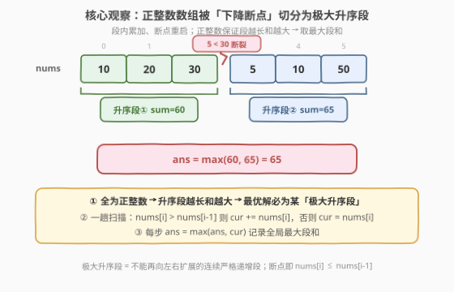
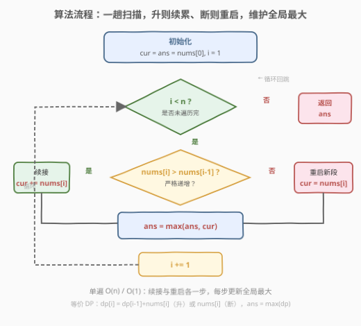

# LeetCode 最大升序子数组和 题解

## 1. 题目概述

- **标题 / 题号**：最大升序子数组和（#1800，easy）
- **链接**：https://leetcode.cn/problems/maximum-ascending-subarray-sum/
- **难度**：简单
- **标签**：数组、一次遍历、动态规划

**题意**：给定一个**正整数**组成的数组 `nums`，返回 `nums` 中一个**严格递增子数组**的最大可能元素和。

子数组是数组中的一个**连续**数字序列。子数组 `[nums[l], nums[l+1], ..., nums[r]]` 是升序的，当且仅当对所有 `l <= i < r` 都有 `nums[i] < nums[i+1]`。注意，长度为 1 的子数组也视为升序。

**示例 1**：

```text
输入：nums = [10,20,30,5,10,50]
输出：65
解释：[5,10,50] 是元素和最大的升序子数组，最大元素和为 65。
```

**示例 2**：

```text
输入：nums = [10,20,30,40,50]
输出：150
解释：[10,20,30,40,50] 是元素和最大的升序子数组，最大元素和为 150。
```

**示例 3**：

```text
输入：nums = [12,17,15,13,10,11,12]
输出：33
解释：[10,11,12] 是元素和最大的升序子数组，最大元素和为 33。
```

**约束**：

- $1 \le \text{nums.length} \le 100$
- $1 \le \text{nums}[i] \le 100$

> 💡 **关键约束**：两个「正」字是题眼——元素全为**正整数**，且子数组必须**连续**严格递增。正整数意味着「子数组越长，和越大」（每多加一个元素只会让和增大）；连续递增意味着当前元素能否续接，**只取决于它与前一个元素的大小关系**。二者合流，把问题退化为一趟扫描的「段内累加、断点重启」。

## 2. 解题思路

### 2.1 暴力思路：枚举所有子数组

最直觉的做法：枚举所有连续子数组 `[l, r]`，逐个检查其内部是否严格递增（对每个 `i ∈ [l, r)` 验证 `nums[i] < nums[i+1]`），满足条件则计算段和并更新最大值。

```text
ans = 0
for l in 0 .. n-1:
    for r in l .. n-1:
        if [l..r] 严格递增:        # 内层再扫一遍检查
            ans = max(ans, sum(nums[l..r]))
return ans
```

时间 $O(n^3)$（$O(n^2)$ 个子数组 × 每个检查+求和 $O(n)$），空间 $O(1)$。$n \le 100$ 时约 $10^6$ 次操作能过，但**对同一段递增区间反复求和、反复检查**是明显的浪费。

> ⚠️ **症结**：暴力把「递增关系」当作每个子数组的局部属性反复重算。但递增关系本质是**相邻两两的局部信息**——`nums[i]` 能否续接只取决于 `nums[i-1]`。把这些局部信息沿下标串起来，一趟扫描即可得到所有极大递增段。

### 2.2 核心观察：极大升序段切分，段内累加、断点重启



关键洞察有两层：

1. **正整数 → 段越长和越大**：由于所有 `nums[i] > 0`，把一个升序子数组向两端扩展（只要仍保持升序）只会累加正数、增大和。因此**最大和的升序子数组一定是某个「极大升序段」**——即不能再向左右扩展的连续严格递增段。我们无需考虑极大段的子前缀，因为补全到整段只会更大。

2. **极大升序段由「下降断点」唯一切分**：从左到右扫描，遇到 `nums[i] > nums[i-1]` 则当前段可续接，遇到 `nums[i] <= nums[i-1]` 则递增断裂、当前元素另起一段。这些极大段**不重叠且覆盖整个数组**，一趟扫描即可全部识别并求和。

于是算法归约为：维护当前段和 `cur` 与全局最大 `ans`，升则续累、断则重启：

$$
\text{cur}_i = \begin{cases} \text{cur}_{i-1} + \text{nums}[i], & \text{nums}[i] > \text{nums}[i-1] \\ \text{nums}[i], & \text{nums}[i] \le \text{nums}[i-1] \end{cases}, \qquad \text{ans} = \max_i \text{cur}_i
$$

> 💡 **为什么正整数约束不可或缺？** 若允许负数，最长升序段未必和最大——某段虽长但含大负数，可能不如一个短而全正的段。此时需对每个位置独立决策「续接还是另起」（类似 [53. 最大子数组和](../0001-0100/53_最大子数组和.md) 的 Kadane：仅当 `cur > 0` 才续接）。本题全正，续接永远有利，直接贪心扩展到极大段即可。

> 💡 **与 674 的镜像关系**：[674. 最长连续递增序列](../0601-0700/674_最长连续递增序列.md) 在同一套「极大升序段切分」框架上，把目标从「最大段**和**」换成「最大段**长度**」——`cur` 累加的是计数 `+1` 而非 `nums[i]`，断点重置为 `1` 而非 `nums[i]`。骨架完全同构，仅累加单位不同。

### 2.3 算法流程图



1. **初始化**：`cur = ans = nums[0]`（单个元素自成一段），`i = 1`。
2. **循环** `i` 从 $1$ 到 $n-1$：
   - 若 `nums[i] > nums[i-1]`：递增成立，`cur += nums[i]`（续接当前段）。
   - 否则：递增断裂，`cur = nums[i]`（以当前元素另起一段）。
   - 每步更新 `ans = max(ans, cur)`。
3. **终止**：返回 `ans`。

一趟遍历，每步 $O(1)$，总 $O(n)$。

### 2.4 示例演算

以示例 1 `nums = [10, 20, 30, 5, 10, 50]` 为例：

![示例演算：nums=[10,20,30,5,10,50] 的滚动过程](../images/1800_example_walkthrough.svg)

| 步骤 $i$ | `nums[i]` | `nums[i] > nums[i-1]`? | 动作 | `cur` | `ans` | 说明 |
|----------|-----------|------------------------|------|-------|-------|------|
| $0$ | $10$ | — | 初始 | $10$ | $10$ | 单元素成段 |
| $1$ | $20$ | $20 > 10$ ✓ | `cur += 20` | $30$ | $30$ | 段①续接 |
| $2$ | $30$ | $30 > 20$ ✓ | `cur += 30` | $60$ | $60$ | 段①峰值 |
| $3$ | $5$ | $5 > 30$ ✗ | `cur = 5` | $5$ | $60$ | 断点重启，段②开始 |
| $4$ | $10$ | $10 > 5$ ✓ | `cur += 10` | $15$ | $60$ | 段②续接 |
| $5$ | $50$ | $50 > 10$ ✓ | `cur += 50` | $65$ | $65$ | 段②峰值，刷新最大 |

最终 `ans = 65` ✓。段① `[10,20,30]` 和为 60，段② `[5,10,50]` 和为 65，取较大者。

对照示例 3 `nums = [12,17,15,13,10,11,12]`：切分为 `[12,17]`(29)、`[15]`(15)、`[13]`(13)、`[10,11,12]`(33)，最大段和 $33$ ✓。

## 3. 参考代码

### C++

```cpp
class Solution {
public:
    int maxAscendingSum(vector<int>& nums) {
        int cur = nums[0], ans = nums[0];
        for (int i = 1; i < (int)nums.size(); ++i) {
            if (nums[i] > nums[i - 1]) cur += nums[i];
            else                        cur = nums[i];
            ans = max(ans, cur);
        }
        return ans;
    }
};
```

### Python

```python
class Solution:
    def maxAscendingSum(self, nums: List[int]) -> int:
        cur = ans = nums[0]
        for i in range(1, len(nums)):
            if nums[i] > nums[i - 1]:
                cur += nums[i]
            else:
                cur = nums[i]
            ans = max(ans, cur)
        return ans
```

> 💡 **写法对照**：两版逻辑完全一致——`cur` 为当前升序段和，`ans` 为全局最大段和。递增时 `cur += nums[i]` 续接，断裂时 `cur = nums[i]` 重启，每步 `ans = max(ans, cur)`。无需显式记录段边界，状态在 `cur` 一个变量里滚动。
>
> ⚠️ **边界**：`n = 1` 时循环不执行，直接返回 `nums[0]`（初始化时 `cur = ans = nums[0]` 已覆盖）。这是「长度为 1 的子数组也算升序」的直接体现。

## 4. 复杂度分析

| 维度 | 复杂度 | 说明 |
|------|--------|------|
| 时间复杂度 | $O(n)$ | 单趟遍历，每步一次比较 + 一次加法/赋值 + 一次 `max`，均 $O(1)$ |
| 空间复杂度 | $O(1)$ | 仅两个整型变量 `cur`/`ans`，与输入规模无关 |

> 💡 对比暴力 $O(n^3)$：本题 $n \le 100$ 时暴力也能过，但单趟 $O(n)$ 的**可扩展性**更强——$n$ 涨到 $10^7$ 仍线性可解，而暴力需 $O(10^{21})$ 必然超时。这是「利用相邻局部性 + 正整数贪心」把立方降到线性的典型胜利。

## 5. 扩展：DP 视角与 Kadane 类比

### 5.1 一维 DP 形式化

设 $\text{dp}[i]$ 为**以 `nums[i]` 结尾的升序子数组的最大和**。由于连续递增只看相邻一格，转移为：

$$
\text{dp}[i] = \begin{cases} \text{dp}[i-1] + \text{nums}[i], & \text{nums}[i] > \text{nums}[i-1] \\ \text{nums}[i], & \text{otherwise} \end{cases}, \qquad \text{ans} = \max_{0 \le i < n} \text{dp}[i]
$$

$\text{dp}[i]$ 仅依赖 $\text{dp}[i-1]$，故可滚动到单变量 `cur`，空间 $O(n) \to O(1)$。这正是第 3 节代码的本质。

### 5.2 与 53 最大子数组和（Kadane）的对照

二者同属「**滚动和 + 重启条件**」范式，区别仅在续接/重启的判定：

| 维度 | 53 最大子数组和（Kadane） | 1800 最大升序子数组和 |
|------|--------------------------|----------------------|
| 续接条件 | `cur > 0`（前缀和为正则有益） | `nums[i] > nums[i-1]`（严格递增） |
| 重启动作 | `cur = nums[i]`（前缀有害则弃前缀） | `cur = nums[i]`（递增断裂则另起段） |
| 全局更新 | `ans = max(ans, cur)` | `ans = max(ans, cur)` |
| 元素正负 | 允许负数 → 续接未必有益，需择优 | 全正 → 续接永远有益，直接贪心 |

> 💡 **统一视角**：两者都是「以 $i$ 结尾的最优子结构」一维 DP，状态转移形如 $\text{dp}[i] = f(\text{dp}[i-1]) + \text{nums}[i]$ 或 $\text{nums}[i]$。53 的 $f$ 是「取正弃负」的条件截断，1800 的 $f$ 是「递增则留、断裂则弃」的结构性截断。掌握这一范式，[918. 环形子数组的最大和](../0901-1000/918_最大环形子数组和.md) 等变体可顺势拆解。

## 6. 面试要点

**Q1：为什么最优解一定是「极大升序段」而不是某个升序段的子前缀？**
> 因为所有元素为正整数。把任一升序子数组向右扩展到递增断裂为止，每步都累加正数，和只增不减。因此最大和的升序子数组必然是某个不能再扩展的极大升序段，无需考虑其内部子前缀。若题目允许负数，这一结论失效，需改用类似 Kadane 的择优续接。

**Q2：如果数组允许负数，算法要怎么改？**
> 「极大段即最优」不再成立——某段虽长但含大负数，和可能小于一个短而全正的段。此时需对每个位置独立决策：若 `nums[i] > nums[i-1]` 则**可以**续接，但是否**值得**续接取决于 `cur` 是否为正（续接一个负的 `cur` 反而拖累）。即 `cur = nums[i] > nums[i-1] ? max(cur, 0) + nums[i] : nums[i]`。这是 53 Kadane 与 1800 升序约束的合体。

**Q3：本题与 674 最长连续递增序列有何异同？**
> 同：都在「极大升序段切分」框架上，一趟扫描，遇 `nums[i] > nums[i-1]` 续接、否则重启。异：674 最大化段**长度**（`cur += 1`，重启 `cur = 1`），本题最大化段**和**（`cur += nums[i]`，重启 `cur = nums[i]`）。骨架同构，仅累加单位不同，是「同一模式换目标函数」的典型范例。

**Q4：为什么用「相邻比较」而不是二分/排序？**
> 升序子数组要求**连续**，当前元素能否续接只取决于前一个元素，无需回看更早位置。这把状态依赖从「整个前缀」（如 [300 LIS](../0201-0300/300_最长递增子序列.md) 的 $O(n^2)$）压缩到「相邻一格」，复杂度随之降到 $O(n)$。排序会破坏原始位置关系，反而丢失「连续」信息。

**Q5：`n = 1` 时代码会出错吗？**
> 不会。初始化 `cur = ans = nums[0]` 已处理单元素情形，循环从 `i = 1` 开始直接跳过，返回 `nums[0]`。这对应「长度为 1 的子数组也算升序」的题设。面试中应主动提此边界，体现严谨性。

> 💡 **一句话总结**：一趟扫描，`nums[i] > nums[i-1]` 则 `cur += nums[i]`（续接），否则 `cur = nums[i]`（重启），每步 `ans = max(ans, cur)`；正整数保证贪心扩展到极大段即最优。

## 同类练习题

| # | 题目 | 与本题的关联 |
|---|------|-------------|
| 674 | [最长连续递增序列](https://leetcode.cn/problems/longest-continuous-increasing-subsequence/)（[题解](../0601-0700/674_最长连续递增序列.md)） | 同一「极大升序段切分」框架，目标改为最大化段**长度**而非段和，`cur` 累加 `+1` 而非 `nums[i]`，骨架同构 |
| 53 | [最大子数组和](https://leetcode.cn/problems/maximum-subarray/)（[题解](../0001-0100/53_最大子数组和.md)） | Kadane 经典，「滚动和 + 重启」范式的母题，续接条件为 `cur > 0` 而非递增，允许负数需择优续接 |
| 228 | [汇总区间](https://leetcode.cn/problems/summary-ranges/)（[题解](../0201-0300/228_汇总区间.md)） | 同样识别连续递增段并按段输出，只汇总区间端点不求和，对照「段切分」的另一种输出形式 |
| 845 | [数组中的最长山脉](https://leetcode.cn/problems/longest-mountain-in-array/)（[题解](../0801-0900/845_数组中的最长山脉.md)） | 升序段 + 降序段拼接成山脉，单向升序段的进阶——需同时跟踪上升与下降两段状态 |
| 300 | [最长递增子序列](https://leetcode.cn/problems/longest-increasing-subsequence/)（[题解](../0201-0300/300_最长递增子序列.md)） | 去掉「连续」约束的 LIS，状态需回看整个前缀 $O(n^2)$/$O(n\log n)$，对照「连续」把自由度从 $n$ 归零为一格的降维效果 |
