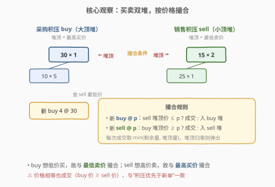
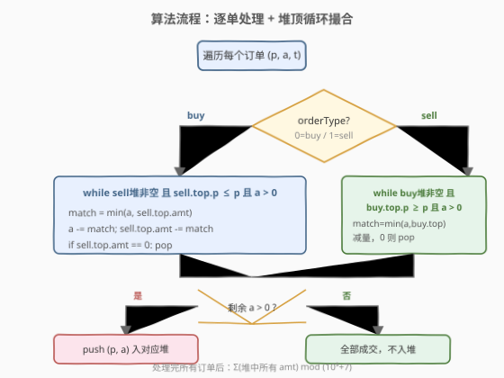
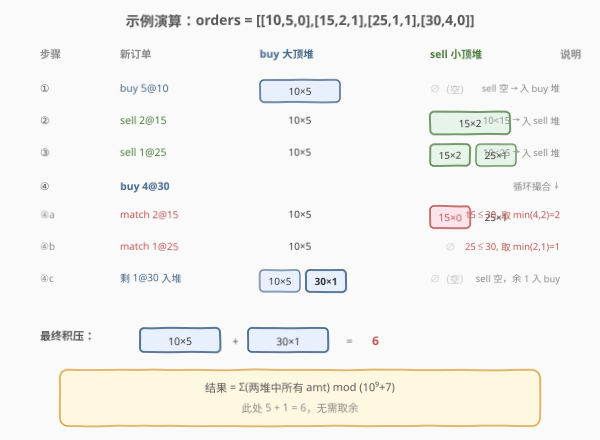

# LeetCode 积压订单中的订单总数 题解

## 1. 题目概述

- **标题 / 题号**：积压订单中的订单总数（#1801，medium）
- **链接**：https://leetcode.cn/problems/number-of-orders-in-the-backlog/
- **难度**：中等
- **标签**：堆、贪心、模拟、优先队列

**题意**：给定一个二维整数数组 `orders`，其中 `orders[i] = [pricei, amounti, orderTypei]` 表示一批共 `amounti` 笔、价格为 `pricei`、类型为 `orderTypei` 的订单：

- `orderTypei = 0` 表示**采购订单 buy**；
- `orderTypei = 1` 表示**销售订单 sell**。

`orders[i]` 中所有订单的提交时间均早于 `orders[i+1]`。初始时积压订单（backlog）为空。每提交一批订单，按如下规则撮合：

- 提交 **buy** 时：查看积压中**价格最低**的 sell。若该 sell 价格 **≤** 当前 buy 价格，则匹配成交并从积压中删除该 sell；否则把该 buy 加入积压。
- 提交 **sell** 时：查看积压中**价格最高**的 buy。若该 buy 价格 **≥** 当前 sell 价格，则匹配成交并从积压中删除该 buy；否则把该 sell 加入积压。

> ⚠️ 一批订单含 `amounti` 笔独立订单，撮合是**逐笔**进行的——剩余量可继续与堆顶撮合，直到价格不满足或本批耗尽。价格相等也成交（buy 价 ≥ sell 价）。

处理完所有订单后，返回积压中订单总数，结果对 $10^9 + 7$ 取余。

**示例 1**：

```text
输入：orders = [[10,5,0],[15,2,1],[25,1,1],[30,4,0]]
输出：6
```

**示例 2**：

```text
输入：orders = [[7,1000000000,1],[15,3,0],[5,999999995,0],[5,1,1]]
输出：999999984
```

**约束**：

- $1 \le \text{orders.length} \le 10^5$
- $\text{orders[i].length} = 3$
- $1 \le \text{price}_i, \text{amount}_i \le 10^9$
- $\text{orderType}_i \in \{0, 1\}$

> 💡 **关键直觉**：撮合的对象分别是「积压 sell 中的最低价」和「积压 buy 中的最高价」。两种极端值查询 → 用**两个堆**：sell 用小顶堆（堆顶最低价），buy 用大顶堆（堆顶最高价）。逐批 `while` 撮合堆顶即可。

## 2. 解题思路

### 2.1 暴力思路：线性扫描找最值

每来一批订单，线性扫描整个积压数组找最低价 sell 或最高价 buy，撮合一笔后重复。一批 `amounti` 笔最多撮合 `amounti` 次，每次扫描 $O(n)$，总复杂度可达 $O(\sum \text{amount}_i \cdot n)$。由于 $\text{amount}_i$ 可达 $10^9$，必超时。

> ⚠️ 这里真正的陷阱不是「找最值慢」，而是**不能逐笔模拟**——`amounti` 高达 $10^9$，必须**按批撮合**：每次用 `match = min(剩余量, 堆顶量)` 一次性消掉一批，让循环次数与堆操作次数同阶。

### 2.2 核心观察：双堆 + 批量撮合



撮合规则天然对应两种极端值查询：

- **buy 想低价买**：撮合积压 sell 的**最低价** → sell 用**小顶堆**，堆顶即候选。
- **sell 想高价卖**：撮合积压 buy 的**最高价** → buy 用**大顶堆**，堆顶即候选。

两堆各自内部还隐含一个不变式：**堆顶永远是与新单撮合的最优候选**。撮合条件：

- 新 buy @ $p$：只要 sell 堆非空且 `sell.top.price ≤ p`，就成交；
- 新 sell @ $p$：只要 buy 堆非空且 `buy.top.price ≥ p`，就成交。

**批量消减**避免逐笔模拟：

1. `match = min(剩余量 a, 堆顶量 top.amt)`
2. `a -= match`，`top.amt -= match`
3. 若 `top.amt == 0`，弹出堆顶
4. 循环直到价格不满足、堆空、或 `a == 0`

循环结束后若 `a > 0`，把 `(p, a)` 压入对应堆。

> ⚠️ **常见错误**：① 逐笔 `for` 循环 `amounti` 次，$10^9$ 必 TLE；② 价格相等时漏成交（题目明确 buy 价 ≥ sell 价即成交）；③ 忘记对 $10^9+7$ 取余（虽然中间过程不会溢出 `long long`/Python int，但最终结果要求取余）。

### 2.3 算法流程图



### 2.4 示例演算



以示例 1 `orders = [[10,5,0],[15,2,1],[25,1,1],[30,4,0]]` 为例：

| 步骤 | 新订单 | buy 大顶堆 | sell 小顶堆 | 撮合动作 |
|------|--------|-----------|------------|----------|
| ① | buy 5@10 | {10×5} | ∅ | sell 空 → 入 buy 堆 |
| ② | sell 2@15 | {10×5} | {15×2} | buy 顶 10 < 15 → 入 sell 堆 |
| ③ | sell 1@25 | {10×5} | {15×2, 25×1} | buy 顶 10 < 25 → 入 sell 堆 |
| ④a | buy 4@30 | {10×5} | {15×0, 25×1} | 15 ≤ 30，match=2，sell 15 归零弹出，a=2 |
| ④b | buy 2@30 | {10×5} | {25×0} | 25 ≤ 30，match=1，sell 25 归零弹出，a=1 |
| ④c | buy 1@30 | {10×5, 30×1} | ∅ | sell 空，剩 1 入 buy 堆 |

最终积压 = `10×5 + 30×1 = 6`。

> 💡 **第 ④ 步关键**：一批 4 笔 buy 触发了**两次堆顶弹出**——先消掉 15×2，再消掉 25×1，剩余 1 笔因 sell 空而入堆。这正体现了 `while` 循环「同批连消多个堆顶」的批量逻辑。

## 3. 参考代码

### Python

```python
import heapq

class Solution:
    def getNumberOfBacklogOrders(self, orders: list[list[int]]) -> int:
        MOD = 10 ** 9 + 7
        # buy 大顶堆：存 (-price, amt)，堆顶 price 最大
        buy_heap = []
        # sell 小顶堆：存 (price, amt)，堆顶 price 最小
        sell_heap = []

        for price, amount, otype in orders:
            if otype == 0:  # buy：与 sell 小顶堆撮合
                while amount > 0 and sell_heap and sell_heap[0][0] <= price:
                    sp, sa = sell_heap[0]
                    match = min(amount, sa)
                    amount -= match
                    sa -= match
                    if sa == 0:
                        heapq.heappop(sell_heap)
                    else:
                        sell_heap[0] = (sp, sa)
                if amount > 0:
                    heapq.heappush(buy_heap, (-price, amount))
            else:  # sell：与 buy 大顶堆撮合
                while amount > 0 and buy_heap and -buy_heap[0][0] >= price:
                    bp, ba = buy_heap[0]
                    bprice = -bp
                    match = min(amount, ba)
                    amount -= match
                    ba -= match
                    if ba == 0:
                        heapq.heappop(buy_heap)
                    else:
                        buy_heap[0] = (bp, ba)
                if amount > 0:
                    heapq.heappush(sell_heap, (price, amount))

        total = 0
        for _, amt in buy_heap:
            total = (total + amt) % MOD
        for _, amt in sell_heap:
            total = (total + amt) % MOD
        return total
```

### C++

```cpp
class Solution {
public:
    int getNumberOfBacklogOrders(vector<vector<int>>& orders) {
        const int MOD = 1e9 + 7;
        // buy 大顶堆：(price, amt)
        priority_queue<pair<int, long long>> buy_heap;
        // sell 小顶堆：(price, amt)
        priority_queue<pair<int, long long>, vector<pair<int, long long>>,
                       greater<pair<int, long long>>> sell_heap;

        for (auto& o : orders) {
            int price = o[0];
            long long amount = o[1];
            if (o[2] == 0) {  // buy
                while (amount > 0 && !sell_heap.empty() &&
                       sell_heap.top().first <= price) {
                    auto [sp, sa] = sell_heap.top();
                    long long match = min(amount, sa);
                    amount -= match;
                    sa -= match;
                    sell_heap.pop();
                    if (sa > 0) sell_heap.push({sp, sa});
                }
                if (amount > 0) buy_heap.push({price, amount});
            } else {  // sell
                while (amount > 0 && !buy_heap.empty() &&
                       buy_heap.top().first >= price) {
                    auto [bp, ba] = buy_heap.top();
                    long long match = min(amount, ba);
                    amount -= match;
                    ba -= match;
                    buy_heap.pop();
                    if (ba > 0) buy_heap.push({bp, ba});
                }
                if (amount > 0) sell_heap.push({price, amount});
            }
        }

        long long total = 0;
        while (!buy_heap.empty()) {
            total = (total + buy_heap.top().second) % MOD;
            buy_heap.pop();
        }
        while (!sell_heap.empty()) {
            total = (total + sell_heap.top().second) % MOD;
            sell_heap.pop();
        }
        return (int)total;
    }
};
```

> 💡 **实现细节**：① Python `heapq` 无大顶堆，用存负价格 `(-price, amt)` 模拟；修改堆顶量时直接重写 `heap[0]` 后 `heapify` 不必要——因为只改 `amt` 不改 `price`，相对顺序不变，直接赋值即可（Python 元组不可变，故 `sell_heap[0] = (sp, sa)` 重新赋值）。② C++ 中 `amount` 与堆中 `amt` 都用 `long long`，因为单批撮合的 `match` 与累加都可能接近 $10^9$，两数相加虽不溢出 `long long`，但用 `int` 累加总订单数会溢出。③ 撮合后 `pop` 再 `push` 残余量是 C++ 标准做法（`priority_queue` 不支持原地修改堆顶）。

## 4. 复杂度分析

| 维度 | 复杂度 | 说明 |
|------|--------|------|
| **时间** | $O(n \log n)$ | 每批订单的 `while` 循环中，每次成交必弹出或耗尽一个堆顶；总 push 次数 $\le 2n$（每批最多入堆一次），总 pop 次数 $\le$ 总 push 次数，故堆操作总数 $O(n)$，每次 $O(\log n)$ |
| **空间** | $O(n)$ | 两堆最多各存 $n$ 条目 |

> ⚠️ **关键 amortized 论证**：`while` 内部看似可能跑很多轮，但每轮要么 `pop` 一个堆顶（总 pop ≤ 总 push ≤ $2n$），要么 `amount` 归零退出。故所有 `while` 的总迭代次数被 $O(n)$ 钳制，而非 $O(\sum \text{amount}_i)$。这正是「批量撮合」相比「逐笔模拟」的本质优势。

## 5. 扩展：为何不能用排序 + 双指针？

直觉上可能想：把所有 buy 和 sell 分别排序后用双指针归并撮合。但本题有一个致命约束——**订单必须按提交时间顺序处理**，撮合是**在线（online）**的：

- 第 ② 批 sell 提交时，buy 堆里只有第 ① 批的 5@10，未来第 ④ 批的 4@30 尚未到达。
- 若先全局排序再双指针，会用 4@30 去撮合 ②③ 批的 sell，但这些 sell 在 4@30 提交时根本还未入积压——撮合顺序被打乱。

> 💡 **在线 vs 离线**：本题是典型的**在线撮合**问题——每条订单到达时只能看到当前积压，无法预知未来。堆恰好是维护「动态最值查询 + 增删」的最佳结构；排序 + 双指针只适用于**离线**（全部数据已知后一次性处理）场景。这与 [502. IPO](https://leetcode.cn/problems/ipo/) 的「按资本解锁 + 堆取最大利润」思路一脉相承。

## 6. 面试要点

1. **为什么用两个堆而不是一个？**

   > 撮合对象不同：buy 要找 sell 的**最低价**，sell 要找 buy 的**最高价**。两种极端值方向相反，需分别用小顶堆（sell）和大顶堆（buy）维护。若合并成一个结构，无法同时高效返回「sell 最小」和「buy 最大」。

2. **如何处理一批 `amounti` 笔订单？为什么不能逐笔循环？**

   > `amounti` 高达 $10^9$，逐笔循环必 TLE。批量撮合：每次 `match = min(剩余量, 堆顶量)` 一次性消掉一批，让 `while` 的迭代次数与堆操作次数同阶 $O(n)$，而非 $O(\sum \text{amount}_i)$。这是本题从 TLE 到 AC 的关键一步。

3. **撮合条件中的等号怎么处理？**

   > 题目明确：buy 价 ≥ sell 价即成交，含等号。即新 buy @ $p$ 时 sell 堆顶价 $\le p$ 成交；新 sell @ $p$ 时 buy 堆顶价 $\ge p$ 成交。漏掉等号会导致价格相同的买卖单无法撮合，积压偏多。

4. **为什么 `while` 循环是 $O(n \log n)$ 而非 $O(\sum \text{amount} \cdot \log n)$？**

   > 摊还分析：`while` 每轮要么 `pop` 一个堆顶（总 pop 次数 ≤ 总 push 次数 ≤ $2n$），要么本批 `amount` 归零退出。故所有 `while` 的总迭代次数被 $O(n)$ 钳制，每次堆操作 $O(\log n)$，总 $O(n \log n)$。`amount` 的大小只影响「数值运算」，不影响迭代次数。

5. **最终取余的时机？中间过程会溢出吗？**

   > Python 天然大整数无溢出；C++ 中 `amount` 和堆 `amt` 用 `long long`，单次累加最多约 $2 \times 10^9$，不溢出。最终累加总订单数时对 $10^9+7$ 取余即可。注意 C++ `int` 累加会溢出（总订单数可达 $10^{14}$），必须用 `long long` 累加。

> 💡 **一句话总结**：buy 大顶堆 + sell 小顶堆，按提交顺序逐批 `while` 撮合堆顶，`match = min(剩余量, 堆顶量)` 批量消减，残余入堆；总订单数 $\bmod (10^9+7)$。摊还 $O(n \log n)$。

## 同类练习题

| # | 题目 | 与本题的关联 |
|---|------|-------------|
| 502 | [IPO](https://leetcode.cn/problems/ipo/) | 排序解锁 + 大顶堆贪心取最大利润，与本题「堆维护动态最值 + 在线处理」思想一脉相承 |
| 239 | [滑动窗口最大值](https://leetcode.cn/problems/sliding-window-maximum/)（[题解](../0201-0300/239_滑动窗口最大值.md)） | 单调队列维护窗口最值 + 惰性删除，对照本题堆的动态最值维护 |
| 295 | [数据流的中位数](https://leetcode.cn/problems/find-median-from-data-stream/) | 大顶堆 + 小顶堆的经典双堆配合，对照本题双堆但方向用途不同 |
| 1753 | [移除石子的最大得分](https://leetcode.cn/problems/maximum-score-from-removing-stones/)（[题解](../1701-1800/1753_移除石子的最大得分.md)） | 三堆石子贪心撮合，与本题「按最值撮合 + 批量消减」同套路 |
| 1882 | [使用服务器处理任务](https://leetcode.cn/problems/process-tasks-using-servers/) | 双堆（空闲服务器堆 + 忙碌服务器堆）在线调度，练习「时间驱动 + 双堆」的在线撮合范式 |
