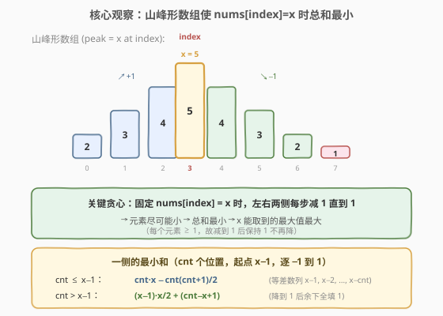
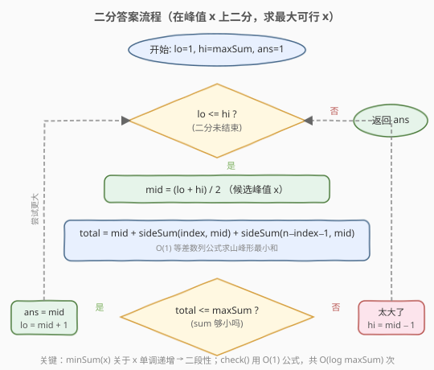
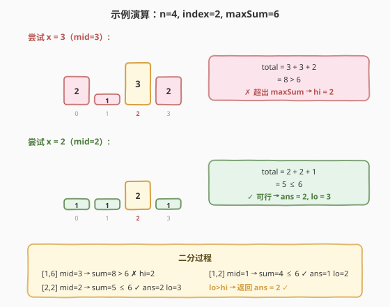

# 有界数组中指定下标处的最大值

- **题目名称**：有界数组中指定下标处的最大值
- **链接**：[1802. 有界数组中指定下标处的最大值](https://leetcode.cn/problems/maximum-value-at-a-given-index-in-a-bounded-array/)
- **难度**：中等
- **标签**：二分查找、贪心、数学

## 1. 题目概述

给你三个正整数 `n`、`index` 和 `maxSum`。你需要构造一个满足下述条件的长为 `n` 的下标从 0 开始的正整数数组 `nums`：

- `nums[i]` 是正整数；
- `abs(nums[i] - nums[i+1]) <= 1`，即相邻元素差至多为 1（不是必须递增/递减，但差值有界）；
- 所有元素之和不超过 `maxSum`；
- `nums[index]` 要**尽可能大**。

返回 `nums[index]` 的最大可能值。

**示例 1**：

```text
输入：n = 4, index = 2,  maxSum = 6
输出：2
解释：数组 [1,1,2,1] 满足条件，sum = 5 ≤ 6，nums[2] = 2。
     而 nums[2] = 3 时最小和为 8 > 6，不可能。
```

**示例 2**：

```text
输入：n = 4, index = 0,  maxSum = 4
输出：1
解释：数组 [1,1,1,1]，sum = 4 ≤ 4，nums[0] = 1。
     nums[0] = 2 时最小和为 5 > 4，不可能。
```

**约束条件**：

- $1 \le n \le \maxSum \le 10^9$
- $0 \le \text{index} < n$

> 💡 **核心矛盾**：要在总和上限内让某个位置取到最大值。直觉上，为了让 `nums[index]` 尽量大，其余位置应**尽可能小**——而「相邻差至多 1」的约束意味着从峰值向两边只能逐 1 递减，最小降到 1 为止。这天然形成一个**山峰形数组**。于是问题转化为：在山峰形状下，峰值 $x$ 最大能取多少？

---

## 2. 解题思路

### 2.1 暴力思路：枚举峰值逐个验证

从 $x = 1$ 开始逐个尝试，对每个 $x$ 检查「`nums[index] = x` 时数组最小和是否 $\le \maxSum$」。验证时用贪心构造山峰形数组（见 2.2），若最小和 $\le \maxSum$ 则 $x$ 可行，继续试 $x+1$。直到第一个不可行的 $x$，答案为 $x - 1$。

$x$ 的上界可达 $\maxSum \le 10^9$，逐个枚举必然超时。但「可行性关于 $x$ 单调」——这正是二分答案的信号。

### 2.2 核心观察：山峰形贪心 + 二分答案



关键洞察分两步：

**第一步：贪心确定数组形状（山峰形）。**

固定 `nums[index] = x` 后，要使总和最小，应让每个元素尽可能小。由「相邻差至多 1」可知：

- 从 `index` 向左，每个元素最多比右边邻居小 1，故依次取 $x-1, x-2, \dots$，**减到 1 后保持 1**（正整数下限）。
- 从 `index` 向右同理，依次取 $x-1, x-2, \dots$，减到 1 后保持 1。

这样得到的「山峰形」数组就是固定 $x$ 时的**最小和构造**。任何比山峰形更大的元素只会增加总和，无益于可行性。

**第二步：等差数列公式 O(1) 求一侧最小和。**

对一侧有 `cnt` 个位置、起点值 $x - 1$、逐项减 1 到 1 的序列，分两种情况：

- **完整下降**（$cnt \le x - 1$）：序列为 $x-1, x-2, \dots, x-cnt$，是等差数列，和为：

  $$\text{sideSum} = cnt \cdot x - \frac{cnt(cnt+1)}{2}$$

- **触底铺平**（$cnt > x - 1$）：前 $x-1$ 项为 $x-1, x-2, \dots, 1$（和 $\frac{(x-1)x}{2}$），余下 $cnt - (x-1)$ 项全为 1，和为：

  $$\text{sideSum} = \frac{(x-1)x}{2} + (cnt - x + 1)$$

于是固定 $x$ 时的**最小总和**为：

$$\text{minSum}(x) = x + \text{sideSum}(\text{index},\ x) + \text{sideSum}(n - \text{index} - 1,\ x)$$

**第三步：二分答案。**

$\text{minSum}(x)$ 关于 $x$ **单调递增**——峰值越大，山峰越高，总和越大。于是存在分界点 $x^*$：

```text
x ≤ x*  → minSum(x) ≤ maxSum   (可行)
x > x*  → minSum(x) > maxSum   (不可行)
```

这就是二段性。在 $[1, \maxSum]$ 上二分，每次 $O(1)$ 验证 $\text{minSum}(\text{mid}) \le \maxSum$，可行则记录并去右半找更大的，不可行则去左半缩小。

> 💡 **与经典二分答案的对比**：875（珂珂吃香蕉）的 `check()` 是 $O(n)$ 逐堆求和；本题的 `check()` 用等差数列公式做到 $O(1)$，总复杂度 $O(\log \maxSum) \approx 30$ 次，极快。区别在于本题的数组形状被贪心完全确定，无需逐元素模拟。

### 2.3 算法流程图



注意本题求的是**最大可行值**（与 875 求「最小可行速度」方向相反），所以可行分支为 `ans = mid; lo = mid + 1`（向右收缩找更大），不可行分支为 `hi = mid - 1`。

### 2.4 示例演算



以 `n = 4, index = 2, maxSum = 6` 为例，二分区间 $[1, 6]$：

- **mid = 3**：山峰形数组 $[2, 1, 3, 2]$，$\text{minSum} = 3 + \text{sideSum}(2, 3) + \text{sideSum}(1, 3) = 3 + 3 + 2 = 8 > 6$ ✗ → `hi = 2`。
- **mid = 1**：山峰形数组 $[1, 1, 1, 1]$，$\text{minSum} = 1 + 2 + 1 = 4 \le 6$ ✓ → `ans = 1`，`lo = 2`。
- **mid = 2**：山峰形数组 $[1, 1, 2, 1]$，$\text{minSum} = 2 + 2 + 1 = 5 \le 6$ ✓ → `ans = 2`，`lo = 3`。
- `lo = 3 > hi = 2`，循环结束，返回 `ans = 2`。

> 💡 **验证 mid=3 的山峰形**：峰值 3 在 index=2。左侧 2 个位置：$3-1=2, 3-2=1$（完整下降）。右侧 1 个位置：$3-1=2$。数组 $[2, 1, 3, 2]$，和 $= 8$，确实大于 6。而 mid=2 时左侧 2 个位置：$2-1=1$，再降就到 0（触底），故两侧都铺 1，数组 $[1, 1, 2, 1]$，和 $= 5$。

---

## 3. 参考代码

### C++

```cpp
class Solution {
  public:
    // 一侧 cnt 个位置，起点 x-1，逐项 -1 到 1 的最小和
    long long sideSum(long long cnt, long long x) {
        if (cnt <= x - 1) {
            // 等差数列 (x-1)+(x-2)+...+(x-cnt) = cnt*x - cnt*(cnt+1)/2
            return cnt * x - cnt * (cnt + 1) / 2;
        } else {
            // 降到 1 后余下全填 1: (x-1)*x/2 + (cnt-(x-1))
            return (x - 1) * x / 2 + (cnt - (x - 1));
        }
    }

    int maxValue(int n, int index, int maxSum) {
        int lo = 1, hi = maxSum;
        int ans = 1;
        while (lo <= hi) {
            int mid = lo + (hi - lo) / 2;
            long long total = mid
                + sideSum(index, mid)
                + sideSum(n - index - 1LL, mid);
            if (total <= maxSum) {
                ans = mid;        // 可行，尝试更大的峰值
                lo = mid + 1;
            } else {
                hi = mid - 1;     // 太大，缩小
            }
        }
        return ans;
    }
};
```

### Python

```python
class Solution:
    def maxValue(self, n: int, index: int, maxSum: int) -> int:
        def side_sum(cnt: int, x: int) -> int:
            if cnt <= x - 1:
                return cnt * x - cnt * (cnt + 1) // 2
            else:
                return (x - 1) * x // 2 + (cnt - (x - 1))

        lo, hi = 1, maxSum
        ans = 1
        while lo <= hi:
            mid = (lo + hi) // 2
            total = mid + side_sum(index, mid) + side_sum(n - index - 1, mid)
            if total <= maxSum:
                ans = mid        # 可行，尝试更大的峰值
                lo = mid + 1
            else:
                hi = mid - 1     # 太大，缩小
        return ans
```

> ⚠️ **溢出陷阱（C++）**：`n` 和 `maxSum` 都可达 $10^9$，`cnt * x` 可达 $10^{18}$，远超 `int`（$\approx 2.1 \times 10^9$）。必须用 `long long` 计算 `sideSum` 和 `total`。调用 `sideSum` 时 `n - index - 1` 也需注意，传 `n - index - 1LL` 确保以 `long long` 传入。

> 💡 **上界可收紧为 `maxSum - n + 1`**：当其余 $n-1$ 个元素全取 1 时，峰值 $x$ 满足 $x + (n-1) \le \maxSum$，即 $x \le \maxSum - n + 1$。用更紧的上界可省约 1 次二分，但 $O(\log 10^9) \approx 30$ 已极快，用 `maxSum` 也完全可行。

---

## 4. 复杂度分析

| 维度 | 复杂度 | 说明 |
|------|--------|------|
| 时间复杂度 | $O(\log(\maxSum))$ | 二分约 $\log_2 10^9 \approx 30$ 次，每次 `check()` 用等差数列公式 $O(1)$ |
| 空间复杂度 | $O(1)$ | 仅常数变量 |

> 💡 本题的关键优化在于将 `check()` 从暴力的 $O(n)$ 构造数组降为 $O(1)$ 公式计算。这得益于「山峰形」贪心把数组形状完全确定，左右两侧的和可用等差数列闭式表达。

---

## 5. 扩展：贪心正确性论证

### 5.1 为什么山峰形是最小和构造？

固定 `nums[index] = x`，对任意位置 $j$，由相邻差约束 $|\text{nums}[j] - \text{nums}[j+1]| \le 1$ 可推出：

$$\text{nums}[j] \ge \text{nums}[\text{index}] - |\text{index} - j| = x - |\text{index} - j|$$

又因 $\text{nums}[j] \ge 1$（正整数），所以：

$$\text{nums}[j] \ge \max(1,\ x - |\text{index} - j|)$$

山峰形数组恰好取到这个下界（每个位置取最小允许值），故其总和是固定 $x$ 时的全局最小。任何其他合法数组的元素都 $\ge$ 山峰形对应元素，总和不会更小。

### 5.2 相邻差约束的必要性

若去掉 `abs(nums[i] - nums[i+1]) <= 1` 约束，则固定 $x$ 时最小和为 $x + (n-1) \times 1 = x + n - 1$（其余全填 1），答案直接为 $\maxSum - n + 1$，无需二分。正是相邻差约束迫使峰值附近的元素不能太小（必须阶梯式下降），才使最小和与 $x$ 的关系变为分段等差，需要二分 + 公式求解。

---

## 6. 面试要点

**Q1：为什么能二分？二段性体现在哪？**

> $\text{minSum}(x)$ 关于 $x$ 单调递增——峰值越大，山峰越高，所有位置的值只增不减，总和随之增大。存在分界点 $x^*$ 使 $x \le x^*$ 可行、$x > x^*$ 不可行，这就是二段性。

**Q2：为什么山峰形数组是固定 $x$ 的最小和构造？**

> 相邻差约束给出每个位置的下界 $\text{nums}[j] \ge \max(1, x - |\text{index} - j|)$。山峰形恰好逐位置取到这个下界（峰值向两侧逐 1 递减到 1），任何其他合法数组的元素不会更小，故总和不会更小。

**Q3：一侧的和公式怎么推导？为什么分两种情况？**

> 一侧 $cnt$ 个位置从 $x-1$ 开始逐项减 1。若 $cnt \le x-1$，序列完整下降（$x-1$ 到 $x-cnt$，均 $\ge 1$），用等差数列求和 $cnt \cdot x - cnt(cnt+1)/2$。若 $cnt > x-1$，序列先降到 1（前 $x-1$ 项和 $(x-1)x/2$），余下全填 1（$cnt-x+1$ 个）。两种情况以「下降是否触底」为分界。

**Q4：C++ 中为什么必须用 `long long`？**

> $n, \maxSum \le 10^9$，`cnt * x` 可达 $10^{18}$，`int` 最大约 $2.1 \times 10^9$ 会溢出。`sideSum` 的参数与返回值都用 `long long`，`total` 也用 `long long` 累加。

**Q5：本题求「最大可行值」，二分的收缩方向与 875 有何不同？**

> 875 求「最小可行速度」，可行时向左收缩（`hi = mid - 1`）。本题求「最大可行峰值」，可行时向右收缩（`lo = mid + 1`），记录 `ans = mid`。两者二段性方向相反，收缩方向也相反，但模板相同——关键是搞清「求最大还是最小」。

---

## 7. 同类练习题

- [875. 爱吃香蕉的珂珂](https://leetcode.cn/problems/koko-eating-bananas/)（[题解](../0801-0900/875_爱吃香蕉的珂珂.md)）：同为二分答案，`check()` 是 $O(n)$ 逐堆求和；本题 `check()` 用公式 $O(1)$，对照体会「数组形状确定时可从模拟升级为公式」
- [410. 分割数组的最大值](https://leetcode.cn/problems/split-array-largest-sum/)：二分答案 + 贪心验证，求「最小的最大值」；与本题「最大的峰值」方向相反，对照理解二分收缩方向
- [1011. 在 D 天内送达包裹的能力](https://leetcode.cn/problems/capacity-to-ship-packages-within-d-days/)：二分答案 + 贪心划分，经典模板题，与本题共享「单调性 → 二段性 → 二分」骨架
- [69. x 的平方根](https://leetcode.cn/problems/sqrtx/)：最朴素的二分答案，求最大的 $x$ 使 $x^2 \le \text{num}$，与本题「求最大可行值」同方向，适合作为入门对照
