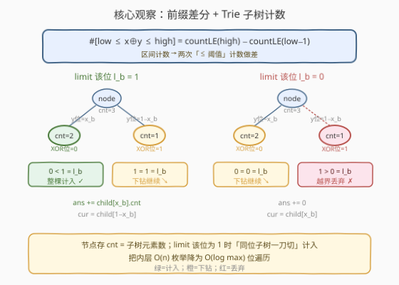
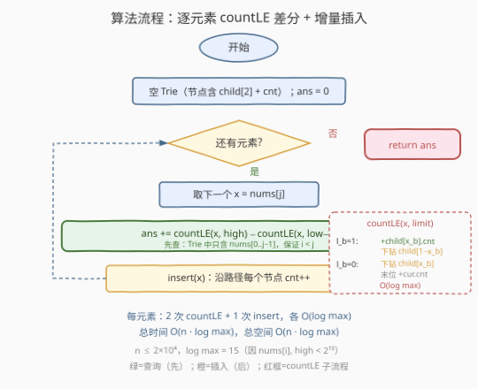
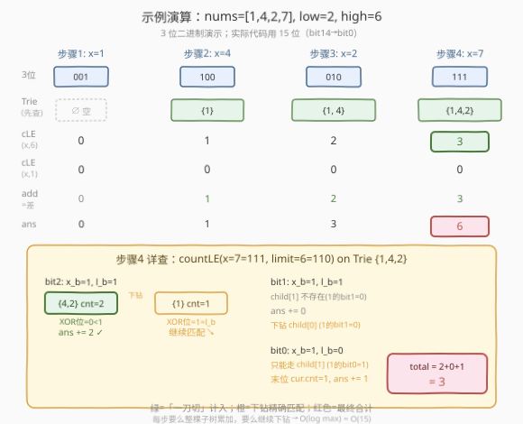

# 统计异或值在范围内的数对有多少

- **题目名称**：统计异或值在范围内的数对有多少
- **链接**：[1803. 统计异或值在范围内的数对有多少](https://leetcode.cn/problems/count-pairs-with-xor-in-a-range/)
- **难度**：困难
- **标签**：字典树、位运算、数组

## 1. 题目概述

给定一个下标从 0 开始的整数数组 `nums`，以及两个整数 `low` 和 `high`。求满足以下条件的**漂亮数对**数目：

- 数对 $(i, j)$ 满足 $0 \le i < j < \text{nums.length}$；
- $\text{low} \le \text{nums}[i] \oplus \text{nums}[j] \le \text{high}$。

其中 $\oplus$ 表示按位异或。

**示例 1**：

```text
输入：nums = [1,4,2,7], low = 2, high = 6
输出：6
解释：所有漂亮数对 (i, j) 列出如下：
  - (0, 1): nums[0] XOR nums[1] = 5
  - (0, 2): nums[0] XOR nums[2] = 3
  - (0, 3): nums[0] XOR nums[3] = 6
  - (1, 2): nums[1] XOR nums[2] = 6
  - (1, 3): nums[1] XOR nums[3] = 3
  - (2, 3): nums[2] XOR nums[3] = 5
```

**示例 2**：

```text
输入：nums = [9,8,4,2,1], low = 5, high = 14
输出：8
```

**约束条件**：

- $1 \le \text{nums.length} \le 2 \times 10^4$
- $1 \le \text{nums}[i] \le 2 \times 10^4$
- $1 \le \text{low} \le \text{high} \le 2 \times 10^4$

> 💡 **关键观察**：题目本质是「数对计数」——求有多少对 $(i, j)$ 的异或值落在 $[\text{low}, \text{high}]$ 内。区间计数问题的经典套路是**前缀差分**：$\#\{\text{low} \le x \oplus y \le \text{high}\} = \#\{x \oplus y \le \text{high}\} - \#\{x \oplus y \le \text{low} - 1\}$。于是只需解决一个子问题：**给定 $x$ 和阈值 $\text{limit}$，在已插入的数中统计有多少 $y$ 满足 $x \oplus y \le \text{limit}$**。这正是 [1707. 与数组中元素的最大异或值](../1701-1800/1707_与数组中元素的最大异或值.md) 的二进制 Trie 升级版——Trie 不再做「贪心求最大异或」，而是利用**子树大小**做「按位累加计数」。

---

## 2. 解题思路

### 2.1 暴力思路：枚举所有数对

双重循环枚举所有 $i < j$，计算 $\text{nums}[i] \oplus \text{nums}[j]$，判断是否在 $[\text{low}, \text{high}]$ 内。时间复杂度 $O(n^2)$，$n = 2 \times 10^4$ 时约 $2 \times 10^8$ 次运算，超时。

> ⚠️ **症结**：每个数对的异或都要现算，且无法利用「同一数与多个伙伴的异或之间存在位结构关联」。突破口是把「判定单个异或值是否在区间内」改为「在二进制 Trie 上**一次性统计**满足 $x \oplus y \le \text{limit}$ 的 $y$ 的个数」——把 $O(n)$ 的内层循环降为 $O(\log \max)$。

### 2.2 核心观察：前缀差分 + Trie 子树计数



本题的关键转换分两步：

**第一步：区间差分降为「$\le$ 阈值」计数。**

$$\boxed{\#\{\text{low} \le x \oplus y \le \text{high}\} = \#\{x \oplus y \le \text{high}\} - \#\{x \oplus y \le \text{low} - 1\}}$$

由于 $\text{low} \ge 1$，$\text{low} - 1 \ge 0$，两个阈值都非负，可统一处理。这样只需实现一个 `countLE(x, limit)`：在 Trie 中统计已插入的 $y$ 满足 $x \oplus y \le \text{limit}$ 的个数。

**第二步：在二进制 Trie 上按位累加计数。**

Trie 的每个节点额外维护 `cnt`——**该节点子树中已插入元素的总数**。从高位到低位同时扫描 $x$ 和 $\text{limit}$ 的每一位，设当前位 $x$ 的位为 $x_b$、$\text{limit}$ 的位为 $l_b$：

| $l_b$ | 含义 | 操作 |
|-------|------|------|
| $1$ | 该位上 $x \oplus y$ 取 $0$ 即**严格小于** $\text{limit}$，取 $1$ 才**可能相等** | 把「取 $0$」的分支（即 $y$ 的该位 $= x_b$ 的子树）整棵计入答案（`ans += child[x_b].cnt`），再下钻到「取 $1$」的分支（$y$ 的该位 $= 1 - x_b$）继续精确匹配 |
| $0$ | 该位上 $x \oplus y$ 必须 $= 0$ 才不越界，取 $1$ 则已超 $\text{limit}$ | 不计入任何数，直接下钻到「取 $0$」的分支（$y$ 的该位 $= x_b$） |

走完所有位后，若停在某个非空节点，说明存在 $y$ 使 $x \oplus y$ **恰好等于** $\text{limit}$，把该节点 `cnt` 也计入。

$$\boxed{\text{每步要么整棵子树「一刀切」计入，要么继续下钻精确匹配} \;\Rightarrow\; \text{单次 countLE} = O(\log \max)}$$

> 💡 **为什么「整棵计入」是对的？** 当 $l_b = 1$ 且我们选择 $y$ 的该位 $= x_b$（使异或位 $= 0 < 1 = l_b$）时，**无论 $y$ 后续低位是什么**，$x \oplus y$ 在这一位就已经严格小于 $\text{limit}$，高位又相等，因此 $x \oplus y < \text{limit}$ 必然成立。整棵子树全部合格，无需逐个检查——这正是 Trie 把 $O(n)$ 降为 $O(\log \max)$ 的根本所在。

> ⚠️ **与 1707 的区别**：1707 在 Trie 上走「贪心取相反位」求**最大异或值**（每层只走一条路）；本题在 Trie 上走「按 limit 分支」做**区间计数**（每层可能整棵子树累加 + 下钻一条）。两者共用同一套二进制 Trie 骨架，但节点多了 `cnt` 字段，查询逻辑从「贪心」变为「分情况累加」。

### 2.3 算法流程图



**步骤**：

1. **初始化**空 Trie（节点含 `child[0/1]` 与 `cnt`）。
2. **遍历** `nums` 中每个 $x$（按原始顺序）：
   - 查询 `add = countLE(x, high) - countLE(x, low - 1)`，累加到 `ans`。
   - 把 $x$ **插入** Trie（沿路径每个节点 `cnt++`）。
3. **返回** `ans`。

> 💡 **为什么「先查后插」？** 数对要求 $i < j$。遍历到 $x = \text{nums}[j]$ 时，Trie 中只含 $\text{nums}[0..j-1]$，查询得到的都是 $i < j$ 的合法数对，不重不漏。若先插后查，会把 $y = x$ 自身（异或为 $0$）也算进去，且 $i = j$ 不合法。

### 2.4 示例演算

以示例 1 `nums = [1,4,2,7]`、`low = 2, high = 6` 为例（用 3 位二进制演示，实际代码用 15 位）：



| 数 | 3 位二进制 |
|----|-----------|
| 1  | 001 |
| 4  | 100 |
| 2  | 010 |
| 7  | 111 |

**步骤 1**：$x = 1$（`001`），Trie 为空。
- `countLE(1, 6) = 0`，`countLE(1, 1) = 0`，`add = 0`。`ans = 0`。
- 插入 `1`。

**步骤 2**：$x = 4$（`100`），Trie $= \{1\}$。
- `countLE(4, 6)`：$4 \oplus 1 = 5 \le 6$ ✓ → $1$。
- `countLE(4, 1)`：$4 \oplus 1 = 5 \le 1$? ✗ → $0$。
- `add = 1 - 0 = 1`。`ans = 1`。
- 插入 `4`。

**步骤 3**：$x = 2$（`010`），Trie $= \{1, 4\}$。
- `countLE(2, 6)`：$2 \oplus 1 = 3 \le 6$ ✓，$2 \oplus 4 = 6 \le 6$ ✓ → $2$。
- `countLE(2, 1)`：$2 \oplus 1 = 3 \le 1$? ✗，$2 \oplus 4 = 6 \le 1$? ✗ → $0$。
- `add = 2 - 0 = 2`。`ans = 3`。
- 插入 `2`。

**步骤 4**：$x = 7$（`111`），Trie $= \{1, 4, 2\}$。
- `countLE(7, 6)`：$7 \oplus 1 = 6$ ✓，$7 \oplus 4 = 3$ ✓，$7 \oplus 2 = 5$ ✓ → $3$。
- `countLE(7, 1)`：$7 \oplus 1 = 6 \le 1$? ✗，$7 \oplus 4 = 3 \le 1$? ✗，$7 \oplus 2 = 5 \le 1$? ✗ → $0$。
- `add = 3 - 0 = 3`。`ans = 6`。
- 插入 `7`。

**最终答案**：`6` ✓

> 💡 **看 Trie 如何「一刀切」**：以步骤 4 的 `countLE(7, 6)` 为例，$x = 111$、$\text{limit} = 110$。最高位 $x_b = 1, l_b = 1$ → $y$ 最高位 $= 1$ 的子树（含 $y = 4, 2$，异或最高位 $= 0 < 1$）**整棵计入**（得 2 个），再下钻 $y$ 最高位 $= 0$ 的子树（含 $y = 1$）继续。第二位 $x_b = 1, l_b = 1$ → $y = 1$（`001`）第二位 $= 0 = x_b$，整棵计入（得 1 个）。合计 $3$，无需逐个算异或。这就是把 $O(n)$ 内层循环降为 $O(\log \max)$ 的关键。

---

## 3. 参考代码

### C++

```cpp
class Solution {
    struct Node {
        Node* child[2] = {nullptr, nullptr};
        int cnt = 0;
    };

    static const int HIGH_BIT = 14;

    void insert(Node* root, int x) {
        Node* cur = root;
        for (int i = HIGH_BIT; i >= 0; i--) {
            int b = (x >> i) & 1;
            if (!cur->child[b]) cur->child[b] = new Node();
            cur = cur->child[b];
            cur->cnt++;
        }
    }

    int countLE(Node* root, int x, int limit) {
        Node* cur = root;
        int total = 0;
        for (int i = HIGH_BIT; i >= 0; i--) {
            if (!cur) break;
            int xb = (x >> i) & 1;
            int lb = (limit >> i) & 1;
            if (lb == 1) {
                if (cur->child[xb]) total += cur->child[xb]->cnt;
                cur = cur->child[1 - xb];
            } else {
                cur = cur->child[xb];
            }
        }
        if (cur) total += cur->cnt;
        return total;
    }

public:
    int countPairs(vector<int>& nums, int low, int high) {
        Node* root = new Node();
        int ans = 0;
        for (int x : nums) {
            ans += countLE(root, x, high) - countLE(root, x, low - 1);
            insert(root, x);
        }
        return ans;
    }
};
```

### Python

```python
class Solution:
    def countPairs(self, nums: List[int], low: int, high: int) -> int:
        HIGH_BIT = 14

        class TrieNode:
            __slots__ = ('child', 'cnt')
            def __init__(self):
                self.child = [None, None]
                self.cnt = 0

        root = TrieNode()

        def insert(x):
            cur = root
            for i in range(HIGH_BIT, -1, -1):
                b = (x >> i) & 1
                if not cur.child[b]:
                    cur.child[b] = TrieNode()
                cur = cur.child[b]
                cur.cnt += 1

        def countLE(x, limit):
            cur = root
            total = 0
            for i in range(HIGH_BIT, -1, -1):
                if not cur:
                    break
                xb = (x >> i) & 1
                lb = (limit >> i) & 1
                if lb == 1:
                    if cur.child[xb]:
                        total += cur.child[xb].cnt
                    cur = cur.child[1 - xb]
                else:
                    cur = cur.child[xb]
            if cur:
                total += cur.cnt
            return total

        ans = 0
        for x in nums:
            ans += countLE(x, high) - countLE(x, low - 1)
            insert(x)
        return ans
```

> 💡 **实现细节**：① `HIGH_BIT = 14`：约束 $\text{nums}[i], \text{high} \le 2 \times 10^4 < 2^{15}$，最高有效位是 `bit14`，故从 `bit14 → bit0` 共 15 层。② `low - 1` 可能为 $0$，`countLE(x, 0)` 统计 $x \oplus y = 0$ 即 $y = x$ 的个数——由于「先查后插」，当前 $x$ 尚未入 Trie，只有**之前出现过的相同值**会被算入，恰好对应合法的 $i < j$ 数对。③ `if (cur) total += cur->cnt`：走完全部位后，停在的节点代表 $x \oplus y = \text{limit}$ 的精确匹配，需补计入。

> ⚠️ **C++ 注意**：`Node` 用 `new` 分配，LeetCode 环境无需手动释放。若面试要求无内存泄漏，可改用 `vector<Node>` 预分配节点池（最坏 $n \cdot 15$ 个节点），以索引代替指针。

---

## 4. 复杂度分析

| 维度 | 复杂度 | 说明 |
|------|--------|------|
| 时间 | $O(n \cdot \log \max)$ | 每个元素执行 2 次 `countLE`（各 $O(\log \max)$）+ 1 次 `insert`（$O(\log \max)$），共 $3n$ 次位遍历；$\log \max = 15$ |
| 空间 | $O(n \cdot \log \max)$ | Trie 最坏 $n \cdot 15$ 个节点（大量前缀共享后实际更少）；每个节点存 2 个指针 + 1 个 `int` |

> 💡 **与暴力对比**：暴力 $O(n^2) \approx 4 \times 10^8$；本解法 $\approx 2 \times 10^4 \times 45 \approx 9 \times 10^5$，快约 $400$ 倍。核心增益来自 Trie 的「整棵子树一刀切」——把内层 $O(n)$ 枚举降为 $O(\log \max)$ 位遍历。

> ⚠️ **为什么是 15 层？** $2 \times 10^4 < 2^{15} = 32768$，最高有效位是 `bit14`。若取 `HIGH_BIT = 15`（16 层）也对，只是多一层恒为 `0` 的前缀，浪费一点空间但不影响正确性。

---

## 5. 扩展：另一种思路——数位 DP

`countLE(x, limit)` 也可不建 Trie，改用**数位 DP**：从高位到低位记忆化搜索，状态为 `(位号, 是否已严格小于 limit)`，对每个 $x$ 单独算。但这样每来一个 $x$ 都要重算一遍 $O(\log \max)$ 状态，且无法复用「已插入元素」的聚合信息——总复杂度仍是 $O(n \cdot \log \max)$，但常数更大、实现更绕。

Trie 的优势在于把「已插入的 $y$」按位前缀**聚合成树**，`cnt` 字段把「 subtree 内有多少 $y$」预存好，查询时直接累加，省去逐个判定。这与 [315. 计算右侧小于当前元素的个数](../0301-0400/315_计算右侧小于当前元素的个数.md) 中树状数组「前缀和预聚合」思想同源——都是用数据结构把 $O(n)$ 的统计降为 $O(\log n)$。

> 💡 **更一般的「异或计数」**：若把问题改为「$x \oplus y = k$ 的数对数」，则无需 `limit` 分支，只需在 Trie 上沿 $x \oplus k$ 的位走一条路径，终点 `cnt` 即答案。本题的 `countLE` 是其区间推广。

---

## 6. 面试要点

**Q1：为什么要做 `high` 和 `low - 1` 的差分？直接统计区间不行吗？**

> 异或的值域是离散的，**区间 $[\text{low}, \text{high}]$ 的计数**等价于「$\le \text{high}$ 的计数」减「$\le \text{low} - 1$ 的计数」。这样只需实现一个 `countLE(x, limit)` 子问题，避免在 Trie 上同时维护上下界两个游标（实现复杂且易错）。这是「前缀和思想」在计数问题上的标准应用——和「至多 K」转化（[1248. 统计优美子数组](../1201-1300/1248_统计优美子数组.md)）同源。

**Q2：`countLE` 里 `lb == 1` 时为什么能把整棵 `child[xb]` 子树计入？**

> 该位 $l_b = 1$，若 $y$ 的该位 $= x_b$，则 $x \oplus y$ 在该位 $= 0 < 1 = l_b$；又因高位已精确相等，所以**无论低位如何**，$x \oplus y$ 在这一位就严格小于 $\text{limit}$，整体必然 $x \oplus y < \text{limit}$。整棵子树全部合格，用预存的 `cnt` 一次性累加即可。这正是 Trie 把 $O(n)$ 降为 $O(\log \max)$ 的根本。

**Q3：为什么必须「先查后插」？反过来会怎样？**

> 数对要求 $i < j$。遍历到 $\text{nums}[j]$ 时，Trie 应只含 $\text{nums}[0..j-1]$，这样查到的每个 $y$ 都对应 $i < j$ 的合法数对。若先插后查，$y = x$ 自身（异或 $= 0$）会被算入，且 $i = j$ 不合法，导致多算。对 `low = 1` 的情况，$x \oplus x = 0 < \text{low}$ 本就被 `low - 1` 减掉，但「先查后插」从源头避免任何歧义，最稳妥。

**Q4：`HIGH_BIT` 取 14 依据是什么？取大了或小了会怎样？**

> 约束 $\text{nums}[i], \text{high} \le 2 \times 10^4 < 2^{15}$，最高有效位是 `bit14`，故 `HIGH_BIT = 14`（共 15 层）。取大（如 15）多一层恒 `0` 前缀，正确但浪费空间；取小（如 13）会丢掉 `bit14`，对所有 $\ge 2^{14} = 16384$ 的数判定错误。面试时按约束上界取「$\lceil \log_2(\max) \rceil - 1$」即可。

**Q5：本题与 1707、421 的核心区别？**

> 三者共用二进制 Trie 骨架，但**查询目标不同**：[421](../0401-0500/421_数组中两个数的最大异或值.md) 走「贪心取相反位」求**最大异或值**；[1707](../1701-1800/1707_与数组中元素的最大异或值.md) 在 421 基础上叠加「离线排序 + 增量建树」处理 $\le m$ 约束，仍求最大异或值；本题在 Trie 节点上**额外维护 `cnt` 子树大小**，做「按 $\text{limit}$ 位分支累加」的**区间计数**，目标是「个数」而非「最值」。可记忆为：421/1707 是 Trie 上的**优化**问题，1803 是 Trie 上的**计数**问题。

> 💡 **一句话总结**：区间计数 = 两次 `countLE` 差分；`countLE` 在带 `cnt` 的二进制 Trie 上按位走——`limit` 该位为 1 则「同位子树一刀切」计入并下钻「异位」，为 0 则只能下钻「同位」。先查后插保证 $i < j$。

---

## 7. 同类练习题

- [421. 数组中两个数的最大异或值](https://leetcode.cn/problems/maximum-xor-of-two-numbers-in-an-array/)（[题解](../0401-0500/421_数组中两个数的最大异或值.md)）：二进制 Trie 求最大异或的母题——掌握其「逐位贪心取相反位」后，本题把贪心查询换成「按 limit 分支 + cnt 累加」即可
- [1707. 与数组中元素的最大异或值](https://leetcode.cn/problems/maximum-xor-with-an-element-from-array/)（[题解](../1701-1800/1707_与数组中元素的最大异或值.md)）：Trie + 离线排序求带约束最大异或——与本题共用二进制 Trie 骨架，对比「求最值」与「做计数」两种查询逻辑
- [1938. 查询最大基因差](https://leetcode.cn/problems/maximum-genetic-difference-query/)：树上的离线 Trie 查询——把查询挂到树节点上 DFS 回溯增删 Trie，是 1707 思想在树上的推广，理解后更能体会 Trie 的灵活复用
- [1442. 形成两个异或相等数组的三元组数目](https://leetcode.cn/problems/count-triplets-that-can-form-two-arrays-of-equal-xor/)：异或前缀性质 + 计数——利用 $a = b \Leftrightarrow a \oplus b = 0$ 即前缀异或相等，把三元组计数转为同值下标对计数，是异或计数问题的另一变体
- [208. 实现 Trie（前缀树）](https://leetcode.cn/problems/implement-trie-prefix-tree/)（[题解](../0201-0300/208_实现Trie.md)）：字符串 Trie 基础模板——本题把字符换为 0/1 位并加上 `cnt`，是理解二进制 Trie 的前置知识
