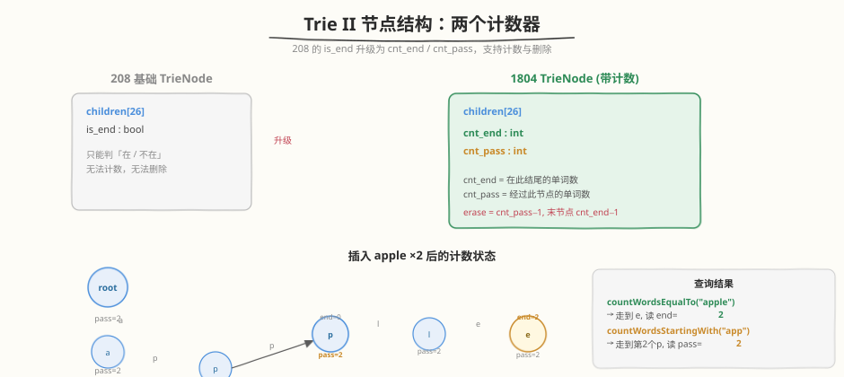
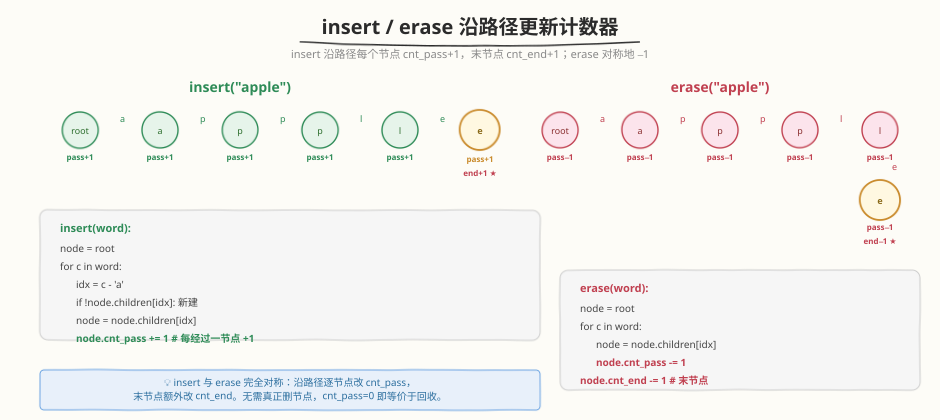

# 实现 Trie II（前缀树）

- **题目名称**：实现 Trie II（前缀树）
- **链接**：[1804. 实现 Trie II（前缀树）](https://leetcode.cn/problems/implement-trie-ii-prefix-tree/)
- **难度**：中等
- **标签**：字典树、设计、哈希表

## 1. 题目概述

在 [208. 实现 Trie (前缀树)](../0201-0300/208_实现Trie.md) 的基础上增强：不仅支持插入与前缀查找，还要支持**计数**（统计某单词出现次数、统计某前缀下单词数）与**删除**。需要实现 `Trie2` 类：

- `Trie2()`：初始化前缀树。
- `void insert(word)`：插入单词 `word`（允许重复插入）。
- `int countWordsEqualTo(word)`：返回 `word` 在树中的出现次数。
- `int countWordsStartingWith(prefix)`：返回以 `prefix` 为前缀的单词总数。
- `void erase(word)`：从树中删除一个 `word` 的实例（保证 `word` 存在）。

**示例 1**：

```text
输入：
["Trie2", "insert", "insert", "countWordsEqualTo", "countWordsStartingWith",
 "erase", "countWordsEqualTo", "countWordsStartingWith", "erase", "countWordsStartingWith"]
[[], ["apple"], ["apple"], ["apple"], ["app"],
 ["apple"], ["apple"], ["app"], ["apple"], ["app"]]
输出：[null, null, null, 2, 2, null, 1, 1, null, 0]

解释：
trie2.insert("apple");                    // 插入 "apple"
trie2.insert("apple");                    // 再插入一个 "apple"
trie2.countWordsEqualTo("apple");         // 返回 2（两个 "apple"）
trie2.countWordsStartingWith("app");      // 返回 2（"app" 是 "apple" 前缀）
trie2.erase("apple");                     // 删除一个 "apple"
trie2.countWordsEqualTo("apple");         // 返回 1
trie2.countWordsStartingWith("app");      // 返回 1
trie2.erase("apple");                     // 再删除一个 "apple"
trie2.countWordsStartingWith("app");      // 返回 0（已无单词以 "app" 开头）
```

**约束条件**：

- $1 \leq \text{word.length}, \text{prefix.length} \leq 1000$
- `word` 和 `prefix` 仅由小写英文字母组成
- `insert`、`countWordsEqualTo`、`countWordsStartingWith`、`erase` 的总调用次数不超过 $3 \times 10^4$
- `erase` 调用时保证 `word` 在前缀树中存在

---

## 2. 解题思路

### 2.1 暴力思路

最直白的做法是不用 Trie，直接用一个 `HashMap<string, int>` 记录每个单词的出现次数：

- `insert`：`cnt[word] += 1`
- `countWordsEqualTo`：返回 `cnt[word]`
- `erase`：`cnt[word] -= 1`
- `countWordsStartingWith`：**遍历整个 map**，逐个判断 key 是否以 `prefix` 开头，累加计数

> ⚠️ `countWordsStartingWith` 退化到 $O(N \cdot L)$（$N$ 为不同单词数，$L$ 为单词平均长度）。当单词数很多、前缀查询频繁时明显变慢。这正是 Trie 的用武之地。

### 2.2 核心观察：节点维护两个计数器



208 的节点只有一个布尔标记 `is_end`，只能回答「在 / 不在」。要支持**计数**与**删除**，把 `is_end` 升级为两个整数计数器：

| 字段 | 含义 | 维护时机 |
|------|------|----------|
| `cnt_end` | 在该节点结尾的单词数 | `insert` 末节点 +1，`erase` 末节点 −1 |
| `cnt_pass` | 经过该节点的单词数（即以「根到该节点路径」为前缀的单词总数） | `insert` / `erase` 路径上每个节点 ±1 |

> 💡 **`cnt_pass` 就是 `countWordsStartingWith` 的答案**：走到前缀对应节点，直接读 `cnt_pass`，无需遍历子树。这是从 $O(N \cdot L)$ 优化到 $O(L)$ 的关键。

### 2.3 算法流程图



`insert` 与 `erase` 完全对称——沿单词路径逐字符前进，对沿途每个节点改 `cnt_pass`，末节点额外改 `cnt_end`：

```text
insert(word):
  node = root
  for c in word:
    idx = c - 'a'
    if node.children[idx] 为空: 新建子节点
    node = node.children[idx]
    node.cnt_pass += 1            # 每经过一节点 +1
  node.cnt_end += 1               # 末节点 +1

erase(word):
  node = root
  for c in word:
    node = node.children[idx]
    node.cnt_pass -= 1            # 每经过一节点 -1
  node.cnt_end -= 1               # 末节点 -1

countWordsEqualTo(word):
  node = 走到 word 末节点（走不到返回 0）
  return node.cnt_end

countWordsStartingWith(prefix):
  node = 走到 prefix 末节点（走不到返回 0）
  return node.cnt_pass
```

> ⚠️ `erase` 题目保证 `word` 存在，因此无需额外判空。若需鲁棒处理，可在 `erase` 前先 `countWordsEqualTo` 判 $>0$。

### 2.4 示例演算


逐步追踪示例 1：只插入 `apple` ×2，观察 `apple` 末端节点 `e`（`end / pass`）与第 2 个 `p` 节点（`pass`，即 `countWordsStartingWith("app")` 的读取点）随 `erase` 递减：

| 步 | 操作 | e 节点 (end/pass) | 第 2 个 p (pass) | 查询结果 |
|----|------|-------------------|------------------|----------|
| 1 | insert("apple") | 1 / 1 | 1 | — |
| 2 | insert("apple") | 2 / 2 | 2 | — |
| 3 | countWordsEqualTo("apple") | 读 end=2 | — | **2** |
| 4 | countWordsStartingWith("app") | — | 读 pass=2 | **2** |
| 5 | erase("apple") | 1 / 1 | 1 | — |
| 6 | countWordsEqualTo("apple") | 读 end=1 | — | **1** |
| 7 | countWordsStartingWith("app") | — | 读 pass=1 | **1** |
| 8 | erase("apple") | 0 / 0 | 0 | — |
| 9 | countWordsStartingWith("app") | — | 读 pass=0 | **0** |

> 💡 `countWordsStartingWith("app")` 走到第 2 个 `p` 节点直接读 `cnt_pass`——尽管从未插入过单词 `"app"`，该节点仍存在于 `"apple"` 的路径上，`pass` 反映的是「经过此节点的单词数」=2。两次 `erase` 后 `pass` 归 0，等价于该前缀已无单词。

---

## 3. 参考代码

### C++

```cpp
class Trie2 {
    struct TrieNode {
        TrieNode* children[26] = {};
        int cnt_end  = 0;
        int cnt_pass = 0;
    };

    TrieNode* root;

    TrieNode* _find(const string& s) {
        TrieNode* node = root;
        for (char c : s) {
            int idx = c - 'a';
            if (!node->children[idx])
                return nullptr;
            node = node->children[idx];
        }
        return node;
    }

  public:
    Trie2() : root(new TrieNode()) {}

    void insert(string word) {
        TrieNode* node = root;
        for (char c : word) {
            int idx = c - 'a';
            if (!node->children[idx])
                node->children[idx] = new TrieNode();
            node = node->children[idx];
            node->cnt_pass += 1;
        }
        node->cnt_end += 1;
    }

    int countWordsEqualTo(string word) {
        TrieNode* node = _find(word);
        return node ? node->cnt_end : 0;
    }

    int countWordsStartingWith(string prefix) {
        TrieNode* node = _find(prefix);
        return node ? node->cnt_pass : 0;
    }

    void erase(string word) {
        TrieNode* node = root;
        for (char c : word) {
            int idx = c - 'a';
            node = node->children[idx];
            node->cnt_pass -= 1;
        }
        node->cnt_end -= 1;
    }
};
```

### Python

```python
class Trie2:
    class Node:
        __slots__ = ("children", "cnt_end", "cnt_pass")
        def __init__(self):
            self.children = {}
            self.cnt_end = 0
            self.cnt_pass = 0

    def __init__(self):
        self.root = self.Node()

    def _find(self, s: str):
        node = self.root
        for c in s:
            if c not in node.children:
                return None
            node = node.children[c]
        return node

    def insert(self, word: str) -> None:
        node = self.root
        for c in word:
            if c not in node.children:
                node.children[c] = self.Node()
            node = node.children[c]
            node.cnt_pass += 1
        node.cnt_end += 1

    def countWordsEqualTo(self, word: str) -> int:
        node = self._find(word)
        return node.cnt_end if node else 0

    def countWordsStartingWith(self, prefix: str) -> int:
        node = self._find(prefix)
        return node.cnt_pass if node else 0

    def erase(self, word: str) -> None:
        node = self.root
        for c in word:
            node = node.children[c]
            node.cnt_pass -= 1
        node.cnt_end -= 1
```

---

## 4. 复杂度分析

| 维度 | 复杂度 | 说明 |
|------|--------|------|
| insert 时间 | $O(L)$ | $L$ = 单词长度，逐字符走 + 改计数 |
| countWordsEqualTo 时间 | $O(L)$ | 走到末节点读 `cnt_end` |
| countWordsStartingWith 时间 | $O(L)$ | 走到前缀末节点读 `cnt_pass`，无需遍历子树 |
| erase 时间 | $O(L)$ | 同 insert，逐字符改计数 |
| 空间 | $O(N \cdot L)$ | $N$ = 单词实例数，最坏无共享前缀；实际因前缀共享远小于此 |

> 与暴力 `HashMap` 方案对比：`countWordsStartingWith` 从 $O(N \cdot L)$ 降到 $O(L)$，是本题的核心收益。

---

## 5. 扩展：物理删除 vs 逻辑删除

本解法 `erase` 只递减计数器，**不真正释放节点**（逻辑删除）。讨论两种策略：

| 策略 | 优点 | 缺点 |
|------|------|------|
| **逻辑删除**（本解法） | 实现简单，`erase` 仍是 $O(L)$；后续 `insert` 同前缀可直接复用节点 | 计数归零的「死节点」仍占内存 |
| **物理删除** | 内存随删除释放 | `erase` 需回溯判断子节点是否全空再 `delete`，实现复杂；频繁插删时反复分配释放反增开销 |

> ⚠️ 题目保证 `erase` 时 `word` 存在，逻辑删除下 `cnt_pass` / `cnt_end` 不会变负。若要支持「删除不存在单词」的鲁棒场景，需先 `countWordsEqualTo` 判 $>0$ 再执行递减。生产环境（如自动补全词典）通常采用逻辑删除 + 惰性回收：定期遍历清理 `cnt_pass == 0` 的子树。

---

## 6. 面试要点

1. **和 208 基础 Trie 的核心区别是什么？**

   - 208 用单个 `is_end` 布尔，只能判「在 / 不在」。
   - 1804 用 `cnt_end`（结尾计数）+ `cnt_pass`（经过计数）两个整数，支持重复插入计数、前缀计数与删除。

2. **`countWordsStartingWith` 为什么是 $O(L)$ 而非 $O(N)$？**

   - `cnt_pass` 在 `insert` / `erase` 时**沿路径预聚合**好了：每个节点的 `cnt_pass` 即「以根到该节点路径为前缀的单词总数」。
   - 查询时走到前缀末节点直接读值，无需遍历子树——本质是用空间换时间 + 增量维护。

3. **`erase` 为什么不需要真正删除节点？**

   - 题目保证 `word` 存在，递减后计数非负。
   - `cnt_pass = 0` 的节点等价于「不存在」：查询走不到（因为 `insert` 时才会创建/经过），即便残留也对正确性无影响。
   - 物理删除需回溯判空 + 释放，复杂且易错，面试中除非被追问内存优化，否则逻辑删除即可。

4. **如果 `erase` 一个不存在的单词会怎样？如何防御？**

   - 本解法会 `children[c]` 越界 / 计数变负，产生错误。
   - 防御：`erase` 前先 `if countWordsEqualTo(word) == 0: return`，或 `erase` 内每步判 `children[idx]` 是否存在。

5. **用数组 `children[26]` 还是 `dict` / `unordered_map`？**

   - 纯小写字母：数组查找 $O(1)$ 且最快，但每个节点固定 26 指针，稀疏时空间浪费。
   - Unicode / 字符集大：用 `dict` 按需分配，空间省。
   - 与 208 的取舍完全一致，1804 只是在节点上多了两个 `int` 字段。

---

## 7. 同类练习题

- [208. 实现 Trie (前缀树)](https://leetcode.cn/problems/implement-trie-prefix-tree/)：Trie 基础模板，本题为它的计数增强版，`is_end` → `cnt_end`/`cnt_pass`
- [211. 添加与搜索单词 - 数据结构设计](https://leetcode.cn/problems/design-add-and-search-words-data-structure/)：Trie + 通配符 `.` 的 DFS 匹配，节点结构同 208
- [677. 键值映射](https://leetcode.cn/problems/map-sum-pairs/)：Trie 节点存 `val`，`sum(prefix)` 需前缀聚合——与 `cnt_pass` 同源，可改为「路径上累加 val」
- [648. 单词替换](https://leetcode.cn/problems/replace-words/)：Trie 前缀匹配找最短词根，复用 `_find` 走路径逻辑
- [212. 单词搜索 II](https://leetcode.cn/problems/word-search-ii/)：Trie + DFS 回溯，Trie 作为「待匹配词典」的索引结构
