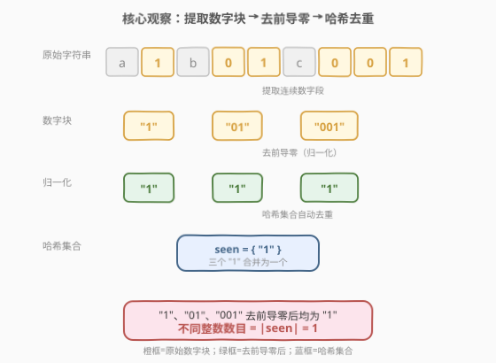
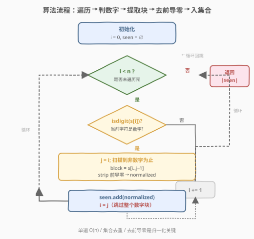
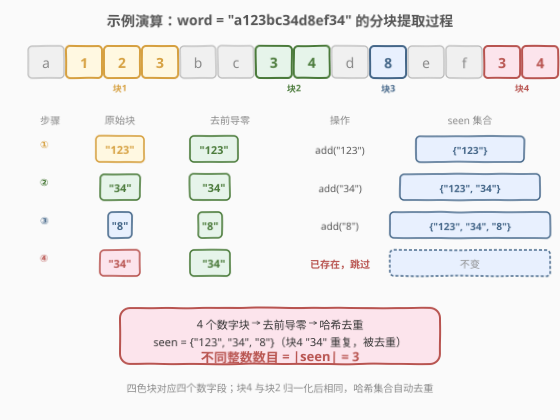

# LeetCode 字符串中不同整数的数目 题解

## 1. 题目概述

- **标题 / 题号**：字符串中不同整数的数目（#1805，easy）
- **链接**：https://leetcode.cn/problems/number-of-different-integers-in-a-string/
- **难度**：简单
- **标签**：字符串、哈希表、模拟

**题意**：给定一个由**小写英文字母和数字**组成的字符串 `word`。将 `word` 中的每个**非数字字符**替换为空格后，你会得到若干由空格分隔的**整数片段**。返回这些整数片段中**不同整数的数目**。

> 两个整数的十进制表示**去掉前导零**后不同，才视为不同整数。例如 `"01"` 和 `"1"` 表示同一个整数。

**示例 1**：

```text
输入：word = "a123bc34d8ef34"
输出：3
解释：非数字字符替换为空格后得到 " 123  34 8  34"。四个整数片段为 123、34、8、34。
      去重后不同的整数为 {123, 34, 8}，共 3 个。
```

**示例 2**：

```text
输入：word = "leet1234code234"
输出：2
解释：整数片段为 1234 和 234，去重后共 2 个。
```

**示例 3**：

```text
输入：word = "a1b01c001"
输出：1
解释：整数片段为 1、01、001。去掉前导零后均为 1，故只有 1 个不同整数。
```

**约束**：

- $1 \le word.length \le 1000$
- `word` 由数字和小写英文字母组成

> 💡 **关键直觉**：这道题的本质是「**字符串分块 → 归一化 → 去重计数**」三步流水线。难点不在分块（扫描数字字符即可），而在**归一化**——必须去掉前导零才能让 `"1"`、`"01"`、`"001"` 被识别为同一个整数。⚠️ 还有一个隐藏陷阱：数字片段最长可达 $1000$ 位，远超 64 位整数范围，**不能直接转 `int`**（C++ 中 `stoi`/`stoll` 会溢出），必须以**字符串形式**去前导零后存入哈希集合。

## 2. 解题思路

### 2.1 暴力思路：正则提取 + 整数转换

朴素做法是用正则表达式 `\d+` 提取所有连续数字片段，转成整数后丢进集合去重。逻辑简单，但有一个**致命陷阱**：`word` 长度可达 $1000$，若整个串都是数字（如 `"1"` × $1000$），对应的整数高达 $10^{999}$，远超 `long long`（$\approx 9.2 \times 10^{18}$）的上限。C++ 中 `stoi` 会抛 `out_of_range` 异常，`stoll` 同理。Python 虽有任意精度整数可兜底，但为保持**语言无关**的通用解法，应避免整数转换。

### 2.2 核心观察：字符串归一化 + 哈希去重



既然"相同整数"的定义是**十进制表示去前导零后相同**，那我们干脆**不转整数**，直接对字符串做归一化——去掉前导零后存入哈希集合。这样：

- `"1"` → 去前导零 → `"1"`
- `"01"` → 去前导零 → `"1"`
- `"001"` → 去前导零 → `"1"`

三者归一化后均为 `"1"`，哈希集合自动去重，最终 $|seen| = 1$。

> 💡 **为什么这不依赖整数大小？** 归一化后存的是**字符串**而非整数，字符串的长度上限就是原始字符串长度（$1000$），哈希与比较的代价是 $O(\text{长度})$，完全可控。这等价于把"大整数相等判定"转化为"字符串相等判定"——而这正是大整数库的底层实现方式。

> ⚠️ **全零串的特殊处理**：若数字片段全为零（如 `"000"`），去前导零后会得到空串 `""`，需特判为 `"0"`。即：保留至少一位数字。这是唯一的边界情况，逻辑上等价于"零的前导零只有一个零本身"。

### 2.3 算法流程图



一次遍历，用双指针 $i$、$j$ 定位每个数字块的边界 $[i, j)$，归一化后入集合，然后 $i$ 跳到 $j$ 继续。非数字字符直接跳过。总复杂度 $O(n)$。

### 2.4 示例演算

以 `word = "a123bc34d8ef34"`（$n = 14$）为例：



| 步骤 | 原始块 | 去前导零 | 操作 | seen 集合 |
|------|--------|----------|------|-----------|
| ① | `"123"` | `"123"` | `add("123")` | `{"123"}` |
| ② | `"34"` | `"34"` | `add("34")` | `{"123", "34"}` |
| ③ | `"8"` | `"8"` | `add("8")` | `{"123", "34", "8"}` |
| ④ | `"34"` | `"34"` | 已存在，跳过 | 不变 |

终值 $|seen| = 3$ → **返回 3** ✓

对照示例 3 `"a1b01c001"`：三个数字块 `"1"`、`"01"`、`"001"` 去前导零后均为 `"1"`，$seen = \{\text{"1"}\}$ → **返回 1** ✓

## 3. 参考代码

### Python（字符串归一化）

```python
class Solution:
    def numDifferentIntegers(self, word: str) -> int:
        seen = set()
        i, n = 0, len(word)
        while i < n:
            if word[i].isdigit():
                j = i
                while j < n and word[j].isdigit():
                    j += 1
                block = word[i:j].lstrip('0')
                seen.add(block if block else '0')
                i = j
            else:
                i += 1
        return len(seen)
```

### C++（字符串归一化）

```cpp
class Solution {
public:
    int numDifferentIntegers(string word) {
        unordered_set<string> seen;
        int n = word.size(), i = 0;
        while (i < n) {
            if (isdigit(word[i])) {
                int j = i;
                while (j < n && isdigit(word[j])) j++;
                int k = i;
                while (k < j - 1 && word[k] == '0') k++;
                seen.insert(word.substr(k, j - k));
                i = j;
            } else {
                i++;
            }
        }
        return seen.size();
    }
};
```

> 💡 **实现细节**：① Python 的 `lstrip('0')` 一行完成去前导零，`block if block else '0'` 处理全零串。② C++ 中 `k < j - 1` 保证至少保留一位（全零时留最后一个 `'0'`），等价于 Python 的 `lstrip` + 空串特判。③ 双指针 $i$、$j$ 定位块边界后 `i = j` 直接跳过整块，避免逐字符推进。④ `isdigit` 判定数字字符，题目保证只含小写字母和数字，无需额外校验。

## 4. 复杂度分析

| 维度 | 复杂度 | 说明 |
|------|--------|------|
| 时间 | $O(n)$ | 单遍遍历，每个字符最多访问一次（$j$ 扫描过的数字字符被 $i = j$ 跳过）；哈希集合插入单次均摊 $O(L)$，所有块长度之和 $\le n$，总插入代价 $O(n)$ |
| 空间 | $O(n)$ | 最坏情况下所有字符都是数字且无重复（如 `"0123456789012…"`），哈希集合存储的字符串总长度 $\le n$ |

> ⚠️ 若改用整数转换（Python 的 `int()`），时间复杂度仍为 $O(n)$（任意精度整数的哈希/比较代价与位数成正比，总位数 $\le n$），但**仅限 Python**。C++ 中整数溢出是该解法的死穴，字符串归一化是唯一通用方案。

## 5. 扩展：正则表达式法与 Python int() 简写

### 5.1 Python `int()` 一行解法

Python 的 `int()` 天然支持任意精度且自动去前导零（`int("001") == 1`），可大幅简化代码：

```python
import re
class Solution:
    def numDifferentIntegers(self, word: str) -> int:
        return len({int(s) for s in re.findall(r'\d+', word)})
```

> 💡 `re.findall(r'\d+', word)` 一步完成分块提取，`int()` 一步完成归一化，集合推导式一步完成去重。三步合一，Pythonic 至极。底层依赖 Python 的任意精度整数，$1000$ 位数字的哈希代价为 $O(1000)$，总时间仍为 $O(n)$。

### 5.2 C++ 正则提取（仍需字符串归一化）

C++ 也可用 `std::regex` 提取数字块，但仍需手动去前导零（无法依赖整数转换）：

```cpp
#include <regex>
class Solution {
public:
    int numDifferentIntegers(string word) {
        unordered_set<string> seen;
        std::regex re("\\d+");
        for (std::sregex_iterator it(word.begin(), word.end(), re), end; it != end; ++it) {
            string s = it->str();
            int k = 0;
            while (k < (int)s.size() - 1 && s[k] == '0') k++;
            seen.insert(s.substr(k));
        }
        return seen.size();
    }
};
```

> ⚠️ `std::regex` 的常数较大（比手写扫描慢一个数量级），竞赛中不推荐。面试时作为"知道有这招"展示即可，主解仍用手写双指针扫描。

> 💡 **大整数处理的通用思路**：当数字超出原生整数范围时，有两种路径——① 用字符串表示并自定义比较/运算（本题的归一化 + 哈希即此思路的最简形态）；② 使用大整数库（Python 的 `int`、Java 的 `BigInteger`、C++ 的第三方库）。[415. 字符串相加](https://leetcode.cn/problems/add-strings/)（[题解](../0401-0500/415_字符串相加.md)）是大整数运算的经典题，用字符串模拟逐位加法，与本题的"字符串当整数"思想一脉相承。

## 6. 面试要点

1. **为什么不能直接用 `stoi`/`stoll` 转整数？**

   > `word` 长度可达 $1000$，若整串都是数字，对应的整数高达 $10^{999}$，远超 `long long` 的 $\approx 9.2 \times 10^{18}$ 上限。C++ 中 `stoi` 会抛 `out_of_range` 异常，`stoll` 同样溢出。必须用字符串归一化绕开整数转换。

2. **去前导零时为什么要保留至少一位？**

   > 全零串（如 `"000"`）去前导零后得空串 `""`，若直接存入集合会与"无数字"混淆，且空串不是合法的整数表示。保留一位即特判为 `"0"`，对应数学上 $0$ 的唯一规范表示。C++ 中 `k < j - 1` 保证至少留一个字符。

3. **字符串归一化后哈希集合的比较代价是多少？**

   > 字符串相等比较和哈希计算都与长度成正比，单次 $O(L)$。但所有数字块长度之和 $\le n$（每个字符最多属于一个块），故总代价 $O(n)$，不影响整体线性复杂度。这与大整数库的底层实现一致——大整数本质上就是"带运算的字符串"。

4. **Python 的 `int()` 为什么不会溢出？**

   > Python 3 的 `int` 是**任意精度整数**（CPython 底层用变长数组存储各位），没有固定位数上限。`int("001")` 自动去前导零得 $1$，`int("0" * 1000)` 得 $0$。代价是哈希/比较与位数成正比，但总复杂度仍为 $O(n)$。这是 Python 在大整数场景的天然优势。

5. **如果字符串中包含负号或小数点呢？**

   > 本题约束只含小写字母和数字，无需处理。若推广到含负号（如 `"-01"`）或小数点（如 `"1.0"` vs `"1.00"`），归一化规则需扩展：负号需单独提取并参与比较，小数需统一精度（去尾随零 + 对齐小数位）。这本质上是在定义一个更复杂的"规范表示"，大整数/大分数库的解析器做的就是这件事。

> 💡 **一句话总结**：双指针扫描提取数字块，`lstrip('0')` 去前导零（全零特判为 `"0"`），字符串入哈希集合去重——全程不转整数，天然规避溢出。

## 同类练习题

| # | 题目 | 与本题的关联 |
|---|------|-------------|
| 1796 | [字符串中第二大的数字](https://leetcode.cn/problems/second-largest-digit-in-a-string/)（[题解](../1701-1800/1796_字符串中第二大的数字.md)） | 同一套"混合字符串中提取数字"的套路，但值域仅 0–9 可用两阈值滚动，本题数字块长度不限需字符串归一化，对照"有限值域"与"无限值域"的不同处理 |
| 8 | [字符串转换整数 atoi](https://leetcode.cn/problems/string-to-integer-atoi/)（[题解](../0001-0100/8_字符串转换整数atoi.md)） | 字符串转整数 + 溢出边界处理，与本题的"为什么不转整数"形成对照——atoi 需转整数且处理溢出，本题用字符串绕开溢出 |
| 415 | [字符串相加](https://leetcode.cn/problems/add-strings/)（[题解](../0401-0500/415_字符串相加.md)） | 大数加法模拟，用字符串表示超长整数并逐位运算，与本题"字符串当整数"的思想一脉相承，是字符串大数运算的经典题 |
| 400 | [第 N 位数字](https://leetcode.cn/problems/nth-digit/)（[题解](../0301-0400/400_第N位数字.md)） | 在无限数字序列中定位第 $N$ 位，按位数分层定位而非提取块，对照"数字与字符串互转"的另一种方向 |
| 168 | [Excel 表列名称](https://leetcode.cn/problems/excel-sheet-column-title/)（[题解](../0001-0100/168_Excel表列名称.md)） | 数字与字符串的双向转换（1-indexed 进制），与本题的"字符串归一化表示整数"对照，体会字符串/数字互转的不同变体 |
